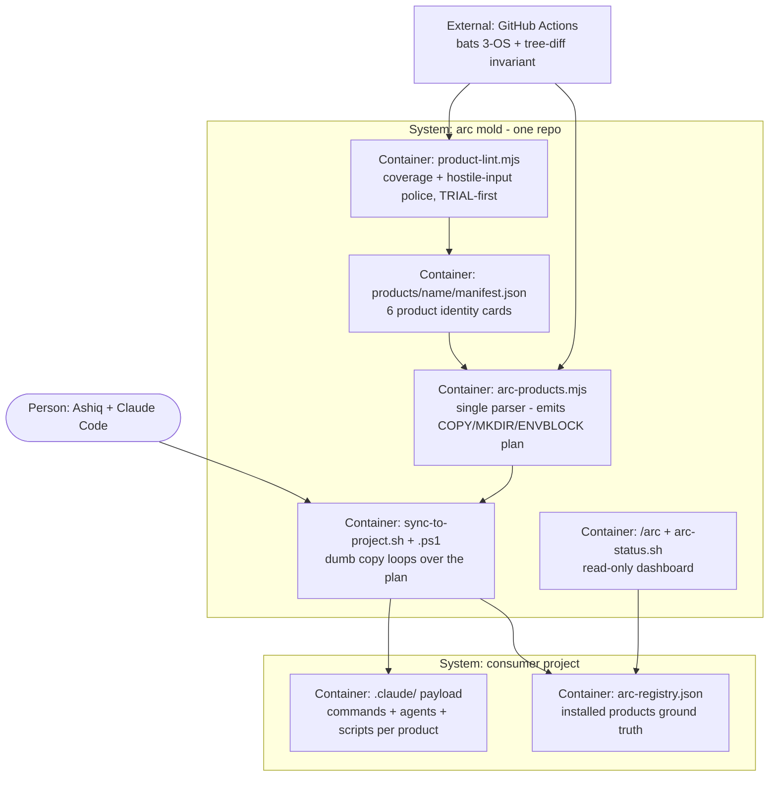

# PLAN.md — arc Orchestrator (Product Monorepo)

> Filled by `/arc-kickoff` 2026-07-17. Design source: `docs/orchestrator-monorepo-plan.md`
> (approved 2026-07-17; provenance: 12-agent analysis — 7 readers, 3 architects, 2 judges).
> Predecessor initiative parked: `docs/archive/PLAN-2026-07-17.md` (ADR-0017).

## Goal

One sentence: for Ashiq (and later, external users of a single product), arc becomes an
orchestrator umbrella over 6 nameable products — each with an enforced manifest boundary,
its own tests, and selective install (`sync-to-project --products council`) — so one product
can be developed, dogfooded, and eventually open-sourced or sold without dragging the other
five, while every existing arc command keeps working unchanged.

## Current state

- **Stack:** bash-3.2/POSIX + Node.js zero-deps (21 arc-* commands, 23 agents, 30 scripts, 6 hooks)
- **Runs via:** `bats -r tests/ --print-output-on-failure` (3-OS CI matrix: ubuntu/windows/macos). **CI is the authority for the full suite** — locally run only the files a change touches. Windows foreground serial-only: `bats -j` needs `flock`/`shlock`, which Git Bash lacks and scoop has no package for, and it exits instantly with an error that reads like a fast pass. Measured 2026-07-18: local full suite ~20-25 min on one OS vs ~13 min on CI across three; the windows CI leg runs the same tests 8.9× slower than ubuntu (674s vs 76s) on process-spawn overhead alone.
- **Entry points:** `.claude/commands/arc-*.md` (kickoff/review/qa/council/git/core) · `.claude/agents/*.md` · sync-to-project.sh/.ps1
- **Core modules:** arc-scan/ tree (adapters+lib, SARIF pipeline) · council-*.mjs (lint/juror/calibrate) · kickoff-lint.mjs (builder gate) · review-ledger.sh (findings ledger) · arc-gates.sh (flat YAML parser)
- **Conventions:** zero-dep Node; flat awk-parseable YAML (arc.gates.yaml); ARC_*/JUROR_* env namespaces; degrade-loud SKIPPED; bash-3.2 portability (portability.bats enforces no mapfile/GNU flags)
- **Hot zones (re-homing blast radius):** scan-summary.bats grep (line 49) · command frontmatter allowed-tools refs · arc.gates.yaml check commands · kickoff-lint.mjs root/PLAN.md/phases assumptions · common.sh sourcers repo-wide (arc-evidence.sh:14, test_helper.bash:6/11/21 — NOT only the arc-scan/ tree) · `/arc-council` command BODY invocations (6, ungated: council-lint validates frontmatter only). **NOT a hot zone** (corrected 2026-07-18): council-lint.mjs:356/384 pin `.claude/commands/` and `.claude/agents/`, which do not move in Phase 3 — editing them breaks a passing gate. phase-03-spec and ADR-0018 carried the same stale claim; both corrected.
- **Known bugs to fix in Phase 0:** .ps1 leaks `.claude/state/` (sh excludes correctly) · both twins leak `scheduled_tasks.lock` · settings.json clobbered on sync
- **Do-not-touch:** docs/archive/ (v2 tracker parked 2026-07-17) · ADRs 0001–0013 remain live · `.claude/state/` per-project working dir
- **Unknowns:** exact agent co-location per product (manifests settle it in Phase 0) · legacy state files (toolcheck-artifact-url lifecycle)

## Success requirements

| REQ | User outcome | Measurable acceptance | Phase | Status |
|---|---|---|---|---|
| REQ-01 | A product installs alone and works | `sync-to-project.sh SCRATCH-DIR --products council` → target contains ONLY core+council files; inside the target, council-lint on a named pass-fixture exits 0 AND on a named fail-fixture exits non-zero (discrimination, not just non-crash) | 0 | validated |
| REQ-02 | Existing consumers see zero change | bare `sync-to-project.sh TARGET` output tree byte-identical to pre-initiative — golden-output bats case green | 0 | validated |
| REQ-03 | Manifests are the enforced source of truth | `product-lint.mjs` exits 2 on any synced file unmapped or double-mapped; all pinned hostile-manifest red fixtures (traversal, dup names, CRLF/BOM, case-collision, empty fields, a control char (TAB/newline) in a path breaking the line protocol) exit 2. Spaces in paths are legal — the TAB delimiter transports them safely (ADR-0015). | 0 | validated |
| REQ-04 | One resolver, no twin drift | both twins consume `arc-products.mjs` plan output; .ps1 no longer copies `.claude/state/`; neither twin copies `scheduled_tasks.lock` — asserted in sync.bats; the ps1 leak + selective-install smoke tests run on the Windows CI leg (pwsh native) and skip on pwsh-less runners (the .sh is the cross-platform path) | 0 | validated |
| REQ-05 | Umbrella status is visible and true | `/arc` renders per-product INSTALLED/HEALTH from `arc-registry.json` (zero file-presence guessing) + the exact install command for absent products | 2 | validated |
| REQ-06 | Partial installs never break hooks | core+council-only install: all 6 hook events run exit 0; any hook fragment whose product dependency (a script or config) is absent degrades with a loud one-line SKIP (never silent, never fatal) — no blanket per-product SKIP spam; hook-tier wall time < 30s measured on the owner's Windows box | 1 | validated |
| REQ-07 | Products have physical boundaries | scripts live under `.claude/scripts/PRODUCT/`; per-product move lands only with byte-diff gate green (installed tree unchanged). **Amended 2026-07-19 (ADR-0021):** the original clause also required tests under `products/NAME/tests/` — dropped, because tests never cross the product boundary (a full sync ships zero `.bats` files and no manifest has a `tests` key), so it specified a boundary around something that never leaves the repo | 3 | validated |
| REQ-08 | Targets know what they have | sync writes `.claude/arc-registry.json` (products, versions, file lists, source commit) into every target; re-sync updates it | 2 | validated |
| REQ-09 | A second real consumer exists | council-alone installed + 1 real council session in one external repo, AND core+plan installed + 1 real kickoff in another (venturemind / InvoiceFly); evidence bundles committed | 4 | validated |
| REQ-10 | Stale files in a consumer tree are visible | `--prune-report` lists every unowned target file with exit 0, including the pre-move copies Phase 3's re-homing left behind; no delete path exists in either twin. Split out of the original REQ-10 and pulled forward to Phase 4 by ADR-0020: Phase 3 re-homed all five products, so every already-installed consumer now carries stale *executable* copies, and Phase 4 is when the first real consumers appear | 4 | validated |
| REQ-11 | Stale files can be quarantined, never deleted | attic mode MOVES unowned files to `.claude/attic/DATE/` and prints the list; still no delete path in either twin (non-negotiable). The other half of the original REQ-10, kept in Phase 5 (ADR-0020) | 5 | active |

## Appetite

**6 weeks part-time, hard cap.** A constraint, not an estimate: blown → cut scope or kill a
phase, never silently extend. No story points anywhere.

**Tier:** L

**Kill criteria:** at 50% appetite burnt (3 weeks), if Phase 1 isn't closed → mandatory
scope-cut conversation (designated cut-line: Phases 3–5; banked outcome = selective install +
manifests + minimal /arc). Any single phase at 2× its appetite → stop, bank shipped phases,
run `/arc-retro`. At 100% → cut or kill, never extend.

## Architecture (C4 concepts, Mermaid flowchart)

## Key decisions (ADR index)

ADRs 0001–0013 (v2 initiative) remain live decisions about this codebase. New this initiative:

| # | Decision | Status |
|---|---|---|
| 0014 | Product monorepo over plugin-suite and registry-in-place | accepted |
| 0015 | JSON manifests read only by one Node resolver; twins consume a line protocol | accepted |
| 0016 | Physical extraction is demand-triggered (first external user/buyer); supersedes ADR-0013's Phase-8 timing clause only | accepted |
| 0017 | v2 world-best initiative parked at ~13% burnt; resume trigger recorded | accepted |
| 0018 | Phase 3 re-homing is incremental per product, council first | accepted |
| 0019 | /arc dashboard ships minimal in Phase 0, registry-backed in Phase 2 | accepted |
| 0020 | Re-homed scripts leave an executable stale copy in consumer trees — REQ-10's report half moves to Phase 4, attic half stays Phase 5 | accepted |
| 0021 | Tests stay centralised in `tests/`; REQ-07 amended to scripts only | accepted |

## Non-negotiables

- Bare `sync-to-project TARGET` output stays byte-identical to pre-initiative — golden-output bats case green on every PR of this initiative (products are additive under the umbrella, ADR-0014); the golden fixture may only be regenerated via a reviewed diff naming the intentional change — silently re-recording it to match new output is a gate failure, not a fix.
- Every new parser (manifest reader, resolver, product-lint) AND the byte-diff/golden-output comparison gates get an adversarial construct-a-breaking-input pass; found holes fixed + pinned as red fixtures BEFORE any FAIL-mode promotion (council v2+v3: 43 holes in gates that passed their own tests).
- Physical re-homing lands only behind the byte-diff gate — defined as: per-file SHA-256 over content with line endings normalized to LF before hashing, executable bit compared separately, symlinks resolved before hashing; installed tree provably unchanged, per product move (ADR-0018).
- Consumer repos: never delete — attic move to `.claude/attic/DATE/` only, report before mutate.
- Every hook/script change ships with a bats test. CI red = no merge on the arc repo.
- Cross-platform: Git Bash (Windows) + ubuntu + macos CI; bash-3.2/POSIX; no new PowerShell logic beyond the dumb copy loop (ADR-0015).
- New lint checks start WARN in the TRIAL set; FAIL promotion only via docs/trial-ledger.md evidence.
- Engine scripts assume no Claude (ADR-0013 writing rule, inherited).
- Every `/arc-phase-done` on this initiative commits an evidence bundle.

## No-gos (explicitly out of scope)

- No separate repos, no plugin/marketplace packaging, no per-product versioning, no SaaS build this cycle — extraction is demand-triggered (ADR-0016).
- No command renames or removals: the 21-command user surface is frozen this cycle.
- No runtime orchestrator daemon — `/arc` is read-only reporting; Claude Code remains the runtime.
- No settings-merge engine — stable core-owned settings.json template + guarded fragments instead.
- No manifest globs in v1 — explicit paths only.
- No 7th product; no re-slicing the 6-product lineup mid-cycle.
- No v2 Phase-04–07 work while parked (ADR-0017) — no Stryker/Lighthouse sneaks in.

## Rabbit holes

- **settings.json composition** → detour: core owns the template, locals live in settings.local.json; never build a merge engine.
- **Windows path case/CRLF in the resolver** → minimal normalization + pinned fixtures only; no full Unicode/casefold chase.
- **Mold's .claude/ as a generated artifact** (full `--self` mode) → NO; only the CI tree-diff invariant job.
- **rsync/robocopy feature drift** → twins stay dumb (while-read / foreach + cp -r fallback); a bats case forces the no-rsync path.
- **Registry schema creep** → arc-registry.json v1 = products, versions, file lists, source commit — nothing else.

## Assumptions ledger

| Assumption | How we'd know it's wrong (trigger) | Phase that tests it |
|---|---|---|
| Claude Code loads commands/agents only from fixed `.claude/` paths (runtime payload cannot move) | a Claude Code release ships configurable command dirs / official packaging → revisit ADR-0016 timing | 3 |
| ~~The byte-diff gate is sufficient protection for re-homing~~ — **FALSIFIED 2026-07-19 by Phase 03 itself.** The gate proves a move did not alter bytes; it says nothing about whether the moved thing still *works*. In ckpt 2 three scripts broke on root-resolution and `sync-to-project.sh` broke outright — every one of them with a **green** gate. Smoke-running each moved script is what caught them. Replacement control, now binding in the phase-03 per-checkpoint contract: gate **+** smoke-run every moved script **+** a dangling-reference sweep. | trigger RETIRED, not fired: "a path bug reaches main" is a lagging indicator that stayed quiet only because a different control caught the bugs pre-commit. Waiting for it would have meant learning this from a broken main. | 3 |
| Hook fragment dispatch stays under budget on Windows | measured hook-tier wall time ≥ 30s on the owner's loaded machine | 1 |
| Council has zero coupling outside core (extraction-pilot validity) | a council-only install session fails on a missing non-council file | 0 |
| venturemind + InvoiceFly are viable Phase-4 dogfood targets | at Phase 4 start either repo is unavailable or unsuitable → re-pick; Phase 4 blocked until targets named — **FIRED 2026-07-19, partially.** Checked at Phase 4 start, as the trigger requires. **venturemind: available** (`E:/Work_Hub/01_Automemory/venturemind`, 184 files, TypeScript, on GitHub) — but it is on a feature branch with a dirty tree, and it carries a **pre-Phase-02 arc install** (5 flat scripts, `statusline.sh` at the old path, no `arc-registry.json`), which makes it a *better* target than assumed: syncing current arc into it reproduces ADR-0020's stale-copy scenario on a real consumer, measurably. **InvoiceFly: does not exist** — absent from disk and from the GitHub account. Second target must be re-picked; per this trigger Phase 4 is **blocked until it is named**. | 4 |
| The line protocol can express every manifest feature for the ps1 loop | a manifest feature the foreach consumer cannot execute (ADR-0015 revisit) | 0 |
| The restructure never degrades daily-driver velocity | >1 week of restructure-caused friction entries in docs/retro-log.md | 3 |

## External dependencies

None new this cycle: every new piece is zero-dep Node (≥18, already required by
kickoff-lint/council-lint) or existing bash/PowerShell. Product-level external deps
(scanners, agent-browser, docker) are untouched and keep their v2 adapters + contract tests
(see archived PLAN's table).

| Dep | Interface | Fake impl | Real impl | Contract test |
|---|---|---|---|---|
| (none added — code-level) | — | — | — | — |
| venturemind repo access (REQ-09, Phase 4) | external git repo, owner-granted | none — real-repo only | clone/push access confirmed on this machine | manual: access verified before Phase 4 exit |
| InvoiceFly repo access (REQ-09, Phase 4) | external git repo, owner-granted | none — real-repo only | clone/push access confirmed on this machine | manual: access verified before Phase 4 exit |

## Pre-mortem (Klein)

*It's 6 months later. The orchestrator shipped and failed.* Top causes:

| # | Failure cause | Mitigation or accepted |
|---|---|---|
| 1 | **Parser holes in new gate-class code** (manifest/resolver/lint) — council v2+v3 found 43 holes in code that passed its own tests | Mandatory adversarial breaking-input pass + pinned red fixtures in Phase 0, BEFORE any FAIL promotion; TRIAL-first lint |
| 2 | **Twin drift breaks consumers** (already real: .ps1 state/ leak) | Single resolver line protocol (ADR-0015); twins reduced to dumb loops; ps1 smoke test + cp-r fallback tripwire in CI |
| 3 | **Re-homing bricks the daily driver** (hot-zone hardcoded paths) | Incremental council-first moves (ADR-0018), each behind the byte-diff gate + full serial bats |
| 4 | **kickoff-lint.mjs breaks itself on the move** — Phase 3 relocates the exact markdown-contract parser class that has already broken twice on record (council v2: case-handling crash; v3: cosmetic-variant heading bypass), and it gates every future `/arc-kickoff` | Phase 3's plan-move checkpoint must dry-run kickoff-lint against a throwaway PLAN.md/phases layout — not just this initiative's own — before commit; pin the v2/v3 bug classes as kickoff-lint regression fixtures |
| 5 | **settings.json clobber bricks target hooks on re-sync** | Core-owned stable template + guarded fragments (no merge engine); golden-output test; policy documented in usermanual |

## Phases (risk-ordered)

Phase 0 is the steel thread: manifests → resolver → twins → a working council-only install,
end-to-end, with the hostile-fixture corpus pinned — the riskiest new code (parsers) retired
first, zero file moves. Re-homing waits until the seams are proven (Phase 3, ADR-0018).
Physical extraction is not a phase — it is demand-triggered next cycle (ADR-0016).

| Phase | Capability | Appetite | Spec |
|---|---|---|---|
| 0 | Steel thread: 6 manifests + `arc-products.mjs` + `product-lint.mjs` + hostile red fixtures + `--list`/`--products` in both twins + twin-leak bug fixes + council-only install proven in a scratch repo; minimal `/arc` (file-presence) is a stretch item, first cut under appetite pressure (ADR-0019) | 1.5 weeks | `phases/phase-00-spec.md` |
| 1 | Composable hooks: EVENT.d/ fragment dirs with NN- ordering, loud-SKIP guards for absent products, stable core settings.json template, <30s budget verified on Windows | 0.5 weeks | `phases/phase-01-spec.md` |
| 2 | Registry-aware core: ledger kinds from the registry, target-side `arc-registry.json`, `/arc` reads the registry, CI tree-diff invariant (`--products all` vs the CI checkout) | 1 week | `phases/phase-02-spec.md` |
| 3 | Physical re-homing (incremental, council → core → plan → review → qa; ADR-0018): scripts to `.claude/scripts/PRODUCT/`, every move behind the byte-diff gate (tests stay centralised — ADR-0021) | 1.5 weeks | `phases/phase-03-spec.md` |
| 4 | Dogfood: council-alone into one external repo + core+plan into another (venturemind / InvoiceFly), real sessions, evidence bundles committed | 0.5 weeks | `phases/phase-04-spec.md` |
| 5 | Prune-report + attic, README/usermanual/blueprint rewrite, TRIAL→FAIL promotions via trial-ledger, `/arc-retro` | 0.5 weeks | `phases/phase-05-spec.md` |

**North-star metric:** time-to-install-one-product into a fresh repo (target: one command,
<60s, zero manual file picking) — measured at every phase close from Phase 0 onward.
