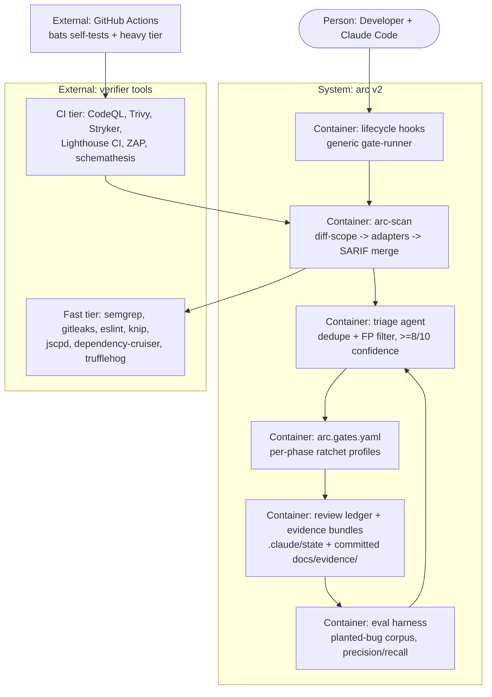

# PLAN.md — arc v2 "World-Best" Upgrade

> Filled by `/arc-kickoff` (initiative: make arc the world-best layer for
> **enforcement, evidence, and measured agent quality** in AI-built software).
> Formats: Shape Up pitch fields · ADRs · C4-concept Mermaid · Klein pre-mortem.
> Baseline analysis: `docs/gstack-vs-arc-comparison.md` (2026-07-09).

## Goal

One sentence: for solo/small teams building software with AI agents, arc becomes the layer that **proves** quality instead of asserting it — real industry tools verify every gate, evidence bundles commit to git, and agent quality is measured with planted-bug evals — the one axis where no stack (gstack included) competes.

## Appetite

**10 weeks part-time, hard cap.** Phases 6–7 are the designated cut-line: if the appetite
blows, they move to the next cycle — never silently extend. Phase 8 (distribution) is
already next-cycle. No story points anywhere.

## Architecture (C4 concepts, Mermaid flowchart)

## Key decisions (ADR index)

| # | Decision | Status |
|---|---|---|
| 0001 | SARIF as the single findings format; one `arc-scan` runner + per-tool adapters (not per-skill pipelines) | accepted |
| 0002 | Noise defense is a Phase-2 prerequisite, not a polish item: baseline (new-code-only) + LLM triage + suppression-with-justification | accepted |
| 0003 | Trivy over Snyk for SCA (fully free, SARIF-native); Snyk optional adapter later | accepted |
| 0004 | CodeQL as optional adapter only (license: free for OSS on GitHub); semgrep is the always-available SAST spine | accepted |
| 0005 | Mutation score (Stryker) becomes the primary test-quality gate; coverage % demoted to secondary | accepted |
| 0006 | Heavy tools (ZAP, Stryker, CodeQL) run in CI tier / docker; local hook tier has a hard <30s budget | accepted |
| 0007 | bats-core for arc's own self-tests; CI matrix = ubuntu + windows (Git Bash) | accepted |
| 0008 | Gates flip to `block` by default; `warn` becomes the opt-in downgrade (reverses current default) | accepted |

## Non-negotiables

- Every tool is **optional-degrade**: missing → `SKIPPED` in the report, never silent (existing toolcheck pattern).
- **New-code-only blocking** from day one of tool expansion — pre-existing findings go to a committed baseline file.
- Every suppressed finding requires a committed justification entry. No silent ignores.
- Every hook/script change ships with a bats test. CI red = no merge on the arc repo itself.
- Cross-platform: everything runs on Git Bash (Windows) AND Linux CI. No new PowerShell dependencies.
- No paid tool is ever a hard dependency. Paid/licensed tools are optional adapters.
- Thresholds ratchet **up only** across phases; a ratchet decrease requires an ADR.
- Every `/arc-phase-done` on this initiative commits an evidence bundle (dogfooding Phase 2's own feature once it exists; manual bundle before that).

## No-gos (explicitly out of scope)

- **No browser daemon rebuild, no iOS QA, no design-exploration suite, no GBrain clone** — gstack's home ground; interop, don't compete ("one owner per job").
- **No SonarQube self-host this cycle** — JVM-heavy; semgrep+CodeQL+Trivy cover ~80% free. Revisit next cycle as an adapter.
- **No team mode / multi-user sync this cycle.**
- **No public distribution work before Phase 8** (plugin packaging, docs site, telemetry) — capability first, marketing after.
- **No new agents beyond the saboteur** (Phase 7). Agent sprawl is slop.

## Rabbit holes

- **SARIF dialect variance** → normalize a minimal field set only (ruleId, level, message, location, fingerprint); don't chase full-spec fidelity.
- **CodeQL licensing** → detour decided: optional adapter, semgrep is the spine (ADR-0004).
- **Stryker runtime on big repos** → diff-scoped mutation only (mutate changed files); full-repo runs are CI-nightly, never gating.
- **ZAP on Windows** → docker-only, CI tier only. No local ZAP support attempted.
- **Baseline file merge conflicts** → one JSONL line per finding fingerprint, append-only, sorted — merge-friendly by construction.
- **Triage-agent over-blocking** → triage can only *downgrade* tool findings (FP filter), never invent new blocking findings; inventing = advisory note only.

## Pre-mortem (Klein)

*It's 6 months later. arc v2 shipped and failed.* Top causes:

| # | Failure cause | Mitigation or accepted |
|---|---|---|
| 1 | **Noise**: first scan dumps 400 findings, gates get flipped to warn/off, moat dies | Baseline + new-code-only + triage built in Phase 2 BEFORE any tool expansion (risk-ordered exactly for this) |
| 2 | **Install friction**: 10+ tools, users (incl. future me) skip setup, everything SKIPPED = advisory again | `/arc-toolcheck --fix` covers every new tool; docker for heavy tier; steel thread proves degrade path in Phase 0 |
| 3 | **Solo-maintainer scope blowout**: 9 phases, appetite gone by Phase 4 | Hard cut-line at Phase 6; each phase independently shippable; kill rule honored via `/arc-phase-done` appetite log |
| 4 | **Mold drifts again** (like the code-stamp gap) because self-tests stay aspirational | Phase 0 delivers CI-on-arc FIRST — before any new feature. Red CI blocks everything after |
| 5 | **Eval numbers too weak to claim anything** ("87% catch rate" on 5 bugs = noise) | Pre-registered rule: no public claim below 30 planted bugs across ≥3 categories; until then numbers are internal |
| 6 | **Windows breakage** in new bash (jq/python fallbacks, paths) | CI matrix includes windows-latest Git Bash from Phase 0; existing python3→jq→sed fallback pattern mandatory in new scripts |

## Phases (risk-ordered)

Phase 0 is the steel thread: the riskiest integration (runner→SARIF→triage→ledger, cross-platform, CI) end-to-end on fakes. Then ordered by what kills the project soonest: noise defense before tool expansion, security tools before QA tools (higher stakes), evals after gates are stable (they measure the gates), orchestration last (optimization, not survival).

| Phase | Capability | Appetite | Spec |
|---|---|---|---|
| 0 | Steel thread: `arc-scan` skeleton (semgrep+gitleaks → SARIF merge → triage stub → ledger stamp) + bats + CI on arc itself + VERSION/CHANGELOG | 1 week | `phases/phase-00-spec.md` |
| 1 | Credibility & hygiene: block-by-default, wire `/arc-review` code-stamp, cross-platform sync, strictness profiles, repo cleanup | 1 week | `phases/phase-01-spec.md` |
| 2 | Gate engine v1: `arc.gates.yaml`, generic gate-runner, baseline (new-code-only), suppression ledger, evidence bundles | 2 weeks | `phases/phase-02-spec.md` |
| 3 | Security pipeline: Trivy, trufflehog, CodeQL adapter, RLS test harness, ZAP baseline (CI) | 1.5 weeks | `phases/phase-03-spec.md` |
| 4 | QA pipeline: Stryker mutation gate, Lighthouse CI budgets, visual regression, schemathesis | 1.5 weeks | `phases/phase-04-spec.md` |
| 5 | Phase ratchet + docs gate v2: per-phase benchmark profiles, ratchet rule, vale/lychee/oasdiff | 1 week | `phases/phase-05-spec.md` |
| 6 | Measured agent quality: planted-bug corpus, precision/recall scoring, retro→eval loop | 2 weeks · **cut-line** | `phases/phase-06-spec.md` |
| 7 | Adversarial orchestration: saboteur agent, parallel gates, cross-model quorum | 2 weeks · **cuttable** | `phases/phase-07-spec.md` |
| 8 | Distribution: plugin packaging, English docs, public pre-registered benchmark, opt-in telemetry | next cycle | `phases/phase-08-spec.md` |

**North-star metric:** escaped defect rate (bugs found in production after all gates passed) — tracked per release from Phase 2 onward, target: monotonically decreasing.
