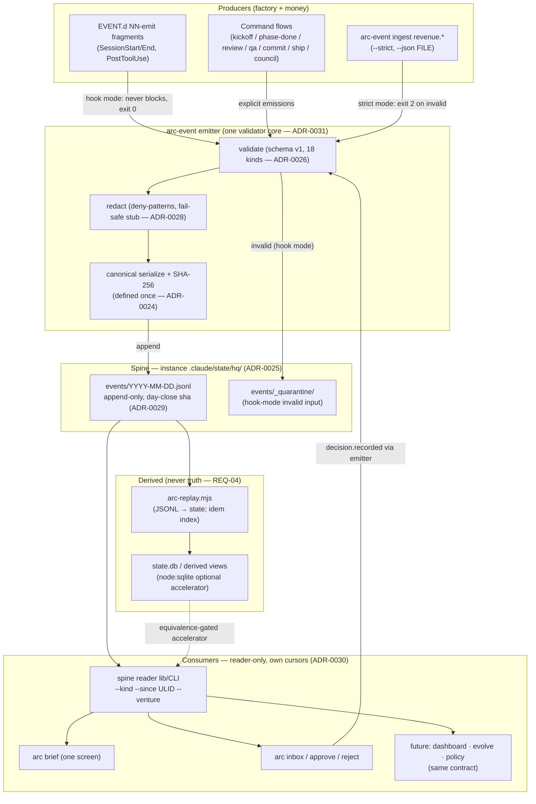

# PLAN.md — Cycle 2 · Receipt Spine

> Filled by `/arc-kickoff` 2026-07-22. Design source:
> `docs/strategy/plans/PLAN-cycle2-receipt-spine-v2.1.md` (approved 2026-07-22; decisions
> locked — 9 REQs, SPINE-A..H → ADR-0024..0031, 18-kind vocabulary, schema v1, appetites,
> no-gos). Predecessor initiative CLOSED: `docs/archive/PLAN-2026-07-22.md` (orchestrator,
> 6/6 phases). The parked v2 world-best initiative stays parked (ADR-0017).

## Goal

For Ashiq, arc gains a **receipt spine** — every factory action and every rupee becomes one
append-only event stream, consumed by everything else only through one read contract,
rendered as a one-screen daily brief and an approval inbox, and proven on real work for
five real days — so the company's day is replayable from receipts and every future module
(engine, evolve, dashboard, policy) plugs into a stable API instead of each other's internals.

## Current state

Verified 2026-07-22 at kickoff (design-source block re-checked against the repo the same day):

- **Orchestrator initiative CLOSED** 2026-07-22: 6 products (core/plan/review/qa/git/council),
  selective install (`--products`), per-target `arc-registry.json`, physical boundaries.
  271/271 bats. 22 commands. ADRs through **0023** at kickoff → 0024–0031 assigned here.
- **Scripts re-homed:** `.claude/scripts/{core,council,plan,review}/` (qa/git no-op).
  kickoff-lint at `.claude/scripts/plan/kickoff-lint.mjs` (v4; **8 substance gates WARN**
  in TRIAL — `docs/trial-ledger.md`; promotion blocked on a governed escape hatch that
  doesn't exist yet — gates untouched this cycle).
- **EVENT.d dispatcher live** (orchestrator Phase 01): `.claude/hooks/{SessionStart,SessionEnd,PostToolUse,…}.d/NN-*.sh`
  fragments — hq drops `NN-emit` fragments without touching hooks. Advisory events always exit 0.
- **Stack:** zero-dep Node ≥18 (`.mjs`) + bash-3.2/POSIX shell · bats tests · 3-OS GitHub
  CI (single Node 20 today — this cycle adds 18 + 22 legs, see External dependencies).
- **Entry points:** `sync-to-project.sh`/`.ps1` (install/sync) · `.claude/hooks/` dispatcher ·
  per-product CLIs under `.claude/scripts/*/`.
- **Conventions:** manifest-driven `products/` (product-lint blocking) · central `tests/`
  (ADR-0021) · new lints WARN-first in TRIAL · evidence bundle per phase-done ·
  conventional commits, branch + PR.
- **Do-not-touch:** `arc_hook_field` guard chain · golden bare-sync fixtures
  (`tests/fixtures/sync-golden/`) · the 8 trial gates · `docs/archive/` (parked/closed initiatives).
- **Two real consumers exist:** venturemind (upgrade path — pre-Phase-02 install, 21 stale
  files known via `--prune-report`) and Opportunity-Scout (fresh install, council).
- **Central tests:** flat `tests/` + `tests/fixtures/` (ADR-0021) — no `products/*/tests/`.
- **Sync has two paths** — bare/full (copies all of `.claude/` minus `settings.local.json`,
  `state/`, `scheduled_tasks.lock`, `worktrees/`) and selective (`--products`, manifest-driven
  via `arc-products.mjs` + `product-lint.mjs`). The golden gate compares a bare sync against
  the committed path+sha manifest `tests/fixtures/sync-golden/tree-manifest.txt`.
  **Kickoff correction (2026-07-22):** hq CODE under `.claude/scripts/hq/` therefore DOES
  ride a bare sync like every other product's scripts, so the golden manifest gets
  regenerated once (reviewed diff: only intended hq paths added) — "byte-identical" applies
  to the rsync-vs-cp path equality and to spine DATA, not to the manifest across a cycle that
  adds files. Spine DATA stays out for real: `.claude/state/hq/` sits under the `state`
  exclude (ADR-0025).
- **Attic deferred** (ADR-0023) — spine's append-only/never-delete stance aligns; nothing
  here revives attic. No `products/hq/`, no `.claude/scripts/hq/`, no `.claude/state/hq/`
  exist yet — all created this cycle. `products/hq/manifest.json` must exist and list every
  hq script/hook fragment from Phase 0 ckpt A onward: `product-lint.mjs` runs as a blocking
  CI step on all 3 OSes and exits 2 on any `.claude/` file not owned by exactly one manifest.
  `.claude/scripts/core/arc-products.mjs`'s hardcoded `CATALOG` (6 products — the prior
  cycle's "no 7th product" freeze, superseded by this cycle) must gain `hq`, or
  `--status`/install hints silently never mention it.
- **Hot zones:** `arc_hook_field` guard chain (jq→python→RAW fail-safe) — emitter must not
  disturb it · SessionStart/End timing (emitter never blocks) · Windows CRLF/locale ·
  golden bare-sync gate (spine data files must never enter the sync payload).

## Success requirements

| REQ | User outcome | Measurable acceptance | Phase | Status |
|---|---|---|---|---|
| REQ-01 | Every factory action leaves a receipt | Scripted dry-run session (kickoff → phase-done → review → qa → commit → ship) produces the expected event sequence; every event passes strict validation; sequence matches a golden fixture where a "step" = one flow command's own emissions (order-insensitive WITHIN that command only, never across commands) — bats green | 1 | validated |
| REQ-02 | The spine cannot be silently poisoned — in either mode | **Strict mode** (`--strict`: CI/ingest/tests): every pinned hostile fixture (missing field, bad ULID, bad ts, dup idem, oversize payload, secret pattern, CRLF/BOM, non-UTF8) exits 2. **Hook mode**: the SAME inputs never block — quarantined to `events/_quarantine/` + loud SKIP + exit 0. Both asserted per fixture | 0 | validated |
| REQ-03 | Money reaches the spine exactly once | `arc-event ingest revenue.received --json FILE` records a real provider payload; the same payload delivered twice — **including across days** — yields ONE event (idem index, fixture-proven); amount/currency/venture validated | 2 | validated |
| REQ-04 | State is derived, never truth — twice over | (a) `rm state.db && arc-replay && arc brief --date D` byte-identical to golden; (b) on a **no-sqlite runner** (Node 18 leg) the same brief byte-identical via the canonical JSONL-scan path — both bats cases in 3-OS CI | 0 | validated |
| REQ-05 | The day is readable in ONE screen | `arc brief` renders from the **spine reader only**: ≤ 40 lines, grouped needs-you / money / progress / background; overflow collapses to counts (+ `--full`); golden-fixtured; <5s on the owner's Windows box | 2 | validated |
| REQ-06 | Approvals are receipts too | `arc inbox` lists `approval.requested` via the reader; `arc approve/reject ID --reason` writes `decision.recorded`; full request→decision flow replays identically; no approval state outside the spine; approving/rejecting an unknown or already-decided ID is a pinned error fixture (non-zero exit, no duplicate `decision.recorded`) | 3 | validated |
| REQ-07 | Proven on real work with honest money | ≥5 consecutive real working days (arc's own development and/or one consumer repo): real events, brief read daily. **`revenue.received` = real money only**; pre-revenue → `revenue.simulated` (separate kind) and REQ-07 closes "mechanism proven, live value pending" — never fake P&L truth. Evidence bundle = the days' JSONL + briefs + the weekly gap audit (session-log vs spine, pre-mortem #2) | 4 | active |
| REQ-08 | (stretch) Runs know their cost honestly | `run.completed` may carry `cost: null` or `{tokens_in, tokens_out, inr_estimate, source: measured / estimated / manual}`; brief shows daily spend when present. **First cut under pressure** — CUT at Phase-02 close (owner's call; cost tracking deferred to a later cycle) | 2 | dropped |
| REQ-09 | The spine is the ONLY api | `brief`/`inbox` code contains zero direct `events/*.jsonl` or `state.db` references — all access via the `spine` reader lib/CLI (grep-lint, WARN-first per trial culture); each consumer keeps its own **cursor** (last ULID) and demonstrates catch-up-from-cursor in bats, including a same-millisecond-burst fixture proving `--since` resolves ties by append order (file order), never raw ULID string comparison | 3 | validated |

## Appetite

**2.5 weeks part-time, hard cap.**
**Tier:** M
**Kill criteria:** at 50% burnt (~6 days), REQ-02 + REQ-04 not green → cut to spine+replay
only (bank; brief/inbox next cycle). Any phase at 2× appetite → stop, bank, `/arc-retro`.
First cut REQ-08, second cut REQ-09's cursor demo (lint stays). 100% → cut or kill, never extend.

## Architecture (C4 concepts, Mermaid flowchart)



Boundary rule: nothing right of the spine touches `events/*.jsonl` or `state.db` except
`arc-replay` and the reader (grep-lint, REQ-09). Module CODE ships as product `hq`
(`products/hq/manifest.json` + `.claude/scripts/hq/`); spine DATA never enters the sync
payload. Derived state lives at `.claude/state/hq/derived/state.db` — instance-only, same
sync exclusion as the spine, deletable at will (REQ-04).

## Key decisions (ADR index)

| ADR | Decision (SPINE ID) | Reversibility |
|---|---|---|
| [0024](docs/adr/0024-spine-a-append-only-canonical-jsonl-is-truth.md) | SPINE-A — append-only canonical JSONL is truth; sha over canonical form; sqlite optional accelerator, equivalence-gated | one-way |
| [0025](docs/adr/0025-spine-b-spine-lives-in-instance-state.md) | SPINE-B — spine data in instance `.claude/state/hq/`, never in the sync payload | two-way |
| [0026](docs/adr/0026-spine-c-closed-event-kind-vocabulary-v1.md) | SPINE-C — closed event-kind vocabulary v1 (18 kinds), extensions only via ADR | two-way |
| [0027](docs/adr/0027-spine-d-brief-inbox-cli-first.md) | SPINE-D — brief + inbox CLI-first under `.claude/scripts/hq/`; dashboard is a later consumer | two-way |
| [0028](docs/adr/0028-spine-e-secret-redaction-at-emit-fail-safe.md) | SPINE-E — secret redaction at emit, fail-safe: scanner failure → payload dropped, stub-only marker | one-way |
| [0029](docs/adr/0029-spine-f-immutability-windows-supersedes.md) | SPINE-F — active day append-only; closed day immutable forever; corrections via `supersedes` | one-way |
| [0030](docs/adr/0030-spine-g-spine-is-the-only-public-api.md) | SPINE-G — the spine is arc's only public API: one reader + per-consumer cursors; no pub/sub | two-way |
| [0031](docs/adr/0031-spine-h-emitter-dual-mode.md) | SPINE-H — emitter dual-mode: hook mode never blocks, strict mode exits 2; one validator core | two-way |

Inherited and still binding: [0017](docs/adr/0017-park-v2-initiative.md) (v2 stays parked) ·
[0021](docs/adr/0021-tests-stay-centralised.md) (central `tests/`) ·
[0023](docs/adr/0023-defer-attic-registry-is-not-ownership.md) (attic deferred).

## Non-negotiables

- Append-only forever; corrections supersede (ADR-0029).
- Emitter/validator/replayer/reader are parser-class code → **mandatory adversarial
  construct-a-breaking-input pass, holes fixed + pinned as red fixtures, BEFORE FAIL-mode
  promotion** (council v2+v3: 43-hole history).
- Twin determinism cases (REQ-04 a+b) enter CI at Phase 0-B and never leave.
- No secrets on the spine — redaction fail-safe, stub-only, never fail-open (ADR-0028).
- Hook-mode emitter can never block or fail a session; `arc_hook_field` guard chain
  untouched. Appends are durable and atomic: an emitter killed mid-append (SIGKILL/hard-exit)
  leaves zero torn lines and zero silently-lost acknowledged events, and two concurrent
  emitters never interleave a torn/partial line — pinned fixtures (Phase 0 corpus + Phase 1
  bats; exit-timing-race class, `docs/retro-log.md`).
- No module reads `events/*.jsonl` or `state.db` directly except the spine reader —
  grep-lint WARN-first (ADR-0030), wired as a `mode: warn` row in `arc.gates.yaml` (same
  schema as the existing gate rows — unregistered, it never runs), scanning by glob over
  tracked source paths (not a hardcoded file list) so consumers added after this cycle are
  covered without a lint edit.
- `products/hq/manifest.json` never declares a `.claude/state/**` path in `files`/`scripts`/
  `docs`: `arc-products.mjs`'s `assertSafe` has no state-tree rule, so a `--products hq`
  selective install would copy spine data into a consumer's payload — the golden bare-sync
  gate only covers the full-sync path (ADR-0025). Asserted by a Phase 0 bats case.
- Canonical serialization defined ONCE, shared by emitter/hasher/reader (ADR-0024).
- Inherited whole: zero-dep Node · bash-3.2/POSIX · no GNU-only constructs (macOS BSD leg)
  · every script ships bats (central `tests/`, ADR-0021) · CI red = no merge · bare sync
  byte-identical across the rsync and cp paths, and the golden tree-manifest regenerated
  only with a reviewed diff · new lints WARN in TRIAL · evidence bundle per phase-done.
- The 8 existing kickoff-lint trial gates stay WARN this cycle (escape-hatch precondition,
  council session 001) — this initiative does not touch them.

## No-gos (explicitly out of scope)

- No pub/sub daemon/bus/file-watcher — cursors + polling only.
- No dashboard UI · no scheduler/cron (every run human-started) · no policy ENGINE.
- No engine module (Claude Code is the implicit driver) · no `processes/` canonicalization.
- No discover/growth/leads/ops modules · no ledger MODULE (revenue events only).
- No new slash commands (CLIs only) · no Postgres · no HTTP listener · no MCP endpoint.
- No hash chaining beyond per-event sha + day-close file sha.
- No native-dependency sqlite. No attic revival (ADR-0023 stands).

## Rabbit holes

Event-taxonomy bikeshedding (18 kinds, full stop) · reader feature creep (kind/since/venture,
nothing more — sqlite3 CLI answers ad-hoc questions) · bus temptation (re-read ADR-0030) ·
dashboard temptation · perfect cost accounting (nullable + `source`) · Windows Unicode chase
(canonical form + pinned CRLF/BOM fixtures only).

## Assumptions ledger

| Assumption | Trigger it's wrong | Phase |
|---|---|---|
| Hook fragments capture enough factory actions | dry-run golden shows a gap → add command-level emission | 1 |
| JSONL-scan brief <5s at realistic volume | ≥5s on owner's box with 90-day synthetic spine → promote sqlite accelerator to recommended (equivalence-gated) | 0 |
| Emitter overhead negligible | >1s added per session event → async append | 1 |
| Real work available for the 5-day dogfood | none mid-build at Phase 4 → dogfood arc's own development (mold factory actions are events too) | 4 |
| File-drop/manual ingest sufficient for revenue | provider is webhook-push-only → manual entry from dashboard export until a later cycle | 2 |
| Lock-file + single-write append via one shared Node helper is atomic on NTFS/ext4/APFS | a torn or interleaved line ever observed in fixtures/CI or dogfood → switch to per-writer segment files merged at day-close | 0 |

**Fired at Phase 01 — both resolved exactly as the row pre-specified (implemented + CI-green, no untracked scope, so recorded here rather than re-routed through `/arc-change`):**
- *Hook fragments capture enough factory actions* → the dry-run golden landed RED with hook fragments alone, so command-level emission was added to all 7 flows (`4936371`, `13e6ddb`).
- *Emitter overhead negligible* → measured **~2s/emit** on the owner's Windows box (>1s), so PostToolUse + SessionStart emit **async** (`dc94dd1`; 0.565s return, event still lands); SessionEnd stays synchronous for durability.

## External dependencies

None new (zero-dep initiative). The rows below are the cycle's only external touchpoints:

| Dependency | Interface | Fake | Real | Contract test |
|---|---|---|---|---|
| Revenue provider payloads | `arc-event ingest revenue.received --json FILE` (file-drop / manual CLI) | Pinned fixture payloads incl. same-day AND cross-day duplicate pairs (`tests/fixtures/spine/`) | Provider dashboard export or manual CLI entry (Phase 4) | Ingest bats: fixtures validate, duplicates dedupe to ONE event (REQ-03) |
| Phase-4 real-work host | arc install on the host repo (spine via `--products hq`) | Dry-run scripted session (REQ-01 golden) | arc's own development and/or venturemind / Opportunity-Scout (access confirmed at Phase 4 entry) | 5-day evidence bundle: days' JSONL + briefs + gap audit (REQ-07) |
| CI matrix — sqlite/no-sqlite legs | `.github/workflows/ci.yml` Node matrix (today: single `node-version: '20'` on all 3 OSes) | n/a — CI infra, not a fake/real split | Node 18 leg added (no `node:sqlite` — REQ-04(b)) + one Node 22+ leg (accelerator + sqlite-vs-scan equivalence gate, ADR-0024) | REQ-04 twin determinism + the equivalence gate have no legs to run on without both — added at Phase 0 ckpt B |

## Pre-mortem (Klein)

| # | Failure cause | Mitigation |
|---|---|---|
| 1 | Parser holes in emitter/validator/reader (43-hole class, `docs/retro-log.md` council v2+v3) | Adversarial pass + pinned corpus at Phase 0 ckpt A, before anything consumes the spine |
| 2 | Silent wiring gaps — "replayable day" is a lie | Dry-run golden sequence (REQ-01) + weekly gap audit (session-log vs spine) at Phase 4 exit |
| 3 | Golden fixtures (REQ-01/04/05) rot silently across Phases 1-4 as emitter/reader/schema changes move hashes — broke across 10 commits last cycle, surfacing as surprise mid-task failures (`docs/retro-log.md`, arc-orchestrator) | Fixture regen is a named step in every phase-done for Phases 0-4: diff the delta first, confirm only intended paths moved, re-record and name the change in the commit |
| 4 | Windows breaks determinism | Canonical serialization + pinned CRLF/BOM/non-UTF8 fixtures + twin determinism CI from Phase 0 ckpt B |
| 5 | Redaction scanner passes clean but misses a cosmetic-variant secret (split-line, encoded, whitespace-varied) — the cosmetic-variant-attack class (`docs/retro-log.md`, council v3) — landing on a day that becomes immutable forever (ADR-0029) | Pinned obfuscated-secret fixtures (split-line, base64, whitespace-varied) in the Phase 0 ckpt A hostile corpus alongside the plain-secret fixture (ADR-0028) |
| 6 | Consumers couple to internals | ADR-0030 reader-only rule + grep-lint + REQ-09 cursor demo |

## Phases (risk-ordered)

Sequenced so the riskiest, most load-bearing code (parser-class spine core) lands first and
everything else consumes it. Effort appetites sum to 14.5 part-time days ≈ the 2.5-week cap.

| Phase | Capability | Appetite | Depends on | Spec |
|---|---|---|---|---|
| 0 | Spine core: emitter (dual-mode) + canonical serializer + hostile corpus + adversarial pass (ckpt A) → replay + reader + minimal `arc brief` renderer (JSONL-scan `--date` render only, no grouping polish — REQ-04's acceptance invokes `arc brief --date D` before Phase 2 exists) + twin determinism CI (ckpt B) | 5 days | none | `phases/phase-00-spec.md` |
| 1 | Factory wiring: EVENT.d `NN-emit` fragments + explicit flow emissions + dry-run golden + overhead measured | 2.5 days | Phase 00 | `phases/phase-01-spec.md` |
| 2 | Money + brief: strict revenue ingest (cross-day idem) + `arc brief` one-screen + nullable cost (stretch) | 2.5 days | Phase 00 | `phases/phase-02-spec.md` |
| 3 | Inbox + API seal: approval/decision flow + cursor catch-up + reader-only grep-lint (TRIAL) | 1.5 days | Phase 01 | `phases/phase-03-spec.md` |
| 4 | Live dogfood: 5 consecutive real days, honest revenue rules, gap audit, evidence bundle, retro | 3 days effort (≥5 elapsed) | Phase 02, Phase 03 | `phases/phase-04-spec.md` |

**North-star:** 100% of factory actions + revenue with receipts during dogfood · briefs
read 5/5 days and ≤ one screen · twin replay determinism green in CI from Phase 0 ckpt B onward.

## Appendix A — event kinds v1 (18, closed — ADR-0026)

`idea.captured` · `council.verdict` · `approval.requested` · `decision.recorded` ·
`kickoff.done` · `phase.closed` · `review.completed` · `qa.completed` · `commit.done` ·
`ship.done` · `revenue.received` *(real only)* · `revenue.simulated` *(never in P&L)* ·
`cost.incurred` · `run.completed` · `incident.raised` · `redaction.applied` ·
`day.closed` · `note.logged`

## Appendix B — event schema v1 (normative)

```json
{ "id": "ULID", "v": 1, "ts": "RFC3339+05:30", "idem": "sha256(source:natural-key)",
  "actor": "arc-phase-done | human:ashiq | ingest:revenue", "process": "phase-done@x.y.z",
  "model": "driver:model-id | null", "venture": "slug | arc", "run_id": "r-…",
  "kind": "Appendix A", "payload": { "no secrets — redacted at emit" },
  "outcome": "ok | fail | partial",
  "cost": null,
  "cost_alt": { "tokens_in": 0, "tokens_out": 0, "inr_estimate": 0, "source": "measured|estimated|manual" },
  "evidence": "path | null", "supersedes": "id | null",
  "sha": "SHA-256 over canonical form, sha field excluded" }
```

Kickoff clarifications:
- (REQ-08) `cost` is ONE field — a union of `null` and the object shape documented on the
  `cost_alt` line above; a real event carries a single `cost` key. `cost_alt` appears in
  the block only to show the non-null shape.
- (REQ-02) Size cap: a canonical event (sha included) is ≤ 64 KiB; anything larger is
  invalid input — the "oversize payload" hostile fixture pins this number.
