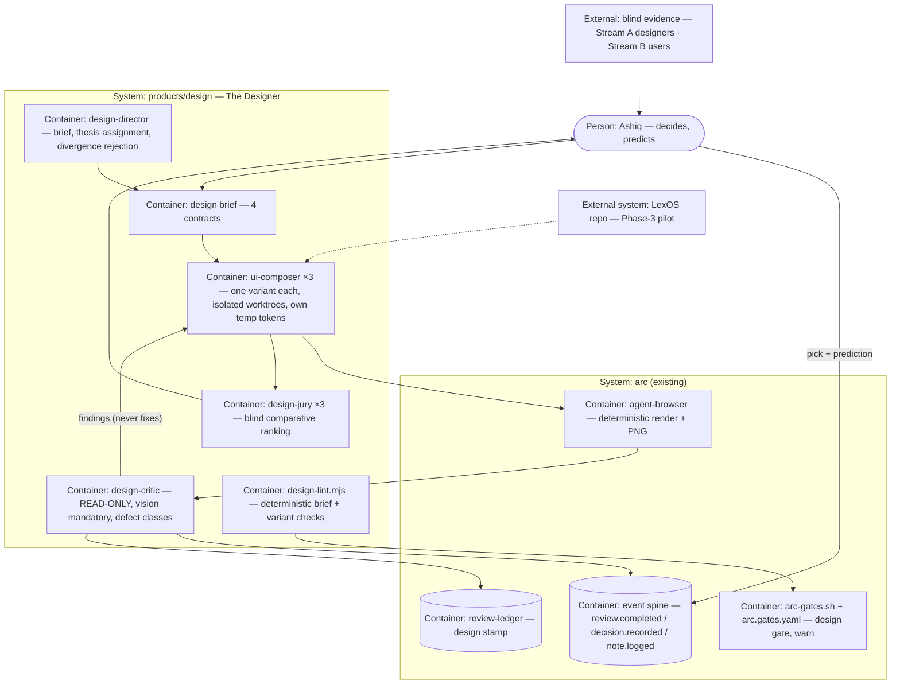

# PLAN.md — Cycle 3 · arc-design "The Designer"

> Filled by `/arc-kickoff` 2026-07-28. Design source:
> `docs/strategy/plans/PLAN-design.md` (FROZEN 2026-07-26; Part 4 decisions DES-A…H +
> 12-row superseded record LOCKED → ADR-0033..0040 here; fork + auto decisions →
> ADR-0041..0046). Predecessor initiative CLOSED: `docs/archive/PLAN-2026-07-28.md`
> (Cycle 2 · Receipt Spine, 5/5 phases). Companion inputs: 4 LexOS design drafts
> (LexOS repo `docs/design/`: brand.md · references.md · design-system.md ·
> tokens-proposal.md) — the Phase-3 pilot target.

## Goal

For Ashiq, arc gains **The Designer** — a `products/design/` module that turns a real
product premise into three genuinely different, contract-verified design directions,
critiqued by a read-only vision critic, decided by the owner with a recorded falsifiable
prediction, and validated by two external blind evidence streams — taste made researched,
reusable, enforceable, and improving.

## Current state

Verified 2026-07-28 at kickoff (codebase-surveyor + Cycle-2 close facts):

- **Stack:** arc build system v4 · zero-dep Node ≥18 (`.mjs`) + bash-3.2/POSIX · bats
  tests (central `tests/`, ADR-0021) · 3-OS GitHub CI.
- **Entry points:** `sync-to-project.sh`/`.ps1` (install/sync, twins) · `.claude/hooks/`
  EVENT.d fragment dispatcher · per-product CLIs under `.claude/scripts/*/` · `/arc-*`
  commands in `.claude/commands/`.
- **Conventions:** manifest-driven `products/` (core/qa/review/plan/git/council/hq;
  resolver `arc-products.mjs`; **product-lint blocking**, hostile-fixture testbed) ·
  central `tests/` · new lints WARN-first in TRIAL · conventional commits, branch + PR ·
  CI byte-identity gate `tests/fixtures/sync-golden/tree-manifest.txt` — any
  product-shipped file edit moves hashes.
- **Design today:** `/arc-design` command + `design-reviewer` agent under **products/qa/**
  (scores 8 dimensions 0-10, AI-slop blacklist, **fixes in code itself** — superseded by
  ADR-0034's read-only critic; runs in parallel until retirement, ADR-0042).
  `council-designer` = decision lens only. `.claude/rules/ui.md` · `docs/branding.md`
  (empty stub) · `docs/ui-conventions.md` — thin. **Nothing reads a screenshot back today.**
- **review-ledger:** kinds scan/code/security/qa/**design**/docs, stamped per commit SHA
  under `.claude/state/reviews/`; the `design` stamp exists, wired to /arc-design PASS — unused.
- **Event spine (Cycle 2, shipped):** `.claude/scripts/hq/` — `arc-event.sh` (dual-mode
  emit) · reader/replay/brief/inbox; closed 18-kind vocabulary (ADR-0026); EVENT.d hook
  fragments at 3 fire-points. **Known bug:** idem preimage collapse silently drops
  repeat-action receipts (Cycle-2 close finding) — out of this appetite, ADR-0044.
- **Gates:** `arc.gates.yaml` flat declarative list run by
  `.claude/scripts/core/arc-gates.sh`; 6 gates today. Strict parser: per-gate keys
  `name/check/mode/tier/runtime/evidence`, one `key: value` per line, no inline comments;
  `check` = shell command from repo root, non-zero exit = gate failed.
- **Eyes:** agent-browser CLI (screenshots; QA-only use today). `.claude/worktrees/` exists.
- **Phase-0 target route:** `docs/strategy/arc-hq-mockup.html` (real arc-internal page,
  renders as static file — ADR-0045).
- **Do-not-touch:** `.claude/state/` · `arc-registry.json` (generated) · sync-golden
  fixtures (regen only as a named step) · `.github/workflows/ci.yml` · product-lint +
  arc-products testbeds · `docs/archive/` · the 8 kickoff-lint TRIAL gates · `arc_hook_field` guard chain.

## Success requirements

| REQ | User outcome | Measurable acceptance | Phase | Status |
|---|---|---|---|---|
| REQ-01 | Arc takes a real product premise (LexOS) and produces 3 distinctive, usable, production-feasible design directions | Two separate blind evidence files (ADR-0040): Stream A — ≥2 of 3 directions taken seriously by experienced designers; Stream B — target users complete the key task without intervention. BOTH pass. Stays `active` until then (ADR-0041) | 3 | active |
| REQ-02 | One real arc route is independently inspected end-to-end by a read-only vision critic | Critic reads the rendered PNG of `docs/strategy/arc-hq-mockup.html` and reports ≥1 real finding classed VIOLATION/WEAKNESS/POLISH; separately, on a committed defect-injected CLONE of that same route the critic reports the planted defect as VIOLATION (proves detection, not just artifact existence); a critic write outside `docs/design/critique/**` is hook-blocked (test asserts non-zero exit) | 0 | validated |
| REQ-03 | Design reviews leave receipts Ashiq can see in the daily brief | `review.completed` payload carries `"lens":"design"`, a `target` field (the repo-relative route the gate matches on) and a `result` field (PASS or FAIL), appended via `arc-event.sh` and visible through the reader; review-ledger `design` stamp written on PASS, where PASS ≡ the critique artifact contains zero VIOLATION findings (WEAKNESS/POLISH-only or zero findings = PASS) | 0 | validated |
| REQ-04 | UI-bearing changes without design review get flagged, never blocked | `design` gate in `arc.gates.yaml` mode `warn`: check exits 1 when a reviewed route lacks a design receipt, exits 0 when the receipt exists, exits 1 with a WARN diagnostic (never blocks, never crashes) when the spine reader query itself errors or the route can't be resolved; never exits 2 this cycle | 0 | validated |
| REQ-05 | A UI-bearing build gets a machine-checked 4-section design brief | design-lint v0 passes a complete brief (7 interaction answers · art direction · platform-contract table · content contract) and fails a brief missing any one section — both proven by committed fixtures | 1 | validated |
| REQ-06 | Design installs and syncs as a first-class arc module | `products/design/manifest.json` resolves via `arc-products.mjs`; product-lint green; sync-golden tree-manifest regenerated as a named step; old `/arc-design` + design-reviewer untouched and still green (ADR-0042) | 1 | validated |
| REQ-07 | Ashiq picks from 3 genuinely different directions and his pick records a testable claim | 3 variants from 3 distinct theses; IA-difference matrix differs on ≥3 of 7 dimensions; per-variant temp token file, no raw hex in variant code; one shared render command; blind ranking ×3 recorded; owner decision + falsifiable prediction emitted as `decision.recorded` | 2 | validated |
| REQ-08 | Critique findings get fixed without the critic ever touching code | VIOLATION → creation side fixes → critic re-verifies, ≤2 rounds on a real variant set (demo), round 3 escalates to human; critic's session diff shows zero product-code changes | 2 | validated |

## Appetite

**5 days** (owner, 2026-07-28). A constraint, not an estimate: blown → cut scope or kill
a phase, never silently extend. Blind-test *evidence* is allowed to trail the build
(ADR-0041) — the 5 days buy the build + test launch, not the waiting. Phase appetites sum
to **4.5 days**; the remaining 0.5 day is explicit slack, spent only through the
tripwire conversation, never absorbed silently.

**Tier:** M

**Kill criteria:** at 2.5 days burnt, if Phase 1 isn't done → mandatory scope-cut
conversation (pre-declared cut order: jury ×3→×1 · worktrees→variant route namespace ·
defer Phase 3 library polish). At 100% → cut or kill, never extend silently.

## Architecture (C4 concepts, Mermaid flowchart)

```mermaid
flowchart TB
  owner(["Person: Ashiq — decides, predicts"])
  subgraph design ["System: products/design — The Designer"]
    director["Container: design-director — brief, thesis assignment, divergence rejection"]
    composers["Container: ui-composer ×3 — one variant each, isolated worktrees, own temp tokens"]
    critic["Container: design-critic — READ-ONLY, vision mandatory, defect classes"]
    jury["Container: design-jury ×3 — blind comparative ranking"]
    dlint["Container: design-lint.mjs — deterministic brief + variant checks"]
    brieff["Container: design brief — 4 contracts"]
  end
  subgraph arc ["System: arc (existing)"]
    browser["Container: agent-browser — deterministic render + PNG"]
    gates["Container: arc-gates.sh + arc.gates.yaml — design gate, warn"]
    spine[("Container: event spine — review.completed / decision.recorded / note.logged")]
    ledger[("Container: review-ledger — design stamp")]
  end
  lexos["External system: LexOS repo — Phase-3 pilot"]
  streams["External: blind evidence — Stream A designers · Stream B users"]
  owner --> brieff
  director --> brieff
  brieff --> composers
  composers --> browser
  browser --> critic
  critic -- "findings (never fixes)" --> composers
  critic --> spine
  critic --> ledger
  composers --> jury
  jury --> owner
  owner -- "pick + prediction" --> spine
  dlint --> gates
  lexos -.-> composers
  streams -.-> owner
```

## Key decisions (ADR index)

| # | Decision | Status |
|---|---|---|
| 0033 | DES-A: `products/design/` module in-repo, never a separate repo | accepted |
| 0034 | DES-B: read-only verification, mechanical enforcement; creation fixes, critic re-verifies; critic = NEW agent | accepted |
| 0035 | DES-C: design rides the closed spine vocabulary (`review.completed {"lens":"design"}` / `decision.recorded` / `note.logged`) | accepted |
| 0036 | DES-D: brief carries 4 contracts; coverage contract-driven, tier = effort only | accepted |
| 0037 | DES-E: thesis-based exploration + IA matrix ≥3/7 + worktree isolation + per-variant temp tokens | accepted |
| 0038 | DES-F: prediction-based learning; preference ledger ≠ quality ledger | accepted |
| 0039 | DES-G: external design tools deferred to W3+ | accepted |
| 0040 | DES-H: REQ-01 requires two external blind evidence streams, both passing | accepted |
| 0041 | All 4 phases in-cycle; blind-test evidence may trail; REQ-01 active until both streams pass | accepted |
| 0042 | Old /arc-design + design-reviewer parallel until critique proven, then retire | accepted |
| 0043 | Standalone this cycle; kickoff step-4.5 hook via later /arc-change | accepted |
| 0044 | Spine dedup fix out-of-appetite; hard gate before Phase-2 close | accepted |
| 0045 | Phase-0 target = `docs/strategy/arc-hq-mockup.html` (arc-internal) | accepted |
| 0046 | design-lint rides the existing gate-runner + lint conventions | accepted |
| 0047 | Runner owns the verdict + `review.completed`; critic emits evidence only | accepted |
| 0048 | Agents judge, scripts measure — the critic never cites a measured value | accepted |

## Non-negotiables

- The critic never writes product code — enforced mechanically (no Edit tool + PreToolUse edit-hook path scope + scoped receipt Bash), never by prose (ADR-0034).
- No lorem ipsum in any reviewed artifact — realistic content from the content contract.
- No absolute quality scores anywhere; numbers exist only as blind comparative ranking.
- Every design review and every owner decision leaves a spine receipt in the closed vocabulary (ADR-0035).
- Taste is a decision recorded as a design ADR, never a research finding; research receipts only for factual/pattern claims.
- A new gate/lint/parser is not done until an adversarial construct-a-breaking-input pass has run and the found holes are fixed + pinned as fixtures.
- Any edit to a product-shipped file treats sync-golden regen as a named step: diff the delta first, confirm only intended paths moved, then re-record.

## No-gos (explicitly out of scope)

- External design tools/MCPs — Figma, Magic/21st.dev, shadcn MCP, galleries (W3+, ADR-0039).
- Editing `arc-kickoff.md` / auto-wiring step 4.5 (ADR-0043).
- Fixing the spine idem-preimage dedup bug inside this appetite (ADR-0044).
- Touching or retiring `products/qa` design-reviewer / `/arc-design` before the critique-mode dogfood pass (ADR-0042).
- The design evals suite (§2.9 of the frozen plan) — later cycle.
- Promoting the design gate warn→block — needs retro + owner OK.
- New spine event kinds — vocabulary closed (ADR-0035).
- The kickoff itself running councils/extra workflows — this is a build, not a decision.

## Rabbit holes

- **Vision ≠ pixel-perfection:** the critic judges structure, hierarchy, and contract
  compliance from the PNG — not subpixel rendering. Deterministic render command + the
  screenshot's hash recorded in the critique artifact; blank/duplicate-hash detection
  fails the run instead of critiquing a stale image.
- **Windows worktree friction:** decide worktrees vs the pre-approved fallback (variant
  route namespace, ADR-0037) at Phase-2 open — never fight it mid-phase.
- **"Materially differ" cleverness:** the director judges it; lint only checks the IA
  matrix exists. No string-distance metrics (superseded row 12).
- **Brief-parsing regexes:** markdown-contract checklist from retro-log applies —
  tolerant detection, strict value grammar, last-of repeated sections, anchored line
  regexes, real calendar-date validation.
- **Two design surfaces during migration:** the new module's modes get distinct naming
  until retirement (ADR-0042); retirement is a tracked task, never ad-hoc.

## Assumptions ledger

| Assumption | How we'd know it's wrong (trigger) | Phase that tests it |
|---|---|---|
| Blind-test recruits (designers + users) reachable at ₹0 | 14 days after Phase-3 build-complete with no Stream A/B evidence → ADR-0041 revisit fires, owner decision forced | 3 |
| agent-browser screenshots are deterministic enough to critique | 2 flaky/stale-screenshot runs in Phase 0 → harden the fixed-viewport render script before proceeding — **FIRED 2026-07-29**, in Phase 2 rather than Phase 0: variant-b rendered two distinct hashes from unchanged static bytes, once mid-critique into a sealed `review.completed`. Routed → issue #57. Load-bearing for the `screenshot_sha256` on every design receipt and for any future did-this-route-regress check; NOT for REQ-02 (planted-defect detection is unaffected). Remedy due before Phase 3, which runs the same renderer for its pilot evidence. **REMEDIED 2026-07-29** (`feat/render-determinism`): root cause was the capture racing the post-`open` CSS injection; the settle step alone left an unexplained residual, so the renderer now publishes only a hash two consecutive captures agree on and refuses otherwise. The assumption is NOT restored to true — screenshots are still not inherently deterministic; the script no longer trusts them to be | 0 |
| The spine dedup fix (separate /arc-change) lands before Phase 2 opens | Phase 2 opens without it → Phase 2 re-scopes to single-round critique; gate moves to Phase-2 close (ADR-0044) | 2 |
| 5 days covers the Phase 0–3 build + test launch | Kill tripwire: 2.5 days burnt and Phase 1 not done → scope-cut conversation | all |
| LexOS repo + its 4 design drafts are available and current at Phase-3 start | Drafts missing/stale at the Phase-3 re-read → re-pilot on a venturemind route or re-draft first. **FIRED 2026-07-29 on the count, NOT on the substance — remedy deliberately not taken.** The repo is present and current at `E:/Work_Hub/01_Automemory/Lexos` (last commit 2026-07-28), but `docs/design/` holds **2** drafts, not 4: `2026-07-26-dashboard-clients.md` and `2026-07-27-case-workspace.md` (the second touched 2026-07-28). The number 4 came from this plan's own kickoff — the frozen design source `PLAN-design.md` never says it — so this is a miscount here, not drafts that went missing there. Both drafts are recent and neither is stale, which is what the trigger was actually written to catch. Re-piloting on a venturemind route over a wrong number in our own plan would trade the real premise for a bookkeeping error. Corrected to 2 in this row and in `phases/phase-03-spec.md` | 3 |
| The arc-hq-mockup page is rich enough to exercise the critique protocol | Fewer than 3 distinct findings possible on it → ADR-0045 revisit: swap target route, same phase | 0 |
| A real Stream-B contact (LexOS lawyer) is identified and reachable before Phase-3 opens — needed to answer the pilot-brief case-vs-client question, not only to receive evidence later | No named contact at Phase-2 close → Phase-3's appetite opens with its own first exit criterion (pilot-brief upgrade) already blocked — **FIRED 2026-07-29 at the Phase-2 close**: no contact is named anywhere in the plan, the specs or the tracker. Consequence is the one the trigger already wrote: Phase 3 opens with its pilot-brief upgrade blocked. Owner action, not a code task — either a named reachable contact before Phase 3 opens, or the pre-designed fallback (case-primary marked PROVISIONAL, External-dependencies row) is taken deliberately and on the record. **RESOLVED 2026-07-29 without the fallback:** a real LexOS lawyer answered the primary-object question — **case**, not client (owner-relayed; receipt `01KYQ9B2BXMXWWADZZYVWXEGRT`). The pilot brief carries a real answer, not a PROVISIONAL placeholder, so Phase 3 opens with exit criterion 2 unblocked. **Still open, and narrower than the original row:** whether that same contact is reachable AGAIN to sit the Stream-B blind test. Answering the brief question is not the same as agreeing to be a test subject; that is due before the blind-test launch criterion, not before the phase opens | 3 |

## External dependencies

| Dep | Interface | Fake impl | Real impl | Contract test |
|---|---|---|---|---|
| agent-browser (render + screenshot) | CLI: open URL at fixed viewport → PNG on disk | Committed fixture PNGs: one clean render + one planted-defect variant of the same page | agent-browser CLI on `docs/strategy/arc-hq-mockup.html` | Critic run on the planted-defect PNG reports the defect; run on the clean PNG reports no planted defect (Phase 0: fakes; real render before Phase-0 close) |
| LexOS repo (Phase-3 pilot surface) | Local filesystem path to the LexOS checkout, confirmed and recorded in phase-03's Your-setup/pending BEFORE Phase-3 opens — `docs/design/` drafts + app routes on the real stack | The arc-internal Phase-0 route + committed draft copies | LexOS repo checked out locally | Pilot brief passes design-lint against the real drafts before any variant starts |
| Spine idem-preimage dedup fix (separate `/arc-change`, ADR-0044) | Fix to `.claude/scripts/hq/arc-event.sh` re-emit/dedup path | none — absence forces Phase-2 re-scope to single-round critique | Real fix shipped via its own `/arc-change` track before Phase-2 close | Phase-2 close blocked (phase-02-spec's Dependency gate) until landed; no owner or start date assigned anywhere in this plan |
| Real lawyer input (LexOS primary-object decision + Stream B recruiting) | One written answer: case-vs-client primary object, from an actual LexOS lawyer contact | A placeholder answer (case-primary, marked PROVISIONAL) unblocks brief-writing and variant-build if the real lawyer isn't reachable inside Phase-3's appetite | Real LexOS lawyer contact, scheduled BEFORE Phase-3 opens, not during it | Pilot brief's interaction-model Q2 is either the real lawyer's answer or explicitly marked PROVISIONAL with a revisit trigger before any variant starts |

## Pre-mortem (Klein)

*It's 6 months later. The Designer shipped and failed.* Top 5 causes:

| # | Failure cause | Mitigation or accepted |
|---|---|---|
| 1 | design-lint + the brief contract (REQ-05, Phase 1) "looked correct and passed its own fixtures" but had holes — doctored briefs display legitimacy while dodging the gate (council v2+v3 pattern: 43 real holes) | Adversarial construct-a-breaking-input pass before Phase-1 close (non-negotiable); tolerant detection + strict grammar checklist; every found hole pinned as a fixture |
| 2 | Critique theatre — receipts flow, stamps land, but the critic never actually catches anything, OR the REQ-04 gate check script itself errors and the crash is silently read as a receipt-present PASS (Cycle-2 pattern: golden passed while the outcome was false) | The planted-defect fixture IS REQ-02's acceptance; anomalies (zero findings, identical findings across routes, or an uninspected non-zero exit) are tested against the mechanism before being recorded as fine; a fixture proves the REQ-04 check script's crash path never resolves to exit 0 |
| 3 | The vision step (REQ-02, Phase 0, agent-browser dep) silently judges a stale, blank, or wrong-viewport screenshot → confident nonsense critique | One shared deterministic render command; critique artifact records screenshot hash + viewport; blank/duplicate-hash detection fails the run |
| 4 | Explore (REQ-07, Phase 2, ADR-0037) produces 3 skins of one app; thesis reassignment loops burn the appetite | Director rejects weak thesis lines BEFORE composing; IA matrix filled at thesis-assignment time, not after build; one reassignment round max, then owner call |
| 5 | A new Windows-run Node script (design-lint.mjs, ADR-0046; the render/critique command; the design gate check script) calls process.exit() while agent-browser/socket teardown is in flight → libuv assertion crash or a garbage exit code silently misread as gate PASS/FAIL (council v3 pattern, recurs on Windows) | Every new script in products/design/ and .claude/scripts/design/ sets process.exitCode + returns naturally (unref'd backstop timer if needed), never abrupt process.exit() on a fetch/socket-touching path — proven green on Windows CI specifically, not just Linux/macOS |

## Phases (risk-ordered)

Phase 0 is the steel thread (frozen plan §3.2, built EXACTLY): the thinnest end-to-end
slice proving the verification spine before any generation exists.

| Phase | Capability | Appetite | Depends on |
|---|---|---|---|
| 00 | Steel thread: critic vision + mechanical read-only enforcement + spine receipt + warn gate + minimal brief template → one real route inspected end-to-end | 1.25 days | none |
| 01 | Brief mode (4 contracts) + design-lint v0 (adversarially passed) + `products/design/` manifest module | 1 day | phase-00 |
| 02 | Explore mode: theses → 3 isolated variants → critique loop → blind ranking → pick + prediction receipt | 1.5 days | phase-01 |
| 03 | Intelligence library (tagged schema) + LexOS pilot end-to-end + blind-test launch (evidence may trail, ADR-0041) | 0.75 days | phase-02 |

Specs: `phases/phase-00-spec.md` … `phase-03-spec.md`.
