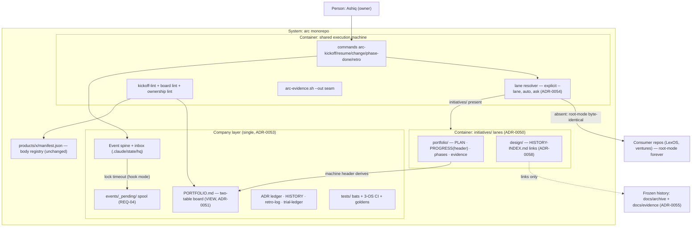

# PLAN.md — Cycle 4 · arc-portfolio "The Conductor"

> Filled by `/arc-kickoff` 2026-07-30. Design source: `docs/strategy/plans/PLAN-portfolio.md`
> (FROZEN, review-freeze v6 — six adjudicated rounds; PORT-A…J → ADR-0050..0059; rejected
> ideas live in the pack's §14 and are not re-litigated here). Predecessor CLOSED:
> `docs/archive/PLAN-2026-07-30.md` (Cycle 3 · arc-design, 4/4 phases closed).
> Attack-panel findings mutate THIS file, never the pack.

## Goal

For Ashiq, arc gains **The Conductor** — multi-lane workspaces (`initiatives/{lane}/` per
product) plus a root `PORTFOLIO.md` board and a uniform `--lane` resolver on the seven
tracker surfaces, so multiple arc products plan and build in parallel while arc stays one
company (one machine, one main, one CI, one spine, one owner) and consumer repos keep
today's root layout byte-identical, forever.

## Current state

<!-- brownfield survey, verified 2026-07-30 (codebase-surveyor) -->
- **Stack:** arc build system v4 · zero-dep Node ≥18 (`.mjs` scripts) · bash-3.2/POSIX · bats tests · 3-OS CI matrix (ubuntu / windows-git-bash / macos).
- **Runs via:** `/arc-kickoff`, `/arc-phase-done`, `/arc-retro`, `/arc-change` (`.claude/commands/*`); bats suite at `tests/`; CI on pull_request via `ci.yml`.
- **Entry points:** `.claude/scripts/plan/kickoff-lint.mjs` (deterministic gate; reads PLAN/PROGRESS/phases hardcoded at root) · `.claude/scripts/plan/arc-evidence.sh` (phase close; writes `docs/evidence/`, `--out` seam exists) · `.claude/commands/arc-*.md` (command markdown; 9 of them reference tracker paths).
- **Core modules:** `products/*/manifest.json` (ownership registry, 8 products) · `arc-products.mjs` (resolver) · event spine `arc-event.sh`/`arc-event.mjs` (hook/strict dual mode, ADR-0031) · `lib/spine-io.mjs` (wx-create lockfile, stale-break, token check; no spool yet — `_quarantine/` only).
- **Also path-coupled:** `statusline.sh`, `SessionStart.d/00-context.sh`, `SessionEnd.d/00-session-log.sh` (all read `PROGRESS.md ## Now`).
- **Conventions:** root PLAN/PROGRESS/phases as the sole tracker, manifest-driven products, conventional commits, feat/* branches + PR, spine receipts + review-ledger, offline-first, WARN-first trial lints, CI byte-identity gate on `tests/fixtures/sync-golden/tree-manifest.txt`.
- **Hot / high-blast-radius:** `kickoff-lint.mjs` + `arc-evidence.sh` (hardcoded paths → lane-aware) · SessionStart/statusline hooks (must apply the degraded rule) · spine lock path (spool lands beside it).
- **Do-not-touch:** `docs/evidence/**` + `docs/archive/**` (frozen history) · runtime output dirs (`docs/design/**`, `docs/council/**`) · `sync-to-project.{sh,ps1}` + `tests/fixtures/sync-golden/tree-manifest.txt` (byte-identity gate; regen only as a named, reviewed step) · `products/*/manifest.json` payload lists (additions only, with golden regen) · CONTENT edits to already-listed payload files this cycle rewrites (`kickoff-lint.mjs`, `arc-evidence.sh`, phase 0) — diff the sync-golden delta FIRST, confirm only intended paths moved, regen as a named step in the same commit · `.claude/state/**`.

## Success requirements

| REQ | User outcome | Measurable acceptance | Phase | Status |
|---|---|---|---|---|
| REQ-01 | **Dual-mode machinery.** The 7 surfaces (`kickoff`, `resume`, `change`, `phase-done`, `retro`, kickoff-lint, arc-evidence) resolve lane-mode per ADR-0054 while root-mode stays byte-identical (consumer contract). | Root-mode goldens pinned BEFORE refactor and green after; bare-root consumer-sim fixture green; fixture-lane suite green; lane-name adversarial fixtures (`../`, absolute path, empty, uppercase, leading-digit) rejected + pinned; `--lane` accepted + echoed on all 7 surfaces (fixtured); bare tokens NEVER parsed as a lane (fixtured: `/arc-change design ...` treats "design" as text); free text containing the literal substring `--lane` (e.g. `/arc-kickoff Add --lane flag docs`) is fixtured on the goal/description surfaces and stays description text, never mis-consumed as the flag; unknown-lane hard-STOP fixture per non-kickoff surface (typo'd name → STOP + known-lane list, 0 folders created); kickoff-only creation fixture (birth + WIP info line); canonical output order asserted (`Selected lane:` first); ambiguity → ask, never guess (fixtured); full bats green on 3 OS. | 0 | active |
| REQ-02 | **Self-hosted migration with rehearsed rollback.** This cycle's tracker moves into `initiatives/portfolio/`; design lane = folder + HISTORY-INDEX.md links only (ADR-0058); `PORTFOLIO.md` v1 born. | Scripted move: dry-run output shown → single commit; rollback REHEARSED first in a DISPOSABLE scratch worktree (`git revert` executed there; root-mode + kickoff-lint + resume proven green post-revert; 0 emitters run there; worktree removed); lane PROGRESS.md carries the machine header block from birth (ADR-0051); `/arc-resume` no-arg follows canonical order (lane echo → board → 5-block report); `/arc-phase-done 1` itself executes in lane-mode; pointer stubs at old root paths; board v1 has both tables + `Updated:` line. | 1 | active |
| REQ-03 | **Board + WIP visibility.** Strict-grammar board lint over BOTH tables and a kickoff-preflight WIP info line (counted = LIVE+BLOCKED) that never stops the owner (ADR-0052). | Fixtures: preflight prints the correct counted number (BLOCKED included) and PROCEEDS at any count — one fixture asserts kickoff is NOT blocked at 2+; board values cross-checked against each lane's PROGRESS machine header (hand-edited divergence WARNs, fixtured); board drift, bad status, malformed dependency line, venture-in-initiatives-table, stale `Updated:` each WARN; every WARN prints Expected / Found / Example (asserted in fixtures). | 2 | active |
| REQ-04 | **Parallel-safety floor.** Ownership-boundary lint (WARN-first, manifest-derived, ADR-0057) + spine emitter concurrency contract: strict = bounded lock retry → exit 2; hook = never blocks, lock timeout routes the event to a per-event `_pending/` spool, surfaced in status/brief, drained under the next lock. | Fixtures: seeded cross-lane edit WARNs with Expected/Found/Example; concurrent emits on 3 OS → main JSONL has 0 interleaved/partial lines, every event lands in main file OR spool, none lost; spool-drain fixture (drained events pass canonical serialization + idem index); spool-visibility fixture (pending count appears in status/brief output). | 2 | active |
| REQ-05 | **Docs truth.** The One Rule rewritten to per-lane law + truth hierarchy + vocabulary; ritual docs updated; ADR template gains a one-line `Product:` field. | Docs-drift ship-gate passes with 0 findings (`/arc-docs`); rewritten One Rule quotes `PORTFOLIO.md` as the index view, not the truth (ADR-0051); `docs/HISTORY.md` entry logged with lane tag; retro run. | 3 | active |

## Appetite

- **Appetite: 3 days** (owner-stated at kickoff; pack recommendation confirmed).
- **Tier:** S
- **Kill criteria (50% tripwire):** 1.5 days burnt with Phase 0 not closed → STOP. Bank
  the pinned goldens + adversarial fixtures (they harden today's single-lane arc
  regardless), revert layout work on the branch, retry decision at retro. No
  half-migrated state may survive a kill — root-mode must be fully working at every
  commit.
- **Scope-cut ladder (pre-decided, aligned with A1):** resolver generalization is the
  sink → ship root-mode goldens + minimal EXPLICIT `--lane` routing only (no
  auto-resolution) and postpone migration — never a half-generalized resolver. Phase 2
  burn reaches 1.0 day (0.25d past its 0.75d allocation — the same absolute margin as
  Phase 0's 1.5d/1.25d tripwire) → ship the Mode-A core value (P0–P1), defer REQ-04 +
  Mode-B certification to a follow-up slice; board carries `Mode B: not certified` and
  concurrent emitters stay forbidden (ADR-0056).
- **Standing tie rule:** venture outweighs OS. If LexOS or design needs the owner
  mid-cycle, this cycle parks — parking cleanly is literally the feature.

## Architecture (C4 concepts, Mermaid flowchart)

```mermaid
flowchart TB
    owner["Person: Ashiq (owner)"]
    subgraph arc["System: arc monorepo"]
        subgraph company["Company layer (single, ADR-0053)"]
            board["PORTFOLIO.md — two-table board (VIEW, ADR-0051)"]
            spine["Event spine + inbox (.claude/state/hq)"]
            spool["events/_pending/ spool (REQ-04)"]
            ledger["ADR ledger · HISTORY · retro-log · trial-ledger"]
            ci["tests/ bats + 3-OS CI + goldens"]
        end
        subgraph lanes["Container: initiatives/ lanes (ADR-0050)"]
            lp["portfolio/ — PLAN · PROGRESS(header) · phases · evidence"]
            ld["design/ — HISTORY-INDEX.md links (ADR-0058)"]
        end
        subgraph machine["Container: shared execution machine"]
            cmds["commands arc-kickoff/resume/change/phase-done/retro"]
            resolver["lane resolver — explicit --lane, auto, ask (ADR-0054)"]
            lint["kickoff-lint + board lint + ownership lint"]
            evid["arc-evidence.sh --out seam"]
        end
        registry["products/x/manifest.json — body registry (unchanged)"]
    end
    frozen["Frozen history: docs/archive + docs/evidence (ADR-0055)"]
    consumer["Consumer repos (LexOS, ventures) — root-mode forever"]
    owner --> cmds
    cmds --> resolver
    resolver -->|"initiatives/ present"| lanes
    resolver -->|"absent: root-mode byte-identical"| consumer
    cmds --> spine
    spine -->|"lock timeout (hook mode)"| spool
    lp -->|"machine header derives"| board
    lint --> board
    lint --> registry
    ld -.->|links only| frozen
```

## Key decisions (ADR index)

| # | Decision | Status |
|---|---|---|
| 0050 | PORT-A: lanes live at `initiatives/{lane}/` (owner-locked) | accepted |
| 0051 | PORT-B: one live plan per lane; PORTFOLIO.md is a view, never the truth | accepted |
| 0052 | PORT-C: WIP visible, never gated (owner-locked, round 4) | accepted |
| 0053 | PORT-D: shared company organs stay single | accepted |
| 0054 | PORT-E: uniform explicit `--lane`; dual-mode resolution; kickoff-only creation (owner-locked, round 6) | accepted |
| 0055 | PORT-F: evidence lane-scoped forward; frozen past | accepted |
| 0056 | PORT-G: two execution modes; Mode B certified only by REQ-04 | accepted |
| 0057 | PORT-H: ownership boundary WARN-first, manifest-derived | accepted |
| 0058 | PORT-I: history — link, never copy | accepted |
| 0059 | PORT-J: ventures appear only as passport rows | accepted |

## Non-negotiables

- Philosophy untouched: Golden Loop, gates, receipts, change discipline — a lane is a namespace for tracker state, nothing more (ADR-0050, ADR-0053).
- No history rewrite and no history duplication: frozen paths stay frozen as sole canonical copies; lanes link, never copy (ADR-0055, ADR-0058).
- Root-mode green at every commit — byte-identical when no `initiatives/` dir exists; the bare-root fixture is a permanent consumer contract (ADR-0054).
- feat/* branch + PR, never main.
- All new lints WARN-first, and every WARN prints Expected / Found / Example (ADR-0057).
- Spine receipts for kickoff / phase-done / retro as usual; no silently lost receipts — degrade visibly, never lose, never block (ADR-0056, REQ-04).
- Never guess a lane: explicit `--lane` beats auto-resolve beats ask; destructive commands confirm the selected lane (ADR-0054).

## No-gos (explicitly out of scope)

- HTML/dashboard board (BRIEF-dashboard's pull-trigger owns it) · companion
  portfolio.yaml/json (a second file is a second truth) · new `/arc-status` command
  (capability ships via `/arc-resume`; alias is a post-v1 candidate) · scheduler or
  automation of lane switching · `products/` → `modules/` rename · consumer-repo
  lane-mode · moving runtime output paths · worktree helper tooling (Mode B uses plain
  git) · touching venture repos (ADR-0059).

## Rabbit holes

- Generalizing the board into a schema · auto-deriving the board from the spine (later,
  dashboard-time) · per-lane ADR numbering (ADR-0053 forbids) · cross-lane dependency
  GRAPHS (the `blocked-on:` / `depends-on:` line convention is enough at N=2) · lane
  lifecycle state machines beyond the four statuses · a general spine queueing/daemon
  system (the spool is a timeout fallback, not an event bus — ADR-0027's no-bus stance
  holds).

## Assumptions ledger

| Assumption | How we'd know it's wrong (trigger) | Phase that tests it |
|---|---|---|
| A1: kickoff-lint + command paths are parameterizable without rewrite | more than 0.5d inside the resolver/lint refactor → FIRED: ship root goldens + minimal EXPLICIT `--lane` routing only, postpone auto-resolution AND migration (scope-cut ladder) | 0 |
| A2: no manifest / sync-to-project entry ships root `PLAN.md`/`PROGRESS.md`/`phases/` to consumers | Phase-0 grep of manifests + sync scripts says otherwise → FIRED: add exclusions + consumer note BEFORE the Phase-1 move | 0 |
| A3: advisory lock + spool covers single-machine AND Mode-B (two worktrees, shared spine) concurrency | any interleaved/corrupt line in main JSONL in fixtures or dogfood → FIRED: strict lockfile for hook mode too; spool becomes the ONLY timeout path, same phase | 2 |
| A4: advisory-only WIP (visible count, no gate) is enough at solo scale | retro finds rework/stall rising while counted lanes exceed 2, or two consecutive weeks with both counted lanes owner-blocked → consider promoting the info line to a WARN at retro (ADR-0052) | 2 |
| A5: Windows (E:\ paths, `git mv` casing) behaves under the design-cycle's cross-OS lessons | any Windows-only CI failure in Phase 0 → apply the no-path-string-compare fixture pattern before proceeding | 0 |

## External dependencies

None — pure repo + tooling, offline by nature, zero new packages. The
interface / fake / real / contract-test table is intentionally empty; recorded here so
the gate sees the section considered rather than skipped (pack §13).

| Dep | Interface | Fake impl | Real impl | Contract test |
|---|---|---|---|---|

## Pre-mortem (Klein)

| # | Failure cause | Mitigation or accepted |
|---|---|---|
| 1 | Silent behavior change in the path refactor breaks a consumer surface nobody watches | Root-mode goldens pinned BEFORE any edit; dual-mode suite + bare-root fixture are the regression net (REQ-01) |
| 2 | Mid-cycle self-move strands the live tracker (the cycle migrates its own state while running) | Dry-run shown → single commit → rollback REHEARSED in a disposable scratch worktree before the real move (REQ-02); root-mode fallback green throughout |
| 3 | The same markdown-contract parsing bugs the council found keep recurring, and this cycle ships two NEW strict-grammar parsers into that exact bug class — board lint reading BOTH tables (REQ-03) and the PROGRESS machine-header block (REQ-01/REQ-03: `status:`/`cycle:`/etc.) — case-sensitive field match, first-vs-last match on a repeated section, `$` under `/m`, or a bold/heading-level cosmetic variant slipping past an exact-match regex | Board lint + kickoff-lint refactor (REQ-01, REQ-03) run the council-v2/v3 markdown-contract checklist BEFORE close: normalize case, take last-of-repeated fields, anchor line regexes, tolerant detection + strict value grammar (retro-log 2026-07-16 arc-council-v2/v3) |
| 4 | Wrong-lane command execution mutates the wrong product's tracker | Kickoff-only creation + unknown-lane hard STOP + `Selected lane:` first-line echo + destructive-command confirm + never-guess (ADR-0054, REQ-01) |
| 5 | Receipt loss/corruption under concurrent emitters (the C2 lesson: 100 receipts lost silently) | Spool contract (REQ-04): main JSONL zero-interleaving fixtured on 3 OS; timeout events spool visibly; drain under lock; Mode B forbidden until green (ADR-0056) |

## Phases (risk-ordered)

| Phase | Capability | Appetite | Depends on |
|---|---|---|---|
| 00 | Dual-mode machinery (steel thread): root goldens pinned, resolver on 7 surfaces, creation/STOP/echo/adversarial fixtures | 1.25 days | none |
| 01 | Self-host + link history + board v1: tracker moves to `initiatives/portfolio/`, rehearsed rollback, design HISTORY-INDEX, SessionStart degraded rule | 0.75 days | phase-00 |
| 02 | Parallel-safety floor: WIP info line, two-table board lint, ownership lint, spine spool contract | 0.75 days | phase-01 |
| 03 | Docs truth + retro: One-Rule rewrite, vocabulary, truth hierarchy, HISTORY entry | 0.25 days | phase-02 |

Phase 0 is the walking skeleton: routing proven against fixtures and goldens BEFORE any
real state moves (migration only after routing is proven). Specs live at
`phases/phase-NN-spec.md`; verification detailed for Phases 0–1, coarse for 2–3 (refined
at phase start via `/arc-change`).
