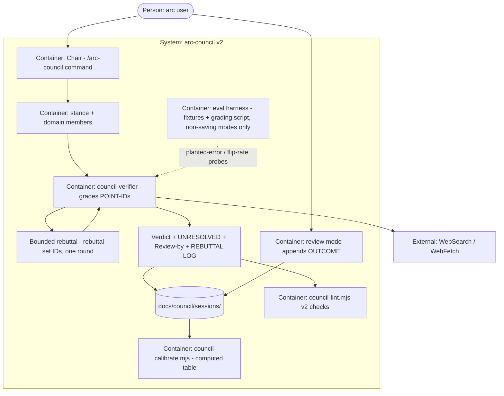

# PLAN.md — arc-council v2

> Scoped kickoff tracker for the arc-council **v2** build. Lives under `docs/council/kickoff-v2/`
> on purpose so arc's root PLAN.md / PROGRESS.md / phases/ (arc's own dev tracker) are never
> touched — same pattern as v1's `docs/council/kickoff/`. Validate with
> `node .claude/scripts/kickoff-lint.mjs docs/council/kickoff-v2`. (Folder avoids the name
> `build/` because `.gitignore` excludes any `build/` dir — this tracker must stay committed.)
>
> **Build tracker:** `docs/council/kickoff-v2/PROGRESS.md` — flip a phase's row on close and
> append one evidence line to its `## Done-log`. ADR numbering continues from v1 (0001–0007
> live in `docs/council/kickoff/docs/adr/`; v2 owns 0008+).
>
> **Term (ADR-0008):** the **rebuttal set** = every POINT-ID rated `Contested` PLUS every ID the
> verifier listed under `DISPUTED`. Rebuttal, re-grade, and `## UNRESOLVED` all operate on exactly
> this set — "Contested/DISPUTED" prose anywhere means this one definition.
> **Parse rule:** `DISPUTED` is the verifier-output section headed `## DISPUTED` (its bullets are
> free prose per the shipped `council-verifier.md` contract); its ID set = every `[A-Z]{1,2}\d+`
> token appearing in that section's bullet lines. `Contested` IDs come from `## POINT RATINGS` /
> `## VERIFIER RATINGS` lines of the form `<ID>: Contested — <line>`.

## Goal
Give every arc-council user a council that keeps score on itself: deep verdicts that name when
and how they'll be judged — and get judged (`review` + calibration table) — contested points that
earn one real rebuttal before the decision, and a probe harness that proves the honesty machinery
catches planted lies, all enforced by a tightened `council-lint`.

## Current state
<!-- From the codebase-surveyor preflight (2026-07-15), amended by the attack panel. -->
- **Stack:** Markdown command + 12 agent .md files + zero-dep Node gates (`council-lint.mjs`,
  `kickoff-lint.mjs`); no runtime service. Execution = Claude Code Task fan-out + WebSearch/WebFetch.
- **Entry points:** `.claude/commands/arc-council.md` (Chair protocol: 8-step full run + `quick`
  mode; verdict contract VERIFIER RATINGS / VERDICT / KEY REASONS / DISSENT / CHEAPEST TEST with
  pre-registered PREDICTION) · `.claude/agents/council-*.md` (12 members; verifier=opus, rest=sonnet)
  · `.claude/scripts/council-lint.mjs` (static · `--verdict`: cited [Pn] anywhere in file must be
  Supported/Plausible + the no-rubber-stamp gate — ≥1 ID rated **Weak OR Contested** in the
  ratings (Weak counts; an all-Weak set passes it) — which v2 KEEPS for every deep verdict and
  every phase-0 fixture, phase-2 adding only the ADR-0008 REBUTTAL-LOG evidence path ·
  `--brief`: ≥3 facts, live High/Med needs ≥2 URLs)
  · `docs/council/references/fairness.md` (11 invariants) · `docs/council/sessions/` (only 001
  exists — model-knowledge mode; shipped pre-correction with `CONFIDENCE: High`, the state the
  ADR-0010 fix removes).
- **Conventions:** arc command/agent frontmatter idiom · red-fixture-first per lint capability
  (v1 fixtures under `docs/council/kickoff/fixtures/phase-NN/`) · zero-padded phase specs ·
  scoped-kickoff-folder for council work · verdicts saved as `sessions/NNN-slug.md`.
- **Wiring (verified):** `sync-to-project.sh/.ps1` ships `.claude/` council files (a new
  `council-calibrate.mjs` WILL ship to consumer projects) but NOT `docs/council/` (sessions + eval
  assets stay repo-only) · no CI job references council-lint (manual gate) · council-lint fixtures
  have no bats runner (`tests/kickoff-lint.bats` covers kickoff-lint only) · `kickoff-lint.mjs`
  accepts a root path arg → scoped tracker lintable.
- **Hot modules for v2:** `council-lint.mjs` verdict/brief modes (all four tightening targets) ·
  `arc-council.md` `## Mode` dispatcher (gains a third `review` branch alongside `quick`/full —
  REQ-04, ADR-0013) · step-2 brief assembly (v1 retro F8's ACTUAL break: researcher fact →
  Chair-compressed brief → all members inherited it) and step-5 verifier handoff (same compression
  class) · step-7 template (gains UNRESOLVED / Review-by / Resolution / REBUTTAL LOG) ·
  `council-verifier.md` output contract (re-grade path) · session 001 (fails the new
  model-knowledge rule until the ADR-0010 fix).
- **Do-not-touch:** arc root `PLAN.md`/`PROGRESS.md`/`phases/` · every non-council command, agent,
  script, doc · the global `~/.claude` council · uncommitted working-tree changes (`.gitignore`,
  `docs/session-log.md`, staged `graphify-out/` deletions — a separate pending task).

## Success requirements

| REQ | User outcome | Measurable acceptance | Phase | Status |
|---|---|---|---|---|
| REQ-01 | A verdict missing its decision core can never pass the gate | `node .claude/scripts/council-lint.mjs --verdict` exits 1, naming the check, for fixtures missing any of `DECISION:`, `CONFIDENCE:`, or a DISSENT section with ≥1 cited ID; the good fixture exits 0; a `DECISION: WAIT` fixture whose ratings contain zero Supported/Plausible IDs is exempt from the DISSENT-citation rule (arc-council.md step-6 escape hatch) and exits 0 | 0 | validated |
| REQ-02 | An offline run can't claim more confidence than its evidence carries | `--verdict` exits 1 for a `Research mode: model-knowledge` fixture with `CONFIDENCE: High`; corrected session 001 (ADR-0010) exits 0 with its `PREDICTION: … → RESULT: …` line and confidence prose edited to match the corrected value (a field-only edit does not count as corrected); a grep over the shipped council surface (`docs/council/README.md`, `docs/council/references/`, `docs/council/sessions/`) finds no doc quoting 001's pre-correction confidence — the kickoff trackers (`kickoff/`, `kickoff-v2/`) are historical records and exempt | 0 | validated |
| REQ-03 | Genuine unresolved disagreement is shown in the verdict, not buried | fixture listing rebuttal-set IDs under `## UNRESOLVED` exits 0; `## UNRESOLVED` present but citing zero IDs exits 1; section absent exits 0; a Weak ID cited in KEY REASONS still exits 1 — the [Pn] citation check is scoped to KEY REASONS + DISSENT | 0 | validated |
| REQ-04 | Every deep verdict names when and how it will be judged, and can be judged | deep-run template emits `Review-by:` (ISO `YYYY-MM-DD`) + `Resolution:` lines; `/arc-council review` lists only sessions whose Review-by is strictly past today, excludes future-dated ones, prints a named no-sessions-overdue message + exits 0 on an empty list, and appends a `## OUTCOME` section whose `RESULT:` line is exactly one of HIT / MISS / UNRESOLVED; `--verdict` accepts both additions | 1 | validated |
| REQ-05 | The council's track record is a number, not a feeling | `node .claude/scripts/council-calibrate.mjs docs/council/sessions` renders per-bucket hit-rate + Brier score using High=0.85/Med=0.65/Low=0.5 (ADR-0009); a session missing `CONFIDENCE:` or lacking a `RESULT:` line is skipped with a named WARN, never a crash; `DECISION: WAIT` and `RESULT: UNRESOLVED` sessions are excluded from hit-rate/Brier and counted separately; on the 3-session fixture set it prints the precomputed expected values exactly | 1 | validated |
| REQ-06 | Contested points get one real second exchange before the decision | dogfood deep run with ≥1 rebuttal-set ID yields `## REBUTTAL LOG` (pre→post rating + one-line reason per ID) with final-only VERIFIER RATINGS; a zero-rebuttal fixture exits 0 with no REBUTTAL LOG; an all-resolved fixture (final ratings show zero Weak/Contested) exits 0 because no-rubber-stamp counts first-pass contests from the REBUTTAL LOG pre-column (ADR-0008) | 2 | active |
| REQ-07 | The verifier grades what members and researchers actually wrote, not a Chair summary | Chair passes each member output AND each researcher FACT PACK verbatim as files; dogfood transcript shows ≥1 file path per member and per researcher in the verifier Task input, and the phase-2 DoD spot-checks ≥1 brief fact against its FACT PACK source (closes the v1 F8 compression class at both hops) | 2 | active |
| REQ-08 | A false fact seeded into the evidence gets caught, provably | 3 planted-error probes run in BOTH research modes (6 runs total, per the Live-web dependency contract) via the eval grading script; the verifier flags the seeded fact in 6/6, and the script exits 1 naming any miss | 3 | active |
| REQ-09 | The same question phrased pro vs con gets the same decision | 2 probe questions × 2 framings run in `quick` mode; the grading script asserts DECISION match per pair and exits 1 on mismatch | 3 | active |

## Appetite
**2 weeks** (10 working days) equivalent, agent-built in focused sessions — a constraint, not an
estimate. Blown appetite = cut scope, never extend. Phase appetites intentionally sum to 9.5 of
10 days — the remaining slack is real, and the kill criteria below is the enforcement.

**Tier:** M

**Kill criteria:** at 50% appetite burnt (5 days): Phases 0 AND 1 must both be closed, else a
mandatory scope-cut conversation — cut Phase 3 first, then REQ-07 out of Phase 2. At 100%: cut or
kill, never silently extend. (PROGRESS.md tracks the burn.)

## Architecture (C4 concepts, Mermaid flowchart)

## Key decisions (ADR index)

| # | Decision | Status |
|---|---|---|
| 0008 | Rebuttal: final-only ratings + `## REBUTTAL LOG`; no-rubber-stamp grades the first pass; defines the rebuttal set (Contested ∪ DISPUTED) | accepted |
| 0009 | Calibration scores categorical buckets (High .85 / Med .65 / Low .5); no new contract line | accepted |
| 0010 | Session 001 corrected in place — no grandfathering machinery | accepted |
| 0011 | Eval harness = hybrid fixtures + node grading script + runbook | accepted |
| 0012 | Outcome data lives in session files; the calibration table is computed, never stored | accepted |
| 0013 | `review` is a mode of /arc-council, not a separate command | accepted |

## Non-negotiables
- Member independence holds through rebuttal — a rebutting member sees ONLY the single opposing point it answers, never sibling outputs; failed members retried blind (fairness.md invariant 1).
- Rebuttal is bounded: ONE round, rebuttal-set IDs only — the rebuttal set = IDs rated Contested plus IDs listed under the verifier's DISPUTED section — and the verifier re-grades only those IDs (ADR-0008).
- First-pass contest evidence is never erased — when a rebuttal ran, `## REBUTTAL LOG` records every pre→post rating with a one-line reason; no rebuttal ran → no REBUTTAL LOG section (ADR-0008).
- Past verdicts are append-only — review appends `## OUTCOME`; nothing rewrites DECISION, CONFIDENCE, or ratings. Sole sanctioned exception: the one dated ADR-0010 correction to session 001.
- No fabrication extends to eval assets — seeded errors are labeled as seeded inside eval files, probes run only in non-saving modes (quick + verifier-only, never a deep run), and OUTCOME entries record what actually happened (ADR-0011).
- Quick-mode output stays exempt from every `--verdict`/`--brief` check — quick writes no file and carries no POINT-IDs, VERIFIER RATINGS, or Research-mode line; no council-lint invocation targets a quick transcript.
- Council-files-only — changes touch `.claude/commands/arc-council.md`, `.claude/agents/council-*.md`, `.claude/scripts/council-*.mjs`, `docs/council/**`, and new council-scoped files; arc's root tracker and every non-council file stay untouched.

## No-gos (explicitly out of scope)
- Backlog stays backlog: cross-model juror, stakes tiers, asker-context slot, life-counselor privacy default, generic specialist template — none enter v2 through side doors.
- No numeric `CONFIDENCE-PROB:` line this cycle — that is ADR-0009's recorded upgrade path, not a v2 deliverable.
- No multi-round debate: rebuttal never iterates past one round, and members never free-chat.
- No CI wiring for council gates this cycle — council-lint and the eval harness stay manually run (v1's stance, unchanged).
- No bats runner for council-lint fixtures this cycle either — Phase 0 adds red+good fixtures for 3 new checks on top of v1's manually-invoked set; they stay `node`-invoked, not wired into `tests/*.bats`.
- No auto-scheduling or reminders for reviews — `review` is user-invoked; the loop's cadence belongs to the user.
- No re-litigating the v1 verdict contract beyond the named additions (UNRESOLVED, Review-by/Resolution, OUTCOME, REBUTTAL LOG).

## Rabbit holes
- Rebuttal ballooning into a debate engine → hard bound in the command: one round, rebuttal-set IDs only, fixed rebuttal-prompt template.
- Calibration statistics (confidence intervals, time decay, per-domain splits) → v2 renders counts, per-bucket hit-rate, and Brier — nothing else.
- Eval probe-set growth → capped at 3 planted-error probes + 2 flip-rate pairs + the lint fixture sweep; more probes = next cycle.
- Re-fixturing v1 → only checks that change get new fixtures; v1's fixtures stay untouched.
- Chair-protocol prose creep → `arc-council.md` gains the `review` mode branch, the rebuttal step, and the template lines — no rewrite of shipped steps.

## Assumptions ledger

| Assumption | How we'd know it's wrong (trigger) | Phase that tests it |
|---|---|---|
| The verifier's re-grade stays adversarial, so the ADR-0008 first-pass rule isn't a loophole | dogfood: >80% of rebuttal-set IDs flip to Supported after rebuttal across ≥2 runs | 2 |
| ADR-0009 bucket priors (0.85/0.65/0.5) are sane starting values before real data | first 5 recorded OUTCOMEs show High-confidence hit-rate <60% | 1 |
| Hand-authored fixtures predict live verifier behavior (ADR-0011) | a planted-error probe passes on fixtures while an equivalent live seeded error goes uncaught | 3 |
| Session files scale as the only calibration store (ADR-0012) | `council-calibrate.mjs` takes >5s, or a schema-valid session fails to parse | 1 |
| The rebuttal re-spawn chain runs inside Claude Code limits with zero new agents (v1 F6 class) | any phase needs a new `subagent_type`, OR a rebuttal re-spawn/re-grade hop fails or loses state in a phase-2 dogfood | 2 |

## External dependencies

| Dep | Interface | Fake impl | Real impl | Contract test |
|---|---|---|---|---|
| Task/Agent fan-out (rebuttal re-spawn + verifier re-grade) | Chair spawns targeted rebuttal Tasks then one re-grade Task, per ADR-0008 | eval fixtures stand in for member outputs — no spawn needed | live Claude Code Task calls | phase-2 dogfood: a run with ≥1 rebuttal-set ID completes the four-hop chain (members → verifier → rebuttal → re-grade) with 0 spawn errors |
| Live web at probe time (verifier fact-checks seeded claims) | verifier uses WebSearch/WebFetch while grading planted-error probes | model-knowledge grading of fixture briefs, no web calls | live WebSearch/WebFetch | phase-3: each probe returns a graded catch-or-miss result in BOTH modes |
| `council-calibrate.mjs` on a synced consumer project | reads `docs/council/sessions/*.md`; ships to every project via sync-to-project's `.claude/scripts/` copy | run against a project with an empty or absent `docs/council/sessions/` | run against this repo's populated `docs/council/sessions/` | phase-1: the script on a sessions-less directory exits 0 with a named no-sessions message, never a crash |

## Pre-mortem (Klein)
<!-- Seeded from council v1 retro history (docs/council/kickoff/retro-project.md F10 + per-phase
     retros F6/F8/F9): in a multi-agent prompt build the real risks are orchestration, not
     strategy. Rebuilt by the attack panel (focus C) — every row cites this plan. -->

| # | Failure cause | Mitigation or accepted |
|---|---|---|
| 1 | Rebuttal chains four same-turn Task hops (members → verifier → targeted rebuttal → re-grade) — a re-spawn pattern v1 never exercised, and v1's only real spawn bug (F6, same-turn registration) was lifecycle-class (REQ-06, ADR-0008, phase-2) | phase-2 DoD requires one dogfood where the full four-hop chain completes in-session with 0 spawn/state-loss errors; assumptions-ledger row 5's trigger now includes re-spawn sequencing failures |
| 2 | v1 F8 actually broke at step-2 brief assembly (researcher fact → Chair-compressed brief → every member inherited it); fixing only the member→verifier hop leaves the poison upstream (REQ-07, phase-2) | REQ-07 widened: researcher FACT PACKs pass verbatim as files alongside member outputs, and the phase-2 DoD spot-checks ≥1 brief fact against its FACT PACK source; Current-state note corrected to name step-2 |
| 3 | OUTCOME has no strict grammar, so `council-calibrate.mjs` either crashes on free text or silently mis-scores it — the calibration table runs and lies (REQ-04, REQ-05, ADR-0012, phase-1) | grammar fixed in REQ-04 (`RESULT: HIT / MISS / UNRESOLVED` literal); REQ-05 skips-with-WARN anything else; phase-1 ships an ambiguous-OUTCOME red fixture the script must reject |
| 4 | "Contested" (a rating) vs "DISPUTED" (a verifier section) read as one set in some places and two in others — the Chair's rebuttal selection and council-lint's checks could resolve DIFFERENT ID sets from the same verdict (REQ-03, REQ-06, phase-0, phase-2; v1 F9 term-ambiguity class) | defined once in ADR-0008 and the PLAN header: rebuttal set = Contested-rated ∪ verifier-DISPUTED IDs; all v2 prose normalized to "rebuttal set"; a phase-0 fixture exercises both sources |
| 5 | Live probes run the real pipeline, land verdicts in `docs/council/sessions/`, corrupt the NNN sequence, and feed seeded lies straight into the calibration set (REQ-08, REQ-09, ADR-0011, phase-3) | probes run only in non-saving modes (quick + verifier-only) per the Non-negotiables; the phase-3 runbook forbids deep-mode probes; phase-3 DoD includes `git status` proof that `docs/council/sessions/` is untouched |

## Phases (risk-ordered)

| Phase | Capability | Appetite | Depends on |
|---|---|---|---|
| 0 | Steel thread — tightened gates: three new `--verdict` checks (decision-core, model-knowledge cap, UNRESOLVED/scoped citations) with red+good fixtures incl. the rebuttal-set fixture, session-001 correction (ADR-0010) | 2 days | none |
| 1 | Calibration loop: Review-by/Resolution template lines, `review` mode (Mode-dispatcher branch, overdue listing, OUTCOME grammar), `council-calibrate.mjs` Brier/hit-rate script + 3-session fixture set with precomputed expected values (ADR-0009, ADR-0012, ADR-0013) | 3 days | phase-0 |
| 2 | Bounded rebuttal + verbatim handoff: rebuttal step + REBUTTAL LOG (ADR-0008), member outputs AND researcher FACT PACKs as files to the verifier (F8 both hops / REQ-07) | 2.5 days | phase-0, phase-1 |
| 3 | Eval harness: planted-error probes (both modes), framing flip-rate probes, grading script + runbook, session-store isolation proof (ADR-0011) | 2 days | phase-0, phase-2 |
