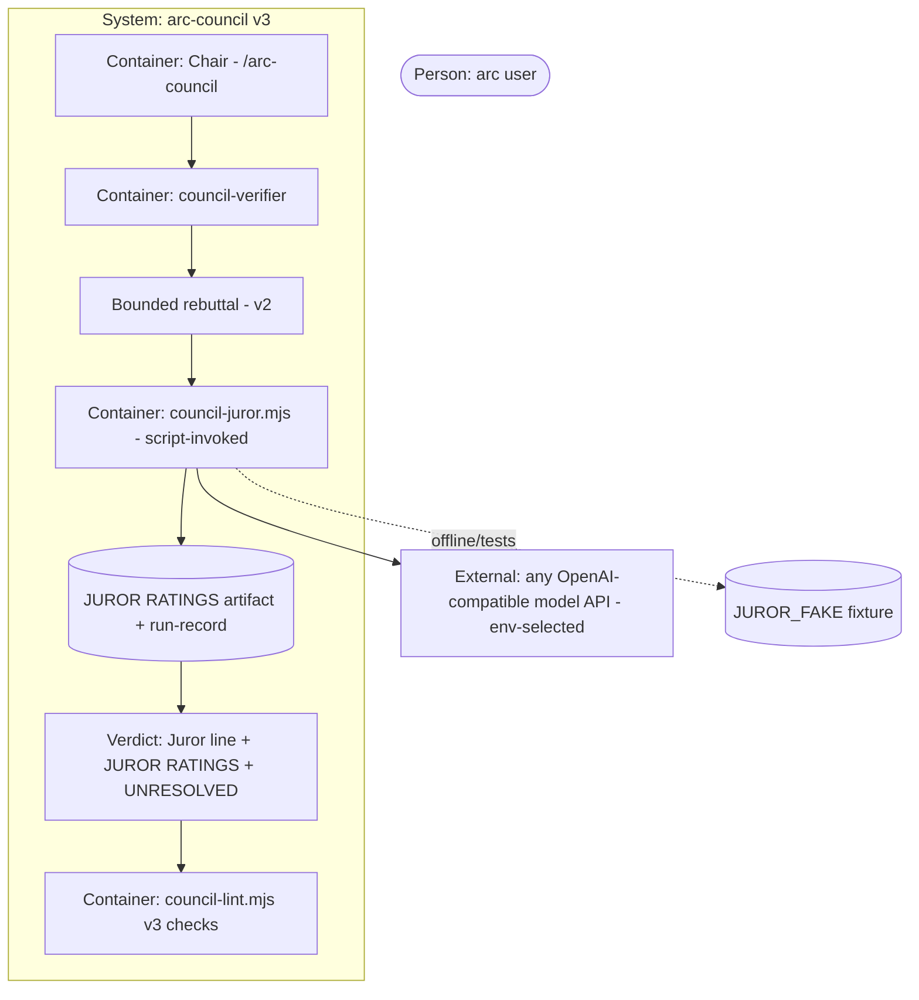

# PLAN.md — arc-council v3 (cross-model juror)

> Scoped kickoff tracker (same pattern as v1/v2): lives under `docs/council/kickoff-v3/` so arc's root
> tracker is never touched. Validate: `node .claude/scripts/kickoff-lint.mjs docs/council/kickoff-v3`.
> Build tracker: `docs/council/kickoff-v3/PROGRESS.md`. ADR numbering continues from v2 (v3 owns 0015+).
> Branch: `feat/council-v3`, **stacked on `feat/council-v2`** (PR #25 open — merge it first; v3's PR
> then targets main).

## Goal
Close ADR-0014's documented residual: a **cross-model juror** — an independent grader from a different
model family, invoked by a script the Chair doesn't hand-author — makes the council's first-pass ratings
and rebuttal log verifiable against output a single author cannot quietly fabricate.

## Current state
<!-- From the codebase-surveyor preflight (2026-07-16). -->
- **Stack:** zero-dep node gates (`council-lint.mjs`, `council-calibrate.mjs`) + Markdown command/agents;
  execution = Claude Code Task fan-out. v2 (feature-complete, PR #25 open) is the base.
- **Entry points:** `.claude/commands/arc-council.md` (step 5 verifier w/ verbatim file handoff · step 5b
  bounded rebuttal · step-7 template: `## VERIFIER RATINGS` / `## FIRST-PASS RATINGS` / `## REBUTTAL LOG`
  / `## UNRESOLVED`) · `.claude/scripts/council-lint.mjs --verdict` (the hard gate) ·
  `.claude/commands/arc-second-opinion.md` (existing cross-model precedent: shells `codex exec`).
- **Conventions:** red-fixture-first per lint capability (fixtures under the scoped tracker) · zero-dep
  scripts in `.claude/scripts/` ship via sync; `docs/council/` never syncs · offline-first: every external
  dep gets interface + fake + real + contract test · adversarial breaking-input pass before a gate closes
  (v2 retro F1).
- **Hot modules:** `council-lint.mjs --verdict` (gains Juror checks) · `arc-council.md` step 5b/7 (gains
  the juror step + `Juror:` line + `## JUROR RATINGS`) · ADR-0014 (the charter this build closes).
- **Do-not-touch:** arc root tracker · every non-council file (incl. `.env.example` — juror env vars are
  documented in the command + `docs/council/README.md` instead) · PR #25 branch state · the user's
  uncommitted working-tree changes. **Codex CLI is NOT installed** (verified) — nothing may depend on it.

## Success requirements

| REQ | User outcome | Measurable acceptance | Phase | Status |
|---|---|---|---|---|
| REQ-01 | The juror runs end-to-end with no network and no keys (steel thread on the fake) | `node .claude/scripts/council-juror.mjs --points FILE --out ARTIFACT` with `JUROR_FAKE=FIXTURE` writes a `## JUROR RATINGS` artifact (one `ID: RATING — REASON` line per rebuttal-set id, OR — when the points file has zero ids because the rebuttal set was empty — a body of exactly `(no rebuttal ran — nothing to grade)`, which lint treats as present+parseable) + a run-record block; the phase-0 fixture sweep exits 0 (including a `good-empty-rebuttal-set.md` fixture) and a malformed-fixture run exits 1 naming the defect | 0 | validated |
| REQ-02 | A configured-but-missing juror can never pass the gate, and an unconfigured run stays valid | `--verdict` fixtures: `Juror:` names a model but `## JUROR RATINGS` absent/unparseable → exit 1 (detection tolerant to cosmetic line/heading variants; value grammar strict — `MODEL @ HOST` or `unavailable (REASON)`, near-misses fail); an ANCHOR-SET id (rated Weak/Contested in FIRST-PASS RATINGS, or in REBUTTAL LOG) absent from JUROR RATINGS (juror configured) → exit 1 (ADR-0017); `## JUROR RATINGS` present without a model-naming `Juror:` line → exit 1; >1 `Juror:` line or >1 JUROR-RATINGS heading → exit 1; `Juror: unavailable (REASON)` with no artifact → exit 0; session 001 + the v2 dogfood verdict (no Juror line) still exit 0 | 0 | validated |
| REQ-03 | Any OpenAI-compatible provider works with only an env change | the same script produces valid artifacts from ≥2 REAL providers (whichever two of OpenAI/Gemini-compat/DeepSeek/Groq/xAI/OpenRouter keys exist) changing ONLY `JUROR_BASE_URL`/`JUROR_MODEL`/`JUROR_API_KEY`; failure taxonomy names timeout/auth/rate-limit/parse distinctly | 1 | active |
| REQ-04 | Deep runs get an independent cross-model check on the fabrication surface | `arc-council.md` gains the juror step (after 5b): script-invoked on the rebuttal set + first-pass anchors (ADR-0017), artifact script-written (ADR-0018), verdict carries `Juror:` + `## JUROR RATINGS`, juror-vs-verifier disagreements surfaced under `## UNRESOLVED`; one live dogfood on the v2 dogfood artifacts completes with a real provider | 1 | active |
| REQ-05 | The P2 fabrication attack is now caught, provably | `council-lint.mjs --verdict FILE --juror-artifact FILE` requires the verdict's `## JUROR RATINGS` to match the script-written artifact via a `Juror-Artifact-SHA256:` line in the verdict checked against the artifact file's hash; a verdict with a fabricated first-pass contest (the P2 attack shape) whose JUROR-RATINGS id-set or hash diverges from the artifact exits 1 naming the mismatch; the honest twin (verdict hash == artifact hash) exits 0 | 1 | validated |

## Appetite
**3 days** equivalent — a constraint, not an estimate. Phase appetites sum to 2.5 of 3 days; the 0.5d
slack is real.

**Tier:** S

**Kill criteria:** at 50% appetite burnt (1.5 days), Phase 0 must be closed, else a mandatory scope-cut
conversation — cut REQ-03 to ONE real provider first, then cut REQ-05's probe to fixture-only. At 100%:
cut or kill, never silently extend.

## Architecture (C4 concepts, Mermaid flowchart)

## Key decisions (ADR index)

| # | Decision | Status |
|---|---|---|
| 0015 | Provider-agnostic juror via the OpenAI-compatible chat-completions protocol (env-selected; supersedes the "no external paid APIs" no-go for the juror only) | accepted |
| 0016 | Availability: required-when-configured; unset ⇒ named `Juror: unavailable` line | accepted |
| 0017 | Scope: the ADR-0014 charter only — rebuttal set + first-pass anchors | accepted |
| 0018 | Script-written artifact + run-record; disagreement is UNRESOLVED signal, never failure | accepted |

## Non-negotiables
- Council-files-only (as v2): changes touch `.claude/commands/arc-council.md`, `.claude/scripts/council-*.mjs`, `docs/council/**`, and new council-scoped files; every other root file stays untouched on this branch — sole owner-sanctioned exception (Ashiq, 2026-07-16): the `JUROR_*` declarations in `.env.example`, per arc's env-contract convention.
- Secrets: `JUROR_API_KEY` is read from env only — never committed, never echoed into artifacts, run-records, fixtures, or logs (pre-mortem row 4 carries the grep check).
- Offline-first: the fake impl + its contract test are green (Phase 0) before any real provider call exists (Phase 1); an unconfigured deep run always completes with a named `Juror: unavailable` line (ADR-0016).
- The juror never modifies ratings — it is an append-only independent grader; disagreement is surfaced under `## UNRESOLVED`, and agreement is never required (ADR-0018).
- Required-when-configured is mechanical: a configured juror that failed is a named lint failure, never a silent skip (ADR-0016).
- Every new lint check ships red-fixture-first AND gets an adversarial breaking-input pass before its phase closes (v2 retro F1 — mandatory verification, not optional review).

## No-gos (explicitly out of scope)
- No npm dependencies — `council-juror.mjs` is zero-dep node `fetch`, like every council script.
- No non-OpenAI-compatible native SDKs/adapters — a non-compat provider is proxied (e.g. OpenRouter) or waits for ADR-0015's revisit trigger.
- No juror in `quick` mode — deep runs only.
- No juror-verifier agreement requirement and no auto-resolution of disagreements (ADR-0018).
- No full-parallel second verifier (ADR-0017).
- No cryptographic signing — but the ADR-0018 revisit trigger already FIRED at kickoff (the attack panel proved a hand-typed `## JUROR RATINGS` defeats the design), so the **SHA-256 verdict↔artifact binding is IN scope** (REQ-05); anything beyond that hash stays out.

## Rabbit holes
- Provider adapter zoo → ONE protocol (OpenAI-compat); anything else is out of scope.
- Disagreement-resolution machinery → out; UNRESOLVED display only.
- Endless juror prompt-engineering → one strict output-format prompt, parse-or-fail, at most ONE revision during Phase 1 dogfood.
- Provider benchmarking / free-model quality chasing → document minimum-capability guidance in the README, nothing more.

## Assumptions ledger

| Assumption | How we'd know it's wrong (trigger) | Phase that tests it |
|---|---|---|
| The OpenAI-compat chat-completions shape holds across target providers with only env changes (ADR-0015) | a target provider rejects the standard request shape or returns a non-standard response envelope | 1 |
| A cross-family model returns parseable structured ratings under a strict format prompt | >1 of 3 dogfood juror calls unparseable after the one allowed prompt revision | 1 |
| A script-written artifact + run-record raises the fabrication bar meaningfully (ADR-0018) | the adversarial pass finds a trivial forgery path the run-record doesn't surface | 1 |
| A cheap/free-tier model grades well enough to corroborate or contest ratings | the juror passes the fabrication probe with a frontier model but fails it with the chosen free model | 1 |

## External dependencies

| Dep | Interface | Fake impl | Real impl | Contract test |
|---|---|---|---|---|
| External model API (OpenAI-compatible) | `council-juror.mjs`: rebuttal-set points file in → script-written `## JUROR RATINGS` artifact + run-record out | `JUROR_FAKE=FIXTURE` mode — reads a canned provider response, zero network | any OpenAI-compat endpoint via `JUROR_BASE_URL`/`JUROR_MODEL`/`JUROR_API_KEY` | Phase 0: fixture sweep green against the fake; Phase 1: same script, env-only change, valid artifacts from ≥2 real providers |

## Pre-mortem (Klein)
<!-- Seeded from the v2 retro (docs/council/kickoff-v2/retro-project.md F1/F2) + v2 P0 attack classes. -->

| # | Failure cause | Mitigation or accepted |
|---|---|---|
| 1 | The fresh lint checks have holes — every new gate in v2 did (retro F1) (REQ-02, phase-0) | red+good fixtures BEFORE the checks exist, then a mandatory adversarial breaking-input pass before phase-0 closes |
| 2 | A new repeatable-looking section with no multiplicity guard reopens retro F2(a) verbatim: >1 `Juror:` line or >1 `## JUROR RATINGS` section lets a first-match/decoy line pass lint — unlike REBUTTAL LOG / FIRST-PASS RATINGS, which already carry the >1-section guard (REQ-02, phase-0) | mirror the existing >1-section→fail guard onto `## JUROR RATINGS` and `Juror:` before phase-0 closes; `bad-two-juror-lines.md` / `bad-two-juror-ratings-sections.md` red fixtures |
| 3 | A Chair dodges required-when-configured by omitting the `Juror:` line — the v2 decoy-WAIT attack class (REQ-02, ADR-0016, phase-0) | lint enforces bidirectional consistency (`Juror:` model line ⇔ `## JUROR RATINGS`) AND REBUTTAL-LOG-ids ⊆ JUROR-RATINGS-ids; the protocol-level residual (omitting both on a fresh run) is named honestly in ADR-0016 |
| 4 | `JUROR_API_KEY` leaks into an artifact, run-record, or committed fixture (REQ-01, phase-0) | the run-record schema contains no headers/secrets by construction; phase DoDs include a key-pattern grep across all written artifacts |
| 5 | Six months later a Chair (or a careless session) hand-types `## JUROR RATINGS` with no byte/hash tie to the script-written artifact — lint passes because it only reads the verdict, never the artifact (REQ-05, ADR-0018, phase-1) | ship REQ-05's artifact-binding check (verdict `Juror-Artifact-SHA256:` vs `--juror-artifact` file hash) before phase-1 closes; until it ships, no doc may claim the juror is fabrication-proof |

## Phases (risk-ordered)

| Phase | Capability | Appetite | Depends on |
|---|---|---|---|
| 0 | Steel thread: `council-juror.mjs` (interface + fake impl) + artifact/run-record contract + the three lint checks, red-fixture-first | 1 day | none |
| 1 | Real providers (≥2, env-only switch) + the arc-council.md juror step + live dogfood on the v2 dogfood artifacts + the fabrication probe + adversarial pass | 1.5 days | phase-0 |
