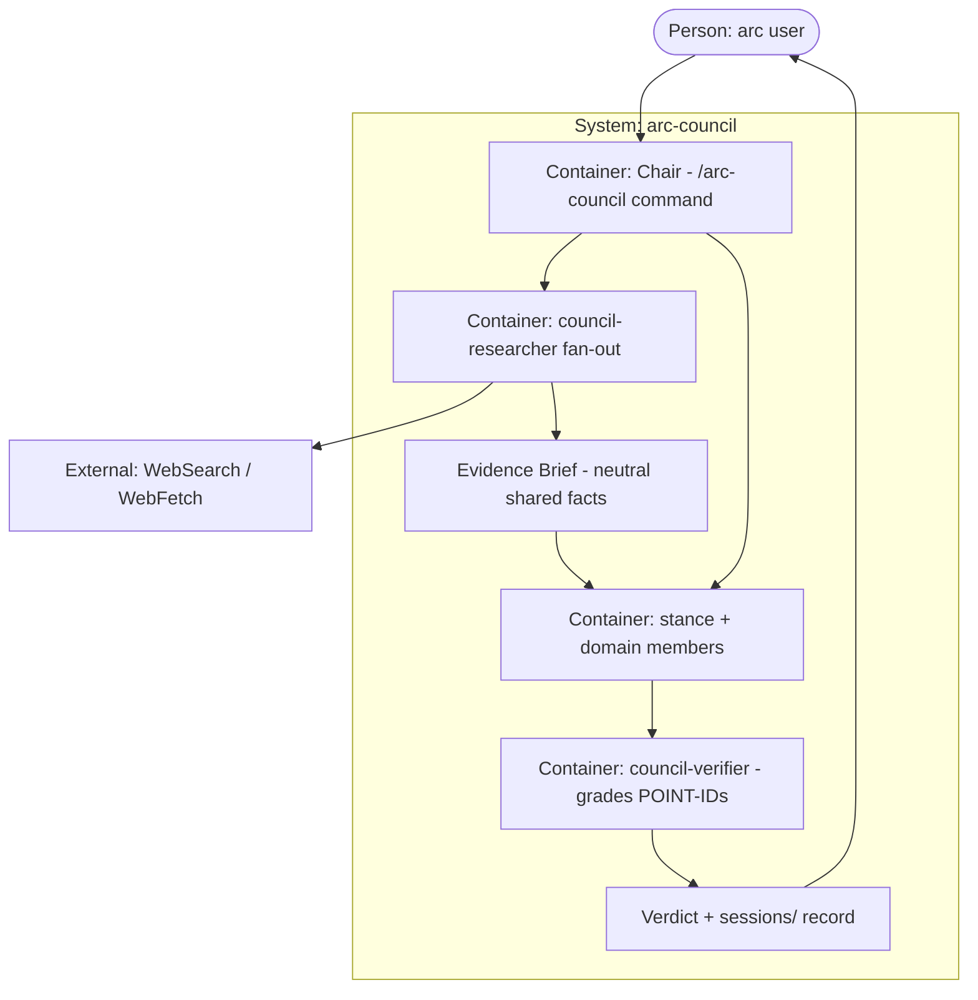

# PLAN.md — arc-council

> Scoped kickoff tracker for the arc-council build. Lives under `docs/council/kickoff/` on purpose so arc's
> own root PLAN.md / PROGRESS.md / phases/ (which track arc's development) are never touched. Validate with
> `node .claude/scripts/kickoff-lint.mjs docs/council/kickoff`. (Folder is `kickoff/`, not `build/`, because
> `.gitignore` excludes any `build/` dir — this tracker must stay committed.)
>
> **Build tracker:** `docs/council/kickoff/PROGRESS.md` — its Phases table holds each phase's Status; on
> phase close, flip that phase's row to ✅ and append a one-line evidence entry to the `## Done-log` section
> of the same file. (This is arc-council's OWN tracker; arc's root `PROGRESS.md` stays untouched.)

## Goal
Give any arc user a one-command multi-agent advisory board — `/arc-council "your question"` — that researches
the question, debates it from FOR / AGAINST / neutral plus matched domain-expert angles, verifies the
evidence, and returns a single decision with confidence, preserved dissent, and the cheapest test that
would de-risk it.

## Current state
- **Stack:** Markdown artifacts only (a slash-command + subagent definitions + reference docs) — no runtime
  service; execution is Claude Code's Task/Agent fan-out + WebSearch/WebFetch; the build tracker is gated by
  the existing Node `kickoff-lint.mjs`; a new zero-dep `council-lint.mjs` gates the deliverable artifacts.
- **Entry points:** `.claude/commands/arc-council.md` (the command / Chair protocol) · `.claude/agents/council-*.md`
  (the members) · `docs/council/references/*.md` (roster, roles, output format, fairness) · `docs/council/sessions/`
  (saved verdicts).
- **Conventions:** arc command idiom (frontmatter `description`/`argument-hint`/`allowed-tools`, numbered
  steps, STOP gates) · arc agent idiom (frontmatter `name`/`description`/`tools`/`model`, no `arc-` prefix,
  invoked via Task `subagent_type`) · reference blueprints mined but not copied.
- **Do-not-touch:** arc's root `PLAN.md` / `PROGRESS.md` / `phases/` (arc's own dev tracker) · the global
  `~/.claude` council · every pre-existing arc command, agent, script, and doc. arc-council is additive only.

## Success requirements

| REQ | User outcome | Measurable acceptance | Phase | Status |
|---|---|---|---|---|
| REQ-01 | Ask a question, get a decision in one command | `` `/arc-council "…"` `` returns a verdict containing a DECISION ∈ {YES, NO, CONDITIONAL, WAIT} in a single run | 0 | active |
| REQ-02 | Trust the verdict — only survived points, real dissent | verifier output present; every KEY REASON cites a POINT-ID that appears in the verifier's Supported/Plausible list; ≥1 DISSENT bullet that cites a verifier-rated surviving opposing point | 1 | active |
| REQ-03 | Members answer in a machine-checkable structure | each member response carries the 5 contract headers + numbered POINT-IDs; `` `node .claude/scripts/council-lint.mjs` `` exits 0 and flags any run where the verifier contested 0 points | 1 | active |
| REQ-04 | Deep runs debate over researched, triangulated facts | deep-run Evidence Brief lists ≥3 facts, each with a confidence label and ≥2 independent sources or an explicit low-confidence mark; dogfood spot-checks ≥1 cited URL per fact for a real fetch | 2 | active |
| REQ-05 | Works with no web (offline-first) | with web disabled, `` `/arc-council` `` still returns a full verdict; Evidence Brief marked `model-knowledge` | 2 | active |
| REQ-06 | The right experts convene per question | a finance+marketing question convenes `` `council-risk-analyst` `` + `` `council-marketer` ``; a single-domain question convenes only its expert(s); a >4-domain question convenes the top-4 by documented priority and names the dropped domain(s) in caveats; ceiling ≤4 experts | 3 | active |
| REQ-07 | Every named domain has a working expert | 5 core + 7 domain `` `council-*` `` agents exist; each spawns via `subagent_type` with 0 missing-agent errors | 3 | active |
| REQ-08 | The debate is fair and honest by construction | verdict includes a `PREDICTION-vs-RESULT` line (Chair records its predicted DECISION + confidence BEFORE reading the verifier's graded output, then the actual beside it); members spawned in 1 parallel batch with no cross-member content; `` `fairness.md` `` checklist verified by `` `council-lint` ``/the verifier, never Chair-self-graded | 4 | active |
| REQ-09 | Substantive decisions are logged, quick takes aren't | a deep run writes `` `docs/council/sessions/NNN-slug.md` `` containing all 8 verdict sections; a `quick` run writes 0 files | 4 | active |
| REQ-10 | Ships with arc, touches nothing existing | `` `sync-to-project` `` dry-run reports 0 modifications to pre-existing files; arc root `` `PLAN.md` ``/`` `PROGRESS.md` `` unchanged | 4 | active |

## Appetite
**3 weeks** equivalent, agent-built in focused sessions — a constraint, not an estimate. If the phase
appetites blow, cut scope (drop a domain expert; defer auto-save = REQ-09) rather than extend.

**Tier:** M

**Kill criteria:** at 50% appetite burnt (Phases 0–1 done), run 1 fixed probe question through both a full
council run and a single raw model answer, and write the Chair's comparison naming ≥1 verified fact or
reversal the raw answer lacked; absence of one → mandatory scope-cut conversation. At 100% → cut Phase 4
polish and ship the verified core (drop auto-save first = REQ-09), never silently extend.

## Architecture (C4 concepts, Mermaid flowchart)

## Key decisions (ADR index)

| # | Decision | Status |
|---|---|---|
| 0001 | Build arc-council fresh & arc-native (don't reuse the global council) | accepted |
| 0002 | Always-deep default, with a `quick` opt-out | accepted |
| 0003 | Shared, neutral Evidence Brief as canonical fact source (members may gap-fill) | accepted |
| 0004 | Chair auto-selects roster inline; domain-expert ceiling of 4 | accepted |
| 0005 | Deep runs auto-save the verdict; quick runs stay ephemeral | accepted |
| 0006 | Per-agent model tiers (verifier opus, members sonnet) | accepted |
| 0007 | Mechanical verification contract — POINT-IDs the lint can check | accepted |

## Non-negotiables
- **Member independence** — members are spawned in one parallel batch and never see each other's answers; a failed member is retried blind, never primed with siblings' returned answers.
- **No fabrication, neutral brief** — no invented sources or numbers; unverifiable claims are marked low-confidence; the Evidence Brief states facts only, with no language leaning toward any verdict.
- **Mechanically-verified verdict** — every KEY REASON and the DISSENT cite a POINT-ID the verifier rated Supported/Plausible; `council-lint` rejects a verdict that cites an unrated/Weak point or a run whose verifier contested nothing.
- **Commit under uncertainty** — the Chair always returns a concrete DECISION (YES / NO / CONDITIONAL / WAIT), never "it depends"; offline in `model-knowledge` mode a run still returns a verdict, and if every brief fact is low-confidence the honest decision is WAIT with a named de-risk test, not a confident YES/NO from priors.
- **Additive-only** — never modify arc's root tracker or any pre-existing file; only `.claude/commands/`, `.claude/agents/`, and `docs/council/references/` ship in sync; generated `docs/council/sessions/*` are sync-excluded.
- **Fair by construction, not self-report** — fairness invariants are enforced by `council-lint`/the verifier, never self-graded by the Chair that wrote the synthesis; the strongest surviving opposing point is always shown as DISSENT.

## No-gos (explicitly out of scope)
- No UI or web app — a slash-command + subagents + reference docs only.
- No change to, or dependency on, the global `~/.claude` council (ADR-0001).
- No streaming/live back-and-forth debate — one request → one verdict.
- No external paid APIs — web research uses the built-in WebSearch/WebFetch only.
- No auto-execution of the decision — arc-council advises, it never acts on the recommendation.
- No outcome-calibration loop in v1 — saved verdicts (REQ-09) are a decision log, not auto-checked against what actually happened; every verdict instead ships a DISSENT + a cheapest de-risk test so the user is never falsely certain (a v2 concern).

## Rabbit holes
- Endless research fan-out → cap at ~5 researchers and a single round; the brief is "good enough", not exhaustive.
- Over-convening experts → ceiling 4, domain-matched (ADR-0004), never "all 7 just in case".
- Verifier re-litigating everything → it grades evidence and rates POINT-IDs, it does not re-argue the sides.
- Perfecting fairness → `fairness.md` is a checklist of invariants `council-lint` can check, not a numeric scoring engine.

## Assumptions ledger

| Assumption | How we'd know it's wrong (trigger) | Phase that tests it |
|---|---|---|
| A run can spawn ~7–12 subagents within Claude Code limits | a deep run errors on a subagent/concurrency limit (first real stack is phase-4's research+stance+domain+verifier roster, not phase-0's 3 members) | 4 |
| Members spawned in one batch stay mutually blind | a member cites another member's argument it was never given | 1 |
| WebSearch/WebFetch are available at council runtime | research silently falls back to model-knowledge because web tools error | 2 |
| The structural + POINT-ID lint is reliable enough to make REQ-02/03 real | `council-lint` false-passes a fabricated or empty member response in dogfood | 1 |
| `quick` mode actually reduces cost/latency, not just file-writing | a `quick` run still spawns the full research + verifier batch at near-deep cost | 1 |

## External dependencies

| Dep | Interface | Fake impl | Real impl | Contract test |
|---|---|---|---|---|
| Web research | `council-researcher` contract: sub-questions → FACT PACK with per-fact confidence + sources | research-mode `model-knowledge` (no web calls; facts from model priors, marked as such) | live WebSearch / WebFetch | offline run returns a verdict with a `model-knowledge` brief; online run cites ≥2 independent sources per load-bearing fact AND dogfood spot-checks ≥1 cited URL per fact for a real fetch + content match |
| Task/Agent fan-out | Chair spawns `subagent_type: council-*` in one parallel batch with a per-member briefing | roster dry-run — Chair prints the would-be roster without spawning | Claude Code `Task`/`Agent` tool | a max-roster dogfood (5 research + 3 stance + 4 domain + verifier ≈ 13) completes with 0 spawn/concurrency errors |
| sync-to-project | additive copy of new files into `.claude/commands/`, `.claude/agents/`, `docs/council/references/` of a target project | none — platform copy mechanism | arc's existing `sync-to-project.ps1`/`.sh` | dry-run adds every new arc-council file with 0 modifications to pre-existing files; `sessions/*` excluded (REQ-10) |

## Pre-mortem (Klein)

| # | Failure cause | Mitigation or accepted |
|---|---|---|
| 1 | Members share ONE Chair/researcher-framed brief (ADR-0003) and the same Chair picks the roster (ADR-0004) + writes the synthesis — "independence" only stops member-to-member copying, so the council converges on the Chair's framing → falsely confident verdict | Evidence Brief carries facts only, no verdict-leaning language; the verifier separately flags brief-framing bias, not just cross-member copying (REQ-08, ADR-0003) |
| 2 | Researcher hallucinates sources → plausible URLs launder model priors as "facts" and poison the whole debate | triangulation ≥2 independent sources + dogfood fetch spot-check of ≥1 URL/fact + no-fabrication non-negotiable + offline fallback marks priors as such (REQ-04, Web-research dep) |
| 3 | Verifier (opus, ADR-0006) rubber-stamps every point Supported/Plausible under load, so a run passes REQ-02/REQ-03 while nothing was actually contested → confident-but-wrong advice acted on | `council-lint` (REQ-03) flags any run where the verifier rated 0 points Weak/Contested + KEY REASONS must cite verifier-rated POINT-IDs, not prose (REQ-02, ADR-0007) |
| 4 | Always-deep is so costly/slow — and `quick` isn't actually cheaper — that users avoid `/arc-council` entirely | `quick` genuinely skips the research fan-out + verifier and cuts to 3 stance members; expert ceiling 4; single research round (ADR-0002, ADR-0004, REQ-06) |
| 5 | The council gives confident-but-wrong advice a user acts on, and no verdict is ever revisited → errors compound silently | v1 accepts no auto-calibration (No-gos), but every verdict ships preserved DISSENT + the cheapest de-risk test so the user is never falsely certain (REQ-09) |

## Phases (risk-ordered)

| Phase | Capability | Appetite | Depends on |
|---|---|---|---|
| 0 | Steel thread: Chair + advocate/skeptic/neutral → a rendered verdict end-to-end | 2 days | none |
| 1 | Verified synthesis: verifier + POINT-ID contracts + output format + `quick` flag | 3 days | phase-0 |
| 2 | Deep research layer: researcher fan-out + neutral shared Evidence Brief + offline mode | 2 days | phase-1 |
| 3 | Full domain roster: 7 experts + Chair roster selection (ceiling 4, tie-break) | 2 days | phase-1, phase-2 |
| 4 | Fairness invariants + auto-save sessions + sync wiring + docs | 3 days | phase-2, phase-3 |
