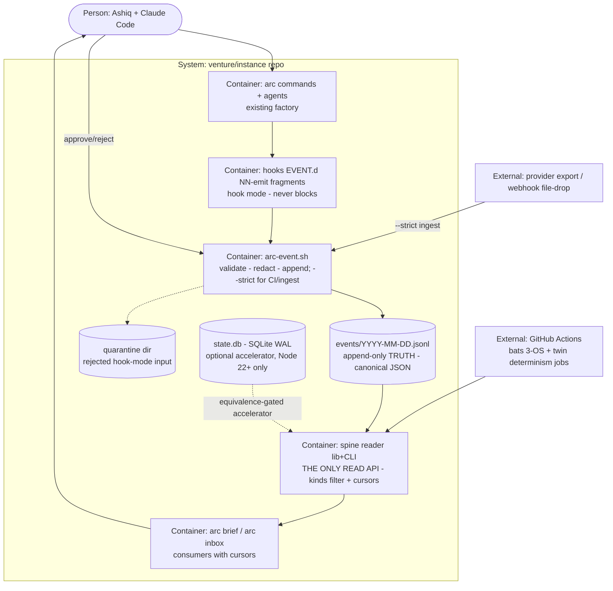

# PLAN.md (DRAFT v2) — arc Receipt Spine (Cycle 2 · steel thread)

> v2, 2026-07-18 — after round-2 external review (all 10 tightening points adopted; the
> "spine as OS API" idea adopted AS A CONTRACT, not as a runtime bus — see ADR-0027 and
> the verdicts section at the end). NOT committed anywhere; feeds `/arc-kickoff` after
> Cycle-1 Phases 03–05 close.

## Goal

One sentence: for Ashiq, arc gains a **receipt spine** — every factory action and every
rupee becomes one append-only event stream, consumed by everything else **only through one
read contract**, rendered as a one-screen daily brief and an approval inbox, and proven on
one real venture for five real days — so the company's day is replayable from receipts and
every future module (engine, evolve, dashboard, policy) plugs into a stable API instead of
each other's internals.

## Current state

- **Stack:** bash-3.2/POSIX + zero-dep Node (repo floor Node ≥18 — see ADR-0021 for the sqlite stance) · 21 arc-* commands · 23 agents · EVENT.d hook fragment dispatcher · registry-aware sync
- **Runs via:** bats tests/ (3-OS CI); Windows foreground serial-only
- **Relevant existing machinery:** `_dispatch.sh` fragment dirs (modules drop hook fragments without editing hooks) · `arc-registry.json` · evidence bundles · trial-ledger WARN-first culture · arc-bytediff LF-normalization learnings
- **What does NOT exist:** any event stream, reader, brief, inbox, revenue capture, or state store
- **Hot zones:** hooks payload capture (`arc_hook_field` jq→python→RAW fail-safe — emitter must not disturb the destructive-guard chain) · SessionStart/End timing (emitter never blocks) · Windows CRLF/locale (canonical serialization, §ADR-0021)
- **Do-not-touch:** Cycle-1 golden-output gate (spine files never enter the sync payload) · `.claude/state/` per-project, unsynced

## Success requirements

| REQ | User outcome | Measurable acceptance | Phase | Status |
|---|---|---|---|---|
| REQ-01 | Every factory action leaves a receipt | Scripted dry-run session (kickoff → phase-done → review → qa → commit → ship) produces the expected event sequence; every event passes strict validation; sequence matches a golden fixture — bats green | 1 | draft |
| REQ-02 | The spine cannot be silently poisoned — in either mode | **Strict mode** (`--strict`: CI/ingest/tests): every pinned hostile fixture (missing field, bad ULID, bad ts, dup idem, oversized payload, secret pattern, CRLF/BOM, non-UTF8) exits 2. **Hook mode** (session emit): the SAME inputs never block — quarantined to `events/_quarantine/` + loud SKIP + exit 0. Both behaviors asserted per fixture | 0 | draft |
| REQ-03 | Money reaches the spine exactly once | `arc-event ingest revenue.received --json FILE` records a real provider payload; the same payload delivered twice — **including across different days** — yields ONE event (idem index consulted, fixture-proven); amount/currency/venture validated | 2 | draft |
| REQ-04 | State is derived, never truth — twice over | (a) `rm state.db && arc-replay && arc brief --date D` byte-identical to golden; (b) on a **no-sqlite runner** (Node 18 leg) the same brief is byte-identical via the canonical JSONL-scan path — both bats cases in 3-OS CI | 0 | draft |
| REQ-05 | The day is readable in ONE screen | `arc brief` renders from the **spine reader only**: ≤ 40 lines, grouped needs-you / money / progress / background; overflow collapses to counts (+ `--full` escape); golden-fixtured; <5s on the owner's Windows box | 2 | draft |
| REQ-06 | Approvals are receipts too | `arc inbox` lists `approval.requested` via the reader; `arc approve/reject ID --reason` writes `decision.recorded`; full request→decision flow replays identically; no approval state outside the spine | 3 | draft |
| REQ-07 | Proven on a real venture with honest money | ≥5 consecutive real working days on the named venture: real builds emit real events; brief read daily. **`revenue.received` = real money only**; if the venture isn't selling yet, mechanism-proof uses `revenue.simulated` (clearly separate kind) and REQ-07 closes as "mechanism proven, live value pending" — never fake P&L truth. Evidence bundle = the days' JSONL + briefs | 4 | draft |
| REQ-08 (stretch) | Runs know their cost honestly | `run.completed` may carry `cost: null` or `{tokens_in, tokens_out, inr_estimate, source: measured\|estimated\|manual}` — no fake precision; brief shows daily spend when present | 2 | draft |
| REQ-09 | The spine is the ONLY api | `brief`/`inbox` code contains zero direct `events/*.jsonl` or `state.db` references — all access via `spine reader` lib/CLI (grep-lint, WARN-first per trial culture); each consumer maintains its own **cursor** (last ULID processed) and demonstrates catch-up-from-cursor in a bats case | 3 | draft |

## Appetite

**2.5 weeks part-time, hard cap.** Constraint, not estimate. **Tier:** M

**Kill criteria:** at 50% burnt (~6 days), if REQ-02 + REQ-04 aren't green → cut to
spine+replay only (bank; brief/inbox next cycle). Any phase at 2× appetite → stop, bank,
`/arc-retro`. **Designated first cut: REQ-08**, second cut: REQ-09's cursor demo (the
lint stays). At 100% → cut or kill, never extend.

## Architecture (C4 concepts, Mermaid flowchart)



## Key decisions (ADR index — proposed this initiative)

| # | Decision | Status |
|---|---|---|
| 0021 | Append-only JSONL is truth in **canonical serialization** (UTF-8, LF, keys sorted, no insignificant whitespace); `sha` = SHA-256 over the canonical event **excluding the sha field**. The **canonical read path is a JSONL scan** (works on Node ≥18 everywhere); SQLite (node:sqlite, Node 22+) is an optional accelerator that must pass an equivalence gate vs the scan — never a requirement | proposed |
| 0022 | Spine lives in the INSTANCE at `.claude/state/hq/` — never in the mold, never synced, never in the golden payload | proposed |
| 0023 | Closed event-kind vocabulary v1 (Appendix A, 18 kinds incl. `revenue.simulated`, `day.closed`); extensions only via ADR | proposed |
| 0024 | Brief + inbox are CLI-first this cycle; the HTML dashboard is a later cycle's consumer of the same reader API | proposed |
| 0025 | Secret redaction at emit, fail-safe: on any scanner failure the payload is dropped and a **stub-only** `redaction.applied` event is written — the stub carries actor/kind/run_id refs + pattern-id ONLY; never field names, values, or lengths | proposed |
| 0026 | Immutability windows: the **active day's file is append-only while open; a closed day's file is immutable forever** (rollover emits `day.closed` carrying the closed file's sha). Corrections only via `supersedes` events in the current day | proposed |
| 0027 | **The spine is arc's only public API.** All consumers (brief, inbox, and every future module) read through one reader lib/CLI with kind filters and **per-consumer cursors** (last-ULID). Consumers declare `consumes: [kinds]` in their manifest; direct file/db access is a lint violation. Explicitly NO pub/sub daemon, bus, or watcher this cycle — cursors + polling now; a future scheduler turns the same contract event-driven with zero consumer changes | proposed |
| 0028 | Emitter dual-mode: **hook mode** never blocks (quarantine + SKIP + exit 0); **strict mode** (CI/ingest/tests) exits 2 on invalid input. One validator core, two entry behaviors | proposed |

## Non-negotiables

- Append-only forever: no code path edits or deletes a closed JSONL line; corrections supersede (ADR-0026).
- Emitter/validator/replayer/reader are parser-class code → **mandatory adversarial construct-a-breaking-input pass, holes fixed + pinned as red fixtures, BEFORE FAIL-mode promotion** (43-hole history).
- The twin determinism cases (REQ-04 a+b) enter CI at Phase 0 checkpoint B and never leave.
- No secrets on the spine — redaction fail-safe, stub-only, never fail-open (ADR-0025).
- Hook-mode emitter can never block or fail a session; the destructive-guard chain untouched (ADR-0028).
- **No module reads `events/*.jsonl` or `state.db` directly except the spine reader** — grep-lint, WARN-first, promotion via trial-ledger (ADR-0027).
- Canonical serialization is defined once (ADR-0021) and shared by emitter, hasher, and reader — no second serializer anywhere.
- Cycle-1 invariants inherited whole: zero-dep Node · bash-3.2/POSIX · no GNU-only constructs · every script ships bats · CI red = no merge · golden bare-sync byte-identical.
- New lint/gates start WARN in TRIAL; FAIL promotion only via trial-ledger evidence.
- Every `/arc-phase-done` commits an evidence bundle.

## No-gos (explicitly out of scope)

- **No pub/sub daemon, bus, file-watcher, or push delivery — cursors + polling only** (ADR-0027 upgrade path documented instead).
- No dashboard UI (CLI brief only) · no scheduler/cron autonomy — every run human-started.
- No policy ENGINE (inbox handles only explicitly-routed requests; L0–L3 capability vectors = later cycle).
- No engine module (drivers/router/bench); Claude Code is the implicit driver.
- No `processes/` canonicalization or adapters.
- No discover/growth/leads/ops; no ledger MODULE (revenue events only).
- No Postgres, no server, no HTTP listener (file-drop/manual only), no MCP endpoint.
- No hash chaining beyond per-event sha + per-file sha at day close (ADR-0026).
- No native-dependency sqlite (better-sqlite3 etc.) — node:sqlite or JSONL-scan, nothing else.

## Rabbit holes

- **Event taxonomy bikeshedding** → 18-kind closed vocabulary; new kind = ADR or it doesn't exist.
- **Reader feature creep** (query language, joins, aggregations) → reader v1 = kind filter + since-cursor + venture filter, full stop; sqlite3 CLI exists for ad-hoc questions.
- **Bus temptation** → the moment someone says "watcher", re-read ADR-0027's no-go.
- **Dashboard temptation** → the mock is a design target; this cycle ships text.
- **Perfect cost accounting** → nullable cost with `source` honesty; refinement later.
- **Windows Unicode/casefold chase** → canonical serialization + pinned CRLF/BOM fixtures only.

## Assumptions ledger

| Assumption | How we'd know it's wrong (trigger) | Phase that tests it |
|---|---|---|
| Hook fragments capture enough factory actions | dry-run golden sequence shows a gap → add command-level emission for that command | 1 |
| JSONL-scan brief is fast enough without sqlite (<5s at realistic volume) | measured ≥5s on the owner's box with a 90-day synthetic spine → promote the sqlite accelerator from optional to recommended (still equivalence-gated) | 0-B |
| Emitter overhead negligible in real sessions | added wall time >1s per session event → async append via background job | 1 |
| One venture is active for the 5-day dogfood | none mid-build at Phase 4 → dogfood arc's own development (mold factory actions are events too) | 4 |
| File-drop/manual ingest sufficient for revenue this cycle | provider is webhook-push-only → manual entry from provider dashboard export until a later cycle | 2 |

## External dependencies

| Dep | Interface | Fake impl | Real impl | Contract test |
|---|---|---|---|---|
| (none new — code level) | — | — | — | — |
| Venture repo access (REQ-07) | external git repo, owner-granted | none — real-only | Cycle-1 Phase-04 target confirmed | manual: access verified before Phase 4 entry |
| Revenue source (REQ-03) | JSON payload (export/webhook) | pinned fixtures incl. same-day AND cross-day duplicate pairs | provider export or manual CLI | idem fixtures: dup within day → 1 event; dup across days → 1 event |

## Pre-mortem (Klein)

*It's 6 months later. The spine shipped and failed.* Top causes:

| # | Failure cause | Mitigation or accepted |
|---|---|---|
| 1 | **Parser holes in emitter/validator/reader** (the 43-hole class) | Adversarial pass + pinned red fixtures at Phase 0-A, before anything consumes the spine |
| 2 | **Silent wiring gaps** — actions missing, "replayable day" is a lie | Dry-run golden sequence (REQ-01) + weekly gap audit (session-log vs spine) at Phase 4 exit |
| 3 | **Write-only noise** — nobody reads, system dies of irrelevance | One-screen brief with noise budget (REQ-05) + 5/5 daily reads (REQ-07) + kill criteria |
| 4 | **Windows breaks determinism** (CRLF/locale/paths) | Canonical serialization (ADR-0021) + pinned fixtures + twin determinism CI from Phase 0-B |
| 5 | **Session blocked by its own telemetry** | Dual-mode emitter (ADR-0028): hook mode quarantines + exits 0, proven by bats incl. guard-chain regressions |
| 6 | **Consumers couple to internals** — sqlite/file paths leak into brief/inbox/future modules, spine stops being the API | ADR-0027 reader-only rule + grep-lint (WARN→FAIL via trial-ledger) + REQ-09 cursor demo |

## Phases (risk-ordered)

Phase 0 retires parser-class risk in two internal checkpoints (per review: emit-side
proven before replay-side starts). Wiring, money, UX land only on a proven spine; live
dogfood last.

| Phase | Capability | Appetite | Spec |
|---|---|---|---|
| 0 | **Ckpt A:** `arc-event.sh` dual-mode (validate→redact→append · quarantine · stub-only redaction) + schema v1 + canonical serializer/hasher + hostile corpus + adversarial pass. **Ckpt B:** `arc-replay.mjs` + idem index (sqlite accelerator + JSONL fallback) + spine reader v1 (kind/since/venture + cursors) + twin determinism cases in CI | 5 days (A≈3, B≈2) | `phases/phase-00-spec.md` |
| 1 | Factory wiring: EVENT.d `NN-emit` fragments + command emissions (kickoff, phase-done, review, qa, commit, ship, council) + redaction live + dry-run golden sequence (REQ-01) + overhead measurement | 2.5 days | `phases/phase-01-spec.md` |
| 2 | Money + brief: strict-mode revenue ingest with cross-day idem dedupe (REQ-03) + `arc brief` via reader only, one-screen noise budget (REQ-05) + nullable cost (REQ-08 stretch) | 2.5 days | `phases/phase-02-spec.md` |
| 3 | Inbox v0 + API seal: approval/decision events + `arc inbox/approve/reject` via reader + cursor catch-up demo + reader-only grep-lint in TRIAL (REQ-06, REQ-09) | 1.5 days | `phases/phase-03-spec.md` |
| 4 | Live dogfood: ≥5 real days on the named venture, honest revenue rules (real vs simulated), daily brief reads, gap audit, evidence bundle, `/arc-retro` + TRIAL promotion review | 3 days effort / 5+ elapsed | `phases/phase-04-spec.md` |

**North-star metric:** during the dogfood window — 100% of factory actions + revenue with
receipts · briefs read 5/5 days **and ≤ one screen each day** (noise budget held) · twin
replay determinism green in CI at every phase close from 0-B.

---

## Appendix A — event-kind vocabulary v1 (closed set, ADR-0023 — 18 kinds)

`idea.captured` · `council.verdict` · `approval.requested` · `decision.recorded` ·
`kickoff.done` · `phase.closed` · `review.completed` · `qa.completed` · `commit.done` ·
`ship.done` · `revenue.received` *(real money ONLY)* · `revenue.simulated` *(never enters
P&L views)* · `cost.incurred` · `run.completed` · `incident.raised` ·
`redaction.applied` · `day.closed` · `note.logged`

## Appendix B — event schema v1 (normative copy)

```json
{ "id": "ULID", "v": 1, "ts": "RFC3339+05:30", "idem": "sha256(source:natural-key)",
  "actor": "arc-phase-done | human:ashiq | ingest:revenue", "process": "phase-done@x.y.z",
  "model": "driver:model-id | null", "venture": "slug | arc", "run_id": "r-…",
  "kind": "one of Appendix A", "payload": { "no secrets — redacted at emit" },
  "outcome": "ok | fail | partial",
  "cost": null,
  "cost_alt_example": { "tokens_in": 0, "tokens_out": 0, "inr_estimate": 0, "source": "measured|estimated|manual" },
  "evidence": "path | null", "supersedes": "id | null",
  "sha": "SHA-256 over canonical form (UTF-8, LF, sorted keys, no insignificant whitespace), sha field excluded" }
```
*(Consumer cursors are consumer-side state, not event fields.)*

## Appendix C — round-2 review verdicts (for the record)

| Item | Verdict |
|---|---|
| Spine as OS API / capabilities subscribe to events | **ACCEPT the contract, REJECT the bus.** Adopted as ADR-0027: one reader API + per-consumer cursors + `consumes:` declarations + reader-only lint. A runtime pub/sub bus/watcher would violate the no-daemon ADR and rebuild the round-1 overbuild — polling cursors give the same contract today and become event-driven later with zero consumer changes (this is how Kafka consumers actually work anyway: offsets) |
| 1 Phase-0 split | ACCEPT — two checkpoints (A emit-side, B replay/reader-side), appetite 4→5d |
| 2 Dual-mode emitter | ACCEPT — real ambiguity in v1 between REQ-02 and "never block"; resolved via ADR-0028 + quarantine dir |
| 3 Cross-day idempotency | ACCEPT — real bug in v1 (daily-file scan insufficient); idem index derived from full spine, rebuilt by replay, fallback file for no-sqlite |
| 4 Hash canonicalization | ACCEPT — ADR-0021 defines canonical form; sha excluded from its own hash; CRLF fixtures pinned |
| 5 Redaction stub-only lock | ACCEPT — no field names, values, or lengths in the stub (ADR-0025) |
| 6 Node 18 vs 22 | ACCEPT, decided: JSONL-scan is the canonical path on Node ≥18; node:sqlite = optional accelerator behind an equivalence gate; native-dep sqlite is a no-go |
| 7 Nullable cost | ACCEPT — `null | {tokens_in, tokens_out, inr_estimate, source}` |
| 8 Closed-file definition | ACCEPT — active day append-only, closed day immutable, `day.closed` carries file sha (ADR-0026) |
| 9 Real vs simulated revenue | ACCEPT — `revenue.received` real-only; `revenue.simulated` separate kind, excluded from P&L views; REQ-07 closes honestly either way |
| 10 Brief noise ratio | ACCEPT — ≤40 lines / one screen, 4 groups, overflow→counts, in REQ-05 acceptance AND the north-star |
