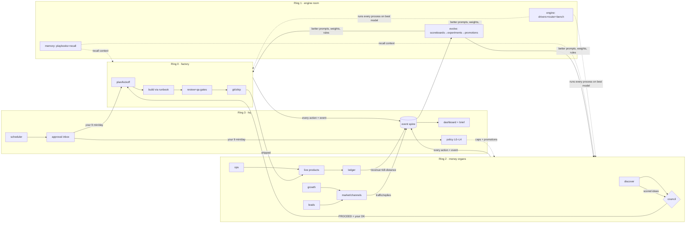

# arc — full ecosystem architecture (the definitive structure)

> v2 target picture, written 2026-07-18. Name: **arc** (HQ = just the command-room product
> inside arc, not a separate brand). Everything below is developed INSIDE the arc monorepo,
> products/ style, exactly like council and kickoff today. Concept — implementation only
> via /arc-kickoff after your explicit go, and only AFTER the current orchestrator cycle
> (Phases 03–05) closes; nothing here violates this cycle's no-gos.

---

## 1. The five design laws (every product obeys these)

1. **Process over model.** The IP is the process — prompts, checklists, gates, schemas.
   Models are swappable engines. No process may hard-assume a vendor.
2. **If it isn't an event, it didn't happen.** Every action by every product appends to the
   spine. Dashboard, learning, P&L are views over the log — never separate truths.
3. **Trust is earned, never assumed.** Every automated capability starts WARN/L1 and climbs
   the autonomy ladder only with trial-ledger evidence. Auto-demote on incident.
4. **Everything measured, everything improvable.** Every product declares its own metrics,
   experiments, and evals in its manifest. Self-improvement is a contract, not a hope.
5. **Boring tech, receipts everywhere.** Zero-dep Node + POSIX bash + files + SQLite.
   Deterministic gates around probabilistic models. Evidence over assertion — company-wide.

---

## 2. The product catalog — 16 products, 4 rings

**Ring 0 · Foundation (6 — exist today)**

| # | Product | Job | Self-improvement metric it must emit |
|---|---|---|---|
| 1 | core | hooks, dispatch, sync, registry, settings | hook failure rate, sync drift incidents |
| 2 | plan | kickoff, phases, change, resume | appetite accuracy, phase reopen rate |
| 3 | review | code review + arc-scan security | escaped-bug rate (bugs found AFTER ship) |
| 4 | qa | browser QA, design review | missed-regression rate |
| 5 | council | multi-agent judgment + calibration | verdict hit-rate per juror |
| 6 | git | commit, PR, ship discipline | revert rate, CI-red-merge attempts |

**Ring 1 · Engine room (3 — new; makes everything model-agnostic + self-improving)**

| # | Product | Job |
|---|---|---|
| 7 | **engine** | model drivers (claude/codex/gemini/z.ai/local), router + escalation, per-task budgets, **bench** (eval harness that scores every model on every process class) |
| 8 | **memory** | company knowledge: playbooks/*.md (git-versioned), decisions, SQLite FTS5 search, recall API for any process; embeddings only when FTS proves insufficient |
| 9 | **evolve** | the generalized retro: reads the spine → scoreboards per product → proposes experiments → promotes winners into canonical specs (diff + your OK) → pins failures as eval fixtures |

**Ring 2 · Money organs (5 — new)**

| # | Product | Job | Key commands |
|---|---|---|---|
| 10 | **discover** | pain mining (Reddit/HN/reviews/app stores) → cluster → score → council hand-off | /arc-hunt |
| 11 | **growth** | SEO/content engine, video pipeline, social publishing, A/B on titles/hooks | /arc-content, /arc-video |
| 12 | **leads** | ICP builder, enrichment, capped outreach sequences, reply triage | /arc-leads |
| 13 | **ops** | canary sweeps, support inbox triage, incident loop, weekly health reports | /arc-triage |
| 14 | **ledger** | payment webhooks → per-product P&L, AI-cost attribution, kill-distance | /arc-pnl |

**Ring 3 · Command (1 — new)**

| # | Product | Job |
|---|---|---|
| 15 | **hq** | the spine (event schema + ingest), scheduler (headless runs w/ budgets), policy engine (L0–L4 + promotions), approval inbox, morning/evening brief, dashboard (local web, read-only v1) |

**Sandbox (1 — permanently special)**

| # | Product | Job |
|---|---|---|
| 16 | **trader** | paper-trading research sandbox. L0/L1 forever by default; real money unlockable only by a hand-written policy change by you. Never load-bearing income. |

Mold vs instance (existing arc culture, unchanged): products are DEVELOPED in the arc
monorepo; an **HQ instance** is just a target folder where `sync-to-project --products
hq,engine,ledger…` installs them and state accumulates (state never lives in the mold —
same rule as `.claude/state/` today).

---

## 3. Repo structure (target tree)

```
arc/
├── products/
│   ├── core/ plan/ review/ qa/ council/ git/          # exist (manifests today)
│   ├── engine/                                        # NEW
│   │   ├── manifest.json
│   │   ├── drivers/        claude.sh codex.sh gemini.sh api-generic.mjs local.sh
│   │   ├── router.mjs      # task-class → model table + escalation ladder
│   │   ├── bench/          # eval harness + per-process fixture packs
│   │   └── tests/
│   ├── memory/             mem.mjs (SQLite FTS5) · playbooks/ · tests/
│   ├── evolve/             scoreboard.mjs · experiment.mjs · promote.mjs · tests/
│   ├── discover/           miners/ · score.mjs · commands/arc-hunt.md · tests/
│   ├── growth/             publishers/ · video-pipeline/ · commands/ · tests/
│   ├── leads/              enrich/ · sequence.mjs (hard caps) · commands/ · tests/
│   ├── ops/                canary-cron.sh · inbox-triage/ · commands/ · tests/
│   ├── ledger/             ingest/ (webhooks) · pnl.mjs · kill-distance.mjs · tests/
│   ├── hq/                 spine/ · scheduler/ · policy.mjs · brief.mjs · dashboard/ · tests/
│   └── trader/             sim/ · risk-caps.mjs · tests/          # sandbox rules
│
├── processes/                                         # NEW — the real IP layer
│   ├── kickoff.process.yaml    # intent · steps · tool needs (abstract) ·
│   ├── council.process.yaml    #   output JSON-schema · eval fixture refs ·
│   ├── hunt.process.yaml       #   version (semver) — MODEL-NEUTRAL, one truth
│   └── …one per command/agent
│
├── adapters/                                          # NEW — compile, don't rewrite
│   ├── claude-code/     # emits .claude/commands + agents (today's format)
│   ├── codex/           # emits .codex/ (dir already exists in repo)
│   ├── gemini/          # emits gemini-cli config
│   └── agentsmd/        # emits AGENTS.md surface (already at root)
│
├── .claude/            # becomes a COMPILED TARGET (see §4 migration — byte-diff gated)
├── phases/ docs/ tests/ PLAN.md PROGRESS.md …         # unchanged
```

---

## 4. Model-agnostic for real (the engine design)

Today's honest status: gates/scripts are ALREADY model-free ("engine scripts assume no
Claude" — ADR-0013), but commands/agents are written in Claude Code dialect. Fix in four
moves, each gated:

**4.1 Canonical process layer.** Every command/agent's substance moves to
`processes/*.process.yaml`: intent, inputs, steps, abstract tool needs (`fs.read`,
`shell.run`, `web.search`, `git.pr`), an **output JSON schema**, and eval fixtures.
This file is the single source of truth and is model-neutral by construction.

**4.2 Adapters compile, byte-diff proves.** `arc-compile` emits each runtime's dialect.
Migration trick (pure arc culture): compile the canonical file → **byte-diff against the
existing hand-written .claude/ file** → only when identical does the canonical become
source of truth. Zero regression risk, product by product — the same golden-gate method
Phase 03 uses for re-homing.

**4.3 Drivers + router.** Headless runs go through one interface:
`arc-run --process hunt --driver auto --budget inr=150,min=40`
Drivers: claude-code CLI, codex CLI, gemini CLI, generic API loop (OpenRouter/LiteLLM →
z.ai GLM, DeepSeek, Qwen, Llama, anything), local (ollama/vLLM). `--driver auto` asks the
**router**: a table mapping task-class → cheapest model whose bench pass-rate clears the
bar, with an escalation ladder (fail schema/gate → retry once → escalate one tier → flag).

**4.4 Bench — the killer feature.** Every process ships eval fixtures (input → expected-
contract checks), exactly like bats pins bash behavior today. When ANY new model appears:
`arc engine bench --model NEW` → scores it on every process class → router table updates →
**the whole company upgrades in a day, with receipts.** Everyone else hand-rewrites
prompts per model; arc treats models as benchmarked, swappable parts. Future models are an
automatic tailwind, not a migration project.

Contracts make weak models safe: a model that can't meet the schema fails loudly at the
gate and escalates — quality is enforced by deterministic checks, not by vendor trust.
(Reality note, not slop: model-agnostic ≠ model-equal. Some models will be bad at some
tasks — bench MEASURES that instead of hiding it, and the router routes around it.)

---

## 5. Self-improvement for EVERY product — the evolve contract

Not a vibe — a manifest section every product MUST declare (product-lint enforces):

```json
"evolve": {
  "metrics":     ["reply_rate", "meeting_rate"],          // events it emits
  "experiments": ["subject_line", "send_window"],          // what it may A/B
  "evals":       "products/leads/evals/",                  // pinned fixtures
  "promote_via": "trial-ledger"                            // no silent changes
}
```

The loop, identical for all 16 products:

1. **Measure** — product emits its metrics as spine events (law #2).
2. **Scoreboard** — evolve rolls up weekly per product (discover: % of ideas that later
   earned; growth: CTR/conversion; review: escaped bugs; council: hit-rate; engine:
   cost-per-passed-task; plan: appetite accuracy…).
3. **Experiment** — each product runs bounded A/Bs on its own prompts/templates
   (variant lives in TRIAL, tagged in every run event).
4. **Promote** — winner becomes a versioned change to the canonical process file,
   proposed as a diff → your approve → permanent. Loser archived with data.
5. **Pin** — every failure becomes an eval fixture (the "43 holes" culture, extended
   from code to prompts). Regressions can never sneak back.

Because every run event records `process@version + model + outcome`, evolve can
**attribute performance to versions and roll back bad "improvements"** — CI for prompts.
Council's calibration (already half-built in council-calibrate.mjs) becomes just the
first instance of this general mechanism.

---

## 6. Data layer — the honest SQLite answer

**Can SQLite carry something this big? Yes — comfortably.** It handles multi-TB databases
and ~100k writes/sec on one node; HQ will produce a few thousand events/day with ONE
writer. It runs inside every phone and browser on earth — it is not the toy; premature
distributed infra is the toy. Zero-dep culture fit: `node:sqlite` is built into Node 22+
(fallback better-sqlite3). WAL mode, one writer process (the spine ingestor), readers free.

Polyglot by role — four stores, each the boring right choice:

| Store | Tech | Why |
|---|---|---|
| **Events (truth)** | JSONL append-only, daily files | git-friendly, greppable, corruption-proof, replayable |
| **State (queries)** | SQLite (WAL) — ideas/products/runs/decisions/metrics | derived from events; rebuildable from JSONL at any time |
| **Knowledge** | markdown playbooks + SQLite **FTS5** search | human-readable, git-versioned; embeddings (sqlite-vec/Qdrant) only if FTS proves insufficient |
| **Product apps** | each SaaS keeps its OWN Postgres/Supabase | HQ ingests their webhooks/metrics only — HQ is the brain, never the app database |

Growth path (mechanical, not a rewrite): if HQ ever becomes multi-user/multi-device SaaS,
the same schema lifts to Postgres/Supabase; the JSONL spine replays into it. Trigger is
written down NOW so the decision is automatic later.

---

## 7. The full flow (all rings, one loop)



Daily: scheduler fires ring-2 runs (budgeted, driver-routed) → events flow to the spine →
brief + inbox for your ~9 minutes → approved kickoffs enter the ring-0 factory → ships
earn → ledger closes the money loop → evolve closes the learning loop → engine bench
closes the model loop. Three loops, one spine.

---

## 8. Migration path from today (respects the current cycle)

Current cycle (orchestrator monorepo, Phases 03–05) finishes FIRST — its no-gos stay
sacred. Then this becomes the next `/arc-kickoff`, phases risk-ordered roughly:

| Order | Move | Appetite | Risk it retires |
|---|---|---|---|
| 1 | spine: event schema + arc-event.sh + hook wiring + brief CLI | 1w | "if it isn't an event…" becomes real |
| 2 | hq v1: SQLite state + inbox + policy.yaml + scheduler (1 job) | 1.5w | the command room exists |
| 3 | engine v1: drivers (claude+codex+one API) + router table (static) | 1w | vendor lock broken with 3 real drivers |
| 4 | processes/: canonicalize 3 pilot commands + adapter + **byte-diff proof** | 1w | compile-don't-rewrite proven safely |
| 5 | discover v1 + council wiring | 1.5w | money loop gets its front-end |
| 6 | evolve v1: scoreboards + first experiment + promotion path | 1w | self-improvement contract live |
| 7 | growth → leads → ops → ledger (one at a time, each dogfooding a REAL product) | 1w each | organs added only when an organ is needed |
| 8 | bench v1 + remaining process canonicalization (rolling) | ongoing | new-model-in-a-day capability |

**Hard rule carried over:** the first revenue product ships in parallel from step 5's
output — the organs are built BY being used on a real product, never in a vacuum.

## 9. What stays human forever + anti-slop guards

Forever human: kickoff approvals, kill decisions, pricing, refunds, ad spend, outreach
caps, real-money trading unlock, publishing under your name. That's the CEO job — 1–2
focused hrs/day, receipts for everything else.

Guards: every new parser/adapter gets the adversarial breaking-input pass before FAIL
mode (non-negotiable #49 culture) · compile layer only replaces hand-written files after
byte-identical proof · evolve may propose, never self-merge · any product whose scoreboard
shows 2 dead weeks gets an attic review · north-star unchanged: **₹/month per hour of
your weekly involvement** — every one of the 16 products must argue its effect on it.
