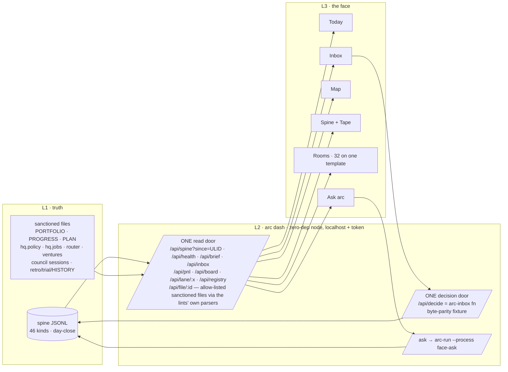

# PLAN (design source) — arc face v1: the working HQ

> **v1.0 (2026-08-18) — landed owner-instructed 2026-08-18, disk-only, git untouched.**
> Placement: `plans/` because this file feeds `/arc-kickoff --lane face` (kickoff-grade:
> REQ table, appetite, ADR-ready decisions FACE-A…P as letters, phases, pre-mortem, paste-ready
> KICKOFF PROMPT at the bottom — real ADR numbers come from the century claimed at kickoff per
> `PORTFOLIO.md`, never hardcoded). Grounded on a full sweep of the tree as of 2026-08-18:
> `PORTFOLIO.md` (15 lanes), all 15 `initiatives/*` trackers, all 21 `PLAN-*.md` + 2
> `BRIEF-*.md`, `CONSTITUTION.md`, `hq.policy.yaml`, `hq.jobs.yaml`, `engine/router.yaml`,
> `ventures.yaml`, the 46-kind `KINDS` array, the live spine day-files (1,121 receipts / 20
> closed days), 26 commands, 30 agents, 6 processes, 16 product manifests, the retro-log,
> HISTORY and the strategy pack; then attacked by a fresh adversarial reviewer (coverage ·
> facts · law · consistency) and corrected before landing. Every kind, command, lane, gate
> and concept named below exists in those files; nothing is invented.
>
> **Supersedes `BRIEF-dashboard.md`** (v1 "the HQ face", 2026-07-22) → moved to
> `docs/archive/` in the same drop (never deleted; marked in the strategy file map) and the
> 2026-08-04 owner-session verdict "dashboard = the ultimate product, 3 layers + room
> birth-rule". **Does NOT reuse** the July `arcface` prototype (owner ruling 2026-08-18:
> fresh design). `arc-hq-mockup.html` stays a concept list, not the visual target — the
> visual answer is decided by the design lane's blind exploration (FACE-I), never asserted.
>
> **Trigger converted under the owner's Build-out Mandate (2026-08-09 — same
> `decision.recorded` `01KZTM348858PDH44K4HA64CVA` as strategy-README correction #15,
> cited by the kickoff ADRs; A8's letter kept).** Honesty note: the brief's pull ("brief
> overflows one screen OR ≥3 earning ventures") has NOT organically fired — `arc-brief`
> auto-collapses at its 40-line budget so "overflows" never happens, and there are 0
> earning ventures; no receipt is invented. The face builds now; the original pull survives
> as the live-value milestone: **≥5 real days where every decision Ashiq makes goes through
> the face** (REQ-10, the C2 REQ-07 closure pattern — mechanism proven, live value pending).

## Goal

One sentence: **one surface that IS arc operating** — every product, lane, pipeline, gate,
receipt kind and concept (built and planned — 32 rooms on one template), rendered as live views over
the ONE spine and the sanctioned tracker files, with exactly ONE write path (the inbox
decision), a governed AI brain that answers from live state, a map you can read the company
from, a tape you can replay it on, and a birth-rule so every future module lands its own
room without a redesign.

Not: a marketing site, an informative explainer, a second truth, an operator console that
lets a machine (or a button) do what the Constitution keeps human.

---

## Current state (verified in-tree 2026-08-18 — re-verify at kickoff; what the face shows on day one)

- Spine (measured on the canonical clone 2026-08-18 ~18:20 IST with
  `cat .claude/state/hq/events/*.jsonl | grep -o '"kind":"[^"]*"' | sort | uniq -c` — the
  face's Spine room recomputes this on every read): **1,121 receipts**, **20 `day.closed`
  seals**; only **14 of 46 kinds have ever fired**; 82 % are `note.logged` (916); `approval.requested` 48 ·
  `decision.recorded` 39 · `phase.closed` 29 · `review.completed` 21 · `run.completed` 17 ·
  `lead.researched` 15 · `kickoff.done` 10 · `commit.done` 2 · `constitution.adopted` 1 ·
  `content.published` 1 · `develop.started` 1 · `slice.done` 1. **Zero**: revenue (real or
  simulated), `cost.incurred`, `incident.raised`, all `experiment.*`, all `policy.*`,
  `council.verdict`, `month.closed`. Cost is `null` on every live event. Actors seen:
  `arc-event`, `scheduler:day-close-roll`, `scheduler:brief-materialize`.
- Board: 15 lanes · **6 LIVE** (bench, engine, growth, leads, legal, scheduler) vs guideline
  2 · 9 IDLE · centuries 0001–1299 claimed, next 1300 · Mode B NOT CERTIFIED · 1 passport
  (lexos, paused).
- Clocks the tape will show: scheduler proving week → **2026-08-24**; growth feed earliest
  read → **2026-08-23**; hermes `review_by` → **2026-08-31**; bench guard → **2026-09-01**;
  council 002 Review-by → **2026-09-15**; T-01 review_by → **2026-11-09**; council 001
  Review-by → 2027-02-02; DPDP commencement → 2027-05-13/14; policy assumption re-check
  was 2026-08-17.
- Toolbelt: 26 commands (3 generated) · 30 agents (frontmatter today: 1 haiku / 24 sonnet /
  4 opus / 1 without a model line — ADR-0069's 08-02 census said 27 seats 1/22/4) · 6
  processes · 7 gates · 3 profiles · 16 manifests · 2 scheduled jobs · 244 files in
  `docs/adr/` (`ls docs/adr | wc -l`, 2026-08-18; memory indexed 150 ADRs on 08-12).
- Honest badges the face must carry from birth: policy engine *fixture-proven,
  unexercised* · evolve *unexercised; growth's INDEXABLE clock started 08-16, evolve's own
  4-complete-weeks clock not started* · ledger *mechanism proven,
  live value pending* · leads *rehearsal only, live send = owner keystroke pending* ·
  engine *3 dispatches, 0 accepted drafts* · bench *production receipts 0*.

---

## The thinking — why this design and not "a dashboard"

Read the whole tree once and five things jump out. They are not features — they are the
design's *physics*. Everything below follows from them.

1. **arc's truth is one append-only log with a closed vocabulary (E1, ADR-0026).** Every
   panel arc already has (`arc brief`, `arc-inbox`, `arc pnl`, `arc evolve board`, jobs
   panel) is a *pure function of the log* — replay wipes state and re-renders
   byte-identical. So the face's whole UI can be a function of (log, sanctioned files,
   as-of time). Design consequence: **time is a first-class axis** — you can scrub the
   company to any past day and every room re-renders honestly. That is not a gimmick;
   it is arc's replay determinism made visible.
2. **Every number already has a receipt.** "A claim without a receipt is an opinion."
   Design consequence: **one universal affordance — *Why?*** Every value on screen opens
   its precedents (the receipts + the derivation). The face never shows a number it cannot
   trace. Spreadsheet-precedents for a company.
3. **Human sovereignty is structural, not a setting (E2).** There is exactly one write
   outside the factory: `arc-inbox approve|reject <ULID> --reason`. Everything else a UI
   might tempt you with (publish, merge, promote, kill, move money, switch model, register
   a job) is either a *command the human runs himself* or *forever-human*. Design
   consequence: **three affordance classes and no fourth**:
   - **Stamp** — the one write (approve / reject + mandatory reason). Rendered as a stamp.
   - **Command chip** — "run this yourself": the exact CLI, copyable, never executed by
     the face (`arc pnl --close 2026-09`, `/arc-kickoff --lane ops`, `git merge …`).
   - **Seal** — forever-human / no-button-by-law, shown as a sealed lock quoting the
     article or ADR (E2 five, ADR-0069 b1 no auto-switch, ADR-0305 no machine merge…).
   A UI that is honest about what it *cannot* do is the design.
4. **Every module has the same skeleton.** Purpose → pipeline (arrow chain) → gates →
   receipts → human decision points → vocabulary → numbers. Fifteen lanes, four
   planned ones and every future one all fit it. Design consequence: **one Room template
   + a room birth-rule** (`face:` section in `products/<x>/manifest.json`) → a new module
   gets a working room on day one, bespoke panels layer on top. Coverage becomes a lint,
   not a hope.
5. **arc already speaks in maps and organs** — spine, heartbeat, brain, hired hands,
   guardian, refinery, money brain, lines, stations, gates. Design consequence: the
   overview is not KPI tiles; it is **a transit map of the pipelines**, where every human
   gate is a station and the inbox is the central interchange, with live receipts moving
   along the lines. "Council la ipo enna nadakuthu?" is answered by looking.

The rest of this plan is those five consequences, made complete.

---

## The concept — three signatures, one template, one brain

Working name in the UI: just **arc**. (`arc face` = the lane / repo name.)

### MAP — "arc metro"

Every pipeline in the company is a **line**; every step is a **station**; every human gate is
a **stamp station** (square, not round); every integration is a **shared station**; the
**Inbox is the central interchange**; the **Spine is the ring line** every other line joins.
Receipts are **trains**: a receipt landing lights the station it corresponds to and moves
the item's dot to the next one. Zoom out: the whole company at a glance, coloured by ring
(Kernel · Factory · Money organs · Company). Zoom in: one line with its stations named
exactly as the commands/scripts that perform them.

Lines (v1 set — each is a real pipeline from the tree; station names verbatim):

- **Golden Loop (circle line)** `kickoff → approve(plan) → develop start → slice… → handoff
  → phase-done → approve(phase) → retro → next phase` — the ring every lane rides.
- **Council line** `intake (PREDICTION) → research fan-out → convene (advocate/skeptic/
  neutral + experts) → POINT-IDs → verifier ratings → rebuttal (one round) → cross-model
  juror → deliberate → VERDICT (YES/NO/CONDITIONAL/WAIT) → save session → council.verdict →
  Review-by → OUTCOME (HIT/MISS/UNRESOLVED) → calibration/Brier`.
- **Engine line** `process.yaml → process-lint → arc-compile → arc-run → policy authorizeRun
  → data boundary → router → driver → schema check → retry-once → escalation proposal →
  run.completed → cert-label`. Branch: **Hire line** `scorecard → cert suite (12) → capped
  key → router row (cap/hosted/judge/review_by) → context pack approval → dispatch → draft
  accept/reject → human copies out (publish = SEAL) → tenure review_by → retire`.
- **Growth line** `sources → mine → cluster → GATE 1 (stamp) → generate → render → slop/
  citation lint → POV line → publish PR → GATE 2 (stamp) → OWNER MERGE (seal) →
  content.published → GSC weekly export → ingest → metric.observed → 4 complete weeks →
  evolve trigger`.
- **Leads line** `ICP → research (PASS/HELD/BELOW-BAR) → dossier (private store) →
  lead.researched → draft → personalization lint → approval (stamp) → daily (owner
  keystroke) → guard chain (suppression · reply-stop · touch cap · daily cap · send-window ·
  sha match · preflight SPF/DKIM/DMARC) → journal intent → provider → outreach.sent → reply
  ingest → triage → auto-stop / lead.suppressed → meeting.booked → deal.won/lost`.
- **Ledger line** `provider export → parse (Razorpay / MoR) → normalize → arc-event ingest
  revenue.received → arc pnl (revenue · MRR · costs ×3 · kill-distance) → criteria receipt →
  reconcile per rail → arc pnl --close → month.closed`.
- **Legal line** `facts.yaml → template set (pinned) → render → value/trace/completeness/
  consistency lints → text attack panel → legal.publish approval (stamp, full read) →
  commit pages + pins.yaml → note.logged → --verify → launch checklist → lawyer tripwire`.
- **Evolve line** `contract (manifest evolve:) → metric.observed feed → board (PENDING/
  MISSING) → experiment.opened → assign → measured → verdict (newcombe-wilson) →
  promotion.proposed (stamp) → HUMAN MERGE (seal) → experiment.promoted → watch window →
  incident/freeze → revert proposal → rolled_back → closed`.
- **Bench line** `fixtures pack → arc-bench --driver/--model → K=3 → scorer → replay check →
  gates-first eligibility → --propose (router diff) → router-merge approval (stamp) →
  human git merge (seal) · --champion drift guard → drift approval`.
- **Absorb line** `pin source → license → study.mjs --read (confined) → technique inventory
  T-NN → ABSORB/INTEGRATE/ROUTE/SKIP → report-lint → registry candidate → rebuild (allowlist)
  → rebuild-lint → PLANOFF A/B → sealed-blind judgement (stamp, pick+reason) → adoption
  proposal (stamp) → adopted/retired → review_by`.
- **Design line** `brief (4 contracts) → design-lint → explore (director: 3 theses ×
  ui-composer) → render (deterministic) → critique (VIOLATION/BELOW-BAR/WEAKNESS/POLISH) →
  jury blind rank vs reference → OWNER PICK (stamp: decision + prediction) → canonical tokens
  → build → outcome evidence → library`.
- **Develop line** `start (Build Brief + predictions) → slice ledger → next (context pack) →
  micro-plan → proof:/tier: → implement → proof output → commit → slice.done · stuck
  (fingerprint 3× / attempts 5 → slice.stuck) → checkpoint → handoff (predictions scored,
  spec-fidelity) → handoff.ready`.
- **Policy line** `hq.policy.yaml ceiling → policy-lint → reducer (level.changed/demoted) →
  authorizeAction/Run (deny/propose/execute) → incident.raised → policy.demoted (auto) ·
  promotion request (stamp) → policy.level.changed · spend.reserved → cost.incurred /
  spend.released`.
- **Scheduler line** `hq.jobs.yaml → jobs-lint --bill → register (OS task) → slot fires →
  wrapper (lock · git-state guard · policy) → script → run.completed{job} → panel → overdue
  → needs-you · catchup · fire-drill`.
- **Memory line** `5 adapters → memory-index --rebuild → arc-recall (kickoff 4b / review 0)
  → HISTORICAL DATA fence → conflict-check (retro 3b) → golden-check --gate`.
- **Ops line (planned)** `registry → sweep → incident.raised → ack → resolve · support
  file-drop → classify → template draft → approval (stamp) → human sends (seal) · weekly
  report · drill`.
- **Trader line (planned)** `question.opened → PLAYGROUND (EXPLORATORY) → register →
  snapshot.pinned → backtest → honesty battery → verdict (LOSES / INDISTINGUISHABLE /
  SURVIVES-SO-FAR) → paper-live (single human gate) → 30 days → CONTINUE/DORMANT · THE
  LOCK (display only)`.
- **Discover line (planned)** `hunt → miner → normalize → dedupe/cluster → score.yaml →
  top-2 → council → approval (stamp) → one-pager → separate venture kickoff`.
- **Portfolio / lane line** `lane-resolve → birth (kickoff only) → century → machine header
  → board row (same commit) → board-lint · ownership-lint → IDLE at close`.
- **Ship line** `/arc-review (diff-recall → code-reviewer → review.completed → stamp code) →
  /arc-audit (security-auditor → stamp security) → /arc-qa (qa-tester → qa.completed → stamp
  qa) → /arc-design-critique (stamp design) → /arc-docs (docs-drift → stamp docs) →
  /arc-second-opinion (codex; CRITICAL disagreement blocks) → /arc-commit (commit.done) →
  /arc-pr (push gated on approval) → /arc-ship (lint → build → test → deploy-guard →
  ship.done) → /arc-canary (vitals · diff · rollback/block)`; side stations `/arc-fix-issue`,
  `/arc-freeze`/`/arc-unfreeze`.
- **Retro line** `friction scan → permanent home (CLAUDE.md · rule · command · settings ·
  hook · VAGUE regex) → retro-log line → conflict-check (3b) → scoreboard row → HISTORY
  at-a-glance → trial-ledger promotion (≥3 clean runs, owner OK)`.
- **Strategy line** `BRIEF (sleeping) → trigger fires / mandate converts → PLAN (owner
  approves) → /arc-kickoff --lane → phases → /arc-phase-done → /arc-retro → next cycle`.
- **Venture line (Cycle-3 First Money, runs in the venture repo)** `venture decision → V-A
  rail (Razorpay INR / MoR USD) → V-B one tier one price → V-C gate → V-D positioning →
  test-mode e2e → live smoke buy + refund → 10–12 SEO pages → 5 launch channels → funnel →
  first revenue.received OR written pivot`.
- **Law line** `ADR proposal → 7-day cooling → sign-off → constitution.adopted (supersedes)`.
  Model policy is a law, not a line: it appears as the "tier change = reviewed diff citing
  ADR-0069" seal on every Engine/Council station that could tempt a switch.

Shared stations are the integrations he asked about, drawn once and joined by several
lines: `approval.requested` (every line → the Inbox interchange), `run.completed` (engine ·
scheduler · bench · brain), `metric.observed` (growth · leads · evolve · ops), `incident.raised`
(policy · evolve · scheduler · ops · leads FREEZE), `council.verdict/outcome` (council ·
evolve calibration · discover), `review.completed` (review · design), `note.logged`
(everything), `decision.recorded` (the Stamp).

Rendering rules: lines are 2px strokes in the ring's colour family; a station with a
receipt in the last 24 h glows once (200 ms) then stays lit; a station with an OPEN human
gate shows the count in an amber square; a **line with no receipt ever** (evolve, policy,
trader…) is drawn dashed with the honest label *fixture-proven, unexercised* — the map
never pretends. Legend: circle = machine step · square = stamp (human decides) · lock =
seal (forever-human) · dashed = built, unexercised · dotted = planned.

### TAPE — the day-close ruler

A single time ruler is always present (bottom edge). Ticks = days; a **seal mark** at every
`day.closed` (with `file_sha`), a heavy seal at `month.closed`; flags for dated obligations
read from the tree: council `Review-by:` (session 002 → 2026-09-15; 001 → 2027-02-02),
router `review_by` (hermes row → 2026-08-31), registry `review_by` (T-01 → 2026-11-09),
proving weeks (scheduler → 2026-08-24), feed clocks (growth earliest read 2026-08-23),
guard checks (bench → 2026-09-01), lawyer/DPDP tripwires (13/14-May-2027), venture clocks,
kill tripwires (50 % of appetite per live lane). The playhead is *now*. **Drag it back and
the whole face becomes as-of that day** — brief, inbox (what was open then), rooms, map,
money — because every view is derived from the log. Press play: the day replays at 10× and
receipts land in order (the demo, and the honest way to see "what happened yesterday").
Read-only by construction; nothing about the tape can write.

### STAMP — the one write

The inbox item is a card ending in two physical stamps, **APPROVE** and **REJECT**; both
demand a typed reason (mandatory, ≤2000 bytes as `arc-inbox` enforces); the stamp animation
is the one piece of expressive motion in the product; the resulting `decision.recorded`
ULID prints on the card and the card slides into the receipts feed. There is no bulk stamp,
no default reason, no undo (decisions are final; supersede on a new day is a CLI act, shown
as a command chip). Every approval **profile** in the tree renders with its own detail body:
`gate: kickoff` (plan summary), `gate: phase-done` (evidence bundle verify), `engine-escalation`,
`context-pack` (N dispatches remaining), `router-merge` / `drift` (evidence table), `subject:
policy.promotion` (from/to level, trial-ledger ref), `subject: absorb.ab-judgement` (blind
labels — pick+reason), `subject: ledger.criteria` (digest vs disk), `subject: legal.publish`
(hash-chain, full-read gate), growth gate 1/2 (cluster / review pack + preview URL), leads
drafts (`draft_ref`, lint status — body via local `arc-leads review`, never from the spine),
plus the rarer profiles: evolve **juror-weight change** (diff + inbox), engine **rejustify-or-
retire** on an expired `review_by`, policy **stuck reservation**, template-edit approvals
(legal), warm-up `ATTESTED` approvals (leads). Byte-parity with the CLI is a fixture, not a
promise.

**Stamps exist ONLY for `approval.requested`** — `arc-inbox` refuses every other ULID
(`WRONG_KIND`). The other needs-you kinds render as **needs-you cards without a stamp**, each
carrying the chip that resolves it and the seal that forbids the shortcut: `promotion.proposed`
(chip: the exact `git merge` of the proposal — the human merge IS the decision, ADR-0305; seal:
no machine merge) · `handoff.ready` (chip `/arc-phase-done <n>`) · `slice.stuck` (chip: the
one-screen diagnosis; escalation to owner) · `meeting.booked` (info) · `incident.raised`
(chips: ack/resolve once ops kinds exist; today info + link) · `policy.demoted` (info + chip
to request promotion with trial-ledger evidence) · overdue jobs (chip `arc-jobs catchup`).

Beside every stamp station on the map and every room header sit the **seals**: the five E2
ungrantables verbatim, plus the per-room "NEVER a button" list from the tree (merge,
publish, promote, kill, close month, edit criteria, register job, raise ceiling, switch
model, send mail, unlock trading, execute studied code…). Hover a seal → the article/ADR.

### The ROOM template (how 32 rooms stay one product)

Every room has six zones in a fixed order; bespoke panels are added *inside* zones, never
as a new layout:

1. **Header** — lane machine header verbatim (`status · cycle · phase · appetite/burn` with
   the 50 % tripwire mark, `blocked-on / depends-on`), century band, last receipt age.
2. **Line** — this room's stations (from the map) with live counts per station and the
   open stamps highlighted; click a station → the command/script that performs it (chip).
3. **Decide** — this room's open inbox items (same cards as the Inbox; the stamp lives here
   too — one write path, many doors).
4. **Numbers** — the room's dashboard needs (from the inventory) as tiles, each with *Why?*;
   honest states are first-class: `not instrumented`, `ABSENT (reason)`, `MISSING`,
   `PENDING n/floor`, `fixture-proven, unexercised`, `SIMULATED` / `REHEARSAL` / `DRILL`
   watermarks (never co-rendered with real).
5. **Receipts** — the spine feed filtered to this room's kinds/actors, with the receipt
   drawer (canonical JSON, sha, idem, supersedes chain, evidence path, quarantine reason
   codes when the room has quarantined emits).
6. **Concepts** — the room's vocabulary as chips (verbatim terms), each linked to the
   station where it lives; the same chips power ⌘K search across the product.

Room birth-rule (FACE-G): a module ships `face: { room, ring, kinds[], actors[], sanctioned:
[paths], stations: [...], decisions: [...], numbers: [...], concepts: [...] }` in its manifest
(`product-lint` `KNOWN_FIELDS` extended in the same change, exactly as `evolve:` was); the
face renders zones 1–6 generically from that; unknown kinds render generically as receipts
(kind-driven rendering, so a lane's new kind appears the day it lands). Rooms for lanes not
yet born (ops · trader · discover · chat-mcp) come from a **face-side planned-rooms registry**
(dotted, sourced from their PLAN files) until `/arc-kickoff --lane` births them and the
manifest `face:` section takes over — no manifest is invented for an unborn lane. Bespoke
React panels register per room id. This is what makes "onnu vidama" a lint (`face-coverage`)
instead of a review comment.

### BRAIN — "Ask arc"

A dock, not a face: type or speak a question; it answers **from live L2 reads only**, cites
receipts (ULIDs become links), and can *navigate* ("open growth as-of 08-14", "show me why
scheduler is overdue") and *draft* ("prepare a REJECT for 01KZ… with reason: …") — the human
still stamps. It never emits, never approves, never runs a command. Governance (FACE-H
default): the brain runs as an **engine process** (`processes/face-ask.process.yaml`, router
row `face-ask` with tier by ADR-0069, `hosted:` class per ADR-0219 data boundary — internal-only
input ⇒ local driver only, `hq.policy.yaml` row `process:face-ask` landed in the same change
per the POL-I birth rule, budget, `run.completed` receipt with cost) via `arc-run` — so its
answers are receipted and its keys never enter the browser. Offline/no-key mode answers
deterministic live-state questions (open approvals, burn, overdue jobs, kill distance) from
L2 alone. Relation to **chat-mcp** (`BRIEF-chat-mcp.md`, sleeping): the face fires its trigger
("dashboard exists AND conversational questions frequent"); chat-mcp is the same reader + the
same decision path exposed as MCP tools (`hq_query · hq_brief · hq_pnl · hq_inbox · hq_approve`)
for other clients — Ask arc and chat-mcp share L2, never fork it.

### The mark is an instrument

Identity idea for the explore round: the logo is **an arc ring** with one segment per born
lane (15 today, derived from the board — never hard-coded), lit by activity, whose inner tick
ring is today's receipts, whose centre is the
needs-you count, and which **breathes with the scheduler heartbeat** (the two jobs'
`run.completed`) — the mark itself tells you the company is alive, and a missing breath is
"guardian asleep". No particles, no face; an instrument.

---

## Design brief (the four contracts, per the design lane — DES-A)

**A · Interaction model (7 answers).** Job: run a one-person AI company in 30–60 min/day.
Primary object: the **receipt**. Primary action: **decide** (approve/reject with reason).
Visible before action: today's brief (needs-you first), what is in flight (map), what
changed since I left (cursor diff). Disclosure: room → station → receipt drawer; ⌘K jumps
anywhere (rooms, kinds, ULIDs, commands, concepts). After success: stamp lands, receipt
appears in the feed with its ULID; failure: the CLI's refusal code shown verbatim
(`ALREADY_DECIDED`, `UNKNOWN_APPROVAL`, `BAD_REASON`); interruption: nothing to lose (state
is the log); return: "since you left: N receipts, M need you". Expert path: keyboard-first
(`j/k` move, `a/r` stamp with reason prompt, `w` why, `t` tape, `m` map, `/` search).

**B · Art direction (a decision, explored as three theses, judged blind — see Phase 01).**
Feel words: **sovereign · legible · alive**. Anti-words: *dashboard-y* (chart junk, KPI
confetti), *glow* (AI-slop gradients, neon), *toy* (mascots, particles). Direction to beat:
"**Ink & Signal**" — ink surfaces (near-black) with a paper mode for printing the brief;
one accent reserved for *needs-you* (amber); money-real green, incident red, and a single
hatched violet for every non-real class (simulated / rehearsal / drill / exploratory) so the
eye can never confuse them with truth; humanist sans for prose + monospace with tabular
numerals for receipts, hashes, ULIDs, ₹; hairline rules, 8-pt grid, no shadows/gradients;
motion only on state change (200 ms), reduced-motion honoured; the stamp and the seal are
the two permitted skeuomorphs because they carry meaning. State matrix mandatory for every
panel: empty (honest-empty text) · loading · error (refusal code) · success · disabled
(sealed). Slop kill-list: no purple gradients, no glassmorphism, no emoji status, no
lorem, no invented numbers. A11y floor: AA contrast, visible focus, ≥44 px targets.
**Reference bar** (the jury's fourth item): Linear (density + calm + keyboard), with
Vignelli's 1972 NYC subway map (Map), Ableton's arrangement view (Tape), Stripe's balance
page (money honesty) as art-direction references, not targets.

**C · Platform contract.** Desktop-first, keyboard-first; tablet yes; mobile = read + stamp
only (Inbox, Today); reduced-motion yes; localhost/token in v1 (no public exposure); works
offline read-only on the last synced cursor.

**D · Content contract.** Nouns = arc's own words **verbatim** (kinds, gates, lanes, ADR
ids — never renamed, never prettified: `approval.requested`, not "Approval Request");
verbs = the CLI's verbs; voice = terse, honest, dated; sensitive language: real vs
simulated/rehearsal/drill always labelled (E3), PII never (keyed ids only, draft/ticket
bodies never from the spine), ₹ in paise-derived integers, IST everywhere; density high.

---

## Coverage map — every room, what it shows, what it can never do

Grouped by arc's own rings (`arc-full-architecture` §2). ✔ = built lane · ◐ = live lane ·
○ = plan ready / planned. "NEVER" = seals in that room. Sources = the sanctioned truth the
room reads (spine kinds · files). Numbers in *Numbers* come from the tree's own trackers.

### COMMAND (always one keystroke away)

| Room | Shows (live) | Decide (stamps) | NEVER (seals) | Sources |
|---|---|---|---|---|
| **Today** | The brief as a front page: needs-you (headline, never collapsed) · money strip (real ₹ / SIMULATED watermark / spend line / kill lines CROSSED or NOT EVALUATED) · progress columns · background folded to counts · jobs panel overdue lines · UNREADABLE LINES · KPI row (receipts today, decisions today, minutes needed, WIP lanes vs guideline 2, incidents, jobs health, feed age) each with *Why?* · "since you left" · arc ring | all open stamps inline | — | `arc-brief` GROUPS (needs-you/money/progress/background/ungrouped, 40-line budget) · brief file · spine cursor |
| **Inbox** | every open `approval.requested` folded against `decision.recorded` (no stored state), by profile, oldest first; done log with receipt ids and reasons | APPROVE / REJECT + reason (the ONE write; byte-parity fixture with `arc-inbox`) | bulk approve · default reason · undo · emit/edit/delete events | `arc-inbox` fold; profiles from `validate.mjs` |
| **Map** | arc metro (see MAP): all lines, stations, shared stations, in-flight dots, open-gate squares, dashed unexercised lines, dotted planned lines; click → room/station/chip | — | — | manifests `face:` sections + spine |
| **Spine** | Tape + explorer: day-files, `day.closed` seals + `file_sha`, per-day counts by kind/actor/process/venture/outcome, quarantine by refusal code (`UNKNOWN_KIND` … `BAD_SHA`), idem collisions/`DUP_IDEM`, torn lines, supersedes chains, `redaction.applied` stubs (count only — no names/values/lengths, by law), canonical-vs-worktree warning, envelope schema (15 keys), the 46-kind vocabulary with brief group + owner ADR + emitted-ever count (Appendix A) | — | emit · edit · delete · close-day (chip only: `arc-event close-day`) | `spine.mjs` reader + a **sanctioned spine-health reader** (quarantine counts by code, idem index size, torn lines) added to `spine.mjs` in Phase 03 via `/arc-change` — L2 never opens `_quarantine/` or `derived/` itself |
| **Board** | `PORTFOLIO.md` grammar exactly (lane · status · cycle · position · appetite/burn · blocked-on/depends-on · next), rows derived from lane machine headers, drift vs board flagged (board-lint 9 WARN classes with Expected/Found/Example) + ownership-lint findings; WIP counter LIVE+BLOCKED vs guideline 2 (informational); ADR century map + next free band + `[adr-dup]`; Mode A/B (Mode B NOT CERTIFIED, reason line); venture passports; milestone tracker | — | create lane · pick a lane on ambiguity · reorder priority · health emoji/ETA · hand-certify Mode B | `PORTFOLIO.md`, `initiatives/*/PROGRESS.md`, HISTORY milestones |
| **Ask arc** | brain dock (see BRAIN) with citations, navigation, decision drafts; conversation is local; the chat-mcp brief's tool set (`hq_query · hq_brief · hq_pnl · hq_inbox · hq_approve`) is the same L2 exposed to other clients when that brief wakes | (drafts flow to the Stamp) | approve · emit · run commands · act on the company | L2 reads; engine process receipts |

### KERNEL

| Room | Shows | Decide | NEVER | Sources |
|---|---|---|---|---|
| **Engine room** ◐ | router table (class → tier → driver → fallback; runtime rows with `cap/hosted/judge/review_by` + days to expiry) · run ledger from `run.completed` (process, driver, model + `model_source`, runtime seat hash, attempts, duration, outcome/reason, cost or `absent`) · escalation proposals ↔ decisions · context packs (N dispatches remaining) · drafts awaiting accept/reject · **hire cards** + unlock-ladder rung indicator (accepted drafts, boundary incidents) · Isolation Certification Suite 12/12 real vs regression label · egress ALLOW/DENY trail · the 6 processes (`commit-msg-draft` · `review-diff` · `kickoff-plan` · `build-in-public-draft` · job stubs `brief-materialize` · `day-close-roll`, + `face-ask`) with process-lint state, baseline pin/retired/waived, generated-command drift (3 compiled commands) · burn 7.5/9.5 d, day-5 checkpoint | context-pack approvals · engine-escalation · draft accept/reject (one line) · rejustify-or-retire on expired `review_by` | change tier · edit router · auto-escalate · publish · issue keys · widen toolsets · self-register a runtime | `router.yaml`, `processes/*.yaml`, `run.completed`, `approval.requested{gate}`, evidence dirs |
| **Model policy** ✔ | seat → tier census derived from agent frontmatter (today 1 haiku / 24 sonnet / 4 opus + 1 unseated; ADR-0069's 08-02 census was 1/22/4 — the room shows the drift), 4 tiers + occupied?, ADR-0069 blocks (a–g), 5 metrics with "not instrumented" honesty, open trials (`model_source: trial`), emergency swaps + expiry, council mode mix | — | switch model · silent tier change | agents frontmatter, ADR-0069, `run.completed` |
| **Policy** ✔ | subject × capability matrix (8 capabilities × L0–L3: ceiling / cap / effective = min, birth L1 marker — the two-key model) · promotion pipeline (request → decision → `policy.level.changed`) · demotions with incident refs · incidents (0) + *unexercised* badge · hook armed? deny-floor 37, matcher list, matrix 63 rows · spend reservations open/settled/released/**stuck (human decision)** · constitution hash match + E2 five | policy.promotion approvals · stuck-reservation decisions | raise ceiling · promote without decision · disarm hook | `hq.policy.yaml`, POLICY_KINDS, `policy-matrix.mjs`, policy-lint |
| **Scheduler** ◐ | jobs table (name, cadence, enabled, last run, next slot, overdue > 2× cadence, drift = started − scheduled) · run history per job with exit code/duration + log tail · manual-start counter (proving week) · OS registration state · ceiling ₹0 vs `--bill` · day-close roll status · proving-week clock (restart 08-17 → earliest close 08-24) | — | register/unregister (chips) · dynamic jobs · money jobs · retries | `hq.jobs.yaml`, `run.completed{job}`, `job-logs/`, jobs panel |
| **Memory** ✔ | index freshness (built_at, records per source: 54 retro / 49 trial / 4 learn / 150 ADR / 21 decisions at close) · golden gate 12/12 vs grep 5/12 · recall search box (read-only, canonical citations, HISTORICAL DATA fence) · conflict-check hits · cited-trend "observational, never a gate" · debt D-01/D-02 · rebuild = chip (`memory-index --rebuild`) | — | auto-rule writing · rebuild by button | `index.json`, `golden-queries.tsv`, `surfaced-cited.jsonl` |
| **Evolve** ✔ (unexercised) | board per module/surface (PENDING n/floor · MISSING · staleness · insufficient evidence) · experiment lifecycle with SHA hops (base → patch/candidate → observed → watch → closed) — `experiment.opened / assigned / measured / verdict / promoted / rolled_back / closed` each a station · champion/challenger arms + holdout cohorts (generation | verdict) · proposals promote/revert/manual-intervention with evidence table · watch/freeze/incident panel · feed health (complete weeks toward the 4-week trigger; growth clock) · council calibration columns (hit-rate, Brier) | juror-weight change approvals (diff + inbox) | promote · revert · merge (human `git` act — `promotion.proposed` is a needs-you card with the merge chip, never a stamp) · open experiment automatically · zero-fill · peek early | EXPERIMENT_KINDS, `metric.observed`, manifests `evolve:` |
| **Bench** ◐ | champion table per class · last scorecards (schema vs assertion pass-rate, medians, provenance tuple) · open router-merge / drift proposals with evidence table · spend vs caps + ceilings · guard due 2026-09-01 · production receipts 0 · real-event blocker (₹270 + verdict owed) | router-merge · drift | auto-merge · router write · sweeps | `arc-bench` outputs, `run.completed{process: bench}`, ceilings.json |
| **Absorb** ✔ | registry (T-01 adopted, review_by 2026-11-09; cap-12 meter, displacement) · studies + extraction-report viewer (bucket counts, refusal/quarantine log) · PLANOFF A/B (pass condition, precision delta, sealed/revealed, both owner receipts) · allowlist + amendments + DO-NOT-WIDEN · trigger arms (none fired) + A8 flag OPEN | ab-judgement (pick + reason) · adoption/retire proposals | execute studied code · widen allowlist · scan on a timer | `registry.json`, `allowlist.txt`, planoff evidence |

### FACTORY (workflows)

| Room | Shows | Decide | NEVER | Sources |
|---|---|---|---|---|
| **Lane room** (template ×15 born: absorb bench design develop engine evolve growth leads ledger legal memory model-policy policy portfolio scheduler; + future) | PLAN goal + REQ table (active/validated/dropped) · phase table + `## Now` · burn vs appetite with 50 % tripwire · assumptions ledger with FIRED/unrouted flags · **kickoff trail** (question-planner forks one-way/two-way, product-challenger premise block, researcher/spike ADRs, codebase-surveyor `## Current state`, plan-attacker A/B/C findings accepted / REJECTED by taxonomy word, plan-simulator BLOCKERS `sim-blockers-r1`) · **change queue** (`/arc-change` intake: FIRED triggers, REQ additions at the 10-cap, ADRs, load-bearing STOPs) · `/arc-resume` blocks POSITION / HEALTH / SCOREBOARD / RISKS / NEXT · kickoff-lint health + `[trial-status]` · evidence bundle verify per phase · done-log metrics (amendments, reopened, t-to-phase0) · scoreboard row · HISTORY-INDEX | kickoff / phase-done stamps | approve plan or phase by button · scope-cut/kill · promote a trial gate · edit generated commands · close without evidence | `initiatives/<lane>/{PLAN,PROGRESS,phases,evidence}` |
| **Council chamber** ✔ | sessions table (001 CONDITIONAL/Medium → UNRESOLVED, Review-by 2027-02-02; 002 NO/Medium standard, Review-by 2026-09-15) · **overdue reviews queue** (grade is human input) · calibration scoreboard (per-confidence hit-rate + Brier; scored/unscored/UNRESOLVED — honestly 0) · verdict drill-down (POINT-ID ratings first-pass → final, rebuttal log, juror agree/disagree, UNRESOLVED, dropped domains) · roster of 12 with tiers · juror config health (`unavailable (reason)`) · mode mix quick/standard/deep · the convene flow as a live line with the current session's position | — (grade entered by human via CLI chip) | auto mode choice · edit a saved verdict · auto-upgrade standard→deep · auto-grade | `docs/council/sessions/*.md`, `council.verdict/outcome`, calibrate output |
| **Develop** ✔ | active run header (`develop · <lane> · phase · slice n/m`) · slice ledger (proof/tier/result/commit/sources; 6 proof tiers) · stuck monitor (fingerprints, attempts, backstops 3×/5, root-cause mode via log-analyzer) · prediction calibration hit/miss/unforeseen · spec-fidelity verdicts at handoff · pattern-miner Pattern Annex per risk slice · debt ledger with pay-down triggers · learning pipeline (candidate → replay (holdout `withheld/`) → fresh verdict → approved-by) · capability scout table + lock/allowlist/refusals/staleness (`capability-vet` 7 checks) · develop-lint BLOCK/WARN classes · 6 outcome metrics with "cannot derive" | — (`handoff.ready` / `slice.stuck` are needs-you cards with chips) | promotion by button · install · human-ok by button | `phase-NN-tasks.md`, debt/learning ledgers, `capability-lock.json`, DEVELOP kinds |
| **Review & Ship** ✔ | review-ledger stamps per SHA (code/security/qa/design/docs; reset on new commit) · gates + profile (`arc.gates.yaml` 7: scan/coverage/reviews/docs/rls/spine-api/design; starter/standard/strict) · SARIF scan verdict · coverage summary · RLS assertions · docs-drift · canary history + baseline (`docs/canary`) · second-opinion archives · security-audit archives (`/arc-audit`, finding-verification playbook) · issues/PRs (`/arc-fix-issue`, `/arc-pr`) · `review.completed` verdicts (ship/fix-first/needs-discussion) · `qa.completed` · `commit.done` · `ship.done` · CI per-job (head SHA = local HEAD) | — | ship by button · push · stamp a review by hand | `.claude/state/{reviews,scan,rls}`, `docs/reviews`, `docs/security`, `docs/qa`, kinds |
| **Design studio** ✔ | explore runs (theses + director calls N/7, N/4; variant renders side by side; three ranking lines + reference position) · critique feed per route (class counts, PASS/FAIL, receipt, round of 2) · design gate reading · decision + prediction ledger with outcome evidence · library entries by tag · render determinism panel · legacy `/arc-design` + design-reviewer 0–10 outputs shown under a **legacy** marker (superseded row 6 — self-approval), never as scores of record | owner pick (decision + prediction) as a stamp | pick/merge by machine · hand-PASS · critic edits code · absolute scores | `docs/design/**`, `.claude/state/design`, `review.completed{lens: design}` |
| **Toolbelt** ✔ | 26 commands (product, generated-from-process badge, what it emits/gates — Appendix B) · 30 agents (tier per ADR-0069 — Appendix C) · 6 processes · hooks (SessionStart/SessionEnd/PreToolUse/PreToolUse-edit/PostToolUse/PreCompact + `_dispatch.sh`) · rules (6) · gates/profiles · **lints panel** (Appendix D: kickoff-lint TRIAL set, develop-lint, process-lint, policy-lint, jobs-lint, board-lint, ownership-lint, product-lint, council-lint, design-lint, report/rebuild/registry-ref, slop/citation, research-lint, spine-reader-lint, capability-vet, arc-bytediff, pii-tripwire, publish-gate, face-coverage) · freeze state (`/arc-freeze` boundary) · `/arc-diagram` outputs · toolchain health rows (installed/missing/stale) · plugins · sync/registry (`arc-registry.json`) · statusline · Graphify state | — | install · edit generated commands · run a command from the UI | manifests, `toolchain-health`, registry |

### MONEY ORGANS

| Room | Shows | Decide | NEVER | Sources |
|---|---|---|---|---|
| **Money** ✔ (honest-empty) | per venture/month gross/fees/tax/net · MRR + transitions + cash-in · costs three lines + Overhead, never totalled · kill-distance meters (distance %, 80 % warning, ABSENT + reason, `UNRECEIPTED CRITERIA CHANGE`) · month-close board (closed months, reconciliation per rail, pending needs-you) · `--simulated` panel watermarked, never co-rendered · ingest log + "exports owed" · north-star ₹/month per hour | ledger.criteria stamps | kill · close month · edit criteria · move money · estimate costs | `arc pnl`, `revenue.*`, `cost.incurred`, `month.closed`, `ventures.yaml` |
| **Growth** ◐ | feed clock (INDEXABLE clock start 08-16, earliest read 08-23; per-ISO-week COMPLETE/MISSING; feed age; evolve's separate 4-complete-weeks clock, not started) · publish board (sources → candidates → cluster → drafts → review packs → merged → receipts; UNJOINED/receipt-less flagged; the one production `content.published` `01M05XS2B71NNXNE5ADRAR7CRT`) · gate 1/2 cards · unedited-approval n/20 (L2) · A/B arm tally `title-a`/`title-b` with "no verdict possible" · slop-markers + citation-lint reports per draft · site health (INDEXABLE, robots, sitemap coverage, GSC property, Cloudflare) · sources enabled/disabled with reasons · owner rulings log · `build-in-public-draft` drafts (engine hire) | gate 1 · gate 2 | merge/publish · deploy-hook write · auto-publish · redefine `metric.observed` · analytics-API fetchers · `experiment.*` emission · cold email · ads | growth libs, `content.published`, `metric.observed`, site.json/sources.json |
| **Leads** ◐ | funnel split real/rehearsal/simulated — the **journey** (researched → dossier → drafts → approvals → submitted → replies by triage → meetings → deals) · cap meters (today n/20 IST, touches/7 d, send-window 09:30–18:00 IST with clock, unresolved intents) · breaker OK/HOLD/FROZEN + bounce %/complaints · suppression count · approvals view (`draft_ref`, lint PASS/BELOW-BAR/FAIL, sha — body via local review) · Phase 05 gate table · deliverability (SPF/DKIM/DMARC live, warm-up ATTESTED, seed smoke age) · PII tripwire + rehearsal-check status · owner-mail quota | draft approvals · HOLD resume · warm-up ATTESTED approvals | send · auto-send · override caps/window · raw PII · scheduler/daemon | LEADS_KINDS, `.claude/config/leads.json`, report output |
| **Legal** ◐ | per-venture pack (7 pages × 4 lints, template pin v1/v2, last publish, hash-chain `facts_sha · output_sha[] · template_set_sha`, `--verify` OK/stale-format/TAMPER, TOCTOU + backdating guards) · legal.publish approvals with diff summary (full-read gate) · launch checklist (PASS/FAIL/NOT-CHECKED/N-A, OPEN-at-venture-resume) · tripwires (₹25k MRR from ledger · Q1-2027 · advocate) · open text-panel findings (8) · provider page list + DPDP countdown · template-edit queue · publish-gate status (`targets.publish` empty) | legal.publish · template edits | approve-without-read · publish button · scheduler wiring | `products/legal/**`, venture `legal/`, `note.logged[legal]` |
| **Ops** ○ | guardian status (last sweep age, asleep) · incidents by sev/age/ack with drill marker, raise → ack → resolve threads · uptime per venture with MISSING days · support queue (drafts SHA-bound; body never from spine) · alert budget/precision · drill log · canary history (`docs/canary`) | draft approvals · ack/resolve (chips until kinds exist) | send reply · remediate · page | plan OPS-A…M; today: `docs/canary/*.md`, `incident.raised` (0) |
| **Trader** ○ | question board (specs n/5 this month, family attempts) · **two-zone law** made visual: PLAYGROUND output watermarked `EXPLORATORY — NOT EVIDENCE`, VERDICT LAB verdicts (LOSES / INDISTINGUISHABLE-FROM-LUCK / SURVIVES-SO-FAR — never WIN) · paper-live day n/30, gaps, breaker, divergence, MODEL-SUSPECT · **LOCK panel display-only** (state, 5 conditions each unmet, cooldown `day.closed` count, anti-case) · prediction/Brier · cost-of-curiosity (UNKNOWN until ledger) | paper-live entry (chip) | unlock control · real orders · WIN | plan TRD-A…M |
| **Discover** ○ | hunts (niche, time-to-shortlist) · shortlist cards (score breakdown, evidence links) · council verdicts + 90-day prediction · one-pager export | winner approval | auto-kickoff | plan DIS-A…D; `idea.captured` |
| **Ventures** ✔ | passports (lexos: private repo, in build outside arc, PAUSED under mandate) · `ventures.yaml` kill lines + genesis criteria receipt · Cycle-3 First Money REQs/decisions V-A…D · milestones (first real ₹ target Sep 2026 → ₹25k MRR Dec 2026 → ₹1L+ mid-2027) · "venture chosen" decision overdue flag | — | kill · pricing · rails | `ventures.yaml`, PORTFOLIO passports, HISTORY, PLAN-cycle3 |

### COMPANY

| Room | Shows | Decide | NEVER | Sources |
|---|---|---|---|---|
| **Law** ✔ | Constitution v1.0 — E1/E2/E3 + A1–A10 verbatim, precedence order, adoption receipt `01KZ9V0QXNNMB3ZH18MSH8DKH3` + sha, amendment rule (7-day cooling, machines never amend), enforcement clauses 1–6, `hq.policy.yaml` hash-check status; the E2 seals gallery; policy levels L0–L3 | — | amend by machine | `CONSTITUTION.md`, `constitution.adopted` |
| **Learn** ✔ | retro-log (~75 rows) with tag cloud + the 15 lesson patterns · scoreboard rows trend (burn %, FIRED, amendments, rework) · trial-ledger promotion candidates per gate · HISTORY at-a-glance + milestone table · suggestions-log · session-log tail | trial-gate promotions (chips) | promote by button | `docs/retro-log.md`, `docs/trial-ledger.md`, `docs/HISTORY.md` |
| **Strategy** ✔ | plans queue (21 PLANs + 2 BRIEFs — `BRIEF-dashboard` (superseded by this plan) and `BRIEF-chat-mcp` (sleeping; the face fires its trigger): status BRIEF/READY/BORN/CLOSED, trigger fired?/converted, operational order, mandate citations) · corrections list (23) · master queue C1→C14 with reuse of cycle numbers · pull-trigger table (16 rows) · the FUTURE / PRESENT / PAST layer rule | — | build from a strategy doc (must pass kickoff) | `docs/strategy/**` |
| **Org** ✔ | blueprint's 54 roles → EXISTS / PLANNED / MISSING / HUMAN mapped to lanes/agents (dept = module, employee = spawned agent, HR = trial-ledger + retro + ladder…) · autonomy roadmap Q3-2026 L1 → Q4 content L2 → Q1-2027 outreach L2 | — | headcount org-chart | `arc-company-org-blueprint.md` |
| **Concepts** ✔ | the full glossary as a searchable graph (term → room → station → ADR), ⌘K backing store; "how it works" in one screen per concept — the only explainer content, always linked to a live view | — | — | inventory glossary; manifests `face:` concepts |

Thirty-two rooms + one template. Coverage of the tree: 15 born lanes → Lane rooms + their
module rooms; 4 plan-ready / brief lanes (ops, trader, discover, chat-mcp) → dotted rooms
(Ops · Trader · Discover · Ask arc's chat-mcp door); 46 kinds → Appendix A + generic
rendering; 26 commands + 30 agents + 6 processes + 7 gates + hooks + lints → Appendices B–D
(Toolbelt / Review & Ship / Lane room); 21 PLANs + 2 BRIEFs → Strategy; Constitution → Law;
ventures → Ventures; concepts → Concepts. `face-coverage` lint asserts exactly this list
against the tree.

### Worked example — "council la ipo enna nadakuthu?"

Open **Council chamber** (or click the Council line on the Map). Header: product council
v1.0.0 · v3 feature-complete 2026-07-16 · standard mode LIVE (ADR-0065). Line: 12 stations
(intake → … → review); dot for session 002 sits at **Review-by 2026-09-15** (28 days away on
the tape); session 001 sits at **OUTCOME: UNRESOLVED**, next Review-by 2027-02-02; no session
is convening now (0 trains in flight); the `council.verdict` station shows *0 receipts ever*
on the spine — both sessions are file-borne (`docs/council/sessions/`), so the station is
dashed and the room reads the session files through the council-lint parser (honest, not
hidden). Decide: none open. Numbers: sessions 2 · scored 0 · Brier — (insufficient evidence)
· roster 12 (3 stance · 1 researcher · 1 verifier opus · 7 experts) · juror: last live-proven
gemini-2.5-flash-lite / gemma-4-26b:free · mode mix quick 0 / standard 1 / deep 1.
Integrations drawn as shared stations: `council.verdict/outcome` → Evolve calibration (bridge
built C7), `standard` mode → Model policy (ADR-0065), attack-panel lineage → Kickoff,
`council-designer` → Design (a decision lens), Discover (planned consumer). Receipts: none
yet for council on the spine — the room says so in words. Concepts: PREDICTION, POINT-ID,
FIRST-PASS RATINGS, rebuttal set, juror artifact SHA, HIT/MISS/UNRESOLVED, Brier… each linked
to its station. Ask arc: "why is 002 NO?" → cites the session file's KEY REASONS with IDs.

### Coverage appendices A–D (the `face-coverage` expected set — every row is a lint assertion)

**A · 46 kinds → where each renders** (brief group in brackets; "generic" = receipt drawer +
feed only, which is still a home):

| kind | room · station |
|---|---|
| `idea.captured` [background] | Discover (hunt intake) · Spine |
| `council.verdict` [progress] · `council.outcome` [progress] | Council chamber (VERDICT · OUTCOME stations) · Evolve calibration |
| `approval.requested` [needs-you] | Inbox (stamp cards by profile) · every room's Decide zone |
| `decision.recorded` [progress] | Inbox done log · receipt of every stamp · Council/Design/Absorb decision panels |
| `kickoff.done` · `phase.closed` [progress] | Lane room (phase table · done-log) · Golden Loop line |
| `review.completed` · `qa.completed` · `commit.done` · `ship.done` [progress] | Review & Ship (stamps · CI · ship) · Design studio (`lens: design`) |
| `revenue.received` · `revenue.simulated` · `cost.incurred` · `month.closed` [money] | Money (P&L · SIMULATED panel · costs · month-close board) · Today money strip |
| `run.completed` [progress] | Engine room run ledger · Scheduler job history · Bench scorecards · Ask arc receipts |
| `incident.raised` [needs-you] | Ops incidents · Policy demotions · Evolve watch/freeze · Leads FREEZE · Scheduler failures · Today needs-you |
| `redaction.applied` [background] | Spine (stub counter only) |
| `day.closed` [background] | Tape seals · Spine day-files · Trader cooldown counter |
| `note.logged` [background] | Spine feed · Design critique/outcome notes · Legal publish notes · session start/end |
| `develop.started` · `slice.done` [progress] · `handoff.ready` · `slice.stuck` [needs-you] | Develop (run header · slice ledger · stuck monitor · handoff card) |
| `experiment.opened` · `experiment.verdict` · `experiment.promoted` · `experiment.rolled_back` · `experiment.closed` [progress] · `experiment.assigned` · `experiment.measured` [background] · `promotion.proposed` [needs-you] | Evolve lifecycle timeline (one station each) · proposal cards (merge chip) · Bench evidence-table format |
| `lead.researched` · `outreach.sent` · `lead.suppressed` [background] · `outreach.replied` · `deal.lost` [progress] · `meeting.booked` [needs-you] · `deal.won` [money] | Leads funnel/journey · Ventures (RevOps truth) · Money (`deal.won` amount) |
| `metric.observed` [background] | Growth feed clock · Evolve board · Ops uptime (planned) · Spine |
| `policy.level.changed` [progress] · `policy.demoted` [needs-you] · `spend.reserved` · `spend.released` [money] | Policy (matrix · promotions · demotions · reservations) · Money spend line |
| `constitution.adopted` [progress] | Law (adoption receipt + sha) |
| `content.published` [progress] | Growth publish board · Today progress |
| unknown / future kind | generic renderer (kind-driven) + `face-coverage` WARN "kind without a typed home" |

**B · 26 commands → home** (G = generated from a process file):

Toolbelt lists all 26 with product + emits/gates; functional homes: `/arc` → Toolbelt
(registry health) · `/arc-toolcheck` → Toolbelt (toolchain rows) · `/arc-resume` → Lane room
(POSITION/HEALTH/SCOREBOARD/RISKS/NEXT) · `/arc-freeze` `/arc-unfreeze` → Toolbelt freeze
state · `/arc-kickoff` (G) → Lane room kickoff trail + Golden Loop line · `/arc-change` →
Lane room change queue · `/arc-phase-done` → Lane room phase table + evidence verify ·
`/arc-retro` → Learn (retro line) · `/arc-diagram` → Toolbelt outputs · `/arc-review` (G) →
Review & Ship · `/arc-audit` → Review & Ship security archive · `/arc-second-opinion` →
Review & Ship · `/arc-docs` → Review & Ship docs-drift · `/arc-qa` → Review & Ship qa ·
`/arc-design` (legacy) → Design studio legacy marker · `/arc-canary` → Review & Ship canary +
Ops canary history · `/arc-commit` (G) → Review & Ship commits · `/arc-pr` → Review & Ship
PRs · `/arc-fix-issue` → Review & Ship issues · `/arc-ship` → Review & Ship ship.done ·
`/arc-council` → Council chamber · `/arc-develop` → Develop · `/arc-capability` → Develop
capability panel · `/arc-design-critique` → Design studio critique feed · `/arc-absorb` →
Absorb. Every command appears on the Map as the station it performs, and as a chip wherever
that station is offered — the face never runs one.

**C · 30 agents → home:** council-advocate/skeptic/neutral/researcher/verifier/strategist/
risk-analyst/marketer/designer/engineer/policy-analyst/life-counselor → Council roster +
convene stations · question-planner · product-challenger · plan-attacker · plan-simulator ·
codebase-surveyor · researcher → Lane room kickoff trail · code-reviewer · security-auditor
· qa-tester → Review & Ship · log-analyzer → Develop stuck root-cause (+ Ops later) ·
spec-fidelity · pattern-miner · capability-scout → Develop · design-director · ui-composer ·
design-critic · design-jury · design-reviewer (legacy) → Design studio. Tier per ADR-0069 on
every card; census in Model policy.

**D · gates + lints → home:** `arc.gates.yaml` scan/coverage/reviews/docs/rls/spine-api/
design + profiles → Review & Ship · kickoff-lint (TRIAL set, `[adr-dup]`, `[birth-rule]`,
`[trial-status]`) → Lane room · develop-lint → Develop · process-lint + arc-compile byte-diff
→ Engine room · policy-lint + policy-matrix → Policy · jobs-lint → Scheduler · board-lint +
ownership-lint → Board · product-lint (+ `face:` fields) → Toolbelt · council-lint → Council ·
design-lint + design-gate + render hash → Design studio · report-lint / rebuild-lint /
registry-ref → Absorb · slop-lint / citation-lint / spec-verify → Growth · research-lint /
pii-tripwire / rehearsal-check → Leads · publish-gate + 4 legal lints → Legal ·
spine-reader-lint → Spine · capability-vet → Develop · arc-bytediff → Toolbelt ·
`face-coverage` (new) → Toolbelt lints panel + CI.

---

## Architecture — three layers, one read door, one write door



- **L1** stays exactly what it is. The face reads through `spine.mjs` (reader-only lint
  extends to L2; a **spine-health** function — quarantine counts by refusal code, idem-index
  size, torn lines — is added to `spine.mjs` itself in Phase 03 via `/arc-change`, so no
  consumer ever opens `_quarantine/` or `derived/`) and through *sanctioned parsers* for the
  file-borne truths (machine headers, board grammar, council session shape, retro/trial/
  HISTORY rows, `router.yaml`, `hq.policy.yaml`, `hq.jobs.yaml`, `ventures.yaml`, registries,
  ceilings, design/strategy docs) — the same parsers `board-lint`/`kickoff-lint`/`council-lint`/
  `policy-lint`/`jobs-lint` use, imported, never re-implemented. As-of applies to spine-derived
  views; file-borne panels show the *current file* with a visible "file, not log" badge
  (files have no history the face may pretend to replay).
- **L2 `arc dash`** (arc repo, product `hq`): one zero-dep node file per the brief's law —
  serves JSON with cursor polling (`since=<ULID>`, <1 s on a 10k-event fixture), no
  websockets, no daemon; bind 127.0.0.1, per-session token, origin check, HTML-escape at
  the serializer (XSS via `note.logged` payloads is a real fixture); `/api/file/:id` serves
  ONLY an allow-listed set of sanctioned ids through the imported parsers (no arbitrary
  paths); `/api/decide` calls the same function `arc-inbox` calls and a fixture proves the
  emitted `decision.recorded` is byte-identical to the CLI's; `/api/ask` shells to `arc-run
  --process face-ask` (governed brain). Also serves a **replay** and a **sim** mode
  (labelled) for demos, and keeps a local request journal (evidence, not truth) for REQ-10.
- **L3 the face**: consumes L2 only (a grep-lint forbids `events/`, `state.db`, file reads);
  React/TypeScript app (see FACE-J) with sim/replay/live data modes, generic kind renderer,
  room registry keyed by manifest `face:` sections. Lives outside the zero-dep repo (FACE-A).
- **Future-proofing = mechanisms, not prediction**: kind-driven rendering + room birth-rule +
  `face-coverage` lint + generic profile renderer for unknown approval subjects.

---

## Kickoff gates (verify ALL before pasting the prompt)

| gate | check |
|---|---|
| Mandate receipt | `01KZTM348858PDH44K4HA64CVA` present on the canonical spine |
| Live slot / WIP | board shows 6 LIVE vs guideline 2 — the WIP line is informational (ADR-0052); owner acknowledges the count in the kickoff approval reason |
| Century | next free band per `PORTFOLIO.md` at birth (1300 today; re-read — ops/trader queued) |
| Design lane | `products/design/` present (design-lint, critic, director, jury) — Phase 01 uses it |
| Reader API stable | `spine.mjs` + `arc-inbox` + `arc-brief` + `arc-pnl` on `main`, CI 19/19 for HEAD |
| L3 home | FACE-A decided (default: separate repo `arc-face`, root-mode arc install) |
| Owner posture | approval gate: plan → explicit "pannu" → build; no repo write before |

---

## Success requirements (REQ — cap 10, Tier L)

| REQ | statement (measurable) | phase |
|---|---|---|
| REQ-01 **Coverage** | every born lane (15) and plan-ready lane (ops · trader · discover · chat-mcp) has a room; every kind (46) renders (typed or generic); every command (26), agent (30), process (6), gate (7), hook, rule, lint maps to a Toolbelt/Review entry; every concept in the glossary maps to a room+station — asserted by `face-coverage` (FAIL) against the tree, not by review | 05 |
| REQ-02 **Today** | the brief's four groups render from the reader with the 40-line collapse rules honoured; needs-you never collapses; KPI row each with *Why?* precedents; "since you left" from a cursor | 04 |
| REQ-03 **Stamp** | every `approval.requested` profile in `validate.mjs`/lanes renders its detail; approve/reject with mandatory reason emits `decision.recorded` **byte-identical** to `arc-inbox` (fixture lives in REQ-09's phase, consumed here); refusal codes surface verbatim; no bulk path exists (route-enumeration fixture); other needs-you kinds render as cards with chips, never stamps | 04 |
| REQ-04 **Map** | all v1 lines/stations drawn from `face:` sections (+ planned-rooms registry); in-flight dots move on receipt; open-gate squares count; unexercised lines dashed, planned dotted; station → chip/room; legible at 20+ lines (jury check) | 05 |
| REQ-05 **Tape** | as-of any past day re-renders every spine-derived view from the log; replay-identical fixture (`rm state.db && replay` → same JSON); file-borne panels badged "file, not log"; dated obligations flagged from the tree | 04 |
| REQ-06 **Rooms** | template zones 1–6 for all 32 rooms; bespoke panels for Council · Money · Leads · Growth · Engine · Evolve · Spine · Board at minimum; honest states first-class (not instrumented / ABSENT / MISSING / PENDING / SIMULATED / REHEARSAL / DRILL / EXPLORATORY) | 06 |
| REQ-07 **Brain** | Ask arc answers ≥20 golden questions from live L2 with receipt citations; navigation + decision drafting; **zero write tools**; runs as engine process `face-ask` (process file · router row · `hq.policy.yaml` row · budget · `run.completed`) with offline live-state fallback | 07 |
| REQ-08 **Design law** | three theses (director) × 8 signature screens as isolated variants passing design-lint, deterministic renders, blind jury vs the reference (fourth item), owner pick + falsifiable PREDICTION recorded as `decision.recorded`; two critique rounds max | 01 |
| REQ-09 **L2 door** | `arc dash` zero-dep server: one read door (cursor <1 s @10k) + spine-health reader + `/api/file/:id` allow-list, one decision door (parity fixture), token+origin+bind, XSS fixture on hostile payloads, reader-only lint green; sim + replay modes; local request journal | 03 |
| REQ-10 **Dogfood** | ≥5 real days in which every decision Ashiq makes goes through the face — proven by L2's local request journal (decision ULIDs) matched to `decision.recorded` on the spine (byte-parity makes the spine alone blind to the door — by design), brief opened daily, ≥1 as-of scrub used; retro logged | 08 |

---

## Appetite — Tier L, 27 working days in three banked blocks, each with its own kill

Units = working days of build attention; `[appetite-sum]` = the phase appetites sum exactly to the blocks.

| block | appetite | tripwire (50 %) | kill / cut |
|---|---|---|---|
| **A · Design** (Ph 00 1 d + Ph 01 3 d + Ph 02 2 d) | **6 d** | day 3: three theses differ ≥3/7 IA dimensions and ≥3/4 art axes, else reassign once | if the owner scores the winner BELOW-BAR twice → stop, bank the brief + design system, re-explore next cycle |
| **B · Doors + shell** (Ph 03 4 d + Ph 04 4 d) | **8 d** | day 4: parity + reader lint + <1 s fixture green, else cut Tape to "as-of day picker" | if the parity fixture is not green by day 4 → L3 does not start; ship L2 alone |
| **C · Map + rooms + brain** (Ph 05 5 d + Ph 06 5 d + Ph 07 3 d) | **13 d** | day 6.5: template + 12 rooms live, else cut bespoke panels to Council/Money/Leads/Growth only | brain LLM is the designated cut (deterministic live-state answers only, LLM later) |
| **Dogfood** (Ph 08) | 5 real calendar days, ~0.5 d attention | — | — |

Total **27 d** (> 3 weeks ⇒ Tier L: REQ cap 10, questions ≤5, attackers ×3, simulation
gate, second opinion + verify pass), banked block by block ("banked beats perfect", A9); no
unnamed slack — a block that finishes early banks its remainder to the next, never silently
extends. Cut order if squeezed: brain LLM → Toolbelt bespoke → Strategy/Org rooms to generic
→ Map animation → Tape play (keep as-of).

---

## Decisions to ADR at kickoff (FACE-A…P — real numbers from the century claimed per `PORTFOLIO.md`)

- **FACE-A Home.** L2 `arc dash` in the arc repo (`products/hq`, zero-dep). **L3 in its own
  repo `arc-face`** with a root-mode arc install (its own root `PLAN.md`/`PROGRESS.md`, like
  a consumer repo); the arc lane `face` (`initiatives/face/`) tracks the arc-side work (L2,
  `face:` schema, coverage lint, the design phases) and carries `depends-on: arc-face — L3
  build` in its machine header. The board shows the lane row only — no new board section,
  no passport (passports are ventures, ADR-0059). Honest note: this is arc's first
  cross-repo product; the ADR must say how L3 evidence enters the arc lane's phase-close
  bundle (referenced by repo + SHA + CI run id, hashed into the manifest) — or the owner
  flips to in-repo (`face/` dir with its own `package.json`, excluded from the sync payload
  and from the zero-dep CI legs). Why: A2 keeps the OS repo zero-dep; the face is a product
  that may become the public SaaS skin. Reversibility: two-way (an app can move).
- **FACE-B Three layers.** L1 truth · L2 one read door + one decision door · L3 face; L3
  never touches files; reader-only lint extended to L2; parsers imported from the lints; a
  spine-health reader is added to `spine.mjs` (arc-side change via `/arc-change`) rather
  than any consumer reading `_quarantine/` or `derived/`; `/api/file/:id` is an allow-list.
- **FACE-C One write.** `/api/decide` = the `arc-inbox` function; parity fixture; reason
  mandatory; no bulk, no default, no undo; every other action = chip or seal.
- **FACE-D Affordance classes.** Stamp · Chip · Seal — and no fourth; a lint over the L3
  component registry forbids any `onClick` that calls a non-`/api/decide` mutation.
- **FACE-E Map.** Lines/stations declared in manifests (`face.stations`), never hand-drawn
  in the app; shared stations by kind; rendering states (lit / open / dashed / dotted).
- **FACE-F Tape.** As-of = replay of the log ≤ day; deterministic; dated obligations parsed
  from sanctioned files; read-only.
- **FACE-G Room birth-rule.** `face:` manifest section (room, ring, kinds, actors,
  sanctioned, stations, decisions, numbers, concepts) — `product-lint` `KNOWN_FIELDS`
  extended in the same change (the `evolve:` precedent) — + `face-coverage` lint (FAIL from
  birth — a validator over the tree, like policy-lint) + generic renderer; bespoke panels
  register per room id; unborn lanes come from a face-side planned-rooms registry, never an
  invented manifest. Every future kickoff whose lane adds a kind or a gate lands its `face:`
  rows in the same change (mirror of the POL-I birth rule).
- **FACE-H Brain governance.** Ask arc = engine process `processes/face-ask.process.yaml`
  through `arc-run` (router row `face-ask` with tier per ADR-0069 · `hosted:` per ADR-0219 —
  internal-only input never leaves the box · `hq.policy.yaml` `process:face-ask` row in the
  same change (POL-I) · budget · `run.completed` with cost); zero write tools; offline
  fallback deterministic; keys never in the browser; conversation local-only.
- **FACE-I Art direction by exploration — through arc's own design lane.** Phase 01 runs
  `design-explore` as the lane defines it: `design-director` assigns three theses + 4-axis
  art direction, `ui-composer` ×3 build **isolated** variants (own dir, own `tokens.css`,
  same base SHA) that pass `design-lint`, `design-render` produces deterministic renders,
  `design-jury` ×3 rank blind with the reference as fourth item, owner picks + PREDICTION.
  "Ink & Signal" is the direction to beat, not the answer; BELOW-BAR class active; two
  critique rounds max. **Claude Design's place** (external tool ⇒ DES-G "W3+" ruling via
  `/arc-change` in the design lane before use): after the pick, as the taste-iteration
  canvas and design-system home — variants and tokens flow **from the repo into** a Claude
  Design design-system project (`/design-sync`), never the reverse as source of truth; any
  hosted preview (Vercel import) is private, deployment-protected, and needs the owner's
  explicit OK (publishing rule in CLAUDE.md).
- **FACE-J Stack.** L2 zero-dep node ≥18. L3: React + TypeScript (strict, no `any`) +
  Tailwind + design tokens (`tokens.css`); Vite or Next.js static export (owner call; default
  Vite for a local-first app, Next.js if the SaaS face is near); lucide-react icons only;
  no Three.js; no charting lib beyond a thin SVG layer (dataviz discipline). Playwright for
  e2e; Vitest for units.
- **FACE-K Data modes.** `live` (L2 real) · `replay` (as-of) · `sim` (seeded day generator,
  every value watermarked SIMULATED — E3) — the mode is always visible in the chrome.
- **FACE-L Coverage law.** The room list in the Coverage map is the v1 contract; `face-coverage` FAILs on
  a lane/kind/command/agent/gate/concept with no home; the "not instrumented" state is the
  legal answer for missing data, never a hidden panel.
- **FACE-M Privacy.** Localhost + token; no PII (keyed ids only); draft/ticket bodies never
  from the spine (link to local CLI); XSS-escaped at the serializer; no analytics.
- **FACE-N Honesty classes.** real · simulated · rehearsal · drill · exploratory each a
  distinct visual class (hatched violet family), never summed, never co-rendered.
- **FACE-O Public/SaaS readiness.** v1 single-tenant local; the L2 contract is written so a
  hosted multi-tenant L2 is a later cycle (auth, tenancy, redaction at the door) — not v1.
- **FACE-P Voice.** Optional Web Speech input/output on the brain dock behind a setting;
  never required; not v1 scope.

## Non-negotiables (cite the article)

- One write path, mandatory reason, byte-parity with the CLI (E2, E1, ADR-0501/0506).
- Reader-only over the spine; no second truth in the UI (SPINE-G/ADR-0030, A5).
- Every number has *Why?* precedents; no invented numbers, ETAs, health emoji (A1, E3).
- Real vs simulated/rehearsal/drill never mixed or summed; MISSING ≠ 0; ABSENT with reason
  (E3, ADR-1018, ADR-0416).
- Kinds, gates, lanes, ADR ids verbatim (A5).
- Unknown kinds/profiles render generically — nothing dropped silently (E1).
- Seals for every forever-human action; no button ever exists for them (E2, ADR-0069 b1,
  ADR-0305, ADR-0110, ADR-1203).
- Localhost + token; no PII; escaped serializer (ADR-0410, LED-C, SPINE-E).
- Design lane law: three theses, blind jury with reference, owner pick + prediction, two
  critique rounds (ADR-0034…0049).
- Every new face lint (`face-coverage` excepted — a validator over the tree, FAIL from birth
  like policy-lint/jobs-lint) starts **WARN-first** in the TRIAL set and earns FAIL through
  the trial ledger (A1); the affordance-class lint and the L3 reader-only grep-lint start
  WARN, get attacked, then promote.
- The Engine room's **unlock ladder** rung indicator reads evidence only (accepted drafts,
  boundary incidents, POL-G fixtures) — the rung is never a control (E2, EXE unlock ladder).
- Tests green on CI per job; two fresh attackers per gate (decision logic + shell/HTTP
  boundary), attacker prompt carries the fixed-defect list; vacuous-pass rule.
- Zero repo writes before explicit owner approval; L3 stack never enters the arc repo.

## No-gos (v1)

Public hosting / auth / multi-tenant · websockets / daemon / push · editing PLAN/PROGRESS
/yaml from the UI · auto-approve / bulk approve / "approve all" · stamps on anything but
`approval.requested` · brain that acts · mobile app · particle/3D face · charts for their
own sake · re-implementing CLI logic in the face (import or call it) · new event kinds (the
face emits none; the brain's receipts ride `run.completed`) · analytics/telemetry · a second
inbox · manifests for unborn lanes · any outward preview without the owner's explicit OK.

## Rabbit holes (named so they stay unexplored)

Chart perfectionism · animation systems · a design-token theming engine · L2 endpoints
beyond the sanctioned set (spine · health · brief · inbox · pnl · board · lane · registry ·
file allow-list · decide · ask) · bespoke rooms before the template · voice · SaaS tenancy ·
a "command palette that runs commands" (chips copy, never run) · turning the Map into a game.

## Assumptions ledger (cap 7 — each with its falsification trigger; kickoff step 4 carries these into PLAN.md)

| # | assumption | falsification trigger (FIRED → `/arc-change`) |
|---|---|---|
| 1 | `spine.mjs` can serve the read door in < 1 s p95 on a 10k-event fixture spine (cursor paging) | the Phase 03 fixture measures ≥ 1 s → sqlite accelerator path (ADR-0024 equivalence gate) becomes a REQ, or the Tape is cut to a day picker |
| 2 | `/api/decide` can call the `arc-inbox` function and emit a `decision.recorded` byte-identical to the CLI | the parity fixture differs in any byte other than id/ts → STOP L3, ship L2 alone until the shared function exists |
| 3 | a `face:` manifest section passes `product-lint` once `KNOWN_FIELDS` is extended (the `evolve:` precedent holds) | product-lint or `arc-products.mjs` rejects the section → face-side registry carries all rooms and FACE-G is re-decided by ADR |
| 4 | three theses of the 8 signature screens can differ ≥3/7 IA dimensions and ≥3/4 art axes AND a 20-line Map stays legible | director call fails twice, or the jury marks the Map illegible → Map zooms to ring level by default; theses reassigned once |
| 5 | the owner will decide through the face on real days (not the CLI) once it exists | dogfood week shows < 1 face decision per day with open items → REQ-10 not met; retro asks whether the Inbox is the wrong shape |
| 6 | `/arc-phase-done` can accept cross-repo evidence (repo + SHA + CI run id hashed into the lane's bundle) for L3 phases | the DoD gate or `arc-evidence.sh` refuses foreign-repo evidence → FACE-A flips to in-repo `face/` |
| 7 | file-borne truths (board, headers, router, policy, jobs, council sessions) have no usable history, so as-of applies to spine views only | a sanctioned history source appears (git log through a parser) → Tape may extend to files by ADR, never before |

## Fixture manifest (must-have, adversarial-pass scoped)

- Decision-door parity: same ULID+reason via CLI and via `/api/decide` → identical
  `decision.recorded` bytes (minus id/ts) · route enumeration proves no other mutating route.
- Hostile payloads: `note.logged` with `<script>`, RTL/bidi, 64 KB body → escaped, capped.
- Cursor: 10k-event fixture spine, `since=` pagination, <1 s p95 render.
- Replay-identical: build JSON for day D from full log vs from `replay` → byte-identical.
- Coverage: `face-coverage` on the real tree = 0 misses; on a mutant tree with a new lane and
  a new kind → FAILs naming both (mutant = negative control).
- Honesty classes: a fixture spine with real + simulated + rehearsal rows → no panel sums
  them; watermark present on every non-real value.
- Seals: component registry lint — a mutant button calling `/api/emit` FAILs the lint.
- Brain: zero write tools (tool-list fixture); offline fallback answers the 20 golden
  questions with citations.
- Design: three theses `matrix.md` ≥3/7 · ≥3/4; jury reference position recorded; render
  determinism hash.

## Pre-mortem (top 8)

1. UI hobby eats the appetite → banked sub-appetites, mock-is-not-the-spec, cut order.
2. A second truth creeps in (UI state, cached numbers) → derived-only, replay fixture,
   reader lint on L2, no client persistence except the cursor.
3. Write paths multiply ("just this one button") → FACE-D lint + route enumeration.
4. Pretty rooms that miss half of arc → `face-coverage` FAIL from birth; the Coverage map is the contract.
5. Map becomes spaghetti at 20 lines → jury legibility check; zoom levels; ring colours;
   lines collapse to their ring at zoom-out.
6. As-of replay lies (file-borne truths have no history) → tape marks "as-of applies to
   spine-derived views; file-borne panels show *current file* with a badge".
7. Brain hallucinates receipts → citations must resolve to ULIDs via L2 or the answer is
   marked *unverified*; engine process budget; golden questions.
8. Design tool lock-in / export gaps → Claude Design used for exploration + system, but
   the source of truth is `tokens.css` + components in the repo (design-lint canonical
   tokens post-pick).

## Phases (risk-first) — with the tool decision folded in

| Ph | name | appetite | DoD (evidence) |
|---|---|---|---|
| **00** | **Brief + coverage contract** — this plan → design brief (four contracts) passes `design-lint`; the Coverage-map room list frozen as the `face:` schema draft + planned-rooms registry; signature-screen list (8): Today · Inbox · Map · Spine/Tape · Council room · Money · Board · Ask arc; kickoff step 4 carries the Assumptions ledger below into PLAN.md with its triggers | 1 d | brief file + schema + ledger + owner "purinjathu" |
| **01** | **Explore ×3 (design lane)** — `design-explore`: director assigns three theses from the six (default: *command center* / *canvas (map-first)* / *review workspace (inbox-first)*) + 4-axis art direction; `ui-composer` ×3 isolated variants of the 8 screens passing design-lint; deterministic renders; `design-jury` ×3 blind vs reference (fourth item); owner PICK + PREDICTION → `decision.recorded` | 3 d | `matrix.md` ≥3/7 · ≥3/4; 3 rankings + reference position; decision receipt |
| **02** | **Design system** — winner's tokens → canonical `tokens.css`; components: stamp, chip, seal, receipt drawer, station/line, KPI tile with *Why?*, tape ruler, room shell, honesty watermarks; one critique round; then (after the DES-G `/arc-change`) synced **from the repo** into a Claude Design design-system project (`/design-sync`) so taste iteration stays visual | 2 d | design-lint canonical tokens; critique PASS; DS project mirrors the repo |
| **03** | **L2 `arc dash`** (arc repo, lane `face`) — read door + spine-health reader (`/arc-change` on `spine.mjs`) + `/api/file/:id` allow-list + decision door + ask proxy + sim/replay + request journal + lint + fixtures; two fresh attackers (decision logic · HTTP/shell boundary) | 4 d | parity + hostile + cursor + route-enumeration fixtures green on CI per job |
| **04** | **Shell** — Today · Inbox (stamps + needs-you cards) · Spine/Tape on live L2 + sim; keyboard model; ⌘K | 4 d | REQ-02/03/05 fixtures; live demo on the real spine |
| **05** | **Map + template + birth-rule + coverage** — `face:` sections for the 16 manifests + planned-rooms registry (ops · trader · discover · chat-mcp); product-lint `KNOWN_FIELDS`; generic renderer; `face-coverage` FAIL from birth (mutant control); Map with live dots; Appendices A–D become the lint's expected set | 5 d | coverage 0 misses; mutant FAIL; jury legibility on the Map |
| **06** | **Rooms** — bespoke panels wave 1 (Council · Money · Leads · Growth · Engine · Evolve · Board · Spine) → wave 2 (rest) | 5 d | all 32 rooms render real data; honesty states verified by a fresh agent |
| **07** | **Ask arc** — `face-ask` process file + router row + `hq.policy.yaml` row + golden questions + drafts-to-stamp | 3 d | 20/20 golden with citations; zero-write fixture |
| **08** | **Dogfood** — 5 real days; retro; HISTORY entry | 5 real d | REQ-10 journal ↔ receipts; retro-log lines |

**Tool decision (the "kickoff plan first vs Claude Design directly" question).** *Plan first
— this document — then the design lane's explore (three theses, blind jury) — then Claude
Design as the taste-iteration canvas — then code.* Reasoning: going straight into a design
tool would produce beautiful screens for the 8 obvious surfaces and miss the other 24
rooms, the 46 kinds, the one-write law and the honesty classes — exactly the "pretty but
wrong screen" the design lane exists to prevent (Cycle 3's 23/100 was five critique rounds
on pixels nobody had looked at). With the coverage contract in hand and a thesis picked
blind, Claude Design is the right place for hands-on tweaks and for hosting the design
system, kept in sync **from** the repo's `tokens.css` + components (`/design-sync`), so the
repo stays the source of truth; a shareable bundle → private Vercel import is a click-through
demo only with the owner's OK. Code (L2 then L3) starts only after the owner picks a thesis
and stamps the prediction.

## North-star

**Minutes of Ashiq's day to make every decision arc needs, with every decision receipted
through the face** — down, week over week; and the map/tape answering "enna nadakuthu?"
without a session. Guardrails: zero writes outside `/api/decide`; zero unexplained numbers.

## Changes vs BRIEF-dashboard (on the record — the brief is archived at `docs/archive/BRIEF-dashboard.md`)

- Scope: "skin over the reader" → **the working HQ** covering every room + planned rooms
  (mandate + 08-04 ultimate-product verdict). The v1 no-React constraint stays true for
  **L2**; L3 is a separate product/repo (FACE-A) so the OS repo stays zero-dep.
- Trigger: not waited on (mandate); pull kept as the live-value milestone (REQ-10).
- New: Map, Tape, Stamp/Chip/Seal classes, room birth-rule + coverage lint, governed brain,
  honesty classes, design-lane exploration with reference jury.
- Kept verbatim: approve/reject = the only write · localhost · poll not push · replay-identical
  · dataviz discipline · no accounts.

## Open decisions at approval (owner — flip any before kickoff)

1. FACE-A: L3 in its own repo `arc-face` (default) or inside arc?
2. FACE-J: Vite (default, local-first) or Next.js (SaaS-near)?
3. Lane name `face` (default) vs `hq`/`dashboard`; century at birth.
4. Three theses to explore: command-center / canvas (map-first) / review-workspace
   (inbox-first) — or swap one for *narrative* (front-page-first)?
5. Reference item for the jury: Linear (default) / Vercel dashboard / Stripe.
6. Brain in v1 as engine process (default) or deterministic-only first (cut)?
7. Sequence vs the mandate queue: face now, or after ops/trader are born (they may claim
   1300/1400 first — no conflict either way).
8. Claude Design: taste canvas + design-system home after the pick (default, needs the
   DES-G `/arc-change`) · or the three variants authored inside Claude Design as three
   isolated projects (allowed only if exported HTML passes design-lint and renders are
   deterministic) · or not used at all (HTML variants + design lane only).

## KICKOFF PROMPT — paste into Claude Code in the arc repo (after the Kickoff gates table is verified)

```
/arc-kickoff --lane face "arc face v1: the working HQ — one surface that IS arc operating.
Design source: docs/strategy/plans/PLAN-face.md (this plan, landed by owner). Three layers:
L1 truth (spine reader + sanctioned parsers) · L2 arc dash zero-dep server (ONE read door +
ONE decision door = arc-inbox function, byte-parity fixture, localhost+token, cursor <1s
@10k, sim/replay) · L3 face app in its own repo arc-face (React+TS, tokens.css). Signatures:
MAP (pipelines as transit lines from manifest face: sections + a planned-rooms registry for
unborn lanes, human gates = stamp stations, Inbox = interchange, unexercised dashed / planned
dotted), TAPE (as-of replay of every spine-derived view; file-borne panels badged; dated
obligations flagged), STAMP (approve/reject + mandatory reason on approval.requested = the
only write; other needs-you kinds are cards with chips; chips for run-yourself; seals for
forever-human), ROOM template (6 zones) + room birth-rule (face: manifest section +
product-lint KNOWN_FIELDS + face-coverage lint FAIL from birth), Ask arc (engine process
face-ask with router row + hq.policy.yaml row, zero write tools). REQ-01..10 per the plan,
one phase each; Tier L = 27 working days in three banked blocks (design 6d · doors+shell 8d ·
map+rooms+brain 13d) + 5 real dogfood days; kill/cut per the Appetite section. Phase 00 = brief (four
contracts) + coverage contract + assumptions ledger; Phase 01 = three theses explored through
the design lane (isolated variants, design-lint, deterministic renders, blind jury with
reference) → owner pick + PREDICTION; Phase 03 = L2 steel thread incl. spine-health reader
via /arc-change. Non-negotiables: one write path · reader-only · Why? on every number · real
vs simulated/rehearsal/drill never mixed · verbatim vocabulary · seals for E2 ·
localhost+token · zero repo writes before approval · L3 stack never enters the arc repo. Cite
the Build-out Mandate receipt 01KZTM348858PDH44K4HA64CVA in the first ADR of the claimed
century; BRIEF-dashboard.md is already archived at docs/archive/ (this plan superseded it at
landing — never recreate it); name BRIEF-chat-mcp.md as the consumer this lane unblocks. Emit kickoff.done + approval.requested{gate: kickoff} and STOP."
```
