# PLAN — arc-portfolio · "The Conductor" (multi-lane workspaces — parallel products, one arc)

> Written 2026-07-29, grounded against the repo during Cycle-3 (arc-design) P00–02 closed,
> P03 pending. **Status: kickoff-grade, FROZEN (review-freeze v6).** Consolidated over 6
> review rounds in one day (owner + double external review), every point adjudicated
> (history: Appendix A; rejected ideas: §14). Attack this plan at kickoff, don't
> re-litigate the record — attack-panel findings mutate the PLAN the kickoff writes, not
> this file.
> Decisions are named **PORT-A…PORT-J** and get real ADR numbers at kickoff from the next
> free slot (pack convention — see `../README.md` correction #2; ADRs ran 0033–0048 in the
> design cycle). **Owner-locked 2026-07-29: PORT-A folder name `initiatives/` (round 2) ·
> PORT-C WIP visible-not-gated, guideline 2 (round 4) · PORT-E uniform explicit `--lane`,
> no positional lane tokens (round 6).**
> Recommended appetite: **S-tier, 3 days** (final number = owner's call at kickoff step 1).
> **Timing slot (owner-approved 2026-07-29): after Cycle-3 arc-design closes (#61 merge ·
> #57 render fix · Stream-B contact · P03 · retro), BEFORE the develop kickoff — develop
> is then born as the first native lane.** Ordering: `../README.md` slot 1.55.
> Product name for registry/search: **`portfolio`** (`arc-portfolio`); "The Conductor" is
> display subtitle only — matches the `design`/"The Designer" convention.
> Built via `/arc-kickoff` using the paste-ready prompt in Appendix B.

**Product promise:** every arc product gets its own workspace — plan, progress, phases,
evidence, product-docs, archive in one folder per product — so multiple products can be
planned and built in parallel, while arc stays ONE company: one machine, one main, one
test suite, one spine, one approval inbox, one owner.

**Identity:** a structural upgrade to state layout, not a new heavy product. The Golden
Loop, kickoff doctrine, gates, receipts, and change discipline are untouched — this cycle
only changes WHERE tracker state lives and teaches the existing commands to find it.
**Essence = three additions:** `initiatives/<product>/` workspaces · `PORTFOLIO.md` board
· a lane resolver for existing commands. Everything else (WIP visibility, ownership
lint, concurrency guard) is second-layer protection around those three.

---

## 1 · Vocabulary (locked — prevents tomorrow's confusion today)

| Term | Meaning |
|---|---|
| **Initiative / lane** | One product's active work **workspace**: `initiatives/<product>/` — its work diary (PLAN, PROGRESS, phases, evidence, product-docs, archive) |
| **Module** | A product's implementation **body**, registered via `products/<name>/manifest.json`; the files live in shared machinery (`.claude/`, `tests/`) |
| **Company layer** | arc-wide, always single: constitution, commands, CI, ADR ledger, council, spine + inbox, HISTORY, retro-log, trial-ledger, templates, strategy queue |
| **Venture** | A revenue app in its **own repo** (root-mode arc install); never tracker state or code inside arc — at most a **passport row** on the board (its own table, §4) |

**Rule:** a lane owns *tracker state*, never *code ownership*. Bodies stay
manifest-owned; the tracker folder never replaces the manifest as the ownership map.

## 2 · Why this exists

`docs/how-arc-works-simple.md` §1, today's law: *"Exactly ONE plan is ever live: the root
`PLAN.md`."* Root `PLAN.md` + `PROGRESS.md` + `phases/` form a single parking slot; every
other product sleeps in `docs/strategy/plans/`. Consequence, measured on real life this
week: arc-design P03 is parked on owner items while arc-develop sits kickoff-ready in the
queue — **one blocked lane stops the whole company.**

The separation is for the *work diaries* only. Product **bodies** keep landing where they
land today — `.claude/` + `tests/`, registered in `products/<name>/manifest.json` — which
is exactly why separately-built products keep composing into one arc (same repo, same
main, same CI, same spine). kickoff/council/review/qa were already built in *different
cycles at different times* and run today as one chain; this cycle extends that same
guarantee from time-separated builds to space-separated builds.

> One arc company → many product lanes → one shared execution machine.

## 3 · Doctrine and governing rules

1. **Process untouched, state namespaced.** No gate, loop, tier rule, or receipt changes.
   A lane is a namespace for tracker state, nothing more.
2. **Truth hierarchy (one source of truth per question):**
   - `initiatives/<lane>/PROGRESS.md` = **operational truth** (where the work actually is)
   - `initiatives/<lane>/PLAN.md` = **scope truth** (what the cycle is)
   - `PORTFOLIO.md` = **company index + priority view** — a VIEW, never the truth; on any
     mismatch the lane files win and the board lint flags the drift
   - `docs/HISTORY.md` = **immutable company log** (lane-tagged entries)
   Board mutation happens in the SAME tracker-update step (same commit) of
   kickoff / phase-done / retro flows; the board-consistency lint (WARN-first) catches
   drift between commits. Promotion to BLOCK only via trial-ledger evidence, later.
3. **The One Rule generalizes, its purpose survives.** New law: *exactly ONE plan is ever
   live per lane; `PORTFOLIO.md` is the single answer to "what is live company-wide."*
4. **WIP is visible, never gated** (round-4 owner decision). Lane statuses: **LIVE**
   (executing) · **BLOCKED** (waiting on owner/external — still **counted**: it holds
   attention and context) · **QUEUED** (scheduled next, not counted) · **IDLE** (no
   active cycle, not counted). Cycles close; a lane whose cycle closed flips to IDLE with
   a `last:` note. The counted number (LIVE+BLOCKED) is a computed fact on the board, and
   `/arc-kickoff` preflight prints it as ONE info line — **it never stops, never asks, no
   override ceremony**: the owner starting a kickoff IS the decision (kickoff's own
   approval receipts already record it). The working guideline stays **2**; both counted
   lanes BLOCKED is the signal to clear owner items first. Machine enforcement arrives
   only if retro evidence earns it (house law: new enforcement starts advisory).
5. **Root-mode is a permanent contract, not a migration shim.** Consumer repos (LexOS,
   venturemind, …) run arc in today's single-root layout. Commands support both modes
   forever: `initiatives/` present → lane-mode; absent → root-mode, byte-identical to
   today. Consumer multi-lane is a future ADR at the public/SaaS milestone, not now.
6. **Boring tech, one file.** `PORTFOLIO.md` is markdown with **strict, lint-parsed
   grammar** (design-lint precedent: strict md grammar IS the machine interface) —
   human-readable and machine-readable in one file. No companion YAML/JSON: a second file
   is a second source of truth. Richer automation later reads the SPINE (receipts are the
   API — ADR-0027), not a sidecar file. **Lint-UX rule (this cycle's lints):** every WARN
   prints `Expected:` (the grammar) · `Found:` (the offending line) · `Example:` (a valid
   line) — a lint that scolds without showing the fix frustrates instead of helping.
7. **Computed or earned, never self-declared** (develop doctrine, applied here): the
   board carries **appetite + burn %** (computed from PROGRESS), `blocked-on:` facts, and
   an `Updated: YYYY-MM-DD` line (a recorded fact, maintained by the same-commit rule) —
   no hand-typed health emojis, no ETA column (arc runs on appetites, not estimates), no
   numeric priority field (**row order = priority**, ordered by the owner).
8. **Never rewrite history — and never duplicate it.** Frozen archives/evidence stay at
   their old paths as the SOLE canonical copy; lanes link to them, never copy them.

## 4 · Target layout

```
arc/
├── PORTFOLIO.md                    ← NEW · company board: two tables (below)
├── initiatives/                    ← NEW · one workspace per product ("lane")
│   ├── portfolio/                  ← this very cycle, self-hosted from Phase 1
│   │   ├── PLAN.md · PROGRESS.md
│   │   ├── phases/phase-NN-spec.md
│   │   ├── evidence/phase-NN/      ← lane-scoped from now on
│   │   ├── docs/                   ← product-specific notes
│   │   └── archive/                ← cycles closed AFTER adoption only
│   ├── design/                     ← lane folder + HISTORY-INDEX.md → links to frozen C3
│   │                                 history at docs/archive + docs/evidence (no copies)
│   └── develop/                    ← born at its kickoff (first native lane)
├── products/                       ← UNCHANGED · module manifests (the body registry)
├── .claude/                        ← UNCHANGED · shared machinery (bodies live here)
├── docs/                           ← UNCHANGED · company layer: adr/ strategy/ council/
│                                     HISTORY retro-log trial-ledger evidence(frozen) archive(frozen)
└── tests/                          ← UNCHANGED · central suite (ADR-0021)
```

A lane is born **only** by `/arc-kickoff` (the birth ceremony — see PORT-E); empty lanes
are never pre-scaffolded (exception: `design/` gets its folder + HISTORY-INDEX.md in
Phase 1, because its history exists).

**Board structure (round-3 correction: initiatives and ventures are DIFFERENT tables —
the lane↔dir consistency lint applies only to the first):**

```markdown
Updated: YYYY-MM-DD

## Active initiatives          ← strict row grammar · lint: every row ↔ initiatives/<lane>/
| lane | status | cycle | position | appetite/burn | blocked-on / depends-on | next |

## Venture passports           ← passport grammar · NO lane-dir lint (ventures have no lane)
| venture | repository | current status | next |
```

with `status ∈ {LIVE, BLOCKED, QUEUED, IDLE}`, row order = priority, and dependency cells
using the standard convention (parseable later, zero complexity now):

```
blocked-on: <lane|owner|external> — <reason>
depends-on: <lane> — <what>
```

The same convention applies in each lane's `PROGRESS.md ## Now`. A venture appearing in
the initiatives table (or vice versa) is itself a lint WARN — the boundary stays clean
permanently.

**Command resolution (PORT-E), the one new moving part:**

```mermaid
flowchart TD
    A[command invoked] --> B{lane arg given?}
    B -- yes --> C[validate name: starts with letter, a-z0-9-]
    C --> C1{initiatives/&lt;lane&gt;/ exists?}
    C1 -- yes --> I[print: Selected lane: X · via arg]
    C1 -- no --> K{command = /arc-kickoff?}
    K -- yes --> W[create lane · birth ceremony · WIP info line printed]
    K -- no --> S[HARD STOP · list known lanes · never create]
    B -- no --> D{initiatives/ exists?}
    D -- no --> E[ROOT-MODE — today's behavior, byte-identical]
    D -- yes --> F{exactly one LIVE/BLOCKED lane?}
    F -- yes --> G[print: Selected lane: X · via auto]
    F -- no --> H[list lanes → STOP and ask · never guess]
```



**Canonical output order (round-3 correction — safety first, one order everywhere):**

```
1. Selected lane: <lane> (via arg|auto)     ← wrong-lane risk addressed FIRST
2. PORTFOLIO board summary                  ← company context
3. Selected lane's report (## Now / 5-block resume / command output)
```

**SessionStart rule (round 5 — a passive hook cannot ask):**

```
zero or multiple eligible (LIVE/BLOCKED) lanes
    → print board + one hint line: "run /arc-resume --lane <name>" · select NOTHING
exactly one eligible lane
    → full canonical order (Selected lane → board → ## Now)
```

**Lane PROGRESS source grammar (round 5 — the board copies nothing by hand):** each
lane's `PROGRESS.md` opens with a machine header block, written by the SAME command flows
that update the tracker (same commit):

```
status: LIVE | BLOCKED | QUEUED | IDLE
cycle: <name>
phase: <NN — short label>
appetite: <N>d
burn: <N>d              ← declared at each /arc-phase-done (spine-derived burn = dashboard-time)
blocked-on: <lane|owner|external> — <reason> | —
depends-on: <lane> — <what> | —
```

Resolver, board lint, and the SessionStart hook read ONLY these fields; the board row is
a derived VIEW of them — divergence is a WARN, never a second truth. Prose sections below
the header stay free-form.

## 5 · Locked decisions (PORT-A…J — ADR numbers at kickoff)

| # | Decision | Reversibility · notes |
|---|---|---|
| **PORT-A** | Lanes live at `initiatives/<product>/` (kebab, `[a-z][a-z0-9-]*` — starts with a letter, validated; clean-name hygiene). **Owner-locked 2026-07-29.** "Initiative" is already arc's own word; `products/` stays the module-manifest registry. A later `products/`→`modules/` rename is a **separate** ADR, not this cycle. | two-way (folder move) |
| **PORT-B** | One live plan **per lane**; `PORTFOLIO.md` = company index + priority VIEW under the §3.2 truth hierarchy (lane files win on mismatch; same-commit board updates; strict grammar; two-table structure per §4; `Updated:` line). **Single source (round 5):** board values derive from each lane's PROGRESS machine header (§4 source grammar) — nothing hand-copied from prose; divergence WARNs. Old One-Rule text rewritten in Phase 3 (docs flip last, same cycle). | two-way |
| **PORT-C** | **WIP is visible, never gated** (§3.4). **Owner-locked 2026-07-29 (round 4).** The board shows the counted number (LIVE+BLOCKED, computed); `/arc-kickoff` preflight prints one WIP info line and proceeds — no STOP, no ask, no override ceremony. Working guideline 2; promotion to any enforced gate only via retro evidence (trial-ledger discipline — enforcement must be earned). | two-way |
| **PORT-D** | Shared company organs stay single (spine, inbox, ADR ledger, council, retro-log, HISTORY, trial-ledger, templates, tests). Products interact through the spine and through calling each other's commands/scripts — never by writing into another lane. | one-way in spirit · revisit trigger: multi-person team |
| **PORT-E** | Dual-mode resolution per §4 flowchart. Root-mode = permanent consumer contract (bare-root CI fixture). **Lane creation privilege (round 3): `/arc-kickoff` ONLY** — validated name → lane born (preflight prints the WIP info line); every other surface (`resume`, `change`, `phase-done`, `retro`, evidence, lint) hits an unknown lane → **hard STOP listing known lanes**, never auto-creates, never scaffolds empty folders. **Output contract:** every lane-mode command follows the §4 canonical order (`Selected lane:` echo first); `/arc-phase-done`, `/arc-retro`, and the migration step must include the selected lane in their confirm/STOP output; multiple eligible lanes → never guess, always ask. cwd-based lane inference REJECTED (§14). **Syntax (round 6, owner): uniform explicit `--lane <name>` on EVERY surface — no positional lane tokens.** Two reasons: command names are themselves product-flavored (`/arc-design design` reads double — /arc-design already exists and takes a route arg), and free-text surfaces (`/arc-change <what>`, `/arc-kickoff <goal>`, `/arc-qa [url]`) make a bare first token ambiguous with the description/goal/route; one rule everywhere beats per-command parsing cleverness — with `--lane` there is never a context miss. `--lane` omitted → auto-resolve (single eligible lane) → else ask. **The word stays `lane`:** `--product` collides head-on with the `products/` module registry (§1's exact confusion), `--initiative` is correct but long, and the vocabulary table locks "lane" as the operational word. **SessionStart follows the §4 degraded rule** (passive hook: ambiguous → board + hint, selects nothing). Surfaces: `/arc-kickoff`, `/arc-resume`, `/arc-change`, `/arc-phase-done`, `/arc-retro`, kickoff-lint, arc-evidence. | two-way |
| **PORT-F** | Evidence is lane-scoped going forward: `initiatives/<lane>/evidence/phase-NN/`. Existing `docs/evidence/` is FROZEN in place as sole canonical (it already interleaves C2/C3 under flat `phase-NN` names — moving it would rewrite history). | one-way for new evidence |
| **PORT-G** | Two execution modes. **Mode A (default): parked-lane switching** — one working tree, one session at a time; a blocked lane parks cleanly (`## Now` carries `blocked-on:`) and another lane's session proceeds. **Mode B: true parallel** via `git worktree` per lane when genuinely needed. One session = one lane, always. **Certification ladder (round 5):** Phase 0–1 green → Mode A usable (multi-lane tracker + parked switching — the core value). REQ-04 fixtures green → Mode B **certified**. REQ-04 incomplete → Mode B **UNSUPPORTED**: do not run concurrent emitters; the board carries a `Mode B: not certified` note until certification. The spool is a reliability subsystem, not polish — parallel writes wait for its proof. | two-way |
| **PORT-H** | Ownership boundary, WARN-first: a lane's diff may touch its `initiatives/<lane>/**`, its module's manifest-listed files, `tests/<lane>-*`, and shared docs only via `/arc-change` routing. Lint derives ownership from the EXISTING `products/*/manifest.json` — no new registry. Lint-UX rule (§3.6) applies. Promotion to BLOCK only via trial-ledger evidence. | two-way |
| **PORT-I** | **History: link, never copy.** Pre-portfolio archives + evidence stay frozen at `docs/archive/` + `docs/evidence/` as the SOLE canonical copies. A lane with prior history gets `initiatives/<lane>/HISTORY-INDEX.md` — links + one-line summaries pointing at the frozen locations. Lane-local `archive/` holds only cycles closed AFTER adoption. HISTORY.md stays the single company logbook with `[lane]` tags. | two-way |
| **PORT-J** | Ventures unchanged: own repos, own root-mode arc install. A venture appears on the board ONLY in the **Venture passports table** (§4) — status + repo link; never in the initiatives table, never a lane dir, never code or tracker state inside arc. | reaffirms existing law |

## 6 · Success requirements (Tier S — cap 5, each → exactly one phase)

| REQ | Statement | Acceptance (evidence, not assertion) | Phase | Status |
|---|---|---|---|---|
| REQ-01 | **Dual-mode machinery.** The seven surfaces in PORT-E resolve lane-mode per the flowchart AND root-mode stays byte-identical (consumer contract). | Goldens of today's root-mode behavior pinned BEFORE refactor and green after; fixture-lane suite green; bare-root consumer-sim fixture green; lane-name adversarial fixtures (`../`, absolute path, empty, uppercase, all-digit/leading-digit) rejected + pinned; `--lane` accepted + echoed on all seven surfaces (fixtured); bare tokens keep their existing per-command meanings (phase number, goal text, route) — NEVER parsed as a lane (fixtured: `/arc-change design ...` treats "design" as description text); **unknown-lane hard-STOP fixtures for every non-kickoff surface (typo'd name → STOP + known-lane list, no folder created)**; kickoff-only creation fixture (birth + WIP info line printed); canonical output order asserted (`Selected lane:` first); ambiguity → ask (never guess) fixtured. Full bats green 3-OS. | 0 | active |
| REQ-02 | **Self-hosted migration with rehearsed rollback.** This cycle's tracker moves into `initiatives/portfolio/` mid-cycle; design lane = folder + HISTORY-INDEX.md (links only, PORT-I); `PORTFOLIO.md` v1 born (two tables + `Updated:` line). | Scripted move: dry-run output shown → single commit → **rollback REHEARSED in a DISPOSABLE scratch worktree before the real move** (round 5: isolated from the working tree and any dirty state; `git revert` executed there, root-mode + lint + resume proven green post-revert — evidence, not promise; NO emitters run in the rehearsal worktree; worktree removed after) → real move; lane PROGRESS.md carries the §4 machine header block from birth; `/arc-resume` no-arg follows the canonical order (lane echo → board → 5-block report); **`/arc-phase-done 1` itself executes in lane-mode**; pointer stubs at old root paths. | 1 | active |
| REQ-03 | **Board + WIP visibility.** Strict-grammar board lint over BOTH tables (initiatives rows ↔ lane dirs; passport rows exempt from dir check but grammar-checked; cross-table placement WARN; status vocabulary; dependency-line format; `Updated:` present — all WARN) and kickoff preflight printing the WIP info line (counted = LIVE+BLOCKED) — **informational only, never a stop**. | Fixtures: preflight prints the correct counted number (BLOCKED included) and PROCEEDS at any count — one fixture explicitly asserts kickoff is NOT blocked at 2+; board values cross-checked against each lane's PROGRESS machine header (single source — hand-edited divergence WARNs, fixtured); board drift, bad status, malformed dependency line, venture-in-initiatives-table, stale-format `Updated:` each WARN — and **every WARN prints Expected / Found / Example (lint-UX rule §3.6)**, asserted in fixtures. | 2 | active |
| REQ-04 | **Parallel-safety floor.** Ownership-boundary lint (WARN-first, manifest-derived) + **spine emitter concurrency contract (round-3 tightening):** strict mode = lock with bounded retry, still held → exit 2 (safe failure, CI semantics per ADR-0028); hook mode = NEVER blocks the workflow, but on lock timeout it does **not** bare-append — the event goes to a `_pending/` spool (one file per event, unique name = contention-free by construction), surfaced in brief/status output (never silent — the C2 dup-idem lesson: no silently lost receipts), and drained into the spine under the next successful lock (next emit or replay). Degrade visibly, never lose, never block — the ADR-0025 stub-receipt pattern applied to contention. | Fixtures: seeded cross-lane edit warns (Expected/Found/Example); concurrent emits on 3 OS → main JSONL has ZERO interleaved/partial lines, every event lands in main file OR spool, none lost; spool-drain fixture (drained events pass canonical serialization + idem index); spool-visibility fixture (pending count appears in status/brief output). | 2 | active |
| REQ-05 | **Docs truth.** how-arc-works-simple §1/§3/§8 rewritten to the per-lane law + truth hierarchy + vocabulary table; usermanual section; plans/README ritual updated ("open the session, state the lane"); CLAUDE.md command lines; ADR template gains a one-line `Product:` field. | Docs-drift ship-gate clean; the rewritten One Rule quotes PORTFOLIO.md as the index view (not the truth); HISTORY entry logged. | 3 | active |

## 7 · Appetite · tier · kill criteria

- **Appetite: 3 days · Tier S** (≤ 3d ⇒ S per playbook: REQ cap 5 · ≤3 owner questions ·
  one merged attack run · no simulation gate).
- **Kill criteria:** 1.5 days burnt with Phase 0 not closed → STOP. Bank the pinned
  goldens + adversarial fixtures (they harden today's single-lane arc regardless), revert
  layout work on the branch, retry decision at retro. No half-migrated state may survive
  a kill — root-mode must be fully working at every commit. **Scope-cut ladder (aligned
  with A1):** if the resolver generalization is the sink, ship root-mode goldens +
  minimal EXPLICIT `--lane` routing only (no auto-resolution) and postpone migration —
  never ship a half-generalized resolver. If Phase 2 overruns instead → ship the Mode-A
  core value (P0–P1) and defer REQ-04 + Mode-B certification to a follow-up slice; the
  board carries `Mode B: not certified` and concurrent emitters stay forbidden (round 5).
- **Standing tie rule acknowledged:** venture outweighs OS. If LexOS or design P03 needs
  the owner mid-cycle, this cycle parks — parking cleanly is literally the feature.

## 8 · Phases (risk-first — migration only AFTER routing is proven)

### Phase 0 — Dual-mode machinery (steel thread) · 1.25d · Depends on: none
Pin root-mode goldens FIRST (the safety net), then teach kickoff-lint + the six commands
the PORT-E resolution rule with a tests-fixture lane. Kickoff-only lane creation +
unknown-lane hard STOP + canonical output order + destructive-command lane confirm +
never-guess ambiguity. Lane-name validation with an adversarial mini-pass (resolution is
routing code — construct-a-breaking-input applies).
**Exit:** REQ-01 acceptance; both modes green in one CI run; repo layout unchanged so far.

### Phase 1 — Self-host + link history + board · 0.75d · Depends on: 0
Scripted move of this cycle's tracker → `initiatives/portfolio/` with the REQ-02 rollback
rehearsal BEFORE the real move; `initiatives/design/` = folder + HISTORY-INDEX.md linking
frozen C3 history (no copies, PORT-I); `PORTFOLIO.md` v1 — two tables per §4 (initiatives:
portfolio LIVE · design IDLE · develop QUEUED; passports: lexos) + `Updated:` line;
SessionStart hook per the §4 degraded rule — exactly one eligible lane → canonical order;
zero/multiple → board + `run /arc-resume <lane>` hint, selects nothing.
**Exit:** REQ-02 acceptance — including closing this very phase in lane-mode.

### Phase 2 — Parallel-safety floor · 0.75d · Depends on: 1
WIP info line (LIVE+BLOCKED counting, informational only) + two-table board lint with lint-UX messages (REQ-03);
ownership lint + spine concurrency contract with spool + drain (REQ-04). All WARN-first
per trial-ledger discipline.
**Exit:** REQ-03 + REQ-04 acceptance. Real-world parallel validation is explicitly the
NEXT cycle's job: the develop kickoff lands as the first native lane (counted lanes = 2,
the guideline number) — the dogfood tripwire, mirroring how C2's spine was proven by the
build that followed it. Until REQ-04 closes, Mode B stays uncertified per PORT-G's ladder.

### Phase 3 — Docs truth + retro · 0.25d · Depends on: 2
REQ-05 docs flip, HISTORY entry, `/arc-retro`. **Exit:** docs-drift gate clean; retro run;
board shows portfolio IDLE (`last: v1 closed`) with develop kickoff as the queued next.

## 9 · Migration inventory (what moves, what links, what never moves)

| Thing | Action |
|---|---|
| Root `PLAN.md` / `PROGRESS.md` / `phases/` (this cycle's own) | MOVE → `initiatives/portfolio/` (Phase 1, scripted, one commit, rollback rehearsed) |
| Design C3 archived tracker + evidence | **STAY FROZEN** at `docs/archive/` + `docs/evidence/` (sole canonical) — linked from `initiatives/design/HISTORY-INDEX.md` (link, never copy) |
| `docs/evidence/**`, `docs/archive/**` (all pre-portfolio history) | FROZEN in place + one pointer README each |
| Runtime output paths (`docs/design/briefs/**`, `docs/council/**`) | **NEVER move this cycle** — scripts write there; tracker state only |
| `products/*/manifest.json`, `.claude/**`, `tests/**`, `sync-to-project.*` | UNTOUCHED (bodies + consumer contract) |
| `docs/strategy/plans/` queue | STAYS company-level — the queue feeds any lane |

## 10 · Risks (pre-mortem seeds — the kickoff attack panel re-attacks these)

1. **Silent behavior change in the path refactor** → goldens pinned before any edit;
   dual-mode suite is the regression net.
2. **Mid-cycle self-move strands the live tracker** → dry-run + single commit + rollback
   REHEARSED before the real move (REQ-02) + root-mode fallback green throughout.
3. **Consumer breakage (LexOS et al.)** → root-mode is a REQ with its own bare-root CI
   fixture, not a hope.
4. **Wrong-lane command execution** → kickoff-only creation + unknown-lane hard STOP +
   `Selected lane:` first-line echo + destructive-command confirm + never-guess (PORT-E).
5. **Receipt loss/corruption under concurrency** → spool contract (REQ-04): main file
   zero-interleaving guaranteed, timeout events spool visibly, drain under lock — degrade
   visibly, never lose, never block. And **scope creep** into dashboard/scheduler/worktree
   tooling → no-gos below; the board stays one hand-editable md this cycle.

## 11 · Non-negotiables · no-gos · rabbit holes

**Non-negotiables:** philosophy untouched (loop · gates · receipts · change discipline) ·
no history rewrite, no history duplication · root-mode green at every commit · feat/*
branch + PR, never main · all new lint WARN-first with Expected/Found/Example messages ·
spine events for kickoff/phase-done/retro as usual · no silently lost receipts.

**No-gos (this cycle):** HTML/dashboard board (BRIEF-dashboard's pull-trigger owns it) ·
companion portfolio.yaml/json · new `/arc-status` command (capability ships via
`/arc-resume` canonical order; a dedicated alias is a post-v1 candidate through normal
admission) · scheduler/automation of lane switching · `products/`→`modules/` rename ·
consumer-repo lane-mode · moving runtime output paths · worktree helper tooling (Mode B
uses plain git) · touching venture repos.

**Rabbit holes (named so we walk past them):** generalizing the board into a schema ·
auto-deriving the board from the spine (later, dashboard) · per-lane ADR numbering ·
cross-lane dependency GRAPHS (the standard `blocked-on:`/`depends-on:` lines are enough
at N=2 — graph rendering is dashboard-time) · lane lifecycle state machines beyond the
four statuses · a general spine queueing/daemon system (the spool is a timeout fallback,
not an event bus — ADR-0027's no-bus stance holds).

## 12 · Assumptions ledger (trigger mandatory — no trigger, no entry)

| # | Assumption | Falsification trigger |
|---|---|---|
| A1 | kickoff-lint + command paths are parameterizable without rewrite | >0.5d inside the resolver/lint refactor → FIRED: ship root goldens + minimal EXPLICIT `--lane` routing only, postpone auto-resolution AND migration — never force a half-generalized resolver (round-3 scope note) |
| A2 | No manifest / sync-to-project entry ships root `PLAN.md`/`PROGRESS.md`/`phases/` to consumers | Phase-0 grep says otherwise → FIRED: add exclusions + consumer note BEFORE the Phase-1 move |
| A3 | Advisory lock + spool covers single-machine AND Mode-B (two worktrees, shared spine) concurrency | any interleaved/corrupt line in main JSONL in fixtures or dogfood → FIRED: strict lockfile for hook mode too, spool becomes the ONLY timeout path, same phase |
| A4 | Advisory-only WIP (visible count, no gate) is enough at solo scale | retro finds real overcommit evidence (rework/stall rising while counted lanes > 2, or two consecutive weeks with both counted lanes owner-blocked) → consider promoting the info line to a WARN at retro — enforcement must be earned |
| A5 | Windows (E:\ paths, `git mv` casing) behaves under the design-cycle's cross-OS lessons | any Windows-only CI failure in Phase 0 → apply the no-path-string-compare fixture pattern before proceeding |

## 13 · External dependencies

None. Pure repo + tooling; offline by nature; zero new packages. (Interface/fake/real
table: not applicable — recorded so lint sees the section considered, not skipped.)

## 14 · Rejected ideas registry (round-2 ● · round-3 ◆)

| Rejected | Because | Adopted instead |
|---|---|---|
| Per-lane ADR numbering | breaks the single company-law ledger + every existing cross-ref | global sequence; allocation at kickoff + `Product:` field |
| One repo per arc product | kills the one-machine/one-CI integration guarantee; that split is for VENTURES | lanes in one repo; ventures separate repos (PORT-J) |
| Symlink/alias root `PLAN.md` → live lane | hidden state, Windows symlink pain, lint ambiguity | explicit dual-mode resolution (PORT-E) |
| Immediate `products/` → `modules/` rename | consumer/registry blast radius for a naming nicety | separate two-way ADR, post-cycle |
| Auto-generated board from spine, now | automation before the manual process proves itself | hand-edited PORTFOLIO.md; dashboard later reads the spine |
| Pre-scaffolding empty lanes for every product | ghost dirs pretending to be work | a lane is born by its first kickoff (PORT-E creation privilege) |
| ● Companion `portfolio.yaml`/`.json` | second file = second source of truth = drift | strict lint-parsed md grammar; automation reads the spine (ADR-0027) |
| ● cwd-based lane auto-inference | hidden state; sessions anchor at repo root; wrong-lane accidents start exactly here | explicit arg > single-active auto > ask, with `Selected lane:` echo |
| ● 7-state lane lifecycle | duplicates phase-level state the trackers already own | four statuses (LIVE/BLOCKED/QUEUED/IDLE); position lives in PROGRESS |
| ● Priority column (P0/P1/P2) | invented number; owner-serialized scheduling already expresses it | row order = priority |
| ● Health emoji per lane (🟢🟡🔴) | self-declared health is vibes; violates computed-or-earned | burn % + `blocked-on:` facts; `/arc-resume` computes HEALTH; dashboard derives later |
| ● ETA / Expected-finish column | arc runs on appetites, not estimates | appetite + burn % columns (+ `Updated:` fact line, which IS allowed — recorded fact, not forecast) |
| ● Standalone `rollback.sh` restore script | second rollback mechanism drifts from git truth | git revert as the engine + REHEARSED rollback (REQ-02) |
| ● New `/arc-status` command this cycle | new surface duplicating resume's job mid-cycle | `/arc-resume` canonical order (lane → board → report); alias = post-v1 candidate |
| ◆ Bare "append anyway" on lock timeout (v2) | append atomicity unproven on Windows/worktrees — would make REQ-04's zero-interleaving claim dishonest | `_pending/` spool per event + visible surfacing + drain under lock (REQ-04) |
| ◆ `Owner` column on the board now | single-operator company; a constant column is dead weight (same YAGNI family as pre-scaffolded lanes) | arrives with PORT-D's revisit trigger (multi-person team) — grammar extension then, reserved column never |
| ◆ Blocking WIP gate at kickoff (v2–v3 draft, removed round 4) | the machine must not gate the owner in an owner-serialized company — every kickoff is already the owner's own recorded decision; and house law says new enforcement starts advisory, never day-one BLOCK | computed WIP info line at preflight + counted number on the board; promotion path only via retro evidence (A4) |
| ◆ Renaming the flag away from `lane` (`--product` / `--initiative` / `--in`) | `--product` collides head-on with the `products/` module registry — §1's exact confusion; `--initiative` is correct but long; a preposition flag breaks the locked vocabulary | keep `lane` as the word: uniform explicit `--lane`, auto-resolve when omitted |
| ◆ Positional lane shorthand (v5 draft, removed round 6 by owner) | `/arc-design design` reads double (command names are product-flavored, /arc-design already takes a route arg); free-text surfaces (`/arc-change <what>`, `/arc-kickoff <goal>`) make a bare first token ambiguous — real context-miss risk; per-command parsing rules = cognitive load | ONE rule everywhere: explicit `--lane <name>`; omitted → auto-resolve (single eligible) → else ask |

## 15 · Open items for the owner (≤3 questions at kickoff, per S-tier)

1. ~~Folder name~~ — **LOCKED: `initiatives/`** (owner, 2026-07-29).
2. ~~WIP enforcement~~ — **LOCKED: visible-not-gated; guideline 2, counted over
   LIVE+BLOCKED, info line only** (owner, round 4, 2026-07-29).
3. **Timing:** after C3 design close (merge #61 · #57 · P03 · retro), BEFORE the develop
   kickoff — so develop is born as the first native lane. Confirm the slot (tie rule:
   venture work outweighs this if they collide). Final appetite number confirmed at
   kickoff step 1.

---

## Appendix A · Review history

| Round | Focus | Outcome |
|---|---|---|
| 1 (2026-07-29, chat) | Problem framing + integration question | work-diary vs product-body distinction; five glue points (one machine · one main · one CI · one spine · one rulebook); root-mode = permanent CONSUMER contract → PORT-E + REQ-01 |
| 2 (2026-07-29, owner's double external review) | Polish + operational hardening | Accepted: vocabulary · truth hierarchy + same-commit rule · WIP statuses w/ BLOCKED counting · resolver safety · link-never-copy history · dependency-line format · `portfolio` id naming · rehearsed rollback. Modified: strict md grammar over YAML · row-order priority · status-via-resume. Rejected (●): yaml sidecar · cwd inference · 7-state lifecycle · priority field · health emoji · ETA · rollback.sh · new status command. Owner locked PORT-A + PORT-C. |
| 3 (2026-07-29, owner's review) | Contradiction + contract fixes | **All 4 corrections accepted:** (1) board split into Active-initiatives + Venture-passports tables — lane↔dir lint scoped to the first, boundary permanently clean; (2) lane creation = `/arc-kickoff` ONLY, unknown lane on any other surface = hard STOP listing known lanes; (3) canonical output order fixed (Selected lane → board → report) — resolved the PORT-E vs Phase-1 contradiction, safety first; (4) spine timeout contract: bare append-anyway REJECTED (◆) — `_pending/` spool + visible surfacing + drain under lock; strict mode retry→exit 2. Scope note adopted into A1 + kill-criteria ladder. Minor: lint-UX Expected/Found/Example rule accepted (§3.6) · `Updated:` fact line accepted · Owner column rejected-with-trigger (◆). |
| 4 (2026-07-29, owner) | WIP enforcement | **Blocking WIP gate REMOVED** (◆): kickoff preflight prints a computed WIP info line (LIVE+BLOCKED) and always proceeds — no STOP, no ask, no override ceremony; the owner starting a kickoff IS the decision. Guideline stays 2; any future enforcement must be earned via retro evidence (WARN-first law — the v3 day-one BLOCK actually violated it). PORT-C, REQ-03, §3.4, A4 rewritten; PORT-C re-locked as visible-not-gated. |
| 5 (2026-07-29, owner) | Final operational locks + syntax | **All 4 accepted:** (1) SessionStart degraded rule — passive hook cannot ask: ambiguous → board + hint, selects nothing; one eligible → canonical order (fixed Phase-1 ambiguity); (2) PROGRESS machine header = the single computed-from source (§4 source grammar) — board derives, lint cross-checks, nothing hand-copied; (3) Mode-B certification ladder in PORT-G — Mode A ships at P0–P1, concurrent worktree execution certified ONLY by REQ-04 green (spool = reliability subsystem, not polish) + P2-overrun cut line in §7; (4) rollback rehearsal moved to a disposable scratch worktree (no dirty-state contamination, no emitters there). **Syntax decision:** keep `lane` (◆ registry: --product collides with products/, vocabulary lock); positional shorthand added (superseded in round 6). |
| 6 (2026-07-29, owner) | Lane syntax correction | **Positional shorthand REMOVED** (◆): owner spotted the double-read (`/arc-design design` — command names are product-flavored and /arc-design/qa/change/kickoff already take route/url/free-text first args → bare tokens = real context-miss risk). Final contract: **uniform explicit `--lane <name>` on every surface**, omitted → auto-resolve (single eligible) → else ask. Word stays `lane` (owner confirmed the flag concept: "arc-develop --lane design correct"). PORT-E, REQ-01 fixtures, SessionStart hint, PORT-A note rewritten. |

## Appendix B · Kickoff prompt (run AFTER this file lands via PR AND Cycle-3 closes)

```
/arc-kickoff Build arc-portfolio ("The Conductor") per docs/strategy/plans/PLAN-portfolio.md —
multi-lane workspaces so multiple arc products plan/build in parallel with zero philosophy
change. Essence = three additions: initiatives/<product>/ workspaces (PLAN, PROGRESS, phases,
lane-scoped evidence, docs, archive per product) · root PORTFOLIO.md board (TWO tables:
Active-initiatives with strict lint-parsed grammar + lane↔dir consistency, Venture-passports
without dir lint; truth hierarchy: lane PROGRESS = operational truth, PLAN = scope truth,
board = index view, HISTORY = immutable log; same-commit board updates; Updated: fact line;
row order = priority; no ETA/health/priority/owner fields) · lane resolver for existing
commands per PORT-E (uniform explicit --lane <name> on every surface, NO positional lane
tokens — /arc-design design double-read + free-text-arg ambiguity; --lane omitted → auto-
resolve single LIVE/BLOCKED lane → else ask, NEVER guess; lane creation = kickoff ONLY with
WIP info line printed, unknown lane elsewhere = hard STOP listing known lanes; canonical
output order: "Selected lane:" echo → board → report; SessionStart degraded rule: ambiguous
→ board + hint, selects nothing; destructive commands confirm the lane;
no initiatives/ dir = root-mode byte-identical — permanent consumer contract, bare-root CI
fixture). WIP visible-not-gated: preflight prints the counted number (LIVE+BLOCKED,
guideline 2) and ALWAYS proceeds — no blocking, no override ceremony (round-4 owner
decision). Spine concurrency contract: strict mode lock retry → exit 2; hook mode
never blocks — lock timeout routes the event to a per-event _pending/ spool, surfaced in
status/brief (no silently lost receipts), drained under the next lock; main JSONL
zero-interleaving proven on 3 OS. Phase 0 = dual-mode machinery with pre-pinned root goldens +
lane-name adversarial pass + creation/STOP fixtures; Phase 1 = self-host this cycle into
initiatives/portfolio/ with rollback REHEARSED in a disposable scratch worktree, design lane
= HISTORY-INDEX.md links only (never copy frozen history), board v1 + lane PROGRESS machine
headers as the single computed-from source (close Phase 1 in lane-mode); Phase 2 = WIP
info line + two-table board lint with Expected/Found/Example messages + manifest-derived
ownership lint + spool contract (all WARN-first; Mode B certified ONLY when REQ-04 is green —
until then concurrent emitters forbidden); Phase 3 = docs truth (One-Rule rewrite + vocabulary +
truth hierarchy) + retro. Decisions PORT-A…J locked in the plan (PORT-A initiatives/ + PORT-C
visible-not-gated owner-locked 2026-07-29) — attack findings mutate the PLAN this kickoff
writes, not the pack file. Tier S, appetite 3 days, kill at 1.5d without Phase 0; A1 FIRED → explicit --lane
routing only + migration postponed, never a half-generalized resolver. Frozen paths stay
frozen: docs/evidence, docs/archive, runtime output dirs, sync-to-project, products/ manifests.
```
