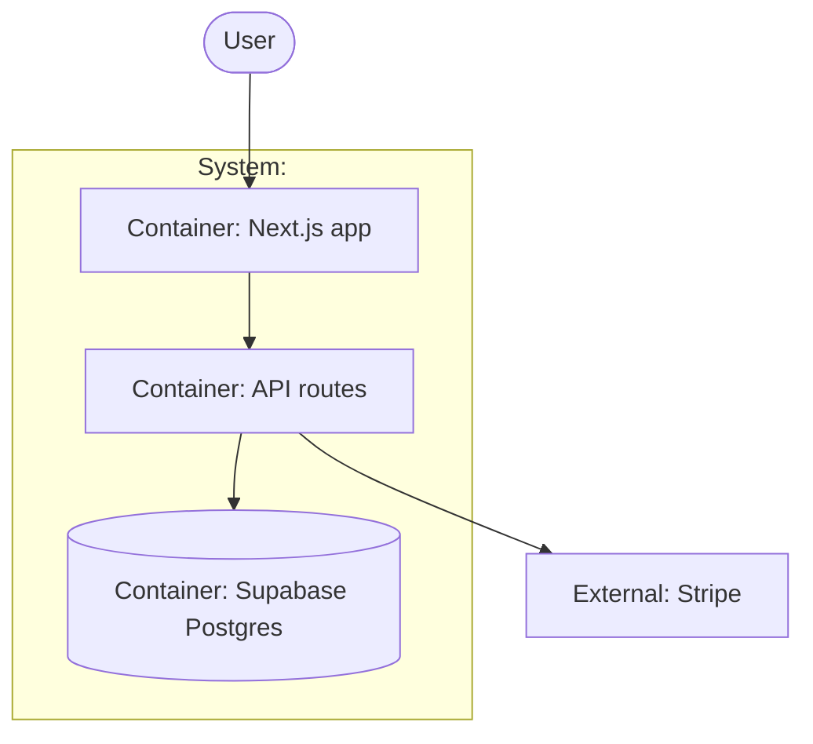

# PLAN.md — <PRODUCT NAME>

> Filled by `/arc-kickoff`. Every section below is load-bearing — if one is empty, the plan
> isn't done. Formats used: Shape Up pitch fields · ADRs · C4-concept Mermaid · Klein pre-mortem.

## Goal
One sentence: who it's for + what it does + why they'd pay.

## Appetite
Total time budget (e.g. "3 weeks part-time"). This is a **constraint, not an estimate**:
if it's blown, we cut scope or kill a phase — never silently extend. No story points anywhere.

## Architecture (C4 concepts, Mermaid flowchart)
<!-- Use C4 *vocabulary* (person / system / container) but plain `flowchart TB` + subgraphs.
     Do NOT use Mermaid's experimental C4Context syntax. Renders natively on GitHub. -->

## Key decisions (ADR index)
Every fork we resolved, one ADR each in `docs/adr/NNNN-title.md`:

| # | Decision | Status |
|---|---|---|
| 0001 | e.g. Supabase over Neon+Lucia | accepted |

## Non-negotiables
The quality bars that never get cut (e.g. RLS on every table, tests per feature, no `any`).

## No-gos (explicitly out of scope)
What we are NOT building this cycle — the scope-creep firewall. Be specific.

## Rabbit holes
Known time-bombs spotted up front, and the decided detour around each
(e.g. "OAuth providers → email-only for v1").

## Pre-mortem (Klein)
*It's 6 months later. The project shipped and failed.* The top 5 most likely causes,
each with: mitigation now / accepted risk (explicitly chosen).

| # | Failure cause | Mitigation or accepted |
|---|---|---|

## Phases (risk-ordered)
Phase 0 is ALWAYS a steel thread / walking skeleton: end-to-end through every
integration on fakes, deployed. Then order by risk — the phase that could kill the
project goes first. Each phase gets its own appetite.

| Phase | Capability | Appetite | Spec |
|---|---|---|---|
| 0 | Steel thread on fakes | | `phases/phase-00-spec.md` |
