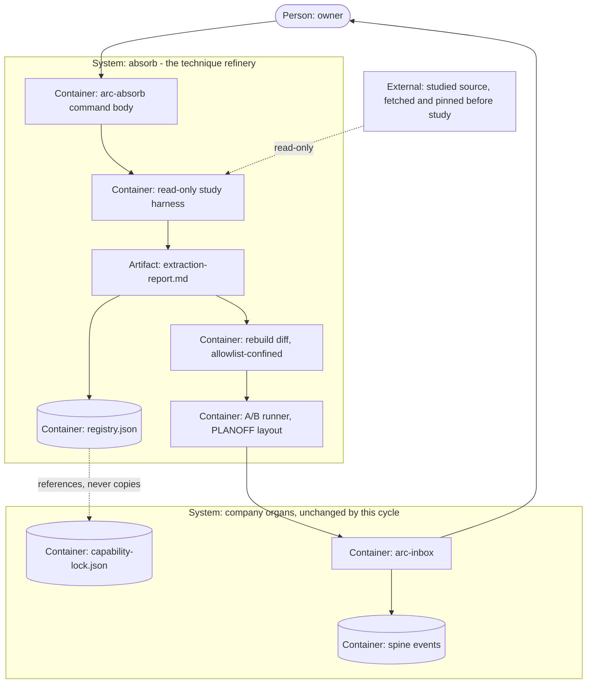

# PLAN.md — absorb: the technique refinery

> Cycle 10, born 2026-08-09 by `/arc-kickoff --lane absorb`. Claims **ADR band 0600–0699**
> (ADR-0600..0606). Design source: `docs/strategy/plans/PLAN-absorb.md` v1.0 (frozen — the
> decision record, not the cycle). ABS-A..F were locked there; **ABS-G was decided at this
> kickoff as ADR-0606**. Company organs (`docs/adr/`, `docs/retro-log.md`,
> `docs/trial-ledger.md`, `tests/`) stay at root and are never copied here (ADR-0053); evidence
> is lane-scoped at `initiatives/absorb/evidence/phase-NN/` (ADR-0055).
>
> **Birth condition, stated because it is unusual:** none of the design source's three kickoff
> gates passed. The live slot was held by two lanes, the venture clock ran to 2026-08-11, and no
> trigger arm had fired. The owner was shown that audit and ruled arc-first — recorded as
> **ADR-0074**, which defers the venture clock explicitly, waives the four-arm trigger gate for
> this cycle only, and **flags the A8 tension for the owner rather than resolving it**. This
> cycle is legitimate because of that receipt, not despite it.

## Goal

`/arc-absorb` turns an external agent or tool's superior **technique** into native, receipted arc
capability — read-only study, then a deterministic extraction report, then a classification
(ABSORB / INTEGRATE / ROUTE / SKIP), then an arc-native rebuild confined to an allowlist, then A/B
evidence in PLANOFF form, then **proposed** adoption through the inbox — so the market's best ideas
compound into arc without runtime dependencies, supply-chain risk, or license contamination.

## Current state

Verified by reading the tree on 2026-08-09, not carried over from the design source. The survey was
done inline (every claim below names the file it came from), so no separate surveyor pass ran.

- **Stack:** zero-dep Node (ESM `.mjs`) + POSIX shell + bats, per A2. No framework, no bundler, no
  runtime dependencies. Tests centralised at `tests/` (ADR-0021). CI is the only gate that counts.
- **Entry points:** `.claude/commands/` (27 command bodies, 3 of them compiled from
  `processes/*.process.yaml`) · one `.claude/scripts/` subdirectory per product ·
  `.claude/scripts/hq/arc-event.sh` for spine emission · `.claude/scripts/core/lane-resolve.sh`
  for lane resolution · `.claude/scripts/plan/kickoff-lint.mjs` as the plan gate.
- **Conventions:** one plan per lane, at that lane's own `initiatives` path (ADR-0051/0054) · ADR numbers
  banded one century per lane · new lint always WARN-first in TRIAL, promoted only by `/arc-retro`
  against `docs/trial-ledger.md` · propose-only for anything that adopts or promotes · never
  delete, attic instead (A10).
- **Do-not-touch:** `docs/evidence/**` and `docs/archive/**` are frozen pre-portfolio history
  (ADR-0058) · engine code, spine and hq scripts, `.claude/settings.json`, `.github/**` are outside
  absorb's rebuild allowlist (ADR-0602) · the three generated command bodies are regenerated from
  their process files and a hand-edit there is deleted by the next compile · `initiatives/leads/**`
  and `initiatives/policy/**` belong to two lanes that are still LIVE.
- **What absorb depends on, confirmed present:** `capability-lock.json` is live at
  `.claude/scripts/develop/` with one row (madge 8.0.0) and a `refusals` array — shape read
  directly, so ADR-0600's reference format has something real to point at. `approval.requested`
  and `decision.recorded` are live kinds that `arc-inbox` already folds, so ADR-0603 needs **zero**
  new kinds. `docs/evidence/planner-bench/` carries PLANOFF-01, PLANOFF-02 and an append-only
  `LEDGER.md`, so ADR-0605's evidence layout is reused rather than invented.
- **What is absent, confirmed:** `PLAN-develop` has a §7.1 capability section but **no team-leader
  section**, so REQ-05 writes new text rather than resolving a merge conflict. `docs/evidence/absorb/`
  does not exist. There is no `products/absorb/`.

## Success requirements

| REQ | User outcome | Measurable acceptance | Phase | Status |
|---|---|---|---|---|
| REQ-01 | A named source becomes a study pack I can trust without reading the source myself | `/arc-absorb` on a repo, docs set or transcript produces `extraction-report.md` in the ADR-0601 shape: technique inventory · per-technique ABSORB/INTEGRATE/ROUTE/SKIP verdict with reason · license note per source · a `file:line` or transcript citation per claim. `report-lint` checks required headings and per-row fields deterministically (WARN-first in TRIAL). Study is read-only and **fixture-proven** so: studied third-party code never executes — no install, no import, no `eval`. A hostile-content red corpus (injection strings in READMEs, prompts posing as instructions, path traversal in doc paths) is pinned as fixtures, with the adversarial pass run before any FAIL promotion. A source needing more than 1 day of archaeology produces a SKIP row with its reason, never a longer study | 1 | validated |
| REQ-02 | An ABSORB verdict becomes a reviewed diff, never a dependency | A rebuild lands only on the ADR-0602 allowlist (`processes/**`, `docs/playbooks/**`, `.claude/commands/**`, accompanying `tests/**` fixtures); an out-of-allowlist path warns from birth (WARN-first in TRIAL). Ideas are re-expressed. An incompatible-license copy is a **refusal recorded in the registry** with status and reason. A permissive-license copy (MIT, BSD, Apache) carries attribution in **two** places: the registry row's `attribution` field and a source comment in the rebuilt file. Zero new runtime dependencies, proven by a fixture that **parses** the rebuild diff for every import form (static `import`, `require()`, dynamic `import()`, a string-built specifier) rather than grepping the keyword, plus a separate check for install and exec invocations (`npm install`, `child_process`, `exec`, `spawn`) — with a mutant that adds a dependency through a form a grep alone would miss, asserting the suite REJECTS it | 2 | validated |
| REQ-03 | Adoption claims are evidence, not vibes | Old-way versus absorbed-way on **at least 3** representative fixtures of the target class; deterministic checks where they exist, otherwise the ADR-0603 owner-judge receipt. Results land in PLANOFF layout (protocol, scoring, RESULTS) under `docs/evidence/absorb/` with a `LEDGER.md` line. The results table travels **with** the adoption proposal — a proposal without its table is lint-invalid | 4 | active |
| REQ-04 | One honest ledger of every technique arc has looked at | `products/absorb/registry.json` tracks every candidate: `status` (`candidate`/`trial`/`adopted`/`retired`) · `lane` · `source` and license · `classification_ref` · `evidence` · `review_by`. Cap **12 adopted per lane** and its displacement lint ship **fixture-proven only this cycle** — the real file holds at most 1 adopted row (ADR-0606's empty seed, REQ-08 the only real absorb), so live enforcement is genuinely unexercised until a later cycle adopts a second technique, and saying so here is cheaper than discovering it at the retro. An `adopted` or `retired` transition without a `decision.recorded` ref is a lint warning (WARN-first). Executable artifacts stay under `capability-lock.json`; registry rows **reference** lock entries and never duplicate pin or hash data (A5) | 2 | validated |
| REQ-05 | develop's team leader learns to use the toolbox, in this cycle | The `PLAN-develop` §7.1 addendum lands as this cycle's reviewed diff plus a freeze-log line (EVO-H0 precedent): consult registry and lockfile at brief time · receipted use per slice · the Capability-Proposal verdict set gains `technique → refer to absorb` · cap 12 with displacement · a retro retire-review row (unused 2 cycles proposes retire) · adopt and retire stay propose-only. A reusable **Toolbox template block** ships for future lane plans. Every duty is a harness step, never a standing daemon. ADR-0604 records the cross-lane boundary ruling so it is not re-litigated in review | 3 | active |
| REQ-06 | A human judgement is a receipt, not a memory | Blind A/B per ADR-0603: variant labels randomized, the label-to-variant mapping **sealed** in the evidence bundle and revealed only after the decision is recorded. `approval.requested` carries the strict profile `subject: "absorb.ab-judgement"` (candidate id, fixture list, blind labels, evidence path, correlation) and **rejects unknown keys**; the owner picks through the existing inbox; `decision.recorded` carries **`pick` and `reason`, both mandatory**. **Zero new event kinds** | 3 | active |
| REQ-07 | Nothing adopts itself, in either direction | Adoption **and** retirement each end as an inbox item with a reason; no self-adoption code path exists. Fixture: a registry transition to `adopted` or `retired` without its `decision.recorded` ref trips the REQ-04 lint, and the harness offers no path that writes those statuses directly | 3 | active |
| REQ-08 | One real absorb, end-to-end, on a real weakness | ADR-0606's named target — the unspecified-input defect class, studying gstack's post-build review pass — goes through the whole loop: study, extraction report, classification, rebuild diff, 3-fixture A/B in PLANOFF layout, sealed-blind owner judgement, adoption proposal, decision recorded. The evidence bundle is committed. This REQ is the cycle's proof-of-life: mechanics without one real absorb means the cycle is not done | 4 | active |

## Appetite

**8 days hard cap** (1.5 working weeks). Planned allocation **6.5 days, leaving 1.5 days slack** —
portfolio C4 overran a 100%-allocated plan by 112%, and that is the standing lesson. Slack is never
taken from the adversarial day.

**Tier:** M

**Kill criteria:** at 50% burn (4 days), if Phase 2 is not done there is a mandatory scope-cut
conversation. At 100% we cut or kill, never extend silently. Lane-specific kills, each pre-agreed:
**REQ-08's own A/B failing to show a gain** means the loop is not paying — park the lane and bank
the report template plus registry as standalone documentation. (A ROUTE or SKIP verdict does **not**
trip this; an ABSORB verdict whose A/B shows no improvement does. The design source's
"two consecutive absorbs" wording cannot fire inside this appetite at all — the no-gos forbid more
than one absorb in flight and REQ-08 is the only one — so this cycle needed a kill line its own
single absorb could actually trip.) A source needing more than 1 day of
archaeology is a SKIP with its reason recorded. **The read-only study boundary not being
fixture-provable in Phase 1 is a STOP**, not a workaround — an unprovable boundary is a no.

## Architecture (C4 concepts, Mermaid flowchart)

## Key decisions (ADR index)

| # | Decision | Status |
|---|---|---|
| 0074 | company: arc first — the venture clock is deferred by owner ruling, absorb's trigger gate waived for this cycle, A8 tension flagged for the owner | accepted |
| 0600 | ABS-A: the technique registry is ONE absorb-owned JSON file, referencing the lock rather than copying it | accepted |
| 0601 | ABS-B: the extraction report is a fixed, lint-checkable template, and attribution law lives in it | accepted |
| 0602 | ABS-C: a rebuild lands only on an allowlist, and widening it is an amendment | accepted |
| 0603 | ABS-D: an owner judgement is a sealed blind A/B carried by a payload profile, zero new event kinds | accepted |
| 0604 | ABS-E: absorb's boundaries against develop, bench, discover and evolve, recorded so nobody re-litigates | accepted |
| 0605 | ABS-F: absorb's A/Bs run bench-style in v1, and flipping that needs an evolve-side ruling | accepted |
| 0606 | ABS-G: absorb claims the 0600s, lives in `products/absorb/`, seeds its registry empty, and takes the unspecified-input defect class as its first target | accepted |

## Non-negotiables

- Study is read-only and injection-aware: studied READMEs, prompts and transcripts are hostile input, so parser-class discipline applies from birth with pinned red fixtures and an adversarial pass before any FAIL promotion.
- Studied code never executes during study — no install, no import, no eval; execution happens only through vetted paths after a rebuild.
- Zero new event kinds; ADR-0603 is a payload profile only, and the closed spine vocabulary is not extended by this cycle.
- License hygiene: re-express ideas, refuse incompatible copies and record the refusal, attribute permissive copies in both the registry row and the rebuilt file.
- Propose-only in both directions: adoption and retirement each end in the inbox, and no self-adoption path exists.
- Rebuilds land only on the ADR-0602 allowlist; arbitrary paths are never a rebuild target.
- Zero-dep Node and POSIX (A2); tests stay centralised at `tests/` (ADR-0021); every new lint ships WARN-first in TRIAL and is promoted only by `/arc-retro`.
- Never delete: SKIPped sources and retired techniques keep their registry rows and reports (A10).
- A gate, lint or parser is not done until a fresh adversarial pass has attacked it and the found holes are fixed and pinned as fixtures — and the pass attacks the TEST that protects the rule, not only the rule.
- Constitution articles upheld: E3, A2, A5, A9, A10. **A8 is the exception and is not claimed as upheld** — this cycle runs under ADR-0074's recorded reading that lexos, running a root-mode arc install, pulls arc's completion; that tension is flagged for the owner and only he may resolve it.

## No-gos (explicitly out of scope)

Marketplace or leaderboard ambitions · scheduled auto-scanning of any kind, human-started only ·
absorbing model quality, which routes to `engine/router.yaml` · more than one absorb in flight ·
any standing absorb daemon · touching evolve's EVO-F verdict math, floors or experiment kinds ·
new event kinds · installing or executing studied artifacts, which is develop's vet-and-lock path
or executor's INTEGRATE verdict and never absorb's · editing files outside the ADR-0602 allowlist ·
scoring infrastructure, which is bench's territory when bench wakes · certifying Mode B.

## Rabbit holes

- **The perfect report template** — v1 carries only fields with live consumers (classification,
  citations, license, attribution). Taxonomy elegance is stale on arrival.
- **Source archaeology** — more than 1 day means SKIP with a reason. The refinery processes ore, it
  does not excavate mines.
- **Building a scoring engine** — deterministic checks reuse existing test patterns; anything
  fancier waits for bench.
- **Absorbing a framework whole** — the unit is one technique: one registry row, one rebuild diff.
  "Rebuild their whole pipeline" is several candidates or a SKIP.
- **Studying without a named weakness** — under ADR-0074 a fired trigger is not required this
  cycle, but a named target still is: ADR-0606 names it. Curiosity-driven scanning is the
  auto-scan no-go wearing a costume.
- **Re-litigating the birth condition** — ADR-0074 records it once. A later session that finds "no
  arm fired" reads that ADR instead of reopening the question.

## Assumptions ledger

| Assumption | How we'd know it's wrong (trigger) | Phase that tests it |
|---|---|---|
| Read-only study is fixture-provable | Phase 1 cannot prove the no-execution boundary with a fixture | 1 — this is the STOP kill criterion |
| The 4-bucket matrix classifies real findings cleanly | A finding fits no bucket honestly during the real study | 4 — recorded in the report; the matrix is extended by ADR, never shoehorned |
| Blind owner-judging costs minutes, not hours — **and the owner is not queued behind another lane when absorb needs him** | Judging exceeds 30 minutes, gets skipped or delegated, **or absorb's Phase 3 and Phase 4 inbox picks queue behind leads Phase 03 (the `_dmarc.automemory.ai` record) and policy Phase 04 (three `.claude/settings.json` edits) — both LIVE and blocked on this same owner as of 2026-08-09** | 3 and 4 |
| 12 adopted per lane is the right cap | Displacement fires on the first or second adoption (too small), or the registry never nears it (moot) | 2 builds the cap; retro tests the size |
| The develop addendum is an uncontroversial cross-lane diff | Review objects to absorb editing `PLAN-develop` at all | 3 — ADR-0604 pre-answers it; an objection is retro input |
| `report-lint` and the registry lint fail on a malformed input rather than passing it through | A deliberately malformed report or a registry row with a hash field passes its lint green — a wrong line of code, not a wrong decision | 1 and 2 — the adversarial pass supplies the malformed inputs |
| PLANOFF-01's single malformed-escape catch is a repeatable technique advantage arc can re-express, not sampling noise inside a benchmark whose arc arm scored **highest overall** (composite 94.5 versus gstack's 90.8, per `docs/evidence/planner-bench/LEDGER.md`) | Phase 4's study or A/B finds the win was one lucky probe on one fixture rather than a pattern reproducible across the 3 fixtures, **or** finds the advantage came from outside the ADR-0602 allowlist | 4 — the classification's recorded reason must name this tension explicitly rather than only citing the one defect row; a ROUTE or SKIP verdict is a valid honest outcome |

## External dependencies

**Not none.** No third-party or network dependency exists — studied sources are read-only local
clones, docs or transcripts, pinned by commit or date before study begins, and zero-dep Node
throughout (A2). But three **in-repo cross-product couplings** are named in Current state and were
originally erased here by a "None" that the offline-first rule then never got applied to. They are
owned by other products, so they are dependencies whether or not they cross the network.

| Dep | Interface | Fake impl | Real impl | Contract test |
|---|---|---|---|---|
| `capability-lock.json` (develop) | read-only row lookup by name and version | fixture lock file with a synthetic row | live file at `.claude/scripts/develop/` | Phase 0: the registry reference field round-trips against a fixture row **and** the real row |
| `arc-inbox` and the spine kinds `approval.requested` / `decision.recorded` (company organs) | the existing payload contract, zero new kinds | throwaway spine used by the ADR-0603 fixtures | real spine plus the `arc-inbox` CLI | Phase 3: unknown-key refusal, missing-required-key refusal, and the seal-then-reveal fixtures, run against the real inbox |
| PLANOFF layout in `docs/evidence/planner-bench/` (bench-owned convention, ADR-0605) | protocol / scoring / RESULTS / `LEDGER.md` shape | **none** — the skeleton is copied by hand, not parameterized | `docs/evidence/absorb/`, mirrored in Phase 2 | **none** — a bench-side format change has no absorb-side test that would catch the drift. Stated as a known gap rather than papered over; it is bench's to close when bench wakes |

## Pre-mortem (Klein)

| # | Failure cause | Mitigation or accepted |
|---|---|---|
| 1 | Prompt injection from studied content — ToxicSkills-class is the named threat, and engine's adversarial pass already forged `allowed-tools:` through frontmatter, which is the same class | REQ-01's read-only study, parser-class red fixtures pinned from birth per ADR-0601, quarantine discipline, execution only through vetted paths after rebuild; phase 1's kill criterion STOPs the cycle if the boundary is unprovable |
| 2 | A technique is misread, producing a plausible-but-wrong rebuild | A `file:line` citation is mandatory per claim; the A/B is the arbiter rather than the report's prose; two consecutive A/B failures park the lane |
| 3 | absorb becomes tool-hoarding, which is every organisation's default failure here | REQ-04's cap of 12 with displacement naming its own retire (ADR-0600), a retro retire-review for anything unused 2 cycles, and REQ-03's A/B gate in front of every single adoption |
| 4 | **ADR-0074's waiver leaves two conditions open at birth with nothing re-checking them** — the venture clock is deferred "for this cycle only" rather than cancelled, and the A8 tension is "flagged for the owner" rather than resolved. This repo has already lost a clock to silence (the first-money two-week clock ran unnoticed for five days because only `docs/HISTORY.md` recorded a close that nothing else read) and lost a mandated flag to silence (ADR-0056's "Mode B: not certified" note, absent through two whole phases) | Phase 4's retro bullet states **both** statuses explicitly and by name — the venture clock's (fired or not, read from `PORTFOLIO.md`) and the A8 flag's (open or owner-resolved) — beside the assumptions-ledger fired-or-not report. Neither may close on silence. Century collision, the row this replaces, already has an automated control in `kickoff-lint [adr-dup]`; this risk had none |
| 5 | **leads and policy stay LIVE for absorb's whole 8-day appetite while absorb writes to shared root organs in nearly every phase** — `docs/trial-ledger.md` (a new TRIAL row in phases 0 through 3) and `docs/adr/` (8 new ADRs) — yet `.claude/rules/lanes.md`'s "check the log before editing a shared file" was written into this plan for the phase 3 `PLAN-develop` edit only. A live-lane collision on a shared root file has already been found at merge twice: ADR numbers on 2026-08-02, a stale CI constant on 2026-08-03 | Every phase's `docs/trial-ledger.md` and `docs/adr/` write runs `git log origin/main --oneline -5 -- FILE` first, exactly as phase 3 already mandates for `PLAN-develop`, and takes the stronger version at any merge rather than the earlier one. `kickoff-lint [adr-dup]` is the ADR half of the control; `docs/trial-ledger.md` has no equivalent detector, which is why the check is manual and named. The untracked side-door edit this row replaces is subsumed: REQ-05 is a named REQ with a reviewed diff and a freeze-log line, and ADR-0604 records the ruling |
| 6 | A guard ships that its own test cannot fail — the vacuous pass, shipped three times in Cycle 6 and twice inside the suites written to prevent it | Every lint in this cycle gets a negative control that RUNS a mutant built to walk past it; assert the check ran before asserting what it reported; the adversarial pass is two fresh agents on different surfaces, and it is untouchable within Phase 1 |

## Phases (risk-ordered)

| Phase | Capability | Appetite |
|---|---|---|
| 0 | **Steel thread: the matrix and its paperwork.** DEV-B/C boundary audit of what develop C6 actually shipped (lock contract, vet gate, proposal table) · ADR-0600 registry shape finalized against that audit · ADR-0601 template plus `report-lint` (WARN-first) · the `capability-lock.json` reference contract test · **the kickoff ADR set and the century claim VERIFIED, not authored** — ADR-0074 and 0600–0606 were written at kickoff and Phase 0 confirms them | 1d |
| 1 | **Study harness, hostile-input-first.** `/arc-absorb` read-only pipeline producing an extraction report · classification wiring · injection red corpus pinned · adversarial pass, untouchable within this phase · the no-execution boundary fixture-proven or the cycle STOPs | 2d |
| 2 | **Registry and guards.** Registry live with status lint (cap 12, displacement, decision-ref transitions) · ADR-0602 allowlist lint · license and attribution gate · `docs/evidence/absorb/` PLANOFF skeleton plus ledger | 1d |
| 3 | **Governance drop.** ADR-0603 owner-judge profile, blind-mapping mechanics and inbox chain fixtures (REQ-06, REQ-07) · REQ-05's `PLAN-develop` team-leader addendum as the reviewed diff plus freeze-log line plus the Toolbox template block | 1d |
| 4 | **The real absorb (REQ-08).** ADR-0606's target end-to-end: study, report, rebuild diff, 3-fixture A/B, sealed-blind owner judgement, adoption proposal, decision recorded · evidence bundle committed · retro | 1.5d |

**North-star:** the day an external agent demonstrably beats arc at something arc does, the losing
receipt becomes a study, the study becomes a diff, the diff becomes an A/B win, and the win becomes
an owner-approved adoption — all receipted, with zero new runtime dependencies. Compounding without
contamination.
