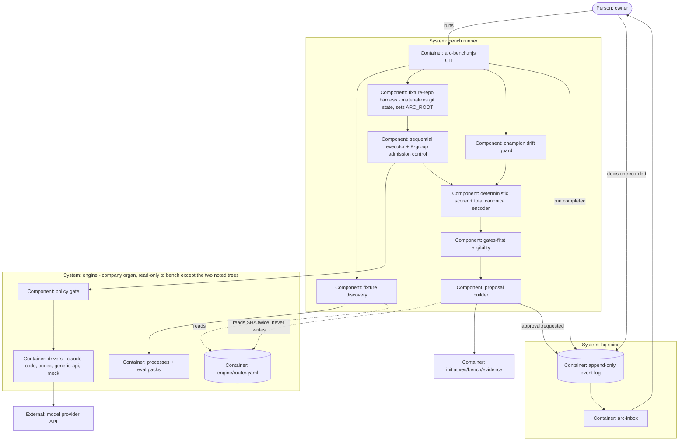

# PLAN.md — bench runner v1: "the model market"

> Lane `bench` · Cycle 13 · born 2026-08-12 · ADR century **0900–0999**.
> Design source: `docs/strategy/plans/PLAN-bench.md` v1.0. **This file is the live plan; the
> design source is history.** Where they differ, this file wins and the ADR says why —
> kickoff verification falsified five of the design source's inherited premises (ADR-0900
> through ADR-0905).

## Goal

`node .claude/scripts/engine/arc-bench.mjs --driver DRIVER --model PROVIDER/MODEL --budget inr=CAP`
runs every fixture-shipping process against ONE explicitly-named driver+model pair, scores
schema-compliance and assertion pass-rate and cost and latency with deterministic checks, and
emits a **propose-only router diff whose evidence, approval and verdict all live on the spine as
ordinary receipts** — so a new model becomes a same-day, receipted routing decision instead of a
migration project, and a silently-drifting champion is caught within a month.

## Current state

Verified in-tree 2026-08-12 by direct read (the design source's own "Current state" was written
the same day and was wrong on five load-bearing points — those are the ADRs below).

- **Stack:** arc build system · Node 18+ zero-dependency `.mjs` plus POSIX `.sh` · bats test
  suite in `tests/` · 3-OS CI matrix (ubuntu/windows/macos) sharded, on `pull_request` only.
- **Entry points:** `.claude/scripts/engine/arc-run.mjs` (headless runner, spawns drivers behind
  the policy gate) · `arc-compile.mjs` (regenerates `.claude/commands/*.md` from
  `processes/*.process.yaml`) · `process-lint.mjs` (process YAML gate) ·
  `.claude/scripts/hq/arc-event.sh` (spine emitter) · `arc-inbox.mjs` (approvals).
- **Conventions:** processes are `processes/NAME.process.yaml`; drivers sidecar their cost as
  JSON and omit absent fields rather than estimating; tests stay centralised in `tests/`
  (ADR-0021); a lane is named only by `--lane` (ADR-0054); ADRs are one company organ at root,
  banded one century per lane.

- **Engine C6 closed 2026-08-03** (PR #103). `processes/` holds 3 canonical pilots
  (`commit-msg-draft`, `review-diff`, `kickoff-plan`); `engine/router.yaml` is live at root.
  Both are company organs (ADR-0053). Engine lane is IDLE.
- **Invocation is a flat script, not a subcommand.** `node .claude/scripts/engine/arc-run.mjs
  --process NAME [--driver NAME|auto] [--budget inr=N,min=M] [--input JSON|@FILE] [--root PATH]
  [--dry-run]` (`arc-run.mjs:29-32`) — that is the **whole closed six-flag set**, parsed at
  `:55-64`, with `exit 2` on any unknown option. There is **no `arc` binary, no dispatcher, no
  `package.json`, no `bin/`** — `arc engine bench` has never existed (ADR-0901).
- **The plan gate is `node .claude/scripts/plan/kickoff-lint.mjs --lane bench`** (exit 0 = pass);
  lane resolution is `bash .claude/scripts/core/lane-resolve.sh`.
- **Driver contract (ADR-0203):** `drivers/NAME.sh run PROCESS INPUT-JSON BUDGET` →
  output JSON on stdout, cost sidecar at `$ARC_DRIVER_COST_FILE`, stderr never parsed. Exit
  `0` produced / `1` driver failure / `2` declined for budget.
- **3 drivers registered** (`arc-run.mjs:45`): `claude-code`, `codex`, `generic-api`. **Only
  `claude-code` has ever produced a real receipt** — `codex` is not installed, `generic-api`
  has no credentials. Engine's own evidence: *"NOT MET, and it is not close… remains
  UNPROVEN"* (`initiatives/engine/evidence/phase-03/real-runs.md:9-17`).
- **No driver implements `--version`** (zero matches repo-wide; `common.mjs:152` rejects every
  verb but `run`). **`drivers/mock` does not exist** — only an `ARC_DRIVER_FAKE=DIR` env fake
  (ADR-0902).
- **The `ARC_DRIVER_FAKE` short-circuit is a LIVE defect, not history.** `common.mjs:180-191`
  still `return`s inside the fake branch **before `await produce()` ever runs**, while
  `tests/engine-driver-contract.bats:6-8` asserts the opposite ("puts a recorded response
  through the same code path the real call takes"). So *"every driver satisfies the same
  contract"* is vacuous for all three drivers today — the exact 2026-08-03 retro-log finding,
  still open.
- **A driver runs in a settable working directory:** `claude-code.mjs:25` reads
  `ARC_ROOT || process.cwd()` and `:54` execs the CLI with `cwd: ROOT`. This is the mechanism
  the fixture-repo harness uses (REQ-06).
- **3 eval fixtures exist, one per class**, at `tests/fixtures/engine/evals/CLASS/basic.json`,
  each `{note, input, expected}` — **no task-class tag, no revision, no assertions**. Only
  scoring that exists is `expected` vs the output schema (`arc-run.mjs:184-186`).
- **Only `kickoff-plan` declares a varyable input** (`goal`). `commit-msg-draft` declares
  `inputs: []` and `review-diff` only `base` — for both, the real input is ambient repo state
  (ADR-0905).
- **`engine/router.yaml`** keys `version, models, tiers, classes{tier,driver,fallback},
  default`. The executor's `cap:/judge:/hosted:/review_by:` fields **do not exist**. Nothing
  writes to it at run time (ADR-0069 b(1)).
- **MP-F fingerprint** (ADR-0068 / 0069 block e) has 9 fields and **no runtime or driver
  field**; ADR-0069 is **not amended** (`ADR-0204:62-65` explicitly declines). No
  `run.completed` on the machine carries a model id (ADR-0903).
- **No pricing snapshot exists anywhere**, and the eligible-cost rule is implemented in no code
  (ADR-0904).
- **Spine intact:** `KINDS.length = 44` (`.claude/scripts/hq/lib/validate.mjs:33-53`), and
  `run.completed` / `approval.requested` / `decision.recorded` all present (ADR-0911).
  `arc-inbox approve ULID --reason R` exists and **rejects an empty reason with `BAD_ARGS`**
  (`arc-inbox.mjs:12-13, 79-83`) — verified, not assumed.
- **Policy in force:** `hq.policy.yaml` keys 4 action kinds; `process:NAME` resolves against
  `processes/*.process.yaml`. Bench is a runner, not a process (ADR-0912).
- **Do-not-touch:** `docs/evidence/**` and `docs/archive/**` (frozen) · `.claude/commands/*.md`
  (regenerated from `processes/*.process.yaml`) · `tests/fixtures/sync-golden/tree-manifest.txt`
  (byte-identity CI gate) · `engine/router.yaml` (bench has no write path, ever).
- **Touch-with-care — engine-owned company organs bench DOES edit:**
  `.claude/scripts/engine/drivers/**` (landing `mock`, adding the `version` verb) and
  `tests/fixtures/engine/evals/**` (arming a class). Engine is IDLE, but **three other lanes
  are LIVE in sibling worktrees** (leads, memory, scheduler). Before any commit to either
  tree run `git log origin/main --oneline -5 -- PATH` per `.claude/rules/lanes.md`; a
  touched-since-branch-point result is an in-flight merge conflict, handled now, not at merge.

## Success requirements

| REQ | User outcome | Measurable acceptance | Phase | Status |
|---|---|---|---|---|
| REQ-01 | One command, one full scorecard, honestly reproducible | `arc-bench.mjs --driver DRIVER --model MODEL --budget inr=CAP` runs every fixture-shipping process for ONE candidate: per-process **schema pass-rate AND assertion pass-rate reported separately, never merged**, median cost and median latency over **K=3** runs per fixture, executed sequentially. **The K=3 per-attempt outcomes are never averaged or majority-voted into one per-fixture pass/fail — each of the K outcomes contributes individually to the assertion denominator, so a 2-of-3 fixture and a 1-of-3 fixture never report as the same number.** Every run records the full provenance tuple (ADR-0913) and captures redacted raw outputs. **Replay proof:** re-scoring captured outputs yields a **byte-identical** scorecard, fixture-proven on all 3 CI OS legs. One `run.completed` emitted with `process: bench@x.y.z`, verified present in `events/` and absent from `events/_quarantine/` | 1 | active |
| REQ-02 | A routing change is a reviewable proposal, never a mutation | `--propose` emits exactly 3 artifacts: human evidence table per task class · machine-readable results manifest · **stable unified diff pinned to the exact router SHA the run read**. Eligibility is gates-first (ADR-0906) including the completeness gate. Any gate failing → `NO PROPOSAL` **carrying its reason**, never a diff — **and every gate-independent check (secret redaction, partial-failure evidence preservation, the router-SHA assertion) still runs to completion on that early-exit path; a failing gate short-circuits the proposal, never the checks after it**. Proposal leaves `approval.requested` gate `router-merge`. **Bench has no write path to the router: `sha256` of `engine/router.yaml` is asserted unchanged after every run including aborts, and the SHA read at run-start is re-read at proposal-emit — a mismatch aborts with a distinct reason rather than emitting a diff against a moved target** | 2 | active |
| REQ-03 | Silent provider drift gets caught | `--champion` re-runs champions and compares on **two split axes** (ADR-0908): quality-comparability and cost-comparability, with each cost delta **classified** into one of 3 causes. **3 alert tiers** fire correctly, each proven by its own fixture; tier 3 is REPORT-ONLY. Alerts only where the class ships **≥ 5** fixtures. Baseline re-pins only on an enumerated cause, and **the receipt names that cause — a score movement alone never re-pins** | 3 | active |
| REQ-04 | Benching cannot silently burn money | Admission control at fixture-group granularity: before a fixture starts, **K × worst-case per-invocation spend** is reserved against BOTH the run cap (**₹500**) and the process sub-cap (**₹100**). **The worst-case figure is an owner-set placeholder ceiling in `initiatives/bench/ceilings.json`, derived from no pricing snapshot (ADR-0904); Phase 1 pins its value AND a fixture proving the post-call overrun case — when a fixture's measured cost exceeds its reservation, the run remainder reflects the REAL spend and every later fixture is admitted or refused off the corrected remainder, never the stale reservation.** If the remainder cannot cover the whole group the fixture is **NOT started** — recorded `failure: budget`, evidence kept, class marked `NO PROPOSAL`. Budget is threaded as ONE run-level remainder across every attempt, retry and fallback hop; **exhaustion is terminal and never triggers the fallback path**. Cap exhausted → `run.completed` `outcome: fail`, `payload.reason: "budget"`. A ceiling value never appears in any emitted payload | 1 | active |
| REQ-05 | The loop is proven on a real event | Preflight recorded before the run: candidate is new to arc · reachable through an existing driver · access verified. Then ONE real model benched end-to-end → proposal → human **MERGED or REJECTED** through `arc-inbox VERDICT ULID --reason` (`decision.recorded`, reason schema-mandatory). The preflight **asserts the candidate was actually reached** — a receipt carrying a real model id and non-zero token count — before any verdict is recorded. **Both outcomes are success** | 3 | active |
| REQ-06 | One task class can actually discriminate a candidate from a champion | `commit-msg-draft` ships **5** fixtures carrying real assertions under the ADR-0905 schema (`pack.json` with `revision` + `task_class`; `assertions[]` over the closed op set `equals/matches/contains/absent/length_between`). **Because that process declares `inputs: []`, its fixtures are distinguished by prepared repo state, not by JSON input: each pins a synthetic git state that bench materializes in a temp dir and points the driver at via `ARC_ROOT`.** A fixture with no `assertions` key contributes **0** to the assertion denominator and is never scored as a pass; assertion pass-rate is **absent, not 100%**, where the denominator is 0. `review-diff` and `kickoff-plan` read `NO PROPOSAL — evidence insufficient (1 of 5 fixtures)` | 0 | active |
| REQ-07 | Bench's own tests run offline and cost ₹0 | `drivers/mock` exists, honours the ADR-0203 contract, replays pinned bytes, is selectable as `--driver mock`, and reports version `mock@FIXTURE-DIR-SHA`. `claude-code` and `mock` answer a `version` verb (`codex` and `generic-api` are out of scope — neither is reachable and neither is exercised by any REQ). **The mock swaps the RESPONSE, never the code path** — proven by a test that breaks the real driver path and asserts the contract suite goes RED, which it does not do today | 0 | active |
| REQ-08 | The runner survives hostile input and leaks no secrets | System-level adversarial fixtures pass: malformed eval output · unknown model · missing cost · budget K-group boundary · nondeterministic key ordering · **a mutant bench that attempts to write the router** · **a mutant bench that spawns a driver directly, bypassing the policy gate** — the suite REJECTS both mutants, **and each rejection's recorded reason is attributable to the specific guard under test: a mutant that crashes on an unrelated fault before reaching its target behaviour is NOT a passing negative control**. Secret-redaction verified on **all** stored bench artifacts. Partial-failure evidence preservation proven: one failed fixture does not erase the rest of the run | 4 | active |

## Appetite

**8 days hard cap** (owner-set 2026-08-12, raised from the design source's 4d because kickoff
verification found bench's prerequisites do not exist and the road is now in scope — ADR-0900).
A constraint, not an estimate: blown means cut or kill, never a silent extension.

**Tier:** M

Phases below sum to **7.25d**; the remaining **0.75d is named reserve, not unallocated scope**,
and is not to be filled with work.

**Pre-planned cuts, in order — decided now, not at 6pm on day 8:** (1) `review-diff`'s and
`kickoff-plan`'s `NO PROPOSAL` count-check narrows to a unit test rather than a full run.
(2) The drift guard's tier-3 cost alert (REPORT-ONLY) ships as a report line without its own
fixture. (3) The policy-bypass mutant keeps ONE adversarial surface instead of two. **Never
cut:** the replay proof, the K-group admission control, both mutants existing at all, and the
real event.

**Kill criteria (50% tripwire = 4 days):** at 4d, if REQ-01's replay proof is not green on the
3 CI OS legs → the scoring approach is wrong; bank the scorecard format and the armed fixtures,
stop, retro. · If the 5 armed `commit-msg-draft` fixtures cannot separate champion from
candidate in Phase 3's real event → stop benching and spend the remaining appetite strengthening
that process's own evals. · At 100% → cut or kill.

## Architecture (C4 concepts, Mermaid flowchart)

## Key decisions (ADR index)

| # | Decision | Status |
|---|---|---|
| 0900 | The owner's build-out ruling fires bench; the pull-trigger is superseded | accepted |
| 0901 | Bench's CLI is a flat script; the `arc NOUN VERB` namespace stays engine's question | accepted |
| 0902 | Bench builds the replay test driver and the version verb, amending a no-go | accepted |
| 0903 | Driver identity rides beside the MP-F fingerprint, never inside it | accepted |
| 0904 | Cost eligibility without a pricing snapshot: a ceiling bounds spend, never reports it | accepted |
| 0905 | Quality is assertion pass-rate, and bench builds the substrate for exactly one class | accepted |
| 0906 | Selection is gates-first with no composite score | accepted |
| 0907 | The per-fixture record and the three proposal artifacts | accepted |
| 0908 | Drift is two comparability axes, three tiers, and a per-class floor | accepted |
| 0909 | Budget is K-group admission control; execution is sequential in v1 | accepted |
| 0910 | The guard is monthly and owner-started; a clean run leaves no approval | accepted |
| 0911 | Bench rides existing spine kinds only | accepted |
| 0912 | Bench adds no policy subject and must not become a policy bypass | accepted |
| 0913 | Reproducibility is replay-determinism with honest variance | accepted |
| 0914 | The real-event candidate is a second model under the proven driver | accepted |

## Non-negotiables

- Propose-only: a human merges every routing change, and bench has no write path to the router — the router SHA is asserted unchanged after every run including aborts, and the guard is a parse plus a running mutant, never a grep. The policy-bypass guard is held to the identical standard, a parse plus a running mutant, because a driver spawn hides behind `child_process` and async exec exactly as a file write hides behind `fs/promises`.
- Fixtures are the eval packs processes ship; bench strengthens them in place and never forks a bench-only copy.
- Deterministic checks only: no LLM judges, and no assertion op may call a model, read the clock or touch the network.
- One candidate driver+model pair per run, driver named explicitly; no tournaments, no sweeps.
- Per-task-class verdicts only, never one collapsed average across processes.
- Schema pass-rate and assertion pass-rate stay separate; an absent denominator reports absent rather than 100%; and K attempts are never collapsed into one per-fixture verdict.
- A partial run never emits a proposal: it is flagged `partial`, and its affected classes read `NO PROPOSAL` carrying the reason.
- One failed fixture never erases the rest of a run's evidence, and a gate that short-circuits the proposal never skips the independent checks bundled after it.
- Budget is a property of the RUN: one remainder threaded through every attempt, retry and fallback hop, and exhaustion is terminal and never triggers the fallback path.
- Sequential fixture execution in v1.
- Absent data stays absent: never estimated, never zero, never a placeholder, and a spend ceiling never appears in any emitted payload.
- The canonical encoder is total and type-tagged: it REFUSES `undefined`, `NaN`, `±Infinity`, `BigInt` and cycles rather than coercing them, and absent fields are absent keys rather than `null`.
- Zero new spine kinds; first-party `--strict` emits; after every emit, look in both `events/` and `events/_quarantine/` and confirm where the receipt landed.
- Bench introduces no policy subject and never spawns a driver outside the policy gate.
- Human-started runs only; a clean guard run leaves no open approval on the spine.
- Real and simulated never mix: the mock driver reports its own version and swaps the response, never the code path.
- Secret redaction verified on every stored bench artifact.
- Offline-first: bench's own tests run against `drivers/mock` at ₹0 and against a throwaway `ARC_SPINE_ROOT`, never the real event log; tests stay centralised in `tests/` (ADR-0021), every `@test` name is ASCII-only, and every test file asserts its own registered test count — enforced by a CI step that diffs the declared count against bats' executed count and fails the job on a mismatch, not by author diligence.
- Before editing `.claude/scripts/engine/drivers/**`, `tests/fixtures/engine/evals/**` or any shared company organ, run `git log origin/main --oneline -5 -- PATH` per `.claude/rules/lanes.md`; a touched-since-branch-point result is resolved now, not at merge.
- Adding test files reshuffles the bats shard plan: regenerate the timing table as a named step and make unmeasured entries visible as a count, never absorbed into a default.
- A gate, lint or parser is not done until TWO fresh adversarial agents with different surfaces have attacked it, the pass attacks the TEST that protects the rule not only the rule, and each attacker's prompt carries the lane's running list of already-fixed defects with the instruction to check each one in every OTHER file — a fix is not applied until it has been attacked somewhere it was never made.
- CI is the gate, read per JOB via `gh run view --json jobs`; never trust a watcher's exit code.
- Mid-cycle changes go through `/arc-change --lane bench`, never ad-hoc.

## No-gos (explicitly out of scope)

No public leaderboard · no auto-merge, auto-apply or automatic model switching · no new spine
kinds (ADR-0911's micro-ADR fallback is the only door, and it is its own decision) · **no new
PROVIDER driver** — ADR-0902 permits only the replay mock and a version verb on `claude-code`,
and nothing else under `.claude/scripts/engine/drivers/` may be touched · no `version` verb on
`codex` or `generic-api` · no prompt optimization · no score-database product · no scheduler or
cron work · no eval-framework rewrite (`process-lint.mjs`'s frozen `TOP_LEVEL_KEYS` is not
modified; `pack.json` is a sibling file) · no arming `review-diff` or `kickoff-plan` this cycle
· no benching interactive sessions · no parallel fixture execution · no amending ADR-0069 from
inside this cycle · no `arc NOUN VERB` dispatcher · no repo-wide pricing snapshot · no edits
to the three pilot process bodies, which are engine's pinned evidence.

## Rabbit holes

Statistical rigor spiral (K=3 + medians + the variance band is v1; upgrading needs a real
false-alert incident) · composite-score philosophy (settled in ADR-0906) · latency
micro-benchmarking (network jitter is not model speed — p95 is tiebreak-only) · "just one LLM
judge" (ADR-0905's no) · report and diff UI polish (the evidence table IS the interface) ·
spine-kind bikeshedding (ADR-0911 settles it) · building a real CLI dispatcher because
`arc engine bench` reads nicer (ADR-0901) · authoring a company-wide pricing snapshot because a
rupee number would be tidier (ADR-0904) · arming all three classes because two `NO PROPOSAL`
rows look unfinished (ADR-0905 — they are the honest state) · fixing the `ARC_DRIVER_FAKE`
short-circuit for all three drivers (bench proves the defect exists and builds `mock` correctly;
repairing engine's fake is engine's work, reported not adopted) · building a general
git-fixture framework when 5 flat repo states in a temp dir are enough.

## Assumptions ledger

| Assumption | How we'd know it's wrong (trigger) | Phase that tests it |
|---|---|---|
| The 5 armed `commit-msg-draft` fixtures can discriminate a champion from a candidate | Phase 3's real event returns identical assertion pass-rates for both models on all 5 fixtures → the fixtures measure nothing; the kill-criteria exit redirects appetite into strengthening them | 3 |
| A full 3-class run at K=3 fits the ₹500 cap at the placeholder ceilings | Phase 1's ceiling arithmetic totals > ₹500 → raise the cap by explicit decision or trim K, recorded in PLAN rather than absorbed silently | 1 |
| `drivers/mock` replaying pinned bytes exercises the same code path a real driver takes | The contract suite stays GREEN after a deliberate break is introduced into the real driver path → the mock short-circuits, which is what `ARC_DRIVER_FAKE` provably does today at `common.mjs:180-191` | 0 |
| A bench run is semantically a `run.completed` and needs no new kind | Spine ownership rejects the reading, OR any bench emit lands in `events/_quarantine/` with `UNKNOWN_KIND` → ADR-0911's micro vocab ADR fallback | 1 |
| The canonical encoder yields byte-identical scorecards on all 3 CI OS legs | The replay test passes on ubuntu and fails on windows or macos → line endings, float formatting or key order leaked into the preimage | 1 |
| Bench's driver invocations resolve their policy subject to the underlying process | Phase 4's mutant that spawns a driver directly is NOT rejected by the suite, or is rejected for a reason unrelated to the policy gate → bench has an unpoliced path to provider spend | 4 |
| The monthly guard gets run, and its absence is visible on the spine | Phase 4's close queries the spine for a champion `run.completed` inside the prior 30 days and writes an explicit NEXT-CHECK date into `PROGRESS.md`; `/arc-retro` re-runs that exact query every time it fires, so absence is never inferred from nobody having looked | 4 |

## External dependencies

| Dep | Interface | Fake impl | Real impl | Contract test |
|---|---|---|---|---|
| Candidate model APIs — reached only through engine drivers; bench adds no external dependency of its own | ADR-0203: `drivers/NAME.sh run PROCESS INPUT-JSON BUDGET` → JSON on stdout, cost sidecar at `$ARC_DRIVER_COST_FILE`, exit `0`/`1`/`2` | `drivers/mock` — replays pinned bytes, reports `mock@SHA` (built Phase 0, ADR-0902) | `claude-code` driver (the only one with a proven receipt path) | `tests/bench-driver-contract.bats` — schema-validated output on mock AND on the real driver, plus the negative control that a broken real path turns the suite RED |
| `engine/router.yaml` — a company organ any live lane may edit; bench reads it and never writes it | Raw YAML at repo root: `version`/`models`/`tiers`/`classes`/`default` | Pinned fixture copy under `tests/fixtures/bench/` | The live root file | `tests/bench-propose.bats` — the SHA read at run-start equals the SHA re-read at proposal-emit, and a mismatch aborts with a distinct reason instead of emitting a diff against a moved target |

## Pre-mortem (Klein)

| # | Failure cause | Mitigation or accepted |
|---|---|---|
| 1 | **The propose-only guard is porous and a mutant writes the router.** `retro-log` 2026-08-04 (arc-evolve): the guard for that lane's most important rule was a grep that missed `from "fs"`, `fs/promises`, `child_process` and async exec/spawn, so a mutant that overwrote the canonical file, deleted the champion, committed and spawned a deploy passed clean | The guard is a **parse**, never a grep, plus a **running mutant negative control** the suite must reject — and the rejection must be attributable to that guard, not an incidental crash (REQ-08). Router `sha256` asserted unchanged after every run including aborts. The policy-bypass guard is held to the same standard |
| 2 | **Budget enforced per-attempt while described per-run.** `retro-log` 2026-08-03 (arc-engine): fallback hops and the retry each got a fresh full budget (4× the stated cap), and a timeout classified as a driver fault made exhaustion TRIGGER the fallback that spent it again — so "an over-budget run reports a budget outcome" was false in the one place it was checked | Budget is a run-level remainder threaded through every attempt, retry and fallback hop; **exhaustion is its own terminal outcome and never triggers the retry or fallback path** (ADR-0909). Phase 1 pins that fixture plus the post-call overrun case |
| 3 | **The mock short-circuits the path it exists to exercise.** `retro-log` 2026-08-03 (arc-engine): `ARC_DRIVER_FAKE` returned before `produce()` ran, so "every driver satisfies the same contract" passed for three drivers while none of their real code executed — **and this is still true in the tree today** (`common.mjs:180-191`) | `drivers/mock` swaps the **response**, never the code path (ADR-0902); the real path is asserted separately by breaking it and requiring the suite to go RED (REQ-07). Assumption row 3 is the trigger |
| 4 | **A non-total canonical encoder silently collides two different runs into one replay hash.** `retro-log` 2026-08-04 (arc-evolve): `JSON.stringify` folded `NaN`/`-Infinity` to `null` in a hash preimage, so a deliberately-disabled floor and an unset one hashed identically — two opposite gate states sharing one hash. REQ-01's byte-identical claim and Assumption row 5 both presuppose exactly the total encoder that incident lacked | The encoder REFUSES what it cannot represent (`undefined`, `NaN`, `±Infinity`, `BigInt`, cycles) rather than coercing, at every value entering the scorecard preimage; Phase 1's replay fixture includes a deliberate refuse-case, not only a happy-path re-score; and the scorecard carries its normalizer version so a format change reports stale-format and tamper as different outcomes |
| 5 | **Built, fixture-proven, and never actually exercised.** `PORTFOLIO.md` records evolve shipping "fixture-proven, unexercised"; `retro-log` 2026-08-10 records policy shipping 4 new spine kinds with **0 production emissions** across 975 events | REQ-05's real event with a recorded human verdict (ADR-0914), and a close that **counts bench's PRODUCTION `run.completed` from the spine and writes that count into `PROGRESS.md` itself**, never inferred from CI or fixture counts. `/arc-retro` runs every count a trigger names before writing any status |

## Phases (risk-ordered)

| Phase | Capability | Depends on | Appetite | Exit proof |
|---|---|---|---|---|
| 0 — The road + steel thread | `drivers/mock` + `version` verb on `claude-code` · the ADR-0905 assertion schema (`pack.json` revision + task_class, `assertions[]`, closed op set) · the fixture-repo harness (synthetic git state per fixture via `ARC_ROOT`) · `commit-msg-draft` armed to 5 fixtures · thinnest end-to-end thread: discover → run 1 fixture on mock → score → emit | none | 3.0d | The mock's negative control: breaking the real driver path turns the contract suite RED (it does not today) · 5 armed fixtures over 5 distinct repo states, and a fixture with no assertions contributes 0 to the denominator · `process-lint.mjs` still validates all 3 processes unchanged after the `pack.json` addition, proven by running it · `review-diff` and `kickoff-plan` read `NO PROPOSAL — evidence insufficient (1 of 5 fixtures)` from a standalone MIN_FIXTURES count check independent of Phase 2's eligibility engine · one `run.completed` verified present in `events/` and absent from `events/_quarantine/` |
| 1 — Bench core | Full run across every fixture-shipping process · K=3 sequential, attempts never collapsed · K-group admission control against both caps + post-call reconciliation · provenance tuple + separate pass-rates + medians with spread · total canonical encoder + replay determinism | 0 | 1.5d | Captured outputs replayed → **byte-identical** scorecard on all 3 CI OS legs, plus a deliberate encoder refuse-case · budget-exhaust fixture: the group that cannot be covered NEVER starts, evidence intact, class marked · the post-call overrun fixture: a measured cost above its reservation corrects the remainder for every later fixture · an over-budget run reports `reason: "budget"` and does NOT fall back |
| 2 — Router proposal | Evidence table per class · machine-readable manifest · stable unified diff pinned to the router SHA · gates-first eligibility incl. completeness · `NO PROPOSAL` with reason · `approval.requested` gate `router-merge` | 1 | 0.75d | Router `sha256` unchanged after every run, and a start-vs-emit SHA mismatch aborts with its own reason · the diff applies cleanly as a REVIEW artifact only · a gate-failing class AND a partial run each yield `NO PROPOSAL` carrying distinct reasons, never a diff · the gate-independent checks still run on the early-exit path |
| 3 — Drift guard + the real event | Champion baseline pinning with enumerated re-pin causes · split-axis comparison + classified cost deltas · 3-tier alerts → inbox · REQ-05 preflight · ONE real model end-to-end to a recorded human verdict | 2 | 1.0d | Each alert tier fires correctly from its own fixture · a re-pin receipt names its compatibility-breaking cause, and a score movement alone does NOT re-pin · the real candidate is proven REACHED (real model id + non-zero tokens) and reaches a recorded accept/reject |
| 4 — Seal + retro | System-level adversarial fixtures, two fresh surfaces per guard · the router-write mutant AND the policy-bypass mutant · secret-redaction verify on all artifacts · partial-failure preservation proof · runbook · retro | 3 | 1.0d | Full suite green on CI read per JOB · both mutants REJECTED, **each rejection traced to the specific guard that caught it rather than an incidental crash** · bench's production `run.completed` count read from the spine and written into `PROGRESS.md`'s close entry by the closing session itself · the guard's NEXT-CHECK date recorded · retro answers "did the eval packs discriminate?" — if not, the follow-up strengthens the OWNING process's evals, not bench |

**North-star:** a brand-new model goes from "announced" to "routed or rejected, with the whole
chain — run, proposal, verdict, reason — readable off the spine" in one sitting, under the
budget cap, with zero router edits a human did not merge.
