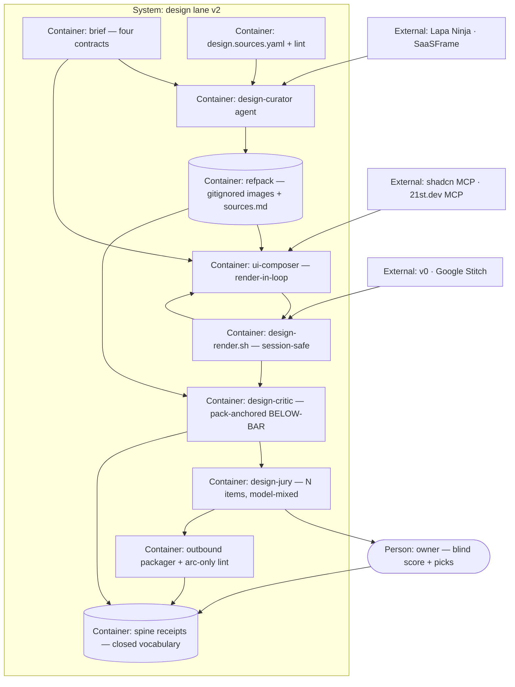

# PLAN.md — design v2 · "Eyes, Taste, Rivals"

> Lane: `design` · Cycle 16 · opened 2026-08-23. ADR century **1400–1499**.
> Design source: [`docs/strategy/plans/PLAN-design-v2.md`](../../docs/strategy/plans/PLAN-design-v2.md)
> — its §3 (DSV-A…L) and §10 rejected registry are **LOCKED**; this plan implements them and is
> the thing to attack. [`PLAN-design.md`](../../docs/strategy/plans/PLAN-design.md) (v1) Part 4
> stays LOCKED and inherited. Cycle 3's history: [`HISTORY-INDEX.md`](HISTORY-INDEX.md).

## Goal

Give arc's design lane eyes, taste and a real bar: the composer renders and reviews its own work
before anyone else sees it, every brief carries a curated pack of real reference screens that the
critic measures against, and rival AI drafts compete unlabelled in the same blind jury — so that
"is this actually good" stops being an opinion and becomes a receipt.

## Current state

Verified against this worktree on 2026-08-23 — read directly, not taken from a report.

- **Stack:** POSIX shell runners under `.claude/scripts/design/` · Node ESM lints · Markdown
  agent contracts under `.claude/agents/` · agent-browser CLI as the render muscle · rendered
  PNG+JSON receipts under gitignored `.claude/state/design/`.
- **Entry points:** `design-render.sh` (deterministic capture) · `design-critique.sh`
  (begin/finish, emits `review.completed {lens:design}` and stamps the ledger on PASS only) ·
  `design-explore.sh` (init/check/render/status; enforces per-variant `thesis.txt`,
  `index.html`, `tokens.css`; IA-diff ≥3/7 and art-diff ≥3/4 gates) · `design-lint.mjs` (506
  lines, declare-anchored, warn-tier) · `design-gate.sh` · `critic-scope-check.sh`.
- **Conventions:** agents judge, scripts measure ([ADR-0048](../../docs/adr/0048-agents-judge-scripts-measure.md)).
  PASS ≡ zero VIOLATION + zero BELOW-BAR. Briefs carry four contracts (interaction · art
  direction · platform · content), template at `docs/templates/design-brief-template.md`.
  Explore artifacts live at `docs/design/explore/ID/` with `variant-a`, `variant-b`, `variant-c`, `matrix.md`,
  `ranking-{1,2,3}.md`. Spine vocabulary is CLOSED — this cycle adds **zero** new kinds.
- **Do-not-touch:** `docs/archive/**` and `docs/evidence/**` are frozen pre-portfolio history
  ([ADR-0058](../../docs/adr/0058-port-i-history-link-never-copy.md)) — link, never copy.
  **`initiatives/model-policy/evidence/phase-02/` is another lane's SEALED bundle** (it carries
  `SEALED-key.md`); EXP-A1 reuses its harness and writes **only** to
  `initiatives/design/evidence/phase-04/`. Writing into a sealed bundle has already sent one
  TAMPERED in this repo. `PIN_FONT=0` stays default — typography is judged as designed.
- **Shared-organ risk — the `face` lane is LIVE and reads these contracts.**
  `.claude/agents/{ui-composer,design-jury,design-critic}.md` are not lane-scoped, and face's
  Phase 01 human gate (ADR-1308, "art direction by blind exploration") depends on them while
  this cycle rewrites all three — the Bash grant and read allowlist in Phase 01, the FOUR→N
  rewrite and high-judgment seat in Phase 03, the pack hand-off to the critic in Phase 03.
  Every one of those edits runs the shared-file protocol AND sends face a cross-lane note
  before it lands. Two shared-file collisions are already on record in `lanes.md`.

Three prerequisite claims in the design source were checked and are **stale or wrong**:

| Claim in the source | Verified reality |
|---|---|
| "Owner merges PR #61 in parallel" | **Already merged 2026-07-29** — no owner action outstanding |
| DSV-B: composer already has the critic's scoped-Bash pattern | `ui-composer` has `tools: Read, Glob, Grep, Write` — **no Bash at all**; the critic's grant is for `arc-event.sh`, not the renderer |
| v0's API is beta and versions drift | v0 Platform API reached **GA 2026-08-05** |

Two collisions found in the tree that the source did not know about, both now carrying an ADR:
the **stale-duplicate guard deletes the self-review loop's key signal**
([ADR-1417](../../docs/adr/1417-the-stale-duplicate-guard-must-tell-iteration-from-stale-page.md)),
and the **composer's iron law 1 forbids reading the pack and its own render**
([ADR-1415](../../docs/adr/1415-the-composer-iron-law-gains-a-read-path-allowlist.md)).

## Success requirements

<!-- 10 active rows = M-tier cap. Source REQ-03+REQ-04 merged into REQ-03 (declared-surface
     fidelity) and source REQ-06+REQ-07 merged into REQ-05 (taste loop), because the source's
     REQ-09 spans three phases and every REQ must map to exactly one. Mapping is stated so the
     merge is traceable to the source table rather than silent. -->

| REQ | User outcome | Measurable acceptance | Phase | Status |
|---|---|---|---|---|
| REQ-01 | Two renders never collide, and iteration history survives | 3 concurrent renders → 3 correct route/hash pairs; `--session` omitted in explore mode refuses with exit 1; same route hashes identically ×3 on one platform; a meta with no `session` field refuses | 00 | active |
| REQ-02 | The composer sees its own work before anyone else judges it | ≥1 self-caught defect visibly fixed across `self-review/iter-N/` receipts on a real run — **or** every iteration past the first records `unchanged: true` and the owner signs off that iteration 1 already cleared the bar; a 4th iteration refuses; a no-op records `unchanged: true` instead of being deleted | 01 | active |
| REQ-03 | Every surface the brief declares is rendered and correctly classified | A declared-but-unrendered surface blocks PASS; a planted docs-on-canvas page returns ERR; a product page containing the word "Reference" passes; an unmarked surface fails closed | 01 | active |
| REQ-04 | Briefs carry real reference screens, and the repo carries only facts about them | `design.sources.yaml` lint exits 0; a pack of 5–8 screens with `sources.md` provenance from ≥2 `active` sources; a PNG planted in the refpack dir is proven ignored by `git check-ignore`; a `status: off` source is never fetched | 02 | active |
| REQ-05 | The jury judges craft against a real bar, and the owner's score is comparable across runs | An N-item run completes with 0 logged prompt deviations; every BELOW-BAR finding cites ≥1 pack screen; owner 0–100 blind score recorded as a receipt before unblinding | 03 | active |
| REQ-06 | The composer-tier question is settled by evidence, not argument | Paired same-commit run receipts + a formula decision ADR; the sealed prediction of [ADR-1416](../../docs/adr/1416-the-exp-a1-prediction-is-session-authored-on-the-owners-delegation.md) settled hit or miss, in writing | 04 | active |
| REQ-07 | Reference packs come from live sources, and the run says which ones answered | A pack built from ≥2 live sources, each with a per-run `availability` line; a source whose `status` is `off` produces no fetch; a robots.txt `Disallow` produces a recorded refusal, never a silent skip | 05 | active |
| REQ-08 | A rival's contract is known before any code depends on it | A spike receipt carrying provider version + request + output schema exists **before** any adapter file is committed; terms clearance for that provider recorded as `decision.recorded` | 06 | active |
| REQ-09 | Rival drafts compete on equal terms in one blind jury | One blind jury over arc×3 + ≥1 rival + 1 reference item, all rendered by arc's own renderer; rival-beats-all-arc rate recorded on the spine whichever way it lands | 07 | active |
| REQ-10 | Nothing leaves the repo carrying someone else's authorship | The packager refuses a planted rival render and a planted gallery image; a render with absent provenance fails closed; a manually dropped file appears attributed in the next pack | 08 | active |

## Appetite

**12.5 days effort** — the honest sum of the nine phase appetites below.

This number moved twice, both times upward, and both times because arithmetic beat intent. The
design source filed **10d** while its own phase table summed to **11d**; the owner ruled on
2026-08-23 to take that honest sum. The attack panel then found work the 11d could not absorb:
the renderer's output path is keyed on route alone, so Phase 00 must re-scope it before any
iteration receipts can exist (+0.5d), and the two-surface adversarial pass this plan makes
non-negotiable was budgeted in four phases but missing from Phase 03 and Phase 07, the two that
ship the highest-stakes gates (+0.5d each). An appetite that omits a mandatory pass is fiction,
which is the same defect this kickoff caught in its own source. **The 12.5d needs the owner's
nod at approval; 11d is still available by cutting, never by silently overrunning.**

**Tier:** M

**Kill criteria:**
- **50% tripwire** — Phase 00 + Phase 01 not green by end of day 3 → stop and reassess the
  renderer approach before any taste work begins.
- **Taste tripwire** — Phase 03 **re-measures** the plain-prompt control on the same brief, the
  same N-item count and the same model-mixed panel before comparing. The `~40/100` figure is
  carried forward from prose and has no measurement behind it — the 2026-07-30 plain-prompt
  baseline on record contains no score — so it is re-derived, never assumed. If the freshly
  measured controlled owner score does not beat the freshly measured plain-prompt bar after one
  re-run → **STOP before Phases 05–07**. No rival spend on a loop that
  has not beaten the baseline it was built to beat. This is a scope-cut conversation, not a
  silent extension.
- Standing arc law: any VIOLATION-class regression in the Cycle 3 gates this cycle touches is
  fixed before proceeding, never waived.

## Architecture (C4 concepts, Mermaid flowchart)

## Key decisions (ADR index)

| # | Decision | Status |
|---|---|---|
| 1400 | DSV-A — the composer seat changes only through EXP-A1, never by fiat | accepted |
| 1401 | DSV-B — the composer sees its own work: render-in-loop, ≤3 iterations, immutable receipts | accepted |
| 1402 | DSV-C — the renderer is session-safe before anything runs in parallel | accepted |
| 1403 | DSV-D — the viewport set derives from the brief's platform contract | accepted |
| 1404 | DSV-E — reference packs cache images locally, commit provenance, teach principles | accepted |
| 1405 | DSV-F — the jury ranks craft first, over N items, on a model-mixed panel | accepted |
| 1406 | DSV-G — BELOW-BAR is anchored to the reference pack | accepted |
| 1407 | DSV-H — product canvas vs documentation is decided by markers, never text-match | accepted |
| 1408 | DSV-I — one source registry, owner-born, lint-guarded, future-proof | accepted |
| 1409 | DSV-J — rivals are evidence, arrive by spike-then-integrate, and never merge | accepted |
| 1410 | DSV-K — outbound blind packages carry arc-authored renders only | accepted |
| 1411 | DSV-L — calibration is controlled, or it is theatre | accepted |
| 1412 | Gallery eligibility is decided by robots.txt and terms, not by gallery quality | accepted |
| 1413 | A rival is not called until its terms clear, and that check gates the spike | accepted |
| 1414 | The curator sits at balanced-workhorse; one juror moves to high-judgment | accepted |
| 1415 | The composer's iron law gains an explicit read-path allowlist | accepted |
| 1416 | The EXP-A1 prediction is session-authored on the owner's delegation, and says so | accepted |
| 1417 | The stale-duplicate guard must tell an iteration from a stale page | accepted |

## Non-negotiables

- **Look at the artifact before carrying its verdict.** No ranking, score, receipt or package
  is produced from a report about pixels that nobody in the session opened.
- **Zero new spine event kinds.** This cycle rides `review.completed {lens:design}`,
  `decision.recorded` and `note.logged` only.
- **Agents judge, scripts measure — ADR-0048.** A gate never asks an agent for a number it
  can compute.
- **Every new gate, lint and parser gets a two-surface adversarial pass by fresh agents that
  did not write it** — one on decision logic, one on the shell/OS boundary — and that pass runs
  against the PR THAT SHIPS THE GATE, never batched into the phase-close PR that comes after
  all of them. The attacker prompt carries this lane's running list of already-fixed defects.
- **A test that passes proves the assertion held, not that the code ran.** Every gate ships with
  a negative control that actually fails.
- **No reference image, rival draft or third-party screenshot is ever committed to git or
  placed in an outbound package.**
- **A `model:` frontmatter change is a governed tier change** citing ADR-0069 in a reviewed
  diff, never a quiet edit.
- **Shared organs are edited under the shared-file protocol.** Agent contracts under
  `.claude/agents/`, `.mcp.json`, `hq.policy.yaml` and `tests/**` belong to no lane:
  `git log origin/main -5` on the file runs BEFORE the edit, the stronger version is taken at
  merge, and a change to a contract another LIVE lane reads gets a cross-lane note first.
- **Closing a phase moves the lane's bookkeeping in the same commit as the merge, or the one
  right after it.** PROGRESS.md's row, its `## Now`, and `docs/HISTORY.md` move together — a
  lane whose HISTORY says CLOSED while PROGRESS still says LIVE is a failure, not a follow-up.
- **Tests are green on CI, per JOB, at the branch head SHA** — never on this box.

## No-gos (explicitly out of scope)

- Permanently re-seating the composer by decision rather than through EXP-A1.
- Browser-tier tools (Uizard, Visily, UX Pilot, Banani, Magic Patterns, Readdy) as pipeline
  stages — a manual-drop door is the only surface they get this cycle.
- Committing reference images, or any softening of REQ-01 / [ADR-0040](../../docs/adr/0040-des-h-req01-two-external-evidence-streams.md)'s two-stream blind bar.
- A design evals suite (stays W3+ per the DES-G lineage).
- Refero, and Mobbin, until the owner elects to pay for a login source.
- Any new spine event kind. Any per-lane copy of a company organ.
- Fetching any source whose `status` is `off`, or whose robots.txt disallows us.
- Merging, copying or shipping a rival's draft as arc's work.

## Rabbit holes

- **Making the renderer cross-OS hash-identical.** `PIN_FONT=0` makes that impossible by
  construction. Detour: per-platform internal stability is the contract, stated as such.
- **Rebuilding the #57 stable-shutter guard.** It is already in tree. Detour: Phase 00
  *re-proves* it on this platform and moves on.
- **Automating the pretty galleries.** Godly, Land-book, Dribbble and Behance are the visually
  richest and are all blocked ([ADR-1412](../../docs/adr/1412-gallery-eligibility-is-decided-by-robots-and-terms-not-by-taste.md)).
  Detour: ship on the two that are open, and treat a third as a bonus, never a dependency.
- **Chasing v0's terms to a definitive answer.** Detour: route it to the owner as a decision
  with the clause quoted; do not attempt a legal conclusion in-lane.
- **Perfecting the doc-surface marker vocabulary.** Detour: two markers, fail closed on
  unmarked, and let the first real explore tell us what is missing.
- **Growing the jury panel to chase agreement.** ADR-0070 already measured owner-vs-jury
  inversion; more jurors will not resolve it. Detour: the owner's controlled score is the
  anchor, and the panel is evidence beside it.

## Assumptions ledger

| Assumption | How we'd know it's wrong (trigger) | Phase that tests it |
|---|---|---|
| Lapa Ninja and SaaSFrame stay fetchable, giving REQ-04 its two sources | The curator's robots.txt preflight returns `Disallow`, or either host returns non-200, on a real pack build — REQ-04's "≥2 sources" is then unmeetable with zero margin | 02 |
| A meta written without a `session` field refuses, rather than falling through to the old route-only comparison | The Phase 00 negative control feeding a session-less meta exits 0 instead of refusing — [ADR-1417](../../docs/adr/1417-the-stale-duplicate-guard-must-tell-iteration-from-stale-page.md) has then silently reverted in code while reading as correct | 00 |
| The composer's read allowlist admits its own render and the pack, and nothing else | The Phase 01 negative control — a composer reading a *sibling* variant's render — returns content instead of being refused | 01 |
| Stitch's exported HTML is self-contained enough to render deterministically offline | The same fixture rendered with the network blocked produces a different hash than with it open, i.e. the file depends on a CDN | 06 |
| v0's and Stitch's terms permit an internal, unpublished comparison | The owner rules against it, or a provider answers denying permission — that rival leaves the jury rather than gaining a workaround | 06 |
| ≤3 self-review iterations is enough for the composer to catch a real defect | Three full explores complete with a self-review catch rate of 0 — the loop is then buying captures and nothing else | 03 |
| A model-mixed panel ranks differently than a homogeneous one | Across 3 runs the mixed panel's ranking is identical to the homogeneous panel's every time — the mix is then cost without signal | 03 |

## External dependencies

| Dep | Interface | Fake impl | Real impl | Contract test |
|---|---|---|---|---|
| Lapa Ninja | `fetch_reference(source_id, query) → [{url, bytes, sha}]` | Fixture HTML + 2 PNGs on disk | HTTP fetch behind a robots.txt preflight | Phase 02 against fake; Phase 05 against live — provenance fields present, `Disallow` refuses |
| SaaSFrame | same interface | same fixture shape | HTTP fetch behind the same preflight | as above |
| shadcn MCP | `components_lookup(name) → source` | Recorded response fixture | Installed MCP server | Phase 05 — a lookup returns source, absence returns a named error |
| 21st.dev MCP | `components_search(q) → source` (search only; `generate` is credit-gated and out of scope this cycle) | Recorded response fixture | Hosted MCP `https://21st.dev/api/mcp`, `x-api-key` header; `credential_ref` maps arc's secret name to the upstream one | Phase 05 — search returns source; a missing key returns a named error, never an empty result |
| v0 (Vercel) | `rival_draft(brief) → {files[], version}` | Recorded chat response fixture | `v0-sdk@0.16.7` (registry-verified) or raw HTTPS; `V0_API_KEY` | Phase 06 spike — version + request + output schema receipted; **gated by [ADR-1413](../../docs/adr/1413-a-rival-is-not-called-until-its-terms-clear.md)** |
| engine lane driver/adapter pattern (ADR-0200..0206) | The contract SHAPE a rival adapter must follow — no runtime call into engine | n/a — pattern only | Phase 07 rival adapters implement it directly | Phase 07 — adapter reviewed against ADR-0200..0206 before merge; no new pattern class introduced |
| Google Stitch | `rival_draft(brief) → {html, version}` | Recorded screen fixture | `@google/stitch-sdk@0.3.5` (registry-verified); `STITCH_API_KEY` | Phase 06 spike — as above, plus the offline-render self-containment check |

## Pre-mortem (Klein)

| # | Failure cause | Mitigation or accepted |
|---|---|---|
| 1 | The whole cycle runs on pixels nobody opens, and the owner scores it low again — the lane's 2026-07-30 retro row, verbatim | REQ-05 makes the owner's blind score a phase gate, not a follow-up; non-negotiable 1 forbids carrying a verdict about an artifact nobody opened. Phase 03 cannot close without that receipt |
| 2 | A guard added for measurement destroys the thing measured — the Arial-pin failure of 2026-07-30, recurring as [ADR-1417](../../docs/adr/1417-the-stale-duplicate-guard-must-tell-iteration-from-stale-page.md)'s duplicate guard eating the self-review signal | Phase 00 makes `(route, session)` the discriminator and ships a session-less-meta negative control; assumption row 2 carries the wrong-line-of-code trigger |
| 3 | A required input has no legitimate path to the agent that needs it — the 2026-07-30 `matrix.md` failure, recurring because REQ-02 and REQ-04 both hand the composer files its iron law forbids | [ADR-1415](../../docs/adr/1415-the-composer-iron-law-gains-a-read-path-allowlist.md) amends the law by enumeration before Phase 01 builds on it; the sibling-render negative control proves the allowlist did not over-open |
| 4 | New gates ship with holes their own tests pass — 77 holes across five phases in Cycle 6, and the author's own 26 breaking inputs finding 0. The nearest miss here is REQ-09's blind jury, where a filename or markup fingerprint leaks authorship and the rival-beats-all-arc rate becomes a receipt for a broken blind | Non-negotiable 4 covers **every** gate this cycle ships — REQ-03, REQ-04, REQ-06, REQ-07, REQ-09 and REQ-10, not a named subset — and binds each pass to the PR that ships that gate. Phase 07's blinding gets decision-logic and file-naming/ordering as its two surfaces |
| 5 | Goodhart round 2 — the composer learns to please the jury and the score rises while the work does not | Packs rotate per brief, rivals differ per run, a plain-prompt control enters every 3rd run ([ADR-1411](../../docs/adr/1411-dsv-l-calibration-is-controlled-or-it-is-theatre.md)), and the owner's controlled score stays the human anchor |

## Phases (risk-ordered)

Phase 00 is the steel thread: the renderer proves it is session-safe and iteration-safe end to
end, against fakes only, before anything composes in parallel. Every phase lands independently
— feat branch → PR → owner merges.

| Phase | Appetite | Delivers | Depends on |
|---|---|---|---|
| [00 — renderer proof + isolation](phases/phase-00-spec.md) | 1.5d | REQ-01 | none |
| [01 — eyes + viewports + canvas gate](phases/phase-01-spec.md) | 1.5d | REQ-02, REQ-03 | phase-00 |
| [02 — registry + curator](phases/phase-02-spec.md) | 1.5d | REQ-04 | phase-00 |
| [03 — taste loop](phases/phase-03-spec.md) | 2d | REQ-05 | phase-01, phase-02 |
| [04 — EXP-A1](phases/phase-04-spec.md) | 0.5d | REQ-06 | phase-03 |
| [05 — live sources](phases/phase-05-spec.md) | 1.5d | REQ-07 | phase-02, phase-03 |
| [06 — rival spike](phases/phase-06-spec.md) | 1d | REQ-08 | phase-05 |
| [07 — rival integration](phases/phase-07-spec.md) | 2d | REQ-09 | phase-06 |
| [08 — governance + retro](phases/phase-08-spec.md) | 1d | REQ-10 | phase-07 |

Total: **12.5d** — matches the appetite exactly. Zero calendar slack is a deliberate, recorded
choice: the taste tripwire above is the release valve, and it cuts Phases 05–07 on evidence
rather than on optimism.
