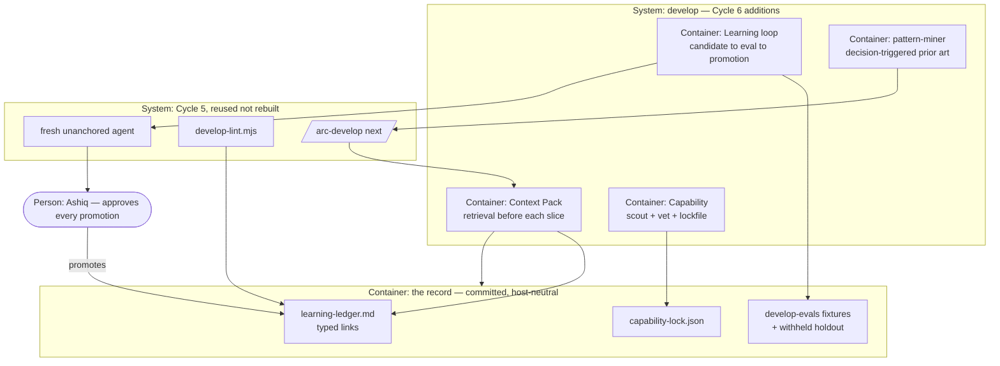

# PLAN.md — arc `develop` · Cycle 6: the intelligence layers

> Cycle 5 shipped delivery-order layers 1 and 2 of `docs/strategy/plans/PLAN-develop.md` and is
> archived at `archive/PLAN-cycle5-2026-08-02.md`.
>
> **This cycle does NOT finish the design source, and the first draft of this line claimed it did.**
> An attack pass found the claim false. What this cycle finishes: **layer 3 in full, layer 4 except
> design-critic checkpoints, and the promotion-loop half of layer 5.** What remains open, with no
> REQ and no phase here: layer 5's **suggestion engine**, **calibration record**, **outcome metrics**
> (escaped spec misses · rework/stuck time · time to first proven slice · false-block rate · evidence
> completeness · ceremony cost per validated slice) and the **tag vocabulary**
> (`pattern`/`anti-pattern`/`library-verdict`/`fix-recipe`/`common-mistake`), plus layer 4's
> **design-critic checkpoints**. Phase 04 deferred them to Phase 07 and Phase 07 deferred them back
> — nobody owned them, which is how a gap becomes invisible.
>
> **That remainder is a Cycle 7, and it is the owner's call whether to fund it now or after this
> cycle proves itself.** Stating it here is the point: a plan that quietly ships 80% while claiming
> 100% is the failure this product exists to prevent.
>
> Owner decision, 2026-08-02: build the plan out rather than wait for dogfood evidence to select
> the next layer. The design source's Feature Admission Rule (§2 rule 5) says post-v1 features
> enter via the promotion loop with evidence; **that rule is explicitly set aside for this cycle**
> — the plan was fully adjudicated over four review rounds and the owner has chosen to complete it.
> It resumes once these layers are in.

## Goal

Finish The Developer: an execution harness that not only runs a phase with discipline, but
**retrieves the right context before each slice, acquires capabilities it lacks, mines decisions
for prior art, and learns from its own escaped defects** — so the next phase is measurably better
run than the last, from a record rather than from memory.

## Current state

- **Stack:** arc. Node 18+, bash-3.2 safe, zero external deps in core. CI is a 19-job
  ubuntu/macos/windows matrix; `product-lint` runs directly, everything else through bats.
- **Entry points:** `.claude/scripts/develop/` holds `develop.mjs` (the five lifecycle modes),
  `ledger.mjs` (ADR-0100 grammar: writer + tolerant parser), `develop-lint.mjs` (3 structural
  BLOCKs + 2 WARN-first groups), `stuck.mjs` (fingerprint + attempt backstops).
  `.claude/commands/arc-develop.md` is the prompt wrapper; `products/develop/manifest.json`
  declares the product; `.claude/agents/spec-fidelity.md` is its only agent.
- **Conventions:** lane resolution is IMPORTED from `core/lane-resolve.mjs`, never re-implemented.
  Gates ship WARN-first and promote via `docs/trial-ledger.md`. Every gate ships a negative
  control proving it can fail. Receipt kinds are a closed vocabulary — 22 now, ADR-0026 as
  extended by ADR-0106 and ADR-0107; a new kind needs a new ADR. ADR numbers are banded one
  century per lane and `kickoff-lint`'s `[adr-dup]` FAILs on a collision. Editing any
  product-shipped file means regenerating `tests/fixtures/sync-golden/tree-manifest.txt` as a
  named step.
- **Hot / high blast radius:** `ledger.mjs` — 7 of Cycle 5's 9 adversarial holes were in its
  parser, and every consumer reads through it. `lane-resolve.*` twins. `validate.mjs` (the spine's
  closed vocabulary).
- **Do-not-touch:** `docs/adr/`, `docs/retro-log.md`, `docs/trial-ledger.md`, `tests/` are root
  organs, never per-lane (ADR-0053). `docs/evidence/**` and `docs/archive/**` are frozen.
- **Absent today:** no learning ledger, no eval fixtures, no capability scout or lockfile, no
  pattern miner. The Context Pack is a grep-based blast radius and an ADR-number list — nothing
  more. Those four absences are this cycle.

## Success requirements

| REQ | User outcome | Measurable acceptance | Phase | Status |
|---|---|---|---|---|
| REQ-01 | A failure that escaped once is written down in a form the next phase can actually find | `docs/develop/learning-ledger.md` exists with a machine-checked row shape: what failed · why the process missed it · proposed prevention · type · cost · verdict, plus typed links `area:` `adr:` `rule:` `fixture:` `phase:`; `develop-lint` FAILs an unparseable row and WARNs a row with zero links | 04 | active |
| REQ-02 | A proposed safeguard is judged by whether it catches real past failures, not by whether it sounds right | `tests/fixtures/develop-evals/` holds ≥12 replay fixtures categorised spec-drift / false-confidence / missing-edge-case / bad-gate / flailing, each carrying typed links; for `type: rule` and `type: fixture` candidates replay EXECUTES the candidate against each fixture and computes catch-count and false-block count; for `checklist` / `template` / `skill` / `capability-policy` candidates — which are not executable — replay means the fresh agent applies the candidate's stated procedure to each fixture and records caught / missed / false-blocked per fixture, never a summary number it invents | 04 | active |
| REQ-03 | I decide what gets promoted, and the thing proposing it never grades its own work | promotion needs 3 recorded inputs: fixture replay results, a verdict from a fresh agent that receives only the candidate + results, and my approval; `develop-lint` FAILs a `promoted` row missing any of the three — and checks **structural presence only**. It cannot tell a real fresh-agent verdict from the same string typed by the authoring session, so authenticity is mine to check by reading the transcript before writing `approved-by:`. Stated here rather than left implied by a passing gate | 04 | active |
| REQ-04 | A learning cannot be graded on the cases it was written from | `tests/fixtures/develop-evals/withheld/` is excluded from candidate-authoring context and a lint FAILs if a candidate row cites a withheld fixture id; the holdout's own contents are never printed by any command | 04 | active |
| REQ-05 | Before I build a slice, the harness hands me what past work already knows about it | `/arc-develop next` prints a Context Pack: code-graph neighbourhood of the slice's files (grep fallback, stated which ran), matching ADRs, tagged learning-ledger and retro-log hits, and the 3 highest-churn files in the blast radius computed from `git log` | 05 | active |
| REQ-06 | Retrieval follows the trail one step, so an auth slice pulls what past auth failures produced | a learning row's typed links are followed exactly one hop and the resulting ADRs, rules and fixtures appear in the pack; every retrieval source is recorded in the slice's `sources:` field | 05 | active |
| REQ-07 | The harness can find a tool it lacks without me hunting for it | `/arc-capability` given a stated need returns a proposal table — need · candidate · source · quality evidence · verdict — and refuses to install anything | 06 | active |
| REQ-08 | Nothing enters this repo from the internet without being pinned and inspected | `capability-vet.sh` BLOCKs unless the candidate is allowlisted, version-pinned with a hash and provenance in `capability-lock.json`, and passes a content scan for exfil patterns, curl-pipe-sh and undeclared tool scopes; a write-capable MCP additionally requires my recorded OK | 06 | active |
| REQ-09 | A real product decision gets prior art, not the model's first instinct | `pattern-miner` runs only on a declared decision, max 3 in parallel, and returns a ≤20-line Pattern Annex where every row carries a source and an adopted-or-rejected verdict; a row without a verdict is lint-invalid | 07 | active |
| REQ-10 | A risky slice gets alternatives weighed before code, not after | a risk-glob slice requires 2–3 approach sketches with approach · trade-offs · blast radius · economics (maintenance in words, deps/services/config as computed counts, deletion opportunity); invented durations are lint-rejected | 07 | active |

## Appetite

**5 days total** (owner-set, 2026-08-02), of which the phase table allocates **4.0**
(1.5 + 1.0 + 0.75 + 0.75). The remaining **1.0 day is unallocated buffer** — it belongs to no phase
and no kill criterion counts it, which also means the 3.0-day checkpoint sits at 75% of the real
phase budget rather than the 60% the "5 days" framing suggests. A constraint, not an estimate.
Cycle 5 spent 1.9 of 5 on layers 1-2; this cycle is larger in surface but builds on a working spine.

**Tier:** M

**Kill criteria:** at 3.0 days burned, if Phase 05 is not done → mandatory scope-cut conversation,
and the pre-decided cut is Phase 07 in full (pattern mining and approach sketches are the most
deferrable — they improve decisions, while 04 and 05 are what make the harness learn and retrieve).
At 100% → cut or kill, never extend. Per-phase tripwires live in each phase spec.

## Architecture (C4 concepts, Mermaid flowchart)

## Key decisions (ADR index)

| # | Decision | Status |
|---|---|---|
| 0108 | Learning candidates are evaluated by a fresh agent that never sees the author's reasoning | accepted |
| 0109 | The holdout is process-enforced, not cryptographic — exclusion + unanchored eval + time-forward measurement | accepted |
| 0110 | Capability vetting BLOCKs on provenance, not on popularity | accepted |
| 0111 | The Context Pack follows typed links exactly one hop, and records every source it used | accepted |

## Non-negotiables

- The main session writes the code — develop supplies context, discipline, checkpoints and evidence; there is no coder subagent, ever.
- develop never modifies its own policies, gates, skills or capabilities without a recorded, Ashiq-approved promotion — this cycle builds the promotion machinery and is bound by it.
- Nothing is installed from the internet without a pinned version, a hash, recorded provenance and a content scan; a write-capable capability additionally needs Ashiq's recorded OK.
- A learning candidate is never graded by the context that authored it.
- Every number is computed by a tool or earned from a scored outcome — a self-declared score in any ledger row is a lint finding.
- Any gate, lint or parser this cycle ships gets an adversarial construct-a-breaking-input pass run by a FRESH agent that has not seen the implementation, with every hole pinned as a fixture.
- Every retrieval states which source it actually used, including when it fell back to grep.

## No-gos (explicitly out of scope)

- **A graph database or any new memory store.** Typed link fields on existing committed records, followed one hop. The design source rejected a second engineering-memory store outright.
- **Automated promotion.** The loop proposes and evaluates; a human promotes. No count, no score and no clean-run streak promotes anything on its own.
- **Autonomous capability installation.** The scout proposes and the vet gate blocks; installing is a separate, human act.
- **Ambient research.** `pattern-miner` runs on a declared decision or not at all — no trend scanning, no background crawling.
- **Cross-platform dependency-version replay matrices.** The design source marks these an L-tier option; this is M.
- **Rebuilding anything Cycle 5 shipped.** The lifecycle, ledger grammar, lint floor and stuck protocol are consumed as-is.

## Rabbit holes

- **Making the eval suite exhaustive.** 43 council holes exist; ≥12 fixtures that cover the five
  categories is the bar. Converting all 43 is a research project, and the design source says the
  first batch covers what the records preserve in reproducible detail.
- **A scoring model for candidate quality.** Catch-count and false-block count, both computed.
  No weighted index, no composite score — that is the invented-number trap this product bans.
- **Perfecting the churn ranking.** `git log` frequency over the blast radius, top 3. Not a
  hotspot model.
- **Teaching `pattern-miner` to browse.** Primary documentation, then engineering blogs of the
  products studied. A row without a source and a verdict does not enter the annex.
- **Building a capability registry client.** The scout reads what the ecosystems publish and
  writes a proposal table; it is not a package manager.

## Assumptions ledger

| Assumption | How we'd know it's wrong (trigger) | Phase that tests it |
|---|---|---|
| Council v2/v3 records preserve enough detail to rebuild ≥12 failures as replay fixtures | fewer than 12 can be reconstructed without inventing the failing input | 04 |
| A fresh agent given only a candidate plus fixture results can judge it without the author's reasoning | its verdict asks for the reasoning, or it grades a candidate it cannot see the effect of | 04 |
| One hop of link-following is enough to be useful without flooding the pack | a Phase-05 slice needs a fact that sits exactly two hops away, repeatedly | 05 |
| `git log` churn over the blast radius identifies files worth naming | the top-3 churn files are the same three on every slice regardless of what it touches | 05 |
| The skills and MCP ecosystems expose enough metadata to vet a candidate without installing it | a real candidate cannot be version-pinned or hashed from published data alone | 06 |

## External dependencies

<!-- TWO external dependencies this cycle acquires: the code graph, and the package registries
     Phase 06 fetches real hashes and provenance from. The second was missing from this table
     while a Phase 06 exit criterion demanded "actual published version, actual hash" — a live
     network call the plan was denying it made. Everything else (git, node, bash) is local. -->

| Dep | Interface | Fake impl | Real impl | Contract test |
|---|---|---|---|---|
| code graph (codegraph / Graphify) | `neighbourhood(files) -> related symbols + files` in `.claude/scripts/develop/context-pack.mjs` | grep + glob over the repo, always available, and the pack states it fell back | `codegraph explore` when `.codegraph/` exists | `tests/develop-context.bats` — the same neighbourhood contract from both paths on a committed fixture |
| package registry (npm `dist.integrity` · PyPI `digests.sha256` · OCI digest) | `fetchMeta(candidate) -> {version, hash, publisherAuth, buildAttestation}` in `.claude/scripts/develop/capability-vet.sh` | committed tarball + manifest fixtures, no network — this is what CI runs on all 3 legs | `npm pack` / PyPI JSON API / OCI digest lookup, run BY HAND once, never in CI | `tests/develop-capability.bats` — the same hash + provenance contract from the fixture, and the one real fetch is committed as a `capability-lock.json` row rather than re-fetched |

## Pre-mortem (Klein)

| # | Failure cause | Mitigation or accepted |
|---|---|---|
| 1 | The learning ledger fills with rows nobody reads, and "we wrote it down" replaces "it changed something" — the design source names this exactly ("we had a retro" is not a record) | **Mitigated:** REQ-01 makes rows machine-checked and REQ-05 makes the Context Pack *consume* them, so a row that is never retrieved is visibly dead weight; a row with zero typed links WARNs by REQ-01 |
| 2 | The eval suite is written from the same understanding that built the gates, so candidates pass by construction — Cycle 5's exact failure, where 26 author-written attacks found 0 holes and a fresh agent found 9 | **Mitigated:** the non-negotiable now requires a FRESH agent for every adversarial pass, and REQ-03 requires the candidate verdict to come from an agent that receives only the candidate and its results |
| 3 | The capability vet gate blocks nothing real because provenance data is thinner than assumed, and it becomes a rubber stamp that reads as safety (REQ-08) | **Mitigated:** assumption ledger row 5 tests exactly this in Phase 06; if a real candidate cannot be pinned and hashed from published data, the gate stays BLOCK and the capability is refused rather than the gate weakened |
| 4 | Context Pack retrieval floods every slice with plausible-but-irrelevant context, and the cost lands on every slice while the benefit lands on few (REQ-05, the process-tax risk the design source ranks first) | **Mitigated:** one hop only (ADR-0111), top-3 churn, and every source recorded in `sources:` so an unused source is visible; Phase 07 is the pre-decided cut if burn runs hot |
| 5 | Two extensions of the closed spine vocabulary already happened in one cycle; this cycle adds more surfaces and quietly needs more kinds, and ADR-0107's own trigger is ignored | **Accepted with a rule:** ADR-0107 set the next trigger at a fifth develop kind, where the answer is one `develop.*` kind with a typed payload — not a sixth ADR. If this cycle needs a kind, that collapse happens instead |

## Phases (risk-ordered)

| Phase | Capability | Appetite | Status |
|---|---|---|---|
| 00 | Steel thread — **parked, shipped in Cycle 5.** The lifecycle, ledger grammar, lint floor and stuck protocol this cycle builds on; its appetite belongs to that cycle, not this one | — | ✅ done 2026-08-02 |
| 04 | The Learning System — ledger with typed links, eval fixtures, withheld holdout, and a promotion loop no machine can complete alone | 1.5 days | pending |
| 05 | Context Pack — code-graph neighbourhood with a stated grep fallback, churn, tagged hits, one-hop link following | 1.0 days | pending |
| 06 | Capability acquisition — scout, vet gate that BLOCKs on provenance, and a pinned lockfile | 0.75 days | pending |
| 07 | Quality intelligence — decision-triggered pattern mining and risk-triggered approach sketches with economics | 0.75 days | pending |

Phase 04 comes first because everything downstream reads what it defines: the Context Pack
retrieves learning rows (05), and the promotion loop is what any later safeguard must pass through.
Building retrieval before there is anything worth retrieving would be building the pipe first.
