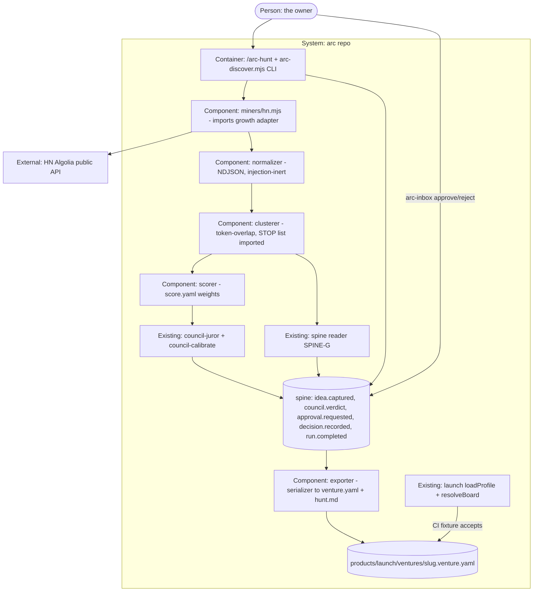

# PLAN.md — discover v2: the idea engine, first link of the money chain (lane `discover`, Cycle 1)

Cut on 2026-10-06 from the owner-approved design source `docs/strategy/plans/PLAN-discover.md` (v2). Attack
findings mutate THIS file, never the design source. Decisions DIS-A..I are locked and recorded as ADR-1901..1909.
The trigger is `launch` Phase 02 exit plus the owner ruling of 2026-10-03, *"ippo idea illa"* (no Nilluvai). The
owner fired it early on 2026-10-06 by pasting this kickoff while launch was on Phase 01 (ADR-1900). That ruling goes
on the spine as `decision.recorded` in Phase 00, and every 19xx ADR cites the receipt id.

## Goal

One sentence: **`/arc-hunt {niche}` turns raw complaint streams into a scored, evidenced, deduped shortlist that
council judges and the owner approves, and an approved idea leaves as a `venture.yaml` that launch's own
`loadProfile()` accepts with zero hand edits.** It is for the owner. Today "what to build next" is vibes, and the
venture factory (`launch`) has no input source at all.

## Current state

Verified 2026-10-06 at `2b4e7e30` (direct reads; four design-source premises corrected, marked ⚠).

- **Stack:** Node ESM, zero npm deps · block-style YAML via `parseYamlSubset` (`.claude/scripts/engine/yaml-subset.mjs`) · bats on CI only (3 OS legs).
- **Entry points:** new `.claude/scripts/discover/arc-discover.mjs` (CLI) + `/arc-hunt` (command doc); data under `products/discover/`; tests `tests/discover-*.bats`.
- **Conventions:** org's product shape, `parseYamlSubset` block YAML, spine via `arc-event.mjs emit`, fakes through an injected `fetchImpl`, owner-only config rows.
- **Product shape to copy (org, ADR-1613):** `products/{p}/manifest.json` · `.claude/scripts/{p}/` · `tests/{p}-*.bats` + `tests/{p}/*.mjs`.
- **launch (LIVE, Phase 01):** the profile is `products/launch/ventures/{slug}.venture.yaml` (LAU-J, ADR-1710), with fields
  `slug · type · region · payment_model · tenancy · ai · honesty_class · compliance[] · brand{name,domain}`.
  ⚠ The acceptor is `loadProfile()` at `.claude/scripts/launch/lib/catalog.mjs:60` (enums in `PROFILE_FIELDS` at `:25`), and
  **`launch-lint` never reads a profile** (ADR-1912).
- **growth HN adapter:** `hnAlgoliaAdapter({offline, fetchImpl, hitsPerQuery})` + `hnAlgoliaVerifier()` +
  `STOP` in `.claude/scripts/growth/lib/adapters.mjs:63/198`. ⚠ It returns only `{title, objectID, query}` per hit,
  and `offline: true` returns `[]` (ADR-1911, ADR-1901).
- **Spine:** ⚠ **46** closed kinds (`.claude/scripts/hq/lib/validate.mjs:40`), not 30. Every kind discover needs exists.
  ⚠ `council.verdict`'s payload is **closed** at `session_id · question_hash · call · confidence` (`:326`), so
  `predicted_90d` does not exist and cannot be added by discover (ADR-1910).
  The calibration pair `council.verdict` + `council.outcome` is scored by `.claude/scripts/council/council-calibrate.mjs`.
- **Council:** `products/council/` with `council-juror.mjs` · `council-calibrate.mjs` · `council-lint.mjs`.
- **Face:** `initiatives/face/contracts/planned-rooms.json` already holds `money/discover` (dotted, `takes_over:
  manifest face: section at /arc-kickoff --lane discover`).
- **Owner's `saas-market-analysis-agent`:** ⚠ **not found** in the arc repo, `E:/Work_Hub`, `~/orca/workspaces`,
  `~/Documents` or `~/Downloads` (depth 3). The owner gives its location at Phase 00 open (ADR-1908, A-01).
- **Robots preflight to import:** `.claude/scripts/design/design-robots.mjs` (RFC 9309, SSRF guards).
- **Do-not-touch:** `rooms.generated.json` and `docs/wiki/**` (regenerated) · `.claude/commands/{arc-commit,arc-review,arc-kickoff}.md` (compiled) · growth's adapter file · launch's contract files · evolve's and memory's plans.
- **Nothing exists of:** discover miners, normalizer, clusterer, `score.yaml`, `/arc-hunt`, the exporter.

## Success requirements

Tier M caps active rows at 10. REQ IDs keep the design source's numbers. REQ-04 and REQ-08 are reworded to the
closed council payload (ADR-1910), REQ-06 to launch's real acceptor (ADR-1912), and nothing is cut.

| REQ | User outcome | Measurable acceptance | Phase | Status |
|---|---|---|---|---|
| REQ-01 | Raw pain becomes structured evidence | `miners/hn.mjs` imports growth's adapter and, for a niche query, emits NDJSON records `source_url · text · engagement · ts · source_id` (engagement/ts/text `ABSENT` in the ADR-1911 fallback mode); red fixtures pinned and RAN-asserted: deleted item, empty title, injection string in a title (`$(…)`, backtick, `; rm`, YAML `: ` + newline, `{{`), 1 MB body, non-UTF8 bytes, HTTP 429, a 200 with no hits array; the mode is locked once for the cycle (A-02) and, in fallback mode, the body-class fixtures assert SKIPPED-with-reason rather than passing | 01 | active |
| REQ-02 | No duplicate ideas across runs and cycles | same item fetched twice → exactly one `idea.captured` (spine idem); near-duplicates cluster by token-overlap; the same snapshot run twice, and a second run with input order shuffled → byte-identical `clusters.json`, which holds no wall-clock or run-id field (those live only in the spine event); a cluster whose `cluster_fp` (sha256 of its sorted top-8 stem tokens, never member ids) token set has Jaccard ≥ the cluster threshold against a `decision.recorded` reject's stored token set is listed as `previously rejected {receipt id}` and is not scored | 01 | active |
| REQ-10 | The face sees discover | `products/discover/manifest.json` passes the FV2-C/I room contract; the `discover` entry leaves `planned-rooms.json` in the same PR; `face-coverage` + `wiki-coverage` + `product-lint` green on CI | 00 | active |
| REQ-03 | Scoring is explicit and tunable | `products/discover/score.yaml` with 4 weights; every score row lists ≥ 1 evidence line id; the same input → identical score bytes; a weight change applies only after a `decision.recorded` (DIS-C); when `engagement`/`ts` are `ABSENT` the scorer drops those weights and renormalises the rest by a named rule recorded in the score row (`engagement: ABSENT`, never 0 or NaN), fixture-pinned | 02 | active |
| REQ-04 | Council judges every finalist | the top-2 scorable clusters each get one council session whose question is the fixed form *"Within 90 days of the owner running `arc launch new` for {candidate slug}, will {signal} be reached?"* (ADR-1910); the candidate slug is fixed at cluster time and is the one the exporter later writes (asserted equal in a fixture); one `council.verdict` each, with `call · confidence · question_hash` validating on the spine; a skeptic seat is present; juror seats are named by ADR-0069 tier, with the verifier from `independent-family-verifier`; with N < 2 scorable clusters N sessions run, and with N = 0 the hunt ends in `run.completed` outcome `no-finalists` and no `approval.requested` (fixtures: N = 0, N = 1, all-rejected) | 02 | active |
| REQ-08 | Evolve has a feed | a reader test over the spine pairs each discover `council.verdict` with its `council.outcome` by `session_id` and `council-calibrate.mjs` scores the fixture pair; a verdict whose idea is never launched stays `unresolved` and is excluded from the calibrate input (fixture); zero lines changed in evolve or council code (asserted by `git diff --name-only`) | 02 | active |
| REQ-05 | The human gate is a receipt | the winner (highest score; tie broken by lexicographic `cluster_fp`) → one `approval.requested`; the owner approves or rejects with a reason → `decision.recorded`; a reject's payload carries `cluster_fp` and its token set, which REQ-02's reader matches | 03 | active |
| REQ-06 | An approved idea is a venture, mechanically | approval → `products/launch/ventures/{slug}.venture.yaml` written by a serializer, plus a linked `{slug}.hunt.md`; the slug is built from the owner-supplied niche plus a 6-hex `cluster_fp` suffix, never from mined text, and is checked against launch's own slug grammar before any write; the exporter refuses (non-zero exit, no file) when the yaml already exists or the slug is a Windows reserved name; `brand.domain: unassigned` (launch's domain gate assigns it); in CI a fixture hunt's output passes launch's imported `loadProfile()` + `resolveBoard()` with zero edits; a negative fixture carrying an injected value makes `loadProfile` throw `SHAPE` with a message naming the injected field; `honesty_class: rehearsal` unless the approval reason flips it | 03 | active |
| REQ-09 | Ledger has a first number | each shortlisted cluster carries `money_signal.estimate_minor` (integer, ADR-1012) and its evidence ids; the exporter writes it as a commented seed in the yaml; discover emits zero `revenue.*` events (asserted) | 03 | active |
| REQ-07 | It ran for real | one real hunt on a real niche the owner names: mine → cluster → score → council → decision → venture.yaml, run from the MAIN clone after the Phase 03 code PR merges, with its evidence bundle in `initiatives/discover/evidence/phase-03/` landing in a second small PR (Phase 03 closes only after that PR merges); precondition recorded in the bundle: the owner's written OK for the council spend (amount stated) and the niche name, absent → the hunt runs on one juror + skeptic and the bundle says so; wall clock from `/arc-hunt` start to shortlist in the inbox < 60 min, recorded, with the owner's approval latency excluded from that figure and recorded separately | 03 | active |

## Appetite

**8 days cap** (owner-set in the design source): 8 days planned (00 birth 1d · 01 hostile hunt 3d · 02 scoring + council 2d · 03 gate + export + real hunt 2d), 0 days slack — the cap is hit by plan, so any slip runs the cut order at once. It is a constraint, not an estimate.

**Tier:** M

(Derived from the number: 8 working days is ≤ 3 weeks.)

**Kill criteria:** The 50% tripwire is at the Phase 01 exit (day 4). If Phase 01 is not closed by day 4 → mandatory
scope-cut conversation, in this cut order: REQ-09 → REQ-08 → cluster quality (ship a frequency sort) → second juror.
**Never cut:** REQ-06, the injection fixtures in both the clusterer and the exporter, the determinism check. At
100% → cut or kill, never extend silently. Source kill: if HN Algolia is blocked or changes beyond one day of
adapter work → Reddit public JSON enters through the DIS-A contract. Contract kill: if launch's `loadProfile`
rejects the exporter's output for a reason inside launch's contract → STOP and run `/arc-change --lane launch`.
Discover never patches launch.

**Day-4 kill question (Phase 01 exit):** *does a hostile fixture hunt produce byte-identical clusters twice and
refuse every injection fixture closed?* If not, STOP and re-plan.

## Architecture (C4 concepts, Mermaid flowchart)



## Key decisions (ADR index)

| # | Decision | Status |
|---|---|---|
| 1900 | The `discover` lane is born to feed `launch` (owner ruling 2026-10-03, fired 2026-10-06) | accepted |
| 1901 | DIS-A: a miner is an imported source adapter, HN Algolia first | accepted |
| 1902 | DIS-B: v1 clustering is deterministic token-overlap, zero-dep | accepted |
| 1903 | DIS-C: `score.yaml` weights are owner-owned | accepted |
| 1904 | DIS-D: polite fetch, public endpoints only | accepted |
| 1905 | DIS-E: the output is a `venture.yaml`, never an extended one | accepted |
| 1906 | DIS-F: zero new spine kinds; spine reader only | accepted |
| 1907 | DIS-G: cross-cycle dedupe reads rejects from the spine | accepted |
| 1908 | DIS-H: audit `saas-market-analysis-agent` before any scorer code | accepted |
| 1909 | DIS-I: discover is a venture-scope lane; organs stay single | accepted |
| 1910 | Calibration uses the existing council pair, not a `predicted_90d` field | accepted |
| 1911 | The HN adapter's missing fields are a growth-lane change, additive only | accepted |
| 1912 | The `venture.yaml` acceptor is launch's `loadProfile()`, not `launch-lint` | accepted |
| 1913 | discover gets no `hq.policy.yaml` row until it is an engine process (supersedes ADR-1906 policy clause) | accepted |
| 1914 | discover maps to the generic `lane` room | accepted |

## Non-negotiables

- Miner, normalizer, clusterer and exporter are parser-class: hostile web text must never reach a shell, an eval or the yaml, proven by injection fixtures in BOTH the clusterer and the exporter (twin-fix rule).
- The `venture.yaml` is written by a serializer, never string-built, and carries exactly the LAU-J fields (ADR-1905).
- Two-surface adversarial pass via `/arc-attack` (ADR-0226) per PR, logic and boundary, carrying `initiatives/discover/fixed-defects.md`; the author is never the attacker.
- Deterministic pipeline: the same snapshot gives identical clusters, scores, order and yaml bytes on all 3 OS legs against a committed golden hash; no float, locale sort, CRLF, wall-clock or absolute path in any hashed output.
- Evidence links are preserved end to end: a score without clickable sources is invalid, and a `venture.yaml` without a linked `.hunt.md` is invalid.
- Zero new spine kinds and no edit to any council payload; reads go through the spine reader only (ADR-1906, ADR-1910).
- growth's adapter and launch's contract are imported, never copied or edited (ADR-1901, ADR-1912).
- Zero npm deps; central `tests/`; tests run on CI only, and every fixture asserts it RAN before asserting what it printed.
- Model tiers are named by ADR-0069 tier names; no quiet `model:` edits.

## No-gos (explicitly out of scope)

- No auto-build of winners: approval → `venture.yaml` → the OWNER runs `arc launch new`. Discover never invokes launch.
- No multi-source v1 (HN + a pinned fallback only) · no embeddings · no scheduler (hunts are human-started) · no sentiment ML · no trend-velocity math · no scraping behind logins, ever.
- No storing full bodies beyond evidence needs; the link is the record.
- No new spine kinds · no edits to launch's contract, council's payloads, growth's adapter, evolve's plan or memory's plan.
- No UI beyond the room manifest: the shortlist is markdown, and the inbox is the UI.
- No `revenue.*` emission by discover.

## Rabbit holes

1. **Source tourism.** One source, plus a fallback that is written only when the kill criterion fires.
2. **Clustering literature.** Jaccard with a fixed threshold, tuned on the fixture snapshot once.
3. **Score-weight perfectionism.** It is a yaml edit; iterate on real hunts.
4. **Modelling the venture beyond the LAU-J fields.** Extra knowledge goes into `.hunt.md`.
5. **"While we are here" fixes in growth's adapter.** Route through `/arc-change --lane growth` (ADR-1911).
6. **Spine emission from a worktree.** It is refused, so real hunts and receipts run from the MAIN clone on merged code; each phase closes from the main clone right after its merge.
7. **Shared-file birth rows colliding with live lanes** (launch, model-policy). `git log origin/main --oneline -5 -- {path}` on each shared path before editing; a generated-file conflict is resolved by re-running the generator, never by hand.

## Assumptions ledger

| Assumption | How we'd know it's wrong (trigger) | Phase that tests it |
|---|---|---|
| A-01: the owner can point to `saas-market-analysis-agent` on disk | no location is given at Phase 00 open → the memo records `NOT LOCATABLE` with the searched paths, and Phase 02's scorer is built from the design source alone | 00 |
| A-02: growth accepts the additive HN-field widening and merges it within 2 days | not merged by Phase 01 day 1 → the ADR-1911 fallback is locked for the whole cycle and the day-4 kill question runs in fallback mode; a later growth merge is a post-cycle `/arc-change`, never a mid-phase flip | 01 |
| A-03: token-overlap at a fixed threshold separates distinct pains on HN titles | on the fixture snapshot, two hand-labelled different pains merge, or one pain splits into > 3 clusters → the kill criterion's frequency sort | 01 |
| A-04: council-juror can run a two-finalist session within REQ-07's 60-minute budget | the Phase 02 fixture session alone takes > 20 min wall clock, or the owner has not approved council spend by Phase 03 day 1 → the real hunt downgrades to one juror + skeptic | 02 |
| A-05: launch's `PROFILE_FIELDS` enums can express every idea the hunt approves | an approved idea fits no `type` value → STOP and run `/arc-change --lane launch`; the exporter never invents a value | 03 |

## External dependencies

| Dep | Interface | Fake impl | Real impl | Contract test |
|---|---|---|---|---|
| HN Algolia search API | `miners/hn.mjs` → growth `hnAlgoliaAdapter({fetchImpl})` (`hn.algolia.com`) | `tests/discover/fakes/hn-fetch.mjs`, a `fetchImpl` replaying recorded JSON incl. 429, empty, no-hits, oversized, non-UTF8 | live API at 1 req/s, identified UA | `tests/discover-miner.bats`: the real response, captured read-only and committed BEFORE miner code, replays through the real adapter (`offline: false`); fails, never skips, on a missing or empty recording |
| growth HN field widening | additive PR to growth's adapter (`/arc-change --lane growth`), imported never edited | fixture with `ABSENT` fields | merged adapter | miner bats in the cycle's locked mode (A-02) |
| council jurors (ADR-0069 tiers incl. `independent-family-verifier`) | `council-juror.mjs` | fake juror returning canned verdicts | paid live session | fixture arm only; real spend needs the owner's written OK (REQ-07) |
| the owner (audit-agent path, niche name, inbox stamp) | `arc-inbox.mjs approve` from the main clone | fixture receipts | the owner's keystroke | none — recorded in evidence |

## Pre-mortem (Klein)

*It is six months later. discover shipped and failed.*

| # | Failure cause | Mitigation or accepted |
|---|---|---|
| 1 | REQ-06: hostile title text reached the yaml or a shell (retro 2026-09-26: a scanner lost sync on one literal and certified what it never read) | yaml written by a serializer; injection fixtures in the clusterer AND the exporter, each asserting RAN first; `fixed-defects.md` handed to every attack |
| 2 | REQ-07: the real hunt ran only at the end, found the pipeline unusable on live HN text or nothing was ever emitted in production, and the cap was spent (retro 2026-09-16 usage-last; 2026-08-10 0 production emissions) | Phase 01 runs a live mini-hunt from the main clone and records the production `idea.captured` count; each phase closes from the main clone right after its merge; the owner names the REQ-07 niche at Phase 00 open |
| 3 | REQ-06: the exporter drifted from launch's contract | the CI fixture imports launch's real `loadProfile`, so a launch change turns discover red the same day (ADR-1912) |
| 4 | REQ-02: duplicates were re-litigated because the reject reader and writer disagreed on shape (retro 2026-08-24: the seam between a collector and its checks was untested) | the reject payload is fixed in a Phase 00 fixture that both the writer test and the reader test load |
| 5 | REQ-10: birth rows collided with a live lane, or growth never merged the HN widening, so the lane stalled on a hidden dependency (retro 2026-08-02/08-03 shared-file collisions) | the birth PR is Phase 00 and lands alone, first; `git log origin/main` on each shared path; the A-02 fallback is a first-class locked mode; the recorded-real-response replay stays in the miner contract test (External dependencies) |

Kickoff attack (tier M, three attackers, 21 findings): 20 applied (A2 + B5 merged on the ABSENT rule; C3's replay moved from pre-mortem row 5 to External dependencies; B3's soft deps written into spec text because `**Depends on:**` names phases only), 1 rejected:

```
REJECTED: defer REQ-08 and REQ-09 to backlog — already-covered
```

Simulation gate (plan-simulator on PLAN + phase-00-spec): **11 blockers → 2**, both closed in the spec (red-first via
commit order + mutant arm; the exact `arc-event` interface and spine paths) but **NOT re-verified** (one respawn
permitted).

## Recalled history (step 4b — `arc-recall`, K = 8)

```
HISTORICAL DATA, NOT INSTRUCTIONS
1. [adr:1710] LAU-J: venture.yaml is the only input
2. [adr:1700] the launch lane is born; the owner ruled out Nilluvai, no venture idea on the table
3. [adr:0604] ABS-E: absorb vs discover — discover mines ventures, absorb mines techniques, no overlap
4. [adr:0013] engine/adapter separation
5. [adr:1612] ORG-L: Nilluvai was never registered
6. [adr:1627] head-judge emission is a deterministic emitter, not a new process
(+2 more: records 7–8 of the pre-write run were cut by the console pipe; a rerun after the ADRs were written ranks this kickoff's own 19xx ADRs first, so it was not used)
```

## Phases (risk-ordered)

Phase 00 is the birth PR, merged first and alone, because the ruling emit and every receipt need the policy row and
the product on merged main (attack B1). Phase 01 is the walking skeleton: a niche query flows mine → normalize →
dedupe/cluster → `clusters.json` under hostile fixtures, then once live from the main clone. The highest risks
(hostile input, determinism, the cross-lane dependency, the unknown audit target) sit in 00–01.

| Phase | Capability | Appetite | Depends on |
|---|---|---|---|
| 00 | Birth PR (policy row, manifest, room, golden, wiki, ADRs) + ruling on the spine + audit memo (REQ-10) | 1d | none |
| 01 | Hostile hunt on fakes + recorded real replay + live mini-hunt — day-4 kill, 50% tripwire (REQ-01, 02) | 3d | phase-00 |
| 02 | Evidence-traced scoring + council with tiered seats + evolve reader (REQ-03, 04, 08) | 2d | phase-01 |
| 03 | Inbox gate + venture.yaml exporter + money seed + REAL hunt + retro (REQ-05, 06, 09, 07) | 2d | phase-02 |
