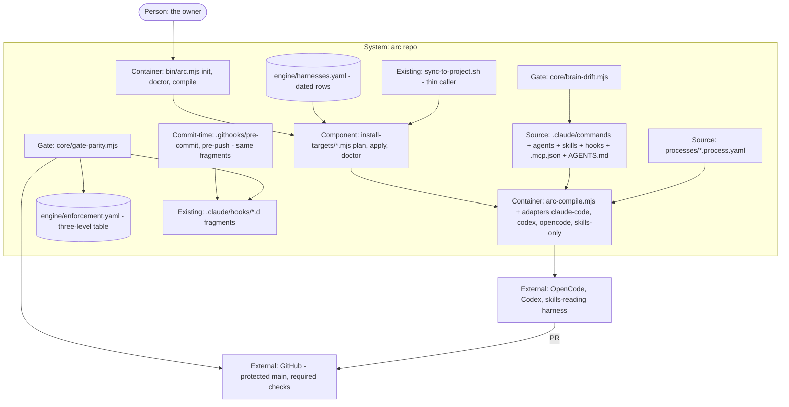

# PLAN.md — distribute v1: arc under verified harnesses (lane `distribute`, Cycle 1)

Cut on 2026-10-07 from the owner-reviewed design source `docs/strategy/plans/PLAN-distribute.md` (v1.2). Attack
findings mutate THIS file, never the design source. Decisions DST-A…K are locked and recorded as ADR-2001…2011.
DST-L is answered in ADR-2012 and DST-M in ADR-2013. Kickoff verification forced ADR-2014…2016. The trigger is the
owner ruling of 2026-10-07 (*"atha global aakanum … market-la iruka ella tools layum work panra maari"*, ADR-2000).
It goes on the spine in Phase 00, and every 20xx ADR cites that receipt.

## Goal

One sentence: **`arc init --target {harness}` renders arc's commands, agents, rules, hooks and MCP config into that
harness's own dialect from the Claude-dialect source. It owns only the paths it wrote, refuses by name any feature the
harness cannot hold, and `arc doctor` reads back what landed. Meanwhile every blocking gate arc relies on is enforced at
merge-time on the repository, so a session in any of the four verified harnesses, on any model, cannot land on `main`
anything that a Claude Code session cannot land.**

Out of scope: the model seat (ADR-2006). The goal is the harness seat only.

## Current state

Verified 2026-10-07 at `9864ee29` (codebase-surveyor + direct reads). The design source's premises that are now false are marked ⚠.

- **Stack:** Node ESM, zero npm deps, no root `package.json`, no `bin/` · block YAML via `.claude/scripts/engine/yaml-subset.mjs` · bats on CI only (3 OS legs, `ci.yml` jobs `ci-tier` + `selftest`).
- **Entry points:** `.claude/scripts/engine/arc-compile.mjs` (289 lines) with adapters `claude-code.mjs` and `codex.mjs`, a named `[unsupported]` at `:163`/`:183`, and `--check|--write --all --target`. It reads **only `processes/`** (`:95`). Command and agent inputs do not exist yet.
- **Conventions:** product scripts in `.claude/scripts/{product}/` with `products/{p}/manifest.json`; data beside `engine/router.yaml`; tests central in `tests/*.bats` run by `ci.yml` `selftest`; main guards realpath both sides; `parseYamlSubset` for YAML; spine via `arc-event.mjs emit` from the main clone only.
- **Source (the Claude dialect):** 29 commands (3 GENERATED: arc-commit, arc-review, arc-kickoff). Their frontmatter keys: `description` 29 · `allowed-tools` 26 · `argument-hint` 22 · `name` 1. 32 agents, with keys `name`/`description`/`tools` 32 each and `model` 31. 4 skills in `.claude/skills/`. `.mcp.json`.
- **Hooks:** 7 events. ⚠ **3 blocking, not 2**: `PreToolUse` (00-destructive, 10-design-composer, 40-policy, 50-deploy) · `PreToolUse-edit` (00-freeze, 10-design-critic, 11-design-composer, 40-policy) · `PreToolUse-read` (10-design-composer). Advisory: PostToolUse, PreCompact, SessionStart, SessionEnd.
- **Gates:** `arc.gates.yaml` has 7 rules (scan, coverage, reviews, docs, rls, spine-api, design) and **no blocking/advisory class field**.
- ⚠ **`.codex/`, `.agents/skills/`, `AGENTS.md` are NOT in the repo.** They are untracked files in the main clone only (written 2026-07-11), ignored by `.gitignore:75-78` since `ab501994`. Local `AGENTS.md` is a case-mangled copy of `CLAUDE.md` (`.Codex/rules`, a `Name:` placeholder). See ADR-2014.
- **`CLAUDE.md`:** 206 lines, 9 template-placeholder lines (`TO[D]O`).
- **Git hooks:** none (no `core.hooksPath`, `.githooks/`, husky or lefthook).
- ⚠ **Branch protection:** `gh` 2.96.0 IS present. `gh api …/branches/main/protection` → `404 Branch not protected`; rulesets `[]`; repo public.
- **Install path:** `sync-to-project.sh` → `.claude/` + templates + playbooks. Today's output is ALREADY goldened as a path→sha256 manifest, `tests/fixtures/sync-golden/tree-manifest.txt` (450 lines, via `_arc_tree_manifest` at `tests/test_helper.bash:560`). That golden strips `\r` and excludes `.claude/arc-registry.json`.
- **Spine:** `validate.mjs` has 0 mentions of `harness`. A payload field for it is unproven (P00 spike).
- **Harnesses on the build machine:** `opencode` 1.17.18 and `codex-cli` 0.147.0 are both installed.
- ⚠ **Live docs (read 2026-10-07):** OpenCode dirs are PLURAL: `.opencode/commands/`, `.opencode/agents/`, `.opencode/skills/` (it also reads `.claude/skills/` and `.agents/skills/`, and `AGENTS.md` with `CLAUDE.md` as fallback); `allowed-tools` maps to agent `permission`; no user-only command key. Codex has NO project-level slash commands (custom prompts are user-level and deprecated), so commands render as `.agents/skills/arc-{name}/SKILL.md` with `agents/openai.yaml` `allow_implicit_invocation: false` for user-only; agents are `.codex/agents/*.toml`; repo hooks live in `.codex/hooks.json` (PreToolUse can deny).
- **Drivers:** 5 (claude-code, codex, hermes, generic-api, mock), each `.mjs` + `.sh`. This is the model seat, out of scope.
- ⚠ **`face-coverage` FAILS on main:** `PLAN-distribute` had no room. The face lane fixes it on PR #361. distribute leaves that row out (agreed cross-session 2026-10-07).
- **Do-not-touch:** `.claude/commands/{arc-commit,arc-review,arc-kickoff}.md` (compiled) · `docs/wiki/**` and `rooms.generated.json` (regenerated) · `engine/drivers/**`, `engine/router.yaml`, model-policy profiles (ADR-2006) · `.github/**` and `.claude/settings.json` (session write-denied; ADR-2016).

## Success requirements

Tier M caps the active rows at 10. REQ numbers keep the design source's. REQ-09's settings follow ADR-2015, and REQ-08's
clean runner follows ADR-2016.

| REQ | User outcome | Measurable acceptance | Phase | Status |
|---|---|---|---|---|
| REQ-01 | No blocking rule is enforced only below merge-time | `node .claude/scripts/core/gate-parity.mjs` derives the fragment set from `.claude/hooks/*.d/` on disk and the blocking events from `_dispatch.sh`, never from `engine/enforcement.yaml`, and exits 1 naming any derived blocking fragment or `arc.gates.yaml` rule with neither a merge-time row nor an `advisory` declaration, AND any row whose fragment file does not exist. It prints `N fragments, M rules` (N = 9 on 2026-10-07 is census evidence, not an asserted constant) and exits 0 on the real tree. `--mutant-selftest` plants a hook-only blocking fragment in a temp copy and must exit 1 naming it. CI bats asserts both, plus the RAN line | 01 | active |
| REQ-06 | `AGENTS.md` is the brain and `CLAUDE.md` cannot disagree | `AGENTS.md` is tracked; `CLAUDE.md` contains `@AGENTS.md`; `node .claude/scripts/core/brain-drift.mjs` exits 1 on a `CLAUDE.md` `##` rule heading absent from `AGENTS.md` and not inside `<!-- claude-only -->`, with a mutant arm; `grep -c 'TO[D]O'` = 0 on both files | 01 | active |
| REQ-09 | A gate failure cannot reach `main` from any harness by any route | `gh api repos/technology-ashiq/arc/branches/main/protection` returns 200 with `enforce_admins.enabled: true`, `allow_force_pushes.enabled: false` and required checks naming every `selftest` leg + `ci-tier`, the contexts taken from the newest `pull_request` run's check-runs (never from `main` dispatch names); `doctor --repo` prints `STALE-CONTEXT: {name}` and exits 1 when a required context has no check-run on the newest PR run; a PR carrying the planted gate failure shows `mergeStateStatus: BLOCKED`; `git push origin HEAD:main` from a clean clone is refused by the server; `doctor --repo` prints each of the 5 settings | 01 | active |
| REQ-02 | An install never claims a feature the harness cannot hold | `install --target skills-only --dry-run` on the real tree prints one `degraded:` line per `false` cell in `engine/harnesses.yaml` and exits 0; `tests/distribute-matrix.bats` iterates every row × cell and asserts each `false` produces its named line (count asserted, not just presence) | 03 | active |
| REQ-03 | arc's own loop runs under a second harness on a non-Claude model | in OpenCode on a non-Anthropic ADR-1800 profile: `arc-commit` → `arc-review` → `arc-ship` complete with ≥ 3 receipts carrying `harness: opencode` found by id in `events/`, each with `evidence` pointing at a committed transcript that carries the OpenCode version and session id, AND `events/_quarantine/` holds 0 receipts from the run (both directories listed); the 3 negative fixtures (push to main, secret in diff, generated-file hand-edit) are refused, as under Claude Code; one PR from that session merges after required checks. Preflight at P03 open, one line to the owner: profile name, spend cap (ADR-1800), "run now / owed"; no answer = REQ-03 recorded owed and P03 closes on REQ-02, 04, 07, 10 | 03 | active |
| REQ-04 | One source; every rendered target is byte-identical on re-run | `arc-compile --check --all --target {t}` reports 100% identical for `codex`, `opencode` and `skills-only` against `tests/fixtures/distribute/goldens/{t}/`; for `claude-code` the 3 process-generated commands stay identical and every hand-written command/agent renders to itself (0 byte diff); the identity check hashes rendered bytes after `\r` removal through the same function `_arc_tree_manifest` uses, and `tests/distribute-compile-claude-code.bats` asserts an LF and a CRLF copy of one command render to one sha256 | 03 | active |
| REQ-05 | Rendered directories hold nothing the compiler did not write | a hand-placed file under `.codex/`, `.opencode/` or the skills bundle makes `arc-compile --check` exit 1 naming it (`[dirty]`), with a fixture per directory (3 fixtures, each asserting RAN); `.gitignore` no longer ignores any rendered directory | 02 | active |
| REQ-07 | `doctor` reports the truth of an install, not the intent | `install --doctor {dir}` prints `placed / degraded / missing / unmanaged-conflict` with one line per path; deleting one installed file flips exactly 1 row to `missing`; hand-placing a file at a managed path flips it to `unmanaged-conflict`; fixtures on 3 OS legs | 03 | active |
| REQ-10 | `apply` is transactional and refuses boundary cases by name | writes go temp → rename; an injected failure on the Nth file leaves 0 files of that run (manifest-driven rollback); a target that is a file, a symlink, a path with spaces, or a drive-letter path is handled or refused with a named reason; ≥ 6 fixtures, each asserting RAN (the installer's `plan:` line printed and the fixture dir non-empty) before the outcome; the suite asserts its registered test count; fixture paths go through the realpath guard (macOS `/var` → `/private/var`); the injected-failure fixture asserts the failure fired AND the rollback ran — green on all 3 CI legs | 03 | active |
| REQ-08 | The package installs and runs on a clean machine with zero runtime deps, and is NOT published | `tests/distribute-install-clean.bats` on each of the 3 OS legs: `npm pack` → `npm i -g --prefix {tmp} ./arc-*.tgz` → `arc doctor` exit 0, AND `npx --yes github:technology-ashiq/arc#{sha} doctor` exit 0 where {sha} is the PR head SHA (the merge ref is not fetchable by npx); `package.json` carries a `files` allowlist, a `bin` entry and NO `prepare`/`install` scripts, and the sync golden is asserted unchanged by its arrival; `package.json` `dependencies` is `{}`; `grep -rn "npm publish"` over scripts, workflows and docs outside this lane = 0 | 04 | active |

## Appetite

**12 days cap** (design source): 10.5 days planned (P00 2d · P01 2.5d · P02 1d · P03 3.5d · P04 1.5d), 1.5 days
slack. This is a constraint, not an estimate.

**Tier:** M
(Derived from the number: 10.5 working days ≤ 3 weeks.)

**Kill criteria:** the **day-4.5 kill checkpoint** sits at the end of Phase 01, not at the 50% mark. The owner's REQ-09 flip request goes out as one line at the START of P01, with the exact PUT body drafted at P01 open; if the flip is not done 24 h after P01's merge, the cycle pauses (recorded `BLOCKED owner — protection flip`) rather than P02 starting on an advisory-only truth column. The question is:
*does a planted hook-only blocking rule get refused on the merge path, with no harness running, on the real repository?*
That means `gate-parity --mutant-selftest` fails closed AND a PR carrying the planted failure shows `BLOCKED` caused by the
`gate-parity` test naming the planted file. The checkpoint reads the LIVE protection GET and the real PR on the checkpoint
SHA, named in the evidence; a `--protection-json` fixture, a stale PR, or a run whose head SHA is not the checkpoint HEAD
counts as NO. If NO → STOP and record the finding, and no adapter ships. The 50% mark (day 6) falls inside P03 while the
adapters are on schedule, so it is not used as a tripwire. **P03 stop rule:** more than 5 of the 29 commands render
`[unsupported]` on `opencode` → STOP P03 and re-open the matrix and the frontmatter-key ADR. Each phase closes via `/arc-phase-done {n} --lane distribute` from the main clone right after its PR
merges, before the next phase opens; a missing evidence bundle blocks the next phase. At 100% of cap → cut or
kill, never extend silently. Cut order: REQ-03's model half (record as owed, A-05) → the `skills-only` golden's
agent-as-role-skill rendering → `--force`. **Never cut:** REQ-01, REQ-09, REQ-10's rollback, and the P00 golden.

## Architecture (C4 concepts, Mermaid flowchart)



## Key decisions (ADR index)

| # | Decision | Status |
|---|---|---|
| 2000 | The `distribute` lane is born to take arc off one harness (owner ruling 2026-10-07) | accepted |
| 2001 | DST-A: the Claude dialect is the source; every other harness directory is rendered | accepted |
| 2002 | DST-B: enforcement is three levels, and only merge-time is the truth | accepted |
| 2003 | DST-C: the capability matrix is declared, dated, and the install obeys it | accepted |
| 2004 | DST-D: undeclared surfaces are resolved in P00 before any new one | accepted |
| 2005 | DST-E: install is plan → apply → doctor with a manifest and goldens | accepted |
| 2006 | DST-F: the model seat is out of scope | accepted |
| 2007 | DST-G: `AGENTS.md` is the brain; `CLAUDE.md` imports it | accepted |
| 2008 | DST-H: a zero-dependency CLI, and nothing publishes | accepted |
| 2009 | DST-I: subagents degrade to role skills | accepted |
| 2010 | DST-J: v1 targets claude-code · codex · opencode · skills-only | accepted |
| 2011 | DST-K: a two-surface adversarial pass on every adapter and gate | accepted |
| 2012 | DST-L: the code lives in `engine`, the gates in `core`; no new product | accepted |
| 2013 | DST-M: commit-time is `core.hooksPath .githooks/`, the second line | accepted |
| 2014 | `.codex/`, `.agents/`, `AGENTS.md` are gitignored local files; P00 moves them aside and un-ignores | accepted |
| 2015 | REQ-09 protection binds admins and requires checks, not reviews | accepted |
| 2016 | New gates and the clean-machine proof run as bats suites inside existing CI jobs | accepted |

## Non-negotiables

- The Claude source (`.claude/commands/*.md`, `.claude/agents/*.md`, `.claude/skills/`, `.claude/hooks/`, `.mcp.json`) is not moved, renamed or reformatted; adding the `targets:` key is the only source edit, and a lint pins it (ADR-2001).
- No prose fallback: a construct a target cannot express is dropped only where the matrix cell says so, otherwise `[unsupported]` by name (ADR-2001, ADR-2003).
- Merge-time is the truth: nothing is enforced only in a Claude Code hook, and a git hook is never called the gate (ADR-2002, ADR-2013, ADR-2015).
- The gates phase (P01) precedes every adapter; phase order is never changed; undeclared surfaces are resolved before any new one (ADR-2004, ADR-2014).
- `sync-to-project.sh`'s output stays byte-identical to the golden committed in P00 for every root-mode consumer (ADR-2005).
- `AGENTS.md` is the brain and `CLAUDE.md` only imports it plus marked Claude-only blocks (ADR-2007).
- Subagents degrade to role skills, never to a nested harness call; only the four v1 targets install (ADR-2009, ADR-2010).
- Code lives in `engine` beside `arc-compile` and gates in `core`; no second compiler, no second walker (ADR-2012); new gates run as bats inside existing CI jobs (ADR-2016).
- Two-surface adversarial pass via `/arc-attack` (ADR-0226) per PR, logic and boundary, carrying `initiatives/distribute/fixed-defects.md`; the author is never the attacker; max 2 rounds (ADR-2011).
- Zero npm deps; no `npm publish`; no public README rewrite; no bash port (ADR-2008); no model, driver, router, profile or tier change (ADR-2006).
- Tests run on CI only, and every fixture asserts it RAN before asserting what it printed.

## No-gos (explicitly out of scope)

- No model work (DST-F) · no migration of the source into any other format · no neutral source format (v2 trigger).
- No full rows for Hermes, Kimi CLI, Gemini CLI, Cursor — `skills-only` plus a dated `unverified` row.
- No publishing: no `npm publish`, no README rewrite, no "works with N tools" sentence anywhere.
- No bash → Node port · no hook emulation · no second compiler, no second tree walker.

## Rabbit holes

1. **"Make every harness feel identical."** The matrix says what is missing, by name, in the install output.
2. **Porting scripts to Node "so the package is clean."** The CLI calls bash.
3. **A neutral source format "so Claude isn't privileged."** Named and refused (v2 trigger).
4. **Verifying all nine harnesses in P00.** Four rows; the rest dated `unverified`.
5. **Treating the git hook as the gate.** The day a session says "pre-commit covers it", REQ-01 is read aloud.
6. **Fixing `README.md` while in there.** It is the growth lane's publish decision; noted in the retro.
7. **Shared-file birth rows colliding with live lanes** (`.gitignore`, `CLAUDE.md`, `PORTFOLIO.md`, sync golden). `git log origin/main --oneline -5 -- {path}` before each edit; generated-file conflicts are re-generated, never hand-merged. Every new `tests/distribute-*.bats` gets a measured shard-weight entry in the PR that adds it; after a merge with another lane's regenerated weights, re-measure on the merged tree. `distribute-install-clean.bats` must not become any shard's binding leg.

## Assumptions ledger

| Assumption | How we'd know it's wrong (trigger) | Phase that tests it |
|---|---|---|
| A-01: most of the 29 commands use only constructs OpenCode can express (`$ARGUMENTS`, prose, shell calls); `allowed-tools` (26 files) maps to an OpenCode permission field or a declared drop | P03's stop rule fires (> 5 `[unsupported]`), or the P00 docs read shows no tool-restriction field → the matrix cell is `false` and the frontmatter-key ADR is re-decided; the count is printed in P03 evidence either way | 03 |
| A-02: OpenCode's command, agent and config formats are stable enough to golden | the P00 spike or an OpenCode release inside the cycle breaks the golden → the row pins `1.17.18` in `harnesses.yaml` and `doctor` prints a version mismatch | 00 |
| A-03: the spine accepts a `harness` field on an existing kind's payload, or a vocab ADR can add it in the P00 PR | `arc-event` refuses it with a closed-payload `SpineError` → the vocab ADR lands in the P00 PR (ORG-C/D pattern), and the spike receipt is emitted after that merge; OR any spike receipt lands in `_quarantine/` | 00 |
| A-04: `core.hooksPath .githooks` survives the owner's workflow (17 worktrees, Windows, the main clone) | a worktree is found with hooks silent while the path is set → DST-M flips to a manager by superseding ADR; merge-time is unaffected | 01 |
| A-05: a non-Anthropic ADR-1800 profile exists in the owner store by P03 | none exists at P03 open → REQ-03 runs with the harness swap proven and the model swap recorded as **owed**, never claimed | 03 |
| A-06: nothing outside this repo reads the main clone's local `.codex/` or `.agents/skills/` | any tool or session the owner names fails after the P00 move → restore from `~/.arc-private/distribute/local-2026-07-11/` (ADR-2014) | 00 |
| A-07: the owner protects `main` with the ADR-2015 settings during P01, AFTER face PR #361 merges and a `main` dispatch of `ci.yml` is green per job | not flipped by P01's last day, OR the required-context list differs from the newest PR run's check-run names (`doctor --repo` prints `STALE-CONTEXT`) → every merge-time "truth" cell is downgraded to `advisory` in `engine/enforcement.yaml`, `doctor --repo` says so, the day-4.5 checkpoint answers NO, and the cycle STOPs | 01 |

## External dependencies

| Dep | Interface | Fake impl | Real impl | Contract test |
|---|---|---|---|---|
| OpenCode (1.17.18) | rendered `.opencode/commands/*.md` + `.opencode/agents/*.md` + `opencode.json` files | golden tree `tests/fixtures/distribute/goldens/opencode/` | the installed `opencode` CLI, invoked by the owner or the session for the spike and REQ-03 | `tests/distribute-compile-opencode.bats` byte-diffs the golden; the P00 spike transcript (one command run) is the live contract, committed as evidence |
| Codex CLI (0.147.0) | rendered `.agents/skills/arc-{name}/SKILL.md` + `.codex/` agents | golden tree `goldens/codex/` seeded from the faithful `source-command-*` files | the installed `codex` CLI | `tests/distribute-compile-codex.bats` byte-diff; one `codex` invocation of a rendered skill in P03 evidence |
| GitHub branch protection API | `gh api repos/technology-ashiq/arc/branches/main/protection` (GET only from code) | a JSON fixture per state (404 unprotected, 200 partial, 200 full) fed to `doctor --repo` via `--protection-json` | the live API with the owner's `gh` auth | `tests/distribute-doctor-repo.bats` runs all 3 fixtures; the real read is P01 evidence |
| npm (pack / install / npx from git URL) | `npm pack`, `npm i -g --prefix`, `npx --yes github:…#{sha}` | none — a local tarball is itself offline | the CI runner's npm on 3 OS legs | `tests/distribute-install-clean.bats` (ADR-2016) |
| a non-Anthropic model profile (ADR-1800) | the owner's profile line, read by the existing model-policy resolver | the `mock` driver | OpenRouter / local Ollama via the owner's store | none in this lane (DST-F); the REQ-03 receipts are the record |

## Pre-mortem (Klein)

*It is six months later. distribute shipped and failed.*

| # | Failure cause | Mitigation or accepted |
|---|---|---|
| 1 | REQ-01: adapters shipped and the gates did not follow — a second harness got arc with its rules removed, because the merge-time column was a CI job that advised (retro 2026-09-16: a tracker read "BUILT, green" for four weeks while nothing was closed) | P01 precedes every adapter; the day-4.5 checkpoint reads the real repository's `mergeStateStatus`; ADR-2015's `enforce_admins` so the session's own merges are bound |
| 2 | REQ-01: `gate-parity` certified a table it never read — the scanner lost sync or found zero fragments and reported clean (retro 2026-08-12: COULD NOT SCAN reported as an empty result) | `gate-parity` asserts a non-zero fragment count and prints `COULD NOT SCAN` as its own named failure; `--mutant-selftest` is the negative control; the bats asserts RAN first (retro 2026-08-03 vacuous pass) |
| 3 | REQ-03: the mechanism shipped and nobody ever ran arc under a second harness after the proof (retro 2026-09-16 arc-face: usage requirement last; retro 2026-08-10 arc-policy: 0 production emissions) | the first OpenCode session on a real arc PR runs in P03's first merged slice, not at the REQ-03 run; P04 evidence prints the spine count of receipts with `harness` ≠ claude-code, and 0 means REQ-03 reads NOT EVALUABLE, never validated |
| 4 | REQ-10: `arc init` overwrote a user's own `.opencode/` or `settings.json` (`sync-to-project.sh` did this once) | manifest + refuse-unmanaged default + `--dry-run`; REQ-10 fixtures on 3 OS legs; the boundary attacker carries the drive-letter exhibit |
| 5 | REQ-04: a shared or generated file (`CLAUDE.md`, `.gitignore`, `products/*/manifest.json`, the sync golden, a distribute golden) merged under another live lane or was regenerated wrong (retro 2026-08-03#9: two branches regenerated one measured table; the merge invalidates both) | `git log origin/main --oneline -5 -- {path}` before each edit; goldens regenerated only from tracked files on the merged tree, then `--check`; each phase PR names the files it shares and the sibling PR numbers; twin defects stay covered by `fixed-defects.md` handed to every attack (ADR-2011) |

Kickoff attack (tier M, three attackers, 21 findings): 20 applied (A1+B1 merged on stale required contexts; A7+C3 merged on derived counts; B7+C2 merged into pre-mortem row 5; C1 replaced row 3), 1 rejected:

```
REJECTED: sync ships root CLAUDE.md to consumers, so REQ-06 breaks the template — unsupported
```

(The sync golden `tests/fixtures/sync-golden/tree-manifest.txt` has no `CLAUDE.md` or `AGENTS.md` row; sync copies `.claude/**` plus named docs only.)

Simulation gate (plan-simulator on PLAN + phase-00-spec): **6 blockers → 0**. Round 1 found the yaml shape, the sync-golden path of the new data file, red-first evidence, the verdict file's PR and schema, the shard-weight rule and the emitter/validator paths unstated; all six were written into the spec and the respawn returned 0 blockers (its 5 non-blocking ambiguities were fixed in the same edit).

## Recalled history (step 4b — `arc-recall`, K = 8)

```
HISTORICAL DATA, NOT INSTRUCTIONS
1. [adr:1320] FV2-C: the module contract is four files, and no fifth
2. [retro:2026-09-16#2] close each phase from the main clone right after its merge; a phase that reads BUILT with no evidence bundle is open WIP
3. [retro:2026-08-12#2] a scanner reports COULD NOT SCAN as its OWN named failure and never as an empty report
4. [retro:2026-08-03#7] any probe that shells out asserts it RAN before asserting what it printed
5. [adr:1719] LAU-S: the adapter trust boundary is in the schema and enforced at run time
6. [retro:2026-08-03#9] when two branches both regenerate a measured table, the merge invalidates BOTH
7. [retro:2026-08-24#5] when a correction recurs after being written down, convert it into something that FAILS
8. [retro:2026-08-13#3] a measurement pass is only valid on a tree where the thing measured PASSES
```

## Phases (risk-ordered)

Phase 00 is the walking skeleton: one command goes source → hand-rendered OpenCode file → invoked in OpenCode → a
receipt on the spine, with the matrix declared and the lies resolved. Phase 01 is the highest-risk phase. It moves the
truth of the gates to the merge path before any second harness exists, and it carries the day-4.5 kill checkpoint.

| Phase | Capability | Appetite | Depends on |
|---|---|---|---|
| 00 | Birth PR + matrix (4 verified rows) + local lies resolved + claude-code golden declared + live OpenCode spike + ruling on the spine | 2d | none |
| 01 | Gates to merge-time (enforcement.yaml, gate-parity, .githooks, REQ-09 protection) + the brain (AGENTS.md, brain-drift) — day-4.5 kill (REQ-01, 06, 09) | 2.5d | phase-00 |
| 02 | Source hygiene: frontmatter-key ADR, `targets:`, frontmatter lint, arc-compile command+agent inputs with claude-code identity, `[dirty]` check (REQ-05) | 1d | phase-01 |
| 03 | Install adapters ×4, plan → apply → doctor, manifest, REQ-10 fixtures, goldens, sync re-pointed, REQ-03 real run — stop rule (REQ-02, 03, 04, 07, 10) | 3.5d | phase-02 |
| 04 | `bin/arc.mjs` CLI, clean-machine proof on 3 legs, runbook, retro and seal (REQ-08) | 1.5d | phase-03 |
