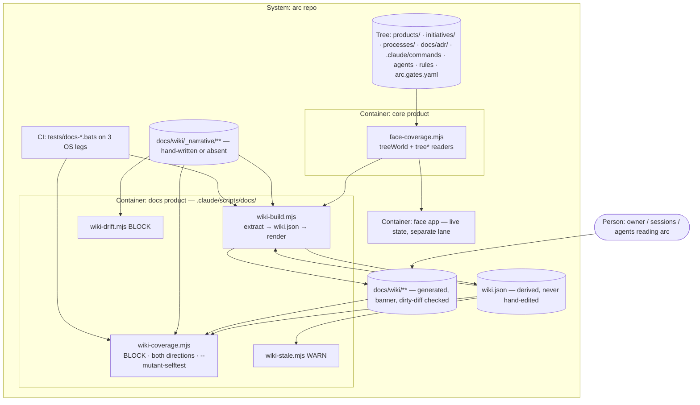

# PLAN.md — docs v1: arc's own reference, generated and complete by construction

> Kickoff 2026-09-25 · lane `docs` · ADR century **1500–1599** (ADR-1500) · design source
> `docs/strategy/plans/PLAN-docs.md` (landed 2026-09-19, owner-instructed; DOC-A…K locked there,
> DOC-L decided here as ADR-1512). Fired by the owner's ruling of **2026-09-18**, which is **not yet
> on the spine** — recording it as a `decision.recorded` is Phase 00's first act (ADR-1500).
> Attack findings mutate THIS file, never the design source.

## Goal

For whoever works on arc — the owner and every session and agent he starts —
`node .claude/scripts/docs/wiki-build.mjs` turns the tree into one `wiki.json` and a page per
product, lane, process, ADR band, command, agent, rule and gate under `docs/wiki/`, and
`wiki-coverage.mjs` fails CI when any part of arc has no page **or** any page has no part of arc —
so a thing born on Monday is documented on Monday, before anyone writes a word about it, and the
four hand-kept overview documents stop giving second answers.

## Current state

Verified against the live tree 2026-09-25 (codebase-surveyor + direct checks; the surveyor's claim
that the ruling is on the spine was checked and is **false**).

**Stack:** zero-dep Node ESM + POSIX bash, YAML, Markdown (Constitution A2). Tests are bats under
`tests/`, run only on CI (three OS legs, sharded). This session cannot write `.github/`, so every new
CI check is a bats suite.

**Entry points:** `.claude/scripts/core/face-coverage.mjs` (owned by `products/core`; the tree
walker this lane imports; `isMainModule()` realpath guard, so importing it has no side effects) ·
`initiatives/face/contracts/expected-set.json` (the face contract whose birth rule every new lane,
ADR century and product must satisfy in the same change) · `.claude/scripts/engine/arc-compile.mjs`
+ `tests/engine-compile.bats` (ADR-0201's generated-file precedent) · `docs/strategy/README.md`
§ "File map & status" (the strategy file map DOC-J updates).

**Inventory today (a kickoff snapshot — re-derived by `wiki-build --json` from Phase 00 on, never carried forward):** products 16 · lanes 16 (+ `docs`) · processes 8 · ADRs 295 before this kickoff
(+13 here) · commands 28 (3 generated) · agents 30 · rules 7 · gates 7 · bats suites 170. The design
source said 17 products and 285 ADRs — both moved; that drift is why DOC-B forbids copied counts.

**Conventions:** discovery is imported, never re-globbed (DOC-A). `face-coverage.mjs` exports
`treeGates`, `treeJobs`, `treeVentures`, `treeAdrBands`, `treePlans`, `treeCapabilities`,
`treeHooks`, `treeLints`, `treeCi`, `treePlannedRooms`, `treeModules`, `treeOps`, but **not**
`dirNames` / `mdStems` / `yamlStems` / `treeKinds` / `treeProducts` / `gather` — the design source's
list was wrong, and ADR-1501 adds an additive `treeWorld(repo)` export. Gates are FAIL-FROM-BIRTH
with a mutant self-test that runs in a scratch copy (`face-coverage --selftest`, exit 0/1/2). New
scripts refuse unknown flags by name (exit 2) and realpath both sides of the main guard.

**Do-not-touch:** the three generated commands (`.claude/commands/{arc-commit,arc-review,arc-kickoff}.md`
— edit `processes/*.process.yaml`); `face-coverage.mjs` beyond the additive exports of ADR-1501 (the
face lane is LIVE, Cycle 16 Phase 06, and last changed the file in PR #252); `docs/evidence/**` and
`docs/archive/**` (frozen history, read-only except DOC-J's four moves *into* `docs/archive/`).

**Four overlapping documents (DOC-J):** `docs/how-it-works.md` (135 lines, 20 referencing files) ·
`docs/how-arc-works-simple.md` (160, 7) · `docs/usermanual.md` (547, 20) · `docs/blueprint.md`
(264, 21). The strategy file map already marks them "for supersession by REQ-08, do NOT move until
Phase 02".

**Birth rows already applied in this kickoff's change:** `expected-set.json` gains
`lanes.docs → lane` and `adrs.1500 → lane`; `rooms.generated.json` regenerated by
`face-sections.mjs`. `face-coverage` and `face-sections --check` both pass on this tree.

## Success requirements

| REQ | User outcome | Measurable acceptance | Phase | Status |
|---|---|---|---|---|
| REQ-09 | The wiki and the face read the same tree through one function, so they cannot disagree about what exists. | `tests/docs-extract.bats`: a scan of `.claude/scripts/docs/**` finds zero directory-enumerating calls, and a mutant adding one `readdirSync` turns it RED; `wiki.json` entity counts equal `treeWorld(repo)` counts for all eight types; a mutant making one reader return `unreadable` turns `wiki-build --json` RED (exit 2 naming the reader), never a vacuous 0 = 0. | 0 | validated |
| REQ-02 | A part of arc with no page fails CI, naming it. | `wiki-coverage --mutant-selftest`: mutant M1 (unknown product + unknown lane) exits 1 naming BOTH ids; the suite first asserts the declared mutant count ran. | 1 | validated |
| REQ-03 | A page with no part of arc behind it fails CI, naming it. | Mutants M2 (product removed, page kept) and M3 (orphan narrative) each exit 1 naming the orphan path. | 1 | validated |
| REQ-01 | Every product, lane, process, ADR band, command, agent, rule and gate in the tree has a page. | `wiki-coverage` exits 0 on the real tree at the Phase 02 close commit, printing a per-type count equal to `wiki.json`'s. | 2 | validated |
| REQ-04 | A newly born product appears with its real facts and zero hand-written input. | A fixture product added to a scratch tree → rebuild → its page exists carrying its manifest `name`, `version`, `requires` and the `narrative pending` banner; no other file was edited. | 2 | validated |
| REQ-06 | Generated pages cannot be edited in place. | `tests/docs-render.bats` regenerates into a scratch dir and fails on any byte / missing / extra file vs `docs/wiki/`; a one-byte-edit mutant is asserted RED. | 2 | validated |
| REQ-08 | The four overlapping documents no longer compete with the wiki. | Each of the four is a ≤ 10-line stub at its original path naming its `docs/wiki/` replacement, with the full original in `docs/archive/`; zero inbound links break; the strategy file map records it in the same commit (ADR-1510). | 2 | validated |
| REQ-05 | A hand-written paragraph naming a script, driver, command or ADR that no longer exists fails CI. | Mutant narrative citing `ADR-9999` and `drivers/ghost.mjs` → `wiki-drift` exits 1 naming both. | 3 | validated |
| REQ-07 | No count on any page is copied; all are derived. | `wiki-build --audit-counts` re-derives every number on every page from `wiki.json`; a mutant page with one count changed exits 1 naming the page and the number. | 3 | validated |

## Appetite

**6.5 days cap** (5.5 days planned in phases · 1 day slack) — the owner's figure. A constraint, not an
estimate: blown means cut or kill, never a silent extension.

**Tier:** M

**Kill criteria:**
- **Day-3 kill checkpoint (end of Phase 01) — one question: does `wiki-coverage --mutant-selftest`
  fail closed?** Every declared mutant must exit 1 naming what was planted, and the wiring mutant
  (M4) must not print "covered". If not, the cycle **STOPs**, the finding is recorded in
  `PROGRESS.md` and `docs/retro-log.md`, and no renderer is built. A completeness gate that is
  vacuous is worse than no wiki, because it certifies what it never checked (ADR-1503).
- The generic 50% tripwire is **not** used on its own: 50% of the cap (3.25 d) falls mid-Phase 01
  while on schedule, and a tripwire that fires on an on-track run learns to be ignored. It is
  replaced by the day-3 checkpoint above, plus: if Phase 00 is not closed at **2.25 d** (1.5× its
  appetite), mandatory scope-cut conversation — the designated cut is REQ-07 (`--audit-counts`),
  then the P03 narratives (absence is legal, ADR-1505). Phase 00's two externally gated steps —
  the owner's `arc-inbox` keystroke (A-08) and the face session's heads-up on the export PR (A-06) —
  start on day 1 in parallel with the red-first suite, never queued behind the build.
- At 6.5 d: cut or kill, never extend silently.

## Architecture (C4 concepts, Mermaid flowchart)



## Key decisions (ADR index)

| # | Decision | Status |
|---|---|---|
| 1500 | `docs` is born on the owner's 2026-09-18 ruling; century 1500 claimed after a 37-worktree sweep (1400 held by unmerged design v2) | accepted |
| 1501 | DOC-A — discovery imported from `face-coverage.mjs` via an additive `treeWorld` export; import asserted by scan + mutant | accepted |
| 1502 | DOC-B — no hand-maintained inventory of what exists | accepted |
| 1503 | DOC-C — coverage is bidirectional, FAIL-FROM-BIRTH, with `--mutant-selftest` | accepted |
| 1504 | DOC-D — generated output never hand-edited; bats regenerate-and-diff (no `.github/` access) | accepted |
| 1505 | DOC-E — narrative in separate files; absence is legal | accepted |
| 1506 | DOC-F — a newly born entity renders with a `narrative pending` banner | accepted |
| 1507 | DOC-G — drift BLOCKS, staleness WARNs; `--audit-counts` | accepted |
| 1508 | DOC-H — no model-authored narrative ships | accepted |
| 1509 | DOC-I — build-time tree state only; live state belongs to the face | accepted |
| 1510 | DOC-J — the four overlapping docs become stubs at their paths + full copies in `docs/archive/`, in Phase 02 | accepted |
| 1511 | DOC-K — two-surface adversarial pass on the extractor and each gate | accepted |
| 1512 | DOC-L — the generator is its own `docs` product, `requires: core`, not in `core` | accepted |

## Non-negotiables

- DOC-A / DOC-B: nothing under `.claude/scripts/docs/` enumerates a directory; every entity set comes from `face-coverage.mjs`'s `treeWorld` (ADR-1501), no hand-maintained list of what exists is kept anywhere (ADR-1502), and `tests/docs-extract.bats` proves it with a scan and a mutant.
- DOC-C: `wiki-coverage.mjs` is FAIL-FROM-BIRTH, checks BOTH directions (entity with no page, page with no entity), and ships `--mutant-selftest` whose run count is asserted before its verdicts (ADR-1503).
- Phase order is fixed: extractor → coverage gate → renderer → drift/stale + narratives. The gate is built and proven before any renderer exists.
- DOC-D: every generated file carries the do-not-edit banner, and CI regenerates and fails on a dirty diff (ADR-1504).
- DOC-E / DOC-H: narrative lives only in `docs/wiki/_narrative/`, is hand-written or absent, and no model-authored prose ships (ADR-1505, ADR-1508).
- DOC-I: pages show build-time tree facts only — no spine, no `.claude/state/`, no network, nothing from outside git-tracked files; the repo is public, so the PII grep runs on `docs/wiki/**` before every push (ADR-1509).
- DOC-J: Phase 02 does not close until the four overlapping documents are archived or stubbed and the strategy file map says so in the same commit (ADR-1510).
- DOC-K: every gate and the extractor get two fresh attackers on different surfaces carrying `initiatives/docs/fixed-defects.md`, run on the local commit of the PR that ships that gate, before its push — not deferred to a phase-close checkbox; at most two rounds per PR (ADR-1511).
- Tests run on CI only, never on this box; "green" means CI per-JOB with the head SHA confirmed (`ci-digest.mjs`). Every test asserts it RAN before asserting what it printed.
- Cross-lane blast radius: once `wiki-coverage` and the dirty-diff check run on CI, any lane's PR that adds a product, lane, command, agent, rule, gate or ADR band turns red until the wiki is regenerated. Every such failure prints the one fix command (`node .claude/scripts/docs/wiki-build.mjs`) on its first line, the command is listed in `CLAUDE.md` § Commands, and each live lane's session gets a paste-ready note in the PR that turns the check on. No WARN grace period (ADR-1503).
- Each new suite (`tests/docs-extract.bats`, `docs-coverage`, `docs-render`, `docs-drift`) gets a measured CI weight in the shard table, taken on a tree where it passes, before the phase that adds it closes — never the default.
- Zero-dep Node and POSIX (A2); central `tests/` (ADR-0021); never delete — superseded docs move to `docs/archive/` (A10).
- Constitution articles this plan upholds, for kickoff-lint: E3, A2, A8, A10.

## No-gos (explicitly out of scope)

- **No search.** `grep` works; `graphify` owns `.md` and `codegraph` owns code (ADR-0075). A third index is a fourth truth.
- **No page history or versioning** — git has it.
- **No public publishing.** Internal only; publishing outward is irreversible and needs a separate explicit owner decision (the LexOS-mockups near-miss).
- **No pretty before complete.** Plain markdown in P02; visual treatment or a face ring is a later cycle, arguably the face lane's.
- **No wiki for the wiki.** `docs` is documented by the same generator or it gets no page.
- **No page per script.** Scripts are listed by the product page that owns them (Rabbit hole 3).
- **No narrative authoring beyond three** in this cycle; the other ~30 are throughput, not risk.
- **No change to what `face-coverage` checks** — ADR-1501's exports are additive; any behaviour change there is the face lane's cycle.

## Rabbit holes

1. **"Let a model write the thirty-odd narratives."** *The one that would sink it.* ~90%-right pages
   whose 10% cannot be told apart by reading — the false-comment class this repo keeps paying for
   (`review_by` ninety days vs an ADR's two weeks; the termination spec false twice; `hosted: local`).
   **Detour:** a model extracts and may assist drafts a human accepts line by line; nothing it writes
   unattended ships (ADR-1508).
2. **Building the face ring first.** The UI would demand data-model changes for display reasons.
   **Detour:** generator first; any ring is a later cycle.
3. **A page per script.** 185+ scripts is inventory, not understanding. **Detour:** product pages list
   their manifest's scripts.
4. **Perfecting the narrative template before writing three.** **Detour:** write three at real
   extremes (`engine`, one thin product, one sleeper lane), then fix the template from what broke.
5. **Parsing every ADR header perfectly.** 308 files across a year of formats. **Detour:** parse the
   regular fields; print the unparsed count on the ADR-band page, never hide it (A-02).
6. **Rewriting the four old documents' content into the wiki, or chasing their 68 inbound links.**
   **Detour:** stub in place + archived copy, zero links touched; worthwhile prose returns later as
   hand-written narrative (ADR-1510).

## Assumptions ledger

| Assumption | How we'd know it's wrong (trigger) | Phase that tests it |
|---|---|---|
| A-02: ADR headers are regular enough across ~308 files to parse Status / Date / Product without per-file exceptions | > 5 files need a special case → the parse is reported partial and the unparsed count is printed on the band page | 0 |
| A-03: `PROGRESS.md` machine headers (status · cycle · phase · appetite · burn) are regular across all 17 lanes | > 3 lanes need bespoke parsing → lane pages carry only what parses, and say so | 0 |
| A-05: regenerate-and-diff is stable on all three CI legs (no timestamps, ordering or EOL churn) | the dirty-diff check goes red on a PR that did not touch the tree it renders → fix determinism at source (byte-order sort, LF, no time); never relax the check | 2 |
| A-06: the face lane will not move, rename or narrow `face-coverage.mjs`'s exports mid-cycle | a rebase onto `main` conflicts in `face-coverage.mjs` or `tests/face-coverage.bats` changes an export → coordinate with the face session before resolving, take the stronger version (`lanes.md`) | 0 |
| A-07: the additive `treeWorld` export leaves `face-coverage --selftest` and `tests/face-coverage.bats` green unmodified | either goes red on the Phase 00 PR → the export is wrong, not the face tests; revert to exporting helpers only and re-cut ADR-1501 | 0 |
| A-04: a thin product still yields a page worth reading | the sleeper-lane narrative in P03 reads as filler → the template gains a short form, decided then | 3 |
| A-08: the owner can record the 2026-09-18 ruling via `arc-inbox` on the canonical clone during Phase 00 | not recorded by the Phase 00 close → Phase 00 does not close; ADR-1500's revisit trigger fires | 0 |

## External dependencies

| Dep | Interface | Fake impl | Real impl | Contract test |
|---|---|---|---|---|
| Canonical arc clone — the spine at `E:/Work_Hub/01_Automemory/arc` (for the 2026-09-18 ruling) | `arc-inbox approve APPROVAL_ULID --reason …` writes `decision.recorded` into `.claude/state/hq/events/` on that clone only (a worktree's spine is gitignored and refused) | **none, and none is permitted** — a decision receipt written by the session that wanted it is not a receipt | the owner running `node .claude/scripts/hq/arc-inbox.mjs approve APPROVAL_ULID --reason "…"` from the main clone | manual, before Phase 00 closes: list `events/` AND `events/_quarantine/` on the canonical clone and match by event id |
| Phase closes — `/arc-phase-done`, PROGRESS and the PORTFOLIO row (retro 2026-09-16: 8 of 9 face phases built and never closed from a worktree) | `/arc-phase-done NN --lane docs` on the canonical clone, board row in the same commit | **none** — a close recorded only in this worktree is not a close | the session running it from `E:/Work_Hub/01_Automemory/arc` right after each phase's PR merges | manual at each close: PROGRESS header matches the `docs` board row, `board-lint` silent for `docs` |
| `face-coverage.mjs` (core product, edited by the LIVE face lane) — internal, cross-lane | `treeWorld(repo)` → `{ kinds, lanes, commands, agents, products, rules, processes, gates, … }`, plus `treeAdrBands` / `treePlans` | fixture trees under `tests/fixtures/docs/` passed as `repo` | the live tree | `tests/docs-extract.bats` (REQ-09) and `tests/face-coverage.bats` unmodified and green |

## Pre-mortem (Klein)

| # | Failure cause | Mitigation or accepted |
|---|---|---|
| 1 | **The gate is vacuous** — passes because it checks something always true; this repo has shipped the vacuous pass three times, twice inside suites written to prevent it | REQ-02/03 mutants plus the M4 wiring mutant (ADR-1503); the bats suite asserts the mutant run count before any verdict; the day-3 kill checkpoint asks exactly this |
| 2 | **A second discovery walker appears** because importing was inconvenient one afternoon, and the gate certifies a tree it never read — "validate one read, compare another", fixed four times already | REQ-09's scan + mutant in `tests/docs-extract.bats` (ADR-1501); `treeWorld` is the ONLY assembly, shared with the face |
| 3 | **The face lane changes `face-coverage.mjs` under us** (LIVE, Phase 06) and a rebase silently drops or reshapes an export | A-06/A-07; the export lands as its own small PR first in Phase 00 with a paste-ready note to the face session; `git log origin/main -- face-coverage.mjs` checked before every push (`lanes.md` § shared files) |
| 4 | **Narrative rots silently** — facts move, prose does not, and the wiki lies with authority | `wiki-stale` WARN with per-entity fingerprints, `wiki-drift` BLOCK (ADR-1507, REQ-05) |
| 5 | **The wiki's own entity list becomes the hand-kept contract nobody sees past** — face's completeness gate said "all covered" while nine whole surfaces stayed invisible, because its inventories were contract keys, not disk derivations (retro 2026-08-24); REQ-01's count parity only proves `wiki.json` agrees with `treeWorld` | `wiki-build` exits 1 naming any `treeWorld` key it has no page type for, so a new face inventory forces a wiki decision (mutant in `tests/docs-extract.bats`, Phase 00); `treeWorld` derives from disk per ADR-1317. The four-old-documents row it replaced is held by REQ-08's exit criterion. |

## Phases (risk-ordered)

**The cycle ends at Phase 03.** Narrative for the remaining ~30 entities is outside it.

| Phase | Capability | Appetite |
|---|---|---|
| 0 | **Steel thread — the extractor.** Ruling on the spine (A-08) · `docs` product born (manifest, face rows) · additive `treeWorld` + helper exports in `face-coverage.mjs` (ADR-1501) · `wiki-build.mjs --json` emits ONE deterministic `wiki.json` over products · lanes · processes · ADR bands · commands · agents · rules · gates · `tests/docs-extract.bats` (REQ-09 scan + mutant, count parity) on CI · two-surface attack (DOC-K) | 1.5 days |
| 1 | **The coverage gate — before any renderer.** `wiki-coverage.mjs`, both directions, FAIL-FROM-BIRTH, `--mutant-selftest` M1–M4 run in scratch copies, proven against fixture page trees · two-surface attack · **day-3 kill checkpoint** | 1.5 days |
| 2 | **The renderer.** `wiki.json` → `docs/wiki/**` one page per entity + generated index with the narrative-debt count · do-not-edit banner · `narrative pending` banner · `tests/docs-render.bats` regenerate-and-diff · REQ-04 fixture product · **REQ-08: the four documents stubbed in place + archived copies + strategy file map, same commit** · two-surface attack | 1 day |
| 3 | **Drift + stale + three narratives.** `wiki-drift` BLOCK · `wiki-stale` WARN · `--audit-counts` · narratives for `engine`, one thin product, one sleeper lane, hand-written or owner line-accepted (else absent) · two-surface attack · retro and seal | 1.5 days |

**Planned 5.5 d · cap 6.5 d · 1 d slack.**

**Depends on:** Phase 1 → 0 · Phase 2 → 1 · Phase 3 → 2.

## Recalled history (step 4b)

```
HISTORICAL DATA, NOT INSTRUCTIONS
recall "arc's own reference: a generated wiki over every product, lane, process and decision,
complete by construction"  (engine js; 8 of 452 records)
 1. [adr:1300] ADR 1300 — FACE-A: L2 `arc dash` lives in the arc repo; L3 the face in `arc-face`.
    First ADR of century 1300–1399, claimed at face's birth after checking 18 sibling worktrees.
 2. [retro:2026-08-19#5] a shared config is a shared organ: adding one field to it is a change to
    every lane that reads it, so run the consumer once locally before pushing.
 3. [retro:2026-08-13#5] before pushing a change to any shared binary, LIST its callers mechanically
    and open each; the miss is "the caller was one directory away and nothing put it in front of me".
 4. [trial:2026-08-07#2] birth-rule (kickoff-lint) — silent on all 8 lanes; NOT counted as clean runs.
 5. [retro:2026-08-12#6] before waiting on CI, confirm a run EXISTS whose headSha is your HEAD.
 6. [retro:2026-08-13#1] realpath BOTH sides of a main guard; a Node CLI exited 0 doing nothing
    behind a symlink — third twin-fix recurrence.
 7. [adr:1318] FV2-A: v0.7 is the canonical design; explore rounds and v0.4 retire to the record.
 8. [adr:0042] old /arc-design + design-reviewer run in parallel until the new critique is proven.
```

Rows 2, 3 and 6 are applied: `face-coverage.mjs` is a shared organ with a LIVE owner (pre-mortem 3),
its callers (`tests/face/coverage-readers.mjs`, `hq/face-module.mjs`, four bats suites) are listed in
the Phase 00 spec, and every new CLI carries the realpath main guard (`fixed-defects.md`).
