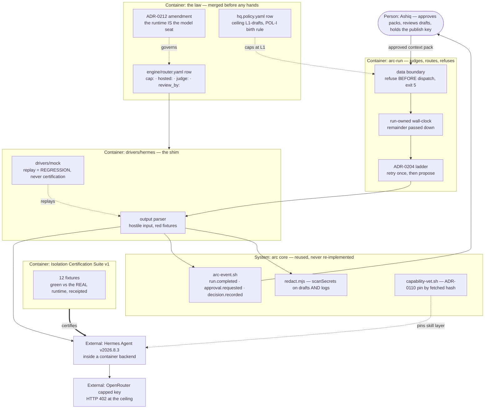

# PLAN.md — arc `engine` · Cycle 7: "The Hired Hands"

> Cycle 6 ("The Model-Agnostic Foundation") shipped the engine and is archived at
> `archive/PLAN-cycle6-2026-08-03.md` / `archive/PROGRESS-cycle6-2026-08-03.md`. It closed with its
> central claim **unproven**: REQ-08 required three real runs on a non-Claude driver and got zero,
> because nothing runnable was installed and no credential existed. **This cycle inherits that, not a
> green row**, and its whole shape is a response to it.
>
> Design source (frozen, not editable here): `docs/strategy/plans/PLAN-executor.md` v2.0. That file is
> the decision record (REQ-01…07, EXE-A…K, no-gos, rabbit holes); **this** file is the buildable cycle
> cut from it. Attack findings mutate this plan, never the source. Trigger: the owner's **Build-out
> Mandate, 2026-08-09** — a recorded decision, put on the spine in Phase 04 and cited by every ADR.
>
> **ADR band note:** engine holds 0200–0299. `0207` was written on 2026-08-11 by the **memory** lane
> (`d1fdaab`) **with the owner's approval** — retiring a migration proof is an engine decision and
> memory needed it to land its hooks, so it is sanctioned rather than a stray. It was still invisible
> from here: this worktree read "highest is 0206", and 0207 surfaced only by checking sibling
> worktrees, because the band table and `wip-line` each see one worktree alone. This cycle therefore
> numbers **0208–0219**.

## Goal

`arc-run --process X --driver hermes` executes an arc process on ONE external agent runtime under the
same contract as every other engine driver — provider-capped money, run-owned wall-clock,
schema-validated output, full receipts with scrubbed trails, isolation **certified against the real
runtime**, an L1-drafts ceiling enforced by the live policy engine, and explicitly unconstrained
internal thinking — and leaves behind a reusable **hiring kit** so the second runtime hire is a shim
and a checklist rather than a project, and external agents become receipted contract employees
instead of shadow IT.

## Current state

Measured **2026-08-12** against `777808f`, not inherited: the design source's own snapshot is dated
2026-08-09 and is wrong in five places, recorded under Drift below.

- **Stack:** arc itself — an AI build harness. Node 18+, bash-3.2-safe, zero external deps, YAML
  configs, append-only JSONL spine. **2246** bats tests across a **19-job** CI matrix (ubuntu/macos/
  windows). CI runs on PR and dispatch only, never on a push to `main`.
- **Entry points:** `.claude/scripts/engine/arc-run.mjs` (517 L) · drivers at
  `.claude/scripts/engine/drivers/{claude-code,codex,generic-api}.mjs` over `common.mjs` ·
  `engine/router.yaml` (83 L) · `hq.policy.yaml` (146 L, 4 action kinds, all L0–L1) · spine emitter
  `.claude/scripts/hq/arc-event.sh` → `.mjs` · secret scan `.claude/scripts/hq/lib/redact.mjs`
  (14 `DENY_RULES`) · capability vetting `.claude/scripts/develop/capability-vet.sh` with
  `capability-allowlist.txt` (**1 entry:** `madge`) and `capability-lock.json`.
- **Conventions:** driver CLI is `run PROCESS INPUT_JSON BUDGET` → JSON on stdout + a cost
  sidecar; **the real exit map is `{ OK: 0, DRIVER_FAIL: 1, BUDGET_DECLINED: 2 }`**
  (`common.mjs:30`). Budget is already a property of the RUN, not an attempt (`arc-run.mjs:147`).
  Escalation is ADR-0204's ladder: one same-tier retry → `approval.requested` proposal → stop. Emits
  are verified to have landed in `events/` and not `_quarantine/` (`verifyLanded`). Lints ship
  WARN-first and are promoted on `docs/trial-ledger.md` evidence.
- **What this machine can and cannot do, checked rather than assumed:** `ollama` is **serving** on
  `:11434` with `llama3.1:8b` · `docker` is installed but its **daemon is not running** · `codex` is
  installed but **broken** (throws on `--version`) · **no `.env` exists and no provider key is set** ·
  `.env.example` documents `ARC_LEADS_*` and carries **zero `ARC_LLM_*` rows**, so the existing
  `generic-api` driver's credential contract is undocumented · neither `hermes` nor `openclaw` is
  installed.
- **Do-not-touch:** the 3 existing drivers and ENG-D's exit map (ADR-0219 keeps the contract intact) ·
  `hq.policy.yaml` and `.claude/scripts/hq/lib/policy/**` are ungrantable resources, edited only by
  reviewed diff · `docs/adr/`, `docs/retro-log.md`, `docs/trial-ledger.md`, `tests/` stay root organs
  (ADR-0053) · `docs/evidence/**` and `docs/archive/**` are frozen (ADR-0058) · **the 3 pilot
  processes carry another cycle's pinned `baseline.sha256` evidence — never regenerate them** ·
  anything hashed in `tests/fixtures/sync-golden/tree-manifest.txt` needs a named regeneration step.
- **Absent today:** any runtime driver, the certification suite, `cap:`/`hosted:`/`judge:`/`review_by:`
  router fields, a data-boundary concept at any layer, and the draft process. This cycle builds each
  from nothing.
- **Drift the design source records wrongly:** it calls a 5-code exit map "inherited" and **no such
  map exists** (ADR-0219) · it writes drivers at top-level `drivers/`, they live at
  `.claude/scripts/engine/drivers/` · it says C6 shipped **4** drivers, it shipped **3** · it implies a
  `data:` router field exists, none does · the spine vocabulary is **44** kinds, not 18 or 22 — and
  `approval.requested`, `decision.recorded`, `run.completed`, `cost.incurred` and `kickoff.done` are
  all present, so "zero new event kinds" is achievable.

## Success requirements

| REQ | User outcome | Measurable acceptance | Phase | Status |
|---|---|---|---|---|
| REQ-00 | The hire is proven runnable before anything is built on it | On this machine: the Docker daemon is up, `hermes` is installed at tag `v2026.8.3`, and a **container-backed** backend (never `local`) is configured; one hand-run headless invocation of `hermes -z` on a fixed pinned prompt returns stdout that `JSON.parse` accepts, its wall-clock is recorded, and the `--usage-file` sidecar exists. **The smoke run is pointed at the already-serving local `ollama` endpoint** (`llama3.1:8b` on `:11434`) — no OpenRouter key exists until Phase 07 and an uncapped key may never be used, so the steel thread costs nothing and needs no credential. If the runtime cannot target a local OpenAI-compatible endpoint, REQ-00 names the credential it does use and REQ-05's key issuance moves forward to this phase. **The enforcement layer for each of REQ-02's 12 fixtures is named here, on paper** — container, arc-run, shim, provider or config — so an UNPROVABLE lands on day 1 rather than on day 4.5. The mandate is on the spine as an `approval.requested` followed by the `decision.recorded` that decides it — the payload shape is closed to `decides`/`verdict`/`reason` and `decides` must be a real ULID, so a standalone decision receipt would quarantine silently — and the merged ADR-0212 amendment is on record. **Any of these failing fires EXE-A's STOP here**, at 1 day burned, instead of at Phase 06 — this REQ exists because C6 burned its whole cycle before discovering the same class of gap | 04 | active |
| REQ-01 | A runtime is one more driver, not a special guest | `drivers/hermes` honours the **real** ENG-D contract (`run PROCESS INPUT_JSON BUDGET` → JSON on stdout, cost sidecar, exit `0`/`1`/`2` per ADR-0219), `--version` returns the runtime version plus **one pinned config hash whose preimage is named explicitly** — the runtime config file, its egress/network policy, and the vetted skill list, each hashed through a total type-tagged encoder that refuses what it cannot represent (a canonicaliser that silently coerces is a collision generator), and ADR-0204's ladder is inherited exactly (one same-tier retry → `fail/schema` + proposal receipt). An **adversarial pass by 2 fresh agents on different surfaces** attacks the output parser with pinned red fixtures — junk, ANSI flood, truncated JSON, injection-shaped output, empty stdout — and every hole found is pinned as a fixture. `drivers/mock` replays a pinned transcript for keyless CI regression | 05 | active |
| REQ-02 | Isolation is certified against the real thing, not promised | The 12-fixture Isolation Certification Suite runs green **against the real runtime, human-started, once**, with the run receipts attached as the evidence bundle. **The data-boundary refusal mechanism is built HERE, not in Phase 08** — fixtures 2 and 3 assert it, so certification cannot borrow a gate that does not exist yet; Phase 08's REQ-06 then builds the context-pack semantics (approval, batch, angle, feedback) *on top of* this mechanism rather than introducing it. Fixture 7 carries a **behavioural** arm as well as its config-pin diff: an attempted outbound connection to a host outside the pinned allowlist must actually fail, because a config match is a promise and this REQ's whole outcome is that promises do not count. **Fixtures 4 and 10 need a live capped credential** (an env audit needs a key to audit; an exhaustion test needs a key to exhaust), so the key is provisioned in **Phase 04** rather than Phase 07 — REQ-05 still closes in Phase 07, but a certification that STOPs for want of a credential would fire the kill criterion for a scheduling bug rather than a real isolation gap, and that is the worst outcome this plan can produce. A mock-green run is labelled `regression`, never `certification`, and the label is asserted by a test rather than written by hand. CI reruns the suite on `drivers/mock` for regression only. **Any fixture that cannot be proven without netns/seccomp/VM work is recorded UNPROVABLE and fires the STOP** — an unprovable boundary is a no | 06 | active |
| REQ-03 | Every dispatch is a policy-grade receipt with a trail | `run.completed` carries the engine's existing payload with **zero new event kinds**; the MP-F model seat records `hermes` + version + config hash (ADR-0212); absent cost or effort fields stay absent. A **scrubbed transcript per dispatch** is stored at `initiatives/engine/evidence/phase-NN/`, and the 3-planted-key fixture shows zero leaks across the **four named artifact classes — draft output, scrubbed transcript, `run.completed` receipt payload, and the cost/usage sidecar** — with a negative control proving the check can fail. Win-rate per class is **derivable** from receipts — writing the reader is explicitly out of scope | 06 | active |
| REQ-04 | Hiring is a reviewed, receipted, expiring, revocable act | **ONE reviewed `router.yaml` diff** adds the runtime row with `cap:` (`L1-drafts`), `hosted:`, `judge:` and `review_by:` **all mandatory — a row where any of the 4 is absent, empty, `null` or malformed fails the router load**, asserted by hostile fixtures covering each of those four inputs per field, because "missing" and "present but empty" are different inputs and a near-miss that loads is a guard that cannot fail. `review_by:` is enforced **at load time**: dispatching through an expired row refuses naming the row and emits **one idempotent** rejustify-or-retire proposal. The **same change** carries the executor process's `hq.policy.yaml` row (POL-I birth rule, ceiling L1) with birth-lint green, and the termination spec (key revoke + row disable) | 07 | active |
| REQ-05 | Money cannot exceed the cap, even on an opaque runtime | The runtime holds its own **OpenRouter capped key** whose non-resetting ceiling is a figure the owner records **before issuance**. Fixtures: an exhausted key produces `fail` / `reason: budget` with zero silent continuation and the provider's real **HTTP 402** asserted, never a mocked one · a wall-clock overrun exits `2` at the budget line and **charges the run, not the attempt** — proven by a fixture forcing one retry plus one fallback hop and asserting total elapsed stays inside the stated cap · cost fields are provider-reported or absent. Class budgets are set **from the first 3 calibration runs' recorded durations**, never guessed | 07 | active |
| REQ-06 | The input is as governed as the output, and no thinner than the job needs | Draft inputs are `external-ok` **context packs approved by the owner before dispatch**; one approval covers **N dispatches with N declared at approval**, per-dispatch receipts stay individual. The pack bounds data, not the angle. Accepted drafts and rejection reasons may ride the next pack. Fixture: a pack carrying a planted `internal-only` marker is **refused before the runtime process starts**, exiting `5` at the arc-run layer (ADR-0219), with a negative control proving the check can fail — and the identical fixture runs against the **carry-over path** (accepted drafts and rejection reasons riding a later pack), because that is a second, automated route by which runtime-generated content re-enters an owner-approved pack. **ONE confinement function, every fixture-supplied path through it** — never two call sites that can drift | 08 | active |
| REQ-07 | One real job with a verdict, not just a pulse | A `build-in-public-draft` process is authored (output schema `{draft, sources, task-class, pack-ref}`) and run through the runtime **≥3 times on arc's own build-out journey**, with `run.completed` receipts confirmed present in `.claude/state/hq/events/` and **absent from `_quarantine/`**. Each draft gets an accept/reject + one-line-reason receipt (`approval.requested` → `decision.recorded`). Verdict arm is **capability-gap**: no current driver runs this class, so a paired baseline is impossible and **honestly waived in one line**, never fabricated. Drafts are surfaced for human pickup; **publishing is a human copying it out**. Win, lose or split, the receipt is the deliverable | 08 | active |

## Appetite

**7.5 working days hard cap** — 1.5 weeks at a 5-day week (owner-ruled 2026-08-09, full appetite
locked, the lean fallback offered and declined).

**The design source says "1.5 weeks (8 working days)" and those are not the same number.** 1.5 weeks
is 7.5 working days; "8" is a rounding-up that only holds if a week is longer than five days. The
cap is therefore written as **7.5**, the number the phases actually force a decision about, rather
than the rounded one — this is the same arithmetic slip Cycle 6 caught in its own design source
("2 weeks" against phases summing to 13 days), and rounding in the plan's favour is how a cap stops
being a constraint.

Phases allocate **7 of 7.5**, so the slack is **half a day, and that is thin** — 93%, which
`kickoff-lint` flags and is right to. It is not padded to look better: portfolio C4 ran 112% on a
100%-allocated plan, and evolve C7 and policy C9 both closed at exactly 100%. The half-day is the
real margin, and the pre-decided cut below is the real valve.

**Tier:** M

**Kill criteria.** The 50% point is day 3.75, which falls *inside* Phase 06 (days 2.5–4.5) while it is
still on schedule — a tripwire that fires on an on-track run is one that learns to be ignored, the
exact shape `docs/trial-ledger.md` already records for `appetite-sum`. So the checkpoint is read at
**day 5**, half a day after Phase 06 was due to close:
**if REQ-02 is not certified against the real runtime at 5 days burned, stop** — bank the shim and the
certification suite as documentation, record "demand-triggered retry", and the build-out moves to the
next module. Three independent hard STOPs sit above that: **no candidate green on the must-haves →
STOP at Phase 04** (recorded "no eligible runtime yet") · **REQ-02 unprovable without sandbox
infrastructure → STOP** (an unprovable boundary is a no) · **runtime API/CLI churn eats more than 2
days → bank and fall back to existing drivers**. At 100% → cut or kill, never extend silently.

**Each STOP's evaluation is itself evidence.** Whichever phase carries a STOP condition records an
explicit line at its close — `STOP evaluated: fired` or `did not fire, because X` — **even when it
does not fire**. A STOP that is never written down because it never fired is indistinguishable from
a STOP nobody checked, and a build-out mandate is exactly the pressure under which that difference
stops being noticed.

**The pre-decided cut, named now rather than argued later:** when the cap is threatened, Phase 08
loses its **hand-written results table** first, and then **any dispatch beyond the three-run floor**,
in that order, recovering at most ~0.5 day. Read that second clause precisely: it cuts the fourth
and later dispatches, never the three — those are named uncuttable two sentences down, and a cut
that quietly eats its own floor is not a cut, it is a rewrite. What that cut cannot buy: an overrun already incurred in
Phase 06, which holds all of the certification work and is where overrun risk actually concentrates —
that is caught only by the day-5 checkpoint. **The 3 real runs are never cut**, and neither is the
adversarial pass; they are the only two things in this cycle that test the work outside its own
fixtures.

## Architecture (C4 concepts, Mermaid flowchart)

## Key decisions (ADR index)

| # | Decision | Status |
|---|---|---|
| 0208 | EXE-A — the runtime is Hermes Agent, pinned, and container-backed | accepted |
| 0209 | EXE-B — the pinned unit is the skill layer, and the runtime stays patchable | accepted |
| 0210 | EXE-C — wall-clock is a property of the run, and fire-and-forget is a defect | accepted |
| 0211 | EXE-D — the credential is capped and in env, and runtime memory is proven off | accepted |
| 0212 | EXE-E — an agent runtime occupies the model seat (amending ADR-0069 blocks a and b) | accepted |
| 0213 | EXE-F — the money ceiling is the credential, and no cap is zero-overshoot | accepted |
| 0214 | EXE-G — inputs are owner-approved packs that bound data, not the take | accepted |
| 0215 | EXE-H — the trail is the artifact, and drafts are scanned like logs | accepted |
| 0216 | EXE-I — tenure is enforced at load time, and every hire is planned obsolescence | accepted |
| 0217 | EXE-J — a hire is a receipt, and the row cites the decision that made it | accepted |
| 0218 | EXE-K — arc verifies outcomes and never prescribes the contractor's process | accepted |
| 0219 | The data boundary is refused above the driver, and ENG-D's three-code exit map stands | accepted |

## Non-negotiables

- ENG-D's **driver-level** contract is untouched and the runtime adapts to arc, never the reverse — `common.mjs`'s exit map stays `0` ok, `1` driver-fail, `2` budget-declined, and this cycle adds nothing to it (ADR-0219).
- The data boundary is refused **above** the driver, at the arc-run layer, exit `5`, before the runtime process starts (ADR-0219). The arc-run exit space is separate from the driver's and already uses `0`/`1`/`2` for its own failures, so ADR-0219 publishes the full arc-run table before any fixture asserts `5`. The mechanism is built in Phase 06 because REQ-02's fixtures 2 and 3 assert it; specs for earlier phases carry this bullet as a forward commitment, not a claim already true.
- Certification means the REAL runtime, human-started, with receipts attached; a mock-green run is labelled regression and never certification, and that label is asserted by a test rather than written by hand. No green suite, no dispatch.
- Every gate, parser and shim this cycle ships gets an adversarial construct-a-breaking-input pass **before the PR that ships it merges** — never deferred to the phase close, because a rule only the close can enforce gets skipped for a whole phase. TWO fresh agents on different surfaces (decision logic, and the shell/OS boundary), neither having seen the implementation, attacking the **fixtures and tests as well as the code** — a green suite the author wrote is evidence about the author. Every hole is pinned as a fixture, and the attacker's prompt carries this cycle's running list of already-fixed defects with the instruction to check each one in every OTHER file. This binds REQ-04's router loader, REQ-06's boundary refusal and the POL-I birth-lint exactly as it binds REQ-01's parser.
- Every gate ships with a negative control that actually runs and proves the check can fail; a pass condition that is only an absence is not a pass, and a probe that shells out asserts it RAN before asserting what it printed.
- No component changes a model tier at run time; every production routing change is a reviewed `router.yaml` diff citing ADR-0069, and escalation ends in a proposal receipt (ADR-0204). Runtimes never self-register.
- The L1-drafts ceiling and the human publish gate are absolute. A draft that publishes itself is an incident, and publishing is a human copying it out — always.
- arc constrains boundaries (data in, actions out, money, time) and verifies outcomes; it never prescribes the runtime's method, model choice, or reasoning style. Review is accept/reject plus one line, never a line-edit (ADR-0218).
- Zero new event kinds; the closed vocabulary is derived by query, never by a remembered count. Every emit is VERIFIED to have landed in `events/` and not in `_quarantine/` — exit 0 from a fire-and-forget writer is not evidence anything was written.
- An unavailable cost, duration or fingerprint field stays absent — never estimated, never inferred, never interpolated (ADR-0069 b5, Constitution E3). Budgets are calibrated from recorded receipts, never guessed.
- Money is capped at the credential, and the honest claim is that the request crossing the ceiling completes while every later one is refused — no zero-overshoot claim is made anywhere.
- Human-started runs only this cycle. No daemon, no runtime-side cron or webhook pointed at arc, no unattended execution.
- The 3 pilot processes' pinned baselines are another cycle's evidence and are never regenerated; any file the sync-golden manifest hashes gets a named regeneration step that diffs the delta first and confirms only intended paths moved.
- Before editing any shared root organ this cycle touches — `hq.policy.yaml`, `engine/router.yaml`, `docs/adr/`, `tests/`, `.github/` — run `git log origin/main --oneline -5 -- PATH`. A hit since this branch's point means the collision is already in flight, and at the merge take the STRONGER version, never the earlier one. This is not hypothetical here: another live lane already took ADR-0207 inside engine's own band.
- Zero-dep Node plus POSIX is inherited: no vendor SDK in the shim, plain process invocation — checked by `package.json` carrying no new runtime dependency.
- A program embedded in a shell string carries no apostrophes and no single quotes, in code OR in comments — enforced by a grep check inside the adversarial pass this cycle already requires, never by vigilance, because this rule was written down and then broken three times anyway.
- All new lint ships WARN-first in TRIAL; evidence bundles are lane-scoped (ADR-0055); the mandate accelerates SEQUENCING, never QUALITY.

## No-gos (explicitly out of scope)

- **A second runtime.** One hire. The kit exists so the second is cheap, not so it happens now.
- **Any L2+ action, and no POL-G eligibility attempt.** Drafts and read-only outputs only; the eligibility fixtures belong to a later rung with its own evidence.
- **Publishing, ever.** Not automated, not semi-automated, not "just this once".
- **A 24/7 daemon or unattended runs.** That is the scheduler's own build-out slot, on the policy engine's terms.
- **Messaging-channel bindings.** A messaging-shaped need is recorded as an explicit deferral; the binding is its own v2 trigger (owner-ruled 2026-08-09).
- **Marketplace skill installs beyond the vetted pinned list.** ClawHavoc and ToxicSkills are the named threat model, and they are not hypothetical.
- **An auto-classifier for context packs.** The owner is the v1 classifier; a classifier is a security-critical parser deserving its own cycle.
- **Key-vending automation.** Issuing and rotating capped keys stays a human act.
- **A win-rate reader, dashboard or scoring system.** Receipts make win-rate derivable; deriving it is another slot's work, and scoring math is bench's.
- **Review sampling.** Rung 2 is earned through trial-ledger evidence, never assumed.
- **Auto-updating routing**, and no scoped-MCP "company toolbox" handover to the runtime (parked as a v2 direction, on the record).

## Rabbit holes

- **Isolation perfectionism.** The 12-fixture suite is the bar. A newly imagined attack class becomes fixture #13 by ADR, not an open-ended hardening sprint.
- **Building sandbox infrastructure.** If a fixture needs netns or seccomp, it is recorded UNPROVABLE and the STOP fires. This cycle configures a container backend; it does not write one.
- **Runtime feature-parity chasing.** The output contract is the equalizer. The runtime is a worker, not a platform to be fully exploited.
- **Scoring-system invention for verdicts.** Accept/reject plus a reason. Scoring math is bench's, in its own slot.
- **Transcript archaeology.** Scrub and store. Parsing and mining transcripts is absorb's job.
- **Ladder acceleration.** Rungs 1–4 of the unlock ladder are documentation, not scope; building any of them early is scope creep with a table for an alibi.
- **Chasing the contested CVE record to a verdict.** Two researchers disagreed; the disagreement is recorded and the ceiling stays L1 either way. Resolving it is not this cycle's job.

## Assumptions ledger

| Assumption | How we'd know it's wrong (trigger) | Phase that tests it |
|---|---|---|
| A-01: **the owner (Ashiq) starts Docker Desktop**, and the daemon then runs Hermes Agent's container backend on this Windows box | **one clock, not two: the smoke invocation has not succeeded by the end of Phase 04's 1-day appetite** — whether because the daemon never started, the runtime would not install, or it will not run headlessly. EXE-A's STOP fires there (ADR-0208) and the build-out moves on rather than the cycle sliding. The row names the human act deliberately: on a GUI-launched daemon that step, not the setup effort, is the likely time sink inside a hard-STOP phase | 04 |
| A-02: `hermes -z` stdout is deterministically parseable by a shim that rejects everything else | a red fixture is **accepted**: truncated JSON, an ANSI-flooded stream, or an empty stdout returns success from the parser — or a valid output is rejected. Either direction means the envelope is not what the docs describe | 05 |
| A-03: the shim's wall-clock is charged to the RUN, not to each attempt | a fixture forcing one same-tier retry plus one fallback hop shows total elapsed exceeding the stated cap, **or** a timeout receipt reads `reason: driver` instead of `reason: budget` — this defect already shipped once in this lane (retro-log 2026-08-03) and a new enforcement point is where a fixed defect returns | 05 |
| A-04: isolation is certifiable at container-plus-config level without arc building sandbox infrastructure | any of the 12 fixtures needs netns, seccomp or VM work to assert honestly → recorded UNPROVABLE and the STOP fires; the suite and findings bank as the requirements doc for a future infra cycle | 06 |
| A-05: the capped-key ceiling figure is a number the owner names before issuance (ADR-0213 records the mechanism, deliberately not the number) | Phase 07 reaches key provisioning with no figure recorded — the key is not issued, REQ-05 blocks, and no number is invented to unblock it (ADR-0069 block d's precedent) | 07 |
| A-06: the pack boundary check (REQ-06) is a real **parse** of the pack's declared classification, not a substring match on the literal text `internal-only` | a fixture pack declaring itself `external-ok` while carrying an `internal-only`-tagged block inside carried-over accepted-draft content is **not** refused — the guard missed what a parse would have caught. This lane shipped exactly that shape once: the propose-only guard was a grep, and a mutant module walked straight past it | 08 |
| A-07: the `router.yaml` loader fails **closed** on each of the 4 mandatory fields being absent, **empty, null or malformed** — never silently defaulting or dropping the row | a fixture row with one field set to an empty string, to `null`, or omitted entirely still loads, or the row is skipped instead of failing the load. "Missing" and "present but empty" are different inputs, and a near-miss that passes is the recorded shape of a guard that cannot fail | 07 |

## External dependencies

| Dep | Interface | Fake impl | Real impl | Contract test |
|---|---|---|---|---|
| Hermes Agent runtime | `drivers/hermes` — process invocation, no SDK | `drivers/mock` replaying a pinned transcript, **regression only** | pinned tag `v2026.8.3`, container backend | `tests/engine-hermes-contract.bats` — same suite against fake and real; the real arm asserts the shim's own code path executed |
| OpenRouter capped credential | `ARC_HERMES_API_KEY` in env (ADR-0211) | keyless mock arm | human-provisioned non-resetting capped key | exhausted-key fixture asserting the real **HTTP 402** → `fail`/`budget` |
| Docker container backend | Hermes Agent backend config, hashed per ADR-0209 | n/a — the fake needs no container | Docker Desktop daemon on this machine | certification fixtures 1, 6 and 7 (repo write blocked, traversal blocked, egress config matches its pin) |
| Hermes Agent's skill/plugin surface | `capability-vet.sh` scan feeding `capability-lock.json` (ADR-0110/0209) | n/a — `drivers/mock` carries no skill surface | `/arc-capability` run against the runtime and its allowlist decision recorded **before** Phase 04's `--version` can report a config hash | fixture 7 fails closed if `capability-lock.json` holds no entry to compare the live config against |
| ABS-D owner-judge grammar (absorb, its own plan) | `judge:` router field + verdict receipts | accept/reject via existing kinds | lands with absorb's cycle | one-line deferral recorded (ADR-0214); grammar kept ABS-D-compatible |

## Pre-mortem (Klein)

| # | Failure cause | Mitigation or accepted |
|---|---|---|
| 1 | **The C6 repeat: the cycle ships the machinery and never proves it.** REQ-02 and REQ-07 both need a real runtime and a real credential on this box — the identical dependency that left C6's REQ-08 at zero real runs, and that left policy C9 with 4 new spine kinds and 0 production emissions. Today: no key exists, Docker's daemon is down, and neither runtime is installed | **Mitigated by moving the discovery to day 1.** REQ-00 makes a live headless invocation a Phase-04 exit criterion, so the gap fires at 1 day burned instead of 5. The 3 real runs are named uncuttable in the Appetite section, and the close asserts the **production** receipt count read from the spine, never the fixture count — policy C9's retro says only the ledger can say whether a cycle was pulled or pushed |
| 2 | **Certification theater:** the suite is green on `drivers/mock` while the real path never executes. This lane's own 2026-08-03 retro: `ARC_DRIVER_FAKE` returned before `produce()` ran, so "every driver satisfies the same contract" passed for all three drivers while none of their real code executed, and codex was not even installed | **Mitigated:** REQ-02 makes the real-runtime run the certification and the mock run a *regression*, with the label asserted by a test. The fake swaps the RESPONSE, never the code path, and the contract suite carries a separate probe proving the real path runs (unreachable endpoint → reaches the shim's own code → correct failure exit). ADR-0208's container clause exists because a config-only claim would be green and meaningless |
| 3 | **The shim starts its own clock**, so a run with one retry and one fallback hop quietly takes a multiple of its cap and the receipt blames the driver. Already shipped once here (retro-log 2026-08-03, 4× the stated cap) | **Mitigated:** ADR-0210 makes the budget a property of the run and the remainder is passed down; exhaustion is its own outcome and must not trigger the retry path it would multiply. Assumption A-03 names the exact fixture, and the adversarial pass is pointed at the remaining-time arithmetic specifically, because a fresh-budget bug is invisible to any single-attempt test |
| 4 | **Side-channel exfiltration during drafting.** A prompt-injected runtime with network access leaks the pack or the workspace through a crafted URL, an image reference or DNS-encoded subdomains — **in a channel that never appears in the draft the human reviews**. Drafts-only and human-reviewed protect visible output, not side effects during generation | **Partly mitigated, the residue is accepted in writing, and it is wider than a config check makes it look.** ADR-0215 stores a scrubbed trail per dispatch and reviews draft *plus* trail, because injection shows in trails; ADR-0208 commits to a container backend. But fixture 7's config-pin diff is a **declarative** check — a pin that is itself too permissive, or enforcement that has drifted from its pin, both read GREEN — which is why REQ-02 now requires a behavioural arm that actually attempts a disallowed connection. What none of that closes is a leak through a genuinely allowed egress path — that is why the ceiling stays L1-drafts regardless of how green the suite comes back, and why REQ-03's trail is a REQ rather than a nicety |
| 5 | **Build-out pressure produces a perfectly safe, perfectly mediocre contractor** — the adversarial pass gets compressed, or stingy budgets and line-edited review strangle the work while every safety count reads green | **Mitigated:** the mandate accelerates sequencing and never quality, written as a non-negotiable. Budgets come from calibration receipts (REQ-05), review is accept/reject only (ADR-0218), and the retro is required to read **accepted-draft quality**, not just safety counts — a quality gate whose pass condition is only an absence cannot detect mediocrity (retro-log 2026-07-30) |

## Phases (risk-ordered)

| Phase | Capability | Appetite | Status |
|---|---|---|---|
| 00 | Steel thread — **parked, shipped in Cycle 6.** The canonical process layer, `arc-run`, the driver contract and `router.yaml` this cycle builds on; its appetite belongs to that cycle | — | ✅ done 2026-08-03 |
| 04 | **The law, and proof the hands exist.** Mandate `decision.recorded` on the spine · ADR-0212 amendment merged before any routing row · runtime installed at its pinned tag behind a container backend · ONE live headless invocation returning parseable output — **or the STOP fires here** | 1 day | pending |
| 05 | The shim — `drivers/hermes` on the real 3-code contract, `drivers/mock` replay, and the two-surface adversarial pass on the output parser | 1.5 days | pending |
| 06 | **Certification or STOP** — the 12 fixtures green against the real runtime with receipts attached, plus the scrubbed-transcript evidence path | 2 days | pending |
| 07 | The hire — ONE reviewed `router.yaml` diff carrying the policy row and the termination spec, the capped key, and the calibration baseline | 1 day | pending |
| 08 | The job — draft process authored, context-pack flow, ≥3 real runs with per-draft verdicts, a **hand-written results table** (retro prose, never a reader or tool — the win-rate/dashboard no-go stands), retro and seal | 1.5 days | pending |

Phase 04 is this cycle's steel thread: the thinnest end-to-end slice is the law merged plus **one real
invocation of the real runtime returning output arc can parse** — input, core flow, output. It is
deliberately not a paper phase, because the one thing C6 proved is that a runtime nobody ran is a
runtime nobody has. The external dependencies above first appear here rather than in Phase 06, and
their contract suite runs against `drivers/mock` in Phase 05 before the real certification in Phase 06.
