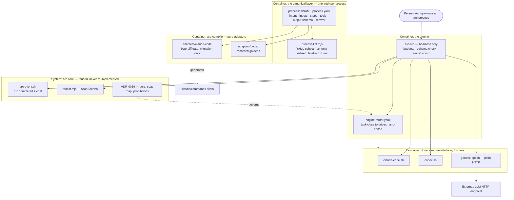

# PLAN.md — arc `engine` · "The Model-Agnostic Foundation"

> Cycle 6 · lane `engine` — born 2026-08-03. Design source (frozen, not editable here):
> `docs/strategy/plans/PLAN-engine-process-layer.md`. That file is the decision record (REQ-01…07,
> ENG-A…E, no-gos, rabbit holes); **this** file is the buildable cycle cut from it. Routing, tiers
> and the receipt schema are **inherited** from [ADR-0069](../../docs/adr/0069-balanced-model-policy.md)
> — this cycle decides zero new "which model where" forks. Attack findings mutate this plan, never
> the source.

## Goal

arc's processes stop being Claude-Code-dialect prisoners: a canonical model-neutral process layer
(3 pilot commands, byte-diff-proven) plus an engine that runs any process on any of 3 drivers with
hard budgets and a hand-edited routing table — so models become swappable parts and every future
model is an upgrade, not a migration.

## Current state

Verified at **`7abeda1`** (2026-08-02 22:57 IST), not inherited from the design source, whose own
snapshot is dated 2026-07-22 and has rotted in four places (recorded under Drift below).

- **Stack:** arc itself — an AI build harness. Node 18+, bash-3.2 safe, **zero external deps**:
  there is no `package.json` and no `node_modules`, so Node's stdlib has **no YAML parser and no
  JSON-Schema validator**. Tests are bats; CI is a 19-job ubuntu/macos/windows matrix.
- **Entry points:** 24 command files at `.claude/commands/arc-*.md` — markdown prompt files with
  YAML frontmatter (`description`, optional `argument-hint`, `allowed-tools`) over prose steps.
  The 3 pilots are `arc-commit.md` (19 L), `arc-review.md` (36 L), `arc-kickoff.md` (132 L).
  Scripts sit under `.claude/scripts/{core,hq,plan,council,review,develop,design}`.
- **Conventions:** lints print `[check-id] FILE:LINE — Expected/Found/Example` and ship WARN-first,
  promoted to BLOCK only on `docs/trial-ledger.md` evidence. Exit codes: `0` pass · `1` lint fail ·
  `2` strict-emit reject · `3`–`5` resolver. Receipts go through
  `bash .claude/scripts/hq/arc-event.sh emit KIND --payload JSON`, which already accepts
  `--process` `--model` `--cost` `--outcome` `--run-id` `--evidence` and has a `--strict` mode that
  exits 2 on rejection.
- **What the engine can reuse instead of building:** `run.completed` and `cost.incurred` are
  **already in the closed 22-kind vocabulary** (`.claude/scripts/hq/lib/validate.mjs`), so no
  ADR-0026 extension is needed. `PROCESS_RE` there already pins `name@semver` on every receipt.
  `redact.mjs` exports `DENY_RULES` (14 bounded rules) and `scanSecrets()` for REQ-07.
  `product-lint.mjs` auto-discovers every `products/*/manifest.json` via `readdirSync`, so
  registering the new `engine` product needs **no** edit to `.claude/scripts/core`.
  `council-juror.mjs:144-149` is the proven fetch-plus-exit pattern — but it is **Node-only**
  (`process.exitCode`, an unref'd backstop, undici teardown) and `drivers/generic-api.sh` is a
  shell entry point, so it cannot be reused verbatim. The resolution is arc's own existing shape:
  a thin POSIX wrapper over a Node core, exactly as `arc-event.sh` wraps `arc-event.mjs` (ADR-0031).
- **Hot / high blast radius:** all 3 pilots are hashed in `tests/fixtures/sync-golden/tree-manifest.txt`
  (lines 32, 41, 47 of 160) under a SHA256 byte-identity gate — a second, pre-existing check on
  REQ-02, and a mandatory named regeneration step for every intended move.
- **Do-not-touch:** the 21 non-pilot commands · `docs/adr/`, `docs/retro-log.md`,
  `docs/trial-ledger.md`, `tests/` stay root organs (ADR-0053) · `docs/evidence/**` and
  `docs/archive/**` are frozen (ADR-0058) · `.claude/scripts/{core,hq}` are consumed, not edited —
  with **one named exception, recorded rather than silent**: `validate.mjs`'s `PROCESS_RE` gains an
  `export` keyword (value, position and behaviour unchanged) so `process-lint` can assert against
  the spine's own regex instead of a copy that would drift. `product-lint.mjs` needs no edit at all —
  it auto-discovers every `products/*/manifest.json` via `readdirSync`, verified before relying on it.
- **Absent today:** `processes/`, `adapters/`, `drivers/`, `engine/`, `arc-run` — all confirmed
  absent. This lane builds every one from nothing.
- **Drift the design source records wrongly:** it says 22 commands / 23 agents (really **24 / 28**);
  it says `.codex/` and `AGENTS.md` exist at root (they **do not**, and never appear in git history
  — so the codex adapter has **no prior art to formalize**); it says 19 non-pilot commands (really
  **21**); and all 3 pilots moved after its snapshot (`4936371`, `4936371`, `36d17ad`). Separately,
  28 agent files carry only 27 `model:` lines — `spec-fidelity.md` has none, so ADR-0069's seat map
  is one seat short of the live census and `router.yaml` would inherit that hole.

## Success requirements

| REQ | User outcome | Measurable acceptance | Phase | Status |
|---|---|---|---|---|
| REQ-01 | One canonical truth per pilot process | 3 pilots exist as `processes/NAME.process.yaml` carrying intent, inputs, steps, abstract tools, a JSON-Schema-subset output contract, eval fixture refs and a semver satisfying the spine's `PROCESS_RE`; for `kickoff-plan` the contract binds to exactly one **named** receipt payload (`kickoff.done` or `approval.requested`) because neither captures the PLAN/spec/ADR files it also authors, and that gap is recorded rather than schema'd away; `node .claude/scripts/engine/process-lint.mjs --all` validates all 3 and exits 1 on each of ≥20 pinned hostile fixtures (bad YAML, each excluded YAML construct, missing schema, unknown schema keyword, unknown tool, invalid `permissions:`, an `evals:` path that escapes the repo or names the process file itself, dialect placeholder in body, malformed neutral placeholder, `x-target-*` key, mismatched `baseline.sha256`) | 0 | validated |
| REQ-02 | Compile, don't rewrite — proven, not asserted | `arc-compile --target claude-code` reproduces all **3/3** pilot files byte-identical to their `7abeda1` baseline after LF normalisation, **or** each non-identical pilot has its residue named, measured in bytes and lines, and adjudicated under ADR-0205's revisit trigger; `tests/fixtures/sync-golden/tree-manifest.txt` shows zero hashes moved for those 3 paths; only then does `processes/` become source of truth and the DO-NOT-EDIT header land as its own commit | 1 | validated |
| REQ-03 | A second dialect exists | `arc-compile --target codex` emits a runnable equivalent for all 3 pilots, **or** names the exact construct it cannot express (ADR-0206 predicts this for `arc-kickoff`'s `agent.invoke`); each output or named failure is pinned as a recorded golden under `tests/fixtures/engine/goldens/codex/`, and regenerating one requires a reviewed diff (`process-lint` FAILs on an unrecorded golden change) | 1 | validated |
| REQ-04 | Any process, any driver, one interface | `arc-run --process commit-msg-draft --driver X` runs headless for X in `claude-code`, `codex`, `generic-api`; output validates against the process's schema on all 3; a schema failure retries once on the same tier, then emits an `approval.requested` proposal receipt and stops — fixture-proven, with `fault_hint` naming `driver` or `process` | 2 | validated |
| REQ-05 | Budgets are hard | `arc-run --budget inr=N,min=M` stops a fixture process that would exceed either bound and reports `outcome: fail` with a budget reason — never silently continues; spend lands on the spine as `run.completed` with `cost.source` recorded, and an unavailable cost field stays **absent** rather than being estimated (ADR-0069 b5) | 2 | validated |
| REQ-06 | Routing is explicit, not magic | `engine/router.yaml` maps task-class to driver plus fallback chain and is hand-edited only; `arc-run --driver auto` resolves through it; an unknown class exits non-zero naming the class and the file to edit; `process-lint` FAILs if any tier named there is absent from ADR-0069 block (a) | 2 | validated |
| REQ-07 | No secrets leak through drivers | every driver artifact (stdout, transcript, cost sidecar, spine payload) passes `scanSecrets()` from the spine's own `redact.mjs`; fixture-proven: a process input seeded with 3 planted keys matching live `DENY_RULES` produces zero artifacts containing any of them, and the negative control proves the check can fail | 2 | validated |
| REQ-08 | A new driver is a shim file, and the engine has been used for real | `commit-msg-draft` runs via `arc-run` on a non-`claude-code` driver **≥3 times on real work**, each rated trivial/typical/hard, with `run.completed` receipts confirmed present in `.claude/state/hq/events/` and absent from `_quarantine/` — **this clause is never cut**. Independently: a 4th driver is stubbed from nothing to its first passing contract fixture in **under 60 minutes**, timed and recorded — this is the first thing the Appetite section's pre-decided cut drops, and if dropped REQ-08 closes `partial: timing untested` rather than blocking the phase | 3 | active |

## Appetite

**14 days hard cap** (owner-set via the design source's "2 weeks", 2026-08-03). The design source's
own phase appetites sum to **13 days**, which only fits a 2-week cap if a week is 7 days — so the
cap is written here as the number the phases actually force a decision about, rather than left as a
word that silently over-commits by 30%. 13 of 14 allocated; the 1 day of slack is deliberate, because
Cycle 4 closed at 112% with none.

**Tier:** M

**Kill criteria:** the design source's tripwire is "50% burnt without REQ-02". 50% is day 7, and
Phase 0 plus Phase 1 sum to exactly 7 days, so that check fires on a perfectly on-schedule run and
cannot tell on-track from in-trouble — the shape `docs/trial-ledger.md` already records for
`appetite-sum`, a gate that learns to be ignored. The check is therefore read **at 8 days burned:
if REQ-02 is not proven, the compile approach is wrong for this codebase** — bank `process-lint`
plus the canonical files as documentation, stop, retro. Independently: **generic-api flaky beyond
2 days of fixes, cut to 2 drivers** (claude-code + codex), bank, and note the third as
demand-triggered. At 100% → cut or kill, never extend silently.

**The pre-decided cut, named now rather than argued later:** phase appetites take 13 of 14 days —
93%, which `kickoff-lint`'s `appetite-sum` flags as too little slack, and it is right to. Cutting
scope is not available (the design source is implemented in full), so the escape valve is named
instead: when the cap is threatened, **Phase 03 loses its promotion review and its 4th-driver
timing run, in that order** — recovering **at most ~1 day**, bounded by Phase 03's 2-day appetite
minus its non-cuttable real runs. Say plainly what that does not buy: this cut **cannot** recover an
overrun already incurred in Phase 00 or Phase 02, which are 4 days each and hold all of the cycle's
novel parser and driver work — that is where overrun risk actually concentrates, and it is caught
only by the 8-day kill checkpoint, not by this valve. The 3 real dogfood runs are not cuttable —
they are the only thing in this cycle that tests the engine outside its own fixtures.

## Architecture (C4 concepts, Mermaid flowchart)

## Key decisions (ADR index)

| # | Decision | Status |
|---|---|---|
| 0200 | ENG-A — a process is one YAML file, with a JSON-Schema output contract and its own semver | accepted |
| 0201 | ENG-B — adapters are pure functions, and a generated file is never hand-edited | accepted |
| 0202 | ENG-C — the byte-diff is a migration gate, and it retires at the flip | accepted |
| 0203 | ENG-D — the driver interface, and which layer owns a retry | accepted |
| 0204 | ENG-E — escalation terminates in a proposal receipt, never in a tier change | accepted |
| 0205 | A canonical process carries one shared body, and no per-target passthrough | accepted |
| 0206 | The tool taxonomy gains `agent.invoke`, and inputs render through a neutral placeholder | accepted |

## Non-negotiables

- Every gate, lint, parser and driver wrapper this cycle ships gets an adversarial construct-a-breaking-input pass in the same section that ships it, run by a FRESH agent that has not seen the implementation, with every hole pinned as a fixture (retro-log 2026-08-02: the author's own 26 inputs found nothing and an unanchored agent then found 9 real holes).
- No component changes a model tier at run time, anywhere, under any condition — every production tier change is a reviewed `engine/router.yaml` diff citing ADR-0069 block (b)(1); escalation ends in a proposal receipt (ADR-0204).
- The 21 non-pilot commands stay hand-written and untouched this cycle, and no agent file is canonicalized.
- `arc-run` is headless only — it never wraps an interactive session.
- Every run emits `run.completed` with its cost through the standard emitter, and the emit is VERIFIED to have landed in `events/` and not in `_quarantine/` — exit 0 from a fire-and-forget writer is not evidence that anything was written (retro-log 2026-08-02).
- An unavailable cost or fingerprint field stays absent — never estimated, never inferred, never interpolated (ADR-0069 block (b)(5) and block (e)).
- Zero-dep Node plus POSIX is inherited: no LangChain-class dependency, no vendor SDK in any driver, plain HTTP for generic-api.
- Eval fixtures for the 3 pilots exist from Phase 0, and every gate ships with a negative control proving the check can fail (retro-log 2026-08-02).
- Editing any file the sync-golden manifest hashes means a named regeneration step: diff the delta first, confirm only intended paths moved, then re-record (retro-log 2026-07-22).
- The CI test-count floor is raised by re-running the count and asserting it equals the live `@test` total, never by hand-typing a number that four separate phase closes must each remember — a hand-maintained count is what rotted silently for five days in arc-orchestrator (retro-log 2026-07-22).

## No-gos (explicitly out of scope)

- **A bench runner.** Eval fixtures are written and pinned; nothing executes them as a benchmark this cycle.
- **Auto-updating routing.** `engine/router.yaml` is hand-edited, forever in v1. No learned weights, no usage-driven rewrites.
- **A fourth production driver.** Three drivers ship. Phase 3 stubs a fourth only to time the north-star, and that stub is not promoted.
- **Full canonicalization.** Only the 3 pilots. The other 21 commands and all 28 agent files stay hand-written.
- **A local-model driver** (ollama / vLLM) — a separate brief, pulled by cost or privacy need, not by this cycle.
- **Prompt-optimization tooling** of any kind.
- **Instrumenting ADR-0069's five metrics.** The engine provides the per-item receipt that metric 1 needs; computing the metrics is a different cycle with its own cap.
- **Promoting any gate to BLOCK** beyond what `docs/trial-ledger.md` evidence supports. Everything new ships WARN-first.

## Rabbit holes

- **A perfect abstract-tool taxonomy.** Seven primitives, capped (ADR-0206). An eighth this cycle is scope creep and routes through `/arc-change`.
- **YAML schema elegance.** The subset is frozen in ADR-0200 and deliberately small; a construct outside it is a parse error, not a feature request.
- **Driver feature parity.** Drivers differ, and the OUTPUT CONTRACT is the equalizer. Chasing parity is how a 2-week cap becomes a quarter.
- **Benchmarking.** The temptation arrives the moment eval fixtures exist. They are fuel for a later cycle, not a scoreboard for this one.
- **Making `arc-kickoff` fully abstract.** It is the complex pilot precisely to find the limit, not to be won. A named residue is a result (ADR-0205).

## Assumptions ledger

| Assumption | How we'd know it's wrong (trigger) | Phase that tests it |
|---|---|---|
| A-01: a genuine ADR-0069 block-(d) trigger has fired. The owner invoked this kickoff but left the placeholder unfilled, and the one mechanically checkable trigger (a lane PLAN naming public release or external users) does **not** fire — so which trigger is recorded as unstated rather than invented (ADR-0069 b5) | the owner names the trigger, or a provider event is recorded. If it is the "second runtime needed" trigger, that is **not** in ADR-0069 block (d)'s list and block (d) needs its amending ADR before Phase 1 closes | 0 |
| A-02: the pilots' prose **and frontmatter shape** are reproducible from one shared body plus the adapter's derived-frontmatter rule, so ADR-0205's no-passthrough rule and REQ-02 can both hold | Phase 1's byte-diff leaves a residue of bytes producible from no shared body — most likely in `arc-kickoff.md` at 132 lines. Independently and already known: `arc-kickoff.md` carries **no `allowed-tools:` line at all** (verified — it and `arc-develop.md` are the only 2 of 24 without one) while still needing `agent.invoke`, `shell.run`, `fs.write` and `ask.human`, so an adapter that derives that line unconditionally ADDS a line the baseline does not have and fails structurally, not on prose | 1 |
| A-03: the frozen YAML subset (ADR-0200) covers all 3 pilots without extension | canonicalizing any pilot needs an excluded construct — anchors, tags, flow collections or merge keys | 0 |
| A-04: 13 allocated days fit inside the 14-day cap with 1 day of slack | Phase 0 and Phase 1 together pass 8 days | 1 |
| A-05: `agent.invoke` alone closes the taxonomy gap for all 3 pilots (ADR-0206) | any pilot needs an eighth primitive to express what it actually does | 0 |
| A-06: the spine's existing `redact.mjs` deny-rules are sufficient for driver artifacts, so REQ-07 reuses rather than rebuilds | a planted-key fixture survives into any driver artifact, or a real key shape is found that `DENY_RULES` has no rule for | 2 |
| A-07: a 4th driver is genuinely a shim — stubbable in under 60 minutes (the design source's north-star) | the Phase 3 timing run exceeds 60 minutes, which means the driver interface leaked engine concerns | 3 |

## External dependencies

| Dep | Interface | Fake impl | Real impl | Contract test |
|---|---|---|---|---|
| LLM HTTP endpoint (OpenRouter / LiteLLM-style) | `drivers/generic-api.sh` — plain HTTPS POST, no SDK | local fixture responder replaying recorded JSON, incl. 429 / 5xx / timeout arms | live endpoint, model pinned in `engine/router.yaml` | `tests/engine-driver-contract.bats` — same suite runs against fake and real |
| `codex` CLI | `drivers/codex.sh` | recorded transcript fixture | the installed `codex` binary | same contract suite, codex arm |
| `claude-code` CLI | `drivers/claude-code.sh` | recorded transcript fixture | the installed CLI | same contract suite, claude-code arm |

## Pre-mortem (Klein)

| # | Failure cause | Mitigation or accepted |
|---|---|---|
| 1 | REQ-02 never converges: the hand-written pilots carry prose no canonical file can reproduce, and days go to rediscovering the same handful of idiosyncratic constructs instead of building the engine | **Mitigated:** pilot order runs simple to complex (`arc-commit` 19 L first, `arc-kickoff` 132 L last), so the cheap files find the format's holes before the expensive one does; ADR-0205 makes a residue a *named result* rather than a failure; the 8-day kill criterion names this exact exit and banks the canonical files as documentation |
| 2 | The fresh-agent adversarial pass — this plan's single most-repeated defence, cited in every phase — is a declared rule with **nothing asserting any given run was actually fresh**. No session identity is recorded, nothing stops the context that just watched a parser being built from also "attacking" it, and the parser-hole class it defends against (council v2/v3, and the 9 holes an unanchored agent found on 2026-08-02 after the author's 26 found none) then ships anyway. A stated control is not a control until something asserts it (retro-log 2026-08-02, arc-portfolio) | **Not mitigated by declaration alone.** Every phase's adversarial-pass exit criterion must record the agent's session id and an explicit statement that it read no implementation file, in the phase evidence pack — a report that omits this is evidence of a report, not of freshness. ADR-0200 additionally makes every excluded construct a loud parse error, so silence is never a pass |
| 3 | REQ-02's byte-diff passes 3/3 on every run that sees it while a real Windows CRLF regression ships in a generated pilot — because step 2 of the diff LF-normalises both sides, deleting exactly the signal a Windows-only defect differs on. This is the `design-render.sh` Arial pin again (retro-log 2026-07-30): a normalisation added for measurement removing the property being measured | **Mitigated only if the compensating instrument actually ships.** Phase 01 builds the LF-only check as a named `process-lint` check with its own build item, its own DoD checkbox and a CRLF-seeded negative-control fixture proving it can fail; REQ-02 is not claimed proven until that exists. A cover that lives only in prose is not a cover |
| 4 | REQ-05's spend record is a fiction: `run.completed` is emitted, exits 0, and is silently quarantined — the exact 2026-08-02 failure where a new emitter reported success while every receipt was rejected as UNKNOWN_KIND — or a missing cost field gets filled with an estimate to make a total look complete | **Mitigated:** `run.completed` and `cost.incurred` were verified present in the closed 22-kind vocabulary before planning, so the UNKNOWN_KIND path is closed by construction; the non-negotiable requires LOOKING in both `events/` and `_quarantine/`; ADR-0069 b5 makes an absent field stay absent, asserted by fixture |
| 5 | A real key leaks through a driver artifact, because the scrubber was pointed at the spine payload and not at the transcript, sidecar and stdout the driver also writes | **Mitigated:** REQ-07 enumerates all four artifact classes and reuses the spine's own `scanSecrets()` and `DENY_RULES` rather than a second scanner that can drift; the fixture plants 3 keys matching live rules, and a negative control proves the check can fail — an absence-only pass is not a pass (retro-log 2026-07-30) |

## Phases (risk-ordered)

| Phase | Capability | Appetite | Status |
|---|---|---|---|
| 00 | The canonical layer — `processes/` format, `process-lint` with its hostile-fixture corpus and a fresh-agent adversarial pass, 3 pilots canonicalized, eval fixtures written | 4 days | pending |
| 01 | The proof — `arc-compile --target claude-code` reaches 3/3 byte-identical, source of truth flips, DO-NOT-EDIT header lands, codex target plus recorded goldens | 3 days | pending |
| 02 | The engine — `arc-run` headless with hard budgets, schema check, proposal-receipt escalation, secret scrub, 3 drivers behind one interface, `router.yaml` and `--driver auto` | 4 days | pending |
| 03 | Dogfood and seal — real runs on a non-Claude driver, the 4th-driver timing run, retro, lint promotion review | 2 days | pending |

Phase 00 is the steel thread: the thinnest end-to-end slice is one canonical file that lints clean
and has an eval fixture — input, core flow, output — running entirely offline. The external
dependencies above first appear in Phase 02, and their contract suite runs against the fakes there
before any real endpoint is touched.
