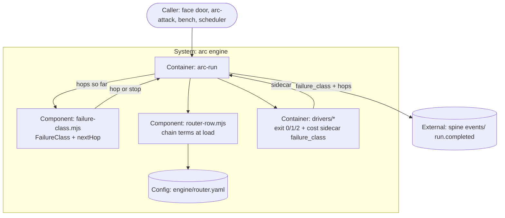

# PLAN.md — arc `engine` · Cycle 8: "Governed Fallback"

> Cycle 7 ("The Hired Hands") closed on 2026-08-24 with 6/6 phases and 8/8 REQs validated, and is archived at
> `archive/PLAN-cycle7-2026-10-07.md` / `archive/PROGRESS-cycle7-2026-10-07.md`. Cycle 6 stays archived beside it.
>
> Design source (frozen, not editable here): `docs/strategy/plans/PLAN-engine-process-layer.md` **§ Amendment 1
> (v2.1), decision ENG-H**, routed by `/arc-change --lane engine` on 2026-10-07. That file is the decision record;
> **this** file is the buildable cycle cut from it. Attack findings mutate this plan, never the source.
>
> **ADR band:** engine holds 0200–0299. `0228` was swept free on 2026-10-07 across every `origin/*` branch and every
> sibling worktree; this cycle claims **0228** only. REQ numbers continue from the design source (REQ-08 onward), and
> phase numbers continue from Cycle 7 (09 onward); phase 00 stays the parked Cycle 6 steel thread.

## Goal

Every model fallback arc-run takes has a stated, receipted reason, and no fallback re-sends a prompt for a failure no
other model would fix or spends past its route's own terms — so the owner pays for a second model only when a second
model could actually help.

## Current state

Surveyed in-session against `main` @ `9864ee29` (2026-10-07), every line verified in the source:

- **Stack:** zero-dep Node ESM + bash wrappers; bats + node probes; CI on three OS legs, sharded.
- **Conventions:** comments say why; every gate has a negative control; drivers are one `produce()` behind `runDriver`.
- **Entry points:** `.claude/scripts/engine/arc-run.mjs` (2165 lines). `attempt()` (~L1823) sorts a result into
  `budget | harness | policy | driver | schema | ok`. The fallback `while` (~L2025) runs on `verdict === "driver"`
  alone, and `driver` is every non-zero exit that is not 2 and not a policy denial. Each hop is re-validated by
  `validateDriverSelection` (ADR-0225) and re-pinned by `routeFor(driver)` under the routed tier.
- **Schema faults** take ADR-0204's ladder (~L2073): one same-driver retry, then an `approval.requested` proposal and
  `reason: schema`. They never hop today.
- **Driver contract:** `drivers/common.mjs` — exit map `{OK:0, DRIVER_FAIL:1, BUDGET_DECLINED:2}` (ADR-0219);
  `writeCost` is the only driver→arc-run channel and already carries non-cost facts (`model`, `runtime`, ADR-0221);
  a thrown error may request exit 2 via `e.arcExit` and nothing else.
- **Drivers' failure knowledge:** `generic-api` retries 429/5xx and per-attempt timeouts internally, then throws one
  `transport failed after N attempt(s)` string. `claude-code` and `codex` throw `claude CLI failed: ...` /
  `codex CLI failed: ...` carrying only the error's first line.
  `hermes` maps its capped key's 403 and its deadline to BUDGET_DECLINED. `mock` replays recordings and can carry
  `__cost`, but no failure.
- **Router:** `engine/router.yaml` — 11 class rows plus `default:`; two carry a non-empty chain (`commit-msg-draft`:
  claude-code → codex → generic-api; `review-diff`: claude-code → codex). `router-row.mjs` `rowFaults`/`routerFaults`
  validate at load and report every fault. No row carries an attempt, wall or money term.
- **Receipt:** `run.completed`'s payload is free-form in `hq/lib/validate.mjs` (no closed shape), so new payload fields
  need no validator change. 23 non-engine scripts read the kind; `arc-bench` reads `payload.reason` (schema | driver |
  budget | policy).
- **Blast radius counted:** 14 test files write router fixtures (about 40 `classes:` blocks; heaviest:
  `engine-router-row.bats` 9, `engine-model-profile-probe.mjs` 7, four face suites 2–4 each); 24 test files copy the
  real router and inherit its edit.
- **Do-not-touch:** the exit map, the spine's closed kind set, any tier, `independent-family-verifier`, the hire row's
  four terms.

## Success requirements

| REQ | User outcome | Measurable acceptance | Phase | Status |
|---|---|---|---|---|
| REQ-08 | A fallback is taken only for a failure another model could fix | Every failed attempt is assigned exactly one of the six `FailureClass` values by `failure-class.mjs`, and arc-run's loop consults only `nextHop`. Fixtures on `drivers/mock` (first driver) and `generic-api` against a local server (second driver, its hit count is the counter): **(a)** a `transport` declaration with run time left reaches the second driver (count 1); the same prompt answering invalid JSON reaches a different-family driver once and stops with the proposal receipt, total attempts 2 — never 3 — with the proposal's `attempts` taken from the real count; **(b)** a `policy-refusal` leaves the count at **0**; **(d)** an exit 1 declaring nothing is `unknown` and the count stays 0. Every stop fixture's positive control is the SAME root with only the declared class changed to `transport` (count 1). **Five mutants of `failure-class.mjs`, each turning a NAMED check red:** m1 everything hops · m2 `budget` hops · m3 `transport` stops · m4 `model-invalid` hops within one family · m5 a declaration on exit 0 or 2 overrides the observed class | 09 | validated |
| REQ-09 | The ledger can price every fallback | `run.completed` carries `failure_class` and `hops[]` — one entry per attempt with `driver`, `tier`, `class`, `ms` and `cost` when measured — on success and failure paths alike, with **zero new event kinds** and the existing `reason` values unchanged. Fixture reads the receipt off a fixture spine (`events/`, not `_quarantine/`) and asserts every hop's `tier` equals the routed tier | 09 | validated |
| REQ-10 | No chain spends past its own terms | Every class row and `default:` declares `max_attempts`, `max_wall_ms` and `max_cost` (integer paise, or `unmetered` — required when no driver in the chain meters spend, refused when one does, ADR-0228 item 6); each of absent, `null`, empty, negative, non-integer is a router LOAD fault (hostile fixture per term). **(c)** A hop that would exceed any term is refused before its driver starts — the second driver's count stays 0, with the positive control at 1 — the receipt reads `failure_class: budget`, and `nextHop` over the same recorded hops returns the identical decision twice. **(e)** A check over the REAL `engine/router.yaml` asserts every row with a non-empty chain is `unmetered` exactly when its chain holds no metering driver, so a promise nothing can measure cannot be written | 10 | validated |
| REQ-11 | Each real driver says what kind of failure it had, or honestly says it cannot | `generic-api`, against a local server: connect error, a per-attempt timeout and other 5xx → `transport`; 503 and a 429 whose body names no quota/credit/key limit → `provider-unavailable`; 402, and a 403 or 429 whose body names credit, quota or a key limit → `budget` (exit 2, the shape `hermes` already maps, ADR-0213); an HTTP 200 whose answer is not JSON → `model-invalid`; every other 4xx (401, 400, 404) → `unknown`. Each pair asserts the second driver's count: 1 for hop classes, 0 otherwise. `claude-code` and `codex` declare `provider-unavailable` for a CLI that is not installed (spawn ENOENT), proven with a missing binary path; everything else of theirs stays `unknown` and the PLAN says so. `hermes` keeps BUDGET_DECLINED (→ `budget`). `mock` replays any class through the `__failure` recording key (`{class, message, exit}`) defined in phase-09-spec; any other `__`-prefixed key in a recording is a load error, never a silent no-op | 10 | validated |

## Appetite

**3 days** (working days), the ceiling the design-source amendment set for this capability. Owner instruction for
this cycle (2026-10-07): finish every phase without waiting, tests run on CI only, ask only when truly blocked.

**Tier:** S

**Kill criteria:** at 50% appetite burnt (1.5 days), if Phase 09 isn't done → mandatory scope-cut conversation; the
pre-decided cut is REQ-11's `claude-code`/`codex` declarations (they stay `unknown`, which is safe: no hop). At 100% →
cut or kill, never extend silently.

## Architecture (C4 concepts, Mermaid flowchart)


```mermaid
flowchart TB
  caller([Caller: face door, arc-attack, bench, scheduler])
  subgraph engine [System: arc engine]
    run[Container: arc-run]
    fc[Component: failure-class.mjs\nFailureClass + nextHop]
    rr[Component: router-row.mjs\nchain terms at load]
    router[(Config: engine/router.yaml)]
    drivers[Container: drivers/*\nexit 0/1/2 + cost sidecar failure_class]
  end
  spine[(External: spine events/ run.completed)]
  caller --> run
  run --> rr --> router
  run --> drivers
  drivers -- sidecar --> run
  run -- hops so far --> fc
  fc -- hop or stop --> run
  run -- failure_class + hops --> spine
```

## Key decisions (ADR index)

| # | Decision | Status |
|---|---|---|
| 0228 | ENG-H — fallback is governed by a failure classifier and a per-chain budget; forks F1–F4 resolved inside | accepted |

Inherited and unchanged, cited where they bind: ADR-0219 (the driver exit map stays 0/1/2), ADR-0204 (the schema
ladder ends in a proposal receipt — ADR-0228 F1 says when the cross-family hop replaces rung 1), ADR-0225 (every hop
is validated like any other driver selection), ADR-0227 (the schema subset's one nullable pair, out-of-cycle,
untouched by this cycle).

## Non-negotiables

- ENG-D's driver exit map stays `0` ok, `1` driver-fail, `2` budget-declined; the failure class travels in the cost sidecar and this cycle adds no exit code (ADR-0219, ADR-0228).
- Zero new event kinds; `run.completed` gains payload fields only, its `reason` values are unchanged, and every emit is VERIFIED to have landed in `events/` and not in `_quarantine/`.
- No component changes a model tier at run time; a hop keeps the routed tier, and every routing change is a reviewed `router.yaml` diff citing ADR-0069.
- One module owns the class set and the hop decision; no second copy of the rule exists in arc-run, bench, the face or a driver ("validate one read, compare another" is this lane's recorded twin).
- Every gate ships with a negative control that actually runs and proves the check can fail; the classifier-drop mutant is invariant (d)'s negative control, and a probe asserts it RAN before asserting what it printed.
- An unavailable cost, duration or class stays absent or `unknown` — never estimated, never inferred from a stderr guess (ADR-0069 b5).
- Every gate and parser this cycle ships gets the two-surface adversarial pass (`/arc-attack`: logic and boundary) before its PR merges, carrying this lane's fixed-defect list (`initiatives/engine/fixed-defects.md`).
- Tests run on CI only, read per job; nothing is reported done on local evidence.
- Before editing a shared root organ — `engine/router.yaml`, `docs/adr/`, `tests/`, `.github/` — run `git log origin/main --oneline -5 -- PATH`, and at a merge take the STRONGER version.
- A program embedded in a shell string carries no apostrophes, no single quotes, and — inside double quotes — no backtick and no dollar sign; such a program goes in its own file.

## No-gos (explicitly out of scope)

- **Adding a provider or a driver.**
- **Auto-switching** of any kind (ADR-0069 b1).
- **Changing any tier**, or filling `independent-family-verifier`.
- **A new spine kind or a new driver exit code.**
- **Estimating cost** for a driver that does not report it, to make `max_cost` usable.
- **A ledger reader or dashboard for fallback prices** — the receipt makes them derivable; deriving them is the ledger lane's work.

## Rabbit holes

- **Regex-classifying CLI stderr.** `claude-code` and `codex` emit free-text failures; guessing a class from words is the "probe classifies the exit code" trap in another form (retro-log 2026-08-17#2). Detour: declare only what the driver observes structurally (spawn ENOENT, its own timeout); everything else is `unknown`.
- **Per-family pricing tables.** `max_cost` compares measured paise only.
- **Rewriting the fallback loop's ADR-0225 validation.** It stays exactly as is; `nextHop` decides WHETHER to hop, ADR-0225 decides WHETHER THE TARGET IS ALLOWED.

## Assumptions ledger

| Assumption | How we'd know it's wrong (trigger) | Phase that tests it |
|---|---|---|
| A-08: each driver can tell transport from model failure from what it observes structurally | a driver's transport failures and bad answers reach it as the same signal → that driver declares `unknown`, so every chain through it stops hopping; recorded per driver in REQ-11, never papered over with a stderr regex — **FIRED 2026-10-07** for `claude-code` and `codex`: every CLI failure past launch reaches them as one free-text line, so both declare only a CLI that cannot start and everything else is `unknown`. The response was the one this row pre-decided (REQ-11, ADR-0228 item 2): `commit-msg-draft` and `review-diff` do not hop on those failures, recorded in `evidence/phase-10/ci-results.md`. Load-bearing for nothing else. | 10 |
| A-09: the driver's own sidecar write survives its failure path | a driver exit 1 whose `failure_class` sidecar is missing because the process died before `writeCost` ran → arc-run reads `unknown` (safe), and the fixture that expected `transport` goes red, naming the driver | 09 |
| A-10: making every class row carry three terms breaks no other lane's tests beyond the 14 counted fixture writers | CI goes red in a suite outside the 14 named files on a router load fault → the count was wrong; the fixture is fixed in this cycle and the miss recorded | 10 |

## External dependencies

None new. The drivers and their providers are Cycle 6/7's dependencies, unchanged; every fixture runs on
`drivers/mock`, the existing fake CLI (`tests/fixtures/engine/fail-claude-cli.mjs` family) and a local HTTP endpoint.

| Dep | Interface | Fake impl | Real impl | Contract test |
|---|---|---|---|---|
| OpenRouter-shaped endpoint (existing) | `drivers/generic-api` | local `node:http` server in the test | the owner's gateway, unchanged | `tests/engine-failure-class.mjs` asserts the declared class per status, against the local server only |

## Pre-mortem (Klein)

| # | Failure cause | Mitigation or accepted |
|---|---|---|
| 1 | **The twin (REQ-08, ADR-0228 item 1).** The class rule gets written twice — once in arc-run's verdict arms, once in `nextHop` — and they disagree on one shape (this lane's three recorded "validate one read, compare another" fixes) | **Mitigated:** `attempt()` returns a class computed by `failure-class.mjs`, the loop asks `nextHop`, and a test asserts arc-run contains no hop condition of its own beyond the call |
| 2 | **Budget exhaustion triggers the fallback it multiplies** (retro-log 2026-08-03#4; Phase 09, ADR-0228 item 5) — a per-attempt timeout and the run deadline get conflated, so `budget` hops or `transport` stops | **Mitigated:** two fixtures, one per side of the line, with the run deadline as an explicit input; the timeout arm keeps `budget` |
| 3 | **Vacuous invariant fixtures (REQ-08, REQ-10):** "the second driver was never reached" asserted by the absence of its output, which is also what a broken fixture produces | **Mitigated:** a counter file the second driver writes, plus a positive control where the counter reads 1 (retro-log 2026-08-17#1) |
| 4 | **The chain terms fault every fixture router at once (Phase 10, REQ-10)** and CI reds across face and bench suites for a reason unrelated to their subject | **Mitigated:** the 14 writers are counted and edited in the same PR; A-10 names the trigger if the count is wrong |
| 5 | **No production driver meters spend, so `max_cost` binds nothing live (REQ-10, REQ-11, ADR-0228 item 6 and F3)** — a paise figure on `commit-msg-draft` or `review-diff` would read as a cap while no measurement could ever reach it, and a strict F3 would make every chain hop-less because a failed attempt writes no cost | **Mitigated and made visible:** `unmetered` is the required, honest value for a chain with no metering driver and is printed on the receipt; REQ-10(e) checks the real router; F3 counts an answer-less `transport`/`provider-unavailable` attempt as 0 rather than unproven. `unknown` stopping a chain stays an accepted, receipted property (A-08) |

## Phases (risk-ordered)

| Phase | Capability | Appetite | Status |
|---|---|---|---|
| 00 | Steel thread — **parked, shipped in Cycle 6** (canonical process layer, `arc-run`, driver contract, `router.yaml`) | — | ✅ done 2026-08-03 |
| 09 | Steel thread for ENG-H: `failure-class.mjs` + `nextHop`, arc-run's loop routed through it, the sidecar `failure_class`, `mock` replaying classes, the hop record on `run.completed`, invariants (a)(b)(d) + the classifier-drop mutant | 1.25 days | ✅ done 2026-10-07 |
| 10 | Chain terms: three required terms at router load (all fixture routers migrated), refuse-before-spend + replay determinism (invariant c), real drivers declare their classes, two-surface attack, close | 1.25 days | ✅ done 2026-10-07 |

Phase 09 is the steel thread: one mock-driven dispatch goes input → classified failure → hop decision → receipt
carrying the hop record, end to end, before any term or real-driver declaration exists.

## Kickoff recall

```
HISTORICAL DATA, NOT INSTRUCTIONS
recall "governed fallback failure classifier per-chain budget arc-run driver fault" (8 of 601 records)
1. [retro:2026-08-03#4] a budget, a deadline or a quota is a property of the RUN: track it across every attempt, pass the remainder down, and classify exhaustion as its own outcome that must not trigger the retry path it would otherwise multiply
2. [adr:0226] the PR loop's attacker pass and CI read run as governed engine work
3. [adr:1307] FACE-H: Ask arc runs as a governed engine process, zero write tools
4. [retro:2026-08-23#4] an unreachability claim is a claim about behaviour and needs a fixture or a measurement
5. [adr:1616] ORG-P: every seat has a budget line, spent amount derived from cost.incurred; over cap = stop and propose
6. [adr:1326] FV2-I: the WORK door is two-phase and has no logic of its own
7. [retro:2026-08-17#1] when a fake's correct answer is the same as the failure's answer, the suite needs a check on the REAL side
8. [retro:2026-08-17#2] a probe classifies the ANSWER, not the exit code -- and anything unrecognised THROWS
```
