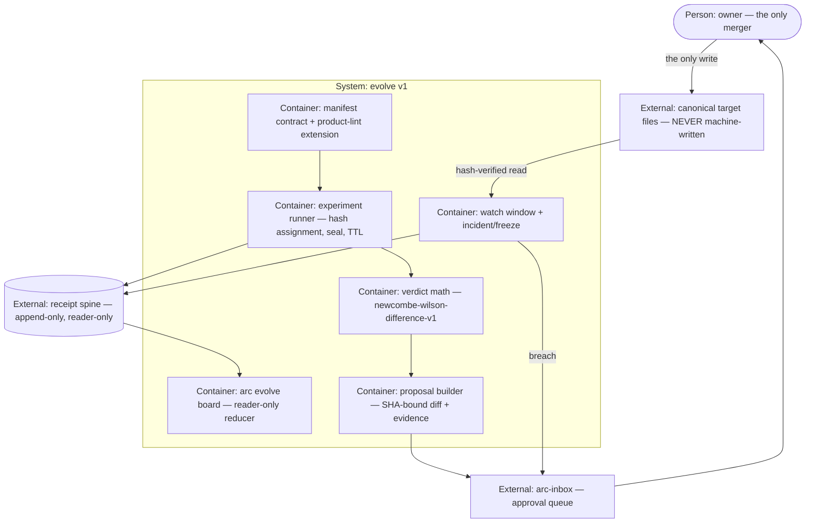

# PLAN.md — evolve v1: the self-improvement engine

> Lane `evolve` · born by `/arc-kickoff --lane evolve` on 2026-08-03 · claims **ADR band 0300–0399**.
> Design source: `docs/strategy/plans/PLAN-evolve.md` (v1.0, approved — the decision record, not
> this cycle). Company organs (`docs/adr/`, `docs/retro-log.md`, `docs/trial-ledger.md`, `tests/`)
> stay at root and are never copied here (ADR-0053); evidence is lane-scoped at
> `initiatives/evolve/evidence/phase-NN/` (ADR-0055).

## Goal

For arc's module surfaces: weekly scoreboards derived from the spine, bounded
champion/challenger experiments on declared files, and evidence-threshold promotion proposals
with statistical floors and ONE pinned verdict test — so a module improves on evidence and
**nothing ever changes without a human merge, not even a rollback.**

## Current state

Verified in-tree 2026-08-03 (not copied from the design source — re-checked at kickoff).

- **Stack:** zero-dep Node (ESM `.mjs`) + POSIX sh + bats · no framework, no runtime deps
- **Entry points:** `.claude/scripts/hq/lib/validate.mjs` (event vocabulary + payload validators) ·
  `.claude/scripts/hq/arc-event.sh` (standard emitter) · `.claude/scripts/core/product-lint.mjs`
  (manifest gate) · `.claude/scripts/hq/arc-inbox.mjs` (approval queue) · `products/*/manifest.json`
- **Conventions:** closed sets over open ones (`KINDS`, `KNOWN_FIELDS`, `REQUIRED_KEYS`) · exit 2
  on an unknown field · idem derived from a total preimage, never caller-supplied · append-only
  spine with `supersedes` for corrections · one hostile-fixture corpus per parser-class gate
- **Do-not-touch:** `docs/evidence/**` and `docs/archive/**` are frozen (ADR-0058) · `docs/adr/`,
  `docs/retro-log.md`, `docs/trial-ledger.md`, `tests/` are company organs at root, never
  per-lane (ADR-0053) · the three generated commands compiled from `processes/*.process.yaml`
  (ADR-0201) · the Constitution — citable, never amendable

- **Spine LIVE**, reader/replay/inbox present. `.claude/state/` is gitignored, so spine history is
  local per checkout, not committed.
- **Event vocabulary CLOSED at 22 kinds** — `.claude/scripts/hq/lib/validate.mjs:20` `KINDS`.
  Neither `metric.observed` nor any `experiment.*` kind exists. Emitting one today is
  `UNKNOWN_KIND`. `council.verdict` exists, 0 emitted.
- **`PROCESS_RE` = `/^[a-z0-9][a-z0-9._-]{0,63}@[0-9]+\.[0-9]+\.[0-9]+$/`** (`validate.mjs:45`,
  exported for `process-lint`) — a `+variant` suffix is rejected today. EVO-C extends it.
- **`product-lint.mjs` closes unknown manifest fields** — `KNOWN_FIELDS` is a 12-entry set at
  `.claude/scripts/core/product-lint.mjs:38`, unknown field → exit 2. Phase 0 extends it inside
  the same hostile-fixture corpus.
- **10 products today** (core, council, design, develop, engine, git, hq, plan, qa, review) —
  verified via `ls products/*/manifest.json`, not hardcoded; re-run that query at each phase
  close rather than copying this line forward. **Zero** declare an `evolve` manifest section —
  strict-from-birth breaks no existing manifest (`arc-orchestrator` 2026-07-22: four docs
  described a pre-Phase-00 product for five days because a hardcoded count rotted the moment
  the code moved).
- **No client feed exists.** No `growth` module anywhere; `metric.observed` receipts = 0.
  The pre-kickoff gate is UNEVIDENCED — see the Assumptions ledger and ADR-0300.
- Closed-payload + idem precedent: `assertMoney`, `assertDecision`; `supersedes` on every event.
- Engine (`processes/`, drivers) landed 2026-08-03 but is NOT required for v1 — surfaces are
  declared module files.

## Success requirements

| REQ | User outcome | Measurable acceptance | Phase | Status |
|---|---|---|---|---|
| REQ-01 | Modules declare what may be optimized | `evolve` manifest section validated by `product-lint`: absent → exit 0 silent; present-but-invalid → exit 2 naming the exact missing keys; a money-touching path in `promote_via` → exit 2 permanently — against a money-surface classifier this phase **authors from scratch** (none exists in `product-lint` today), proven by a hostile fixture naming no money keyword at all (e.g. `lib/stripe/webhook-handler.ts`) that is STILL refused, so a substring match over `pricing` / `payments` / `revenue` cannot pass. Every manifest fixture in the hostile corpus (count read from the corpus directory, never hardcoded — the corpus grows as the adversarial pass adds holes) exits as pinned | 0 | validated |
| REQ-02 | See how every module is doing, honestly | `arc evolve board` renders from the reader only; wipe derived state → replay spine → **byte-identical** board. States `PENDING` / staleness age / `MISSING` / `insufficient evidence` each proven by a fixture; `metric.observed` and `experiment.measured` panels never summed | 1 | validated |
| REQ-03 | Experiments are bounded, deterministic, sealed | Same `unit_id` replayed → identical arm AND cohort across 3 runs; split fixed at config; both arms tagged `+champion` / `+challenger-a`; concurrency cap enforced; TTL expiry → archived `no-verdict` with data; mid-experiment edit of the sealed target → `killed` / `canonical-drift` | 2 | validated |
| REQ-04 | Verdicts only exist above honest floors, via ONE pinned test | `newcombe-wilson-difference-v1` reference vectors — sourced **independently of this lane's own implementation** (worked by hand from the published formula, or cross-checked against a second unrelated tool, and committed BEFORE any Phase 2 code exists) — reproduce **bit-for-bit**; verdict computed at most once and only when both arms ≥ floor (`n = floor − 1` → refused; one arm only → refused; pre-floor compute → refused); bound ≥ `effect_floor` AND delta ≥ MDE; guardrail breach → no verdict; a `MISSING` window is excluded from **both** arms | 2 | validated |
| REQ-05 | Winners AND rollbacks arrive as evidence, on an unbroken SHA chain | 4-hop lineage fixture-proven end to end: `base_sha` → `patch_sha`+`candidate_sha` → merged-SHA-verified `experiment.promoted` (mismatch → REFUSED) → watch gated on `current == candidate_sha`. Canonical target byte-unchanged in every fixture until a human merge; post-promotion drift → `manual intervention required`, zero machine-written patches | 3 | validated |
| REQ-06 | The council measures itself — plumbing first, proof later | `council.verdict` + outcome receipts emitted and read by `council-calibrate` via the reader, not Markdown; juror hit-rate / Brier columns render; terminal outcomes below floor → `insufficient evidence`; zero historical Markdown sessions backfilled | 4 | validated |

REQ-00 of the design source is **not evolve's REQ** — `metric.observed` enablement (EVO-H0) is
owned by the first client's cycle. It appears here as an external dependency and a ledger row.

**What `validated` means in this table, flipped at `/arc-retro` 2026-08-04.** Every one of the six
was measured against the acceptance criterion written in its own row, and every one of those
criteria is a **fixture** assertion — that was ADR-0300's declared position from kickoff, not a
concession made at the close. No REQ here ever required real traffic to demonstrate, so none was
weakened to reach `validated`. What is NOT claimed by these six rows is the cycle's north-star:
the engine has never run on anything real. See `PROGRESS.md` ## Now and the C7 entry in
`docs/HISTORY.md`, both of which state that plainly rather than letting this table imply otherwise.

## Appetite

**7 days hard cap.** A constraint, not an estimate. Written as a day count, never as "1 week" —
the design source said "1 week (7 days)" and the lint reads a week as 5 working days, so the two
readings differ by 40% on the one number the kill criteria are measured against.

**Tier:** M

Phases 0–3 allocate **5.5 days** across four phases, each mandating a FRESH adversarial
breaking-input pass (see ## Non-negotiables) — the same class of pass that found 9–77 real holes
per prior cycle (`arc-develop` 9, `arc-council-v2` 11+16, `arc-portfolio` 61, `arc-engine` ~90
across its phases), each hole requiring its own fix-and-fixture cycle. **None of that fix time is
separately budgeted inside the 5.5 days** — it is zero slack stacked on zero slack. Phase 4's
1.5d is the only NAMED slack, and it is pre-committed as a cut rather than held in reserve.

`arc-portfolio` (Cycle 4) is the precedent: it allocated 100% with zero slack, overran to ~112%,
and `appetite-sum` warned on every run. It warns on this plan too, and the warning is carried
deliberately rather than silenced by shaving phase numbers — **no second cut is named**, because
the SHA lineage chain (Phase 3) was declared load-bearing at kickoff and the remaining phases
carry REQ-02's kill criterion and the pinned verdict math. If burn forces a second cut, that is
an owner decision at the 50% checkpoint, not a pre-authorised one.

**Kill criteria:** at 50% burnt (3.5d), if REQ-02 is not met — board not byte-identical after
replay — the reader-only derivation is fighting the spine: bank the contract, lint and
vocabulary ADRs as documentation, stop, retro. Separately: if floor / cohort / seal / lineage
enforcement cannot be made fixture-deterministic after 1 day of fixes, stop and redesign the
receipt grammar rather than ship a floor that can be argued with.

**The real verdict is NOT inside the appetite.** A live winner needs thousands of units per arm
(CTR 3% → 4.5% at 80% power ≈ ~1,900 per arm). That is an operational-runway milestone, not a
build deliverable, and it is stated out loud rather than smuggled into a phase.

## Architecture (C4 concepts, Mermaid flowchart)

## Key decisions (ADR index)

| # | Decision | Status |
|---|---|---|
| 0300 | evolve is built ahead of its trigger — owner override of the A8 pull rule | accepted |
| 0301 | EVO-A — `evolve` manifest contract, strict from birth | accepted |
| 0302 | EVO-B — metrics live on the spine; stream contract vs `experiment.measured` | accepted |
| 0303 | EVO-C — variant grammar extends `PROCESS_RE` backward-compatibly | accepted |
| 0304 | EVO-D — typed receipts, closed payloads, idem-bound | accepted |
| 0305 | EVO-E — rollback is propose-only in both directions | accepted |
| 0306 | EVO-F — verdict test pinned to `newcombe-wilson-difference-v1` | accepted |
| 0307 | EVO-G — first client, council as designated cut, L1/L2 tags local to evolve | accepted |
| 0308 | EVO-H0 — `metric.observed` enablement is the client's cycle, not evolve's | accepted |
| 0309 | EVO-H1 — experiment vocabulary extends the closed kind list | accepted |
| 0310 | v1 operating constants + the six decisions left open at kickoff (α, effect_floor, TTL, concurrency, cohort split, council outcome kind, evidence-table freeze) | accepted |

## Non-negotiables

- Propose-only. NEVER self-merge; the machine NEVER writes canonical files — not to promote,
  not to revert (Constitution A6, no exceptions, no carve-outs).
- Never touches the Constitution — machines may cite, never amend.
- Floors / α / effect_floor / windows / splits live in config; **enforcement lives in code**. A
  FRESH agent that has not seen the implementation runs the adversarial breaking-input pass on
  the manifest validator, every receipt validator, and floor + cohort + seal + lineage + watch
  enforcement — bound to the section that ships each gate, never deferred to the phase close.
- No experiments on money-touching surfaces (pricing, payments, revenue) — permanently refused
  at the contract layer, with a fixture.
- Deterministic everywhere: hash-based arm AND cohort assignment, total-preimage idems,
  replay-identical board, config-hash-carrying verdicts, SHA-bound lineage at every hop. If
  replay cannot re-derive it, it does not count.
- Absent data is `MISSING`, never zero. Corrections supersede, never overwrite. No raw URLs or
  PII on the spine.
- Reader-only spine consumption; standard emitter for every receipt; real and simulated never
  mixed. Zero-dep Node + POSIX.

## No-gos (explicitly out of scope)

No auto-merge ever · no machine canonical writes including revert · no machine revert patch
after post-promotion drift (`manual intervention required` instead) · no adaptive/Bayesian/bandit
allocation · no sequential or peeking analysis · no second verdict formula · no auto-created
experiments (humans open them in v1) · no prompt-tuning loops · no metrics DB or warehouse · no
analytics-API fetchers · no dashboard UI · no cross-module meta-optimization · no experiments on
governance or Constitution surfaces · no policy-engine build-out · no free-form experiment
payloads · no zero-filling missing windows · no council Markdown backfill · **no building of
EVO-H0 inside this lane** (it is the client's, ADR-0308).

## Rabbit holes

Statistical elegance beyond the one pinned test (EVO-F is the v1 ceiling) · metric-taxonomy
perfection (start with the 2–3 metrics a client actually has) · generalizing the contract for
hypothetical modules (design for growth + council, extend by ADR) · rebuilding the autonomy
ladder (the policy engine's job) · backtest frameworks (unseen titles cannot be backtested) ·
event-grammar creep (ADR-0309 freezes the kind list; new kinds = new ADR, never new payload
fields) · lineage over-engineering (four SHA hops are enough; no merkle trees) · **building a
synthetic client feed** to make the board look alive — the board's honest answer today is
`MISSING`, and that is the feature.

## Assumptions ledger

| Assumption | How we'd know it's wrong (trigger) | Phase that tests it |
|---|---|---|
| The pre-kickoff gate's absence blocks only the runway, not the build — every REQ here is fixture-provable with zero real data | Any REQ-01..05 acceptance turns out to need a real receipt stream to demonstrate | 0 |
| `metric.observed` staying absent is representable: baseline panels render `MISSING` rather than erroring or zeroing | The board cannot render a panel for a kind that is not in `KINDS` without a code path that fakes it | 1 |
| Extending `KINDS` by 8 experiment kinds does not break the 22-kind closed vocabulary's existing validators or replay | Any pre-existing spine fixture changes behaviour once the new kinds land | 0 |
| Extending `PROCESS_RE` — an exported constant `process-lint` applies to EVERY product's `processes/*.process.yaml`, not just evolve's (ADR-0200) — with `(+slug)?` leaves every legacy `name@x.y.z` value valid AND changes what no non-evolve canonical process file validates as | A legacy process value in an existing fixture fails validation after the change, OR any non-evolve canonical process file starts passing/failing differently | 0 |
| Contract tests run against fakes (fixture spine, fixture inbox, fixture repo tree, and a `metric.observed` feed with **no real impl at all**) actually exercise the code under test rather than short-circuiting it | Any fake returns before the real code path it stands in for runs, or the suite stays green with the real dependency absent — `arc-engine` 2026-08-03: a fake driver returned before `produce()` ran, so a 3-driver contract suite passed green while no real driver executed and one was not installed | 0 |
| Integer successes/trials is a sufficient metric family for v1 — no continuous or ratio metrics needed | The first real client's primary metric is not expressible as integer counts | 2 |
| A human merging the exact proposed diff is a reliable enough control that SHA verification catches every deviation | A merge path exists that changes file bytes without changing the observed SHA | 3 |

## External dependencies

| Dep | Interface | Fake impl | Real impl | Contract test |
|---|---|---|---|---|
| `metric.observed` client feed (EVO-H0, ADR-0308) | reader query by module/surface/metric/window | committed fixture receipts + a `MISSING`-window fixture | **absent — no client exists**; lands in the client's cycle | payload/idem/source_id validator fixtures; board renders `MISSING` with zero real receipts |
| Receipt spine (emitter + reader) | `arc-event.sh emit` / reader API | in-repo fixture spine replayed from JSONL | live `.claude/state/hq/events/` | replay → byte-identical board; every new kind lands in `events/`, never `_quarantine/` |
| `arc-inbox` approval queue | proposal item + approve/reject | fixture inbox dir | existing `arc-inbox.mjs` | proposal appears with evidence table; rejection leaves champion intact |
| Canonical target files | read + hash only | fixture repo tree | the real repo working tree | canonical bytes unchanged across every fixture in REQ-05 |

## Pre-mortem (Klein)

Seeded from `docs/retro-log.md` — these are recorded arc patterns, not imagination.

| # | Failure cause | Mitigation or accepted |
|---|---|---|
| 1 | New kinds silently quarantined: the emitter exits 0 while every receipt is rejected `UNKNOWN_KIND` — exactly what `develop` hit on 2026-08-02, found only by listing the spine dir by hand | Phase 0 exit criterion: after wiring each new kind, assert the receipt landed in `events/` **and** that `events/_quarantine/` gained nothing. Exit 0 from a fire-and-forget writer is not evidence |
| 2 | The author's own adversarial pass finds nothing while a fresh agent finds real holes — `develop` 2026-08-02 (author 26/26 caught, fresh agent 9 real holes), `council-v2` 2026-07-16, `portfolio` 2026-08-02 (61 issues, 5 live in shipped code) | Named in ## Non-negotiables and in the Phase 0, 2 and 3 exit criteria: a FRESH agent runs every breaking-input pass on the REQ-01 manifest validator, the ADR-0304 receipt validators and the REQ-04/REQ-05 enforcement — bound to the section shipping each gate. A clean result from the author is evidence of a blind spot, not of a gate |
| 3 | Absent or colliding data manufactures a winner — `cycle2-receipt-spine` 2026-07-28 lost 100 real receipts to a dup-idem whose preimage carried no time, and the anomaly was explained away twice | ADR-0302's total-preimage idem (every identity-bearing field); REQ-02's `MISSING` never zero; REQ-04's symmetric window exclusion from both arms, tested in Phase 2. When an instrument shows an anomaly, test it against the mechanism before writing it down as fine |
| 4 | A stated lineage control is not a control — `portfolio` 2026-08-02: an ADR-mandated board note was never written and stayed absent through two phases; a negative control passed six CI legs by luck | REQ-05, Phase 3: each of the four SHA hops gets a negative-control fixture proving it can FAIL (mismatch → REFUSED, drift → killed), and the phase does not close without both. At close, ask of each hop: what asserts this is here, and what proves it can fail? |
| 5 | A fixture-only pipeline runs green end to end on artifacts nobody ever opens — `design-cycle3` 2026-07-30: 5 critique rounds, 3 blind rankings, receipts, a sealed prediction and a ready-to-send external package were all built from agent reports about pixels nobody looked at, and the owner scored the result 23/100 on first real look. Every REQ-01..06 acceptance here is a fixture assertion (ADR-0300) with no real feed to check it against | At each phase close a human opens the actual fixture files, the `bats` output and the fresh agent's hole list named in that phase's exit criteria — not a summary of them — before the row flips ✅. The PROGRESS.md done-log names what was opened, never just "tests green" |

## Phases (risk-ordered)

| Phase | Capability | Appetite | Status |
|---|---|---|---|
| 00 | Contract + steel thread — `evolve` manifest schema, `product-lint` extension, EVO-H1 vocabulary + typed receipt validators, EVO-C grammar, prohibited-surface guard, and one receipt emitted → read back through the reader | 1.5 days | pending |
| 01 | Board — reader-only reducer; `PENDING` / staleness / `MISSING` / `insufficient evidence`; stream separation | 1.0 days | pending |
| 02 | Runner + verdict math — deterministic arm+cohort assignment, symmetric tags, per-arm floors, the pinned test + reference vectors, TTL, concurrency cap, canonical seal | 1.5 days | pending |
| 03 | Promotion safety — full 4-hop SHA lineage, evidence table, inbox, watch window, freeze, revert proposal and the manual-intervention path | 1.5 days | pending |
| 04 | Council bridge — **THE DESIGNATED CUT** — verdict/outcome receipts, `council-calibrate` re-pointed to the reader, board columns | 1.5 days | pending |
