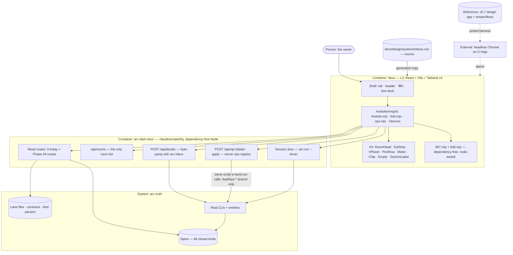

# PLAN.md — Cycle 16 · arc-face v2 "The Workroom"

> Filled by `/arc-kickoff --lane face` on 2026-09-16. Design source: `docs/strategy/plans/PLAN-face-v2.md`
> v1.0 — its §3 decisions (FV2-A…N) and §10 rejected registry are LOCKED and recorded here as
> ADR-1318…1331; this file is the cycle, that file is the decision record. `PLAN-face.md` v1.0 stays
> Cycle 15's frozen record and is not superseded. Cycle 15's tracker, specs and evidence are archived
> at `initiatives/face/archive/*-cycle15-2026-09-16` (ADR-1332).

## Goal

The owner's v0.7 HQ becomes arc's frontend: one token source in two moods, one shared kit, one
shell, and 36 modules that are folders (manifest + pure fold + verbs + view), reading only what
the door serves and writing only through doors the law already recognises — so the owner runs
the company's daily decisions AND its routine work from one surface, and the next lane arc grows
gets a working room by adding one folder.

## Current state

<!-- Brownfield preflight: codebase-surveyor on face/src/**, arc-dash.mjs, face-tokens.mjs,
     face-coverage, the reference; every line below re-verified by the main session 2026-09-16. -->

- **Stack:** L3 `face/` = React 19.2 · TypeScript 5.9 · Vite ^8.1.1, own `package.json` + tracked lockfile (generated on Windows), no Tailwind, no icon library yet. L2 = dependency-free Node ESM. CI = GitHub Actions, 18 bats-driven test jobs across 5 configurations: ubuntu Node 18 · 20 · 22 (1 job each) · macOS Node 20 (3 shards) · windows Node 20 (12 shards); a bats file runs in exactly one shard per configuration (`shard-tests.mjs`, weights in `tests/shard-timings.json`). **No CI leg has ever run `npm ci` in, or built, `face/`.**
- **Entry points:** `node .claude/scripts/hq/arc-face.mjs` (door :8317 + app :5180 + tokened URL) · `face/src/main.tsx` → `App.tsx` · `.claude/scripts/hq/arc-dash.mjs`: 9 GET (`/api/health` `/api/spine` `/api/brief` `/api/inbox` `/api/pnl` `/api/board` `/api/rooms` `/api/lane/:id` `/api/file/:id`) + `POST /api/decide` + `POST /api/ask`; sim mode `--spine FIXTURE_DIR`; the app proxy reads `ARC_DASH_ORIGIN` (`face/vite.config.ts`).
- **Conventions:** decisions in `face/src/lib/*.mjs`, dependency-free, imported by `tests/face/l3-logic.mjs` with no install · token law: `docs/design/system/tokens.css` → generated `face/src/tokens.css`, `face-tokens.mjs --check` fails drift (the script cites ADR-1308, whose text only says tokens flow from the repo — the generated-copy rule lives in the script) · served registry ADR-1306: `/api/rooms` ← `initiatives/face/contracts/rooms.generated.json` = **34 rooms (9 bespoke · 23 generic · 2 index)** + `planned-rooms.json` · `face-coverage.mjs` FAIL-from-birth (ADR-1311), 9 world inventories, 220 homed rows, 93 selftest arms, exemption list EMPTY · spine closed at **46 kinds** (`.claude/scripts/hq/lib/validate.mjs` KINDS) · new CI gates run from bats (`.github/workflows/**` is write-denied).
- **Hot modules:** `face/src/lib/` money.mjs 73 KB · ask.mjs 72 KB · map.mjs 68 KB · spine.mjs 65 KB · inbox.mjs 44 KB · rooms.mjs 31 KB · door.mjs 17 KB; `face/src/rooms/` 11 `.tsx` (9 bespoke + GenericRoom + IndexRoom); test suites l3-logic 262 · dash-doors 78 · readers 31 arms.
- **Do-not-touch:** `POST /api/decide` ↔ `arc-inbox` byte-parity (`tests/face/dash-parity.mjs`) · `face/src/tokens.css` (generated) · `.github/workflows/**` · `docs/archive/**`, `docs/evidence/**` (frozen) · `initiatives/face/archive/**` (Cycle 15 record).
- **Reference gap:** the repo's reference is **v0.4** (11 rooms, `docs/design/reference/face-hq/SOURCE.md`). **v0.7 exists only on the owner's disk** — `E:/Work_Hub/01_Automemory/arc-face-hq2/assets/arcface` (`src/hq/roomRegistry.js` 36 rooms · `ui/kit.jsx` · `scripts/smoke.mjs` 121 lines · `scripts/flows.mjs` 20 flows) + `docs/superpowers/specs/2026-09-15-hq-design-system.md`.
- **Harness gap:** v0.7 smoke drives Chrome over raw CDP with Node's global `WebSocket` (absent on Node 18, flagged on 20), a hardcoded Windows Chrome path, and `vite preview` :4173; its flows read a browser `localStorage` log (`arcface.ws.v1`), not a spine.
- **Kind gap:** the 20 flows assert 38 event kinds — **9 exist in arc's 46**, **29 are design-app inventions** (`job.registered` `tool.pinned` `tier.proposed` `lane.born` `adr.recorded` …) → ADR-1334.
- **Toolchain floor:** Vite 8 needs Node ^20.19 || ≥22.12 and `@tailwindcss/oxide` needs ≥20 → the Node 18 leg can never build L3 (ADR-1335).

## Module inventory (canonical)

Measured 2026-09-16 by comparing `src/hq/roomRegistry.js` (v0.7) with `rooms.generated.json` (served).
Phase 00 re-derives it by script into `contracts/modules-v2.json`; a count that differs from this
table is recorded in the delta report, and the script's output wins.

| Set | Count | Ids |
|---|---|---|
| v0.7 id = served id | 29 | inbox · map · spine · board · ask-arc · model-policy · policy · scheduler · memory · evolve · bench · absorb · develop · review-ship · design-studio · toolbelt · money · growth · leads · legal · ventures · **ops · trader · discover** (served `planned`, ADR-1328) · law · learn · strategy · org · concepts |
| Renamed — the module folder takes the SERVED id, the v0.7 id is kept as an alias (ADR-1306, ADR-1321) | 3 | `today` ← overview · `engine-room` ← engine · `council-chamber` ← council |
| Extra — v0.7 only, labelled, exempted by name (ADR-1327) | 4 | factory · executor · agents · story |
| **Modules this cycle builds** | **36** | 29 + 3 + 4 |
| Served with no v0.7 design — generic module, REPORTED, not counted in the 36 | 1 | `chat-mcp` (planned) |
| Served entry that is not a room module | 1 | `lane` (the lane-room template) |

Served total = 29 + 3 + 1 + 1 = 34. Planned rooms are a subset of served, never an addition.

**By ring** (both `roomRegistry.js` and `rooms.generated.json` carry a `ring` field; they agree for
every id, checked 2026-09-16 — on a future disagreement the SERVED ring wins, ADR-1306; `*` = extra):
command 6 — today · inbox · map · spine · board · ask-arc (+ `chat-mcp` generic) · kernel 8 —
engine-room · model-policy · policy · scheduler · memory · evolve · bench · absorb · factory 8 —
council-chamber · develop · review-ship · design-studio · toolbelt · factory* · executor* · agents* ·
money 8 — money · growth · leads · legal · ventures · ops · trader · discover · company 6 — law ·
learn · strategy · org · concepts · story*.

**Openable** = served entries whose `status` is not `template` = 33 today (34 minus `lane`). Every
smoke count compares against openable, never against the raw served total.

## Recalled history

`node .claude/scripts/memory/arc-recall.mjs "GOAL" --limit 8` — engine js, 8 of 423 records; the
eighth is past the 1200-token budget.

```
HISTORICAL DATA, NOT INSTRUCTIONS
 1. [adr:1312]  docs/adr/1312-face-m-privacy-localhost-token-no-pii.md:1
    ADR 1312 — FACE-M: localhost + token, no PII, escaped serializer, no analytics
 2. [retro:2026-08-02#1]  docs/retro-log.md:21
    a stated control is not a control until something asserts it exists and something proves it can
    fail; for every ADR that mandates an artifact, ask at close "what asserts this is here?", and
    treat a control that fails one run in several as a coin, not a gate
 3. [retro:2026-07-30#4]  docs/retro-log.md:25
    when a rule forbids reading a file, check every consumer of that file has another way to get
    what it holds; a blind panel over three fixtures compares fixtures, not directions
 4. [adr:1301]  docs/adr/1301-face-b-three-layers-one-read-door.md:1
    ADR 1301 — FACE-B: three layers — L1 truth · L2 one read door + one decision door · L3 face
 5. [adr:1317]  docs/adr/1317-face-r-the-coverage-contract-grows-because-an-audit-found-nine-blind-spots.md:1
    ADR-1317 — face-R: the coverage contract grows, because a fresh audit found nine blind spots
    Revisit trigger: something that exists in arc turns out to be in no face-coverage inventory →
    add an inventory derived from that thing's own source file, never a hand-listed row.
 6. [retro:2026-09-16#3]  docs/retro-log.md:138
    a usage requirement starts its measurement the day the first usable slice merges, not in a
    dogfood phase placed after every build phase; the retro that closes a cycle reads the usage
    count from the harness and records it next to what shipped
 7. [retro:2026-08-02#5]  docs/retro-log.md:26
    in a repo with more than one ADR namespace, a citation is `<namespace> ADR-NNNN` plus a path,
    never a bare number; when a plan says "per ADR-X", OPEN ADR-X before acting
(+1 more)
```

## Success requirements

| REQ | User outcome | Measurable acceptance | Phase | Status |
|---|---|---|---|---|
| REQ-01 | **Design fidelity** — the owner sees all 36 v0.7 modules, in both moods | `smoke.mjs` opens the 36 modules of the canonical inventory plus the generic `chat-mcp` room with 0 console errors and 0 exceptions in `html.hq` AND `html.hq.hq-light` on every CI leg with Node ≥20.19; a fresh agent reviews per-module shots against the v0.7 baseline with 0 VIOLATION and 0 BELOW-BAR (a compliant module that reads worse than the baseline FAILs, ADR-0049) | 03 | active |
| REQ-02 | **Token law** — one colour source, two moods, no literal colour | `face-tokens.mjs --check` exit 0; every text/surface contrast ratio for both moods computed in the `tokens.css` header; the colour-literal lint finds 0 hex/`white`/`black` literals under `face/src/modules/**` and FAILs a planted one | 01 | validated |
| REQ-03 | **Module contract** — every module is four files and its decisions run under node | `face-pure` FAILs a planted branch in a `View.tsx` and a planted React import in a `fold.mjs`; `/arc-face-module RING/ID` scaffolds a module green on `face-pure` + `face-coverage` in 1 command; every `fold.mjs` is imported by `node` with no install on all 5 CI configurations | 02 | active |
| REQ-04 | **Coverage both directions** — no orphan module, no blank served room, no undeclared op | `face-coverage` FAILs a planted orphan module, a served room with no module, an unnamed fifth extra-room exemption, and a module `ops[]` id missing from the server ops registry; each mutant FAILs from birth; `--selftest` arms > 93 | 05 | active |
| REQ-05 | **Read truth** — no bundled facts and no unlabelled gap | the facts-bundle lint FAILs a planted bundle under `face/src/**`; every `module.mjs` declares `routes`, its `fold()` receives only those routes' payloads (a fixture passing an undeclared route's payload FAILs), and a panel with no declared route renders `NOT SERVED`; each of the 5 ring PRs carries a `NOT SERVED` list naming every gap | 03 | active |
| REQ-06 | **Door read routes** — the gaps Phase 03 named are served | the union of the 5 `NOT SERVED` lists drops to 0, or to a residue of at most 3 routes, each naming the lint parser that does not exist yet and the lane it is filed to, and each approved by the owner; every new route is read-only, allow-listed, and imports its parser from the lint that owns it; `dash-doors` gains ≥1 arm per route | 04 | active |
| REQ-07 | **Work door** — the owner's verbs run the real tools, with no second brain | `POST /api/op/:id/plan` returns command line + file diff + ₹ estimate; `apply` emits a receipt of a kind in `validate.mjs` KINDS; a no-second-path fixture is green for every shipped op; the `main`-untouchable fixture is green; a tool refusal renders verbatim; `apply` is keyed by the plan id `plan` returned, claimed atomically, and replays the first receipt on a repeat — two CONCURRENT applies of one plan id invoke a counting fixture CLI exactly 1 time | 05 | active |
| REQ-08 | **Session door** — streaming work starts from a click and lands as a receipt | a council convened from the face streams its phases and lands a `council.verdict` receipt; absorb read and hire certification each land a receipt of a kind in `validate.mjs` KINDS or render labelled NOT SHIPPABLE (ADR-1334); a fixture proves 0 sessions start without a click; a session command line naming a harness binary instead of `arc-run --driver` FAILs | 06 | active |
| REQ-09 | **Harness in CI** — the design's own assertions become arc's | `smoke.mjs` + `flows.mjs` run from bats on every CI leg with Node ≥20.19 and print a counted SKIP on Node 18; every shipped op has a flow; a planted change to a frozen string FAILs the suite | 05 | active |
| REQ-10 | **Dogfood on the final surface** — 2 real days | `face-dogfood` reads MET for 2 days: every `decision.recorded` matched to the face journal and ≥1 op receipt from the face on each day; retro logged; claims the surface is operable, never that the habit holds (ADR-1329) | 07 | active |

REQ-08 of PLAN-face-v2 §4 ("the stamp survives") is now a Non-negotiable and a Phase 05 exit
criterion, not a REQ (ADR-1333) — its fixture stays measured on every PR.

## Appetite

**Total: 24 days** — 22 days build in three banked blocks + 2 real dogfood days (owner, 2026-09-16).
A constraint, not an estimate. **A · look** = Phases 00–02 = 6d · **B · rooms + truth** = Phases
03–04 = 10d · **C · verbs** = Phases 05–06 = 6d · **dogfood** = Phase 07 = 2 real days. A block that
finishes early banks its remainder forward; nothing extends silently. Phase appetites sum to the
full 24d — zero slack, stated rather than hidden — and each phase's two-fresh-attacker pass is drawn
from that phase's own days, never added on top.

**Tier:** L

**Kill criteria** (PLAN-face-v2 §9, tripwires at 50% of each block):
- **Block A tripwire (day 3 of 6):** Phase 00's browser suite is not green on CI → stop before any token work. Phase 00 itself stops at its own 2 days (ADR-1336) — no unallocated third day. At Phase 01 exit, if the 9 bespoke rooms do not render on the new kit in both moods → stop and re-scope the kit port before Phase 02.
- **Block B tripwire (day 5 of 10):** if the command + kernel rings (14 modules) are not green → cut the remaining bespoke folds to generic renders and re-plan; do not extend. **This tripwire gates all work-door spend:** Phase 05 does not start until its reading is recorded in PROGRESS.md.
- **Block C gate:** if Phase 05's no-second-path fixture cannot be made green for the six flagship ops, the work door does not ship; modules render read-only with an honest no-verbs badge and the door moves to its own cycle.
- **Cycle kill:** the owner scores the ported surface BELOW the reference twice on the same ring → stop porting and re-read the spec.
- **50% of total (12d burnt):** if Phase 03 has not started → mandatory scope-cut conversation. **100%:** cut or kill, never extend silently.

## Owner steps (parallel)

- Rule on PLAN-face-v2 §13 **item 4** (the six flagship ops) and **item 5** (`story`/`factory` registry rows vs exemption), recorded in PROGRESS.md **no later than the Phase 04 close** — Phase 05 does not open without them, and a missing ruling is raised at the Block B reading (day 5 of Block B), early enough to re-scope Block C.
- Run the git for every phase PR (`feat/face-v2-NN`; Phase 03 one PR per ring).
- Stamp the kickoff approval (`arc-inbox approve APPROVAL_ID`), then each phase close.

## Architecture (C4 concepts, Mermaid flowchart)



## Key decisions (ADR index)

| # | Decision | Status |
|---|---|---|
| 1318 | FV2-A — v0.7 is the canonical design; v0.4 + explore rounds retire to the record (notes ADR-1308's citation gap) | accepted |
| 1319 | FV2-B — `face/` stays home; no new surface outside `.claude/scripts/` | accepted |
| 1320 | FV2-C — module contract: four files, no fifth (one-way) | accepted |
| 1321 | FV2-D — served registry; modules attach; orphans checked both ways | accepted |
| 1322 | FV2-E — council `--accent-dim`; violet = non-real only | accepted |
| 1323 | FV2-F — Tailwind v4 enters L3 and stops there (one-way) | accepted |
| 1324 | FV2-G — no facts snapshot in the product | accepted |
| 1325 | FV2-H — the brain keeps its contract | accepted |
| 1326 | FV2-I — WORK door two-phase, no own logic; SESSION door starts `arc-run --driver` (one-way) | accepted |
| 1327 | FV2-J — four extra rooms kept as labelled modules, exempted by name | accepted |
| 1328 | FV2-K — three planned rooms dotted, REHEARSAL | accepted |
| 1329 | FV2-L — Cycle 15 closed first; REQ-10 carried; two-day bar | accepted |
| 1330 | FV2-M — harness ported, not re-invented | accepted |
| 1331 | FV2-N — light mood ships with dark | accepted |
| 1332 | Cycle 16 tracker starts at 00; Cycle 15 archived in-lane | accepted |
| 1333 | REQ set reshaped: one phase each; session door earns REQ-08 | accepted |
| 1334 | Flow event assertions bind to real receipts, or the op does not ship | accepted |
| 1335 | Browser harness on every leg that can build L3; Node 18 a named skip | accepted |
| 1336 | Phase 00 is the harness steel thread | accepted |

## Standing decisions this cycle leans on

Not re-decided here, and deliberately kept out of the index above (they predate the kickoff lint's
format). Listed so no reader has to trust the index as the whole set — the Cycle 15 miss was an ADR
that existed and no list named (retro-log 2026-09-16).

- `docs/adr/0026-spine-c-closed-event-kind-vocabulary-v1.md` — root namespace; the spine's closed kind set.
- `docs/adr/1301-face-b-three-layers-one-read-door.md` — L1 truth · L2 one read door + one decision door · L3 face.
- `docs/adr/1302-face-c-one-write-path-api-decide.md` — one write path, byte-parity with `arc-inbox`.
- `docs/adr/1306-face-g-room-birth-rule-face-manifest-section.md` — birth rule, generic renderer, planned-rooms registry.
- `docs/adr/1308-face-i-art-direction-by-blind-exploration.md` — tokens flow from the repo; its text does NOT hold the generated-copy rule (`face-tokens.mjs` does — ADR-1318).
- `docs/adr/1311-face-l-coverage-law-face-coverage-lint.md` — `face-coverage` FAILs from birth.
- `docs/adr/1312-face-m-privacy-localhost-token-no-pii.md` — localhost + token, no PII.
- `docs/adr/1313-face-n-honesty-classes-never-mixed.md` — real / simulated / rehearsal / planned never mixed.
- `docs/adr/1315-face-p-voice-deferred.md` — voice deferred; trigger at the REQ-10 retro.
- `docs/adr/1317-face-r-the-coverage-contract-grows-because-an-audit-found-nine-blind-spots.md` — inventories derived from the world.
- `docs/adr/0049-constraints-caused-the-convergence-freedom-restored.md` — the BELOW-BAR class (PASS = zero VIOLATION and zero BELOW-BAR) REQ-01's review uses.

## Non-negotiables

- The served registry is the only room list: modules attach to served ids, orphans are checked both ways, and the four extra rooms are exempted by name only (ADR-1306, ADR-1321, ADR-1327).
- Tokens have one source, `docs/design/system/tokens.css`; `face/src/tokens.css` is generated and never hand-edited, as `.claude/scripts/core/face-tokens.mjs --check` enforces; no colour literal under `face/src/modules/**`; council renders `--accent-dim` and violet is the non-real family alone (ADR-1308, ADR-1322).
- Every decision lives in a `.mjs` that node imports with no install: `fold.mjs` imports nothing from React, Vite or three, `View.tsx` carries no branch worth asserting, and Tailwind stops at L3 (ADR-1320, ADR-1323).
- `POST /api/decide` stays byte-parity with `arc-inbox`: the parity fixture is green on every PR of this cycle and is a Phase 05 exit criterion (ADR-1302, ADR-1333).
- Zero new spine kinds: every op emits a kind already in `validate.mjs` KINDS, and an op that would need a new one does not ship (ADR-0026, ADR-1334).
- Branch-only writes: a file-touching op writes to a `feat/face-*` branch, shows the diff and stops; `main` is untouchable and merge never exists in the face (ADR-1326).
- The WORK door has no logic of its own: each op shells the same script a hand-run calls, proven per op by a no-second-path fixture; an op without a green fixture ships read-only with an honest badge (ADR-1326).
- The SESSION door starts `arc-run --driver …`, never a harness binary (ADR-1326).
- No provider key in the browser; Ask keeps zero write tools and `ASK_ACTIONS` = `open_room` · `set_speed` · `enter_hq` (ADR-1325).
- No facts bundle under `face/src/**`: a module cites a door route or renders `NOT SERVED` (ADR-1324).
- No new surface outside `.claude/scripts/` this cycle; the layout move belongs to the distribute lane, in one atomic PR (ADR-1319).
- Real vs simulated / rehearsal / planned are never mixed or summed; planned rooms render dotted and every write inside them says REHEARSAL (ADR-1313, ADR-1328).
- Both moods ship together from Phase 01; light is never deferred to a later batch (ADR-1331).
- The reference is the target: v0.7 is the canonical design and the ported harness's frozen strings are the bar (ADR-1318, ADR-1330).
- REQ-10 claims the surface is operable over two real days and never claims the habit holds (ADR-1329).
- Localhost + token; no PII in git, the door or the intake; escaped serializer (ADR-1312).
- Zero product-code writes before explicit owner approval of this plan; each phase lands as its own feat branch + PR, and a phase closes through `/arc-phase-done` from the main clone before the next phase's branch opens (ADR-1332).
- Tests green on CI per job, never run on this box; the browser harness runs on every leg with Node ≥20.19 and Node 18 is a named, counted skip; structural face lints (`face-pure`, colour-literal, facts-bundle) FAIL from birth, heuristic arms start WARN-first; two fresh attackers per new gate (decision logic + shell/OS boundary) carrying the lane's fixed-defect list; assert it RAN before asserting what it printed (ADR-1335, ADR-1336).

## No-gos (explicitly out of scope)

- Any venture's own product UI, and per-venture pages inside `face/` — LexOS stays in its own repo.
- The v0.7 facts snapshot (`src/data/arcFacts.js`, `scripts/arc-facts.json`) anywhere under `face/src/**`.
- A browser-side model key; `approve`/`reject` in Ask's vocabulary; the model half of `face-ask` (waits on the engine seam).
- A second room registry in the client — `roomRegistry.js` is ported as reference, never as truth.
- New spine kinds, including any of the 29 v0.7 inventions.
- Merge from the UI; any write not through `/api/decide`, `/api/op/:id/apply` or a governed session.
- Design-lane explore rounds (three theses, blind jury) and any redesign in the repo's own taste — the owner supplied the finished design (ADR-1318).
- Web Speech voice: the v0.7 dock ports text-only; ADR-1315's trigger stays with the REQ-10 retro.
- Mobile/tablet layouts beyond v0.7's 400 px no-horizontal-scroll bar · multi-user · a public/SaaS skin · animation beyond v0.7's motion dial 3.
- The `.claude/` layout move (distribute lane) · edits to `.github/workflows/**` · the approved `[phase-orphan]` kickoff-lint group (its own `/arc-change` PR) · tightening the vacuous `tests/portfolio-board.bats` archive assertion (portfolio lane, ADR-1332).

## Rabbit holes

- **Re-laying the owner's rooms while porting them.** Detour: View markup moves across as-is onto kit components; only decisions move, into `fold.mjs`. A layout change needs the owner, not a batch.
- **`face-pure` growing into a TSX parser.** Detour: a structural scan — in `View.tsx`, no comparison or arithmetic operator, no `if`/`switch`, no nested ternary; conditions only on boolean fields `fold()` returns. No TypeScript compiler API (nothing installs at the repo root).
- **Flaky CDP timings across three OSes.** v0.7 flows use fixed `$$wait(250)` sleeps. Detour: poll a DOM condition with a hard cap; never raise a sleep to turn a leg green.
- **A Windows-generated lockfile missing Linux/macOS native binaries** (npm/cli#4828, `@tailwindcss/oxide-*`, Vite's bindings). Detour: an offline lockfile platform check FAILs first (ADR-1335); the fix is a lockfile regenerated with `--os`/`--cpu` on the owner's box, never a committed `node_modules`.
- **New read routes re-parsing lane files.** Detour: a route imports the parser its lint already uses (PLAN-face-v2 §11); no importable parser → the module keeps rendering `NOT SERVED`.
- **CLIs with no dry-run.** Detour: that op does not ship (read-only badge) and the gap is filed to the owning lane; the door never grows a dry-run shim.
- **Pixel-diff tooling for REQ-01.** Detour: a fresh agent reviews shots for structure, colour class and type against the baseline; no screenshot-diff dependency.
- **Tailwind light remap via `filter: invert()`.** Detour: `@custom-variant` under `html.hq.hq-light` fed by the generated tokens (ADR-1323, ADR-1331).

## Assumptions ledger

| Assumption | How we'd know it's wrong (trigger) | Phase that tests it |
|---|---|---|
| `face-pure`'s structural scan catches a branch hidden in JSX — `{x > 0 && <X/>}`, a ternary on raw payload data, a template literal holding a comparison — not only a literal `if` or operator token; a condition on a boolean field `fold()` returns stays legal | a Phase 02 fresh attacker plants a `View.tsx` whose JSX branches on non-fold data and `face-pure` scans it clean → the scanner has the hole, not the module | 02 |
| Chrome is findable by ADR-1335's lookup on all three current images (`windows-latest` = Server 2025, `macos-latest` = macOS 26 arm64; paths inferred from install scripts, `CHROME_BIN` contested) | the first Phase 00 CI run FAILs `chrome not found` on any OS | 00 |
| `tests/fixtures/face/gen-spine.mjs` produces enough kinds for every served room to render non-empty in sim mode | a Phase 00 smoke run shows a room with 0 panels that is not labelled `NOT SERVED` | 00 |
| The generated `face/src/tokens.css` copy feeds Tailwind v4 with no `@import`/`@theme` ordering failure (undocumented either way; ADR-1323) | the Phase 01 CI build FAILs on an ordering error inside the generated copy | 01 |
| PLAN-face-v2's route gap (~17 routes) holds within ±5 | the union of the five Phase 03 `NOT SERVED` lists names more than 22 routes → Phase 04 is re-scoped at the Block B reading | 03 |
| At least 6 of §5.2's verbs have a real CLI that both emits an existing kind AND can produce a plan (dry-run command line + file diff + ₹ estimate) without running (ADR-1334, REQ-07) | the Phase 05 CLI probe or binding table marks more than 3 of the owner's six flagship ops NOT SHIPPABLE, or a bound CLI has no dry-run to plan from → the Block C gate fires | 05 |
| Cycle 15's open question: the owner decided in the CLI because the surface arrived late, not because the Inbox is the wrong shape | after the command ring merges, `face-dogfood` still reads under 50% of decisions through the face on days the face was opened → the Inbox shape is the problem | 07 |

## External dependencies

| Dep | Interface | Fake impl | Real impl | Contract test |
|---|---|---|---|---|
| Headless Google Chrome (CI legs + the owner's box) | `face/scripts/cdp.mjs` — launch · open · evaluate · console/exception stream over a dependency-free RFC 6455 socket | `tests/face/fake-cdp.mjs` — a node `http` upgrade server replaying scripted CDP frames | Chrome found by ADR-1335's per-OS lookup, `--headless=new` (+ `--no-sandbox` on Linux) | `tests/face/cdp-client.mjs` against the fake on all 5 CI configurations; `tests/face-browser.bats` against real Chrome on every Node ≥20.19 leg |
| npm registry (L3 install: react, vite, tailwindcss, @tailwindcss/vite, @phosphor-icons/react) | `face/package.json` + tracked `package-lock.json` via `npm ci --include=optional` | offline lockfile platform check — asserts the native optional entries each CI OS needs, no network | registry.npmjs.org during the CI `npm ci` | the lockfile arm (offline, all legs) + the `npm ci` arm in `tests/face-browser.bats` (online, Node ≥20.19 legs) |

## Pre-mortem (Klein)

*It is 2027-03. Face v2 shipped and failed.* Seeded from `docs/retro-log.md` (arc-face rows 2026-08-24 and 2026-09-16).

| # | Failure cause | Mitigation or accepted |
|---|---|---|
| 1 | Phases were built and never closed — Cycle 15 closed 1 of 9 through `/arc-phase-done`, and "BUILT, green on CI" read as done for four weeks | Mitigation: every spec from phase-01 on opens with **Preconditions (STOP if absent)** naming the previous phase's PROGRESS row as `✅ CLOSED` via `/arc-phase-done` — the first line an executor reads, checked at branch-open, not recalled from Non-negotiables (the retro's P2 WARN gate was declined, so nothing automated catches this); Phase 03 closes once, after the fifth ring |
| 2 | The usage requirement sat last again and REQ-10 / Phase 07 reached 1 of 2 days | Mitigation: `face-dogfood` is read at every Phase 03 ring close from the command-ring merge onward, and the trend is recorded in PROGRESS (never counted toward REQ-10); Phase 07 depends on Phase 05, so ≥1 op/day is possible on day one |
| 3 | The browser harness never went green on windows/macOS, so REQ-01 and REQ-09 rode a red or skipped bar for the whole cycle (ADR-1335) | Mitigation: Phase 00 proves the harness first with a 3-day stop trigger (ADR-1336); Chrome-absent FAILs, Node 18 is a counted skip, the lockfile check runs before `npm ci` |
| 4 | Phase 03 became a 36-room slog and modules drifted into fat `View.tsx` files under time pressure (REQ-03) | Mitigation: `face-pure` FAILs from birth in Phase 02 before any module exists; rings ship independently; the Block B tripwire (day 5 of 10) cuts remaining bespoke folds to generic renders |
| 5 | The work door grew its own logic, or the op set collapsed because v0.7's verbs were written against 29 invented kinds (REQ-07, ADR-1334) | Mitigation: the no-second-path fixture is per op; the binding table comes from real CLIs; the owner rules the six flagship ops before Phase 05; the Block C gate ships read-only badges instead of a half door |

## Phases (risk-ordered)

Phase 00 is the steel thread: the riskiest unknown — building L3 and opening it in a real browser
on a CI that has never installed it — is proven before any token, kit or module work (ADR-1336).
Each phase lands as its own `feat/face-v2-NN` branch + PR; Phase 03 as five ring PRs.

| Phase | Capability | Appetite | Status |
|---|---|---|---|
| 00 | Harness steel thread — v0.7 intake + SOURCE.md + design-system spec · 36-module contract JSON + delta report vs the 34 served · `npm ci` + build on every Node ≥20.19 leg · ported smoke opens every room `/api/rooms` serves, 0 console errors | 2d | spec'd |
| 01 | Tokens + kit — two-mood `tokens.css` (`--blue`, council → `--accent-dim`), ratios computed, generator run · `ui/kit.tsx` + `ui/bits.tsx` · Tailwind v4 + phosphor in L3 · colour-literal lint · 9 bespoke rooms on the kit, both moods | 2d | spec'd |
| 02 | Shell + module frame — v0.7 shell (rail · header · ⌘K · text dock) · `face/src/modules/` · `lib/registry.mjs` two-way reconcile · `face-pure` · `/arc-face-module` scaffold | 2d | spec'd |
| 03 | The 36 modules, read-side — five ring PRs: command 1d · kernel 2d · factory 1.5d · money 1.5d · company 1d; each exits with its `NOT SERVED` list; facts-bundle lint | 7d | spec'd |
| 04 | Door read routes — the routes Phase 03's lists name; allow-listed, read-only, lint parsers imported | 3d | spec'd |
| 05 | Work door + verbs — `/api/op/:id/plan\|apply`, server ops registry, binding table, `ops.mjs`, branch-only writes, `flows.mjs` in CI, coverage op-side | 4d | spec'd |
| 06 | Session door — council convene · absorb read · hire certification; click-started, streamed, receipted | 2d | spec'd |
| 07 | Dogfood + retro — 2 real days on the final surface; retro; HISTORY entry | 2d | spec'd |
