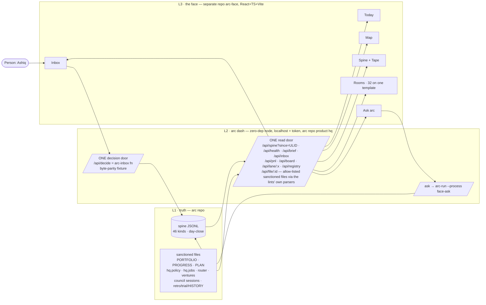

# PLAN.md — arc face v1: the working HQ

> Lane: `face` (born 2026-08-19 by `/arc-kickoff --lane face`, ADR century **1300–1399**).
> Design source: `docs/strategy/plans/PLAN-face.md` v1.0 (landed by the owner 2026-08-18 —
> the decision record, not the cycle). It supersedes `BRIEF-dashboard.md`, archived at
> `docs/archive/BRIEF-dashboard.md` — never recreate it. Born under the owner's Build-out
> Mandate, `decision.recorded` **`01KZTM348858PDH44K4HA64CVA`** (verified on the canonical
> spine 2026-08-19, day-file 2026-08-12, not quarantined; cited by ADR-1300).
> Consumer this lane unblocks: `BRIEF-chat-mcp.md` (sleeping) — the face fires its trigger,
> and chat-mcp is the same L2 reader + the same decision path exposed as MCP tools.

## Goal

One surface that IS arc operating — every product, lane, pipeline, gate, receipt kind and
concept (built and planned — 32 rooms on one template), rendered as live views over the ONE
spine and the sanctioned tracker files, with exactly ONE write path (the inbox decision), a
governed AI brain that answers from live state, a map you can read the company from, a tape
you can replay it on, and a birth-rule so every future module lands its own room without a
redesign. Not: a marketing site, a second truth, or an operator console that lets a machine
do what the Constitution keeps human.

## Current state

<!-- Brownfield survey 2026-08-19 (codebase-surveyor) + design-source verification. -->

- **Stack:** arc OS repo — zero-dep Node ≥18 (`.claude/scripts/**`, ADR-0002/A2), spine
  JSONL + per-kind validators, bats + node test suites on 3-OS CI (PR + dispatch only).
- **Entry points:** `spine.mjs` (`query`, `spineRoot`) · `arc-inbox.mjs` · `arc-brief.mjs`
  · `arc-pnl.mjs` · `arc-event.sh emit` · the lints (`product-lint`, `board-lint`,
  `kickoff-lint`, `council-lint`, `policy-lint`, `jobs-lint`) whose parsers L2 imports.
- **Conventions:** ADR centuries per lane · lane trackers under `initiatives/` (one dir
  per lane) · evidence per phase (ADR-0055) · receipts immutable, days close at midnight IST ·
  processes governed by `hq.policy.yaml` rows (POL-I).
- **Do-not-touch:** `.claude/state/hq/events/` (canonical spine — main clone only,
  `assertNotLinkedWorktree` guard; worktrees carry none) · `docs/evidence/**` +
  `docs/archive/**` (frozen history) · generated commands (regenerate via process files).
- Canonical spine (main clone `E:/Work_Hub/01_Automemory/arc`, 2026-08-19): **1,386
  receipts · 21 `day.closed` seals · 14 of 46 kinds ever fired** · top kind `note.logged`
  (917). Mandate receipt `01KZTM348858PDH44K4HA64CVA` present in `2026-08-12.jsonl`.
- Reader surface on `main`: `spine.mjs` exports `query(root, filters)` + `spineRoot()`;
  `arc-brief.mjs` and `arc-pnl.mjs` present. **`arc-inbox.mjs` is CLI-only — approve/
  reject live inside `main()`, no importable function yet** — the `/api/decide` parity
  work (REQ-09) includes extracting that function via `/arc-change` (ADR-1302).
  Re-verified 2026-08-19: `decide(root, verdict, id, reason)` already exists unexported
  at `arc-inbox.mjs:122` with no CLI-only state — extraction is mechanical (add
  `export`), which de-risks assumption row 2.
- Spine internals: `spine-io.mjs` (append-only JSONL + idem index), `canonical.mjs`
  (ULID + sha256), per-kind validators. Worktrees carry **no** canonical spine
  (`assertNotLinkedWorktree` guard) — emits and dogfood run from the main clone.
- `products/hq/manifest.json` v1.0.0 declares arc-brief · arc-inbox · arc-pnl + policy/
  jobs infrastructure; no face-specific scripts yet. L2 `arc dash` lands beside them.
- `product-lint.mjs` has `KNOWN_FIELDS` including `evolve:` (lines 42–44, applied to every
  manifest) — the exact precedent ADR-1306's `face:` section extends.
- Design lane ready: `products/design/` manifest declares `design-lint.mjs`,
  `design-render.sh`, and the director / composer / critic / jury agents — Phase 01 runs
  on it unchanged.
- Board: 15 born lanes, 6 LIVE vs guideline 2 (informational, ADR-0052); centuries
  0001–1299 claimed; **1300–1399 free at claim, checked across all 18 sibling worktrees**.
- 244 files in `docs/adr/`. CI: latest `workflow_dispatch` on `main` in_progress at
  kickoff (run 32179039604); the run before it green. CI runs on PR + dispatch only.
- `initiatives/face/` did not exist before this kickoff. The cwd `arc-face` is a
  **worktree of the arc repo** (branch `technology-ashiq/arc-face`) — the L3 repo
  `arc-face` is a separate, not-yet-created GitHub repo (ADR-1300, Phase 04 entry).

## Success requirements

| REQ | User outcome | Measurable acceptance | Phase | Status |
|---|---|---|---|---|
| REQ-01 | Coverage — the owner can find EVERY part of arc in the face | every born lane (15) + plan-ready lane (ops · trader · discover · chat-mcp) has a room; all 46 kinds render (typed or generic); all 26 commands, 30 agents, 6 processes, 7 gates, hooks, rules, lints map to a Toolbelt/Review entry; every glossary concept maps to a room+station — asserted by `face-coverage` (FAIL) against the tree, 0 misses; mutant tree (new lane + new kind) FAILs naming both | 05 | active |
| REQ-02 | Today — the owner opens one front page and knows what needs him | the brief's 4 groups render from the reader with the 40-line collapse rules honoured; needs-you never collapses; KPI row each with *Why?* precedents; "since you left: N receipts, M need you" derived from a cursor | 04 | active |
| REQ-03 | Stamp — the owner decides in the face exactly as the CLI would record it | every `approval.requested` profile in `validate.mjs`/lanes renders its detail body; approve/reject with mandatory reason emits `decision.recorded` byte-identical to `arc-inbox` (parity fixture from Phase 03 consumed here); refusal codes (`ALREADY_DECIDED`, `UNKNOWN_APPROVAL`, `BAD_REASON`) surface verbatim; route-enumeration fixture proves 0 other mutating routes; other needs-you kinds render as cards with chips, never stamps | 04 | active |
| REQ-04 | Map — the owner reads the whole company from one transit map | all v1 lines/stations drawn from `face:` sections + planned-rooms registry; in-flight dots move on receipt; open-gate squares show counts; unexercised lines dashed, planned dotted; station click → chip/room; legible at 20+ lines per blind jury check | 05 | active |
| REQ-05 | Tape — the owner scrubs the company to any past day and it re-renders honestly | as-of any past **sealed** (`day.closed`) day re-renders every spine-derived view from the log; replay-identical fixture (`rm state.db && replay` → same JSON bytes) proven on closed days only; **as-of today (the open, unsealed day-file) is a separate, explicitly labelled case with no replay-identical guarantee while the file may still be appended mid-read**; file-borne panels badged "file, not log"; dated obligations flagged from the tree | 04 | active |
| REQ-06 | Rooms — every room is the same product with honest numbers | template zones 1–6 for all 32 rooms; bespoke panels for Council · Money · Leads · Growth · Engine · Evolve · Spine · Board at minimum; honest states first-class (not instrumented / ABSENT+reason / MISSING / PENDING n/floor / SIMULATED / REHEARSAL / DRILL / EXPLORATORY) verified by a fresh agent | 06 | active |
| REQ-07 | Brain — the owner asks in words and gets receipted answers | Ask arc answers ≥20 golden questions from live L2 with receipt citations (ULIDs resolve via L2 or the answer is marked *unverified*); navigation + decision drafting work; **zero write tools** (tool-list fixture); runs as engine process `face-ask` (process file · router row · `hq.policy.yaml` row · budget · `run.completed`), local-tier per ADR-1307; offline fallback answers the deterministic subset | 07 | active |
| REQ-08 | Design law — the look is a blind-judged decision with a scoreable prediction | three theses × 8 signature screens as isolated variants passing `design-lint`; deterministic renders; blind jury ×3 vs the reference (4th item, position recorded); owner pick + falsifiable PREDICTION as `decision.recorded`; ≤2 critique rounds; winner's tokens become canonical `tokens.css` + core components passing design-lint | 01 | active |
| REQ-09 | L2 door — one read door and one decision door the owner can trust | `arc dash` zero-dep server: read door `since=` ULID cursor <1 s p95 on a 10k-event fixture with a written cursor contract (page cap, `next`, malformed-cursor refusal, mid-append safety); `asof=` replay parameter on every spine-derived endpoint with a per-endpoint replay-identical fixture; spine-health reader (via `/arc-change` on `spine.mjs`); `/api/file/:id` allow-list only; decision door parity fixture green; full auth/origin matrix (`Authorization`-header token, absent/`null`/foreign Origin rejected, 0 CORS, 127.0.0.1 bind, DNS-rebinding fixture); XSS fixture on hostile `note.logged` payloads green; reader-only lint green; sim + replay modes labelled; local request journal written | 03 | active |
| REQ-10 | Dogfood — arc actually operates through the face | ≥5 real days in which every decision the owner makes goes through the face — proven by L2's request journal (decision ULIDs) matched 1:1 to `decision.recorded` on the spine; brief opened daily; ≥1 as-of scrub used; retro logged | 08 | active |

## Appetite

**32 days** total: **27 working days** of build attention in three banked blocks + **5 real
calendar dogfood days** (~0.5d attention). A constraint, not an estimate — a blown block is
cut or killed per its own row, never silently extended; a block that finishes early banks
its remainder to the next.

**Tier:** L

| block | appetite | tripwire (50 %) | kill / cut |
|---|---|---|---|
| **A · Design** (Ph 00 1d + Ph 01 5d) | 6d | day 3: three theses differ ≥3/7 IA dimensions and ≥3/4 art axes, else reassign once | owner scores the winner BELOW-BAR twice → stop, bank the brief + design system, re-explore next cycle. If a later block-B kill fires, an L3 restart resumes from the frozen `tokens.css` — Phase 01 is never re-run |
| **B · Doors + shell** (Ph 03 4d + Ph 04 4d) | 8d | day 4: parity + reader lint + <1 s fixture green, else cut Tape to "as-of day picker" | parity fixture not green by day 4 → L3 does not start; ship L2 alone (assumption 2) |
| **C · Map + rooms + brain** (Ph 05 5d + Ph 06 5d + Ph 07 3d) | 13d | day 6.5: template + 12 rooms live, else cut bespoke panels to Council/Money/Leads/Growth only | brain LLM is the designated cut (deterministic live-state answers only, LLM later) |
| **Dogfood** (Ph 08) | 5 real days | — | — |

**Kill criteria:** each block carries its own 50 % tripwire and kill above. At 100 % of a
block → cut per the order below or kill the block, never extend silently. Cut order if
squeezed, with the REQ each cut degrades (second-opinion finding 1): brain LLM (REQ-07
degrades to the deterministic offline subset) → Toolbelt bespoke (REQ-06: that room goes
generic) → Strategy/Org rooms to generic (REQ-06) → Map animation (REQ-04: static map,
dots don't move) → Tape play (REQ-05 keeps as-of scrub, loses 10× playback). Phase
appetites sum to exactly 32d — zero unnamed slack, held as the pre-decided cut order
instead (the legal-lane precedent).

> **Kickoff note (structure, on the record):** the design source's Phase 02 "Design
> system" (2d) is **folded into Phase 01** (3d + 2d = 5d, block A unchanged at 6d). Reason:
> kickoff-lint law — every phase must serve ≥1 REQ, REQ-08 is the one design REQ, and the
> REQ cap of 10 leaves no row for a separate design-system phase. Phase numbering 03–08 is
> preserved so every design-source reference ("Phase 03 = L2 steel thread") stays true.

## Architecture (C4 concepts, Mermaid flowchart)



## Key decisions (ADR index)

| # | Decision | Status |
|---|---|---|
| 1300 | FACE-A: L2 in the arc repo (product `hq`); L3 in its own repo `arc-face`; cross-repo evidence = repo + SHA + CI run id hashed into the bundle | accepted |
| 1301 | FACE-B: three layers — one read door; parsers imported from the lints; spine-health added to `spine.mjs` via `/arc-change`; L3 never touches files | accepted |
| 1302 | FACE-C: `/api/decide` IS the `arc-inbox` function; byte-parity fixture; reason mandatory; no bulk/default/undo | accepted |
| 1303 | FACE-D: Stamp · Chip · Seal and no fourth; registry lint with mutant-button negative control | accepted |
| 1304 | FACE-E: Map lines/stations declared in manifests (`face.stations`), shared stations by kind; dashed = unexercised, dotted = planned | accepted |
| 1305 | FACE-F: Tape — as-of = replay of the log, deterministic, read-only; file-borne panels current + badged | accepted |
| 1306 | FACE-G: room birth-rule — `face:` manifest section + `KNOWN_FIELDS` + `face-coverage` FAIL from birth + planned-rooms registry | accepted |
| 1307 | FACE-H: Ask arc = governed engine process `face-ask`, zero write tools, local-only by design in v1, deterministic offline fallback | accepted |
| 1308 | FACE-I: art direction by the design lane's blind exploration; Ink & Signal is the direction to beat; Claude Design after the pick, behind DES-G | accepted |
| 1309 | FACE-J: L2 zero-dep node ≥18; L3 React + TS strict + Tailwind + Vite (FACE-O settles the Next.js condition); lucide-react only | accepted |
| 1310 | FACE-K: three data modes — live · replay · sim — mode always visible; sim never fills a live view | accepted |
| 1311 | FACE-L: the Coverage map is the v1 contract; `face-coverage` FAILs on any miss; "not instrumented" is the legal answer | accepted |
| 1312 | FACE-M: 127.0.0.1 + token + origin check; HTML-escape at the serializer; no PII; no analytics | accepted |
| 1313 | FACE-N: honesty classes real · simulated · rehearsal · drill · exploratory — one hatched family, never summed, never co-rendered | accepted |
| 1314 | FACE-O: v1 single-tenant local; hosted multi-tenant L2 is a later cycle with a named-demand trigger | accepted |
| 1315 | FACE-P: voice deferred — optional Web Speech behind a setting, not v1 | accepted |

## Non-negotiables

- One write path, mandatory reason, byte-parity with the CLI (E2, E1, ADR-1302).
- Reader-only over the spine; no second truth in the UI (SPINE-G/ADR-0030, A5, ADR-1301).
- Every number has *Why?* precedents; no invented numbers, ETAs, health emoji (A1, E3).
- Real vs simulated/rehearsal/drill never mixed or summed; MISSING ≠ 0; ABSENT with reason (E3, ADR-1313, ADR-1018, ADR-0416).
- Kinds, gates, lanes, ADR ids verbatim (A5); unknown kinds/profiles render generically — nothing dropped silently (E1, ADR-1306).
- Seals for every forever-human action; no button ever exists for them (E2, ADR-1303, ADR-0069 b1, ADR-0305, ADR-0110, ADR-1203).
- Localhost + token; no PII; escaped serializer (ADR-1312, ADR-0410, LED-C, SPINE-E).
- Design lane law: three theses, blind jury with reference, owner pick + prediction, two critique rounds max (ADR-1308, ADR-0034…0049).
- Every new face lint starts WARN-first in the TRIAL set and earns FAIL through the trial ledger (A1) — `face-coverage` excepted (a validator over the tree, FAIL from birth like policy-lint, ADR-1311).
- The Engine room's unlock-ladder rung indicator reads evidence only — the rung is never a control (E2).
- Tests green on CI per job; two fresh attackers per gate (decision logic + shell/HTTP boundary); attacker prompt carries the lane's fixed-defect list; vacuous-pass rule (assert it RAN before asserting what it printed).
- Zero product-code writes before explicit owner approval of this plan; L3 stack never enters the arc repo (ADR-1300, ADR-1309).

## No-gos (v1)

Public hosting / auth / multi-tenant (ADR-1314) · websockets / daemon / push · editing
PLAN/PROGRESS/yaml from the UI · auto-approve / bulk approve / "approve all" · stamps on
anything but `approval.requested` · a brain that acts (ADR-1307) · mobile app · particle/3D
face · charts for their own sake · re-implementing CLI logic in the face (import or call
it) · new event kinds (the face emits none; the brain's receipts ride `run.completed`) ·
analytics/telemetry · a second inbox · manifests for unborn lanes (ADR-1306) · voice
(ADR-1315) · any outward preview without the owner's explicit OK (CLAUDE.md publishing
rule).

## Rabbit holes

Chart perfectionism · animation systems · a design-token theming engine · L2 endpoints
beyond the sanctioned set (spine · health · brief · inbox · pnl · board · lane · registry ·
file allow-list · decide · ask) · bespoke rooms before the template · voice · SaaS tenancy ·
a "command palette that runs commands" (chips copy, never run) · turning the Map into a
game.

## Assumptions ledger

| Assumption | How we'd know it's wrong (trigger) | Phase that tests it |
|---|---|---|
| `spine.mjs` can serve the read door <1 s p95 on a 10k-event fixture (cursor paging), **measured on the Windows CI leg** (this lane's dev box is win32; the repo already documents one Windows-only fs divergence in lanes.md) | the Phase 03 fixture measures ≥1 s p95 **on any CI leg** → sqlite accelerator path (ADR-0024 equivalence gate) becomes a REQ, or the Tape is cut to a day picker | 03 |
| `/api/decide` can call the `arc-inbox` function and emit `decision.recorded` byte-identical to the CLI (function must first be extracted from `main()` — surveyed CLI-only) | the parity fixture differs in any byte other than id/ts → STOP L3, ship L2 alone until the shared function exists (ADR-1302) | 03 |
| a `face:` manifest section passes `product-lint` once `KNOWN_FIELDS` is extended, AND `face-coverage`'s mutant-tree negative control (REQ-01) actually fails closed on a deliberately-broken fixture rather than passing | `product-lint`/`arc-products.mjs` rejects the section OR the mutant control exits 0/PASS on the broken fixture → registry carries all rooms, ADR-1306 re-decided, mutant fixture pinned as a regression test | 05 |
| three theses of the 8 signature screens can differ ≥3/7 IA dimensions and ≥3/4 art axes AND a 20-line Map stays legible | director call fails twice, or the jury marks the Map illegible → Map zooms to ring level by default; theses reassigned once | 01 (matrix) · 05 (map) |
| the owner will decide through the face on real days (not the CLI) once it exists | dogfood week shows <1 face decision per day with open items → REQ-10 not met; retro asks whether the Inbox is the wrong shape | 08 |
| `/arc-phase-done` can accept cross-repo evidence (repo + SHA + CI run id hashed into the lane's bundle) for L3 phases | the DoD gate or `arc-evidence.sh` refuses foreign-repo evidence → ADR-1300 flips to in-repo `face/` | 04 |
| file-borne truths (board, headers, router, policy, jobs, council sessions) have no usable history, so as-of applies to spine views only | a sanctioned history source appears (git log through an owned parser) → Tape may extend to files by ADR, never before | 04 |

## External dependencies

| Dep | Interface | Fake impl | Real impl | Contract test |
|---|---|---|---|---|
| LLM driver for `face-ask` | engine `arc-run --process face-ask` (router class, ADR-1307) | offline deterministic live-state answerer (no key, L2 reads only) | local driver per ADR-0219 data boundary | 20 golden questions fixture — offline mode must answer the deterministic subset with citations |
| Claude Design (taste canvas + DS home) | `/design-sync` FROM repo `tokens.css` + components (ADR-1308) | none needed — HTML variants render standalone in the design lane | Claude Design design-system project (after DES-G `/arc-change` ruling) | DS project mirrors repo tokens — diff check; repo stays source of truth |
| `arc-face` L3 repo CI (cross-repo evidence) | evidence ref = repo + commit SHA + CI run id, hashed into the lane bundle (ADR-1300) | local build+test transcript recorded as evidence | GitHub Actions in `arc-face` | phase-close bundle verify accepts the hashed foreign ref (assumption row 6) |
| shared root organs: `engine/router.yaml` + `hq.policy.yaml` (Phase 07 adds `face-ask` rows) · `product-lint` KNOWN_FIELDS (Phase 05) | root files owned by no lane (ADR-0053), actively edited by the LIVE engine lane (ADR-0224 this week) | n/a — edits land on this lane's branch | pre-edit check `git log origin/main --oneline -5 -- engine/router.yaml hq.policy.yaml`; on conflict take the stronger version (lanes.md merge rule) | Phase 07 DoD names the check as RUN, never assumed clean |
| synthetic fixture spines (10k-event cursor fixture Phase 03 · honesty-classes fixture Phase 06) | spine-fixture generator script (not in-tree today — built in Phase 03) | the fixture IS the fake data | generated JSONL matching the `spine-io.mjs` envelope schema (15 keys) | row-count + kind-mix assertion runs BEFORE the perf/honesty assertions — proves the fixture loaded (vacuous-pass guard) |

## Company recall (kickoff step 4b — K=8, nothing truncated)

```
HISTORICAL DATA, NOT INSTRUCTIONS
 1. [adr:0027] docs/adr/0027-spine-d-brief-inbox-cli-first.md:1
    ADR 0027 — SPINE-D: Brief + inbox are CLI-first under `.claude/scripts/hq/` — "the
    dashboard BRIEF's pull trigger fires; the dashboard becomes another consumer of the
    SAME reader API, no CLI change."
 2. [retro:2026-08-10#1] docs/retro-log.md:77
    Every spine/inbox command given to the owner carries its `cd` to the main clone — the
    canonical spine is gitignored so each worktree has its own, and a failed `arc-inbox
    approve` leaves NO trace, making "he ran it" and "it landed" different facts that must
    both be checked.
 3. [adr:0310] docs/adr/0310-v1-operating-constants-and-the-six-open-kickoff-decisions.md:1
    ADR 0310 — v1 operating constants, and the six decisions the design source left open
    at kickoff.
 4. [adr:0030] docs/adr/0030-spine-g-spine-is-the-only-public-api.md:1
    ADR 0030 — SPINE-G: the spine is arc's only public API — one reader, per-consumer
    cursors, no bus.
 5. [adr:0025] docs/adr/0025-spine-b-spine-lives-in-instance-state.md:1
    ADR 0025 — SPINE-B: spine data lives in the instance at `.claude/state/hq/`, never in
    the sync payload.
 6. [adr:1009] docs/adr/1009-led-j-ledger-ships-as-a-cli-with-no-slash-command.md:1
    ADR 1009 — LED-J: ledger ships as `arc pnl` under `hq`, with no slash command in v1.
 7. [adr:0221] docs/adr/0221-the-runtime-identity-leaves-the-model-seat...md:1
    ADR 0221 — the runtime identity leaves the model seat (amended by ADR-0224).
 8. [adr:0043] docs/adr/0043-standalone-this-cycle-kickoff-hook-deferred.md:1
    ADR 0043 — design module ships standalone; kickoff step-4.5 hook deferred — FIRED
    2026-07-29: the Phase 02 explore run `hq-dashboard-v1` went brief → render → critique
    → receipt with nothing hand-carried. Routed → issue #60.
```

Carried consequences (evidence, weighed at kickoff): #1/#4 confirm the face is "another
consumer of the same reader" by prior decision; #2 makes REQ-10's journal↔receipt double
check non-optional and pins dogfood to the main clone; #8 shows the design lane has already
run one full explore on an HQ brief (`hq-dashboard-v1`), so Phase 01's machinery is proven.

## Pre-mortem (Klein)

| # | Failure cause | Mitigation or accepted |
|---|---|---|
| 1 | UI hobby eats the appetite — Phase 06's 32 rooms absorb block C and REQ-10 never runs | banked sub-appetites per block; mock-is-not-the-spec; cut order in § Appetite; block C tripwire at day 6.5 cuts bespoke panels to 4 rooms |
| 2 | A second truth creeps in (UI state, cached numbers) and the replay lies | derived-only rendering (ADR-1301); REQ-05 replay-identical fixture; reader-only lint on L2; no client persistence except the cursor |
| 3 | Pretty rooms that miss half of arc — coverage decays into the 8 favourite screens | `face-coverage` FAIL from birth (ADR-1311, REQ-01); the Coverage map appendices are the lint's expected set; mutant-tree negative control |
| 4 | A Non-negotiables/ADR correction lands in PLAN.md and is never swept to the 8 phase-NN-spec copies that repeat it verbatim (twin-fix shape — engine 2026-08-03 & ledger 2026-08-13: "grep the pattern, not the file") — a phase closes DoD against a stale rule | any edit to the Non-negotiables block or an ADR it cites is grepped across `initiatives/face/phases/phase-*-spec.md` in the SAME change; kickoff-lint [nonneg-drift] + `/arc-phase-done` diff each phase's block against PLAN.md's canonical copy and refuse on drift (Map-legibility risk stays covered by REQ-04's own jury acceptance) |
| 5 | A gate passes vacuously — the parity/coverage fixture "passes" without executing (shipped 3× company-wide, twice inside suites written to prevent it) | vacuous-pass rule in Non-negotiables: every REQ-03/05/09 fixture asserts it RAN (count moved / bytes compared) before asserting the result; two fresh attackers per gate attack the TEST, not only the rule |

## Phases (risk-ordered)

| Phase | Name | Appetite | Serves |
|---|---|---|---|
| 00 | Brief + coverage contract — the four contracts pass `design-lint`; Coverage-map room list frozen as the `face:` schema draft + planned-rooms registry; 8 signature screens named; assumptions carried | 1d | foundation (steel thread of the design contract) |
| 01 | Explore ×3 + design system (design lane) — three theses, isolated variants, deterministic renders, blind jury vs reference, owner PICK + PREDICTION → winner's tokens canonicalised as `tokens.css` + core components | 5d | REQ-08 |
| 03 | L2 `arc dash` — read door + spine-health reader (`/arc-change` on `spine.mjs`) + `arc-inbox` function extraction + decision door + ask proxy + sim/replay + request journal + fixtures; two fresh attackers | 4d | REQ-09 |
| 04 | Shell — Today · Inbox (stamps + needs-you cards) · Spine/Tape on live L2 + sim; keyboard model; ⌘K; `arc-face` repo born | 4d | REQ-02 · REQ-03 · REQ-05 |
| 05 | Map + template + birth-rule + coverage — `face:` sections ×16 manifests + planned-rooms registry + `KNOWN_FIELDS` + generic renderer + `face-coverage` (mutant control) + Map with live dots | 5d | REQ-01 · REQ-04 |
| 06 | Rooms — bespoke panels wave 1 (Council · Money · Leads · Growth · Engine · Evolve · Board · Spine) → wave 2 (rest) | 5d | REQ-06 |
| 07 | Ask arc — `face-ask` process file + router row + `hq.policy.yaml` row + golden questions + drafts-to-stamp | 3d | REQ-07 |
| 08 | Dogfood — 5 real days from the main clone; retro; HISTORY entry | 5d | REQ-10 |

## North-star

Minutes of the owner's day to make every decision arc needs, with every decision receipted
through the face — down, week over week; and the map/tape answering "enna nadakuthu?"
without a session. Guardrails: zero writes outside `/api/decide`; zero unexplained numbers.
