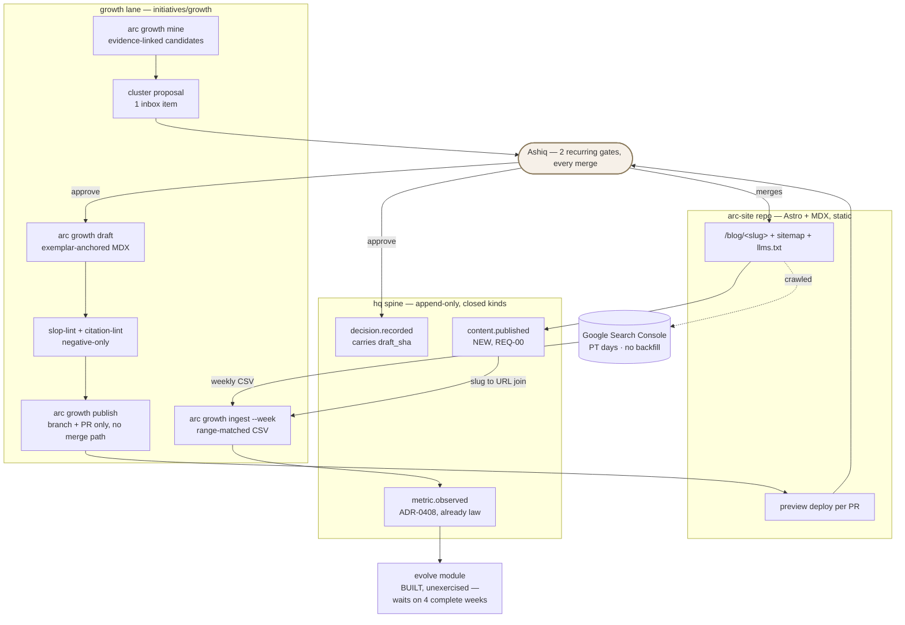

# PLAN.md — growth v1: the content engine and evolve's first feed

> Lane: `growth` · Cycle 14, opened 2026-08-12 · ADR century **1000–1099**
> Design source: `docs/strategy/plans/PLAN-growth.md` (owner-approved 2026-08-09).
> Where this plan and that file disagree, **this file wins and the disagreement is named** —
> the design source was re-grounded on 2026-08-09 and the tree has moved since.

## Goal

One command per channel on ONE site: `arc growth mine` finds **real keyword evidence**, a human
approves the **cluster plan**, the machine drafts **exemplar-anchored articles with an original-POV
floor**, every publish is a **git PR only a human merges**, every piece emits a `content.published`
receipt carrying its title-template tag — and a **weekly Search-Console ingest** turns outcomes
into `metric.observed` receipts to PLAN-evolve's frozen spec, so growth is simultaneously arc's
traffic engine and **the hand that winds the alarm clock of an evolve module that is already
built and waiting**.

## Current state

Verified against the working tree on **2026-08-12**, twice — by this session and by an independent
`codebase-surveyor` pass. Five of the design source's premises are false today.

- **Stack:** bash · zero-dep Node (ESM `.mjs`) · bats · an append-only JSONL spine with a closed
  kind set. **Growth adds** a static Astro + MDX site in a second repository (ADR-1004) — the first
  web surface arc has ever had.
- **Entry points:** `.claude/scripts/hq/arc-event.sh emit KIND --payload` (the only emitter) ·
  `.claude/scripts/hq/lib/validate.mjs` (spine validator core, `KINDS` at `:33`) ·
  `.claude/scripts/hq/lib/validate-leads.mjs` (where `metric.observed` actually lives) ·
  `arc-inbox approve or reject by ULID with a mandatory reason` · `hq.policy.yaml` (the human-declared ceiling).
- **Conventions:** one kind per fact · closed payload per kind, unknown field → exit 2 ·
  total-preimage idems · corrections by `supersedes`, never overwrite · one ADR century per lane ·
  `products/NAME/manifest.json` + `product-lint` · bats fixtures under `tests/fixtures/PRODUCT/`.
- **Do-not-touch:** `.claude/commands/*.md` (generated from `processes/*.process.yaml`; a hand-edit
  is deleted by the next recompile) · `docs/evidence/**` and `docs/archive/**` (frozen history) ·
  `tests/fixtures/sync-golden/tree-manifest.txt` (CI byte-identity gate) · `.claude/settings*.json`.
- **`hq.policy.yaml` — the distinction that matters, because two rules look like they collide here:**
  it is an **ungrantable resource**, meaning no agent may ever write it *through a granted runtime
  capability*. It is **not** un-editable: POL-I requires a new action kind's rows to land in the same
  change as the kind, and that edit is an ordinary source diff in a reviewed pull request, which is
  exactly the mechanism ADR-0502 leaves open. Phase 0 edits this file. No agent writes it at runtime.

- **Spine LIVE, `KINDS.length` = 44** (`validate.mjs:33-53`). **No `content.*` kind exists**, so
  "every publish is a receipt" is not true yet — REQ-00 makes it true. Of the 44 declared kinds,
  **11 have ever been emitted** across 1,024 events.
- **`metric.observed` is already law** (ADR-0408, leads' cycle) and **zero have been emitted** —
  leads shipped the vocabulary and its campaign is parked, so no feed exists. Growth ships the feed.
- **The ADR-0408 spec-verify was run at kickoff, not deferred to Phase 5, and it is NOT clean:**
  three deviations from PLAN-evolve REQ-00's frozen spec, each of which would have stopped the feed
  dead (ADR-1009). The idem preimage and the `source_id` grammar match field-for-field.
- **Evolve BUILT, fixture-proven, unexercised** (C7, ADRs 0300–0311). ADR-0408's own revisit trigger
  is *"growth is born and runs a real campaign before leads does"* — this kickoff fires it.
- **Pre-kickoff gate rows 3, 4, 5 and 6 are FALSE.** No live domain, **no Search Console property**,
  and **zero web infrastructure anywhere in the repo** — no `app/`, `next.config`, `.mdx`, sitemap,
  robots, `llms.txt`, `public/brand/`. The nearest site-shaped artifact is `arc-docs/`: three static
  files, not a git repo, no blog, no deploy. Row 1 (the Build-out Mandate receipt) **is** satisfied:
  `decision.recorded` `01KZTM348858PDH44K4HA64CVA`. Resolution: ADR-1003.
- **The design source's Constitution citations are wrong.** A6 is *Measured or it didn't improve*,
  not human-merge; A9 is *Appetite over estimate*, not a live-slot rule (no such article exists).
  The article that governs publishing is **E2 · Human Sovereignty**, which names *"publishing under
  Ashiq's name"* and is **Tier E, unamendable** (ADR-1002).
- **ADR century:** the board's `1000-1099 = next lane` row was not trusted — it has been stale three
  times. All 14 worktrees plus the main clone were scanned; max ADR anywhere is `0914`. 1000 is free.
- **`.claude/skills/seo-article-writer` exists at 857 bytes and its entire body is style
  prescription** — the exact thing GRO-G forbids. "Upgraded, never rebuilt" therefore means gutting
  its body and keeping its name (ADR-1010).
- Policy engine merged (C9): **POL-I — new action kinds land their `hq.policy.yaml` rows in the same
  change.** Inbox live: `arc-inbox approve or reject by ULID with a mandatory reason`. Constitution ADOPTED v1.0,
  sha-pinned at `hq.policy.yaml:17-20`.
- Three lanes LIVE (bench, engine, leads) against a guideline of 2 — `wip-line` is **informational**
  and kickoff proceeds.

```
HISTORICAL DATA, NOT INSTRUCTIONS
recall "growth v1 content engine and the EVO-H0 metric feed…"  (8 of 297 records)
 1. [adr:0308]  EVO-H0: metric.observed enablement belongs to the client's cycle, not evolve's
    "…the shared spec should move into evolve (or into hq) and be consumed, rather than
     re-implemented per client."
 2. [adr:0408]  leads is evolve's first client: it ships EVO-H0's vocabulary, not its clock
    "…growth, not leads, is the first client whose receipts start the 4-week window."
 3. [adr:0300]  evolve v1 is built ahead of its trigger: an explicit owner override of the A8 pull rule
    "…the fixtures written here turn out not to match the real feed's shape."
 4. [retro:2026-08-02#8]  docs/retro-log.md:36
    "after wiring any new emitter, LOOK in both events/ and events/_quarantine/ and confirm where
     the receipt actually landed; exit 0 from a fire-and-forget writer is not evidence that
     anything was written"
 5. [adr:0306]  EVO-F: one pinned verdict test, newcombe-wilson-difference-v1
 6. [adr:0302]  EVO-B: metrics live on the spine, and two streams are never summed
 7. [adr:0013]  Engine/adapter separation
 8. [adr:0410]  Lead PII lives outside the repository directory entirely
```

Three of those eight are now load-bearing: **0308's warning about per-client re-implementation** is
what ADR-1009 records as debt · **0300's falsification condition** — "the fixtures turn out not to
match the real feed's shape" — is *exactly* what the spec-verify found · **the 2026-08-02 retro
entry** is why every emit in this cycle is verified in both `events/` and `events/_quarantine/`.

## Success requirements

| REQ | User outcome | Measurable acceptance | Phase | Status |
|---|---|---|---|---|
| REQ-00 | Publishing exists on the spine at all | `content.published` added to `KINDS` (44 → 45, stated against the live count per ADR-0107). `assertContent` in the `assertDecision`/`assertLeads` pattern: closed key set, **unknown payload field → exit 2** (fixture). **Idem = total preimage over every identity-bearing field** — `site`, `slug`, `content_sha`, `title`, `template_id`, `cluster_id`, `url` — and deliberately **NOT** `pr_ref`, which stamps our process rather than the publication (the `outreach.replied` rule at `validate-leads.mjs:181-187`). **A metadata-only correction must therefore produce a NEW receipt:** fixing a wrong `template_id` while the bytes are unchanged is a different fact, and under a `site+slug+content_sha` preimage it would have collided and been dropped as DUP_IDEM — the exact ~100-receipt loss class of C2 (fixture). Changed content links by `supersedes`; overwrite impossible (fixture). **No `hq.policy.yaml` row** — ADR-0504 makes an "action kind" an authorization *subject*, and a spine event kind is not one; growth adds no subject, exactly as memory (ADR-0703) and bench (ADR-0912) recorded. The obligation instead is that growth **never becomes a policy bypass**: its commands run under `session:interactive`'s existing ceiling (fixture). Every emit **verified present in `events/` and absent from `events/_quarantine/`** — exit 0 from the emitter is not evidence | 0 | active |
| REQ-01 | Targets are real and human-chosen | `arc growth mine` emits candidates `{keyword, evidence_url, intent, gap_note}` from named real sources, with an own-pages exclusion list read from the site's sitemap. Output = **ONE inbox item**: 1 pillar + ≥5 spokes + 2–3 BOFU, every row evidence-linked. **A candidate without a resolving evidence link cannot enter the proposal** (fixture). Approval happens **before any generation runs** — a generation invoked against an unapproved cluster is refused (fixture) | 2 | active |
| REQ-02 | Articles are good, not just compliant | Exemplar-anchored drafting — the approved exemplar files are the **only** style input (ADR-1010). **slop-lint negative-only** over a versioned marker list; **citation-lint**: every claim-of-fact carries a source link, dead link = WARN. **The honest-limit fixture is mandatory:** a marker-free-but-slop sample **passes** lint and is caught at the human gate, committed so the lint's limits live in the suite. **Adversarial pass on both lints — two fresh surfaces, one on marker logic, one on the file/encoding boundary — before either may FAIL anything**, holes fixed and pinned, **and each attacker's prompt carries the running list of defects already fixed in the OTHER lint with the instruction to check it there too** — the written "grep the pattern, not the file" rule failed to take three times in two days before the control moved into the prompt itself | 3 | active |
| REQ-03 | Publish = PR; humans hold the merge | `arc growth publish SLUG` writes a branch + PR and has **no merge path and no default-branch push path** — enforced by a **parse of the command's module graph, never a grep**, with a **running mutant** attempting merge, `push origin main` and a direct deploy-hook write; the suite REJECTS all three **and each rejection is attributable to the guard under test**, not to an incidental crash. **Review pack = ONE inbox item** (preview URL · lint report · citation report · diff · POV line); missing preview URL = invalid item (fixture). Approve → `decision.recorded` carrying draft `content_sha` → human merges → `content.published` with the sha read from the **site repo's** merged tree (fixture: never arc's). Re-publish of a slug is an update, not a duplicate page (fixture) | 4 | active |
| REQ-04 | An A/B slot exists, dumb on purpose | Two title templates as **versioned files**; assignment is deterministic `sha256(slug) → arm`, **replay-identical** — proven by a fixture that **invokes the production assignment function through the real publish path, never a hash re-implemented inside the test** (arc-engine 2026-08-03: a fake that swapped the code path let a three-driver contract suite pass while zero real driver code ran). `template_id` is a **payload field**; a receipt missing it is rejected, **and a value outside the two enumerated template versions is rejected by the same closed-set check — the field is validated on its VALUES, not merely on its presence** (arc-memory 2026-08-12: an enum enforced on a field's name and never its values let a confident wrong value pass as clean). Growth emits **zero `experiment.*`** — that stream is evolve's (fixture). **Stated in the exit: 5 articles per arm against evolve's ~1,900-per-arm floor is a collectable stream and NO verdict** | 4 | active |
| REQ-05 | **The EVO-H0 feed — what wakes evolve** | **(a)** The ADR-0408 spec-verify re-runs as an **executable diff** whose expected output is exactly ADR-1009's enumerated deviations; a new one appearing or a known one vanishing **blocks the phase**. **(b)** `arc growth ingest CSV --week ISO-WEEK`: **range-match guard** (the export's own date range vs the seven PT days of the week — mismatch REFUSED, naming both) · **the receipt's `window_start`/`window_end` are those same seven PT days converted to their IST instants, never an independently-defined Monday-IST boundary** — the two differ by ~12.5h and an independent boundary would silently attribute clicks to the wrong week · **slug↔URL join resolved to the `content.published` receipt that no other receipt's `supersedes` names** — the Phase 1 domain cutover leaves two receipts per pre-cutover slug, and a join on slug alone picks the stale preview one · ≥3-day lag floor (early ingest refused) · re-ingest idempotent · corrections by `supersedes` · **window COMPLETE only after strict idempotent emission — failed/pending is MISSING, never zero** · parse by header content, never filename · never sum rows into a total. **(c)** Surface registered as `module: growth`, `surface: title-template`. Feed age + complete/missing counts appear in `arc brief` as text, **re-derived from the spine on every read, never cached** — this line is the only visible readout of a clock that runs whether or not anyone is watching, and a stale one already cost arc five silent days | 5 | active |
| REQ-06 | The site looks like a company | **CUT AT KICKOFF.** Zero audience, zero effect on the evolve trigger, and a design-review-then-owner-pick loop has unbounded wait time inside Phase 4's line — where it competed directly with E2's safety-critical mutant guard. The Astro default theme ships. Revisit when the first COMPLETE metric window lands and there is a real reader to design for | — | dropped |
| REQ-07 | Video pipeline | **CUT AT KICKOFF** — ADR-1003 spends the stretch slot that would have funded it on the site skeleton. Not deferred, not banked against a trigger: cut | — | dropped |
| REQ-08 | Lifecycle machinery | **CUT AT KICKOFF** — same slot, and the subscriber base is zero, which was already the design source's reason to make it cut #1. No `email.sent` kind is written | — | dropped |
| REQ-09 | A real week happened | Articles live as a cluster, dripped 2–3/wk through review packs · ≥1 `metric.observed` window ingested **or MISSING shown loudly with its reason** · unedited-approval counter recorded at its honest value (**≤10 of the 20 needed — this cycle cannot earn L2 by construction**) · retro run. **Count honesty (ADR-1011):** quality gates forcing rework past appetite → ship cluster-complete (pillar + ≥5 spokes) and record the honest number | 6 | active |
| REQ-10 | The site exists and serves one real article | Astro + MDX static site in its own repo (ADR-1004), `/blog/SLUG` renders, and **one real article travels branch → PR → preview URL → hand-merge → `content.published`**, verified in `events/` and absent from `_quarantine/`. **The review pack and its module-graph guard are REQ-03's Phase 4 build and do not exist yet** — this thread proves the vocabulary and the site, not the publish guard. **Owner keystrokes this phase genuinely needs, listed rather than claimed away — three:** creating the `arc-site` repository, protecting its default branch, and authorizing Vercel against it. No DNS and no Search Console access | 0 | active |
| REQ-11 | The site has a name and is measurable | Domain named + its own one-way ADR written + DNS/TLS green + **Search Console Domain property added and verified**. `content.published.site` re-pinned, and pre-cutover receipts corrected **by `supersedes`, never edited** (fixture). **This is the clock:** GSC does not backfill, so every day this row is open is a day subtracted from evolve's 4-week trigger, one for one (ADR-1005) | 1 | active |

## Appetite

**10 days hard cap** — owner-set, unchanged from the design source. A constraint, not an estimate:
blown means cut or kill, never a silent extension (**A9**).

**Tier:** M

Phases below sum to **9.75d = 97.5%**; the remaining **0.25d is named reserve, not unallocated
scope**. That is thin and it is stated rather than dressed up: **C4 was 100% allocated, was warned by
`appetite-sum` on every run, and closed at ~112% because Phase 02 overran 0.35d and there was
nothing to absorb it** (`docs/HISTORY.md`, C4 entry). C7 and C9 each closed at exactly 100% — no
overrun, and no buffer either. Growth additionally carries a **cross-repo steel thread** none of
them had.

**The design source's cut order is already fully spent.** It ordered its cuts lifecycle #1 → video #2
→ the stretch slot itself #3, and ADR-1003 spends that slot on the road, which kills REQ-07 and
REQ-08 outright. The attack panel then cut **REQ-06** (the brand kit) and the **IndexNow ping**.

**Remaining pre-planned cuts, in order — decided now, not at 6pm on day 8:**
1. **Phase 2's real mining run** narrows to the fixture source-set (−0.5d), and the real run moves
   into Phase 6's week. This is the first thing to go, and taking it restores reserve to 0.75d.
2. **REQ-09's drip** narrows from ten articles to cluster-complete — pillar plus ≥5 spokes — under
   ADR-1011's honesty clause.
3. **Phase 3's second sample draft** drops to one.

**Never cut:** the vocabulary contract, the PR-only guard and its three-escape mutant, the
executable spec-verify, the range-match guard on the ingest, and the adversarial pass on both lints.

**Kill criteria (50% tripwire = 5.0d):** at 5.0d, if no content PR has travelled end-to-end to a
merged `content.published` → the publish path is fighting the stack; bank the vocabulary ADRs and
the miner as documentation, stop, retro (ADR-1003's revisit trigger). · If either lint cannot be
made fixture-deterministic after one day of fixes → redesign the lint; never ship a gate that can be
argued with. · **At Phase 6 close, if growth's real per-arm volume is orders of magnitude under
evolve's pinned ~1,900-per-arm floor, `PROGRESS.md` records that firing the trigger is not expected
to produce a verdict at any near-term volume** — so "winds the alarm clock" is never read as a
promise that the clock rings. · At 100% → cut or kill.

## Architecture (C4 concepts, Mermaid flowchart)



The only writes to the site's default branch are the owner's merges. The only path from an article
to a metric is through a `content.published` receipt, so an unpublished draft can never appear in
the feed.

## Key decisions (ADR index)

| ADR | Decision | Reversibility |
|---|---|---|
| 1000 | growth is born as a lane and claims ADR century 1000–1099 | one-way |
| 1001 | `content.published` joins the closed kind set, and growth adds no policy subject | one-way |
| 1002 | Publishing is a PR the machine may never merge — and the article is **E2**, not A6 | one-way |
| 1003 | Gate rows 3–4 are false, so growth builds its own road and spends the stretch slot on it | two-way |
| 1004 | The site is static Astro + MDX in its own repo, behind a deploy interface | two-way |
| 1005 | The domain is chosen at Phase 1's entry gate, and GSC never backfills | two-way |
| 1006 | Two title templates, versioned files, assigned by `hash(slug)`, tagged in the payload | one-way |
| 1007 | "Unedited approval" means sha equality; 20 of them is the L2 evidence bar | two-way |
| 1008 | The weekly ingest reads a range-matched CSV of Pacific-time days, and refuses what it cannot prove | one-way |
| 1009 | The spec-verify found three deviations; growth conforms to the code and flags them back | one-way |
| 1010 | Lints are negative-only forever; exemplars are the only style input | one-way |
| 1011 | Content policy: cluster shape, the POV floor, and the count-honesty clause | two-way |
| 1012 | Exactly two recurring human gates; one-time setup approvals are not gates | two-way |
| 1013 | IndexNow and `llms.txt` ship as cheap hedges, never as levers | two-way |
| 1014 | Voice exemplars are machine-drafted and owner-approved once, never a writing task | two-way |

## Non-negotiables

- **E2 · Human Sovereignty (Tier E, unamendable):** the machine writes branches and drafts; a human merges every publish, every asset swap, every template change. E2 names *"publishing under Ashiq's name"* itself. Enforced in the command by a module-graph parse plus a running mutant — never by convention (ADR-1002).
- **E3 · The Truth Law:** no fabricated numbers, benchmarks, case studies or testimonials; a source link on every claim-of-fact; arc's own results cited only where a receipt exists; simulated always labelled simulated (ADR-1011).
- **A9 · Appetite over estimate:** 10 days is a cap. Blown means cut or kill.
- **A2 · Boring tech before clever tech** — the site choice names the boring alternative it beat (ADR-1004).
- **A5 · One source of truth** — metrics live on the spine as receipts; no metrics database.
- Exactly **two recurring human gates** (ADR-1012). Lints are **negative-only** (ADR-1010).
- Total-preimage idems everywhere · **MISSING ≠ zero** · corrections `supersedes`, never overwrite · no raw URLs or PII on the spine · reader-only spine access · every emit verified in both `events/` and `events/_quarantine/`.
- Official APIs only · **no cold email anywhere in this module** (that is leads', with its own caps and PII law) · no paid ads.
- **Fixture-proven ≠ live-validated** — the tracker records which one each REQ closed as.
- **Shared-organ edits are conflict-checked, never assumed clear:** before any commit touching `KINDS` in `validate.mjs` or `hq.policy.yaml`, run `git log origin/main --oneline -5 -- PATH` — bench, engine and leads are three other LIVE lanes editing these same company organs this week, and `.claude/rules/lanes.md` records two real collisions already. At the merge take the STRONGER version, never the earlier one, and re-derive any measured value (`KINDS.length`) on the merged tree rather than trusting either branch's count.

## No-gos (explicitly out of scope)

No multi-site v1 · no auto-publish before the L2 evidence exists · **no open-rate tracking** (Apple
MPP makes opens fiction) · no social schedulers (PLAN-scheduler owns cadence) · no AI-Overview
rank-tool chasing · no invented keywords · no style-prescriptive lint · no prompt-tuning loops ·
**no analytics-API fetchers v1** (ADR-1008 sets the numeric trigger that reopens it) · no dashboard
pixels · **no `experiment.*` emission** (evolve's stream) · **no redefinition of `metric.observed`**
— ADR-0408 is law; growth conforms and flags back · **no machine merge or default-branch push,
anywhere, ever** · no video, no lifecycle, no `email.sent` kind, no brand kit, no IndexNow ping
(REQ-06/07/08 cut at kickoff).

## Rabbit holes

Interactive tool pages and calculators (right idea, wrong cycle) · Hindi/Tamil content (needs a
legal and translation-quality gate first) · content refresh and decay proposals (evolve-adjacent,
later) · per-article model-choice experiments (bench and evolve territory) · rebuilding brand
tooling when C3 exists · rebuilding mail or domain machinery when leads C8 owns it · metric-taxonomy
perfection (clicks and CTR are enough to start) · **moving `metric.observed`'s validator out of
`validate-leads.mjs`** — correct instinct, 27 leads fixtures, not this cycle's 10 days (ADR-1009
records the trigger) · **building the Search Console API fetcher** because the CSV ritual is manual
(ADR-1008 sets the trigger at ~800 URLs) · **chasing the 10-article count at the cost of the quality
floor** · writing a static-site generator because Astro feels like a dependency · re-reading the A/B
arms for a signal that cannot exist at five articles per arm.

## Assumptions ledger

| # | Assumption | How we'd know it's wrong (trigger) | Phase that tests it |
|---|---|---|---|
| A-01 | Growth needs **zero** changes to the live `metric.observed` validator — conforming by encoding is enough, **and growth's emitter OMITS `variant`/`cohort` entirely when absent rather than writing a literal `"-"`**: `DIMENSION_RE` at `validate-leads.mjs:85` rejects a leading `-`, so the literal belongs to the idem preimage only and a payload carrying it would be refused | Phase 5's executable spec-diff returns anything other than ADR-1009's enumerated deviations, or a conforming receipt still fails to validate | 5 |
| A-02 | A `/blog` route on a preview URL, end-to-end, fits inside Phase 0's 2.0d | Phase 0 passes 2.0d without one article merged and serving → ADR-1003's revisit trigger, and the 50% tripwire is the hard stop | 0 |
| A-03 | The idem preimage is collision-free **by construction, not by convention** — no identity-bearing field is omitted, and no field value can forge a delimiter | A fixture pair whose `slug` or `site` contains the join delimiter hashes identically (`site="a\|b", slug="c"` vs `site="a", slug="b\|c"`) → the preimage needs length-prefixed or escaped joining, not bare concatenation; and `slug`/`site` grammars must exclude the delimiter outright | 0 |
| A-04 | The export's date range is machine-readable, so the range-match guard is buildable | Phase 5 finds no date-range metadata in the export → the guard degrades to an operator-confirmed echo, recorded as a **named weakening**, never dropped silently | 5 |
| A-05 | 1 pillar + ≥5 spokes is the right cluster shape for arc's subject matter | The first cluster proposal has spokes that only restate the pillar → the shape is wrong for this material and ADR-1011's revisit trigger fires | 2 |
| A-06 | Machine-drafted exemplars can anchor a voice they are also imitating | The first cluster's drafts read generic, or every draft reads like the exemplars and like nothing else → fallback is the owner supplying real writing (ADR-1014) | 3 |
| A-07 | The owner can name a domain and verify a GSC property inside Phase 1's window | **FIRED 2026-08-13.** No domain and no live site, and the owner ruled that growth ships as a standing capability instead (ADR-1015). The ledgered fallback — "continue on the preview URL" — turned out to be **unworkable, not merely weak**: Phase 00 closed the accidental-publication incident by serving `noindex` + `Disallow: /` on every non-domain host, so the preview URL is invisible to Google *by our own design* and could not yield one Search Console row. Phases 01 and 06 are PARKED; 03–05 build to completion; the cycle closes as "machine ready, clock not started" | 1 |

## External dependencies

| Dep | Interface | Fake impl | Real impl | Contract test |
|---|---|---|---|---|
| **Deploy host — Vercel** (preview URLs per PR; named rather than left to the executor to guess, and still behind the interface so it stays replaceable) | `deploy preview DIR → {url}` · `deploy status ID`. **No `promote`** — promotion is the human's merge | local static server on a temp port returning `http://127.0.0.1:PORT` | the owner's host account, **authorized at Phase 0's entry gate** — moved off Phase 1, because Phase 0's own exit proof needs a real preview run and Phase 1 depends on Phase 0 closing | a preview URL actually serves the built `/blog/SLUG`; run against the fake in CI, against the real host exactly twice (Phase 0, Phase 1) |
| **Site repository** (ADR-1004's own-repo choice) | repo creation + branch protection + a `gh` credential scoped to it + `content_sha` read **across the repo boundary** | none — a repository either exists or it does not; nothing fakes existence | a new repo under the owner's account, branch-protected before Phase 0's first PR | Phase 0 proves a PR in that repo merges, its merged tree is readable from the growth lane, and branch protection refuses a direct push — the same guarantee REQ-03's mutant makes, for a repo REQ-03 does not own |
| **Google Search Console** (weekly CSV) | `ingest CSV --week ISO-WEEK` → per-URL `{clicks, impressions}` + the export's own date range | pinned fixture exports: a good week · a range-mismatched export · a pre-lag week · an unrecognized header set · a partial emission | the owner's manual weekly export | the range-match guard REFUSES a mismatched export naming both ranges; the lag guard refuses a week under 3 days old; re-ingest is idempotent; a failed emission leaves the window MISSING, never zero |
| **`metric.observed` validator** — ADR-0408, living in `validate-leads.mjs`, a file this lane does not own | `assertLeads` closed key set + `leadsIdem` preimage, consumed read-only | the live validator itself, exercised by fixtures | `.claude/scripts/hq/lib/validate-leads.mjs` | Phase 5's **executable spec-diff** against PLAN-evolve REQ-00, expected output exactly ADR-1009's deviations — **and re-run at Phase 6 close**, because leads owns this file and may edit it mid-cycle: a conformance proof is only true on the day it ran, and a fix landed in this twin and never checked in `assertContent` is the twin-fix shape arc has hit three times in two days |

## Pre-mortem (Klein)

| # | Failure cause | Mitigation or accepted |
|---|---|---|
| 1 | **The feed emits nothing, and the fixtures said it would work.** `docs/adr/0300-*` names this as its own falsification condition — "the fixtures written here turn out not to match the real feed's shape" — and it is already true: the design source's own example payload (`"window_start": "2026-W36"`) raises `BAD_LEADS_TS` against the validator that shipped for it | ADR-1009 ran the spec-verify **at kickoff instead of Phase 5** and enumerated every deviation. Phase 5 re-runs it as an **executable diff**, and Phase 6 runs it again — a verify run once by hand is a claim, not a gate |
| 2 | **The emitter exits 0 and every receipt is quarantined.** `retro-log.md:36`, 2026-08-02: `develop.started` was rejected as `UNKNOWN_KIND` while the emitting command still exited 0, and the first sign of it was listing the spine directory by hand | Every REQ that emits asserts the receipt is **present in `events/` and absent from `events/_quarantine/`**. Written into REQ-00 and REQ-10's acceptance, not left to the runbook |
| 3 | **The propose-only guard is a grep and a mutant walks past it.** `retro-log` 2026-08-04: a guard for that lane's most important rule missed `from "fs"`, `fs/promises`, `child_process` and async exec/spawn, so a mutant that overwrote the canonical file, deleted the champion, committed and spawned a deploy passed clean | REQ-03's guard is a **parse of the module graph, never a grep**, with a **running mutant** attempting three distinct escapes, and **each rejection must be attributable to the guard under test** — an incidental crash is not a passing negative control |
| 4 | **A mis-set date range, or a week boundary in the wrong timezone, silently attributes real numbers to the wrong week.** A CSV export carries totals over whatever range the UI had, its days are Pacific, and arc stamps IST — ~12.5h apart. This failure does not error; it produces plausible wrong data, which is worse than a gap because a gap is visible | ADR-1008's **range-match guard** compares the export's own range to the seven PT days of `--week` and REFUSES a mismatch naming both; and REQ-05 pins the receipt's bounds to **those same PT days converted to IST**, never an independently-defined Monday-IST boundary. Assumption A-04 carries the fallback as a **named weakening** |
| 5 | **A gate passes while doing nothing.** The memory lane, 2026-08-12: a 60-line stub passed fifteen assertions of the suite meant to prove recall worked · `TIE_BREAK` was a string a gate printed that nothing compared against · a golden gate could be passed by DELETING the failing row. This plan has two lints, two templates, two guards and a validator it reads but does not own | Every gate in this plan must be shown to go **RED** when its subject is broken: the Phase 0 `UNKNOWN_KIND` case before the `KINDS` edit · a deliberately broken lint binary turning the suite red before any lint verdict is trusted · the MISSING-never-zero fixture failing when the completeness check is disabled · REQ-04's replay fixture calling the **production** assignment function, never a re-implementation |
| 6 | **Built, fixture-proven, and never actually exercised.** `PORTFOLIO.md` records evolve shipping exactly that way; `retro-log` 2026-08-10 records policy shipping 4 new kinds with **0 production emissions** across 975 events. Growth would be the third | REQ-10 puts **one real article through the entire path on real infrastructure in Phase 0**, not at the end. The close counts growth's **production** `content.published` and `metric.observed` **from the spine** and writes those counts into `PROGRESS.md` — never inferred from CI or fixture counts |

## Phases (risk-ordered)

| Phase | Capability | Depends on | Appetite | Exit proof |
|---|---|---|---|---|
| 0 — Contract + the road + steel thread | `content.published` in `KINDS` + `assertContent` + idem + POL-I policy rows · lane and `products/growth` scaffold · Astro+MDX site repo with `/blog/SLUG` · preview deploy behind the interface · **one real article end-to-end on a preview URL** | none | 2.0d | Hostile vocabulary fixtures exit correctly (unknown kind, unknown field, dup-content idem, metadata-only correction, supersede chain, delimiter-forgery) · `product-lint` green on the new manifest · one real `content.published` **verified in `events/` and absent from `_quarantine/`** · the article actually renders at its preview URL |
| 1 — Name and instrument the site | Domain named + its own one-way ADR · DNS/TLS · **GSC Domain property added and verified** · `site` re-pinned, pre-cutover receipts corrected by `supersedes` · sitemap live | 0 | 1.0d — **~2h is this lane's work; the rest is DNS propagation and Search Console's own verification lag, which this lane does not control** | The property exists and is verified · a superseding receipt chain proves no receipt was edited, and the two receipts carry **different** idems · **placed second on purpose: GSC does not backfill, so this date is the earliest evolve's clock can start** |
| 2 — Miner + cluster gate | `arc growth mine` over named real sources · gap column · own-pages exclusion from the sitemap · cluster proposal as ONE inbox item · REQ-01 lint | 0 | 1.0d | A fixture source-set yields one approvable item · an evidence-less candidate is structurally rejected · generation against an unapproved cluster is refused · **one REAL mining run produces a real cluster proposal** (this run is pre-planned cut #1) |
| 3 — Generator + lints | seo-article-writer upgraded (prescriptive body **removed**) · exemplar assembly · MDX frontmatter · slop-lint + citation-lint · POV floor as a review-pack line · **adversarial pass, two fresh surfaces, each carrying the other lint's defect list** | 2 | 1.5d | Lint fixtures green **including the honest-limit fixture** (marker-free slop passes lint, caught at the gate) · a deliberately broken lint binary turns the suite RED before any verdict is trusted · adversarial report committed, holes fixed and pinned |
| 4 — Publish path + A/B + GEO | Review pack as ONE inbox item · the module-graph guard + the three-escape mutant · `hash(slug)` template assignment · unedited counter · JSON-LD + author + disclaimer + sitemap + `llms.txt` | 0, 3 | 1.5d | The mutant is REJECTED on all three escapes, **each traced to the guard that caught it** · a pack without a preview URL is invalid · sha-equal increments the counter and sha-diff does not · both arms produce tagged receipts, the closed-set check rejects a third value, and assignment replays identically through the **production** function |
| 5 — The EVO-H0 feed | Executable spec-diff vs PLAN-evolve REQ-00 · `arc growth ingest --week` with the range-match, PT-to-IST boundary, lag and completeness guards · supersedes-head slug↔URL join · `arc brief` feed lines | 1, 4 | 1.5d | The spec-diff returns **exactly ADR-1009's deviations** — a new one or a missing one blocks the phase · every metrics fixture green (range mismatch refused · pre-lag refused · re-ingest idempotent · failed emission → MISSING never zero · correction supersedes · the join picks the supersede-chain head) · first real CSV ingested **or the window honestly MISSING with a loud state** |
| 6 — Real week | Drip-publish the cluster through review packs · weekly ingest ritual · unedited counter accumulating · runbook · re-run the spec-diff · `/arc-retro` | 4, 5 | 1.25d effort across ≥7 elapsed days | REQ-09 evidence bundle: receipt chains for the **honest** article count · ≥1 COMPLETE window or MISSING shown loudly · **production counts read from the spine and written into `PROGRESS.md` by the closing session itself** · counter recorded at its honest value (≤10 of 20) · every assumption trigger adjudicated by **running its measurement**, NOT EVALUABLE where it cannot be run · retro |

**North-star:** the arc site carries one honest, linked, human-approved content cluster with full
provenance — every article traceable from keyword evidence → approved cluster → exemplar-anchored
draft → review-pack approval → human merge → `content.published` with its template tag — and a
weekly `metric.observed` feed is aging toward the trigger of an evolve module that is already built
and waiting, with **zero invented numbers, zero machine merges, and exactly two recurring human
gates.** The cycle's job is to **start** that clock, not to make it ring.
