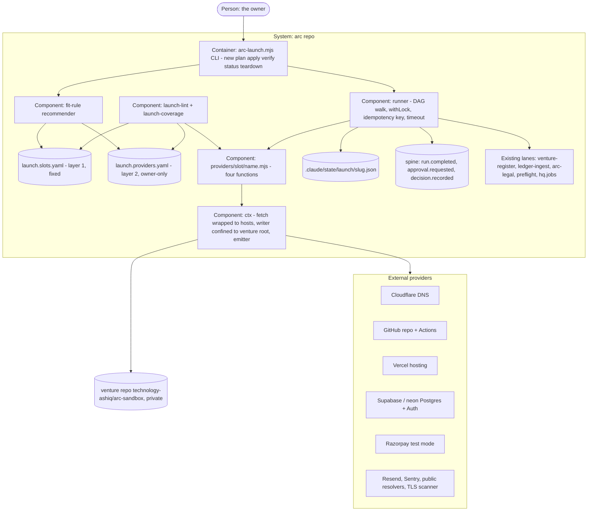

# PLAN.md — launch v1: the venture factory (lane `launch`, Cycle 1)

Cut on 2026-10-03 from the frozen design source `docs/strategy/plans/PLAN-launch.md` (v1.1, review-adjudicated).
Attack findings mutate THIS file, never the design source. Owner rulings: 2026-10-03 *"launch lane pudichuruku"*
(lane born; the process is fixed, every tool is dynamic) and the same day *"Nilluvai plan illa"* (no Nilluvai;
the dogfood is a rehearsal venture). Both go on the spine as `decision.recorded` in Phase 00 (ADR-1700).
Owner standing instruction 2026-10-03: build every phase without waiting, push freely, CI is the only test runner.

## Goal

One sentence: **`arc launch new {venture}` turns a `venture.yaml` profile into a running, billing, observed,
backed-up, receipted product on its own domain — through one fixed sequence of capability slots, each filled by
whichever vetted tool the registry recommends for that venture, swappable later by one YAML row and one adapter
file.** The owner is who it is for: today every venture (LexOS) is hand-built outside arc, and the money side of the
spine is empty after eleven weeks.

**v1 proof (this cycle):** on the rehearsal venture `arc-sandbox`, a login works on its own subdomain from a
git-triggered deploy, a test-mode purchase lands in the ledger as `revenue.simulated`, a backup is restored and
matches, and a second provider enters one slot by row + adapter alone — each with a receipt.

Fixed: the slot list and each slot's exit criteria. Free: which tool fills a slot, when, and how often it changes.

## Current state

Verified 2026-10-03 at `1b3c819c` (survey agent + direct reads; the agent's invented file names were discarded).

- **Stack:** Node ESM scripts (zero npm deps in the OS repo) · block-style YAML · bats on CI (3 OS legs).
- **Entry points:** new `.claude/scripts/launch/arc-launch.mjs`; data under `products/launch/`; tests `tests/launch-*.bats`.
- **Conventions:** org's product shape, `parseYamlSubset`, `withLock`, owner-only registry rows — detailed below.
- **Nothing exists of:** slot contracts, a provider registry, adapters, `arc launch`, a runner state model, a Launch
  room, a re-verify job, a teardown plan (grep `scaffold|provider|slot|launch` → only `venture-register.mjs`).
- **Product shape to copy (org, ADR-1613):** `products/{p}/manifest.json` (`name · version · requires · commands ·
  agents · scripts · files · docs · face{room, ring, …}`), scripts under `.claude/scripts/{p}/`, tests as
  `tests/{p}-*.bats` calling node helpers in `tests/{p}/*.mjs`. CI runs **bats files only**
  (`.github/workflows/ci.yml:238`, sharded by `.github/scripts/shard-tests.mjs`).
- **Spine:** `node .claude/scripts/hq/arc-event.mjs emit {kind} --payload … --process P --venture V`;
  `withLock(root, fn, {timeoutMs, lockName})` at `.claude/scripts/hq/lib/spine-io.mjs:164`; `spineRoot()` at `:41`;
  kinds closed in `.claude/scripts/hq/lib/validate.mjs` (`revenue.simulated` is a member).
- **YAML:** block-style only (ADR-0200) via `parseYamlSubset` (`.claude/scripts/engine/yaml-subset.mjs:377`).
- **Registry precedent:** `design.sources.yaml` + `.claude/scripts/design/design-sources-lint.mjs`
  (`OWNER = "ashiq"` at `:37`; `status` intent vs `availability` observed).
- **Walkers to import (LAU-L):** `.claude/scripts/core/face-coverage.mjs` exports `dirNames · mdStems · yamlStems ·
  treeScripts · treeJobs · treeVentures`.
- **Calls, never rebuilds:** `venture-register.mjs --dry-run` (refuses slug `arc`; exit 0/1/2) ·
  `lib/ledger/normalize.mjs` + the razorpay parser (imported; `ledger-ingest.mjs` is plan-bound, owner-run, `revenue.received` only) · `arc-legal.mjs render --venture {slug}` with facts at
  `initiatives/legal/{slug}/facts.yaml` · leads `preflight.mjs` (DMARC) · `hq.jobs.yaml` script-class rows.
- **Policy:** `hq.policy.yaml` `"process:{name}":` rows (L0–L3 per capability); `process:launch` lands with the
  first emission (POL-I).
- **Rehearsal domain:** `automemory.ai` NS = Cloudflare (`meera`/`noel.ns.cloudflare.com`); `sandbox.` is unused.
  Growth's site is `arc.automemory.ai` (ADR-1118), so a sibling subdomain does not touch its DNS or robots.
- **Credentials on the box (names only):** `gh` logged in, `repo` scope · Supabase CLI logged in · Vercel CLI token
  **invalid** · no Cloudflare or Razorpay key (ADR-1724).
- **Do-not-touch:** `initiatives/face/contracts/rooms.generated.json` (regenerated by `face-sections.mjs`),
  `docs/wiki/**` (regenerated), `.claude/commands/{arc-commit,arc-review,arc-kickoff}.md` (compiled).
- **Main is red today on face-coverage:** `PLAN-launch` exists with no room in `expected-set.json`; this lane's
  first PR adds the row and regenerates `face-sections`.

## Success requirements

Tier L caps active rows at 10. Two design-source REQs are merged, nothing is cut: design REQ-07 (recommendation)
is folded into REQ-08 (the owner asked for *dynamic tools* and *a suggestion of which is best* in one breath, and a
recommendation over one provider ranks nothing), and design REQ-11 (drift job) is folded into REQ-10 (both are
the wiring that keeps a venture visible after launch). IDs keep the design source's numbers.

| REQ | User outcome | Measurable acceptance | Phase | Status |
|---|---|---|---|---|
| REQ-01 | The fixed process and the tool registry exist as checked contracts | `products/launch/launch.slots.yaml` (85 seed rows, each with `tier · exit_criteria[] · depends_on[] · required_when · optional_for[]` so the full DAG exists; the 33 core rows also carry `verify · gate · approval · timeout · resume`; non-core rows carry `verify: deferred-c2`, which the lint rejects on a core row) + `launch.providers.yaml` (LAU-S schema) + `launch-lint --mutant-selftest` where each of 13 mutants fails closed and RAN is asserted first: row-without-adapter · adapter-without-row · unknown slot · slot naming a provider · `vetted` without `vetted_by` · `approved_by` ≠ owner · flow-style YAML · cycle in `depends_on` · core → non-core edge · unresolved edge · the word `default` in either YAML or an adapter · package import in an adapter (`zero-dep-leg`) · a verify whose only I/O is local file reads (`verify-is-probe`). `launch-coverage` prints the derived counts | 00 | validated |
| REQ-02 | A crashed or concurrent `apply` never loses or doubles work | runner state in `.claude/state/launch/{slug}.json` (written temp + rename); receipt idempotency key `venture@slot@provider@attempt` (ADR-1718) and a stable resource tag `venture@slot@provider` that `scaffold()` looks up before creating; fixtures green on CI: (a) a fixture adapter killed after reporting 1 of 2 resources, re-run → `attempt: 2`, the fake holds exactly 2 resources · (b) two concurrent `apply` → second exits non-zero naming the lock holder's pid · (c) slot `timeout: 1` with a 3 s fake → `failed(timeout)` with recorded resource ids, and the adapter's `AbortSignal` stops further creates · (d) `apply` on a `verified` slot → exit 0, same receipt id, zero new events · (e) killed after the provider created resource 2 but before state recorded it → re-run finds it by tag, fake holds 2 · (f) state file truncated mid-write → previous generation loads, no parse crash · (g) lock left by a killed pid → next `apply` takes over and says so | 00 | validated |
| REQ-03 | A page and a login serve on `sandbox.automemory.ai` from a git-triggered deploy | CLI six verbs (`new · plan · apply · verify · status · teardown --plan`) drive dns → repo → ci → environments → hosting → tls → secrets → frontend → release (**day-3 kill**: `curl -sI https://sandbox.automemory.ai` 200 from a deploy whose trigger is a `git push`, 9 `run.completed process=launch@0.1.0` receipts, `honesty_class: rehearsal`) → backend → database → orm → email-transactional → auth (login → session → logout) → authz (cross-tenant request returns 403) → tenancy (invite → join → scoped); gate 2 `approval.requested` emitted and decided before the first prod deploy; `domain` ends at its refusal path + `--dry-run`; every Phase 01 adapter's recorded real response replays through its real code on CI | 01 | active |
| REQ-04 | A test purchase reaches the books, labelled simulated | `payment-test` (Razorpay test mode) → `checkout-portal` → webhook → a launch-owned simulated path (imports `lib/ledger/normalize.mjs` and the razorpay parser, emits `revenue.simulated` with idem = payment id; `ledger-ingest.mjs` is not called — it is plan-bound and writes only `revenue.received`) → exactly one `revenue.simulated`, zero `revenue.received`; replaying the same webhook adds 0 events; a test refund nets to 0 in `arc pnl`, whose line is labelled simulated; a downgraded plan gets 403 on a gated route; gate 3 emits `approval.requested` and `apply payment-live` exits 2 (refusal path proven, never crossed) | 02 | active |
| REQ-06 | Every `verified` slot was answered by something outside the repo | probes recorded per slot with the external answerer named: DNS from `8.8.8.8` and `1.1.1.1` · TLS grade ≥ A from a named scanner (pending, rate-limited or unreachable → `UNSCANNED(reason)`, never verified) · security headers read from the live response · `backup` = `pg_dump` over the session pooler restored into a scratch Postgres with every table's row count equal · a thrown fixture error appears as a Sentry issue · `dependency-scan` gate present on the venture CI | 03 | active |
| REQ-08 | Tool choice is derived and a second tool enters by row + adapter only | `plan` prints per slot `recommended · why (fit-rule ids · status · last_verified) · alternatives · REFUSED (reason)`; zero vetted → `REFUSED` and `apply` exits 2; an override is a `decision.recorded` the next `plan` cites by id; `neon` reaches `vetted` for `database` (ADR-1721) in a PR whose changed-file list is exactly `products/launch/launch.providers.yaml` + `products/launch/providers/database/neon.mjs`, asserted by a bats check over `git diff --name-only`; `plan` then ranks both database providers with rule ids | 04 | active |
| REQ-09 | An adapter cannot exceed what its row allows | the Phase 00 trust fixtures re-run against every vetted real adapter, each asserting RAN first: a one-byte adapter edit → load flips the row to `candidate` and `apply` refuses (digest = sha256 after CRLF→LF normalisation; a CRLF copy keeps its digest) · `ctx.fetch` to a host not in `hosts[]` throws `HOST_REFUSED` · `ctx.write` outside the venture root throws `WRITE_REFUSED` · each `sensitive_actions[]` entry emits `approval.requested` before the adapter's action runs | 04 | active |
| REQ-10 | The venture stays wired and watched after launch | `passport` via `venture-register --dry-run` (exit 0 output recorded) · `ledger-source` registered · `face-room` present as `planned` · `teardown --plan` renders the ordered exit (export → notice → cancel → park → archive) naming every recorded resource id · one `hq.jobs.yaml` script-class row runs `verify --all --public-only` weekly (resolvers, live curl, TLS, headers; token-gated slots report `skipped(env)` and stay out of the brief; a provider-reported pause is `PAUSED(reason)`); a forced regression (expired-cert fixture) produces exactly one `needs-you` line and a `skipped(env)` slot produces zero | 04 | active |
| REQ-05 | The rehearsal board closes complete | `arc launch verify --all --venture arc-sandbox` exits 0 with every core slot `verified` or a named `ABSENT({reason})`, zero `pending`; `launch-coverage` reports 0 core slots with 0 vetted providers | 05 | active |
| REQ-12 | First real ₹ from a launch-scaffolded venture | first `revenue.received` whose `venture` was scaffolded by `launch`. **OPEN-at-first-venture**: the Phase 05 evidence bundle records it as not met, beside the `arc-sandbox` board that made it reachable | 05 | active |

## Appetite

**18 days cap** (owner-set in the design source): 15.5 days planned across the six phases, 2.5 days slack. A constraint, not an estimate.

**Tier:** L

(Derived from the number: 15.5 working days is over three five-day weeks.)

**Kill criteria:** two checkpoints. At day 7.5 (Phase 01's planned end) if Phase 01 is not closed → scope-cut conversation. The 50% tripwire is evaluated at the Phase 02 exit (as the design source sets it): if burn there exceeds the planned 10.5 days, or Phase 02 is not closed by day 12 → mandatory scope-cut conversation, using the design source's cut order: `refunds` → Cycle 2 · `errors` → Cycle 2 · `migration-rollback` → Cycle 2 · REQ-08's real second provider → Cycle 2 (its CI file-list contract still ships, with a fixture provider) · `face-room` stays `planned`. **Never cut:** the restore drill, the three gate paths, the runner state fixtures, `verify-is-probe`, the `default-word` lint. At 100% → cut or kill, never extend silently.

**Day-3 kill question (Phase 01):** *does `sandbox.automemory.ai` serve a page from a git-triggered deploy, with
nine `run.completed` receipts and a state file that resumes?* If not, STOP and record the finding — the slot
contract is wrong before auth or money is written on it.

## Architecture (C4 concepts, Mermaid flowchart)



## Key decisions (ADR index)

| # | Decision | Status |
|---|---|---|
| 1700 | The `launch` lane is born; its dogfood is the rehearsal venture `arc-sandbox` (owner rulings 2026-10-03) | accepted |
| 1701 | LAU-A: a slot is a contract, a tool is a row | accepted |
| 1702 | LAU-B: a provider row is born only by the owner | accepted |
| 1703 | LAU-C: no default, ever; zero vetted providers REFUSES | accepted |
| 1704 | LAU-D: the adapter contract is four functions and no logic | accepted |
| 1705 | LAU-E: provider lifecycle candidate → vetted → retired / blocked | accepted |
| 1706 | LAU-F: recommendation is derived, never typed | accepted |
| 1707 | LAU-G: a swap for a new venture is instant; for a live one a migration | accepted |
| 1708 | LAU-H: zero new spine kinds; three approval gates | accepted |
| 1709 | LAU-I: verify is a probe something outside the repo answered | accepted |
| 1710 | LAU-J: `venture.yaml` is the only input | accepted |
| 1711 | LAU-K: the arc wiring block runs last-but-one | accepted |
| 1712 | LAU-L: one walker, imported from face-coverage | accepted |
| 1713 | LAU-M: secrets never touch the repo; launch never fetches a key | accepted |
| 1714 | LAU-N: a venture is born with its teardown plan | accepted |
| 1715 | LAU-O: adapters live inside arc and import no package | accepted |
| 1716 | LAU-P: day-N re-verify is a ₹0 script-class job | accepted |
| 1717 | LAU-Q: slots carry a tier and a condition | accepted |
| 1718 | LAU-R: the runner is durable and resumable | accepted |
| 1719 | LAU-S: the adapter trust boundary is in the schema and enforced at run time | accepted |
| 1720 | LAU-T: `payment` is two slots, test and live | accepted |
| 1721 | REQ-08's second provider is `neon` for `database` | accepted |
| 1722 | A venture repo is private under the owner's account, named after the slug | accepted |
| 1723 | `arc launch` is a node CLI wrapped by one command doc | accepted |
| 1724 | Real-provider steps use existing free accounts and owner-placed tokens; a missing one REFUSES | accepted |

Review adjudication (design source, 2026-10-03): findings 1 (count) → REQ-01, ADR-1717 · 2 (payment order) →
ADR-1720 · 3 (`payment_model: none`) → ADR-1717 · 4 (default word) → ADR-1703 · 5 (DAG) → REQ-01 · 6 (scope) →
33 core slots + Cycle 2 below · 7 (runner) → REQ-02, ADR-1718 · 8 (trust) → REQ-09, ADR-1719.

## Non-negotiables

- A slot never names a tool and a provider row never redefines exit criteria (ADR-1701).
- No default provider anywhere: zero vetted providers is REFUSED, `apply` exits 2, and the word `default` fails the lint in both YAML files and in adapter code (ADR-1703).
- Provider rows are owner-only: `approved_by` is linted against the owner (ADR-1702); `vetted` needs a scout record, one real passing verify, a `decision.recorded` id and the digest (ADR-1705).
- Adapters are four functions with no business logic; `scaffold()` is check-then-create and reports `resources[]`; they import no package (ADR-1704, ADR-1715).
- `ctx.fetch` refuses hosts outside `hosts[]`, `ctx.write` refuses paths outside the venture root, digest drift flips the row to `candidate`, and every `sensitive_actions[]` entry emits `approval.requested` first (ADR-1719).
- Verify is a probe something outside the repo answered; `backup` is verified only by a restore with matching row counts (ADR-1709).
- Zero new spine kinds; every slot run is `run.completed process=launch@x.y.z` with `honesty_class` in the payload; the `process:launch` policy row lands with the first emission (ADR-1708).
- Every `arc-sandbox` receipt is `rehearsal`; gates 1 and 3 are exercised through their refusal paths and never crossed (ADR-1700, ADR-1720).
- Secrets never enter any repo and launch never fetches a key; a missing key is `failed(env:{KEY})` (ADR-1713, ADR-1724).
- No `depends_on` edge from a core slot to a non-core slot; the DAG is acyclic and every edge resolves (ADR-1717).
- Runner state is durable and locked per venture; the kill-mid-apply, concurrent-refusal and timeout fixtures ship in Phase 00 (ADR-1718).
- Tests run on CI only, never on this box; every fixture asserts it RAN before asserting what it printed.

## No-gos (explicitly out of scope)

- No default provider in code, slots file, template, or as a word.
- No business logic in adapters; no `migrateFrom()` (ADR-1707).
- No real money, no domain purchase, no live payment keys; no `honesty_class: real` receipt from `arc-sandbox`.
- No new spine kinds.
- No hand-written PORTFOLIO venture row; the passport only through `venture-register`.
- No price, launch date or customer-facing copy published.
- No scheduled market scan for tools (absorb two-speed ruling).
- No merge by the machine of a venture's publish PR (A6).
- No rebuilding of legal pages, content engine, mail preflight, ledger validators, team manifests or the register.
- No Cycle 2 slot in Cycle 1 — the core → non-core edge lint enforces it.
- No Nilluvai and no invented venture (owner ruling 2026-10-03).

## Rabbit holes

1. **"Just one small default for the database."** Refuse; one vetted provider per slot is the honest v1 state.
2. **A universal adapter SDK.** Four functions and a `ctx`; nothing more.
3. **Terraform / Pulumi lane-wide.** Allowed inside one adapter that needs it; a lane-wide IaC layer is a second product.
4. **A workflow engine for the runner.** A state file, a lock, an idempotency key and a DAG walk are the runner.
5. **Perfecting recommendation before the second provider exists.** Fit rules only; receipt weighting is Cycle 2.
6. **Building ops inside launch** because ops is unborn. Record `ABSENT: ops not born`.
7. **A GUI wizard first.** CLI is the contract; the room stays `planned`.
8. **Inventing a venture to make the dogfood feel real.** The rehearsal venture says what it is.
9. **Spine emission from a worktree.** It is refused; every real `apply`/`verify` runs from the MAIN clone on merged code, so each phase merges before the next one's real runs.
10. **Running provider probes inside CI.** CI has no provider tokens; CI runs the fakes and the lints, real probes run on the box and leave receipts plus evidence files that CI checks for shape.

## Assumptions ledger

Numbering follows the design source; its #1 (LAU-O dependency read) is resolved by ADR-1715 and leaves the ledger.

| Assumption | How we'd know it's wrong (trigger) | Phase that tests it |
|---|---|---|
| A-02: Razorpay test mode completes a purchase and fires webhooks before activation pages are live | test-mode order creation or webhook delivery refuses on an unactivated account on Phase 02 day 1 → `payment-test` gains `depends_on: legal-pages` by ADR and Phase 03's legal-pages moves ahead of 02 | 02 |
| A-03: Supabase PITR is NOT on the free plan, so `backup` = `pg_dump` over the session pooler restored into a local scratch Postgres (Docker, started via PowerShell) | `pg_dump` (≥ server major) or the Docker daemon missing on the box at Phase 03 day 1 → restore target becomes a second free Supabase scratch project; `ABSENT` is not allowed for backup (never-cut) | 03 |
| A-04: the legal renderer accepts fixture facts for a rehearsal venture without lane changes | `arc-legal.mjs render --venture arc-sandbox` refuses the fixture facts file → `legal-pages` = `ABSENT: legal renderer not ready` in v1 | 03 |
| A-05: `sandbox.automemory.ai` can host the rehearsal without disturbing `arc.automemory.ai` DNS or robots | the growth site's `robots.txt`, sitemap or DNS answer changes after the `dns` apply → revert the record and move the rehearsal to a second owned domain | 01 |
| A-06: a second provider for REQ-08 can be vetted in ≤ 0.5 d | neon's vet is not passing by mid-Phase 04 → try `cloudflare-workers` (ADR-1721); both fail → REQ-08 ships the file-list contract with a fixture provider, the real one moves to Cycle 2 | 04 |
| A-07: `lib/ledger/normalize.mjs` and the razorpay parser accept a test-mode webhook payload without a ledger-lane change | Phase 02 day 1: a test-mode payload is rejected by the parser → a ledger-lane `/arc-change` adds the test-mode branch, and before the push every caller is listed with `grep -ln 'normalize.mjs' tests/*.bats .claude/scripts -r` and opened (retro 2026-08-13 shared binary) | 02 |
| A-08: 85 slots is the right grain; no slot is really two | the steel thread needs a slot split to close (one slot, two independent exit proofs) → the slots file splits it by ADR; the count is derived, never a target | 01 |

## External dependencies

Phase 00 runs every contract test against fakes; the real implementation must pass before the slot's phase
closes. CI holds no provider token, so real runs happen on the box and leave receipts + evidence (rabbit hole 9).

| Dep | Interface | Fake impl | Real impl | Contract test |
|---|---|---|---|---|
| Cloudflare DNS API | `providers/dns/cloudflare.mjs` four functions over `ctx.fetch` (`api.cloudflare.com`) | `tests/launch/fakes/cloudflare.mjs` in-memory zone | Cloudflare v4 REST, zone `automemory.ai` | `tests/launch-contract.bats` dns arm: scaffold twice → one record |
| GitHub repo + Actions | `providers/repo/github.mjs`, `providers/ci/github-actions.mjs` (`api.github.com`) | in-memory repo + workflow-run fake | GitHub REST via token from `gh auth token` placed by owner | contract arm: create-if-absent, required checks listed |
| Vercel | `providers/hosting/vercel.mjs`, `environments`, `secrets`, `release` (`api.vercel.com`) | fake project + deployment list | Vercel REST | contract arm: git-linked project, deployment `githubDeployment: 1` |
| Supabase | `providers/database/supabase.mjs`, `auth/supabase-auth.mjs` (`api.supabase.com`, `*.supabase.co`, `*.pooler.supabase.com`) | in-memory project + table counts | Supabase Management API (`SUPABASE_ACCESS_TOKEN`) + Postgres | contract arm: project check-then-create by tag |
| neon | `providers/database/neon.mjs` (`console.neon.tech`) | in-memory branch | neon REST | same database contract arm, unchanged |
| Razorpay | `providers/payment-test/razorpay.mjs` (`api.razorpay.com`) | fake order + signed webhook | Razorpay test mode | contract arm: order → webhook → one `revenue.simulated`; replay → zero |
| Resend | `providers/email-transactional/resend.mjs` (`api.resend.com`) | fake domain with DKIM records | Resend REST | contract arm: domain records published, `dkim=pass` probe |
| Sentry | `providers/errors/sentry.mjs` (`sentry.io`) | fake issue list | Sentry REST | contract arm: thrown fixture error → one issue |
| Public resolvers / TLS scanner | probe helpers in `ctx` (`dns.google`, `cloudflare-dns.com`, `api.ssllabs.com` pinned in the tls row's `hosts[]`) | fixed answers incl. scanner pending, rate-limited, unreachable | DoH JSON + SSL Labs API v3 | probe arm: both resolvers agree; scanner unreachable → `UNSCANNED`, exit non-zero |
| pg_dump + scratch Postgres | `providers/backup/pg-dump.mjs` shells `pg_dump`/`psql` on the box (`hosts[]` = the pooler host) | in-memory tables with counts | `pg_dump` + Docker scratch Postgres | restore arm: every table's row count equal; missing binary → `failed(tool:pg_dump)`, never skipped |

**Evidence (tier-L re-verify, researcher, 2026-10-03; cross-model second opinion UNAVAILABLE — Codex refused every model on this ChatGPT account, recorded rather than skipped silently):** Razorpay test mode needs no activation, test keys issue without a website, webhooks fire in test mode but refuse localhost/ngrok URLs, signature = HMAC-SHA256 of the raw body in `X-Razorpay-Signature` (A-02 holds; the webhook lands on the deployed venture) · Vercel `POST /v11/projects` takes `gitRepository`, but the GitHub App install and Login Connection are one-time browser steps (Phase 01 setup); Cloudflare record must be DNS-only and the CNAME target is the per-project value from Vercel's domain config, not `cname.vercel-dns.com` · Supabase PITR is a paid add-on (A-03 baseline), the session pooler `*.pooler.supabase.com:5432` is IPv4 on all plans (pg_dump through it is inferred, tested once at Phase 03), free projects pause after ~7 days idle and answer HTTP 540, Management API `https://api.supabase.com/v1` with a Bearer PAT, `POST /v1/projects` needs `name · db_pass · organization_slug`.

## Pre-mortem (Klein)

*It is six months later. `launch` shipped and failed.*

| # | Failure cause | Mitigation or accepted |
|---|---|---|
| 1 | REQ-06: a verify read the config it had just written and called it done (C7 evidence asserted a directory that never existed) | ADR-1709; `verify-is-probe` lint with a mutant; every probe records the external answerer's host |
| 2 | REQ-03: every contract arm drove the fake, whose right answer equals the failure's answer, so CI stayed green while a real adapter misparsed real responses (retro 2026-08-03 fake short-circuit; 2026-08-17 fake-only seam) | each real verify on the box saves the raw provider response to `initiatives/launch/evidence/phase-NN/recorded/{provider}.json` (redacted); the contract arm replays it through the real adapter code, the fake swapping only the transport; a bats check fails when a vetted row has no recording |
| 3 | REQ-03: the board said 100% and the venture did not serve (bench's green pin; true-assertion-outlives-conclusion) | the day-3 kill is a live `curl` of the URL with the response recorded; `verify --all` is the exit, `status` is only a view |
| 4 | REQ-01: a fix landed in one lint and its twin was left open — "validate one read, compare another" (retro twin-fix 2026-09-26; recall #2: fixed renderer, broken generator) | `initiatives/launch/fixed-defects.md` started in Phase 00 and handed to every `/arc-attack`; `default-word` and `zero-dep-leg` share one scanner, not two |
| 5 | REQ-10: the free-tier project paused after idle, the weekly verify went red on a rehearsal, the owner learned to ignore `needs-you` lines, and rehearsal resources were never torn down (retro 2026-08-10 unexercised mechanism) | verify classifies the ANSWER: a provider-reported pause is `PAUSED(reason)`, never failed and never verified, one brief line max; Phase 05 evidence lists every live rehearsal resource id with the owner's keep-or-delete decision |

Kickoff attack (tier L, three attackers, 21 findings): 20 applied — duplicates merged (B4 = C7 = A6 part; C3 into A1) — and one rejected:

```
REJECTED: REQ-12 should leave Cycle 1 as a deferred C2 item — violates-no-go
```

## Recalled history (step 4b — `arc-recall`, K = 8)

```
HISTORICAL DATA, NOT INSTRUCTIONS
1. [retro:2026-08-04#4] never read a watcher's or writer's exit code as the state it reports: query per-JOB conclusions and assert on those
2. [retro:2026-08-24#5] a correction that recurs after being written down: convert it into something that FAILS; a fixed-list-that-should-be-derived defect fixed in the renderer and left in the generator
3. [adr:1118] arc.automemory.ai: the site's address is a one-way door
4. [adr:0001] SARIF single findings format; one arc-scan runner with adapters
5. [adr:1618] ORG-R: v2 items each hold behind a trigger
6. [adr:0418] the email verifier is MX + syntax, not a vendor
7. [adr:0047] the runner owns the verdict AND the receipt; the critic only produces evidence
8. [retro:2026-08-17#2] a probe classifies the ANSWER, not the exit code; anything unrecognised THROWS
```

## Phases (risk-ordered)

Phase 00 is the walking skeleton on fakes: contracts, lints and the durable runner driving a fixture adapter end
to end (profile → board → apply → receipt → state → resume). Order is locked by the design source: contracts +
lint + runner → steel thread → money-test → trust + data minimum → recommendation + REQ-08 + trust runtime +
wiring + drift + teardown → close.

| Phase | Capability | Appetite | Depends on |
|---|---|---|---|
| 00 | Contracts + registry + lint + durable runner on fakes | 2.5d | none |
| 01 | Steel thread on `arc-sandbox` (day-3 kill inside) | 5d | phase-00 |
| 02 | Money, test mode | 3d | phase-01 |
| 03 | Trust + data minimum | 2d | phase-02 |
| 04 | Recommendation + REQ-08 + trust runtime + wiring + drift + teardown | 2d | phase-03 |
| 05 | Close | 1d | phase-04 |

## Next cycle — launch Cycle 2 (named here; built next; not this cycle's stretch)

Opens the day Cycle 1's retro closes. Not trigger-gated except C2-02.

| C2-REQ | Scope |
|---|---|
| C2-01 | All 35 `required` slots adaptered + vetted: brand-kit, email-inbox · cache-ratelimit · onboarding, account · payment-live, pricing-page, invoices-gst, dunning · consent-dpdp, app-security, privacy-ops, bot-abuse · logs, uptime, product-analytics, web-analytics, performance, alerts-spine · retention, schema-parity · seo-baseline, content-route, landing-waitlist, lifecycle-email, support-inbox, launch-kit · AI layer (five) · team-manifest, ops-row, growth-config |
| C2-02 | Recommendation v2 — receipt weighting, behind its trigger (≥ 2 vetted providers in a slot and ≥ 2 ventures with receipts) |
| C2-03 | Template #2: `content-site` derived view, proven on arc's own site config |
| C2-04 | `teardown --apply` behind approval gates; `migrateFrom()` if a live venture asks |
| C2-05 | Face Launch room from `planned` to live; `apply` through the two-phase WORK door |
