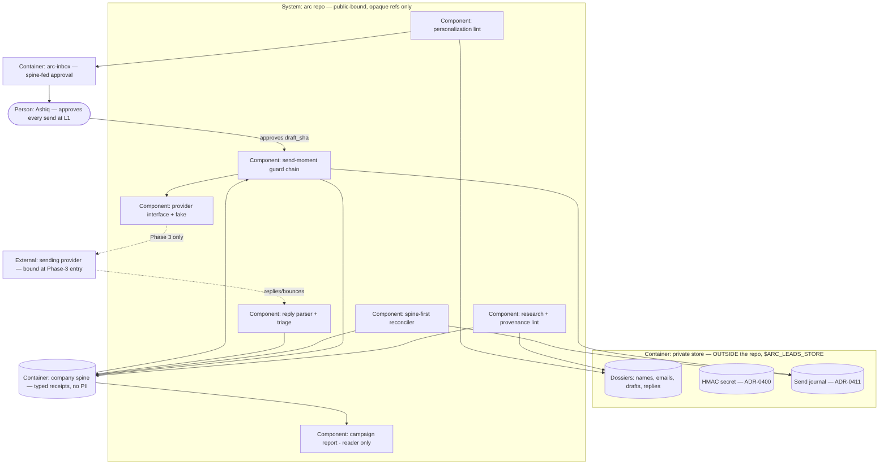

# PLAN.md — leads v1: the outbound engine

> Born by `/arc-kickoff --lane leads` on 2026-08-04. Claims **ADR band 0400–0499**.
> Design source: `docs/strategy/plans/PLAN-leads.md` (v1.0, frozen 2026-08-03) — the
> decision record, not this cycle. Company organs (`docs/adr/`, `docs/retro-log.md`,
> `docs/trial-ledger.md`, `tests/`) stay at root and are never copied here (ADR-0053);
> evidence is lane-scoped at `initiatives/leads/evidence/phase-NN/` (ADR-0055).
> Model policy inherited from `docs/adr/0069-balanced-model-policy.md`.

## Goal

`arc-leads research ICP.json` turns an ICP definition into a small, deeply-researched, evidence-backed
lead list (25, not 2,500), drafts first-touches that are structurally incapable of being
template-blast, and runs a capped, human-approved sequence from a warmed dedicated domain —
every send, reply, meeting and suppression a typed receipt on the spine, every cap enforced
in code and proven unbypassable by fixture, L1 until the trial ledger earns anything more.

## Current state

**Stack:** zero-dep Node (ESM) + POSIX sh; bats for shell tests; spine at
`.claude/state/hq/events/DATE.jsonl` (flat).

**Entry points:** `.claude/scripts/hq/arc-event.sh` (standard emitter) ·
`.claude/scripts/hq/lib/validate.mjs` (`KINDS`, closed-payload validators) ·
`.claude/scripts/hq/lib/spine-io.mjs` (reader/replay) · `arc-inbox.mjs` (approve/reject by
ULID, mandatory reason, decisions final) · `.claude/scripts/core/lane-resolve.sh`.

**Conventions:** ADR-0026 vocabulary is CLOSED — **verified 31 kinds at this kickoff**, up
from the design source's stale 22 (ADR-0309 +8, ADR-0310 +1 landed in Cycle 7). Zero
`lead.*` / `outreach.*` / `meeting.*` / `deal.*` / `metric.observed` kinds exist, so
ADR-0400 is a genuine extension. Total-preimage idems; `supersedes` for corrections;
reader-only derivation. Mode A only — one session, one working tree (ADR-0056).

**Do-not-touch:** `docs/evidence/**` and `docs/archive/**` are frozen (ADR-0058).
`.claude/commands/{arc-commit,arc-review,arc-kickoff}.md` are GENERATED from
`processes/*.process.yaml` (ADR-0201/0202). LexOS's Resend transactional setup is a
different repo and is untouched by ADR-0402.

**Sync-gated (CI-only, invisible on this box):** files under `.claude/**` are byte-identity
checked against `tests/fixtures/sync-golden/tree-manifest.txt`, and a new product's files
stay invisible to the installer until it has its own manifest section (as `evolve` got in
Cycle 7). Every phase that adds a script under `.claude/scripts/leads/` or edits
`.claude/scripts/hq/lib/validate.mjs` or `arc-inbox.mjs` regenerates the golden **and**
adds/updates the `leads` manifest section **in the same commit**. No test runs on this box,
so a miss is only visible as a red CI leg and costs a whole push cycle.

**Shared organs this lane must edit** (`.claude/rules/lanes.md`): `validate.mjs` (the closed
vocabulary) and `arc-inbox.mjs` (approval rendering). Run
`git log origin/main --oneline -5 -- PATH` before touching either.

**No leads code exists** — no `/arc-leads` command, no pipeline kinds, no suppression state,
no sending-domain DNS. All four re-verified at this kickoff.

## Success requirements

| REQ | User outcome | Measurable acceptance | Phase | Status |
|---|---|---|---|---|
| REQ-00 | Sends cannot burn the company's name | Deliverability preflight is **code, not a checklist**: resolves SPF/DKIM/DMARC by **live DNS lookup** + queries provider auth status through the interface (fake in fixtures) · **warm-up ≥14d is read from the provider's own send history via `authStatus()` where the provider exposes it; where it does not, the gate prints `warm-up: ATTESTED — not verified` and Phase-3 entry requires an `arc-inbox` approval of that exact string with its mandatory reason. A local warm-up log is evidence for a human and is never an input to PASS** · sending domain confirmed ≠ product/root domain and not a subdomain of it (ADR-0402) · `List-Unsubscribe` present on every send template. Fixtures: DNS record absent → refused · **evidence file present but live check fails → refused** · **warm-up log claims 21d while provider history shows 3d → refused** · **no provider history and no inbox approval → refused; the gate never prints PASS for an attested clause** | 0 | active |
| REQ-01 | An ICP in gives 25 researched leads with receipts for WHY | `arc-leads research ICP.json` → 25 dossiers in the ADR-0410 store, each with why-they-fit + ≥2 source links + provenance class from the ADR-0409 closed allowlist + geography + verified email (unverifiable → HELD) + ≥1 lead-specific fact with evidence URL and a fact→offer relevance line. Rejected candidates keep exclusion reason + source. **ADR-0404's BELOW-BAR class extends upstream to the dossier: a fact true of the whole ICP (the company exists, has a website, is in the industry, recently posted) is BELOW-BAR evidence — WARNed on the dossier and not citable to satisfy REQ-02's FAIL check.** Fixtures: purchased or login-wall provenance → rejected · missing geography → rejected · out-of-allowlist → rejected · rejected candidate with no exclusion reason → invalid · **25 dossiers whose only lead-specific fact is ICP-generic → all BELOW-BAR, zero PASS drafts derivable from them** | 0 | active |
| REQ-02 | Template-blast is structurally impossible | ADR-0404 lint, 3 classes. FAIL (blocks inbox from birth): no lead-specific reference · cited fact absent from dossier · no fact→offer relevance line. BELOW-BAR (WARN on the inbox item): `<2` dossier-cited facts · slop markers · cross-draft body similarity ≥70%. Fixtures: zero-specific draft → FAIL · invented fact → FAIL · 2 drafts ≥70% identical → BELOW-BAR · N real facts + relevance → PASS | 1 | active |
| REQ-03 | Caps and suppression cannot be exceeded — even when asked | ADR-0403 in code: ≤20 submitted sends per IST day · ≤2 touches/lead per rolling 7d · auto-stop on reply · IST business-hours window · event-backed global suppression checked before every send. All state derives from receipts via the reader — **no mutable counter file exists**. Fixtures: 21st send refused · 3rd touch refused · suppressed lead refused · post-reply send refused · **config raised past hard ceiling refused** · CLI/env bypass refused · hand-edited counter irrelevant (counts rebuild) · midnight-IST boundary correct · approved-then-replied → permanently blocked at send moment | 1 | active |
| REQ-04 | Replies never rot | ADR-0405 ingestion (`--file`/stdin — never argv) → parsed → `outreach.replied` with triage class → auto-stop takes effect before the next batch. "Interested" → calendar-link draft **created in the same run as the ingestion that classified it** — which satisfies the design source's 16:00-IST SLA in both webhook and manual mode **by construction**, with no cutoff clock, no business-day arithmetic and no public-holiday calendar (none of which this cycle can validate, Phase 3 being BLOCKED). Fixtures: interested reply → draft in the store + inbox item before the run exits · same reply ingested twice → exactly one draft (idem) · unsubscribe-in-reply → suppression same run | 2 | active |
| REQ-05 | One real campaign, honestly measured | ≥25 sends over ≥3 days to real ICP leads, every send individually L1-approved. Acceptance: zero cap/suppression violations · zero spam complaints · no FREEZE breaker fired · every HOLD reviewed and resolved before further sends. Bounce rate is **recorded, never a standalone small-n threshold**. Reply rate = unique replying leads / **submitted** first touches | 3 | active |
| REQ-06 | RevOps truth lives on the spine and replays identically | Every send/reply/meeting/suppression = typed receipt via the standard emitter: closed payloads, total-preimage idem, `supersedes` corrections, `lead_id` = ADR-0400 keyed HMAC. Fixtures: raw email in payload → rejected · bare unkeyed h-HEX16 id → rejected · duplicate send idem impossible · **wipe derived state → replay → byte-identical reader-derived state dump** (`arc-leads state --json`: dossier index + per-lead touch/suppression counts). The *campaign report*'s replay identity is REQ-05/Phase-3 acceptance — no report generator is built in Phase 0 | 0 | active |
| REQ-07 | The fake→real gap is closed before lead send #1 | Phase-3 entry gate in code: **dated** seed-inbox smoke ≤7 days old — send to ≥2 owned seed mailboxes (Gmail + Outlook-class), verify inbox placement (not spam), auth headers pass, unsubscribe works end-to-end, reply + bounce ingestion fire on the seeds. Fixtures: stale/undated seed evidence (>7d) → refused · Phase-3 entry without seed smoke → refused | 3 | active |

<!-- Deviation from the design source, forced by kickoff-lint [reqs] (every REQ maps to
     exactly ONE phase): its REQ-00 mapped to "0 + 3-entry" and its REQ-06 to "0–3".
     REQ-00 keeps the Phase-0 preflight; the Phase-3 entry smoke test is split out as
     REQ-07. REQ-06 keeps the Phase-0 receipt grammar + replay property; the campaign
     report it feeds is acceptance under REQ-05. No requirement was dropped. -->

## Appetite

**7 days (one week) hard cap.** Effort ≈ 5.5d inside the window; 1.5d deliberately unallocated
as the overrun absorber — the arc-portfolio lesson (Cycle 4 allocated 100%, `appetite-sum`
warned every run, Phase 02 overran with nothing to absorb it, cycle closed ~112%).

**Tier:** M

**Elapsed-calendar honesty:** the 7-day cap bounds **effort-burn, not wall-clock**. Even with
a warmed domain, kickoff → retro is realistically 7–10 elapsed days, and the pre-kickoff
infra (DNS, warm-up) adds 2–4 calendar weeks *before* that. Nobody should read this cycle as
"outbound in a week from a standing start."

**Designated cuts, in order:** (1) automated inbound webhook → the manual `ingest-reply`
command; (2) triage auto-classification → manual class picks in the inbox. **The real
campaign is never the cut** — it is the point of the cycle.

**Kill criteria:** at **50% burnt (3.5d), if REQ-03's cap/suppression fixtures are not
green → stop.** Nothing sends, ever, without the guard. Bank the ADR-0400 vocabulary and the
ADR-0404 lint as documentation and retro. If cap enforcement cannot be made
fixture-deterministic after 1 day of fixes → stop and redesign; never ship a cap that can be
argued with. At 100% → cut or kill, never silently extend.

**Cascade rule (fired at this kickoff — see ADR-0413):** offer undefined, warm-up <14d, or
DMARC not green → the trigger was mis-read. **All four conditions hold today**, so Phase 3 is
BLOCKED and Phases 0–2 proceed offline-first under ADR-0413.

## Architecture (C4 concepts, Mermaid flowchart)

## Key decisions (ADR index)

| # | Decision | Status |
|---|---|---|
| 0400 | Pipeline receipt kinds are a first-class vocabulary extension, keyed HMAC lead ids | accepted |
| 0401 | Pipeline truth lives on the company spine, not a venture's | accepted |
| 0402 | Cold outbound sends from a dedicated domain, behind a provider interface | accepted |
| 0403 | Caps and suppression derive from receipts, and re-check at the send moment | accepted |
| 0404 | The personalization gate splits deterministic FAIL from heuristic BELOW-BAR | accepted |
| 0405 | Reply ingestion is interface + fake, with a manual `--file` fallback | accepted |
| 0406 | Jurisdiction is an allowlist, enforced by lint at research time | accepted |
| 0407 | Send autonomy is earned by ledger evidence and granted by a human | accepted |
| 0408 | leads is evolve's first client: ships EVO-H0's vocabulary, not evolve's clock | accepted |
| 0409 | Research provenance is a closed allowlist; unverified emails are HELD | accepted |
| 0410 | Lead PII lives outside the repository directory entirely | accepted |
| 0411 | The crash-safe send journal reconciles SPINE-FIRST | accepted |
| 0412 | The approver sees the draft; the spine never does | accepted |
| 0413 | leads Phases 0–2 are built ahead of the pre-kickoff gate; Phase 3 stays BLOCKED | accepted |

## Non-negotiables

- Every send human-approved (L1) until an ADR-0407 promotion is granted — proposed by evidence, decided by the human, never assumed.
- Caps and suppression are code with fixtures, not policy text. Adversarial breaking pass on cap enforcement, suppression, the personalization lint and the reply parser before any WARN→FAIL promotion.
- No purchased lists, no scraped emails from login-walled sources, no fake personalization — all three structurally enforced by lint and fixtures, never merely requested.
- Domain reputation is a company asset: dedicated cold domain, warm-up respected, unsubscribe honored instantly, List-Unsubscribe everywhere, breakers on bounce and complaint.
- No LinkedIn automation (ToS) — LinkedIn first-touch drafts are for manual sending only.
- No raw PII on the spine, in receipts, in argv, or anywhere under the repo directory: keyed HMAC lead ids (ADR-0400); names, emails, drafts and journal only in the ADR-0410 private store outside the repo, tripwire-lint-watched.
- Spine discipline: standard emitter, reader-only consumption, closed payloads, total-preimage idems, `supersedes` corrections, real and simulated never mixed.
- Zero-dep Node plus POSIX; the provider sits behind an interface with a fake, so Phases 0–2 build with zero real emails.

## No-gos (explicitly out of scope)

No volume mode (25-not-2,500; the daily ceiling is a hard cap in code) · no cold mail from
product/root domains **or their subdomains** · no sends outside the jurisdiction allowlist ·
no auto-send at L1 · no auto-replies (reply handling produces DRAFTS) · **no background
scheduler, daemon or cron** — sequence advancement is a human-started command · **no
open/click tracking in v1** — no pixels, no wrapped links, no tracking params · no raw email
bodies or PII on the spine or in the repo · no CRM build-out · no A/B or self-optimizing
logic (evolve owns experiments later) · no bought intent data · no mass enrichment tooling ·
no multi-channel (email only) · no attachments in cold mail · no deliverability tooling
build-out · no HTML template engineering (plain-text first) · no follow-up of any kind after
a reply, bounce or unsubscribe.

## Rabbit holes

Perfect ICP taxonomy → **one ICP, v1** · email-finder tool cascades → **one vetted source +
manual fill for 25 leads** · reply-classification ML → **rules + human triage** · send-time
optimization science → **fixed IST business window** · CRM feature creep (stages, notes UIs)
→ **the spine + dossiers are the CRM v1** · deliverability scoring engines → **provider
reports suffice** · HTML email design → **plain text** · sequence-length experimentation →
**2 touches is the cap; test later under evolve**.

## Assumptions ledger

| Assumption | How we'd know it's wrong (trigger) | Phase that tests it |
|---|---|---|
| Some sending provider satisfies ADR-0402's hard filter (idempotency-key **or** message-id lookup) plus a suppression API | The `/arc-capability` report returns zero candidates meeting the hard filter — ADR-0403's duplicate-send guard and ADR-0411's reconcile both lose their foundation and the design needs reopening | 3 (entry) |
| The fake provider's semantics match the eventual real provider closely enough that Phases 0–2 fixtures stay valid (ADR-0413, Confidence: low) | The first real send's ack shape, idempotency behaviour, or bounce/complaint webhook payload contradicts a fixture | 3 |
| 25 leads meeting ADR-0409's closed provenance allowlist are findable for a single ICP without purchased data | Research yields <25 qualifying leads after a full pass, or >40% of candidates are rejected for provenance | 0 |
| ADR-0403's send guard and REQ-05's report derive the same number from the same reader path — a send one counts is a send the other counts | A fixture seeds N `outreach.sent` receipts and the guard's remaining-quota disagrees with the report's submitted count — or either number is produced by a second code path (the ADR-0411 journal, a cache, a file) rather than the reader | 1 |
| Cross-draft similarity at a 70% shingle threshold separates legitimate offer-sentence repetition from template-blast | Real drafts cluster on either side of 70% with no separation — false positives on honest drafts, or clones passing | 1 |
| ~15 min/day of inbox ritual is sustainable for the campaign's duration | Approvals stall >24h during the campaign; the campaign auto-PAUSES (it never auto-sends) | 3 |
| The India-only allowlist covers the ICP well enough that v1 needs no second jurisdiction | The ICP's qualifying leads are majority out-of-allowlist — expansion is then its own ADR, not an allowlist edit | 0 |

## External dependencies

| Dep | Interface | Fake impl | Real impl | Contract test |
|---|---|---|---|---|
| Sending provider (submit, suppression, auth status) | `lib/provider.mjs` — `submit()`, `lookupByMessageId()`, `suppressionList()`, `authStatus()` | `lib/provider-fake.mjs` — deterministic acks, injectable crash points, idempotency-key store | bound at Phase-3 entry per ADR-0402 | `tests/leads-provider-contract.bats` — same suite against fake (Phase 0) and real (Phase 3). **The fake swaps the RESPONSE, never the code path**: one test points the real `lib/provider.mjs` at an unreachable endpoint and asserts it reached its own code and exited with its own failure code. With Phase 3 BLOCKED this suite runs only against a vendor that does not exist — green here is fixture evidence, never a contract (ADR-0413) |
| Inbound reply source | `lib/inbound.mjs` — `poll()` / `ingestFile()` | `lib/inbound-fake.mjs` — fixture mail corpus incl. malformed | webhook if supported, else `--file` (designated cut #1) | `tests/leads-reply-contract.bats` |
| DNS resolver (SPF/DKIM/DMARC) | `lib/dns.mjs` — `resolveTxt()` | `lib/dns-fake.mjs` — record-present / record-absent / stale-evidence cases | Node `dns/promises` | `tests/leads-preflight.bats` |
| Email verifier | `lib/verify-email.mjs` — `verify()` | `lib/verify-email-fake.mjs` — verified / unverifiable / invalid | vetted verifier or MX+syntax, from the capability report | `tests/leads-research-lint.bats` |
| **Lead source** (candidate discovery) | `lib/source.mjs` — `search(icp)` | `lib/source-fake.mjs` — 34-candidate corpus, reserved domains only: 25 clean + 9 each failing exactly one lint rule | manual research against ADR-0409's allowlisted classes | `tests/leads-research-lint.bats` |

## Pre-mortem (Klein)

| # | Failure cause | Mitigation or accepted |
|---|---|---|
| 1 | Every `lead.*` / `outreach.*` receipt is silently quarantined (UNKNOWN_KIND, or a colliding idem read as "dedup working as designed") while the emitter exits 0 — ADR-0403's receipt-derived caps then count **zero** submitted sends and never trip, and REQ-05's report is confidently empty | **Third occurrence of this class** (22 DUP_IDEM rejections = ~100 lost receipts; `develop.started` rejected UNKNOWN_KIND with exit 0). Phase 00 exit: after wiring the emitter, LOOK in `events/` **and** `events/_quarantine/` and assert which holds it — exit 0 from the emitter is not evidence anything was written. The ADR-0403 reader **fails closed**: no `outreach.sent` receipt for a resolved ADR-0411 intent is an error, never a count of 0 |
| 2 | Generic outreach → 0 replies plus reputation cost | ADR-0404's BELOW-BAR class with dossier-citation (ADR-0049: an absence-only pass cannot detect mediocrity) + the 25-not-2,500 philosophy |
| 3 | Replies rot unanswered | REQ-04 measurable triage SLA (16:00 IST cutoff, clock from ingestion) + inbox surfacing + auto-stop enforced at pre-send check |
| 4 | Phases 0–2 close green and six months later nothing has been sent: Phase 03 row 2 (domain warm-up, 2–4 calendar weeks) was never started because "start it the moment outbound is plausibly ≤6 weeks out" is advisory and unowned, the lane banks fixture evidence, and ADR-0408's clock never starts | **A document is not a trigger until something asserts it** (a cycle read LIVE in the company log five days after closing; a two-week money clock ran unnoticed). Phase 03 rows 1–4 each carry an owner and a **date started** in `PROGRESS.md ## Now`, restated at every `/arc-phase-done`; the cycle cannot be recorded CLOSED in `docs/HISTORY.md` while any of rows 1–4 is undated or unmarked "not this quarter" |
| 5 | Bad emails bounce and burn the domain | ADR-0409 verification (HELD when unverifiable) + ADR-0403 sample-size-honest breakers: first bounce HOLD, 2 bounces / ≥3%@≥50 / any complaint FROZEN |
| 6 | Re-contacting an unsubscribed person | REQ-03 event-backed suppression ledger, HMAC-matched so it survives dossier deletion, checked pre-send, surviving across campaigns |
| 7 | PII lands on the spine — or in a repo that later goes public | ADR-0400 keyed HMAC ids + payload grammar fixtures + ADR-0410 store fully outside the repo (`git clean -xfd` deletes ignored files) + tripwire lint |
| 8 | The Phase-01 fixture manifest is transcribed into `@test` names verbatim, **bats silently drops any test whose name holds a non-ASCII char** (`·` `→` `≥` `—` are throughout these specs), the tests never register and never fail — and with CI as the only gate the sole signal is a falling test count nobody counts | **Fourth occurrence of the vacuous-pass class** (five em-dash tests never ran; three probes passed while executing nothing). Every `tests/leads-*.bats` file has ASCII-only test names and **asserts its own declared `@test` COUNT**; any probe that shells out asserts it RAN before asserting what it printed; "output does not contain X" never stands alone |
| 9 | Crash or retry races double-send or slip the cap | ADR-0411 two-phase journal + spine-first reconcile + effective counts include unresolved intents + idempotency keys end-to-end |

## Phases (risk-ordered)

| Phase | Capability | Appetite | Status |
|---|---|---|---|
| 00 | Foundations — ADR-0410 store + HMAC secret + tripwire lint FIRST, then ADR-0400 vocabulary + validators, ADR-0408 `metric.observed`, ADR-0411 journal schema, ICP format, researcher + dossiers + provenance lint, deliverability preflight, provider interface + fake | 1.5d | pending |
| 01 | Sequencer — caps, suppression ledger, send-window, HOLD/FREEZE breakers, receipt-derived state, ADR-0411 journal + spine-first reconcile, ADR-0404 personalization lint + similarity guard, ADR-0412 review boundary, send-moment guard, human-started daily command | 2.0d | pending |
| 02 | Replies — ingestion (`--file`, store-side only), parser, triage classes → receipts, SLA calendar-draft path, auto-stop wired to pre-send check | 1.0d | pending |
| 03 | Real campaign — provider bound, seed-inbox smoke, ≥25 sends over ≥3 days, daily triage, metrics, retro | 1.0d | **BLOCKED** (ADR-0413) |

**Appetite burn: 5.5 of 7 days allocated (79%).** The unallocated 1.5d is the deliberate
overrun absorber. Phase 03's 1.0d is allocated but **not startable** — its four gate rows are
business and calendar physics, not engineering (ADR-0413).
