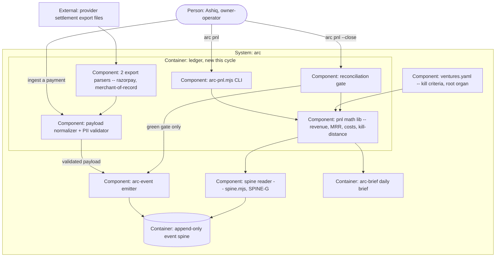

# PLAN.md — ledger · the money brain

> Written by `/arc-kickoff` on 2026-08-12 from the owner-approved design source
> `docs/strategy/plans/PLAN-ledger.md` (v1.0, 2026-08-09). Trigger: FIRED under the owner's
> Build-out Mandate, spine receipt `01KZTM348858PDH44K4HA64CVA` — the same `decision.recorded`
> cited by the executor Phase-0 ADRs (0208-0219). Constitution A8's letter is kept: this lane is
> built on a recorded owner decision, not on ambition.

## Goal

For Ashiq, arc gains its money brain: per-venture P&L truth derived only from spine receipts —
revenue (real money only) split gross/fees/tax/net, MRR with full churn transitions, AI and fixed
costs with source-honest labels, and kill-distance meters against machine-readable kill criteria —
rendered as `arc pnl` and inside the daily brief, byte-reproducible from replay, with a month-close
ritual that freezes each month behind a reconciliation gate so a number, once closed, can never
silently change, and not one byte of any customer's personal data ever lands on the spine.

## Current state

**Stack:** zero-dependency Node >=18 (ESM `.mjs`), bash-3.2/POSIX wrappers, bats tests in central
`tests/` (ADR-0021), 3-OS CI (red = no merge). No new external dependency is added by this lane.

**Entry points:** CLI modules live in `.claude/scripts/hq/` as an `.mjs` plus a `.sh` wrapper
(`arc-event`, `arc-brief`, `arc-inbox`, `arc-replay`). Args parse through a `VALUE_FLAGS` set and a
`walkArgs()` loop; hook mode exits 0 always, strict mode returns the real code (2 on error); each
module declares `PROCESS_ID` as `name@version`. Ledger adds `arc-pnl.mjs` plus a lib beside it.

**Conventions:** the spine reader is `.claude/scripts/hq/spine.mjs` — `read()`, `cursor()`,
`days()`, `spineRoot()`, `chooseEngine()`; low-level I/O is `lib/spine-io.mjs`. Two reader engines
(`scan` over JSONL day files, `sqlite` over `derived/state.db`) selected by `ARC_SPINE_ENGINE` or
`--engine`; `auto` prefers sqlite and falls back silently, an explicit request fails closed. The
event vocabulary is a closed `KINDS` array in `lib/validate.mjs` — **44 kinds today, and
`month.closed` is absent** (both measured on this tree 2026-08-12). Tests set `ARC_SPINE_ROOT` per
test with a frozen clock via `ARC_SPINE_NOW`; fixtures live under `tests/fixtures/` with an `INDEX`;
a fixture builder asserts its fixture is non-empty.

**Emission, concretely.** The emitter's contract is
`arc-event emit KIND [flags] | emit --event-file F | ingest KIND --json F | close-day`. Ledger
adds no ingest CLI of its own: **the PII validator is wired into the emitter's own validation path**,
following the per-family pattern already in the tree (`validate-experiment.mjs`,
`validate-leads.mjs`, `validate-policy.mjs`, `validate-absorb.mjs` are each imported by
`.claude/scripts/hq/lib/validate.mjs` and export an `X_KINDS` list with an `assertX`). Ledger's is
`validate-ledger.mjs`, exporting `LEDGER_KINDS` and `assertLedger`. This placement is the decision:
a validator the operator invokes separately is a validator the operator can skip, and ADR-1002 is
the one control with no later repair. `arc-pnl` never ingests.

Ledger ingests a validated Appendix A payload with `arc-event ingest revenue.received --json FILE` — the
`ingest` verb implies strict mode (a real exit code, 2 on error) and derives a stable idem, which is
what makes content-idem dedupe work. `revenue.simulated` is the same call with the simulated kind,
and the two kinds are the structural separation REQ-01 depends on: a real view reads one kind, a
simulated view the other, and no filter decides it. The emitter builds the envelope itself (`id`,
`idem`, `ts`, `sha`, `actor`, `process`, `venture`, `v`); a caller supplies the kind and the payload
and never hand-writes an envelope field.

**Do-not-touch:** `tests/fixtures/sync-golden/tree-manifest.txt` — the byte-identity gate. There is
no standalone regeneration script: the golden is produced by `_arc_tree_manifest`
(`tests/test_helper.bash:479`) over a fresh `bash sync-to-project.sh SCRATCH` install, exactly as
`tests/sync.bats` does it. **First establish whether ledger's files are even in the sync set** —
`sync-to-project.sh` copies per product via `.claude/scripts/core/arc-products.mjs`, not wholesale,
so a new `hq` file joins the bare install only if ledger is a registered product. If it does not
join, the manifest must NOT move, and a manifest that moves anyway is the finding. If it does,
regenerate and diff the delta FIRST, confirming only intended paths moved before re-recording
(retro 2026-07-22: the golden broke across 10 commits, twice surfacing as a surprise mid-task
failure) · generated commands `.claude/commands/arc-{commit,review,kickoff}.md`
(recompiled from `processes/*.process.yaml`) · `.claude/scripts/review/spine-reader-lint.sh` is the
grep-lint that forbids reading `events/*.jsonl`, `state.db` or `node:sqlite` outside `spine.mjs`,
`arc-replay.mjs` and `lib/` — ledger reads through the reader only, and is subject to it.

**Shared-organ check, before the edit and not at the merge:** ledger writes to three files that
belong to no lane — root `ventures.yaml` (Phase 1), `KINDS` in `.claude/scripts/hq/lib/validate.mjs`
and the `GROUPS` table in `.claude/scripts/hq/arc-brief.mjs` (both Phase 2). Before touching any of
them run `git log origin/main --oneline -5` on that path per `.claude/rules/lanes.md`; bench, engine
and leads are all live. Retro 2026-08-03 (arc-develop) recorded two live lanes independently fixing
the same shared CI constant four hours apart, and the rule is to take the **stronger** version at the
merge, not the earlier one.

**`arc-brief.mjs` is a hard dependency of ADR-1004, not an integration nicety:** `tests/policy-brief.bats`
derives its coverage list from `KINDS` and asserts every kind is grouped, so the moment `month.closed`
joins `KINDS` without a `GROUPS` entry, that suite fails shut. Both edits land in one commit.

Money side of the live spine, re-verified 2026-08-12 in the main clone (17 event-day files):
**0 `revenue.received`, 0 `revenue.simulated`, 0 `cost.incurred`, 0 `run.completed`.** Real views
start from real zero. No `ventures.yaml` and no pnl code exist anywhere.

## Success requirements

| REQ | User outcome | Measurable acceptance | Phase | Status |
|---|---|---|---|---|
| REQ-01 | P&L is true and reproducible | `arc pnl [--venture V] [--month YYYY-MM]` renders real revenue only: a fixture spine holding both real and simulated events yields output byte-identical to the same spine with the simulated events removed. Rows carry gross/fees/tax/net; an absent component renders absent, never 0. `venture: arc` costs land in a separate Overhead section, never attributed to a venture. Engine equivalence: the `scan` and `sqlite` legs are byte-identical and each asserts which engine actually ran (ADR-1014). `rm -rf derived && arc-replay && arc pnl` is byte-identical to golden on 3 OSes. `spine-reader-lint.sh` reports 0 violations | 0 | active |
| REQ-02 | MRR math survives its edge cases | A subscription's identity is the tuple `venture` + `customer_ref` (`plan` is NOT part of it — a plan change is precisely what expansion and contraction mean), and a returning subscription counts as **reactivation** rather than new when a prior charge for that identity exists at any point in the spine's history, with no lookback cutoff. Pinned fixtures cover all 5 transitions (new, expansion, contraction, churn, reactivation); refunds and partial refunds enter as superseding negative events, never edits; an over-refund (refund exceeding the original) raises a needs-you flag and is never netted away; the over-refund and under-refund comparison is made in the ORIGINAL charge currency before any FX conversion, so a refund settling at a different day's rate than the original charge never fires or suppresses the flag on rate movement alone; annual and quarterly plans are normalized (divide by 12 and by 3) beside a labelled cash-in line, never added to it. MRR base is the recurring amount ex-tax, and gateway fees appear on the fee line without reducing MRR | 0 | active |
| REQ-03 | Kill-distance is visible and tamper-evident | Kill criteria per venture live in root `ventures.yaml`; `arc pnl` prints distance-to-line per criterion; a criterion at 80% or closer renders a warning line; a crossing raises a needs-you item in the brief, computed at render by the ledger lib with 0 events emitted. A `ventures.yaml` edit with no accompanying `decision.recorded` receipt produces an `UNRECEIPTED CRITERIA CHANGE` refusal, pinned as a fixture | 1 | active |
| REQ-04 | Currency honesty | INR plus USD. Every conversion carries rate, source and rate-date recorded inside the event at ingest; render and replay perform 0 external lookups — fixture: a replay with no network reachable is byte-identical. Foreign rows show the original currency beside INR. Every monetary field is an integer count of minor units and a non-integer monetary value is rejected in strict mode (ADR-1012) | 0 | active |
| REQ-05 | A month closes only behind a green reconciliation | `arc pnl --close YYYY-MM` on IST boundaries requires per-rail input via `--reconcile-file` or `--reconcile-total`. Spine and provider disagreeing in either direction blocks the close: a shortfall lists missing-payment candidates, an excess lists duplicate suspects by `provider_payment_id`; a rail with no input blocks exactly as a mismatched one does. A green gate emits exactly 1 `month.closed` event carrying the summary and the input shas, confirmed present in `events/` and absent from `events/_quarantine/`. Fixture: a post-close refund leaves the closed month's bytes unchanged and appears in the current month. A second fixture pins an event whose `ts` carries a non-IST UTC offset landing within 1 second of the IST month boundary, proving the month bucket is computed on the IST-converted instant rather than on the offset as recorded — every provider export in this lane is UTC-timestamped | 2 | active |
| REQ-06 | Costs are honest three ways | Measured run costs are consumed per MP-F with absent staying absent; declared fixed and subscription costs are monthly `cost.incurred` events with no cost config file anywhere; apportionment views are labelled `allocated` and never summed with measured — fixture: a mixed-source month renders 2 labelled lines rather than 1 total. A daily spend line appears in the brief when spend data is present | 2 | active |
| REQ-07 | Every number explains itself | `arc pnl --explain` on a rendered line id lists the contributing event ULIDs with their amounts, and the drill-down total equals the rendered line to the minor unit, matched against a golden | 2 | active |
| REQ-08 | Demo without lies | `arc pnl --simulated` renders the same views over `revenue.simulated` events only, watermarked SIMULATED on every line; real and simulated never co-render — fixture: a spine holding both yields 0 simulated rows in the real view and 0 real rows in the simulated view | 3 | active |

REQ-07 and REQ-08 are the pre-agreed first and second scope cuts (see Appetite).

## Appetite

**8 days part-time, hard cap** (the owner's 1.5 weeks; the design source's own kill-criteria line
prices 50% at roughly 4 days, which is the same 8). This is a constraint, not an estimate.

**Tier:** M

**Kill criteria:** at 50% burnt (4 days) without REQ-01 and REQ-02 green on fixtures, cut to the
pnl-math lib only and bank it — kill-distance and month-close take a later slot. First cut REQ-07,
second REQ-08, third REQ-03's 80%-warning line (crossing detection stays regardless). Any phase at
2x its estimate stops, banks and runs `/arc-retro`. At 100% we cut or kill, never extend.

**Phase 0's own 3-day cap is the FIRST gate, not this 4-day line.** The 50% tripwire sits a day past
Phase 0's appetite, so a steel thread carrying the PII validator, two parsers and the adversarial
pass could run 33% over its own limit before any plan-level mechanism fired. The per-phase rule
fires at day 3 on Phase-0 scope alone; the 50% line is the backstop behind it.

There is deliberately **no schedule slack**: the four phases sum to exactly the 8-day cap. The slack
is scope, and it is pre-authorized above — that ordered cut list is the plan's shock absorber, and
it is spent before the cap is, not after.

## Architecture (C4 concepts, Mermaid flowchart)



Ledger reads the spine through one reader and writes exactly one kind, `month.closed`, and only
behind the reconciliation gate. Every other arrow into the spine is the existing emitter doing what
it already does.

## Key decisions (ADR index)

| # | Decision | Status |
|---|---|---|
| 1000 | LED-A — ledger is a reader-only derivation layer that emits exactly one kind | accepted |
| 1001 | LED-B — money data lives only on the spine; the only config file is `ventures.yaml` | accepted |
| 1002 | LED-C — revenue payloads are PII-free by construction, and the validator ships first | accepted |
| 1003 | LED-D — FX conversion facts are recorded at ingest, never looked up at render | accepted |
| 1004 | LED-E — spine vocabulary 44 to 45: `month.closed`, IST boundaries, never restated | accepted |
| 1005 | LED-F — reconciliation is a blocking close gate, both directions, per rail | accepted |
| 1006 | LED-G — costs carry a source label, and the three sources never sum into one number | accepted |
| 1007 | LED-H — MRR definitions are pinned in fixtures, cash-in reported beside them | accepted |
| 1008 | LED-I — `ventures.yaml` is a root company organ whose edits need a receipt | accepted |
| 1009 | LED-J — ledger ships as `arc pnl` under hq, with no slash command in v1 | accepted |
| 1010 | LED-K — natural-key duplicate detection lives in the derived layer | accepted |
| 1011 | LED-L — ledger adds no policy subject, and must not self-authorize money | accepted |
| 1012 | LED-M — money is an integer count of minor units; rates are decimal strings | accepted |
| 1013 | LED-N — the one foreign currency in v1 is USD | accepted |
| 1014 | LED-O — `arc pnl` keeps no cache, and its determinism proof asserts which engine ran | accepted |
| 1015 | LED-P — reconciliation takes both input paths over one summable parser result | accepted |

ADRs 1000-1015 occupy the `ledger` lane's claimed century, **1000-1099** (PORTFOLIO.md band table),
and the control is the detector rather than the convention: `kickoff-lint`'s `[adr-dup]` check FAILs
when two files claim one number, and it is confirmed running before Phase 0 closes. Retro 2026-08-02
(arc-develop) recorded two sessions both writing ADR-0063 through 0068 in parallel because
"highest + 1" collided and nothing in the repo could detect it — a band alone is a convention, and
scheduler's band is claimed today from a branch that is not even on `origin`.

1012-1015 resolve the four forks the design source left open; 1011 records a correction to the
kickoff checklist and is the one decision an owner may want to reverse on sight.

## Non-negotiables

- Derived-only: delete derived state, replay, and the P&L is identical — twin-determinism runs in CI from Phase 0 and never leaves (ADR-1000, ADR-1014).
- Real money only in real views; simulated revenue is structurally excluded, never filtered out at the end (REQ-01).
- PII never lands on the spine, and the validator that enforces it ships before any ingest path exists (ADR-1002).
- Money is integer minor units end to end; a non-integer monetary value is rejected, never rounded (ADR-1012).
- Ledger records money and never moves it: no ledger code initiates a payment, refund, transfer or price change (Constitution E2, ADR-1011).
- Parser-class surfaces — payload normalizer, `ventures.yaml` parser, FX handling, export parsers — get a mandatory adversarial construct-a-breaking-input pass by two fresh agents on different surfaces, holes fixed and pinned as red fixtures, before any FAIL promotion.
- A test asserts it RAN before asserting what it printed; a gate that can only report absence is not a gate (ADR-1014).
- Absent stays absent: nullable-cost honesty end to end, with `source` surfaced on every cost line (MP-F inherited, ADR-1006).
- Month-close is human-run, always; a future scheduler may invoke the same CLI but the gate logic never moves into a daemon.
- Any new or edited file that enters the sync set regenerates `tests/fixtures/sync-golden/tree-manifest.txt` in the same commit — the gate is byte-identity and invisible locally, and membership is decided by the product catalog, never assumed.
- Any edit to this list is swept into all four phase specs' verbatim copies in the same commit — the writer of a change is structurally blind to the sections citing it, and this list is cited four times by construction.
- Inherited whole: zero-dependency Node >=18, bash-3.2/POSIX with no GNU-only constructs, bats in central `tests/` (ADR-0021), 3-OS CI red means no merge, new lints WARN-first in TRIAL, an evidence bundle per phase-done, emit via the emitter and read via the reader only.

## No-gos (explicitly out of scope)

No accounting or tax books — GST and filings stay with the CA, this is management truth · no
invoicing or billing engine · no payment-provider API or webhook integration in v1 (export files and
manual JSON only) · no forecasting · no dashboards (text first; HTML consumes the same lib later) ·
**no auto-kill** — meters inform, and killing a venture stays a human `decision.recorded` · no PII on
the spine · no second money store · no new slash commands · no estimated or backfilled costs where
data is absent · no new event kinds beyond `month.closed` · no policy subject for ledger (ADR-1011) ·
**no syncing of spine data anywhere** — the spine under `.claude/state/hq/` is instance-only and
gitignored, each clone holds its own, and money receipts are the last thing that should travel.

## Rabbit holes

MRR taxonomy bikeshedding — ADR-1007 pins it, and the detour is to change the fixture or leave it
alone · a provider-adapter framework — exactly 2 concrete export parsers, and a third provider is its
own later slot · multi-currency beyond INR plus USD · real-time or webhook ingest · GST computation ·
cost-allocation fairness modelling, where `allocated` is labelled and crude is fine · Windows locale
chasing, handled by canonical serialization plus pinned CRLF and BOM fixtures as in Cycle 2 ·
building a generic decimal library, which the integer-minor-unit decision exists to avoid.

## Assumptions ledger

| Assumption | How we'd know it's wrong (trigger) | Phase that tests it |
|---|---|---|
| Provider settlement exports are obtainable as CSV or JSON | no export exists for a rail at Phase 0, so the manual per-payment JSON template becomes that rail's canonical entry path | 0 |
| LexOS pricing lands subscription-shaped | pricing ships one-time-only, so the MRR section renders empty and honest and the cash-in line carries the truth | 0 |
| Integer minor-unit arithmetic keeps the two reader engines byte-identical | the `scan` and `sqlite` legs of the equivalence test disagree on any fixture, or a golden moves when only accumulation order changed — the money type or its rounding rule is wrong, not the test (ADR-1012) | 0 |
| Fixture volumes are representative at thousands of events per month | `arc pnl` render exceeds 5s on the owner's box, opening the sqlite accelerator path behind ADR-1014's equivalence gate | 0 |
| `month.closed` is accepted by the live validator once added to KINDS | the first emission lands in `events/_quarantine/` with `UNKNOWN_KIND` rather than in `events/` — the kind was never actually added (ADR-1004) | 2 |
| `ventures.yaml`'s venture set stays identical to PORTFOLIO.md's Venture passports table | a venture gets a kill line in `ventures.yaml` with no passport row, or a passport row with no kill line, and nothing flags the mismatch | 1 |
| No real revenue arrives during the build | the first real rupee lands mid-build, so the ingest ritual starts that day and the Phase 3 proof upgrades from simulated to live | 3 |

## External dependencies

| Dep | Interface | Fake impl | Real impl | Contract test |
|---|---|---|---|---|
| Razorpay settlement export (INR rail) | `parseRazorpayExport(bytes)` returns a typed, summable list of normalized payments (ADR-1015) | redacted, PII-stripped sample pinned under `tests/fixtures/ledger/razorpay/` | a real export file fetched at Phase 0 and redacted before it is ever committed | bats: parser output matches golden row-for-row (Appendix C shape), and the sum of its `net` column equals the settlement total printed in the export file's own summary row — a Phase-0-available quantity, since the reconciliation gate itself is Phase 2 |
| Merchant-of-record settlement export (USD rail) | `parseMorExport(bytes)` returns the same typed, summable list | redacted, PII-stripped sample pinned under `tests/fixtures/ledger/mor/` | a real merchant-of-record export, redacted before it is ever committed | bats: same contract, plus rate, source and rate-date present on every converted row (ADR-1003), **and** an assertion on a field only the raw merchant-of-record format supplies (its settlement batch id), so a swapped-in razorpay parser or a stub returning the shared type cannot pass — retro 2026-08-03 (arc-engine) found a contract suite that passed all 3 drivers by exercising one shared helper while none of their real code ran |

Both are file-format dependencies, not network services — nothing in this lane calls a provider API.

## Pre-mortem (Klein)

| # | Failure cause | Mitigation or accepted |
|---|---|---|
| 1 | The money math is wrong once, and trust in every number is dead permanently | Fixture-first: refund, partial refund, over-refund, natural-key duplicate, FX, the 23:59 IST boundary and cross-currency are all pinned before `arc pnl` renders anything (REQ-01, REQ-02); integer minor units remove the floating-point class entirely (ADR-1012); the normalizer gets its adversarial pass before Phase 0 closes |
| 2 | The mechanism ships fixture-proven and is never exercised on real money — retro 2026-08-10 (arc-policy) recorded exactly this: an enforcement engine with 4 new spine kinds and 0 real emissions, and ledger is born into a spine whose money side is 0 events today | Accepted and made explicit rather than mitigated away: Phase 3's acceptance IS the honest-empty render of the real spine, and closure language is "mechanism proven, live value pending" (the C2 REQ-07 pattern). REQ-05's `month.closed` production count is asserted from the spine at close, never from fixture counts |
| 3 | A missed or doubled ingest is discovered months later, after the months it belongs to were reported | The reconciliation gate blocks the close in both directions and treats a rail with no input as blocking (ADR-1005), and the natural-key duplicate flag catches the double at render a month earlier (ADR-1010) |
| 4 | Customer PII lands on an append-only spine that can never erase it | The validator ships in Phase 0 before any ingest path exists, with an adversarial PII corpus pinned (ADR-1002); `redact.mjs` is secrets-only, so there is no later repair and the ordering is the whole control |
| 5 | A gate reports green without exercising the thing it names | ADR-1014's equivalence test asserts which engine each leg actually ran and skips loudly rather than silently comparing `scan` to `scan`; every parser-class gate gets two fresh attackers on different surfaces, per retro 2026-08-03 (arc-develop: 7 passes, 77 holes, near-disjoint findings between surfaces) |

Row 6 of the design source (scope swelling into accounting software) is dropped from this table
because it is structurally covered twice over — by the No-gos list and by the pre-authorized cut
order in Appetite — and the pre-mortem holds at 5 rows.

## Phases (risk-ordered)

| Phase | Capability | Appetite | Depends on | Status |
|---|---|---|---|---|
| Phase 0 | Money math core — payload contract, PII validator, normalization, pnl math, `arc pnl` v0, 2 export parsers, twin-determinism | 3 days | none | planned |
| Phase 1 | Kill-distance — `ventures.yaml` schema and parser, distance and warning and crossing render, brief needs-you integration | 2 days | phase-00 | planned |
| Phase 2 | Close and costs — reconciliation gate, `month.closed` emission, cost trichotomy and Overhead, daily spend line | 2 days | phase-00 | planned |
| Phase 3 | Proof — replay the real live spine, `--simulated` demo view, evidence bundle, retro | 1 day | phase-00, phase-01, phase-02 | planned |

Phase 0 is the steel thread: a payment goes in as a validated event and a P&L comes out, end to
end, reproducibly, with no external dependency reached at runtime.

**North-star:** a P&L any future arc user could trust with zero explanation — every number
replayable, every unknown labelled unknown, every month frozen behind a green reconciliation, and
not one byte of anyone's personal data on the spine.

## Appendix A — revenue payload contract v1 (normative)

Amounts are **integer minor units** (paise for INR, cents for USD) per ADR-1012. The figures below
are the design source's example restated in paise: a ₹1,000 ex-tax subscription, ₹1,180 gross once
18% GST is added, a ₹20 gateway fee, ₹980 net.

```json
{ "amount": 100000, "currency": "INR",
  "gross": 118000, "tax": 18000, "fees": 2000, "net": 98000,
  "venture": "lexos", "provider": "razorpay",
  "provider_payment_id": "razorpay:pay_XXXX",
  "customer_ref": "razorpay:cust_XXXX",
  "plan": "pro", "interval": "monthly",
  "fx": { "rate": "83.20", "source": "provider-settlement", "date": "2026-09-14" } }
```

**The money fields carry an invariant, and it is a rule rather than a pattern in one example:**
`gross == amount + tax` and `net == gross - tax - fees`. A payload failing either is a strict-mode
rejection — never silently corrected, and never accepted with a warning. `amount` is the ex-tax
recurring figure and is therefore the MRR base (ADR-1007); `gross` is what the customer paid;
`net` is what reaches the bank. All five are integers in the currency's minor unit.

`interval` is one of `monthly`, `annual` or `one_time`. Absent optional fields stay absent — never
present-and-zero. `fx.rate` is a decimal string, never a float (ADR-1012), and is required whenever
`currency` is not INR.

**The schema is CLOSED.** The keys listed above are the whole vocabulary of a `revenue.*` payload;
**any key not listed is a strict-mode rejection**, whatever it contains. This is what "rejects
PII-shaped fields" means operationally — the validator does not try to recognise a field named
`email` or `customer_name`, it refuses every field it was not told about. A denylist of bad field
names is a guess about what a tired human will paste; a closed schema is not.

**`customer_ref` is defined by a positive grammar, not by PII detection.** It MUST be namespaced
exactly as `provider_payment_id` is — `provider:token`, where `token` matches
`[A-Za-z0-9_.-]{4,64}` — and the whole value therefore contains no whitespace and no `@`. Anything
else is a strict-mode rejection. That grammar structurally excludes an email (has `@`, no
`provider:` prefix), a phone number (bare digits, no prefix) and a personal name (has whitespace,
no prefix) without any heuristic having to judge whether a string "looks like" a name — a judgement
that would have both false positives and, far worse, false negatives on the one control that cannot
be repaired later. The adversarial PII corpus is built against this grammar, so two fresh attackers
have a boundary they can agree on.

## Appendix B — ventures.yaml v1 (normative)

```yaml
version: 1
ventures:
  lexos:
    kill:
      days_without_revenue: 90
      traffic_floor_monthly: 100
```

Exactly these two criteria ship in v1 (ADR-1008). Money data is never declared here — costs are
`cost.incurred` events (ADR-1001). An edit is honored only with an accompanying `decision.recorded`
receipt naming the change. The venture set here stays identical to PORTFOLIO.md's Venture passports
table; a kill line with no passport row, or the reverse, is the assumption-ledger trigger firing.

## Appendix C — export-parser row shape v1 (normative)

The two export parsers run **before** normalization (the Architecture flow is exports, then parse,
then norm), so their output is NOT an Appendix A payload. It is one flat row per settled payment,
and it is the type Phase 2 sums for `--reconcile-file` unchanged (ADR-1015):

```json
{ "provider": "razorpay", "provider_payment_id": "razorpay:pay_XXXX",
  "gross": 118000, "fees": 2000, "tax": 18000, "net": 98000,
  "currency": "INR", "settled_at": "2026-09-14T10:04:11+05:30",
  "fx": { "rate": "83.20", "source": "provider-settlement", "date": "2026-09-14" },
  "raw_ref": { "settlement_batch_id": "setl_XXXX" } }
```

All money fields are integer minor units (ADR-1012). `fx` is present only on a non-INR row.
`raw_ref` carries provider-specific identifiers proving the row came from that provider's real
format — the merchant-of-record contract test asserts on `settlement_batch_id` there, so a
swapped-in razorpay parser, or a stub returning the shared type, cannot pass. `raw_ref` never
carries PII and is subject to the same closed-schema rule as Appendix A.

Normalization maps a row to an Appendix A payload. `venture`, `plan`, `interval` and `customer_ref`
are supplied by the operator at that step, because no settlement export knows them.
