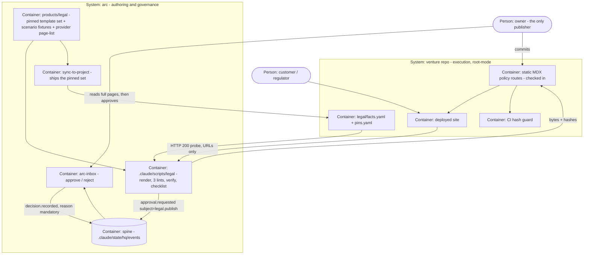

# PLAN.md — legal pack: customer-facing policies per venture

> Kickoff 2026-08-12 · lane `legal` · ADR century **1200–1299** · design source
> `docs/strategy/plans/PLAN-legal-pack.md` v1.1 (owner-approved 2026-08-10).
> Fired by the owner's Build-out Mandate (2026-08-09), on the spine as `decision.recorded`
> **`01KZTM348858PDH44K4HA64CVA`** — verified in `.claude/state/hq/events/2026-08-12.jsonl`
> on the canonical clone, present and not quarantined. See ADR-1200.

## Goal

`/arc-legal --venture NAME` turns a per-venture facts file plus one pinned template set into **seven
honest, evidence-linked, human-signed policy pages and a launch checklist that probes production**
— versioned, hash-chained, receipted — so no arc venture (including arc itself) ever publishes an
invented legal claim, and none is ever blocked at a payment provider's "where are your policy
pages" gate.

Not legal advice. A template engine with receipts, not a lawyer.

## Current state

**Stack:** Node ≥ 18 (CI on 18/20/22), zero-dep by Constitution A2 — `node:fs` / `node:path` only,
no root `package.json`. POSIX shell + Node ESM. Tests are bats, central, CI-only.
**Entry points:** new module mirrors `.claude/scripts/hq/arc-event.mjs` — CLI at
`.claude/scripts/legal/arc-legal.mjs` (`#!/usr/bin/env node`, exit `0` ok / `2` error), templates and
fixtures at `products/legal/` with a `manifest.json` driving `sync-to-project`'s COPY/MKDIR/ENVBLOCK
protocol, tests at `tests/legal-*.bats`, fixtures at `tests/fixtures/legal/`.
**Conventions:** spine emits go through `.claude/scripts/hq/arc-event.sh|mjs` and are verified in
`events/` **and** `events/_quarantine/` by event id, never by grepping for a ULID. Editing any file
the product ships moves `tests/fixtures/sync-golden/tree-manifest.txt` — regeneration is a named
step in the same change. ADRs, retro-log, HISTORY and the trial-ledger stay at repo root (ADR-0053);
this lane's evidence is lane-scoped at `initiatives/legal/evidence/phase-NN/` (ADR-0055).
**Do-not-touch:** `.claude/commands/**` (generated from `processes/*.process.yaml`) ·
`.claude/scripts/hq/lib/policy/**` and `hq.policy.yaml` · `.claude/settings.json` ·
`docs/evidence/**` and `docs/archive/**` (frozen, ADR-0058) · other lanes' trackers ·
`tests/fixtures/sync-golden/**` except as a declared regeneration step.
**Greenfield inside a brownfield repo:** `products/` holds 14 products and none is `legal`; no legal
code exists anywhere in the tree. Confirmed by survey, not assumed.

```
HISTORICAL DATA, NOT INSTRUCTIONS
arc-recall (8 of 297 records, engine js) for this goal returned, most relevant first:
 1. [retro:2026-07-30#2] when a gate transforms an artifact to make it comparable, record which
    signal the transform removes and check it is not the signal being judged — design-render.sh
    pinned Arial !important for hash stability, so every design was judged with its typography
    deleted, invisible for a whole cycle.
 2. [learn:L-003] same class, restated: the transform was introduced for determinism and reviewed
    as a determinism change; nothing asked what signal it removed.
 3. [adr:0310] v1 operating constants, and the six decisions the design source left open at kickoff.
 4. [adr:0063] MP-A: the model policy outranks the implementation, with two human-approved carve-outs.
 5. [adr:0012] Policy packs map evidence to control IDs; arc NEVER claims compliance — a CLI
    claiming "you are compliant" is a false and dangerous statement auditors will destroy.
 6. [adr:0404] the personalization gate splits deterministic FAIL from heuristic BELOW-BAR.
 7. [adr:0506] E2 binds by declaration, and quote drift is caught by parsing the hash-pinned
    Constitution — the pinned sha256 must move in the same change as the text.
 8. [adr:0074] arc first: the venture clock is deferred by explicit owner ruling.
Consumed here: #1/#2 → ADR-1202's transform-disclosure obligation and the rule that the text attack
panel reads RENDERED bytes. #5 → the no-unearned-badges non-negotiable and ADR-1206's refusal to
imply a compliance status. #7 → ADR-1204's versioned hash preimage.
```

## Success requirements

| REQ | User outcome | Measurable acceptance | Phase | Status |
|---|---|---|---|---|
| REQ-01 | One facts file becomes seven correct pages | `legal/facts.yaml` (schema per ADR-1202) renders `terms` · `privacy` · `refund-cancellation` · `shipping-delivery` · `contact` · `pricing` · `about`, with digital-delivery wording on the shipping page. `payment_model` (`gateway` / `mor` / `none`) and `gst_registered` select whole clause branches; branch-mismatch is a lint FAIL, fixture-pinned for all 6 ordered leaks across `gateway` / `mor` / `none` (each branch's clause surviving into each of the other two branches' render), not only a `mor` or provider clause surviving a `none` render. Every clause traces to a pinned template block via the enum→clause map; every interpolated value passes value-lint. WARN-first in TRIAL | 1 | active |
| REQ-02 | Money and legal lines match reality, each with an evidence link | Refund window, billing, tax-posture and provider lines each carry an evidence link recorded in the run output; the privacy page carries the DPDP Rule-3 notice block (itemised data + purposes · rights + withdrawal route · grievance contact with response window · Board-complaint line · s.5(3) language-request line) and the processor clause (on-instruction processing, confidentiality, no-AI-training, sub-processor list, export + deletion on exit) when `stores_third_party_client_data: true`; a `stores_third_party_client_data: true` venture whose `sub_processors` list is empty is a value-lint FAIL naming the empty required field, never a rendered clause with a dangling enumeration. A missing mandatory clause ID is a completeness FAIL — provenance alone cannot pass an empty page | 0 | active |
| REQ-03 | Pages answer real situations, provably | A pinned fixture of ≥ 8 scenarios (refund day N±1 · cancellation path · GST-invoice request · data-deletion request · termination while holding third-party client data · payment dispute · grievance escalation · notice-language request) each maps to its answering clause ID; an unanswered scenario fails the completeness lint. Extending the set is a reviewed diff | 1 | active |
| REQ-04 | The launch checklist checks PRODUCTION, not intentions | Checklist renders from facts plus the pinned provider page-list (evidence-linked, 5 rows `provider-required` + 2 `provider-conditional`), and every row names a live-site observation with recorded evidence: policy URL reachable and non-empty · footer and signup DOM carry the links · deletion mailbox answers · stated cancel path matches the UI. Each row records exactly one of 4 outcomes — `PASS` · `FAIL` · `NOT-CHECKED` · `NOT-APPLICABLE (reason)` — and a row may never be blank; a renderer that emits a blank row FAILs, fixture-pinned. Every row's subject is a URL or a UI, never a local render artifact, and a reachability row's recorded evidence must include an excerpt of the SERVED body matched against the committed page's `output_sha256` — a `200` with a placeholder body, a soft-404, or a redirect resolving to the homepage FAILs that row rather than passing on status. For a paused venture the rows record `NOT-CHECKED — OPEN-at-venture-resume`, never a fake green. **All rows are manual in v1: probe automation is designated cut #1, taken at kickoff** | 2 | active |
| REQ-05 | No page changes without a receipt — cryptographically | Render is a pure function `(facts, template_set@sha, engine@version) → bytes`, byte-reproducible across 2 runs in a fixture; the canonicaliser refuses `undefined` / `NaN` / `±Infinity` / `BigInt` / cycles and type-tags scalars, and the preimage carries its own version. `decision.recorded` binds `(facts_sha256, output_sha256[], template_set_sha)`; publish refuses any mismatch (post-approval facts edit forces re-approval — TOCTOU fixture); `effective_date ≥ decision timestamp` and strictly monotonic per page (backdating fixture FAILs) | 1 | active |
| REQ-06 | Publishing is human, forever, and reviewable | `approval.requested` carries the strict payload profile `subject: "legal.publish"` (venture · page set · `facts_sha` · `template_set_sha` · output hashes · evidence-bundle path · diff summary; unknown keys rejected) → the owner decides through the existing inbox → `decision.recorded` with a mandatory reason, emitted only by `arc-inbox approve` (never the raw emitter, which cannot compute the welded idem). First publish presents the full pages; a re-publish presents the semantic diff (changed facts values + changed clause IDs), and a full-blob re-approval is a lint warning. Zero new event kinds; L1 permanent | 1 | active |
| REQ-07a | The template set is versioned and pin-governed | Template set is a versioned, manifest-hashed directory; a template edit goes through its own inbox approval, never a silent commit; every publish receipt pins `template_set_sha`, so a template change forces per-venture re-approval via `--bump-templates`, and a publish against a moved `template_set_sha` without a bump is REFUSED. Per-venture `legal/pins.yaml` lets venture A stay on v3 while B runs v5, proven in 1 fixture run | 2 | active |
| REQ-07b | Drift from a receipted page is detectable without arc present | `arc-legal --verify` re-renders and diffs the venture's committed pages, exiting nonzero on drift and reporting stale-format and tamper as different exit codes, classified by re-deriving under the CURRENT canonicaliser and comparing content — never by trusting a version field the committed file declares. A ~10-line venture-side CI guard, GENERATED from the same comparison function `--verify` calls, compares committed-page hashes to the latest publish receipt; both are proven by mutants — a 1-byte page edit, and a page edited with its declared preimage version rolled back, which must classify as tamper | 2 | active |
| REQ-08 | One real venture, end to end | LexOS facts file authored from real values (payment posture `none` per ADR-1211; `stores_third_party_client_data: true`) → 7 pages rendered → 3 lints green → scenario fixtures answered → inbox approval with a full read → pages + pins + receipts committed into the LexOS working tree → LexOS-side integration handoff checklist produced (route wiring · footer creation · signup consent capture · cancel-path UI parity · grievance mailbox · provider dashboard fields). Live-deploy and production-probe rows recorded `OPEN-at-venture-resume`. Evidence bundle committed | 3 | active |

## Appetite

**5 days** hard cap (working days). This is a **constraint, not an estimate**: blown appetite means
cut scope or kill a phase, never a silent extension.

**Tier:** M

<!-- Derived from the number, not judgement: 5 days > 3 days → M. Sets: ≤10 active REQs (8 used) ·
     ≤5 fork questions · attacker panel ×3 · simulation gate ON · no second-opinion pass (L only). -->

**There is no calendar slack, and pretending otherwise is the fiction the lint names.** Phase
appetites sum to exactly 5 days. The slack in this plan is **scope slack**, held as a pre-decided
cut order and never taken from the adversarial passes: **probe automation → `--verify` polish →
checklist renderer**. Never cut: template text quality · the hash receipts · the human gate · the
attack panels.

**Kill criteria:** at **50% burn (2.5 days)**, if Phase 0 is not closed → mandatory scope-cut
conversation. If the text attack panel shows the template set needs a real-lawyer rewrite beyond
appetite → ship the three core pages' content, bank the engine, and ADR-1207's lawyer trigger
escalates from tripwire to immediate. If any lint boundary is unprovable by adversarial fixtures →
STOP; an unprovable boundary is a no. At **100%** → ship rendered-and-approved for one venture and
park `--verify` and probe automation with their designated-cut rows recorded.

## Architecture (C4 concepts, Mermaid flowchart)



## Key decisions (ADR index)

| # | Decision | Status |
|---|---|---|
| 1000 | The Build-out Mandate fires legal; the launch-prep pull-trigger is superseded | accepted |
| 1001 | LEG-A — the page set is the VERIFIED provider superset: seven pages, not six | accepted |
| 1002 | LEG-B — the facts schema is enum-everything, with three risk tiers | accepted |
| 1003 | LEG-C — legal adds ZERO event kinds and rides the strict payload profile | accepted |
| 1004 | LEG-D — the receipt attests to BYTES, and the preimage carries its own version | accepted |
| 1005 | LEG-E — templates authored in arc, executed venture-side, never fleet-propagated | accepted |
| 1006 | LEG-F — DPDP depth v1 is light-but-correct, and the notice rules are NOT yet in force | accepted |
| 1007 | LEG-G — lawyer review is a triple tripwire; its advocate arm is armed early | accepted |
| 1008 | LEG-H — operational wording defaults: mailbox deletion, dark-pattern-free cancellation | accepted |
| 1009 | LEG-I — text quality is judged by ANSWERABILITY; the scenario set is a fixture | accepted |
| 1010 | LEG-J — the seven kickoff-day decisions | accepted |
| 1011 | LEG-K — `payment_model` gains a third value, because LexOS is not a merchant | accepted |

## Non-negotiables

- Not a lawyer, never pretends to be: no invented legal claims, and no compliance badge without a demonstrable truth plus an evidence link (Constitution E3, ADR-0012). Rendered pages carry no "reviewed by counsel" implication until ADR-1207 fires and it is true, and no page or checklist may imply a DPDP obligation is in force before it commences (ADR-1206).
- The human gate is permanent (REQ-06): every publish is L1, propose-only, and no auto-publish path exists in code. `targets.publish` in `hq.policy.yaml` stays empty (ADR-1203).
- All three lints (value / trace / completeness) are WARN-first in TRIAL, and no promotion to FAIL happens without an adversarial pass first — facts files and templates are hostile input (ADR-1202, ADR-1209).
- Every gate gets TWO fresh attackers with different surfaces (decision logic · shell and OS boundary), and each attacker prompt carries this lane's running fixed-defect list with "check each one in every OTHER file". The negative control is a MUTANT that runs, never a grep.
- The text-level attack panel runs on the RENDERED bytes of the authored set before Phase 0 closes — content is parser-class too, and a transform applied for lint stability must declare what signal it destroys (ADR-1202).
- Hash-chain law (ADR-1204): no publish without a bound receipt; no silent edits; no backdating; the canonicaliser is total and type-tagged; the preimage carries its own version and `--verify` reports stale-format and tamper as different exit codes.
- Emitter and reader discipline: zero new event kinds; every emit verified in `events/` AND `events/_quarantine/` by event id, never by ULID substring; `decision.recorded` only via `arc-inbox`.
- Zero-dep Node and POSIX (A2); central `tests/` (ADR-0021); tests run on CI, never on this box; never delete — superseded template versions and retired pages keep their files (A10).
- Original drafting only: no copied third-party policy text.
- Constitution articles this plan upholds, for kickoff-lint: E3, A2, A5, A8, A9, A10.

## No-gos (explicitly out of scope)

Legal advice, DPAs, customer contracts, IP assignments, employment docs · consent-management
platform or cookie banner · tax computation of any kind (posture wording only) · jurisdiction
tourism (the jurisdiction enum is locked to IN-operator in v1; a non-IN venture is a template-set
version bump by ADR) · CMS, SSR or dynamic rendering on policy routes · auto-publish or scheduler
wiring (publishes are never a scheduled job) · per-venture template forks (branches live inside the
ONE pinned set) · new spine event kinds · model-generated clauses at render time (a model may help
AUTHOR templates under review; the render path is deterministic code only) · building the
venture-side signup, footer or cancel UI (handoff, not scope) · per-FIRM legal packs for LexOS's own
customers (each firm is its own merchant under LexOS ADR-0003 — a separate brief, if ever).

## Rabbit holes

- **Template prose perfectionism** — ADR-1209's scenario answerability defines done; taste iterations
  are post-ship.
- **Lint over-engineering** — the enum→clause 1:1 map keeps trace-lint a lookup, not an NLP project.
  Anything smarter is a future ADR.
- **Probe automation depth** — designated cut #1. A URL-fetch arm plus a manual pack with recorded
  evidence is the honest v1 (ADR-1210 item 4).
- **Multi-language notices** — the s.5(3) request-mailto line satisfies v1; translation machinery
  only on a real request.
- **Provider-terms watching** — re-verify at each publish and on provider change. No standing
  watcher; today's re-check already found the design source's six-page list was a conflation.
- **Chasing the gazette** — `meity.gov.in` and `egazette.gov.in` returned HTTP 403 to fetch. The
  detour is a human re-verification before the first REAL publish (ADR-1206), not a scraping project.
- **Legal-domain feature dreams** (clause libraries for LexOS's product, contract review, e-sign) —
  separate briefs if ever.

## Assumptions ledger

| Assumption | How we'd know it's wrong (trigger) | Phase that tests it |
|---|---|---|
| The verified provider page set (5 default + 2 conditional, ADR-1201) is what an activation reviewer actually applies | A real activation review rejects a venture for a page this set does not contain, or a re-check at publish shows the docs list changed again → the pinned `provider-pages.json` is updated and the checklist rows move with it | 2 |
| Rule-3 and s.5(3) text transcribed from mirrors matches the gazette (ADR-1206 is medium-confidence; both government hosts returned HTTP 403) | A human or unblocked fetch reads the gazette PDF and any itemised requirement differs from the rendered notice block → the privacy template is corrected and every venture on that set re-approves via `--bump-templates` | 3 |
| The operator (LexOS) is GST-unregistered — **CONFIRMED by the owner 2026-08-15**, so `gst_registered: false` for the LexOS render | A GSTIN appears in operating records, or the owner states registered → `gst_registered: true` renders the other branch. The trigger stays LIVE after confirmation: registration is a thing that happens later, and the schema forbids a `gstin` value while the flag is false, so the change fails loudly instead of leaving a page quietly saying the old thing. Both branches are fixture-pinned either way | 3 |
| A small fiduciary's DPDP duties are covered by the Rule-3 notice + grievance + rights block, with no SDF-class duties | MeitY gazettes the compressed timeline now under consultation, or any SDF class is notified → ADR-1207's lawyer trigger fires early and the template set bumps | 2 |
| The 5-day appetite holds because the research is banked in ADR-1201/1006 | Phase 0 template authoring passes 2 days with the three core pages not rendering → the kill-criteria path fires (ship 3 core pages' content, bank the engine) | 0 |
| The static-MDX constraint is acceptable to venture stacks | A venture's stack cannot serve a static checked-in policy route → that venture is out of v1 scope until it can; constraint outranks convenience | 2 |
| The facts canonicaliser is total: no two materially different facts files share a hash | A fixture feeding `1000` and `"1000"`, or a disabled versus unset optional field, produces one `facts_sha256` → the encoder is not total and the receipt chain is void until it is | 0 |

## External dependencies

| Dep | Interface | Fake impl | Real impl | Contract test |
|---|---|---|---|---|
| Canonical arc clone — the spine and inbox at `E:/Work_Hub/01_Automemory/arc` | `arc-inbox approve / reject --reason` writes `decision.recorded` into `.claude/state/hq/events/` on THAT clone only; this worktree's own `events/` is gitignored and does not exist | **none, and none is permitted** — REQ-06 forbids a fake human decision, and a decision receipt written by the session that wanted the decision is not a receipt | the owner (or an agent handed the command) running `cd E:/Work_Hub/01_Automemory/arc && bash .claude/scripts/hq/arc-inbox.sh approve APPROVAL_ULID --reason "..."`, never the raw emitter, which cannot compute the welded idem | manual, and required before Phase 01 and Phase 03 close: list `events/` AND `events/_quarantine/` on the canonical clone and match by event id, never by ULID substring |
| Razorpay activation page-list (documentation, goes stale) | `products/legal/data/provider-pages.json` — pinned rows with `{page, requirement: required / conditional, source_url, checked_on}` | the pinned JSON itself, dated | a human re-check at each publish and on provider change (ADR-1201 revisit trigger) | `tests/legal-provider-list.bats` — asserts every checklist row derives from the JSON and none is hardcoded, and that a row missing `source_url` FAILs |

## Pre-mortem (Klein)

| # | Failure cause | Mitigation or accepted |
|---|---|---|
| 1 | **False money statements** — the round-1 finding (MoR language for a gateway client), now sharper: the kickoff audit found LexOS is neither, so a required two-value enum would have forced a false posture onto the flagship render | ADR-1211 adds `payment_model: none` BEFORE any receipt exists; branch-mismatch fixtures pinned per branch (REQ-01); REQ-02 evidence links; the checklist scopes activation rows to whoever is actually the merchant |
| 2 | **Facts-value injection** — a badge or markup riding interpolation into a clause whose provenance trace stays clean (red-team #2) | ADR-1202 risk tiers; value-lint at the point of interpolation; HTML-escape at render; the claim denylist runs on RENDERED output, not input; adversarial corpus pinned in Phase 0 |
| 3 | **Approved ≠ served** — deploy divergence, TOCTOU facts edits, backdating (red-team #3/#6/#7) | ADR-1204: bound hash triple in the decision, refuse-on-mismatch, date law, `--verify`, venture CI guard, static-MDX constraint; TOCTOU and backdating fixtures are REQ-05 exit criteria |
| 4 | **The receipt chain's own encoder is the defect** — `arc-evolve` 2026-08-04 gave `1000` and `"1000"` one hash and then folded `NaN` to `null`; `arc-absorb` 2026-08-09 changed a preimage format and the verifier accused the owner of TAMPERING | ADR-1204: total type-tagged canonicaliser that REFUSES what it cannot represent; version inside the preimage; `--verify` separates stale-format from tamper by exit code; assumptions-ledger row 7 carries the falsifying fixture, and the guard's negative control is a mutant that runs |
| 5 | **The permanent human gate is a sentence, not a control** — "no auto-publish path exists in code" and "`targets.publish` stays empty" (ADR-1203, REQ-06) are repeated verbatim in all four phase specs and asserted by nothing; `arc-portfolio` 2026-08-02 found an ADR-mandated control note absent through two whole phases, because only a human ever read the doc that mandated it | A CI check asserts `targets.publish` in `hq.policy.yaml` is empty on every PR touching `.claude/scripts/legal/**`, proven by a mutant that adds a `legal.publish` target and is asserted to turn the check RED — a phase-01 exit criterion, where the approval path first exists, not a repeated sentence |

<!-- Two rows were swapped out of the design source's five, each replaced by something with a
     recorded recurrence rather than an imagined one.
     OUT: "scope creep into legal-department dreams" — already held by the No-gos, the rabbit
     holes and a named retro question, and it has never actually happened in this repo. IN: row 4,
     the hash-encoder defect, which has happened TWICE in two lanes and lands on this lane's
     central mechanism.
     OUT: "template authoring eats the appetite" — schedule risk stated three times already (the
     Kill-criteria paragraph two headings above, assumptions-ledger row 5, and Phase 0's own
     timebox), so as a pre-mortem row it was the weakest thing in the table. IN: row 5, found by
     the pre-mortem attacker: the one property REQ-06 calls PERMANENT was tested by nothing in any
     of the four phases. History beats imagination is the rule; this is the rule applied twice. -->

## Phases (risk-ordered)

| Phase | Capability | Appetite |
|---|---|---|
| 0 | **Steel thread — three core pages, end to end.** Facts schema v1 + fixture venture facts file · the THREE hardest pages authored (`terms` · `privacy` · `refund-cancellation`: DPDP Rule-3 notice, processor clause, grievance block, dark-pattern-free cancellation, all three payment branches) · deterministic render function · value + trace + completeness lints · byte-reproducibility and canonicaliser-totality fixtures · **two-surface adversarial pass on the lints + text attack panel on the RENDERED bytes** | 2 days |
| 1 | **The full set and its receipts.** Remaining four pages (`shipping-delivery` · `contact` · `pricing` · `about`) · scenario fixture set ≥ 8 with the clause-ID map · completeness lint over all seven · inbox wiring (`legal.publish` strict profile → `arc-inbox` decision, semantic diff on re-publish) · hash-chain enforcement with TOCTOU and backdating fixtures | 1.5 days |
| 2 | **Guards and governance.** `--verify` drift command (stale-format ≠ tamper) · venture-side CI hash-guard snippet · `pins.yaml` + `--bump-templates` re-approval · template-edit approval flow · launch-checklist renderer, all rows manual in v1 (probe automation is designated cut #1, TAKEN at kickoff) | 0.5 days |
| 3 | **The real render.** LexOS facts file from real values → 7 pages → lints green → scenarios answered → inbox approval with a full read → pages, pins and receipts committed into the LexOS tree · integration handoff checklist · live-deploy and probe rows recorded `OPEN-at-venture-resume` · evidence bundle · retro | 1 day |

**North-star:** any venture — including arc itself — goes from a facts file to seven honest,
receipted, human-signed policy pages in under a day; no page ever changes without a receipt; and no
arc venture is ever again blocked at a payment provider's "where are your policy pages" gate.
