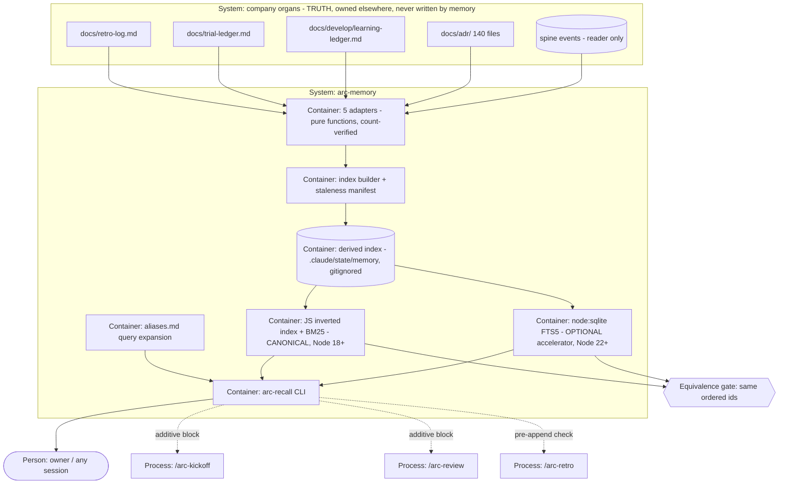

# PLAN.md — arc-memory "playbooks + recall"

> Lane `memory`, Cycle 11, born by `/arc-kickoff --lane memory` on 2026-08-11. ADR band
> **0700–0799** (0600–0699 was claimed by `absorb` on 2026-08-09).
> Design source: `docs/strategy/plans/PLAN-memory.md` v1.1 — the decision record, frozen.
> MEM-A..MEM-K were locked there by the owner; **MEM-B was re-decided at this kickoff** on
> measured evidence (ADR-0701), and MEM-L's open values are settled across ADR-0704/0705/0706.
> Trigger: FIRED under the owner's Build-out Mandate (2026-08-09).

## Goal

`arc-recall "how did we get burned by this before"` gives any session — human or process, in arc
or any root-mode install — the company's relevant recorded lessons, decisions and rules in under
a second, **verbatim and with canonical citations**, and the kickoff and review processes receive
them automatically — so a lesson arc has already paid for is never re-learned because nobody
could find it.

## Current state

Verified against the live tree on **2026-08-11**. Three of these numbers correct the design
source, which is why the plan re-measured rather than trusting them.

**The corpus exists, is truth, and is not findable enough:**

| Organ | Measured 2026-08-11 | Shape | Note |
|---|---|---|---|
| `docs/retro-log.md` | **54** pattern rows (source said ~33) + 10 scoreboard rows + **0 malformed** | bare pipe-separated lines, 5 fields: date / project / pattern / prevention / tags | header law: *"read as-is, never summarized"* — preserved untouched (ADR-0704). **A naive split reports 53 + one "anomalous 6-field row"; that row is a real pattern row whose prevention contains a literal pipe inside a code span (`` `(?:^|\n)##` ``). Masking code spans before splitting yields 54 and zero malformed** — see ADR-0702 |
| `docs/trial-ledger.md` | **49 ledger records** out of 85 pipe rows | **seven** separate 5-column ledger tables (`date / gate / run-ref / fired? / false-positive?`) plus three unrelated 3-column tables — NOT the bare leading-date lines the source assumed | the other 36 rows are 7 headers, 10 separators and 19 rows of the non-ledger tables; counting all 85 would index headers as evidence. **The kickoff said 37 records / 31 non-ledger rows; the adapter measured 49 / 19 on 2026-08-11 and the adapter is right** — 49+7+10+19 = 85 exactly, and the kickoff's split did not add up |
| `docs/develop/learning-ledger.md` | 4 blocks, L-001..L-004 | `#### learning:` blocks + typed links | develop's organ; memory indexes, never owns |
| `docs/adr/` | **150** files (140 at the moment the design source was written, plus this lane own ten); 150/150 parse an H1 title and a `**Status:**` line | one file per ADR | clean adapter, 100% parse rate |
| spine `decision.recorded` | via reader only | closed payload: decides / verdict / reason | `KINDS.length = 44` (source said 31) |

Total across the three text organs ≈ 80KB; `docs/adr/` ≈ 853KB. **120 distinct tags**, long-tailed
(`verification` 17, `gate` 12, `adversarial` 10, `silent-failure` 10, most appearing once).

**Existing recall mechanisms — extend, never duplicate:** kickoff step 5's whole-file retro-log
read (manual tag overlap) · develop's Context Pack one-hop typed links (ADR-0111) · grep.

**Platform facts that shaped the design:**

- **Zero npm dependencies.** No root `package.json`. A native dep would be arc's first, across 3
  CI OSes, through ADR-0110 vetting. Not taken.
- **`node:sqlite` FTS5 probe PASSED** on the owner's machine 2026-08-11 (Node v24.18.0, SQLite
  3.53.1): FTS5, `unicode61` diacritic folding, external-content tables, weighted `bm25()`,
  parameterized `MATCH`, atomic rename — all verified, no experimental warning.
- **…and `node:sqlite` exists on only 1 of the 5 distinct OS×node combinations** in the CI
  matrix — a single job out of 18. ubuntu runs Node 18/20/22; **macOS and Windows both run Node
  20**, where the module does not exist. This is what re-decided MEM-B (ADR-0701).
- **The optional-accelerator pattern already ships in arc**: `.claude/scripts/hq/spine.mjs`
  lazy-imports `node:sqlite` and degrades with `node:sqlite unavailable (Node < 22)`, per
  ADR-0024.
- `.gitignore` already covers `.claude/state/` — the derived index is never committed.
- `/arc-retro` is hand-written and directly editable. `/arc-kickoff` and `/arc-review` are
  **generated** from `processes/kickoff-plan.process.yaml` and `processes/review-diff.process.yaml`
  (ADR-0201/0202) — hooks land as process-file edits, never as command edits.
- Windows dev box + 3-OS CI: all hashing and fixtures CRLF-normalized, all output paths
  repo-relative forward-slash.

**Stack:** Node >= 18, ESM, **zero npm dependencies** (no root `package.json`); bats for tests;
GitHub Actions across ubuntu (Node 18/20/22), macOS (Node 20) and Windows (Node 20); optional
`node:sqlite` on Node 22+ only.

**Entry points:** `.claude/scripts/memory/arc-recall.mjs` (CLI) and `memory-index.mjs` (builder)
are new — and both land under `.claude/scripts/`, which is **synced into every consumer project**,
so each needs a **product-manifest entry** (`product-lint.mjs`, CI's "Product manifests lint"
step) and a regenerated `tests/fixtures/sync-golden/tree-manifest.txt` — a byte-identity gate that
is invisible locally and only fails on CI. Existing surfaces this cycle touches:
`processes/kickoff-plan.process.yaml` and `processes/review-diff.process.yaml` (additive steps,
recompiled), and `.claude/commands/arc-retro.md` (hand-written, direct edit).

**Conventions:** tests centralised in `tests/` (ADR-0021) as `tests/memory-*.bats` with fixtures
under `tests/fixtures/memory/`; ADRs one-per-file in the lane's century band; evidence under
`initiatives/memory/evidence/phase-NN/` (ADR-0055); the spine is reached only through the reader
library, enforced by `spine-reader-lint.sh`.

**Do-not-touch:** the five company organs' **contents** (`docs/retro-log.md`,
`docs/trial-ledger.md`, `docs/develop/learning-ledger.md`, `docs/adr/`, the spine) — memory reads
them and never writes them; the generated command files in `.claude/commands/` carrying the
DO-NOT-EDIT banner (`arc-kickoff.md`, `arc-review.md`, `arc-commit.md`); `docs/evidence/**` and
`docs/archive/**`, which are frozen (ADR-0058); and the spine kind vocabulary, which stays at 44.

## Success requirements

| REQ | User outcome | Measurable acceptance | Phase | Status |
|---|---|---|---|---|
| REQ-01 | Every recorded lesson is in one searchable index | 5 adapters → 1 index. `N_parsed == N_indexed` printed per organ; any mismatch = build FAILURE. Counts to match: retro-log **54** pattern (+10 scoreboard excluded, named), trial-ledger **49** records (+36 named exclusions), learning-ledger **4**, adr **150**, decisions N/N. Code spans masked before splitting, proven by a fixture on the literal-pipe row. Delete index → rebuild → **identical record set**: same doc ids, same order, same per-record content hash. **Not** a query comparison — ranking does not exist in Phase 0, so query-result determinism belongs to REQ-02. The 12 golden queries are committed in Phase 0 before any tuning, as REQ-06's pass condition and this phase's grep-baseline input | 0 | validated |
| REQ-02 | The right lesson in under a second | bm25-ranked verbatim rows, prevention-first, citation carrying a repo-relative path on every row. **Query determinism lands here, not in Phase 0**: delete index → rebuild → the 12 golden queries return identical *ordered result ids* under the documented id-ascending tie-break, on all 3 OSes. `< 1000ms` per query, `time`d on the owner box **and the ubuntu and macOS CI legs** — all three recorded. 10 hostile-query fixtures green **through the real CLI on all 3 OSes**, each naming whether it crosses `argv` or an internal API. Zero-lane root-mode fixture green | 1 | validated |
| REQ-03 | Kickoff receives recall without being asked | `processes/kickoff-plan.process.yaml` gains an additive recall step; retro-log whole-file read byte-unchanged. Fixture: a planted rule surfaces in a fixture kickoff. Budget-overflow fixture prints a counted `(+N more)` line at `K=8` / 1200 tokens | 1 | validated |
| REQ-04 | Past decisions are queryable, not archaeological | `--decisions 'verdict:reject reason~worktree'` filters `decision.recorded` via reader only; seeded fixture returns byte-exact `reason` text; `KINDS.length` unchanged at 44 | 2 | active |
| REQ-05 | Contradicting rules meet a human, not a merge bot | `/arc-retro` pre-append check fires on `>= 2` shared tags AND token overlap `>= 0.5`; fixture: a planted near-duplicate pair surfaces before append; nothing auto-resolves | 2 | active |
| REQ-06 | Recall quality is a number, not a vibe | The 12 golden queries + expected ids are **authored and committed in Phase 0, in their own commit, before any adapter/alias/weight tuning** (they are also Phase 0's grep-baseline input); **this phase wires them into CI as a failing gate** — red = build failure — and shows the Phase-0 grep baseline beaten, both tables in evidence | 2 | active |
| REQ-07 | The fast engine is proven to agree with the reference | `--engine` selects js / sqlite / auto; equivalence gate asserts both engines return the **same ordered ids** for all 12 golden queries under one **documented tie-break (id-ascending on equal bm25)**; skips visibly (never silently) on the 4 OS×node combinations without `node:sqlite`, and a run where **every** leg skipped is a FAIL | 2 | active |
| REQ-08 | Review receives recall without being asked | `processes/review-diff.process.yaml` gains the same additive step with a diff-derived query; fixture: a changed path surfaces a path-matched rule | 2 | active |

## Appetite

**5 days.** A constraint, not an estimate. Phase split: **P0 1.5d · P1 1.75d · P2 1.25d = 4.5d**,
leaving 0.5d of deliberate slack.

**Tier:** M

**The appetite was raised from 4 days to 5 by the owner on 2026-08-11, and that is recorded here
rather than absorbed silently.** The storage decision (ADR-0701, option C) added REQ-07 — a second
engine plus an equivalence gate — to a cycle that was already fully committed at 4 days. The
kickoff's recommendation was to keep 4 days and cut REQ-07's engine first. **The owner chose to
fund the work instead of cutting it**, so the whole of option C ships: canonical JS engine, sqlite
accelerator, and the equivalence gate between them.

**Cut order, pinned — now a contingency rather than an expectation:** **REQ-07's sqlite engine
first** (the equivalence *contract* and its test harness still ship; only the second engine's
implementation is banked), **then REQ-05**, **then REQ-04**. REQ-07 leads because at the measured
corpus size it buys speed nobody is waiting on, so cutting it costs the user nothing observable —
whereas REQ-05 and REQ-04 are user-visible capability. **REQ-01/02/03 are the module**: if they do
not fit, the cycle stops, it does not shrink.

**Kill criteria:** at **50% burn (2.5d)**, if Phase 0 is not closed → mandatory scope-cut
conversation. At **100%** → cut or kill, never silently extend. The appetite has now been raised
once; a second extension is a kill conversation, not a third number. Two named stop conditions from
the design source, both still live: (1) if REQ-01's count-verify needs more than ~0.5d of per-file
special-casing → STOP and propose fixing the organ's format as its own change first, because
indexing a swamp validates the swamp; (2) the MEM-B preflight already ran and already forced a
decision — that gate is closed (ADR-0701).

## Architecture (C4 concepts, Mermaid flowchart)

## Key decisions (ADR index)

| # | Decision | Status |
|---|---|---|
| 0700 | MEM-A — index the organs in place; never create a second rule store | accepted |
| 0701 | MEM-B — pure-JS index is canonical; `node:sqlite` FTS5 is an optional accelerator behind an equivalence gate | accepted |
| 0702 | MEM-C — verbatim, prevention-first output; every row carries a path-bearing citation | accepted |
| 0703 | MEM-D — reader-only; memory emits zero events and needs no policy rows | accepted |
| 0704 | MEM-E — hooks are additive process-file steps; K=8, budget 1200 tokens | accepted |
| 0705 | MEM-F — conflicts surfaced at write time, T=0.5; semantic detection out of scope | accepted |
| 0706 | MEM-G — golden set gates; surfaced→cited rate is observational forever | accepted |
| 0707 | MEM-I — root-mode-first; `lane` is provenance metadata | accepted |
| 0708 | MEM-J — two fresh-agent adversarial passes per parser surface, inside its shipping phase | accepted |
| 0709 | MEM-K — a curated alias layer fixes vocabulary mismatch; no stemming, no embeddings | accepted |

## Non-negotiables

- The canonical path runs on **Node >= 18 on all three OSes** with **zero npm dependencies**; the sqlite engine is lazily imported and can never break the path it only accelerates.
- The index is **derived-only** and gitignored; deleting it and rebuilding must reproduce identical ordered results.
- Every indexed row is **count-verified** (`N_parsed == N_indexed`) and every excluded row is **named with file and line** — never silently dropped.
- Output is **verbatim**; every citation carries a repo-relative path; a bare number is never printed alone.
- Memory **writes nothing** to the company organs and **emits nothing** to the spine.
- Hooks are **additive**; no existing read is replaced, and generated commands are changed only through their process file.
- Every parser-class surface gets **two fresh-agent adversarial passes on two different surfaces, inside the phase that ships it**; found holes are pinned as fixtures, and each pass carries the running list of defects already fixed in this lane, to be checked against every other file.
- Before editing any shared root organ (`processes/**`, `tests/**`, `.github/**`), run `git log origin/main --oneline -5` on that path first — the `leads` lane is LIVE on the same files, and a collision is resolved then, in one place, never at merge time.
- **Tests are green on CI, never on the dev box**, read per-JOB; all fixtures are CRLF-normalized and all paths repo-relative forward-slash.

## No-gos (explicitly out of scope)

- **No `playbooks/` directory** and no migration of any organ's content (ADR-0700).
- **No embeddings, no vector search, no LLM at ingest or query time** — the index stays a pure function of the organs (ADR-0709).
- **No new spine event kinds** and no `hq.policy.yaml` rows (ADR-0703).
- **No semantic contradiction detection** — lexical overlap only, and it says so (ADR-0705).
- **No cross-lane edits.** The Context-Pack ↔ recall integration is a follow-up `/arc-change` to the `develop` lane, not this cycle.
- **No auto-rule-writing.** Rules keep coming from retros and humans.
- **No chat, MCP, or dashboard surface.** `--json` is the whole consumer contract.
- **No cross-repo federation** and no consumer-repo rollout; v1 proves the zero-lane fixture only (ADR-0707).
- **No change to what `/arc-retro` writes or where** — only a pre-append check added.
- **No incremental index updates** — full rebuild only.

## Rabbit holes

- **Per-organ format special-casing.** Three format surprises already surfaced at kickoff. Detour: field-count parsing with named exclusions; if any one organ needs more than ~0.5d, STOP and propose fixing that organ's format as its own change (kill criterion 1).
- **Two engines drifting apart.** Detour: the equivalence gate compares *ordered result ids*, never db bytes, and runs both engines in one process so a test can force either side — **and both engines apply the same documented tie-break (id-ascending) on equal bm25 scores**, or the gate reports two correct-but-differently-sorted results as drift. The corpus is tag-heavy with many short similar bodies, so ties are likely, not hypothetical.
- **Tuning ranking by feel.** Detour: every miss is fixed by an alias/tag edit recorded beside the miss (ADR-0709), and the golden set is the only arbiter.
- **Editing a generated command directly.** Detour: hooks land in `processes/*.process.yaml` + recompile; the generated-file discipline lint must be green before Phase 1 closes.
- **Gold-plating the query language.** Detour: hostile queries are neutralized, not supported — `NEAR()`, `*`, boolean words are sanitized to literals, and `--grep` is the honest escape valve.
- **Windows/BSD/GNU userland differences in paths and CRLF.** Detour: one of the two adversarial surfaces per phase is dedicated to the shell/OS boundary (ADR-0708).

## Assumptions ledger

| Assumption | How we'd know it's wrong (trigger) | Phase that tests it |
|---|---|---|
| A pure-JS BM25 index clears the 1s bar on this corpus without an accelerator | **Wrong-high:** a query exceeds **500ms** on the owner box or the ubuntu leg → the accelerator is load-bearing, and ADR-0701's promotion trigger fires. **Wrong-low (the likely case):** nothing exceeds it, measured in Phase 1 **before Phase 2 opens** → REQ-07's speed premise is disproven, and that is **reported, not acted on**: the owner has already chosen to fund REQ-07 rather than cut it (2026-08-11), so this measurement becomes the evidence behind ADR-0701's "delete it rather than maintain a second engine" revisit trigger a cycle from now | 1 |
| Grep is genuinely worse than the module at finding these lessons | the Phase-0 grep baseline hits top-3 on **>= 10 of 12** golden queries, i.e. the module's premise is thin | 0 |
| Masked-code-span field parsing survives all five organs without per-file special-casing | any one adapter needs more than **0.5d** of format-specific work (kill criterion 1), or a second organ turns out to carry separator characters inside its own data | 0 |
| T = 0.5 plus 2 shared tags is a usable near-duplicate signal | the check fires on more than **1 in 3** real `/arc-retro` appends with no genuine near-duplicate among them | 2 |
| K=8 / 1200 tokens is enough context to be useful in a kickoff | the truncation `(+N more)` line appears on **more than half** of fixture kickoff queries | 1 |
| Hand-curated aliases keep pace with the corpus | the alias file passes **200 entries**, or one golden miss needs more than **3** alias edits to fix | 2 |
| The surfaced→cited trend is actually looked at, not merely "watched" | the check falls due (~3 hooked kickoffs after ship) and nobody has read `.claude/state/memory/surfaced-cited.jsonl` → the row is scored **NOT EVALUABLE**, never VALIDATED. An un-run trigger is not a passed trigger — recorded twice on 2026-08-10, where rows sat unmarked because nobody ran the query. This never becomes a gate (ADR-0706) | 2 |

## External dependencies

Memory calls **no network service and no external API** — the only genuine external dependency is
a *platform capability* whose availability varies by runtime, which is exactly the fake-drift
risk this table exists to fence.

| Dep | Interface | Fake impl | Real impl | Contract test |
|---|---|---|---|---|
| `node:sqlite` FTS5 (Node 22+ only; absent on 5 of 6 CI legs) | `search(query, opts)` returns ordered doc ids — one interface, two implementations, engine chosen by `--engine` (js / sqlite / auto) | the **canonical JS inverted index** is the reference implementation and the always-available path (ADR-0701) | `node:sqlite` `DatabaseSync` + FTS5, lazily imported, selected only when the module and index both exist | the **equivalence gate**: both engines return the same ordered ids for all 12 golden queries; skips **visibly** on legs without the module, never silently |
| spine `decision.recorded` (internal, read via the reader library) | existing spine reader lib — never `events/**`, `*.jsonl` or `state.db` directly | seeded fixture spine with known `decides`/`verdict`/`reason` values | live spine, read-only | `--decisions` returns byte-exact `reason` text from the seeded fixture; `spine-reader-lint.sh` stays green |
| `tests/shard-timings.json` + `.github/scripts/shard-tests.mjs` — root CI tooling shared with every live lane, including `leads` | per-file measured-seconds weight, keyed by test filename | an absent or malformed entry silently takes the **16s default** — never an error, which is exactly how six files rode a default against real costs up to 123s on 2026-08-03 | measured `shard-timing:` lines harvested from a real CI run and entered by hand | every new `tests/memory-*.bats` file has a **measured** entry before its phase closes; unmeasured files are **counted and named**, never defaulted quietly |

## Pre-mortem (Klein)

Seeded from `docs/retro-log.md` — every row below is a pattern that has **already happened to
arc**, not an imagined one. Capped at 5: the attack panel replaced four weaker rows with rows 1
and 2, which are both more likely and currently unmitigated.

| # | Failure cause | Mitigation or accepted |
|---|---|---|
| 1 | **Recall solves findability, and the mistakes repeat anyway — because the failure was never findability.** The strongest evidence against this whole plan: the twin-fix rule was written into `CLAUDE.md` and still recurred on 2026-08-04 (*"the written prevention did not take"*) and again on 2026-08-09. A rule that is already known, already written down and already read can still fail to be applied at the moment the defect is created | **Partly accepted, and named as the module's real risk.** REQ-03 and REQ-08 fire at kickoff and review boundaries — *not* mid-task, which is where twin-fix defects are actually made, so this plan does not claim to cover that. What it does: ADR-0706's cited-trend makes non-application visible as a trend rather than invisible, and a ~zero trend after ~3 hooked kickoffs is the honest signal to question the module rather than extend it |
| 2 | **The twin-fix shape recurs inside this very cycle.** Phase 1 ships the kickoff hook to `processes/kickoff-plan.process.yaml`; Phase 2 ships "the same additive step" to `processes/review-diff.process.yaml`. A defect found and fixed in the first hook is never re-checked in the second — the single most repeated class in the retro-log | Phase 2's ADR-0708 pass is **handed the running list of every defect fixed in Phase 1's hook pass** and must check each one against `review-diff.process.yaml`; this is now a non-negotiable, so it is a mechanism rather than advice |
| 3 | **A parser hole ships because its author tested it.** Recorded 2026-08-02: the author's 26 breaking inputs found 0 holes, a fresh agent found 9 | ADR-0708 — two fresh agents, two different surfaces, **inside** the shipping phase (Phase 0 adapters, Phase 1 query surface, Phase 2 decision filter + conflict detector + diff query), never at the close, which is how three gates were skipped on 2026-08-02 |
| 4 | **The index quietly drifts from the files it indexes**, so recall confidently returns a rule that has since changed | REQ-01 is derived-only with a mtime+sha256 staleness manifest and full rebuild on any mismatch; the rebuild fixture compares ordered result ids under a documented tie-break, never db bytes (ADR-0701) |
| 5 | **Vocabulary mismatch quietly guts recall** — bm25 misses because the searcher's words differ from the recorder's, and nobody notices because a plausible-looking result still comes back | ADR-0709's alias layer plus tag-weighted ranking, measured by REQ-06's golden set — which is committed **before** tuning begins, so the graders cannot retune the grade; `--grep` ships as the honest escape valve when ranking fails |

## Phases (risk-ordered)

Phase 0 is the steel thread: the thinnest end-to-end slice — organs in, one index built,
count-verified, rebuildable — with the grep baseline measured before anything claims to beat it.

| Phase | Capability | Appetite | Depends on | REQs |
|---|---|---|---|---|
| Phase 0 | The index exists and is honest — 5 adapters, count-verified, named exclusions, atomic rebuild, golden set committed, grep baseline recorded | 1.5d | none | REQ-01 |
| Phase 1 | Recall people can trust — CLI, sanitization, aliases, citations, `<1s` on 3 OSes, root-mode fixture, kickoff hook | 1.75d | phase-00 | REQ-02, REQ-03 |
| Phase 2 | Decisions, conflicts, proof — `--decisions`, write-time conflict check, review hook, golden set in CI, sqlite engine + equivalence gate | 1.25d | phase-01 | REQ-04, REQ-05, REQ-06, REQ-07, REQ-08 |
