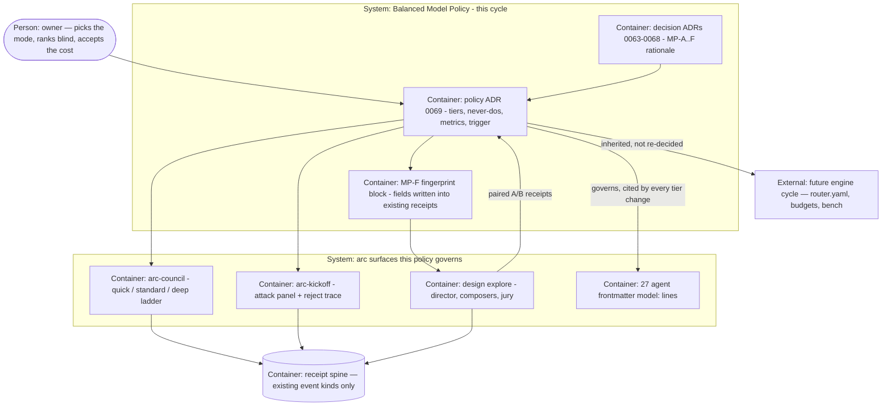

# PLAN.md — Balanced Model Policy (pre-engine model discipline)

> Lane: `model-policy` · Cycle 5. Design source:
> [`docs/strategy/plans/PLAN-model-policy.md`](../../docs/strategy/plans/PLAN-model-policy.md)
> (v2.1, FINAL — content frozen, decisions MP-A..F locked by the owner). This file is the
> lane's one live plan (ADR-0051); the design source is its approved input, not a second truth.

## Goal

One sentence: arc's model usage stops being taste-encoded-in-frontmatter — a written,
adopted Balanced Model Policy (which seat gets which tier, why, what would change it, and
the receipt discipline every future model decision must carry), plus the four cheapest
discipline fixes the audit surfaced (council middle tier with a fixed cost envelope,
calibration loop unblocked honestly, composer tier answered by a fair paired experiment,
attacker reject trace) — so that when the engine trigger fires, it implements a policy that
already exists instead of inventing one.

## Current state

*Verified against the tree 2026-08-02 at kickoff — every line below was re-checked
mechanically, not carried over from the design source. No `codebase-surveyor` run: the
design source already supplied a curated Current-state block, so the work was to **falsify
it**, which a grep does better than an agent summary. Two claims came back different from
the source (the `/arc-change` mirror; the font-pin's conditionality).*

**Stack:** markdown + zero-dep Node ESM (`.mjs`) + bash scripts. No app runtime, no
package build, no external services — arc's own tooling is the product surface here.
**Entry points:** `.claude/commands/arc-council.md` · `.claude/commands/arc-kickoff.md` ·
`.claude/scripts/council/{council-lint,council-calibrate}.mjs` ·
`.claude/scripts/design/design-render.sh` · `.claude/agents/*.md` frontmatter ·
`docs/adr/` (root namespace) · `docs/council/**/docs/adr/` (council namespace).
**Conventions:** one decision per ADR file, zero-padded, never edited once accepted —
superseded instead · new gates ship WARN-first with a `docs/trial-ledger.md` row and are
promoted only on evidence (A1) · council sessions are append-only · lane files are the
truth and `PORTFOLIO.md` is a derived view (ADR-0051).
**Do-not-touch:** `docs/evidence/**` and `docs/archive/**` are frozen (ADR-0058) · the
`quick` and `deep` council paths and the juror contract (ADR-0002, ADR-0015..0018) ·
`settings.local.json`'s personal model pin · the 3-variant explore tooling's shape ·
anything under a sleeping plan's scope (router, drivers, bench).

- **Model census (27 agents, all static frontmatter):** cheap-scan ×1 (`codebase-surveyor`,
  haiku) · workhorse ×22 (sonnet — including every creative and research seat:
  `ui-composer`, `design-jury`, `design-critic`, `researcher`, `council-researcher`,
  `plan-attacker`…) · high-judgment ×4 (`code-reviewer`, `council-verifier`,
  `design-director`, `security-auditor`, opus). Matches the design source exactly.
- **Cost is displayed, never enforced.** Statusline shows tokens/$/duration/effort; no
  budget stop and no escalation ladder at the LLM-call level (engine REQ-04/05, sleeping).
- **Council cost knob is all-or-nothing.** `.claude/commands/arc-council.md` implements
  `quick` (3 stances, no research, no verifier, writes nothing) and the full/deep panel.
  There is no middle tier — gap confirmed still open.
- **Calibration scoreboard is empty.** Session 001 carries a `PREDICTION → RESULT` line and
  the dated ADR-0010 correction, but **no `Review-by:` line**, which is the key
  `council-calibrate --overdue` matches on. Zero verdicts have ever been graded.
- **The composer seat is the untested lever.** ADR-0049 restored composer freedom, but
  `ui-composer` still runs workhorse while `design-director` (which judges it) runs
  high-judgment.
- **Attacker rejections vanish.** `.claude/commands/arc-kickoff.md:79` reads "reject → drop
  silently, no log". **`.claude/commands/arc-change.md` has no reject, attacker, panel or
  finding step at all** — the "mirror" REQ-05 presumes does not exist (assumption A-05).
- **Explore tooling is 3-variant-shaped** and lives one directory per brief under
  `docs/design/explore/`
  (`hq-dashboard-v1`, `lexos-case-workspace-v1`, `lexos-case-workspace-v2`), each holding a
  `matrix.md`. Any A/B must respect that shape or it is rewriting the tooling (a no-go).
- **Two REQ-03 mechanics confirmed live:** `design-render.sh` pins `font-family: Arial
  !important` **only when `PIN_FONT=1`**; the unpinned path exists and stamps the recipe
  `font-true;aa-on`. And `ui-composer` iron law 1 forbids reading `matrix.md`, so a shared
  assignment must reach composers via `thesis.txt`.
- **Citation hazard:** the council build keeps its **own** ADR namespace under
  `docs/council/`. "council-v2 ADR-0010" is
  `docs/council/kickoff-v2/docs/adr/0010-fix-session-001-in-place.md`; the root-namespace
  `docs/adr/0010-*.md` is "Quality Passport" and is unrelated.

## Success requirements

| REQ | User outcome | Measurable acceptance | Phase | Status |
|---|---|---|---|---|
| REQ-01 | Owner can point any session, agent, or future engine at ONE written model policy | `docs/adr/0069-balanced-model-policy.md` merged containing all seven blocks: **(a)** provider-neutral tier definitions — *cheap-scan · balanced-workhorse · high-judgment · independent-family-verifier* — with the claude mapping (haiku/sonnet/opus) recorded as "implementation v1", plus a seat→tier table matching the live 27-agent census with a one-line *why* per seat-class; **(b)** the never-do list (no auto-switching, no LLM-judge-as-sole-metric, no silent tier changes, same-model consensus ≠ independent truth, absent data is never estimated); **(c)** 5 metric definitions with formula + named data source (cost/accepted-output, retry rate, escalation rate, review escape rate, council Brier) — defined, not instrumented; **(d)** the engine trigger restated with each condition's check location (spend threshold per assumption A-04); **(e)** the MP-F fingerprint block (ADR-0068); **(f)** the MP-A emergency fallback clause; **(g)** the MP-A exploratory-trial freedom clause; non-negotiables cite Constitution A1/A2/A4/A6/A7/A9; `kickoff-lint` exits 0 | 0 | validated |
| REQ-02 | A council question needing verification but not a full panel costs a fixed, predictable middle price | `/arc-council standard "the question"` documented in `arc-council.md` and run once for real inside its envelope: **≤2 researchers + 3 stances + 1 verifier — max 6 seats, ≤7 model calls** (the existing send-back-once-if-nothing-contested guard is the only extra call); **no domain experts, no juror, no rebuttal round**; post-verifier `Contested`/`DISPUTED` IDs go straight to `## UNRESOLVED`, never debated; **no auto-upgrade** — an under-covered run says so and the human explicitly chooses `deep`; the saved session passes `council-lint --verdict` (any new lint check WARN-first) and carries a `Mode: standard` line; `deep` stays default (ADR-0002 untouched) | 1 | validated |
| REQ-03 | The composer-tier question is answered by a fair paired experiment, not a historic comparison | At one pinned commit, on the existing `lexos-case-workspace` brief, the director assigns 3 theses + art directions **once**; two explore runs then share them verbatim via `thesis.txt` — run-S (3 workhorse composers) and run-O (3 high-judgment composers) — same renderer recipe (`PIN_FONT=0`, recipe string `font-true;aa-on`, equality asserted before ranking), same reference screen. Owner pre-registers a one-line PREDICTION, then blind-ranks all **7 items** (6 pages + reference, shuffled labels) before any arm identity is revealed; jury ranks the same 7 blind. Each arm records its MP-F fingerprint + wall-clock duration + visible statusline cost (absent fields stay absent). Keep/revert decided in a one-page ADR by the fixed formula: **keep high-judgment only if the blind ordering shows a material, owner-visible quality gain AND the owner explicitly accepts the recorded cost/time delta** — "slightly better" alone reverts. Historic `lexos-case-workspace-v2` is context, never an arm | 2 | validated |
| REQ-04 | The council's honesty loop starts producing data without manufacturing any | Session 001 retrofitted by **appending** `Review-by:` + `Resolution:` per council-v2 **ADR-0012** (`docs/council/kickoff-v2/docs/adr/0012-outcome-lives-in-session-files.md` — a session may carry more than one `## OUTCOME`/`Review-by:`, last is authoritative). *Corrected 2026-08-02: MP-D originally cited council-v2 ADR-0010, which sanctions the `CONFIDENCE` High→Medium cap and was already executed 2026-07-15 — see ADR-0066's correction. This is an append, not the one-way in-place edit.* Every existing line preserved; `council-calibrate --overdue` then surfaces it (mechanism proven by its own output). Then the honesty fork: **if** the Resolution criterion is genuinely observable today → grade the real HIT/MISS via `/arc-council review`; **if not** → record `RESULT: UNRESOLVED` with a fresh future `Review-by:` and the cycle still passes. The DoD is the working mechanism plus an honest grade, never a filled scoreboard — a forced or vague HIT/MISS is a Truth-Law (E3) violation and fails this REQ | 1 | validated |
| REQ-05 | Rejected attacker findings leave a trace | `.claude/commands/arc-kickoff.md` step 5 changed from "reject → drop silently, no log" to one line per rejection — `REJECTED: {finding} — {reason}` — with reason drawn from the fixed taxonomy `duplicate · out-of-appetite · unsupported · violates-no-go · already-covered · non-actionable`; proven on the next kickoff by ≥1 recorded rejection; any lint that learns to look for it starts WARN-first. Scope is `arc-kickoff.md` only — the `/arc-change` mirror does not exist (assumption A-05) | 3 | validated |

## Appetite

**3 days hard cap.** **Tier:** S

This is a constraint, not an estimate. Blown appetite means cut scope or kill a phase —
never a silent extension (Constitution A9).

**Kill criteria:** at **1.25d**, if Phase 01 has not closed (REQ-02 envelope run + REQ-04
retrofit both proven), flag it on `PROGRESS.md` and re-forecast Phase 02's window
explicitly — Phase 02 owes a real 1.25d and, by this plan's own zero-slack arithmetic, has
nothing to absorb a Phase 01 slip with. At **1.5d (50%)**, if REQ-01 is not merged the
policy itself is contested → STOP, take the contested article to `/arc-council standard`,
bank nothing, retro. If the REQ-03 paired runs cannot both complete by **2.5d**, bank
whichever arm finished as evidence, drop the REQ to `BRIEF-composer-ab.md` with its partial
receipts attached — never extend. At 100% → cut or kill. (`PROGRESS.md` tracks the burn.)

## Architecture (C4 concepts, Mermaid flowchart)

## Key decisions (ADR index)

| # | Decision | Status |
|---|---|---|
| 0063 | MP-A — policy outranks implementation; exploratory-freedom + emergency-fallback carve-outs | accepted |
| 0064 | MP-B — seat-tier principle; creative seats earn their tier by receipted A/B | accepted |
| 0065 | MP-C — council mode ladder fixed at three; the human picks the word | accepted |
| 0066 | MP-D — session-001 retrofit executes council-v2 ADR-0010; no new sanction | accepted |
| 0067 | MP-E — attacker reject-log is a trace, not a process; fixed six-word taxonomy | accepted |
| 0068 | MP-F — model fingerprints are forward-only and never estimated | accepted |
| 0069 | Balanced Model Policy — tiers, never-dos, metrics, engine trigger | accepted |
| 0070 | REQ-03 verdict — composer seat stays balanced-workhorse (A-01 dead) | accepted |

## Non-negotiables

- **No engine code.** Nothing under `processes/`, no drivers, no `router.yaml`, no budget enforcement, no bench runner — those plans sleep until their own triggers (A8).
- **No auto model switching anywhere.** Every production tier change is a reviewed diff citing the Balanced Model Policy (ADR-0069; rationale MP-A/ADR-0063); the two MP-A carve-outs are the only exceptions and both are human-approved.
- The session-model pin stays personal (`settings.local.json`) — shared settings never gain a `model` key this cycle.
- Council remains additive-only; council ADR-0002 (deep default) and the council-v3 juror contract (ADR-0015..0018) untouched; `standard` never weakens `deep`.
- REQ-03 verdicts follow ADR-0047/0048/0049: blind ordering + owner's own eyes on the artifact; no absolute scores inside the loop; PREDICTION pre-registered before reveal.
- Fingerprints are forward-only and never estimated (MP-F / ADR-0068).
- Every phase close leaves its receipt on the spine (existing kinds only).

## No-gos (explicitly out of scope)

Router, drivers and bench (their own sleeping plans) · per-call cost enforcement ·
automatic complexity classifier or auto-escalation · external-juror expansion · changing
the design pipeline beyond the REQ-03 paired runs · rewriting the 3-variant explore
tooling · touching `terse` output style or hooks · new spine event kinds · re-tiering any
seat other than the REQ-03 experiment arm · building a fingerprint collector script.

Anything engine-shaped that surfaces mid-cycle becomes a queued note in
`docs/strategy/plans/PLAN-engine-process-layer.md`, routed via `/arc-change` — never code.

## Rabbit holes

- **Benchmarking temptation** → REQ-03 is one paired experiment with receipts, not a paper.
  Sample-size and multi-model sweeps belong to `BRIEF-bench.md`.
- **Metric instrumentation** → REQ-01 *defines* five metrics; wiring them is engine
  territory. Define, link, stop.
- **Mode-ladder debates** → one fixed `standard` envelope (MP-C); refinements are retro
  material, not this cycle's.
- **Fingerprint tooling** → MP-F is a discipline (fields in receipts humans and agents
  already write), not a collector. Building a collector is engine work.
- **Renderer archaeology** → Phase 2 sets `PIN_FONT=0` and asserts recipe equality. It does
  not re-litigate `design-render.sh`'s determinism design.

## Assumptions ledger

| Assumption | How we'd know it's wrong (trigger) | Phase that tests it |
|---|---|---|
| A-01 · The workhorse composer seat is a live quality bottleneck | REQ-03's blind ordering interleaves the arms (neither arm dominates) → assumption dead; workhorse stays and the ADR records it with the fingerprints | 2 |
| A-02 · A 2-researcher envelope covers a real slice of council use | 3 consecutive real `standard` runs each end in "recommend deep" → envelope wrong, revisit at retro (ADR-0065 trigger) | 1 |
| A-03 · Owner sustains ~30 min/week for calibration dogfood | 2 consecutive skipped weeks after REQ-04 lands → cadence unrealistic, shrink to fortnightly by ADR note | 3 |
| A-04 · No rupee spend threshold is needed in the policy — the two event triggers (public-prep start, provider event) are sufficient to fire the engine cycle, so REQ-01 block (d) ships naming them and stating plainly that no spend figure is set | Monthly AI spend becomes something the owner notices or complains about **before** either event trigger fires → the number was load-bearing after all and the policy gets an amendment carrying it | 0 |
| A-05 · `arc-kickoff.md` is the only surface where an attacker finding is rejected, so it is the only surface needing a trace — REQ-05's "`/arc-change` mirror" refers to a step that does not exist | `/arc-change` gains an attacker/panel step, **or** a real rejection happens in an `/arc-change` run and the owner wants it traced → REQ-05 was under-scoped and the mirror becomes a follow-up cycle's row | 3 |
| A-06 · A real kickoff will run soon enough after this cycle to exercise the REQ-05 reject line, so closing Phase 03 with it "implemented, unproven" is safe rather than permanent | **14 days** pass after this cycle closes with no `/arc-kickoff` of any lane having recorded a `REJECTED:` line → the proof is not coming on its own; REQ-05 gets re-validated deliberately or re-scoped, and the taxonomy's fitness is still untested | 3 |

## External dependencies

| Dep | Interface | Fake impl | Real impl | Contract test |
|---|---|---|---|---|
| *(none)* | All machinery is internal (council scripts, explore tooling, spine, agent frontmatter). The optional cross-model juror env stays optional and untouched this cycle. | n/a | n/a | n/a |

## Pre-mortem (Klein)

*It's later. The cycle shipped and failed.* Seeded from `docs/retro-log.md` first.

| # | Failure cause | Mitigation or accepted |
|---|---|---|
| 1 | **The policy becomes a poster.** Precedent: `arc-CONSTITUTION-draft.md` is still a draft; and retro 2026-08-02 (arc-portfolio) — ADR-0056's mandated "Mode B: not certified" board note was never written and stayed absent through two phases, found only by a section whose job was to delete it. A stated control is not a control until something asserts it exists | Adoption **is** Phase 0's exit, not a follow-up: ADR-0069 merged + spine receipt emitted, and the kill criteria names it at 1.5d. Phase 0's verification asks the retro's own question — "what asserts this is here?" — and answers it with `kickoff-lint` + the merged file, not with intent |
| 2 | **The paired A/B is still confounded.** Retro 2026-07-30 (arc-design-cycle3): a normalisation added for measurement destroyed the property being measured — `design-render.sh` pinned Arial for hash stability, so every variant was judged with its typography deleted, invisible for a whole cycle | ONE director assignment shared verbatim by both arms; same pinned commit; **`PIN_FONT=0` so the recipe is `font-true;aa-on`** and typography survives into the judgement; RECIPE-string equality asserted before any ranking. Any drift = re-run the arm, never "note it and continue" |
| 3 | **The shared assignment can't legitimately reach the composers.** Retro 2026-07-30 (arc-design-cycle3): a required input had no path to the agent that needed it — the director writes the content fixture into `matrix.md` and `ui-composer` iron law 1 forbids composers reading `matrix.md`, so three composers invented three different cases | Verified at kickoff: the legitimate channel is `thesis.txt`. Phase 2 puts the thesis **and the content fixture** in `thesis.txt` for both arms and checks byte-equality of the two arms' `thesis.txt` before either run starts. If content differs between arms, the comparison is void |
| 4 | **The retrofit is read as violating append-only, or graded under scoreboard pressure.** Sanction lives in a different ADR namespace than an executor will search | ADR-0066 pins the reading *and* the full cross-namespace path. REQ-04's honesty fork makes `UNRESOLVED` a **passing** outcome — Truth-Law E3 outranks a pretty scoreboard |
| 5 | **A new gate ships unattacked.** Retro 2026-08-02 (arc-portfolio): the mandated adversarial breaking-input pass was skipped on three gates in one phase by a process that has required it since 2026-07-16; the pass then found 61 issues, 5 live in shipped code. Retro 2026-07-16: markdown-contract parsing bugs recur (first-match on repeated sections, case-insensitive match then exact compare, `$` under `/m`) | Any lint touched this cycle (`council-lint --verdict` for `Mode: standard`, any REQ-05 reject-line check) gets its adversarial breaking-input pass **bound to the phase that ships it**, not to the cycle close — and ships WARN-first with a trial-ledger row |

## Phases (risk-ordered)

Phase 0 is the steel thread: the policy itself, merged. Nothing else in this cycle means
anything if the policy does not exist — every other REQ is a discipline the policy names.

| Phase | Capability | Appetite |
|---|---|---|
| 00 | **Steel thread — the policy itself.** ADR-0069 written with all seven blocks a–g, linted, merged; receipt emitted (REQ-01) | 0.5d |
| 01 | Council `standard` mode live inside its envelope + one real run; session-001 retrofit + honest grade-or-UNRESOLVED; overdue discovery proven (REQ-02, REQ-04) | 0.75d |
| 02 | Paired composer A/B: shared director assignment, run-S + run-O at one pinned commit, blind 7-item rankings, fingerprints + duration + visible cost, keep/revert ADR (REQ-03) | 1.25d |
| 03 | Attacker reject-log with fixed taxonomy (REQ-05) + one dogfood pass over the mode ladder + retro; trial-ledger rows for anything WARN-first | 0.5d |

**Total: 3.0 of 3.0 days.** There is no slack — the kill criteria at 1.5d and 2.5d are the
release valves, not overtime.

**North-star:** when the engine trigger eventually fires, its kickoff copies its routing
table, escalation defaults AND receipt schema **from** ADR-0069 instead of deciding them —
measured by the engine kickoff needing zero new "which model where" forks.
