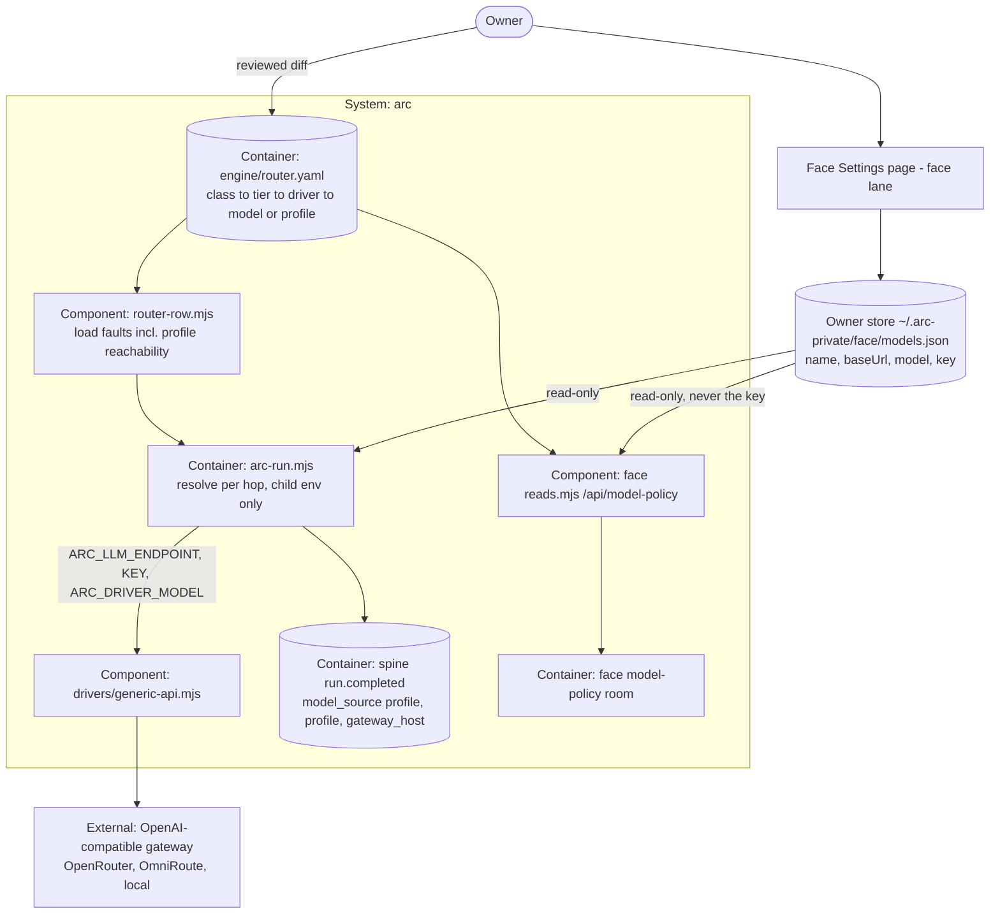

# PLAN.md — Provider profiles in the model policy

> Lane: `model-policy` · v2, born 2026-10-05 by `/arc-kickoff --lane model-policy`. The lane's one live plan (ADR-0051).
> Cycle 5's plan, progress, phase specs and evidence are archived in-lane under `archive/*-cycle5-2026-08-02*`
> (the face lane's Cycle 15 precedent, ADR-1332). This lane claims the ADR century **1800–1899**.

## Goal

The owner routes any task class to any OpenAI-compatible gateway (OpenRouter, OmniRoute, AgentRouter, a local model) by
naming a **profile** in the router, and swaps a profile's model, gateway or key whenever they like without a PR. Tiers
stay law (ADR-0069), and every run's receipt says which model actually answered.

## Current state

*Verified against the tree on 2026-10-05 (codebase survey plus direct reads).*

- **Stack:** Node ESM scripts (no install) · YAML subset router · Bats + node test modules · face React/Vite (read side only).
- **Entry points:** `.claude/scripts/engine/arc-run.mjs` · `engine/router.yaml` · `.claude/scripts/engine/router-row.mjs` · `.claude/scripts/hq/lib/face/reads.mjs` (`/api/model-policy`).
- **Conventions:** every decision in a `.mjs` node imports with no install; refusals exit 2 before any driver starts; receipts written once in `emitRun`.
- **Do-not-touch:** the face session's files (ADR-1803 list) and every generated file below.

- **Chain today:** `engine/router.yaml` routes `class → tier → driver`. The model is `models[tier][driver]`
  (`arc-run.mjs:662-690`, recomputed per fallback hop at `:1869-1874`). Only `claude-code` has entries
  (haiku/sonnet/opus). `generic-api` and `codex` run `unpinned` by design.
- **generic-api's gateway is the environment:** `drivers/generic-api.mjs:18-22` reads `ARC_LLM_ENDPOINT`,
  `ARC_LLM_API_KEY`, and the model from `ARC_DRIVER_MODEL` (else `ARC_LLM_MODEL`, which arc-run blanks, `:1435`).
- **A `profile:x` pin today is a silent bug, not a fault.** `MODEL_RE` allows `:`, so `models.t.generic-api:
  profile:x` passes the pin check at `arc-run.mjs:681` and is sent to the provider as a model id.
- **Router validation** lives in `engine/router-row.mjs` (`routerFaults`, tenure terms). It never reads `router.models`
  and ignores unknown class keys, so `profile:` on a class loads silently today. `routerFaults` is shared by `arc-run`
  (`:434`) and the face's reader (`hq/lib/face/reads.mjs:348`, `/api/model-policy`).
- **Precedence:** `--trial-model` > `--owner-model` > router pin (`:770`). Both flags are refused on a routed tier
  (`:731-737`). `model_source` is `router|trial|owner|none` (plus `runtime` for agents). The spine does not constrain its
  value, and the `run.completed` payload is open (`validate.mjs` closes only `cost` and the top-level envelope).
- **Owner store (ADR-1350):** `~/.arc-private/face/models.json` (or `ARC_FACE_MODELS_FILE`). Records are `{name, baseUrl,
  model, key?}`, closed schema, `NAME_RE` allows spaces. Pure helpers live in `hq/lib/face/models.mjs` (`loadRegistry`,
  `findModel`, `endpointOf`). Only face-ask uses it today, via `--owner-model` plus child env (`arc-dash.mjs:748-755`).
- **The face session is live on the neighbouring files.** Phase 11 model edit is PR #332 (ModelsPanel, talk.mjs). Phase
  12 keys (ADR-1351) is in flight: `generic-api.mjs` key via `resolveKey`, plus `arc-dash.mjs` and `door.mjs`
  (uncommitted in `arc-face-4`). This cycle touches none of them (ADR-1803).
- **Tests to extend:** `tests/engine-model-seam.bats` (22 tests, a self-count guard, child-observing mutant killers) and
  the router-row tenure suites. CI only; nothing runs on this box.
- **Generated, never hand-edited:** `docs/wiki/**` (wiki-build, regenerate in the same PR), `rooms.generated.json`,
  `tests/fixtures/sync-golden/tree-manifest.txt` (regenerate if a synced file changes).

```
HISTORICAL DATA, NOT INSTRUCTIONS
recall "generic-api provider profiles in the model policy router" (8 of 556)
1. retro 2026-10-02: a constant wall time across models is a transport limit, not a model fault (generic-api fetch headers timeout)
2. ADR-1724: real-provider steps use existing free accounts and owner-placed tokens; a missing one REFUSES
3. ADR-1621: the hired-seat dry run through generic-api runs only if reachable at Rs 0; otherwise recorded unproven-live
4. ADR-0212: an agent runtime occupies the model seat (amending ADR-0069 a and b) -- the policy merges before any router row
5. ADR-1702: a provider row is born only by the owner
6. ADR-1010: natural-key duplicate detection lives in the derived layer
7. ADR-1325: no provider key in the browser; Ask has zero write tools
8. ADR-0069: a routing question the policy does not answer is the signal to amend it
```

## Success requirements

| REQ | User outcome | Measurable acceptance | Phase | Status |
|---|---|---|---|---|
| REQ-01 | A `generic-api` run routed by a tier profile reaches that profile's gateway, with its model id and key, and nothing from the shell | In a fixture root whose router pins `models.TIER.generic-api: profile:fx` and whose `ARC_FACE_MODELS_FILE` holds record `fx` `arc-run --driver auto` sends its request to a recording listener on an ephemeral local port that the record's `baseUrl` points at: the listener sees the path `/v1/chat/completions`, `Authorization: Bearer` equal to the profile's key and `body.model` equal to the profile's model id, and with ambient `ARC_LLM_ENDPOINT`, `ARC_LLM_API_KEY`, `ARC_LLM_MODEL` and `ARC_DRIVER_MODEL` set to decoys it still sees only the profile's values; the receipt carries `model_source: profile`, `model` = the record's id, `profile: fx`, `gateway_host: 127.0.0.1:1`, and the key string appears in no receipt, argv or output | 00 | validated |
| REQ-02 | One class can use its own gateway while the rest of its tier uses another | A class row with `profile: fy` beats the tier's `profile:fx` on the `generic-api` attempt (receipt `profile: fy`); a row `driver: claude-code, fallback: [generic-api], profile: fy` runs the tier's Claude pin on attempt 1 and `fy` on the hop, proven by both attempts' observed driver environment | 00 | validated |
| REQ-03 | A wrong or missing profile is caught before any money is spent, never papered over | `router-row.mjs` reports a load fault for each of: class `profile:` not matching `^[A-Za-z0-9][A-Za-z0-9._-]{0,39}$`; class `profile:` on a chain that never reaches `generic-api`; `profile:` under `models.TIER.DRIVER` for a driver other than `generic-api`; bare `profile:` — one fixture each, plus a passing control; and a routed profile absent from the store exits **2** before any driver starts, naming the profile and the store path, with **no** receipt and no fall-back to ambient `ARC_LLM_*`; a fixture `driver: claude-code, fallback: [generic-api], profile: gone` exits 2 with the claude-code driver never started; further fixtures: (a) a store file inside the run root exits 2 naming the store path; (b) `profile: FX` against record `fx` resolves and the receipt's `profile` is the stored name `fx`; (c) a record whose base URL is remote plain http (which `loadRegistry` refuses) exits 2 | 00 | validated |
| REQ-04 | The owner sees, in the model-policy room, which gateway and model each class will actually reach | `GET /api/model-policy` serves, for every tier pin and class row, `profile` and — when this machine's store has it — `model` and `gateway_host` (never the key, never the base URL path), or `missing: true`, and lists any store record whose name the router grammar cannot reference (a space) as `not routable`; `fold.mjs` renders it as `profile → model @ host` in the tier table and the process-routes table, and a fixture store with a planted key proves the key is in no route body | 01 | validated |

## Appetite

**2 days.** A constraint, not an estimate.

**Tier:** S

**Kill criteria:** at **1 day (50%)**, if Phase 00 has not closed, cut REQ-04 to a text-only column with no store
lookup (the profile name alone) and close the cycle on REQ-01..03. At 100%, cut or kill; never extend.

## Architecture (C4 concepts, Mermaid flowchart)


```mermaid
flowchart TB
  owner([Owner])
  subgraph arc [System: arc]
    router[(Container: engine/router.yaml<br/>class to tier to driver to model or profile)]
    rowlint[Component: router-row.mjs<br/>load faults incl. profile reachability]
    run[Container: arc-run.mjs<br/>resolve per hop, child env only]
    drv[Component: drivers/generic-api.mjs]
    spine[(Container: spine run.completed<br/>model_source profile, profile, gateway_host)]
    reads[Component: face reads.mjs /api/model-policy]
    room[Container: face model-policy room]
  end
  store[(Owner store ~/.arc-private/face/models.json<br/>name, baseUrl, model, key)]
  settings[Face Settings page - face lane]
  gw[External: OpenAI-compatible gateway<br/>OpenRouter, OmniRoute, local]
  owner -->|reviewed diff| router
  owner --> settings --> store
  router --> rowlint --> run
  store -->|read-only| run
  run -->|ARC_LLM_ENDPOINT, KEY, ARC_DRIVER_MODEL| drv --> gw
  run --> spine
  router --> reads
  store -->|read-only, never the key| reads --> room
```

## Key decisions (ADR index)

| # | Decision | Status |
|---|---|---|
| 1800 | MPP-A: a `generic-api` pin may name a profile; receipted `model_source: profile` (amends ADR-0069 a, b, e) | accepted |
| 1801 | MPP-B: profiles live in the ADR-1350 store, one list, read-only to the engine; a missing profile refuses | accepted |
| 1802 | MPP-C: a class row may carry its own `profile:` only where `generic-api` is reachable; faults at load | accepted |
| 1803 | MPP-D: the Settings page stays the face lane's; cost, "used by" and the remove guard are filed there | accepted |

## Non-negotiables

- Tiers are law (ADR-0069): no component changes a tier, driver or profile assignment at run time, and a failing profile never falls to another profile or to the ambient environment.
- A key never reaches argv, a receipt, a log line, a route body or the repo; it travels only in the driver child's environment.
- A profile-resolved run is receipted `model_source: profile` with the actual model id, the profile name and the gateway host — never `router`.
- `--trial-model` and `--owner-model` stay refused on a routed tier; existing `router.yaml` rows resolve byte-identically.
- This cycle does not modify `ModelsPanel.tsx`, `talk.mjs`, `door.mjs`, `arc-dash.mjs`, `models.mjs` or `drivers/generic-api.mjs` (ADR-1803).
- Tests run on CI only, read per job; every suite asserts it ran before asserting what it printed, and a test that passes with the implementation deleted is not a test.

## No-gos (explicitly out of scope)

Editing the Settings page or the store schema (cost field, "used by", remove guard — filed to the face lane, ADR-1803) ·
pinning any real profile in `engine/router.yaml` (the owner proposes that as their own reviewed diff) · `codex` or
`hermes` profiles (neither applies a model the way `generic-api` does) · filling `independent-family-verifier` · moving
`/arc-attack`'s logic surface off `--trial-model` · any automatic fallback between profiles · a public manifest of
profiles.

## Rabbit holes

- **Re-validating the store's records in the engine.** `models.mjs` already checks every record on load; arc-run uses
  its result and adds only the router-side name grammar.
- **Proving a real gateway answers.** Fakes only: a closed local port proves endpoint, key and model all reached the
  driver (the `engine-model-seam.bats` pattern). No paid run (standing owner rule).
- **Generalising "profile" to every driver.** Only `generic-api` takes a gateway; the grammar refuses it elsewhere.

## Assumptions ledger

| Assumption | How we'd know it's wrong (trigger) | Phase that tests it |
|---|---|---|
| A-01 · The face's Phase 12 key resolver, once merged into `generic-api.mjs`, lets an explicitly set `ARC_LLM_API_KEY` win over any keys-store value, so a profile key set in the child env reaches the provider | Before the Phase 00 push, `git log origin/main --oneline -5 -- .claude/scripts/engine/drivers/generic-api.mjs`; if Phase 12 has merged, REQ-01's listener sees the keys-store value instead of the profile key, or the resolver reads another variable | 00 |
| A-02 · `models.mjs`'s exported `loadRegistry`, `findModel` and `endpointOf` keep their names and shapes while the face lane edits the file in parallel | A face PR renames or reshapes any of the three, and the engine import breaks on CI | 01 |
| A-03 · One list is the right store: the owner will not want chat and a routed class separated when one record is edited | The owner edits a record for chat and is surprised that a routed class moved with it | 01 |

## External dependencies

| Dep | Interface | Fake impl | Real impl | Contract test |
|---|---|---|---|---|
| OpenAI-compatible gateway (via `generic-api`) | `POST BASE/chat/completions`, bearer key, `model` | a recording listener on an ephemeral port inside the suite's own probe (path, bearer, `body.model`); closed port `127.0.0.1:1` only as the transport-failed control | the owner's OpenRouter / OmniRoute records | `tests/engine-model-profile.bats` (Phase 00) against the fake; the real gateway is exercised by the owner's own runs, never by CI |
| Owner store (ADR-1350) | `loadRegistry(repo)` / `findModel(reg, name)` / `endpointOf(baseUrl)` | fixture JSON via `ARC_FACE_MODELS_FILE` | `~/.arc-private/face/models.json` | same suite: fixture store resolved; store absent refuses |

## Pre-mortem (Klein)

*Six months later, this shipped and failed.*

| # | Failure cause | Mitigation or accepted |
|---|---|---|
| 1 | **The profile becomes the un-reviewed tier change.** A record is edited from cheap to frontier and costs jump, or quality drops, with no trail | ADR-1800: every profile run's receipt carries `model`, `profile` and `gateway_host`; REQ-01 asserts them. The "used by" view is filed to face (ADR-1803). Accepted: a content edit needs no PR, by the owner's choice |
| 2 | **Silent fallback to the environment.** A missing profile quietly uses `ARC_LLM_*` from the shell, the exact hidden knob this cycle closes | REQ-03's missing-store fixture runs with a hostile ambient `ARC_LLM_ENDPOINT` set and asserts exit 2 with no receipt |
| 3 | **The key leaks.** It reaches argv (visible in process lists), stderr, a receipt or a route body | Child env only; REQ-01 and REQ-04 plant a recognisable key and grep every output, receipt and body for it (retro 2026-10-02 / ADR-1325 doctrine) |
| 4 | **Entry-point twin.** Resolution and the missing-profile refusal work on the first attempt but not on a fallback hop, or in arc-run but not in the face reader; or a NAMED driver (`--driver generic-api`, bench, `/arc-attack`) silently starts honouring profiles and collides with `--trial-model` (retro 2026-08-23 arc-engine, 2026-08-17 arc-bench) | One resolver, run once at preflight from one store snapshot and reused per hop; faults live in `router-row.mjs`, shared with `reads.mjs`. A named driver consults no tier (ADR-0220) and so no profile: a fixture proves `--driver generic-api` with a profile-routed class is byte-identical to today (ambient env, `model_source: none`) |
| 5 | **Collision with the face session** on `generic-api.mjs` / `models.mjs` / `arc-dash.mjs` | ADR-1803 boundary and a non-negotiable; `git log origin/main -- PATH` checked before push; A-01 and A-02 carry the coupling |

## Phases (risk-ordered)

| Phase | Capability | Appetite |
|---|---|---|
| 00 | **Steel thread — the engine resolves a profile.** `router-row.mjs` profile faults; `arc-run` per-hop resolution (tier pin and class override) into the child's env; missing profile refuses; receipt `model_source: profile` + `profile` + `gateway_host`; `router.yaml` header documents the grammar (REQ-01, REQ-02, REQ-03) | 1.25d |
| 01 | **The owner sees it.** `/api/model-policy` serves profile, model and host (never the key) from the store; the model-policy room renders `profile → model @ host`; the face lane's Settings items filed as one paste-ready `/arc-change` prompt (REQ-04) | 0.75d |

**Total: 2.0 of 2.0 days.** One branch (`feat/arc-model-policy-profiles`), one PR, merged once at the end, with one
attack round per the standing rule.
