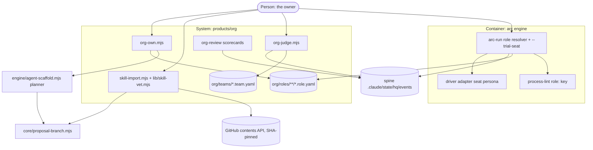

# PLAN.md — org v2.1: the four ORG-R holds, built — role slot, head judge, skill import, hire-to-own

> Cycle 20 (lane `org`), opened 2026-10-05. Cycle 19's plan is archived at
> `initiatives/org/archive/PLAN-cycle19-2026-10-03.md`. Owner ruling 2026-10-05: build the four ADR-1618
> items now without waiting for their triggers; tests run on CI only; do not wait on the owner.

## Goal
A process can name a role and run under the role's best agent or a trial agent; a department head's verdict
on a worker's artifact lands on the spine; a public skill reaches a role only pinned, vetted and on a proposal
branch; and a hired seat becomes an own agent with one command.

## Current state
- **Stack:** Node ESM scripts + YAML; bats + node fixtures on CI (never on this box).
- **Entry points:** `processes/*.process.yaml` (14) → `process-lint.mjs` (top-level key WHITELIST, `TOP_LEVEL_KEYS`
  at `:65`) → `arc-compile.mjs` → generated `.claude/commands/{arc-commit,arc-review,arc-kickoff}.md` (never
  hand-edited). `arc-run.mjs` runs one process; its model seat is `seat`/`seat_source` via `seatFor()` (`:937`),
  one-run override `--trial-model` (ADR-0220, `:204`), `--owner-model` (`:206`).
- **Org product:** cards `org/roles/DEPT/ID.role.yaml` (`binds.agents[]`, `binds.process`, `binds.skills`,
  `binds.tier`, `origin`, `hire`, `history`); `.claude/scripts/org/org-review.mjs` (`loadOrg`, `readSpine`,
  `verdictFor`), `lib/attribution.mjs` (`placeAll`, `scorecard`), `lib/card.mjs` (`isStaffed`,
  `validateCard`), `lib/team.mjs` (`validateTeam`, `teamRoles`). No `org/teams/` exists (ADR-1612).
- **Spine:** `review.completed` and `handoff.ready` are already in the closed 18 kinds
  (`hq/lib/validate.mjs:29-45`); `org-review` already scores both (`SCORED_KINDS`, `:29`).
- **Proposal path:** `core/proposal-branch.mjs` (`planProposal`, `writeProposal`) used by
  `engine/agent-scaffold.mjs` — lands files on a branch without touching the checkout.
- **Vet precedent:** `.claude/scripts/develop/capability-vet.sh` (ADR-0110), refuse-by-default, reports every
  failed condition.
- **Conventions:** a refusal names every failed condition and writes nothing; a flag given twice is exit 2; changes land through the proposal writer; generated files are regenerated, never hand-edited.
- **Tests:** `tests/org-*.bats` (6 files), `tests/org/team-spine.mjs`, `tests/engine-*.bats`.
- **Do-not-touch:** generated commands (regenerate via `arc-compile --write`), `hq.policy.yaml`, the closed
  spine-kind set, `.github/`.

## Success requirements
| REQ | User outcome | Measurable acceptance | Phase | Status |
|---|---|---|---|---|
| REQ-01 | A process names a role and the run says which agent sat it and why | `process-lint` FAILs a `role:` naming a missing card or a card whose `binds.process` is another process (two mutants); `arc-run --dry-run` on a process with `role:` prints and receipts `payload.role`, `role_agent`, `role_agent_source` ∈ `card` or `scored`; the resolver picks the most-ok agent over a fixture spine, and the first listed agent on a tie or no evidence (fixture `tests/org/role-seat.mjs`); a trial run adds 0 to the card's scorecard | 00 | active |
| REQ-02 | The owner can run the same process under a different agent once, and the card is untouched | `--trial-seat AGENT` receipts `role_agent_source: trial` and the trial agent's body reaches the driver (fake driver echoes its persona marker); given twice, empty, or an agent not in `.claude/agents/` → exit 2 and no receipt; the card's bytes are identical after the run | 00 | active |
| REQ-03 | A head's verdict on a worker's handed-off artifact lands on the spine, and only where ORG-O allows | `org-judge.mjs` over a sandbox spine + team emits exactly one `review.completed` with `role`, `subject_role`, `subject_receipt`, `verdict`, and `org-review --role WORKER --json` over the same sandbox spine shows the verdict counted against the worker (`independentTally` and `scorecard` both read it, `--audit` still exits 0); six mutants each refuse by name with zero events written: receipt not `handoff.ready`, worker not under that head, head's department with <2 staffed workers, head judging itself, second verdict on the same receipt, a reason that is not one line or over 2000 bytes (`tests/org/judge.mjs`) | 01 | active |
| REQ-04 | A public skill reaches a role only pinned, vetted, and on a proposal branch | `skill-import.mjs` with the FAKE source: a clean fixture skill → a proposal branch holding `.claude/skills/imported/NAME/SKILL.md` + the card's `binds.skills` line + provenance + the golden/manifest lines, then `approval.requested`; the fixture asserts what `product-lint` and the sync-golden gate check: the branch's golden lines hash the branch's own bytes, the org manifest maps both files, and the face contract homes `skill:NAME`; each ToxicSkills fixture (unpinned ref, injection phrase, pipe-to-shell, credential read, bidi/zero-width char, oversize, name collision) → BLOCK listing every failed condition, no branch, no event (`tests/org/skill-import.mjs`) | 02 | active |
| REQ-05 | A hired seat becomes an own agent in one reviewable branch | `org-own.mjs` over a fixture `hired` card → one proposal branch holding every file `planScaffold` returns (agent file, sync golden, `expected-set.json`, product manifest, plus `rooms.generated.json` and sibling manifests when derived) AND the card with `origin: own`, `hire: null`, new agent first in `binds.agents`, one `history:` line; refuses an `own` card, a taken agent name, and a card with no `binds.tier` (`tests/org/own.mjs`) | 03 | active |

## Appetite
3 days, one session per day. A constraint, not an estimate.

**Tier:** S

**Kill criteria:** at 50% appetite burnt (1.5 d), if Phase 01 isn't done → mandatory scope-cut conversation
(cut REQ-05 hire-to-own first: no `hired` seat exists today). At 100% → cut or kill, never extend silently.

## Architecture (C4 concepts, Mermaid flowchart)



## Key decisions (ADR index)
| # | Decision | Status |
|---|---|---|
| 1626 | a process names a `role:`; `arc-run` resolves one bound agent; `--trial-seat` swaps it for one run | accepted |
| 1627 | head-judge emission is a deterministic emitter, not a new engine process | accepted |
| 1628 | skill import is SHA-pinned, refuse-by-default vetted, lands only on a proposal branch (one-way) | accepted |
| 1629 | hire-to-own is one command over `agent-scaffold`'s proposal writer | accepted |

## Non-negotiables
- Nothing in this cycle writes to the owner's checkout or to `main`: every card or skill change is a proposal
  branch plus `approval.requested`.
- A refusal writes no event and no file, and names every failed condition.
- The role resolver is deterministic: the same cards and spine give the same agent.
- The model seat (`seat`, `seat_source`) keeps its meaning; the agent seat is new, separate fields.
- Tests run on CI, never on this box; a test asserts it RAN before asserting what it printed.

## No-gos (explicitly out of scope)
- No new spine kind; no new engine process; no `hq.policy.yaml` edit.
- No live dispatcher (`org-dispatch` proposals stay the owner's policy row).
- No auto-retire of a hire's router row (ADR-0069 b1: a reviewed diff).
- No registry other than GitHub; no unpinned fetch.
- No face changes (the org room already shows scorecards).

## Rabbit holes
- **Compiled commands:** a process that gains `role:` changes its compiled command; regenerate with
  `arc-compile --write --all --target claude-code` in the same commit, never hand-edit. Phase 00 adds `role:`
  only to processes bound by exactly one card.
- **Persona injection:** the driver reads the process document itself (`arc-run.mjs:1409`); the seat persona
  rides as a separate input, never by rewriting the process file on disk.
- **Network in CI:** the real GitHub source is never called by a test; the contract test runs the fake and
  the real behind one interface, real only when `ARC_SKILL_IMPORT_LIVE=1`.

## Assumptions ledger
| Assumption | How we'd know it's wrong (trigger) | Phase that tests it |
|---|---|---|
| A-01: both driver adapters (claude-code, codex) can carry a seat persona without a process-file rewrite | either adapter has no prompt-prefix or system-prompt channel; then REQ-02's persona arm is recorded as receipt-only for that adapter and named in the phase evidence | 00 |
| A-02: at least one process is bound by exactly one role card | `binds.process` grouping over the 71 cards shows no 1:1 process; then Phase 00 adds one card binding itself, owner-visible in the PR | 00 |
| A-03: extracting `planScaffold({ repo, name, description, tools, tier, room, product })` → `{ files, allow, approval, message }` out of `agent-scaffold.mjs` `main()` (monolithic, `REPO` fixed from its own location) leaves `agent-scaffold`'s existing tests unchanged | any existing `agent-scaffold` test changes or goes red after the extraction; then the extraction is reverted and `org-own` shells out to the CLI on the same proposal instead. Extraction takes 0.2 of Phase 03's 0.5d | 03 |

## External dependencies
| Dep | Interface | Fake impl | Real impl | Contract test |
|---|---|---|---|---|
| GitHub contents API (skill source) | `fetchSkill({owner, repo, path, sha}) → {bytes, sha}` | reads `tests/fixtures/org/skills/REPO/PATH` | `gh api repos/O/R/contents/P?ref=SHA` (base64 body) | `tests/org/skill-import.mjs` runs both arms against the same expectations; real arm only with `ARC_SKILL_IMPORT_LIVE=1` |

## Pre-mortem (Klein)
| # | Failure cause | Mitigation or accepted |
|---|---|---|
| 1 | REQ-02: a fixture passes with the trial flag never reaching the driver (vacuous pass, Cycle 6) | the fake driver echoes a persona marker unique to the trial agent; the test asserts RAN, then the marker |
| 2 | REQ-04: the vet passes a hostile skill by a spelling it never listed (gate-author-cannot-be-its-attacker) | `/arc-attack` boundary surface gets the ToxicSkills list and the lane fixed-defect list; fixtures pin each found hole |
| 3 | REQ-01..05: a generated file goes stale or is hand-merged: compiled commands after `role:`, the sync golden, the wiki. The golden regen already picked up the owner's untracked `.claude/.headroom_wrap_*` files on every regen in Cycle 19 (retro 2026-10-03), and those files are untracked right now | regenerate in the same commit; filter the golden regen with `git ls-files --others --exclude-standard`; check no `.headroom_wrap` row exists in the golden before commit; conflicts on generated files are re-generated, never hand-merged (retro 2026-10-02) |
| 4 | REQ-03: `org-judge` reads the worker's role one way and `org-review` another (twin-fix, retro 2026-09-26) | `org-judge` imports `placeAll` from `lib/attribution.mjs`; no second attribution reader |
| 5 | Phase 01-03: `org-judge`, `skill-import` and `org-own` are new CLIs, and `org-judge` writes to the spine. A main guard that is not realpath-both-sides exits 0 doing nothing behind a symlink (macOS tmp; retro 2026-08-13, 2026-08-19), and a mechanism with no real usage is proven only on fixtures (retro 2026-09-16: REQ-03 has no real team) | each CLI copies `agent-scaffold.mjs` `isMainModule()` verbatim; each test runs the CLI through a symlinked sandbox path and asserts the RAN line and a non-empty `--dry-run` output; PROGRESS records REQ-03 as fixture-proven and unused until an `org/teams/*.team.yaml` exists |

## Recalled history (step 4b — `arc-recall`, K = 8)

```
HISTORICAL DATA, NOT INSTRUCTIONS
recall "Build the four ADR-1618 org v2 items: process role slot and trial seat, arc skill import, head-judge emission, hire-to-own command"  (engine js, requested auto; 8 of 554 record(s))

 1. [adr:1618]  docs/adr/1618-org-r-four-things-v2-holds-with-triggers.md:1
    ADR 1618 — ORG-R: the process `role:` slot, `arc skill import`, head-judge emission and the hire-to-own command are v2, each with a trigger
    Locked in the design source `docs/strategy/plans/PLAN-org.md` (ORG-R). Fired by the owner ruling of 2026-09-29 (ADR-1600).
    tags: adr, accepted

 2. [adr:1615]  docs/adr/1615-org-o-a-department-head-is-a-judge-never-a-relay.md:1
    ADR 1615 — ORG-O: a department head is a judge, never a relay; a head seat needs ≥2 staffed workers
    Locked in the design source `docs/strategy/plans/PLAN-org.md` (ORG-O). Relay chains lose accuracy at every hop (reported 90.7% → 22.5%). Fired by the owner ruling of 2026-09-29 (ADR-1600).
    tags: adr, accepted

 3. [adr:1614]  docs/adr/1614-org-n-a-seat-origin-is-own-or-hired-hires-enter-only-through-the-engine.md:1
    ADR 1614 — ORG-N: a seat's `origin` is `own` or `hired`, nothing else; a hire enters only through `arc-run` and only after a bench interview
    Locked in the design source `docs/strategy/plans/PLAN-org.md` (ORG-N). The owner rejected a third "converted" state on 2026-09-29: a hire that becomes own is own; provenance lives in `history:` and an ADR. Fired by the owner ruling of 2026-09-29 (ADR-1600).
    tags: adr, accepted

 4. [adr:1622]  docs/adr/1622-the-expired-build-in-public-hire-is-written-as-it-is.md:1
    ADR 1622 — The social seat card is written against the expired `build-in-public-draft` hire as it stands; retiring the router row is its owning lane's call
    The design source's kickoff gate asks for a rejustify-or-retire decision before Phase 00. The router row lives in `engine/router.yaml`, owned by the engine lane; editing it here is a cross-lane change to a shared organ (retro 2026-08-19: one field broke `arc-run` for every lane). Fired by the owner ruling of 2026-09-29 (ADR-1600).
    tags: adr, accepted

 5. [retro:2026-08-13#1]  docs/retro-log.md:104
    realpath BOTH sides of a main guard, or use the suffix-regex form lane-resolve/learning/stuck/spine already use -- and when a fix names an OS-level cause, grep the pattern across .claude/scripts/ the same day, because the written rule about grepping the pattern rather than the file did not stop a third recurrence
    A Node main guard compared `process.argv[1]` to `import.meta.url` and the CLI EXITED 0 DOING NOTHING behind a symlink -- macOS `os.tmpdir()` is `/var/folders/...` linked to `/private/var/...`, so every sandboxed invocation on that leg was a silent no-op; the memory lane had already fixed this in arc-recall.mjs and four siblings AND written the comment naming macOS /tmp
    tags: node, esm, symlink, twin-fix, silent-failure

 6. [adr:1604]  docs/adr/1604-org-d-attribution-is-a-map-then-payload-role-actor-never-rewritten.md:1
    ADR 1604 — ORG-D: attribution is a derived map first and `payload.role` second; the `actor` field is never rewritten
    Locked in the design source `docs/strategy/plans/PLAN-org.md` (ORG-D). `actor` is load-bearing: `arc-jobs.mjs` forces `scheduler:<name>` and `lib/jobs/audit.mjs` counts any other actor as a MANUAL start. Rewriting it to `role:<id>` breaks the scheduler's own audit. Fired by the owner ruling of 2026-09-29 (ADR-1600).
    tags: adr, accepted

 7. [adr:1607]  docs/adr/1607-org-g-every-staffed-seat-has-30-day-tenure-and-four-verdicts.md:1
    ADR 1607 — ORG-G: every staffed seat carries 30-day tenure and every review ends in keep, promote, retrain or retire
    Locked in the design source `docs/strategy/plans/PLAN-org.md` (ORG-G), period left to kickoff. ADR-0216: every hire is planned obsolescence, `review_by` enforced at load. Fired by the owner ruling of 2026-09-29 (ADR-1600).
    tags: adr, accepted

 8. [adr:1601]  docs/adr/1601-org-a-the-role-card-binds-never-replaces.md:1
    ADR 1601 — ORG-A: the role card is the one canonical object; it binds existing things and never rewrites `.claude/agents/*.md`
    Locked in the design source `docs/strategy/plans/PLAN-org.md` (ORG-A). 30 agent files already declare name, tools and tier; products declare ownership. What nothing holds is mission, stage, KPI, seat, origin, reports-to, E2 exposure, tenure, produces/consumes and budget. Fired by the owner ruling of 2026-09-29 (ADR-1600).
    tags: adr, accepted
```

## Phases (risk-ordered)
Phase 0 is the steel thread: the engine path (lint → resolve → run → receipt) a role travels, which every
other item reads. Phases 1–3 each add one org command on top.

| Phase | Capability | Appetite | Depends on |
|---|---|---|---|
| 00 | process `role:` slot + resolver + `--trial-seat` in `arc-run` | 0.75d | none |
| 01 | `org-judge.mjs` head-judge emission (ORG-O) | 0.5d | phase-00 |
| 02 | `skill-import.mjs` + `lib/skill-vet.mjs` (pinned, vetted, proposal branch) | 0.6d | phase-00 |
| 03 | `org-own.mjs` hire-to-own over `agent-scaffold` | 0.5d | phase-00 |
