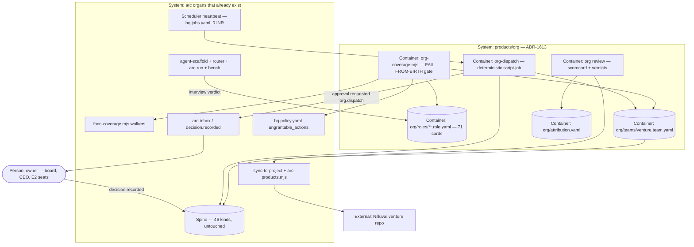

# PLAN.md — org v1: arc's company layer — every role a card, every venture a staffed team

> Kickoff 2026-09-29 · lane `org` · ADR century **1600–1699** (ADR-1600) · design source
> `docs/strategy/plans/PLAN-org.md` v1.1 (landed PR #301, owner-reviewed twice; ORG-A…L and ORG-N…R
> locked there, **ORG-M decided here as ADR-1613**). Fired by the owner's ruling of **2026-09-29**, which
> is **not yet on the spine** — recording it as a `decision.recorded` is Phase 00's first act (ADR-1600).
> Attack findings mutate THIS file, never the design source.

## Goal

For the owner running arc as a company: every job a product company needs exists as a **role card**
(mission · stage · seat · origin · KPI from the spine · produces/consumes · budget · autonomy ceiling),
one real venture is **staffed** from those cards by lifecycle stage, a deterministic **dispatcher**
proposes that venture's next jobs with full goal ancestry at L1, and a monthly **review** scores every
staffed seat from its own receipts — so "who does this job, where did they come from, how well, and
should they be promoted or retired" is answered by the tree, not by memory.

## Current state

Verified against the live tree 2026-09-29 (codebase-surveyor + direct checks). Every count in the
design source's table re-verified; the only drift is that **Nilluvai is not registered**.

**Stack:** zero-dep Node ESM + POSIX bash, YAML, Markdown (Constitution A2). Tests are bats under
`tests/`, run only on CI (three OS legs, sharded). This session cannot write `.github/`, so every new
CI check is a bats suite.

**Entry points:** `.claude/scripts/core/face-coverage.mjs` (exports `treeWorld`, `treeKinds`,
`treeProducts`, `treeCapabilities`, `treeVentures`, `dirNames`/`mdStems`/`yamlStems`, `treeGates`,
`treeJobs`, … — **no scripts walker**; face lane LIVE, owns the file) · `.claude/scripts/hq/lib/validate.mjs`
(46 KINDS) · `.claude/scripts/hq/arc-brief.mjs:47` (`GROUPS`) · `.claude/scripts/hq/venture-register.mjs:73`
(refuses `--slug arc`) · `.claude/scripts/core/arc-products.mjs` (product resolver `sync-to-project` uses) ·
`engine/router.yaml` (4 tiers; only `claude-code` pinned; `build-in-public-draft` hire **expired
2026-08-31**) · `hq.policy.yaml` (14 subjects; 5 `ungrantable_actions`) · `hq.jobs.yaml`
(`monthly_ceiling_inr: 0`; `schema.mjs:338` makes a `type: process` job need `budget.inr`) ·
`ventures.yaml` (**lexos only**) · `products/bench` (fixture-driven A/B with human verdicts).

**Inventory today (kickoff snapshot — re-derived by `org-coverage` from Phase 00 on, never carried
forward):** agents 30 (24 sonnet · 4 opus · 1 haiku · `spec-fidelity` none) · skills 1 · commands 28 ·
processes 13 · products 17 · `hq` manifest scripts 74 · role/team/org objects **0** · external seats **0**.

**Conventions:** discovery is imported from `face-coverage.mjs`, never re-globbed (DOC-A / ADR-1501).
Gates are FAIL-FROM-BIRTH with a mutant self-test run in a scratch copy. New scripts refuse unknown
flags by name (exit 2) and realpath both sides of the main guard. New governed state rides
`approval.requested` subject profiles at zero kinds (ADR-0217, ADR-1017). `actor` on scheduler jobs is
forced to `scheduler:NAME` (`arc-jobs.mjs:756`) and any other actor is audited as a MANUAL start
(`lib/jobs/audit.mjs:166`).

**Do-not-touch:** `.claude/agents/*.md` (ORG-A — cards bind, never rewrite) · `.claude/scripts/hq/lib/validate.mjs`
(ORG-C) · the three generated commands (edit `processes/*.process.yaml`, and v1 edits none of them —
ORG-R) · `engine/router.yaml` (engine lane's shared organ — ADR-1622) · `face-coverage.mjs` beyond ONE
additive export (ADR-1620) · `docs/evidence/**`, `docs/archive/**` (frozen) · `hq.policy.yaml` (in its own
`ungrantable_resources` — owner edit only; this lane hands him a paste-ready row, ADR-1623) ·
`hq.jobs.yaml` (one reviewed diff in Phase 03 citing ADR-0504, one job entry, `monthly_ceiling_inr: 0`
unchanged).

**Birth rows owed by this kickoff's change:** `initiatives/face/contracts/expected-set.json` gains
`lanes.org → lane` and `adrs.1600 → lane`; `rooms.generated.json` regenerated; `docs/wiki/`
regenerated (new lane + 24 ADRs); PORTFOLIO gains the `org` row and the 1600 band row.
**Phase 00 further owes** (all CI-only red if missed): `products/org/manifest.json` listing every org
script and data path (product-lint stops every job otherwise); `expected-set.json` `products.org`;
`face-sections.mjs` regen with `rooms.generated.json` committed; `tests/fixtures/sync-golden/tree-manifest.txt`
regen; wiki regen. **Phase 03 owes** `processes/org-dispatch.process.yaml` (`job_stub: true`) +
its `expected-set.json` row, and the owner's `process:org-dispatch` policy row (ADR-1623). The
"products 17 / processes 13" counts are re-derived, never carried.

## Success requirements

Tier M caps active REQs at 10; the design source carries 13. Three were **merged at kickoff** into the
REQ that already proves the same mechanism, keeping the numbers the locked decisions cite (REQ-11,
REQ-13). Merged rows are marked `dropped` because the lint's lifecycle has no `merged` state — **no
acceptance line was lost**; each survives verbatim inside its host row.

| REQ | User outcome | Measurable acceptance | Phase | Status |
|---|---|---|---|---|
| REQ-01 | The catalog and the tree can never disagree silently — every job has a valid card, every agent has a role, every reference resolves. | `org-coverage` exits 0 on the clean tree; a mutant tree with an orphan agent **and** a role citing `ghost-agent` exits 1 naming BOTH (was REQ-01 + REQ-02). | 0 | active |
| REQ-02 | _(merged into REQ-01 at kickoff — tier-M cap; acceptance carried verbatim)_ | An agent with no role, or a role naming an agent / skill / script / process that does not exist, FAILs naming it. | 0 | dropped |
| REQ-03 | No role touching an E2 action can be seated by anything but the owner. | Mutant role with `e2: ["publishing under Ashiq's name"]` and `seat: agent` exits 1 naming role + action; mutant with non-verbatim `e2: [publish]` exits 1 too. | 0 | active |
| REQ-04 | The owner sees vacancy, never a hidden gap. | Generated org chart prints staffed / partial / vacant / human counts **and** own / hired counts, derived (not typed); a vacant role renders a visible `VACANT` banner; the printed card count equals the `org/roles/**/*.role.yaml` file count (derived, never a pinned 71). | 0 | active |
| REQ-05 | A staffed role's performance is derived from receipts, never typed. | `org review --role R` re-derives runs, accepts, rejects, incidents and cost from the spine; `--audit` recomputes every number and diffs to 0; a role with 0 attributable receipts prints `no evidence`, never `0%`/`100%`. | 1 | active |
| REQ-06 | A team manifest cannot change silently. | Mutant edit to `org/teams/VENTURE.team.yaml` with no approving `decision.recorded` over its digest (profile `org.team`) exits 1 — the ADR-1017 pattern. | 2 | active |
| REQ-07 | Installing a team installs its staffed roles and only what they need. | `sync-to-project DIR --team VENTURE` golden test: installed set = product closure of bound agents/skills/scripts via `arc-products.mjs` + `core`, nothing else (diff = 0 lines). | 2 | active |
| REQ-08 | _(deferred 2026-10-01 to the first registered venture, ADR-1612 Amendment 1; acceptance carried verbatim)_ The dispatcher proposes real work the owner wants. | Pilot venture, 5 heartbeat-days (each proven by an `org-dispatch` run for that IST date; window ≤ 9 calendar days): every proposal names role · task · goal ancestry · budget; **0 executions**; ≥ 10 proposals decided and owner accept rate ≥ 50% (accepts ÷ decided, undecided printed and counted against); < 10 decided = reported failed-for-insufficient-evidence. | 3 | dropped |
| REQ-09 | _(merged into REQ-11 at kickoff — tier-M cap; acceptance carried verbatim)_ | A vacancy is filled only through `agent-scaffold` (or the router hire path) with the card change in the same proposal branch; a card flipped to `staffed` without it FAILs. Genesis: one owner `decision.recorded` over the catalog digest (profile `org.role`). | 2 | dropped |
| REQ-10 | The company does not eat the CEO — the dispatcher throttles itself. | Owner load/day = `decision.recorded` count by kind; queue cap holds proposals ≤ 7/day and a day over cap is printed; a seat over its budget line gets 0 further proposals and exactly 1 `approval.requested` (`why_now: budget-cap`) (was REQ-10 + REQ-12). | 3 | active |
| REQ-11 | A seat reaches `staffed` only through a hire and an interview — and a hired seat only through the engine. | Mutants exit 1: `origin: hired` with no `hire.runtime`; staffed with no fixture verdict; staffed with no scaffold/hire branch; a card naming a model string. Hired receipts carry `model_source` of `router` or `trial`, never `none` (absorbs REQ-09). | 2 | active |
| REQ-12 | _(merged into REQ-10 at kickoff — tier-M cap; acceptance carried verbatim)_ | Per-seat `budget` compared against `cost.incurred` attributed to the role; over cap the dispatcher stops proposing it and emits one `approval.requested` (`org.dispatch`, `why_now: budget-cap`); `org review` prints cost per role or `no evidence`. | 3 | dropped |
| REQ-13 | Every handoff has a producer. | Every kind a role `consumes` is `produces`-declared by ≥ 1 role on the same team; mutant consuming `ghost-brief` exits 1 naming it. | 0 | active |

## Appetite

**10 days** effort cap (8.5 d planned across four phases + 1.5 d slack) **plus 5 elapsed pilot days**
inside Phase 03. A constraint, not an estimate: blown → cut scope or kill a phase, never extend silently.

**Tier:** M

**Kill criteria:**
- **Day-3 kill checkpoint (inside Phase 01, run the moment the map and `org review` first execute on
  the live spine — before `--audit` or any polish):** *does the attribution map place today's
  live-spine receipts on at least three seated roles, so their scorecards read something other than
  `no evidence`?* A role counts only with ≥ 1 `run.completed` or ≥ 1 `decision.recorded` verdict placed
  by a rule naming an actor or process — `scheduler:*` heartbeats and kind-only catch-all rows do not
  count, and the map's digest is committed BEFORE the count runs. If not → **STOP the cycle and record
  the finding** (the premise that roles can be managed like employees is unproven). ADR-1604.
- **50% tripwire (day 5):** Phase 01 not closed → mandatory scope-cut conversation.
- **Pilot gate (end of Phase 01) — FIRED 2026-10-01, routed to ADR-1612 Amendment 1 (pilot deferred, cycle continues without it):** Nilluvai not registered with an approved `ledger.criteria` receipt →
  the cycle **pauses** with P00–P01 banked; no substitute pilot (ADR-1612).
- **100%:** cut or kill, never extend.

## Architecture (C4 concepts, Mermaid flowchart)



## Key decisions (ADR index)

| # | Decision | Status |
|---|---|---|
| 1600 | Lane born on the owner ruling of 2026-09-29; century 1600 claimed after a 13-worktree + remote sweep | accepted |
| 1601 | ORG-A — the role card binds; never rewrites `.claude/agents/*.md` | accepted |
| 1602 | ORG-B — 71 cards in P00 incl. vacant; a vacancy fills only after 3 dispatcher demands | accepted |
| 1603 | ORG-C — zero new spine kinds; `validate.mjs` untouched; a needed kind = vocab ADR + `GROUPS` row same commit | accepted |
| 1604 | ORG-D — attribution = map first, `payload.role` second; `actor` never rewritten | accepted |
| 1605 | ORG-E — dispatcher is a deterministic ₹0 script-job: proposals only, goal ancestry, cap 7, heartbeat, budget skip | accepted |
| 1606 | ORG-F — eight lifecycle stages; stage change is an owner decision | accepted |
| 1607 | ORG-G — 30-day tenure on every staffed seat; four verdicts | accepted |
| 1608 | ORG-H — three skills: `council-consult`, one script-backed, `support-reply` | accepted |
| 1609 | ORG-I — E2 roles are human-seated; verbatim `ungrantable_actions` only | accepted |
| 1610 | ORG-J — `org-coverage` FAIL-FROM-BIRTH, `--mutant-selftest`, walkers imported | accepted |
| 1611 | ORG-K — two-surface adversarial pass on each gate and the dispatcher | accepted |
| 1612 | ORG-L — pilot is Nilluvai, registered before P02, or pause after P01; Amendment 1: pilot deferred to the first registered venture | accepted, amended 2026-10-01 |
| 1613 | **ORG-M — the org is its own product: `products/org`, data under `org/`, scripts under `.claude/scripts/org/`** | accepted |
| 1614 | ORG-N — origin `own` or `hired` only; hires enter through `arc-run`; bench interview; no model strings | accepted |
| 1615 | ORG-O — a head is a judge, never a relay; ≥ 2 staffed workers; `high-judgment` head | accepted |
| 1616 | ORG-P — per-seat budget from `cost.incurred`; over cap = stop and propose | accepted |
| 1617 | ORG-Q — `produces` / `consumes` / `escalate_to`; unproduced consumed kind FAILs | accepted |
| 1618 | ORG-R — process `role:` slot, `arc skill import`, head-judge emission, hire-to-own command are v2, with triggers | accepted |
| 1619 | Team manifests in this PUBLIC repo carry ids/stages/budgets; venture positioning stays private | accepted |
| 1620 | The scripts walker is ONE additive export of `face-coverage.mjs`, in org P00's change | accepted |
| 1621 | Hired-seat dry run only if `generic-api` is reachable at ₹0; else REQ-11 live leg recorded unproven | accepted |
| 1622 | The social card is written against the expired `build-in-public-draft` hire as it stands; the router row is engine's call | accepted |
| 1623 | `org-dispatch` is a job-stub process with an owner-authored `process:org-dispatch` policy row (corrects the design source's "no policy subject") | accepted |

## Non-negotiables

- ORG-A: a role card binds existing agents / skills / scripts / processes / router tier and never rewrites `.claude/agents/*.md` (ADR-1601).
- ORG-B: all 71 roles get cards in Phase 00, vacant ones included; a vacancy fills only after three dispatcher demands; no mass hiring (ADR-1602).
- ORG-C / ORG-D: zero new spine kinds; `validate.mjs` untouched; the `actor` field is never rewritten — attribution is the map, then `payload.role`; a needed kind is a vocab ADR with its `GROUPS` row in the same commit (ADR-1603, ADR-1604).
- ORG-E: the dispatcher is a deterministic script-job at ₹0 — proposals only, goal ancestry on every one, queue cap 7, scheduler heartbeat, budget-capped seats skipped, no agent-to-agent calls (ADR-1605).
- ORG-I / ORG-J: `org-coverage.mjs` is FAIL-FROM-BIRTH with `--mutant-selftest`, imports its walkers from `.claude/scripts/core/face-coverage.mjs`, and FAILs any E2 role seated by an agent (ADR-1609, ADR-1610, ADR-1620).
- ORG-N: a seat's `origin` is `own` or `hired`, nothing else; a hired seat names an `arc-run` driver and a router tier, is vetted by `capability-scout`, and is staffed only in the same branch as a bench run over the role's `fixtures` with a human verdict (REQ-11); no seat names a model string (ADR-1614, ADR-1621).
- ORG-O: a department head is a judge, never a relay — the dispatcher proposes to workers directly; the head reads `handoff.ready` and emits `review.completed`; a head seat is proposed only over ≥2 staffed workers and coverage FAILs otherwise; head = `high-judgment`, workers cheaper tiers (ADR-1615).
- ORG-P / ORG-Q: per-seat `budget` in the team manifest is read from `cost.incurred` (zero kinds) and over-cap = stop-and-propose; every card declares `produces` / `consumes` / `escalate_to`, and coverage FAILs an unproduced consumed kind (REQ-13) (ADR-1616, ADR-1617).
- ORG-R: the process `role:` slot, `arc skill import`, head-judge emission and the hire-to-own command are v2 — not built this cycle, triggers recorded (ADR-1618).
- Phase order is catalog+gate → attribution+scorecard → staffing → dispatcher+review; it is never reordered.
- The day-3 kill checkpoint asks whether the attribution map places today's live-spine receipts on at least three seated roles; if not, the cycle STOPs and the finding is recorded (ADR-1604).
- ORG-L: the pilot venture is registered through `venture-register` and is never arc itself (`venture-register.mjs:73`); the five-day pilot runs when the first real venture (Nilluvai or another) is registered, not inside Cycle 18 (ADR-1612 Amendment 1, owner ruling 2026-10-01).
- ORG-M: the org is its own product — `products/org`, data under `org/`, scripts under `.claude/scripts/org/` (ADR-1613).
- The owner ruling of 2026-09-29 is recorded on the spine as a `decision.recorded` before any org file ships, and ADR century 1600–1699 is this lane's only band (ADR-1600).
- Nothing about an unannounced venture's positioning is committed to this public repo; team manifests carry ids, stages, heads and budgets only (ADR-1619).
- `engine/router.yaml` is not edited by this lane; the expired social hire is recorded as it stands (ADR-1622).
- Every gate and the dispatcher get a two-surface adversarial pass by fresh agents, max two rounds per PR (ADR-1611).
- Owner-facing decisions this cycle introduces ride `approval.requested` → `decision.recorded` profiles `org.role` / `org.team` / `org.dispatch`; nothing is auto-approved, auto-renewed or auto-fired (ADR-1603, ADR-1606, ADR-1607, ADR-1608).
- "Tests green" means green on CI, read per JOB with the head SHA asserted; no suite runs on the dev box.
- Phase 00 and Phase 01 each merge on green CI before the next phase opens, so P00–P01 are banked on `main` before the pilot gate; every spine emit (ruling, genesis, `org.*` approvals, phase closes) runs from the MAIN clone after a fetch, never from a worktree.
- The dispatcher's scheduler subject is `process:org-dispatch` on a `job_stub: true` process, and its `hq.policy.yaml` row is authored by the owner — no session edits that file (ADR-1623).

## No-gos (explicitly out of scope)

- **No standing agents.** Heartbeat → proposals → human → on-demand spawn → gone.
- **No agent-to-agent conversation** and no manager-agent briefing workers; handoffs are artifacts + `handoff.ready` (ADR-1615).
- **No execution by the dispatcher.** L1 = propose; rising is a policy-ladder decision, not this cycle.
- **No new spine kinds** unless Phase 01 proves one necessary — then a vocab ADR (ADR-1603).
- **No mass hiring.** Only vacancies the pilot pulls through the demand counter (ADR-1602).
- **No seat calls a model directly**; no card names a model string (ADR-1614).
- **No unvetted external seat** — no `capability-scout` vetting + fixture verdict, no `staffed`.
- **No process rewrites** — the 13 `process.yaml` files keep naming agents; `role:` slot is v2 (ADR-1618).
- **No generated agent files** (RH-3).
- **No face ring** — the org chart renders as markdown/JSON; a face room is a later cycle (face lane's).
- **No "agent payroll" theatre** — budgets are token/₹ caps read from existing cost receipts.
- **No model-authored role card ships unreviewed** — the owner accepts mission + KPI lines of seated cards.
- **No paid live runs** unless the owner explicitly approves one (ADR-1621).

## Rabbit holes

1. **"Hire everyone now — 25 vacancies, 25 agents."** The one that would sink it. Detour: the demand
   counter (3 real demands) + the bench interview. The venture hires, not the plan (ADR-1602).
2. **The org-chart delegation tree** (CEO-agent → VP-agent → worker). Detour: CEO is human, COO is a
   script, heads are judges, everyone else is spawned for one task (ADR-1615).
3. **Generating `.claude/agents/*.md` from cards.** Detour: bind; generate only if drift is measured
   after a cycle of use (ADR-1601).
4. **Perfect KPIs, fixtures and schemas before any run.** Detour: write them for the pilot's staffed
   roles only; the rest carry `kpi: pending` / `fixtures: pending`, rendered.
5. **Hand-writing 71 full cards.** Detour: seated cards' bindings are extracted mechanically from agent
   frontmatter + product manifests; vacant cards are generated stubs; the owner reviews mission + KPI
   lines of seated cards only.
6. **Hiring the tool instead of the idea** (Paperclip, CrewAI). Detour: every mechanism taken fits a
   YAML field an existing organ reads; a dependency on one of them opens this hole.
7. **Folding council/kickoff hardening into this cycle.** Detour: `council-consult` is a wrapper, not a
   rewrite.

## Assumptions ledger

| Assumption | How we'd know it's wrong (trigger) | Phase that tests it |
|---|---|---|
| A-01: `payload.role` is accepted only on kinds whose validator is open; `decision.recorded` is CLOSED (`decides`/`verdict`/`reason`, `validate.mjs:232`), so a decision's role is derived via `decides` → the `approval.requested` the role raised. | Phase 01 runs every kind the scorecard reads through `validateEvent` with a `payload.role` fixture; each kind that rejects is map-only, listed in the bundle — never discovered in a Phase 02 emit (ADR-1603). | 1 |
| A-02: each of the 30 agents maps to ≥ 1 catalog role without inventing roles. | More than 3 agents need a role not in the design-source chart → catalog grows, each addition listed in the Phase 00 bundle (ADR-1602). | 0 |
| A-03: an `approval.requested` profile governs `team.yaml` with zero new kinds (ADR-1017 precedent). | The digest pattern cannot express per-stage edits → one ADR for a finer profile, still zero kinds (ADR-1603). | 2 |
| A-04: `org-dispatch` registers as a `type: script` job on `process:org-dispatch` (a `job_stub: true` process) that `jobs-lint` and `policy-lint` accept at ₹0 once the owner lands its policy row. | The owner's row is absent when Phase 03 opens → dispatcher dry-run only (prints, emits nothing) until it lands; `job:` subjects stay forbidden, the INR ceiling is never raised (ADR-1623). | 3 |
| A-05: `org-coverage` and `org review` read real inputs, not empty sets. | Any of: the walker's agent count ≠ `.claude/agents/*.md` file count; `org review --all` reads 0 events from the main-clone spine; a Phase 03 dry run prints 0 proposals for a pilot with ≥ 1 staffed seat — each is a wrong line, not a wrong idea → fix and re-run the mutant arm before proceeding (ADR-1610). | 0 |
| A-06: the owner accepts ≥ 50% of dispatch proposals over five heartbeat-days. | < 10 decided or < 50% accepted → dispatcher stays L1, misses classified in retro, REQ-08 reported **failed**, not re-scoped (ADR-1605). | 3 | DEFERRED 2026-10-01 with REQ-08 (ADR-1612 Amendment 1) |
| A-07: bench can run a role's fixture set as an ordinary bench event with a human verdict, no new event type, no router row (ADR-0912 / ADR-0220). | Bench needs a new event shape → the interview is hand-recorded (`decision.recorded`, profile `org.role`) and the bench change becomes a bench-lane item; REQ-11 still holds (ADR-1614). | 2 |

_Dropped from the design source's eight to fit the cap of 7:_ its A-07 (face-coverage exports stay
stable) — now ADR-1620's revisit trigger, where it is acted on rather than merely watched. Its A-05
(Nilluvai registered before P02) lives in **Kill criteria** as the pilot gate (ADR-1612); its slot now
holds a trigger a wrong line of code would set off (retro 2026-08-04: a ledger written only in design
language fired once in 58 real breaks).

## External dependencies

| Dep | Interface | Fake impl | Real impl | Contract test |
|---|---|---|---|---|
| `generic-api` hired-seat runtime (optional, ADR-1621) | `arc-run` driver contract (exit `0` ok / `1` driver-fail / `2` budget-declined; receipt `model_source`) | the engine suite's fake driver used by `arc-run` tests | `generic-api` via router tier, only if reachable at ₹0 | Phase 02: one bench fixture run through the fake asserts `model_source` present and ≠ `none`; real leg recorded `unproven-live` if no ₹0 path |
| Scheduler heartbeat host (the owner's machine, Modern Standby, never woken — ADR-0804) | `arc-jobs` heartbeat invoking `org-dispatch` from `hq.jobs.yaml` with `catchup: run` | the bats fixture clock (simulated days, for REQ-10 cap tests) | the owner's real Windows Task Scheduler run | Phase 03: the pilot window opens only after 2 consecutive heartbeat receipts; a slept day is not counted and extends the window up to 9 calendar days |

No other external service: every other org mechanism reads or writes arc's own files and spine.

## Pre-mortem (Klein)

*It's six months later. The org layer shipped and failed.*

| # | Failure cause | Mitigation or accepted |
|---|---|---|
| 1 | **The org chart became decoration** — 71 cards written once, read by nothing (policy, evolve and ledger each shipped "fixture-proven, unexercised"). | Cards are inputs to five machines (coverage, review, dispatch, sync, bench); the day-3 checkpoint in Phase 01 kills the cycle if < 3 roles read real receipts (REQ-05, ADR-1604). |
| 2 | **A hiring spree** — vacancies filled with cheap external seats to turn the chart green. | ADR-1602 demand counter (3) + REQ-11 interview + ADR-1614 engine-only door; Phase 02 staffs only what the pilot pulls. |
| 3 | **The dispatcher floods the inbox** and the owner's day disappears (constitution A3). | REQ-10 queue cap 7 measured from the spine, a day over cap printed; budget-capped seats skipped (ADR-1605, ADR-1616). |
| 4 | **Two truths about who does what** — the completeness gate measured its own list (retro 2026-08-24: nine surfaces invisible to a gate whose expected set was its own contract). | REQ-01 expected sets derived from the source on disk via imported `face-coverage` walkers, bidirectional, with the mutant as negative control (ADR-1610, ADR-1620). |
| 5 | **Fixture-proven, unexercised, and red only on CI** — dispatcher, review and gate green on fixtures with zero production use (policy: 0 emissions; face: 1 of 9 phases closed), and the birth rows (`expected-set.json`, `rooms.generated.json`, sync-golden, `products/org/manifest.json`, wiki, PORTFOLIO band row) turning CI jobs red after merge. | Phase 03 DoD asserts PRODUCTION counts from the spine (`org.dispatch` approvals and their decisions ≥ 10, REQ-08); P00 and P01 merge before the next phase (Non-negotiables); every birth row listed in Current state and checked in Phase 00's DoD (ADR-1610). E2 leak (REQ-03, ADR-1609) is carried by its mutant arms, not by this table. |

## Recalled history (step 4b — `arc-recall`, K = 8)

```
HISTORICAL DATA, NOT INSTRUCTIONS
1. [retro:2026-08-24#1] a gate that asks "is every row in my list homed" is measuring its own memory:
   derive the expected set from the SOURCE on disk ... nine whole surfaces of arc were invisible to it.
2. [retro:2026-08-19#5] a shared config is a shared organ: adding one field to it is a change to every
   lane that reads it ... a router row carried ONE field of a four-field tenure group and arc-run was
   dead for EVERY lane.
3. [adr:0401] Pipeline truth lives on the company spine, not a venture's.
4. [adr:1334] ported flow assertions bind to real receipts; an op with no existing kind does not ship
   (9 of 38 asserted kinds existed; 29 were design-app inventions).
5. [retro:2026-08-09#5] before rebuilding onto any allowlisted path, check whether it is another lane's
   frozen evidence.
6. [retro:2026-08-03#13] the merge is the event, the bookkeeping is a SEPARATE act — lane header, board
   and HISTORY move in the same commit as the close.
7. [adr:1205] LEG-E: templates are authored in arc, executed venture-side, never fleet-propagated.
8. [adr:1308] FACE-I: art direction is decided by the design lane's blind exploration.
```

Applied: #1 → pre-mortem row 4 + ADR-1610; #2 → ADR-1622 (no router edit) and ADR-1620 (additive
export only); #4 → ADR-1603 (every KPI names an existing kind); #6 → phase-close bookkeeping rule.

## Phases (risk-ordered)

Phase 0 is the steel thread: the catalog and its gate, end to end — schema → 71 cards → coverage gate
green on the tree and red on every mutant → generated chart. No external dependency is touched.

| Phase | Capability | Appetite | Depends on |
|---|---|---|---|
| 00 | **The catalog + its gate.** Ruling on the spine; `products/org` born; card schema incl. `origin`/`hire`/`produces`/`consumes`/`escalate_to`/`fixtures`; 71 cards; `treeScripts` additive export; `org-coverage.mjs` + `--mutant-selftest`; generated org chart with own/hired counts; genesis `decision.recorded` over the catalog digest; blueprint §4 → pointer. | 2.5 days | none |
| 01 | **Attribution + scorecard.** `org/attribution.yaml` over today's actors/processes/kinds; `org review --role` + `--audit` (runs, accepts, rejects, incidents, cost); **day-3 kill checkpoint**; Nilluvai pilot gate read at close. | 1.5 days | phase-00 |
| 02 | **Staffing.** `team.yaml` schema (`heads:`, per-seat `budget`) + `org.team` digest governance; `sync-to-project --team` golden; (Nilluvai team staffed: deferred to the first venture, ADR-1612 Amendment 1); hire path wired to cards with the bench interview; pilot chain schemas; three skills. | 2.5 days | phase-01 |
| 03 | **The COO + the review loop.** `org-dispatch` script-job on a heartbeat (proposals only, cap 7, vacancy counter, stage criteria, budget-cap skip); (five pilot heartbeat-days: deferred to the first venture, ADR-1612 Amendment 1); first `org review`; retro and seal. | 2 days | phase-02 + owner policy row (ADR-1623) |

**Planned 8.5 d effort + 5 pilot heartbeat-days · cap 10 d · 1.5 d slack.**

**Merge cadence (mandated by this plan):** Phase 00 is its own PR, merged on green CI before Phase 01
opens — it carries every shared-organ touch (`treeScripts` in `face-coverage.mjs`, `expected-set.json`
+ `rooms.generated.json`, sync-golden, `products/org/manifest.json`, PORTFOLIO rows, wiki), each
preceded by `git log origin/main --oneline -5 -- PATH`. Phase 01 is its own PR, merged before
Phase 02, so the pilot gate and kill checkpoint read banked work on `main`. Phases 02–03 may share one
PR. Every spine emit runs from the MAIN clone after a fetch: a worktree has its own empty spine and
`arc-event` refuses it.
