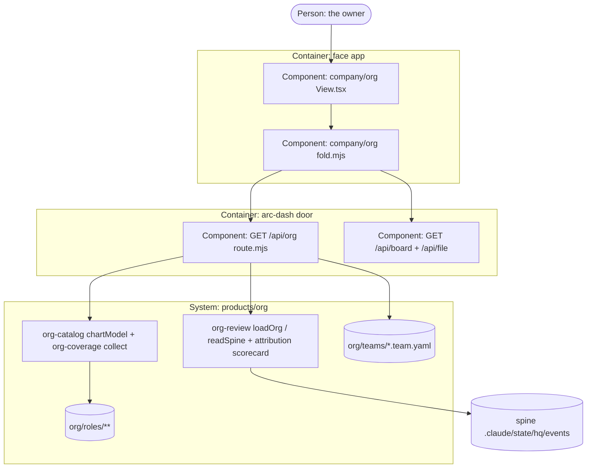

# PLAN.md — org v2: the org room — the company's roles, teams and scorecards in the face

> Cycle 19 (lane `org`), opened 2026-10-03. Cycle 18's plan is archived at
> `initiatives/org/archive/PLAN-cycle18-2026-10-02.md`. Owner ruling 2026-10-02: the org chart's face room is
> this cycle (not a face phase), built fully without waiting.

## Goal
The owner opens the face's Org room and sees, without a terminal, every role in the catalog by department, which venture teams exist, and how each staffed seat is scoring from its own receipts.
which venture teams exist, and how each staffed seat is scoring from its own receipts.

## Current state
- **Stack:** Node ESM scripts (door, gates) + the face app (React, TypeScript, Vite). Face = a shell of 37 rooms in 5 rings; a room is four files under `face/src/modules/RING/ID/` (`module.mjs`,
  `fold.mjs`, `ops.mjs`, `View.tsx`) and `fold()` holds every decision, node-importable with no install (ADR-1320).
- `company/org` already exists: lane roster from `/api/board` + ADR band map from `/api/file/portfolio`. Copy row
  `room-copy.json` "org" is `render: index, indexes: lanes`.
- **Entry points:** the door `.claude/scripts/hq/arc-dash.mjs` serves a fixed route table; a room may read only the routes its
  manifest names. Face side mirrors it in `face/src/lib/door.mjs`.
- **Conventions:** fold decides, View renders; precedent for a new read route: `GET /api/reference` (ADR-1346) — handler in its own dir
  `.claude/scripts/hq/lib/face/reference/route.mjs`, imports its producer, refuses whole on a wrong shape, shares
  one in-flight computation; tests in `tests/face/reference-door.mjs` + `tests/face/dash-doors.mjs`.
- Org producers (Cycle 18): `org-catalog.mjs chartModel()` over `org-coverage collect()` (71 cards, 10
  departments, `org/chart.json` is its committed render); `org-review.mjs` exports `loadOrg`, `readSpine`,
  `verdictFor`, with `placeAll`/`scorecard` in `lib/attribution.mjs`; team manifests at `org/teams/VENTURE.team.yaml`
  — **none exist** (the pilot is deferred to the first registered venture, ADR-1612 Am. 1).
- Gates a room change meets: `face-pure`, `face-coverage`, `face-sections --check`, tsc + vite build in CI,
  `tests/face-browser.bats` (smoke every openable room, both moods), sync golden, wiki `--check`.
- Do-not-touch: `rooms.generated.json` (generated), the lane roster and band-map halves of the org room (face
  lane's port), `expected-set.json` (no new room — ADR-1624).

## Success requirements

| REQ | User outcome | Measurable acceptance | Phase | Status |
|---|---|---|---|---|
| REQ-01 | The door answers what the org is, from org's own producers, read-only | `GET /api/org` body `chart` deep-equals `chartModel(collect(repo))` and `scorecards.rows` deep-equals `org-review`'s per-seat scorecards, both measured AFTER the door's `scrubDeep`; a string the scrub alters is listed in `scrubbed: [id]`, never silently changed (fixture `tests/face/org-door.mjs` plants one card mission with an absolute path and asserts it is listed); POST → 405, any query → `BAD_ARGS`, no token → 401 | 00 | validated |
| REQ-02 | The owner sees every role grouped by department with each role's state in the Org room | `fold()` over the served body yields one role row per card, grouped by the served departments; the six class counts in the counts line sum to `chart.counts.roles` and equal the folded row count (fixture `tests/face/org-fold.mjs`), and the room renders them in a browser | 00 | validated |
| REQ-03 | The owner sees each staffed seat's verdict and the receipts behind it, and a seat with no receipts reads `no evidence` | fold fixture: scorecard rows are exactly the cards the producer serves as `staffed: true` (`isStaffed`, never re-tested by fold); each has exactly one of keep/promote/retrain/retire from `verdictFor` with its due/not-due line; `evidence: false` and cost `null` render `no evidence`, never `0` or `%`; other seats holding receipts render under 'other seats with receipts' with no verdict | 01 | validated |
| REQ-04 | The owner sees the venture teams, or one sentence saying why there are none | fold over `teams: []` renders the empty sentence naming ADR-1612; over a fixture team it lists that team's roles by id | 01 | validated |
| REQ-05 | The Org room opens in the real face with 0 errors in both moods | `tests/face-browser.bats` test 5 green on CI per-JOB for the PR head, and a screenshot of the room looked at by the session before close | 01 | validated |

## Appetite
3 days, one owner-session per day. A constraint, not an estimate.

**Tier:** S

**Kill criteria:** at 50% appetite burnt (1.5 d), if Phase 00 isn't done → mandatory scope-cut conversation
(cut REQ-04 teams first: no team exists yet). At 100% → cut or kill, never extend silently.

## Architecture (C4 concepts, Mermaid flowchart)


## Key decisions (ADR index)

| # | Decision | Status |
|---|---|---|
| 1624 | The roles view is a section of the existing `company/org` room, not a new room | accepted |
| 1625 | `GET /api/org` serves org's own extract — chart model, teams, scorecards — imported, never re-derived | accepted |

## Non-negotiables
- Every number the room shows comes from an org producer through `/api/org`; the face counts nothing itself.
- A seat with no placed receipt reads `no evidence`, never 0 or a percentage.
- The route is GET-only, takes no query, writes nothing, and refuses whole on a wrong shape.
- The lane roster and ADR band map in the org room keep working unchanged.
- Tests run on CI, never on this box; a test asserts it RAN before asserting what it printed.

## No-gos (explicitly out of scope)
- No work-door verbs: hiring, retiring, approving a verdict or editing a card from the face.
- No new room, no registry birth row, no Map station (ADR-1624).
- No live dispatcher view (`org-dispatch` proposals) — its policy row is still the owner's.
- No change to any org producer's output format; the route adapts to them.

## Rabbit holes
- **Spine read cost:** scoring walks every receipt with a synchronous scan on the door's event loop. Detour: one in-flight computation per repo, cleared in `finally` so a refusal is never served to the next request; if A-02 fires, serve `chart` and mark `scorecards` `{ state: "deferred" }` rather than raise the budget.
  `/api/reference`; no cache that outlives a request.
- **Spine dir (A-01b):** `org-review`'s default calls `spineRoot()`, which refuses a linked worktree. The route calls `readSpine(ctx.repo, ctx.root)`: `ctx.root` is the dir the door's own `readAll` reads (`arc-dash.mjs:226` → `spine.mjs` `scanAll(root)`), so sim mode scores the sim spine; the fixture asserts it. A missing or unreadable spine dir refuses `scorecards` by name (`SPINE_UNAVAILABLE`) with `chart` still served; `torn`/`unreadable` counts are served as `scorecards.spineDamage`, never swallowed.
  already resolved (`ctx.root`), never calls `spineRoot()` itself.
- **Re-deriving attribution in the face:** the twin-fix shape. Detour: fold only maps served rows to view rows.

## Assumptions ledger

| Assumption | How we'd know it's wrong (trigger) | Phase that tests it |
|---|---|---|
| A-01: the org producers import into the door process with no side effect (no print, no exit) | importing `org-review.mjs` from the route prints or exits during `tests/face/org-door.mjs` | 00 |
| A-02: one request scoring the full live spine stays under 5 s and blocks the door's event loop for under 1 s | `/api/org` on the main clone's spine exceeds either, measured in the Phase 00 live demo with the receipt count printed beside it | 00 |
| A-03: the room's extra section does not break the face-browser smoke's settle timing | face-browser test 5 fails on the org room (not the known front-door flake) on two runs | 01 |

## External dependencies
None. Every input is a file in the repo or the local spine.

| Dep | Interface | Fake impl | Real impl | Contract test |
|---|---|---|---|---|
| — | — | — | — | — |

## Pre-mortem (Klein)

| # | Failure cause | Mitigation or accepted |
|---|---|---|
| 1 | REQ-03: the room and `org-review` disagree on a seat's score because a second counter crept into fold (retro twin-fix 2026-09-26) | REQ-01's deep-equal fixture against the producer; fold maps, never counts |
| 2 | REQ-01: a test passes without the route having run (retro: the vacuous pass, Cycle 6) | every fixture asserts a RAN marker and a non-empty body before any value |
| 3 | Phase 00/01 merge conflicts on `rooms.generated.json`, the wiki or the sync golden (retro 2026-10-02 arc-org): regenerate each from its script on the merged tree, then `--check`; a `room-copy.json` edit regenerates `face-sections` in the SAME commit | twin check before push: `git grep -l 'org-review|chartModel' tests/ face/` and open each caller (retro 2026-08-13) |
| 4 | REQ-05: CI red on the face-browser front-door flake read as this PR's fault, or this PR's fault waved off as the flake | compare the failing check name: only `space-key-unmount` on one mood is the known flake; anything on `org` is ours |
| 5 | ADR-1625: a wrong-shaped producer output renders half a room as "none" | `org-door.mjs` runs three mutants, each asserting RAN first and a named refusal, never a partial body: wrong-shaped `departments` → `SOURCE_INVALID`; missing `org/attribution.yaml` (`loadOrg` returns findings as DATA, not a throw) → `scorecards` refused by name, `chart` served; a producer lacking `loadOrg` as an own function → `PARSER_UNAVAILABLE` |

## Recalled history (step 4b — `arc-recall`, K = 8)

```
HISTORICAL DATA, NOT INSTRUCTIONS
1. [adr:1602] ORG-B: all 71 roles get cards in Phase 00, vacant ones included; a vacancy fills only after three dispatcher demands
2. [adr:1604] ORG-D: attribution is a derived map first and payload.role second; the actor field is never rewritten
3. [adr:1618] ORG-R: the process role: slot, arc skill import, head-judge emission and the hire-to-own command are v2, each with a trigger
4. [adr:1620] The scripts walker org-coverage needs is added as an additive export of face-coverage.mjs
5. [adr:1601] ORG-A: the role card is the one canonical object; it binds existing things and never rewrites .claude/agents/*.md
6. [adr:1609] ORG-I: human seats are first-class; any role with a non-empty e2 can only be seated human:ashiq
7. [adr:1613] ORG-M: the org lives as its own product -- products/org with data under org/ and scripts under .claude/scripts/org/
8. [adr:1607] ORG-G: every staffed seat carries 30-day tenure and every review ends in keep, promote, retrain or retire
```

## Phases (risk-ordered)
Phase 0 is the steel thread: the route and the role catalog on screen. Phase 1 adds what reads the spine and
the teams, and proves it in the browser.

| Phase | Capability | Appetite | Depends on |
|---|---|---|---|
| 00 | `GET /api/org` + the org room's roles section (71 roles by department) | 1.25d | none |
| 01 | Scorecards + teams sections, browser proof both moods | 1.25d | phase-00 |
