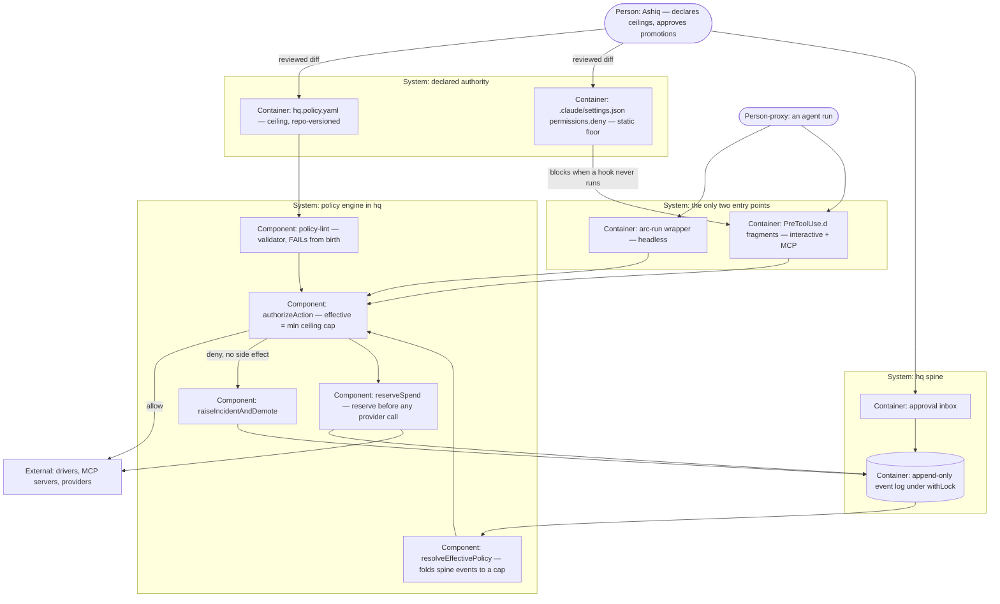

# PLAN.md — Policy Engine: enforced capability vectors

> Lane `policy` (ADR-0500). Design source: `docs/strategy/plans/PLAN-policy.md` v1.0, approved
> 2026-08-04, decisions POL-A..POL-J locked. POL-K decided at this kickoff (ADR-0500).
> Prerequisite gate cleared: the Constitution is **ADOPTED v1.0**, receipt
> `01KZ9V0QXNNMB3ZH18MSH8DKH3`, pinning sha256 `233a6496…6ee6` of `CONSTITUTION.md`.
> Trigger: pull-trigger **has not fired** — proceeding on the owner's explicit call, recorded
> as the first row of the Assumptions ledger with its own falsification trigger.

## Goal

One sentence: autonomy stops being human discipline — `hq.policy.yaml` becomes machine-enforced
law: per action-kind capability vectors (read/write/shell/network/message/publish/deploy/spend ×
L0–L3) under a two-key authority model (human-declared ceiling + event-earned cap), deny-by-default,
enforced **fail-closed** at the only execution entry points (the `arc-run` wrapper headless,
PreToolUse hooks plus a static deny floor interactive), with promotions human-approved on
trial-ledger evidence and demotions automatic on incident — so the first unattended run is
policed by code before that run exists.

## Current state

Verified 2026-08-06 by preflight survey. Every number here was derived by running something; the
design source's own `## Current state` block is dated 2026-08-04 and several of its counts had
drifted, so this block replaces it.

- **Stack:** zero-dependency Node ESM (`.mjs`) throughout, bash for hooks and the event CLI,
  bats for tests, GitHub Actions for CI (19 jobs, runs on `pull_request` only). No framework, no
  package dependencies, no build step.
- **Entry points:** `.claude/scripts/engine/arc-run.mjs` is the headless runner — it invokes a
  driver via `spawnSync("bash", [sh, "run", …])` around line 308, with **no policy check of any
  kind today**; that call site is the single insertion point. Interactive side:
  `.claude/hooks/PreToolUse.sh` + `.claude/hooks/PreToolUse.d/` (fragments `00-destructive.sh`,
  `50-deploy.sh`) and `PreToolUse-edit.sh` + `PreToolUse-edit.d/`, dispatched by `_dispatch.sh`.
  `.claude/settings.json` declares PreToolUse matchers `["Bash","Edit|Write"]` and 12
  `permissions.deny` rules (force-push variants, `git reset --hard`, `rm -rf`, six `.env` reads).
- **Conventions:** the spine vocabulary is a **closed 40 kinds** (derived: `KINDS.length` = 40,
  not the 31 the design source states) — 22 base (ADR-0107) + 8 experiment (ADR-0309) +
  `council.outcome` (ADR-0310) + 8 leads pipeline (ADR-0400/0408) + `constitution.adopted`
  (ADR-0073). Extending it needs an ADR (ADR-0026). Lane validators follow one pattern:
  `validate-experiment.mjs` and `validate-leads.mjs` export KINDS + an assert function and are
  imported into `.claude/scripts/hq/lib/validate.mjs:8-9`; POL-E's four kinds follow it as
  `validate-policy.mjs`. Hostile fixtures live in `tests/fixtures/spine/hostile/` with a
  plain-text `INDEX`, driven by `tests/spine-emit.bats` (which also round-trips every ACCEPT
  fixture byte-for-byte through `canonicalize()` — payload keys must be authored sorted).
  Money typing (integer minor units + `^[A-Z]{3}$`) exists today only for `REVENUE_KINDS`;
  `cost.incurred` is **not** money-typed. `promotion.proposed` is evolve's experiment-scoped
  kind and is never reused here. Spine writes go through a token-based `withLock` in
  `.claude/scripts/hq/lib/spine-io.mjs`; Mode B (concurrent emitters) is forbidden and
  uncertified (ADR-0056).
- **Do-not-touch:** ADR centuries `0300-0311` (evolve) and `0400-0414` (leads); `initiatives/leads/**`
  (leads is the one LIVE lane); `docs/evidence/**` and `docs/archive/**` (frozen, ADR-0058);
  the derived `KINDS` count assertions (never hardcode a total); `withLock`'s token logic;
  `.claude/commands/{arc-commit,arc-review,arc-kickoff}.md` (generated from `processes/*.process.yaml`).
  `.claude/settings.json`, `.claude/scripts/hq/lib/validate.mjs` (REQ-04 adds a third
  `validate-policy.mjs` import beside the evolve- and leads-owned ones), the `kickoff-lint`
  script REQ-07 wires into (every lane runs it, not only this one),
  `tests/fixtures/sync-golden/tree-manifest.txt` and `.github/**` are shared organs — run
  `git log origin/main --oneline -5 -- PATH` before editing any of them mid-cycle. **`leads` is
  the one other LIVE lane and REQ-05 adds rules to the same 12-entry `permissions.deny` block**;
  the repo has already had two same-file cross-lane collisions (ADR numbers 2026-08-02, a stale
  CI constant 2026-08-03), so at merge take the **stronger** version and re-diff the whole rule
  list rather than trusting a clean auto-merge. This build adds files under
  `.claude/scripts/hq/lib/policy/`, which are synced, so **`tree-manifest.txt` will go stale**:
  regenerating it is a named exit step of whichever phase adds those files, diff-checked so that
  only the intended paths moved.
- **Cap inventory (REQ-07's starting point):** no live cap-bearing module exists. `engine/router.yaml`
  is a tier-to-model map, not a spend cap; `arc-run --budget` flags are parsed but never enforced
  as authority; `processes/*.process.yaml` carry a `permissions:` block that nothing validates
  against a grant; council mode envelopes are confidence buckets, not spend. `PLAN-leads.md` will
  be the first real migration candidate when its own trigger fires.
- **REQ-04/REQ-05's hard dependencies, re-verified today rather than carried forward:** the
  approval inbox is live (`.claude/scripts/hq/arc-inbox.mjs`); `incident.raised`,
  `approval.requested`, `decision.recorded` and `cost.incurred` are all in the closed 40;
  `assertDecision` exists at `validate.mjs:192` and its payload is **closed to
  `decides|verdict|reason`**, with `decides` required to be the ULID of the `approval.requested`
  it answers — so the promotion chain's `trial_ledger_ref` must ride on the
  `approval.requested` payload profile, never on the decision; `docs/trial-ledger.md` exists.
- **New at kickoff:** PreToolUse fires for MCP tools (`mcp__SERVER__TOOL` matchers) and this
  repo's `.mcp.json` declares four servers — `stripe` (spend, real money), `supabase`
  (write/deploy), `playwright` (network/shell reach), `context7` (read). See ADR-0503.

## Success requirements

| REQ | User outcome | Measurable acceptance | Phase | Status |
|---|---|---|---|---|
| REQ-01 | The policy file is law, with a parser that cannot be talked past | `hq.policy.yaml` schema + `policy-lint` merged: closed capability set of 8 × closed level enum (**L0–L3; L4 is a parse error**, supersession of `arc-full-architecture.md:61,217` recorded); canonical L0–L3 semantics table (POL-A) living in the file itself; **E2 bound by a mandatory per-kind `e2:` declaration** with `spend` above L1 an unconditional error, and **quote drift caught by two ordered checks** — the live `CONSTITUTION.md` must hash to the pinned sha256, and only then is the E2 paragraph parsed and compared element-wise to `ungrantable_actions:` (ADR-0506); the ADR-0502 un-grantable resource list enforced by **filesystem identity** (`dev`+`ino`, which catches hardlink, symlink and junction in one mechanism) plus `realpath` native resolution for 8.3 short names and case-folded comparison on win32; **ADR-0507's derivation rule enforced** — a closed `argv0_classes:` table, an unclassified program is a lint error, and `effective(shell)` is capped at the minimum of every capability its programs can reproduce, with `node -e` as a named hostile fixture (it carries no chaining metacharacter and no discrete path to check, so nothing else catches it); deny-by-default (absent kind = read-only at L1) asserted by fixture; **`resolveEffectivePolicy` and `authorizeAction` implemented against fakes**, keyed per **(action kind, capability)** pair (ADR-0505), with fixtures including the cap-above-ceiling demotion case — a request goes in and a reasoned **three-valued** decision comes out (`deny` at L0 · `propose` at L1, prepared and recorded but never executed · `execute` at L2 within the declared bound or at L3), which is what makes Phase 0 a thread rather than a parser and is what stops L1 collapsing into a synonym for deny; **hostile corpus green — every input exits 2 (static family) or is denied (runtime family)**: unknown kind name, unknown capability, duplicate keys, contradictory grants, negative/overflow/decimal money, wildcard/IP-literal/encoded/private-net domains, an unclassified `argv0`, shell injection, path traversal, symlink escape, **hardlink and NTFS junction escape, 8.3 short-name aliasing, case-folding aliasing**, unicode lookalikes, E2-at-L2/L3, write-to-settings, write-to-policy-file, delete-a-hook, **mutate-a-guarded-file-via-shell** (`git checkout --`, `sed -i`, redirection), **interpreter-argv0 escape** (`node -e`) — forged promotion payloads are **not** in this phase, because `authorizeAction` knows nothing about promotion payloads, whose validators land in Phase 2 (that attack is a REQ-04 fixture and a REQ-08 row); **hook feasibility matrix delivered and generated from `.mcp.json`, sized at roughly 40 tool rows across the four declared servers plus every built-in side-effect tool class** — one row per class with either a fixture proving intercept-and-block or an assigned static-deny fallback, and a server in `.mcp.json` with no row is an exit failure; **each of ADR-0501's four claimed fail-open modes is independently fixture-proven** (exit 1 or 3-255, missing script, malformed JSON on exit 0, and timeout against a deliberately short configured timeout rather than the 10-minute default), with any mode that cannot be tested recorded as still-an-assumption rather than folded into the matrix as proven. `policy-lint` FAILs from birth | 0 | active |
| REQ-02 | A headless run cannot act outside its vector | The Phase-0 decision function wired into `arc-run` **before any driver invocation** — this REQ is the wiring and its proof, not the building of the check; effective authority = process-declared ∩ policy grant ∩ driver-safe set; a denied action produces **no side effect**, emits `incident.raised`, and the same run's next authorization sees the demoted level (cap recomputed mid-run). Capability fixture matrix, one row per class: denied write → target file byte-identical; denied shell → process never starts; denied network → fake server logs 0 requests; denied message → fake provider has 0 send records; denied publish/deploy → fake publisher has 0 releases; denied spend → 0 provider calls. Bypass fixtures all blocked: direct driver invocation, nested shell, env injection, alternate driver path | 1 | active |
| REQ-03 | Deny-by-default is proven, not promised | An action kind absent from the file can read and do nothing else — one fixture per capability class; an empty policy file yields a fully read-only system, fixture-proven; a policy file that is missing entirely blocks every non-read action rather than granting them | 1 | active |
| REQ-04 | Authority changes are receipts with a deterministic state machine | Vocab ADR merged adding **+4 kinds on live `KINDS.length`** (`policy.level.changed`, `policy.demoted`, `spend.reserved`, `spend.released`) with the unknown-kind hostile fixture re-run (ADR-0106 rule); promotion chain live end-to-end: `approval.requested` under the strict `subject: "policy.promotion"` profile (action_kind, **capability**, from_level, to_level, trial_ledger_ref, policy_hash, correlation — unknown keys rejected, `assertDecision`-style) → human `decision.recorded` via inbox → `policy.level.changed` referencing that decision, with the validator rejecting an approved level above the ceiling at decision time; automatic demotion: incident → `policy.demoted` with cap = max(L0, effective-at-incident − 1) **for the capability involved in the denied action, not the whole kind** (ADR-0505), in the same run, fixture including the cap-above-ceiling bite case, **a same-run double-incident case (the second incident demotes from the already-demoted effective level) and a demotion-versus-promotion-decision race in which spine append order, never wall-clock order, is the documented tie-break**; reducer replay fixture proves the same event stream yields the same effective level | 2 | active |
| REQ-05 | An interactive session obeys the same law | PreToolUse fragments in `.claude/hooks/PreToolUse.d/` for every class the REQ-01 matrix proved, each calling the shared library with zero duplicated policy logic and each exiting 2 on its own internal error; every high-blast-radius class (spend, deploy, publish, E2-adjacent) additionally carries a static `permissions.deny` rule per ADR-0501, and a cross-check test fails if layer 2 ever contradicts layer 1; the four `.mcp.json` servers are covered by `mcp__SERVER__TOOL` matchers; an interactive bypass fixture cannot write, shell, network, message, publish, deploy or spend outside policy; `arc brief` and the inbox render pending promotions and open incidents — **this last clause is the pre-planned first scope cut if Phase 2 overruns: it is display, and no enforcement property depends on it** | 2 | active |
| REQ-06 | A second run cannot double-spend the day's cap | Money flow proven end-to-end: read settled + active reservations from the spine → atomic `spend.reserved` under `withLock` → provider call with idempotency key → `cost.incurred` (settlement profile: reservation_ref, integer minor-unit amount, ISO-4217 currency, provider idempotency ref — strict when reservation_ref is present, legacy shape untouched, forward-only) or `spend.released`; reservation state **derived from the event chain, never stored**; fixtures: under-cap allowed, exact-boundary behaviour pinned, over-cap blocked, sequential second run blocked, lock-level concurrent attempt blocked, restart/replay identical, **crash-before-provider-call (reservation open, no call attempted — restart retries under the same idempotency key) and crash-after-provider-call-before-settlement (the reservation stays permanently open, is never auto-released or auto-retried, and surfaces as a stuck reservation for a human decision — the no-auto-recovery rule applies to money too)**, and no provider call before reservation success; v1 autonomous spend valid in Mode A only | 1 | active |
| REQ-07 | One source of cap truth, honestly | Cap inventory recorded from the tree as it is at the phase start (engine budgets, `router.yaml`, process `permissions:` blocks, council envelopes); birth-rule wired as a `kickoff-lint` check (WARN-first, advisory): a module born after policy lands without its policy row is flagged; migration is **deferred at kickoff, not left conditional** — the Current-state inventory already established that no live cap-bearing module exists (`PLAN-leads.md` is the named future candidate, waiting on its own unfired trigger), so Phase 3 delivers inventory + birth-rule only and migration reopens as new work the day a real module exists, never hunted for inside this cycle's 0.5 days; parity, when it is eventually claimed, comes only from that module's own fixtures and never from a mockup (E3) | 3 | active |
| REQ-08 | The engine survives a real attack, with receipts | Two full days of fresh-agent adversarial passes, two agents per day on different surfaces (decision logic vs shell/OS boundary), each carrying the lane's running list of already-fixed defects with instructions to check every one in every other file. Attack list at minimum: wrapper bypass via direct driver, denied command embedded in an allowed shell, symlink and path escape from write roots, domain allowlist bypass (redirect, DNS-rebind, IP-encode, subdomain, proxy), concurrent double-spend race, demotion-fails-open, cap-above-ceiling no-op attempt, fake or missing trial-ledger evidence, forged promotion payload, stale cached policy vs file, hook fail-open under each of the 4 fail-open modes, deny-rule deletion via write, **a hook script left in place but made non-spawnable (permission bit or extension change, no content bytes touched)**, **a guarded file mutated through the shell rather than the write tool**, **interpreter-argv0 escape** (`node -e` writing a guarded path), **an `argv0_classes:` entry whose class understates what the program can do**, **a kind holding `publish` or `deploy` above L1 with `e2: []` whose work actually publishes** (the one place the model rests on an unverified declaration, ADR-0506), quarantined-event-reported-as-success. **Every hole found lands as a permanent regression fixture whose bats `@test` name is ASCII-only and whose file asserts its own registered test count** (bats silently drops a non-ASCII test name — five tests once vanished behind a green file, visible only as a shrinking CI count), **and is back-ported into REQ-01's hostile corpus before this phase closes**, so CI keeps catching it after the two adversarial days end. A report of "no findings" without demonstrated attack paths does not close this REQ | 4 | active |

## Appetite

**7 days hard cap.** This is a constraint, not an estimate. Planned allocation is **6.75 days,
leaving 0.25 days of slack** — thin, and deliberately so: the kickoff simulation gate showed
that a "law and parser only" Phase 0 cannot run its own hostile corpus, so the runtime decision
function moved into Phase 0 and its appetite went from 1 day to 2. That extra day was **not new
budget** — it is the day the old kill criterion was already tacitly lending Phase 0, now
allocated in the open instead of borrowed in the dark. Phase 3 gave back 0.25 days because the
attack panel established that its migration is deferred by evidence rather than conditional.
Zero slack is forbidden (portfolio C4 ran 112% on a 100%-allocated plan), so 0.25 days is the
floor, not a comfort. **Be honest about what that buys: three independent verification passes —
one attacker and two simulation rounds — judged Phase 0 over-full even at 2 days**, given it
owes a hand-rolled YAML subset parser, both E2 checks, filesystem-identity resource exclusion,
ADR-0507's derivation rule, the full reducer, `authorizeAction`, two hostile-corpus families
built from real filesystem objects, a ~40-row real-dispatch matrix, and its own two-surface
adversarial pass — against a Cycle-6 precedent of seven adversarial passes on a gate of similar
shape. That risk is managed, not waved away: `phases/phase-00-spec.md` carries a **pre-planned
cut list in priority order**, decided now rather than at 6pm on day 2, and a never-cut list
underneath it. If the never-cut items cannot be reached by end of day 2, the kill criterion fires
and the cycle stops — which is the criterion working. **Slack is never taken from Phase 4.** Dogfood is 7 calendar days with
real policy in force for whatever runs exist — separate from build appetite, feeds the retro,
not the burn.

**Tier:** M

**Kill criteria:** **REQ-01's exit not reached by end of day 2 → STOP** and retro the schema
scope. Note what changed: Phase 0 is now *allocated* 2 days rather than allocated 1 and tolerated
to 2, so this criterion means Phase 0 has **no overrun room at all** — it is stricter than it
looks, and that is deliberate on the riskiest phase. At 50% burn (day 3.5) Phase 1 must be done
or the scope-cut conversation is mandatory. **Phase 4 finds a bypass class the Phase 0/1/2
architecture cannot close** (the enforcement point turns out not to be the sole entry) → STOP;
do not ship a policy engine that polices politely. At 100% burn: cut or kill, never extend
silently (A9).

## Architecture (C4 concepts, Mermaid flowchart)

## Key decisions (ADR index)

| # | Decision | Status |
|---|---|---|
| 0500 | POL-K: lane `policy`, ADR century 0500, policy library lives in `hq` (an optional policy product is an install-time fail-open) | accepted |
| 0501 | Fail-closed at the interactive surface is two layers — hooks decide, `permissions.deny` is the floor that holds when a hook never runs | accepted |
| 0502 | Un-grantable **resources**: settings, the policy file and the hook dir are excluded from every write grant, regardless of ceiling or cap | accepted |
| 0503 | MCP tools are in-scope capability surfaces, scoped to the four servers in this repo's `.mcp.json` | accepted |
| 0504 | An action kind is the authorization **subject** — `process:NAME` from `processes/`, plus one reserved `session:interactive`. Capabilities are the verbs, tools the instruments | accepted |
| 0505 | Authority is keyed per **(action kind, capability)** pair everywhere, and a demotion bites only the capability involved in the denied action | accepted |
| 0506 | E2 binds to grants through a **mandatory `e2:` declaration** per kind (plus an unconditional `spend` rule), and quote drift is caught by parsing the **hash-pinned** Constitution | accepted |
| 0507 | **No capability may be used to exceed another capability's grant** — `shell` is capped at the minimum of every capability its allowlisted programs can reproduce; an unclassified program is an error | accepted |
| 0508 | The four authority receipts extend the closed vocabulary 40 -> 44 (POL-E). Two kinds per direction, because a human decision and a machine demotion are different truth sources | accepted |

Locked upstream in the approved design source and not re-decided here: POL-A (the YAML is the
ceiling, L0–L3 closed) · POL-B (deny-by-default, E2 verbatim) · POL-C (two-key state machine,
demotion bites from the effective level) · POL-D (one shared library) · POL-E (reuse two kinds,
add exactly four) · POL-F (spend is metered consumption under a pre-approved budget, Mode A
only) · POL-G (driver L2-eligibility is a fixture result, not a judgement) · POL-H (interactive
coverage behind a feasibility gate) · POL-I (birth-rule over migration) · POL-J (capability
*vetting* and capability *vector* stay distinct words).

## Non-negotiables

- **Fail-closed everywhere, honestly scoped (ADR-0501)**: a policy check that throws blocks the run (ADR-0028 fail-safe precedent); a hook fragment exits 2 on its own internal error; and because a hook that never runs cannot deny, every high-blast-radius capability also carries a static `permissions.deny` backstop. An event that lands in quarantine is never reported as enforcement success (ADR-0106/0032).
- **Enforcement lives in code paths agents cannot bypass** — the `arc-run` wrapper and registered hooks; never prompts, never convention.
- **Deny-by-default**: no wildcard grants, a kind absent from the file is read-only, unknown fields are hard errors (POL-B).
- **E2's five items are never above L1**, quoted verbatim from the adopted Constitution (receipt `01KZ9V0QXNNMB3ZH18MSH8DKH3`); the un-grantable resource list (ADR-0502) is excluded from **every write grant and every shell grant capable of mutating a file** (`git checkout --`, `cp`, `sed -i`, `mv`, output redirection) regardless of ceiling or cap — `shell` and `write` are separate vectors, so an exclusion written against writes alone is not an exclusion.
- **No auto-promotion, no auto-recovery, no time-decay** — every raise is a human decision citing trial-ledger evidence (A4, A1).
- **Money**: Mode A only; no provider call before a successful reservation; no real-money movement above L1; spend-capable kinds excluded from any future scheduling in v1.
- **One implementation, two consumers** (POL-D) — the wrapper and the hooks call the same library; two interpretations of policy is guaranteed drift.
- **Counts derived, never hardcoded** (ADR-0107); profiles and hashes forward-only, never backfilled or estimated (ADR-0068 spirit).
- **`policy-lint` FAILs from birth** — it is a validator (spine strict-mode exit-2 precedent), not an advisory lint; every other new advisory lint starts WARN-first in TRIAL.
- **A gate is not done until a fresh agent that has not seen the implementation has attacked it**, on two different surfaces, and every hole found is pinned as a permanent regression fixture.
- **Every phase close leaves its receipt on the spine**, and "tests green" means green on CI, read per job.
- Constitution articles this plan upholds, for kickoff-lint: E1, E2, E3, A1, A2, A4, A5, A8, A9, A10.

## No-gos (explicitly out of scope)

Scheduler or cron of any kind — it has its own brief and hard-depends on this one; anything
scheduler-shaped that comes up becomes a note in `BRIEF-scheduler.md` and nothing else · RBAC or
multi-user ambitions · network policy beyond domain allowlists (no proxy, no egress rewriting) ·
ad-bid or purchase autonomy · touching evolve's experiment kinds or `/arc-capability` · new spine
kinds beyond POL-E's four · backfilling profiles onto historic events · a policy dashboard (brief
and inbox rendering only) · re-tiering any model seat (that is C5's territory) · **user-level MCP
connectors** (Slack, Notion, Vercel, Figma, Higgsfield and anything else outside this repo's
`.mcp.json`) — named rather than silently absent, because they live outside the repo, cannot be
pinned by fixture, and grow without bound (ADR-0503).

## Rabbit holes

- **Perfect resource grammar** — v1 writes grammars only for capabilities with live consumers
  (write roots, shell allowlist, network domains, spend caps); message, publish and deploy get
  schema slots and minimal enums. A full grammar for a capability with no consumer is stale on
  arrival.
- **Trust scoring or karma systems** — the state machine is `min()`, one-level bites, and human
  raises. Anything smoother is a v2 debate, and A4 probably still says no.
- **Egress proxy engineering** — v1 network enforcement is an allowlist decision inside
  `authorizeAction` plus red-team fixtures. Building a forward proxy is its own cycle.
- **Hook framework generalization** — fragments call the shared library; refactoring the hook
  dispatch system itself is out (touching hooks beyond adding fragments is a no-go inherited
  from C5).
- **Migration completionism** — REQ-07 is inventory plus birth-rule; hunting every implicit cap
  in every script is not this cycle.
- **Chasing the MCP surface** — the matrix is generated from `.mcp.json` and stops there. A
  connector someone happens to have authenticated is not in scope (ADR-0503).

## Assumptions ledger

| Assumption | How we'd know it's wrong (trigger) | Phase that tests it |
|---|---|---|
| Starting before the pull-trigger fired is right: the owner chose to build policy now, with fewer than 3 kinds at L2 and no headless job yet approved | Phase 4 closes and the Appetite section's own **7** dogfood days pass with **zero** promotion requests and zero incidents raised. `/arc-retro` must **assert those two counts from the spine, never recall them**, and on zero it forces a named STOP-or-fund-the-first-headless-job decision in its output — a passive note is the document-as-control shape this repo has already shipped twice. If 7 days is too short to trust the verdict, the Appetite dogfood window grows; this trigger never silently diverges from it | dogfood |
| A PreToolUse hook fails **open** on timeout, crash, missing script and malformed JSON, and only `exit 2` blocks (ADR-0501, Confidence: medium) | Any one of the four fail-open modes is observed to BLOCK in the REQ-01 feasibility fixtures — then layer 2 is over-built and ADR-0501 is superseded, shrinking Phase 2 | 0 |
| PreToolUse fires for MCP tools via `mcp__SERVER__TOOL` matchers (ADR-0503, Confidence: medium) | The REQ-01 matrix cannot make a fixture intercept an MCP call — then all four servers move to static-deny-only and the interactive scope tilts headless-first | 0 |
| Spine `withLock` is a sufficient single-writer boundary for reservations in Mode A | REQ-08's race fixtures break a reservation invariant → autonomous spend drops to L1 until a certified mechanism exists, as a fixture result rather than a judgement | 4 |
| One-level demotion is the right bite size | Dogfood shows repeat incidents at the same level on the same kind → retro material; money kinds may need a two-level bite or straight-to-L0, recorded as an ADR note | dogfood |
| The 8-capability set covers real actions at this scale | An action fits no capability honestly during Phase 1 or Phase 2 wiring → extend the closed set through the same ADR mechanism, never shoehorn it into a near-miss class | 1 |

## External dependencies

The build calls **no real external service**. Every dependency below is a surface this engine
must *block*, so its contract test asserts an absence — zero calls, zero writes, zero releases —
against a recording fake. No real implementation is exercised this cycle: POL-F bans real money
above L1 in v1, and enforcement is provable without it.

| Dep | Interface | Fake impl | Real impl | Contract test |
|---|---|---|---|---|
| `stripe` MCP (spend, E2) | `mcp__stripe__*` intercepted at PreToolUse + static deny | recording fake that logs every attempted call and returns nothing | not called in v1 (POL-F: no real money above L1) | denied spend → fake records 0 calls, and no call precedes a successful reservation |
| `supabase` MCP (write, deploy) | `mcp__supabase__*` intercepted at PreToolUse + static deny | same recording fake, separate ledger | not called in v1 | denied deploy → fake records 0 releases; denied write → target byte-identical |
| HTTP egress (network) | domain allowlist decision inside `authorizeAction` | local fake server logging every request | not called in v1 | denied network → fake server logs 0 requests, including redirect, DNS-rebind, IP-encode and subdomain attempts |
| Spend provider (money) | `reserveSpend` + provider idempotency key | committed fake provider (ADR-0104 pattern) | not called in v1 | over-cap blocked, sequential second run blocked, concurrent attempt blocked at lock level, restart/replay identical |

## Pre-mortem (Klein)

| # | Failure cause | Mitigation or accepted |
|---|---|---|
| 1 | Enforcement fails open silently. Precedent from `docs/retro-log.md`: `develop.started` landed in quarantine with exit 0 and was found only by listing the spine directory — the caller reported success | Fail-closed is REQ-02's acceptance, not a preference: a throwing check blocks, quarantine is never success, a hook fragment exits 2 on its own error. ADR-0501 adds the static floor for the case the hook never runs at all. REQ-08 attacks exactly this, one row per fail-open mode |
| 2 | A bypass path exists around the wrapper. Precedent: the engine cycle's adversarial pass forged an `allowed-tools:` grant through frontmatter injection, and `permissions: declared` with only `ask.human` meant unrestricted | Sole-entry-point architecture, POL-G's driver contract, POL-H's feasibility gate, and Phase 4's two untouchable days. REQ-02's bypass fixtures cover direct driver, nested shell, env injection and alternate driver path. Kill criterion fires if a class proves unclosable |
| 3 | The policy file drifts from reality into a poster. Precedent: the Constitution sat DRAFT for weeks while six documents described it as adopted; blueprint states went stale | The birth-rule (REQ-07) makes the file the birthplace of caps; the effective level derives from events so the file rarely needs editing; REQ-01's matrix is generated from `.mcp.json` so a new server breaks the build instead of widening an unenforced surface |
| 4 | `canonicalize()`'s key sort or the `policy_hash` encoder silently folds two different policy states to one hash. Precedent from `docs/retro-log.md`: `configHash` used `JSON.stringify`, which folds `NaN` and `-Infinity` to `null`, so a deliberately disabled floor hashed identically to an unset one — the same signal-destroying transform as `design-render.sh` pinning `font-family: Arial !important` and judging a whole cycle of designs typography-blind | Every REQ-01 and REQ-04 hash preimage is built by a **total, type-tagged encoder that refuses what it cannot represent** (`undefined`, `NaN`, `±Infinity`, `BigInt`, cycles) rather than coercing it, and a fixture pins one demoted-versus-tampered state pair that must **not** collide. REQ-04's promotion chain trusts `policy_hash` for integrity, so this is where a silent collision would do the most damage |
| 5 | Double-spend through a race. Precedent: `withLock` had a live duplicate-writer bug (fixed in #89) while a certification was green | Reserve-before-call under the lock, Mode A only, and REQ-06's sequential plus lock-level race fixtures plus a restart/replay fixture. If REQ-08 breaks an invariant, the assumptions-ledger row drops autonomous spend to L1 |
| 6 | A fix lands in one of the parallel enforcement surfaces (`policy-lint`'s corpus, `authorizeAction`, one hook fragment) and not its siblings. Precedent from `docs/retro-log.md`: the identical validate-one-read-compare-another defect was closed in `verdict.mjs` and left open in `lineage.mjs` a phase later — the **second** twin-fix recurrence, after the written rule "grep the pattern, not the file" had already failed to take once | POL-D's "zero duplicated policy logic" is a claim until something checks it: REQ-08's exit requires every hole it finds to be back-ported into REQ-01's hostile corpus, not just parked in a standalone bats file, and each Phase-4 attacker's prompt carries the lane's running defect list with orders to check every past fix in every **other** file |
| 7 | The build passes its own tests and proves nothing. Precedent from `docs/retro-log.md`: the vacuous pass shipped three times in Cycle 6, twice inside the suites written to prevent it; and a gate's author found 0 holes in their own gate where a fresh agent found 9 | Every Phase-0/1 test names its **Expected failure first** before code exists; REQ-08 uses fresh agents that have not seen the implementation, two surfaces per day, each carrying the lane's running defect list with orders to check every fix in every other file |

## Phases (risk-ordered)

| Phase | Capability | Appetite |
|---|---|---|
| 0 | **Steel thread — the law, its parser, and the decision.** Schema + canonical L0–L3 table + `policy-lint` + `resolveEffectivePolicy` and `authorizeAction` implemented against fakes + hostile corpus green + hook feasibility matrix generated from `.mcp.json`, with per-class verdicts and deny-floor assignments (REQ-01). A request goes in and a reasoned `deny` / `propose` / `execute` comes out — that is what makes it a thread rather than a parser | 2 days — no overrun room; the REQ-01 kill criterion fires at end of day 2 |
| 1 | Headless enforcement: wire the Phase-0 decision function into `arc-run` before any driver call, capability fixture matrix, deny-by-default proof at runtime, money guard with the reservation flow and double-spend fixtures (REQ-02, REQ-03, REQ-06) | 1.25 days |
| 2 | Receipts and interactive: vocab ADR for the 4 kinds, promotion chain end-to-end through the inbox, automatic demotion, hook fragments per the matrix, the static deny floor and its cross-check, then brief and inbox rendering **last, as the pre-planned first cut** (REQ-04, REQ-05) | 1.25 days |
| 3 | Birth-rule wiring and cap inventory; migration deferred by evidence, not hunted for (REQ-07) | 0.25 days |
| 4 | **Adversarial security pass — two full days, untouchable.** Fresh agents on two surfaces per day, the red-team list, every hole a permanent regression fixture (REQ-08) | 2 days |

**North-star:** when the scheduler kickoff eventually fires, its plan checks "policy engine live"
as a verified prerequisite and adds **zero** new permission machinery — the first unattended run
in arc's history is block-capable on its first day, and every authority change before and after
it is a receipt on the spine.
