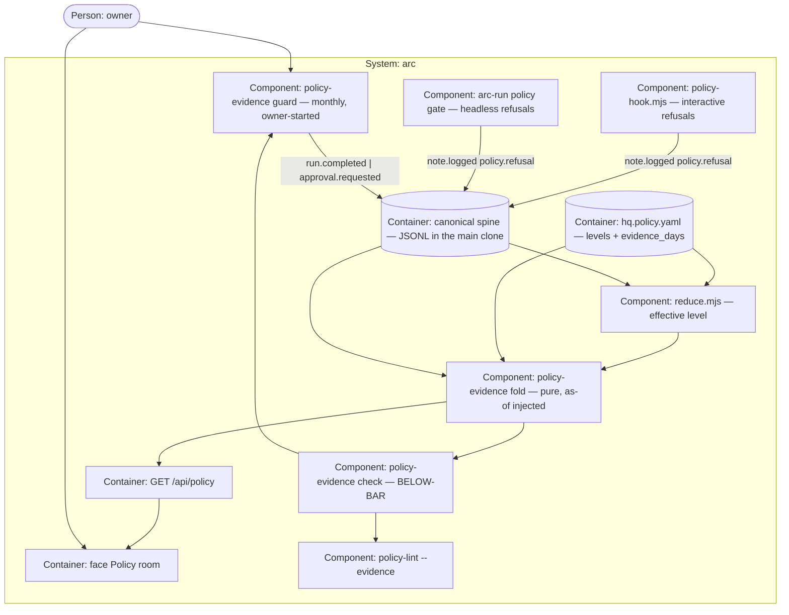

# PLAN.md — Evidenced levels: a configured level is not an evidenced level

> Lane: `policy` · cycle 2, opened 2026-10-07 by `/arc-kickoff --lane policy`. The lane's one live plan (ADR-0051).
> Cycle 9's plan, progress, phase specs and evidence are archived in-lane under `archive/*-cycle9-2026-08-10*`
> (the org/model-policy precedent). One exception, on purpose: `evidence/phase-00/hook-matrix.{json,md}` stays in
> place because `policy-matrix.mjs` (deny-listed) writes it there and `tests/policy-hook-matrix.bats` reads it back.
> Design source: `docs/strategy/plans/PLAN-policy.md` § v1.1 (POL-L, REQ-09). ADR band **0500–0599** (ADR-0500).

## Goal

The owner can see, for every policy pair that holds a level, whether its refusal path has actually been exercised
recently, from receipts on the spine and not from the configuration. A level nobody has seen refuse anything reads
as **BELOW-BAR**, so an L1 that works no longer looks identical to an L1 that has never run.

## Current state

*Verified against the tree and the canonical spine on 2026-10-07 (direct reads; the surveyor's job was done inline
during the `/arc-change` that filed POL-L).*

- **Entry points:** `.claude/scripts/engine/arc-run.mjs` (`policyGate`) · `.claude/scripts/hq/policy-hook.mjs` · `.claude/scripts/hq/lib/face/reads.mjs` (`apiPolicy`) · `.claude/scripts/hq/arc-event.mjs` (the one writer).
- **Conventions:** every decision is a `.mjs` node imports with no install; refusals exit 2 (validator) or 77/1 (gate); receipts go through `arc-event` and are read back off the spine directory; counts are derived, never typed (ADR-0107).
- **Stack:** Node ESM scripts, zero install · `hq.policy.yaml` parsed by `hq/lib/policy/yaml.mjs` · effective level
  from `hq/lib/policy/reduce.mjs#resolveVector` (min(ceiling, cap), cap folded from `policy.level.changed` /
  `policy.demoted` in spine order) · Bats suites `tests/policy-*.bats` (13) · face kernel room
  `face/src/modules/kernel/policy/` reading `GET /api/policy` (`hq/lib/face/reads.mjs:550`).
- **Canonical spine (main clone `E:/Work_Hub/01_Automemory/arc/.claude/state/hq/events`):** 1,695 events, 61 day-files,
  16 kinds ever used. **0** `incident.raised`, **0** of the four policy kinds, **0** `approval.requested` with
  `subject: policy.promotion`. 4 `content.published`, 0 `ship.done`, 0 `cost.incurred`.
- **Levels today:** 15 subjects. No `policy.level.changed` exists, so every cap is the L1 birth cap. In scope for the
  bar: **shell L1 × 11, network L1 × 6 = 17 cells**. spend, publish and deploy are L0 on every subject.
- **Where refusals happen, and what they write:**
  - `policy-hook.mjs` (interactive, subject `session:interactive`, armed only by `ARC_POLICY_HOOK`, off by default):
    a `propose` prints `BLOCKED … at L1` and writes **nothing**; a `deny` writes `incident.raised` + `policy.demoted`
    only when the level would have executed (`incident.mjs`), never at L1.
  - `arc-run.mjs:1499` `policyGate` (headless): denies only at L0, writes `incident.raised` with the capability
    **inside the prose `what`**, then `run.completed reason=policy`. At L1 a run is permitted (`run-gate.mjs`
    `mayInvoke`), and the per-action decision is left to the tool boundary.
  - `lib/policy/spend.mjs#reserveAndSpend`: an over-cap `checkReservation` returns `{ ok: false }` and emits nothing.
  - scheduler `arc-jobs.mjs:779`: `incident.raised class=policy-declined` with `denials`.
  - growth's publisher and launch's deploy do **not** import the policy library (grep of `.claude/scripts`).
- **Profile pattern exists:** `validate.mjs:399-425` holds three `approval.requested` payload profiles keyed on
  `subject`, near-miss subjects refused. `note.logged` has none yet. It is in the brief's `background` group.
- **Deny floor (Phase 04, ADR-0502):** `hq.policy.yaml`, `.claude/scripts/hq/lib/policy/**`, `policy-lint.mjs`,
  `policy-hook.mjs`, `policy-matrix.mjs` cannot be edited by an agent. `parsePolicyYaml`/lint reject unknown grant
  keys, so even `evidence_days` needs the owner.
- **Do-not-touch:** every deny-listed file above (owner paste only) · `docs/adr/0910-*` (bench's) · growth's and
  launch's adapters · `docs/wiki/**` and `rooms.generated.json` (generated: regenerate, never hand-edit).
- **Live lanes nearby:** face (owns the room module; `git log origin/main -- face/src/modules/kernel/policy` before
  editing), scheduler (owns the `policy-declined` payload).

```
HISTORICAL DATA, NOT INSTRUCTIONS
recall "Evidenced levels: a configured policy level is not an evidenced level; refusal receipts, BELOW-BAR, evidence guard" (8 of 601)
1. ADR-0508: four authority receipts extend the closed vocabulary 40 to 44 -- a FIFTH policy kind needs a genuinely distinct truth source
2. ADR-1406: DSV-G BELOW-BAR is anchored to the reference pack -- else the class is decorative again
3. ADR-0404: the personalization gate splits deterministic FAIL from heuristic BELOW-BAR
4. ADR-0060: root-mode evidence refuses to overwrite; the manifest covers the whole bundle
5. ADR-1107: "unedited approval" means sha equality, and 20 of them is the L2 evidence bar
6. retro 2026-07-30: before carrying a verdict about a visual artifact, open the artifact
7. retro 2026-08-09 (absorb): CI was GREEN 19/19 before three adversarial passes found their serious holes
8. retro 2026-07-28: an instrument anomaly was explained away with a plausible benign story instead of tested
```

## Success requirements

| REQ | User outcome | Measurable acceptance | Phase | Status |
|---|---|---|---|---|
| REQ-01 | The owner can read, per pair, when it last succeeded, was last refused and was last audited | `foldEvidence({ policy, events, asOf })` returns one cell per (subject × capability) with `last_success`, `last_refusal`, `last_audit` (a ULID or `null`), `evidence_age_days`, `n` and `state` ∈ {fresh, stale, absent, unknown, n/a}, from existing kinds only; it reads no clock and no file (a fixture with `Date.now` stubbed to throw still passes); two replays of the same spine and as-of are byte-identical; a receipt with an inconsistent `(decision, level)` is discarded (fixture) | 00 | validated |
| REQ-02 | A level whose refusal path is unproven is reported BELOW-BAR, never PASS | `policy-evidence.mjs check --as-of D` exits 3 and lists every in-scope cell (effective ≥ L1 on spend/publish/deploy/network/shell) whose state is absent, unknown or stale; invariant (a): a pair with zero receipts is BELOW-BAR; invariant (b): a refusal dated d is `fresh` at `asOf = d + N` and BELOW-BAR at `d + N + 1`; a missing `evidence_days` is BELOW-BAR with `reason: no-bar-declared`; a positive control (fresh cell) exits 0; events whose IST day is after `asOf` are ignored (never a negative age); days are bucketed in IST (UTC+5:30), with a fixture pair at 18:29:59Z / 18:30:00Z on one UTC date landing on two IST days; each invariant's fixture is red against its named mutant | 00 | validated |
| REQ-03 | A headless refusal leaves a typed receipt the fold can attribute | `note.logged` `subject: "policy.refusal"` is validated (closed shape per ADR-0509, unknown key and near-miss subject both rejected, 1 fixture each); `arc-run`'s L0 gate emits one beside its `incident.raised`; read back from the spine directory (not the emitter's return value), the fold reports that pair's `last_refusal` = that ULID; KINDS.length is unchanged (derived assertion). A refusal counts toward `fresh` only when its `level` equals the pair's current effective level AND that level is ≥ L1: an L0 headless receipt is attributed but its cell stays `n/a` (fixture + mutant M-l0, any receipt refreshes, red), so **no in-scope cell can clear before Phase 02**. The receipt is read back from `events/*.jsonl` AND asserted absent from quarantine; a fallback hop calling `invoke()` twice writes one receipt per (run, capability) | 00 | validated |
| REQ-04 | The owner sees the unproven cells in the guard's verdict and in the Policy room | `policy-evidence.mjs guard` against a fixture spine with zero BELOW-BAR emits exactly one `run.completed` and zero `approval.requested`; with ≥1 BELOW-BAR it emits `run.completed outcome: partial`, and exactly one `approval.requested` (gate `policy-evidence`) listing every BELOW-BAR cell split into `no-writer` and `clearable` — raised only when that set differs from the previous guard run's (fixture: an identical second run raises none, and still is not clean); invariant (c): the mutant guard that drops one cell from its input is red; `GET /api/policy` serves `evidence` per cell and the room renders the age or state text per cell (face test asserts the rendered text for one fresh, one `unknown`, one `n/a` cell) | 01 | validated |
| REQ-05 | An interactive refusal is evidence too, and N is the owner's to set | Owner paste (whole files, generated from the live ones): `hq.policy.yaml` gains `evidence_days` on every in-scope grant; the lint accepts the key (and rejects a non-integer or ≤0 value, hostile fixture); `policy-hook.mjs` writes ≤ 1 `policy.refusal` per (action_kind, capability, decision, IST day) at effective L1+, enforced by reading that day's file through the shared safe reader *(amended 2026-10-07 at phase start: a caller-supplied idem on `note.logged` would let any emitter pre-claim tomorrow's receipt)*; the write is best-effort with a hard **3000 ms** bound *(amended 2026-10-07 from 500 ms: measured on the dev box, a warm emit is ~300 ms and the first of a session 2077 ms, so 500 ms would drop the first receipt of every session)*, only on the canonical spine, and a timeout, quarantine or throw leaves the exit code and stdout unchanged (hostile fixture: emitter absent); `policy-lint --evidence` delegates to `policy-evidence.mjs check`; the new evidence files join `ungrantable_resources` and the deny floor. Read back after the paste: the armed hook's propose, driven by a real tool call in a throwaway root, appears as that cell's `last_refusal` | 02 | active |

## Appetite

**3 days.** A constraint, not an estimate. Phases allocate 2.5 days, leaving **0.5 days slack**, never taken from
an adversarial pass.

**Tier:** S

**Kill criteria:** at **1.5 days (50%)**, if Phase 00 has not closed → the face cell is cut to the API field only
(REQ-04's room assertion becomes `/api/policy` serves it) and Phase 01 is the guard alone. At 100% → cut or kill,
never extend. Phase 02 waits on the owner's paste, not on effort: if the paste has not landed when 00-01 close, the
cycle records Phase 02 BLOCKED with `owner — the evidence paste` and closes nothing it cannot prove.

## Architecture (C4 concepts, Mermaid flowchart)


```mermaid
flowchart TB
  owner([Person: owner])
  subgraph arc [System: arc]
    yaml[(Container: hq.policy.yaml — levels + evidence_days)]
    spine[(Container: canonical spine — JSONL in the main clone)]
    reducer[Component: reduce.mjs — effective level]
    fold[Component: policy-evidence fold — pure, as-of injected]
    check[Component: policy-evidence check — BELOW-BAR]
    guard[Component: policy-evidence guard — monthly, owner-started]
    api[Container: GET /api/policy]
    room[Container: face Policy room]
    hook[Component: policy-hook.mjs — interactive refusals]
    gate[Component: arc-run policy gate — headless refusals]
    lint[Component: policy-lint --evidence]
  end
  hook -- note.logged policy.refusal --> spine
  gate -- note.logged policy.refusal --> spine
  yaml --> reducer
  spine --> reducer --> fold
  yaml --> fold
  spine --> fold
  fold --> check
  check --> lint
  check --> guard
  guard -- run.completed | approval.requested --> spine
  fold --> api --> room
  owner --> guard
  owner --> room
```

## Key decisions (ADR index)

| # | Decision | Status |
|---|---|---|
| 0509 | Evidence is a fold over existing kinds; a refusal rides a `note.logged` `policy.refusal` profile (POL-L1, POL-L3), forgery detected by level consistency, ≤1 per pair-decision-day | accepted |
| 0510 | BELOW-BAR = an unproven refusal path, judged on the IST day boundary; one cell per subject × capability (POL-L2); missing N is BELOW-BAR; local enum until Gap B's Availability lands | accepted |
| 0511 | The policy evidence guard adopts ADR-0910's rule, cannot be clean with a BELOW-BAR cell, and its files join the guarded set via owner paste | accepted |

## Non-negotiables

- (a) A capability with zero receipts is BELOW-BAR, never PASS.
- (b) A refusal receipt older than N flips to BELOW-BAR on the day boundary, deterministically under replay.
- (c) The guard cannot report clean with any BELOW-BAR cell.
- Each of (a)(b)(c) is a fixture AND a named mutant the fixture kills, plus a positive control that a broken fold cannot satisfy.
- Zero new spine kinds: `KINDS.length` is asserted derived and unchanged.
- No level changes, and no auto-promotion or auto-demotion on evidence: promotion stays a human `policy.level.changed` citing evidence (ADR-0508).
- The fold reads no clock and no file, and never parses prose to attribute a refusal.
- An agent never edits a deny-listed file: those changes ship as whole-file owner pastes generated from the live files.
- Tests run on CI only, read per job; every suite asserts it ran before asserting what it printed.

## No-gos (explicitly out of scope)

Changing any level · auto-promotion or auto-demotion on evidence · new spine kinds · backfilling receipts onto
historic events · synthetic "exercise" runs whose only purpose is refreshing a cell · building growth's publish or
launch's deploy adapter (they are named owners, not this cycle's work) · editing bench's ADR-0910 or its guard ·
recording "tool not offered" in a headless run as a refusal (no attempt happened).

## Rabbit holes

- **Headless per-action L1 refusals.** A headless driver at L1 is not offered the tool, so no attempt exists to
  refuse, and a PreToolUse hook firing inside a headless run reads its subject as `session:interactive`. Detour:
  those 15 `process:*` cells read `unknown`, the engine lane is named as owner of subject-correct headless hooks, and
  this cycle does not fix the hook's subject.
- **Historical policy hash per receipt.** Proving which law was in force at an old receipt needs a hash history. Detour:
  forgery is checked by level consistency against the reducer at the receipt's spine position (ADR-0509), not by hash.
- **A pretty evidence dashboard.** Detour: one text per cell in the existing room table.

## Assumptions ledger

| Assumption | How we'd know it's wrong (trigger) | Phase that tests it |
|---|---|---|
| A `note.logged` profile can carry a refusal honestly (ADR-0509) | Phase 00 finds a real refusal whose facts do not fit the closed shape, or the brief/face count `note.logged` and the refusals visibly distort that count → STOP and argue a kind under ADR-0508's bar | 00 |
| Validation + sha recompute + incident corroboration make a forged refusal visible enough for a human reading the guard | The Phase 00 attackers forge a receipt that passes all three AND the guard output gives a reader no way to tell it from a real one → the guard prints the writer's run correlation per ULID, and the residual is recorded as accepted | 00 |
| N = 35 days lets organic refusals keep in-scope cells fresh (ADR-0510) | After 2 guard runs, > half the in-scope cells are `stale` while their processes ran → N is wrong or the work does not exercise its refusals; owner reads which | dogfood |
| The owner applies the Phase 02 paste within the cycle | Phase 00-01 close and the paste is still unapplied 2 days later → Phase 02 BLOCKED `owner — the evidence paste`, the cycle closes 00-01 only | 02 |
| A guard approval raised only when the BELOW-BAR set changes still gets read (known at kickoff, not assumed: 15 of 17 in-scope cells are `process:*` pairs with no writer this cycle, and the other 2 need `ARC_POLICY_HOOK` armed) | Two consecutive guard approvals expire unanswered → the approval is noise, and the guard is redesigned before the third run | dogfood |

## External dependencies

No external service. The one dependency is arc's own spine, and it gets the same fake/real split:

| Dep | Interface | Fake impl | Real impl | Contract test |
|---|---|---|---|---|
| Canonical spine | `events[]` handed to `foldEvidence` (the fold never reads disk) | fixture JSONL day-files in a sandbox root via the test-only `ARC_SPINE_ROOT` door | `E:/Work_Hub/01_Automemory/arc/.claude/state/hq/events` read by the CLI from the main clone | the same fold over a fixture and over a copy of a real day-file both validate every event through `validateEvent` before folding; an event the validator rejects is never folded |

## Pre-mortem (Klein)

| # | Failure cause | Mitigation or accepted |
|---|---|---|
| 1 | **Vacuous pass:** a fold that returns `absent` for everything makes every BELOW-BAR test green (retro 2026-08-09: green before the attackers; Cycle 9: 7 of 18 tests green with the check deleted) | Every BELOW-BAR fixture is paired with a positive control (a fresh cell that must PASS) and a named mutant per invariant; the suite asserts the fold RAN (cell count = subjects × 8) before asserting states |
| 2 | **Receipts land in a worktree spine**, so the guard (REQ-04, ADR-0511) and the face read an empty canonical spine (Cycle 9's own close hit this) | The guard refuses a spine root that is not the main clone; live demos emit from the main clone after the merge |
| 3 | **Replay drift through the clock** (REQ-02, ADR-0510): an age computed from `Date.now()` passes on the day it was written | `asOf` is a required fold argument; a fixture stubs `Date.now` to throw; invariant (b) is asserted at d+N and d+N+1 on two replays |
| 4 | **The owner paste sits undone** (Phase 04's three diffs sat a day as a document of diffs) | Whole files generated from the live files, byte-diffable after the paste; Phase 02 is the cycle's last phase so 00-01 never wait on it |
| 5 | **A forged `policy.refusal` refreshes a cell** and the guard reports clean on a path that never refused | The fold folds only events that pass `validateEvent` AND an `eventSha` recompute, deduped on `idem`; a headless receipt counts only when its `incident_ref` resolves to an accepted `incident.raised` from `arc-run policy gate` on the same process and IST day, else it is `unverified` and refreshes nothing; level consistency (ADR-0509) on top. Residual stated, not hidden: an interactive receipt has no corroborating event, and anyone holding the emitter can forge both halves, so the guard lists every ULID a cell rests on. Fixtures: consistent forgery with no ref, re-sealed forgery with a correct sha, a copied day-file duplicate — each leaves the cell BELOW-BAR; mutants M-sha and M-ref red |

## Phases (risk-ordered)

| Phase | Capability | Appetite |
|---|---|---|
| 00 | **Steel thread:** the refusal profile + `arc-run`'s typed L0 refusal receipt → the pure fold → `policy-evidence.mjs check` with BELOW-BAR, invariants (a)(b) and their mutants, two attackers. Receipt attribution is proven end to end; no in-scope cell can clear until Phase 02 (REQ-01, REQ-02, REQ-03) | 1.25d |
| 01 | The guard (invariant (c)) + `/api/policy` evidence field + the room's per-cell age (REQ-04) | 0.75d |
| 02 | The owner paste: `evidence_days` in `hq.policy.yaml`, the lint key, the hook's interactive receipt, `policy-lint --evidence`, the new files on the deny floor (REQ-05) | 0.5d |
