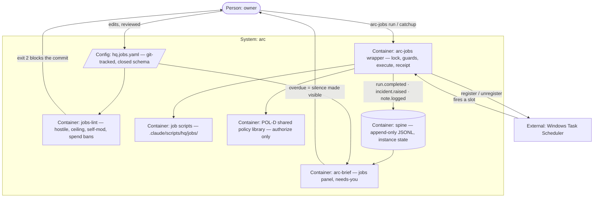

# PLAN.md — arc-scheduler "the heartbeat"

> Lane born by `/arc-kickoff --lane scheduler` on 2026-08-12. Claims **ADR band 0800–0899**
> (ADR-0800 — *not* the 0700s the board advertises; those are held unmerged by `memory`).
> Design source: `docs/strategy/plans/PLAN-scheduler.md` v1.0 — frozen, the decision record.
> SCH-A…SCH-L are locked there. §13's five opens are resolved in ADR-0800/0801/0802/0804/0806.
> Company organs (`docs/adr/`, `docs/retro-log.md`, `tests/`) stay at root (ADR-0053);
> evidence is lane-scoped at `initiatives/scheduler/evidence/phase-NN/` (ADR-0055).

## Goal

Turn every daily arc chore into a receipted, budgeted, policy-checked headless run — a jobs file
in git, one wrapper, the OS's own scheduler — so arc stays daemon-free, the spine records
everything, and **silence becomes visible**.

## Current state

**Stack:** Node ESM scripts under `.claude/scripts/` (zero-dep by convention) · bats for tests ·
3-OS CI (Linux/macOS/Windows) · no framework, no bundler. Windows 11 Home is the host that owns
the canonical spine.

**Entry points:** all verified 2026-08-12 —
`.claude/scripts/engine/arc-run.mjs` (headless runner: `--process --driver auto --budget
inr=N,min=M`; budget stop; contract ladder per ADR-0204; tier pinning via `engine/router.yaml`) ·
`.claude/scripts/hq/arc-event.mjs` (spine emitter; `emit` · `ingest` · `close-day [--date D]`) ·
`.claude/scripts/hq/lib/spine-io.mjs` (`withLock` · `isDayClosed` · `listDays` ·
`writeCloseMarker`) · `.claude/scripts/hq/arc-brief.mjs` (deterministic brief renderer,
golden-fixtured, needs-you group) · `.claude/scripts/hq/lib/policy/` (POL-D shared library:
`authorizeAction`, `authorizeRun`, `resolveEffectivePolicy`) · `.claude/scripts/engine/
yaml-subset.mjs` (the one YAML parser `hq.jobs.yaml` will reuse) · `hq.policy.yaml` (live
ceiling; 4 subjects) · `processes/` (3 files: `commit-msg-draft`, `kickoff-plan`, `review-diff`
— all interactive dev commands, none schedulable, which is why v1 is script-jobs only).

**Conventions:** ADRs banded one century per lane · an explicit `--lane` flag is the only way to
name a lane · a phase closes only via `/arc-phase-done` with CI-green evidence · gates and parsers get
a two-fresh-agent adversarial pass before they are trusted · tests run on CI, never on this box.

**Do-not-touch:** `hq.policy.yaml`, `.claude/settings.json`, `.claude/hooks/**`,
`.claude/scripts/hq/lib/policy/**`, `.claude/scripts/hq/policy-lint.mjs`, `CONSTITUTION.md`,
`.github/workflows/**` — all agent-denied in `permissions.deny` and/or on
`ungrantable_resources` (ADR-0502). **Zero policy-engine code** (ADR-0802) and `docs/evidence/**`
/ `docs/archive/**` frozen.

Engine code: **one named, scoped exception, and nothing else.** `arc-run.mjs` gains the job-stub
refusal guard ADR-0802 owes — a single check on its existing entry-resolution path that reads
`job_stub: true` from the process file and refuses with a non-zero exit before any driver is
selected. The diff is that check alone. SCH-K's `--actor` passthrough stays deferred to the first
LIVE process-job. Naming this exception is the correction of a contradiction in this plan's first
draft, which forbade all engine code while making the guard a Phase-0 exit criterion.

## Success requirements

| REQ | User outcome | Measurable acceptance | Phase | Status |
|---|---|---|---|---|
| REQ-01 | A job that would misbehave is rejected at commit time, before it can ever run | `jobs-lint` exits 2 on ≥12 pinned hostile classes (bad cadence · unknown entry · entry outside `.claude/scripts/hq/jobs/` · missing or forbidden budget key · duplicate name · spend-capability `policy_kind` · credential-looking value · self-modifying entry · ceiling breach · unknown `policy_kind` vs the live subject set) · `--bill` prints the worst-case month · adversarial-pass report committed | 0 | active |
| REQ-02 | Every run, attended or scheduled, takes one path and leaves one receipt | fixtures: per-job overlap → exit 2 + receipt · scheduled run cannot exceed a manual same-kind run — the enforcement DECISION fields only (`mayInvoke`, the denial list, the applied budget cap, the contract-ladder outcome) byte-compared after stripping `actor`, `scheduled_for` and `started_at`, which necessarily differ; process path via the engine's mock driver · git-state skip → `note.logged` · slot floor and `--slot` catchup correctness · every run emits `run.completed` with `actor`/`job`/`scheduled_for`/`started_at`/`outcome` · double-fire → dup-idem quarantined AND surfaced · incident fixtures for crash, overlap and budget · grep-lint proves no second policy read | 0 | active |
| REQ-03 | One command runs everything due, and the brief shows which jobs went quiet | `arc-jobs run` / `catchup` / `list --next 7` green · brief jobs panel is a pure function of (date, jobs file, spine ≤ that day) — `--date D` replay byte-identical against a pinned golden · overdue > 2× cadence emits a needs-you line · `enabled: false` renders *disabled* and never counts overdue · SessionStart fragment lint-proven read-only | 1 | active |
| REQ-04 | The heartbeat runs unattended, and turns itself off rather than run unpoliced | `register`/`unregister` drive the ScheduledTasks module with all 5 power/logon settings written explicitly · next-minute smoke task fires and `LastTaskResult` reads back `0` · `register` exits 2 when policy enforcement fixtures are red (fail-closed fixture) · after `unregister`, a Task Scheduler query returns no task for either job | 2 | active |
| REQ-05 | A week of real unattended running, with the silence detector itself proven | ≥2 jobs scheduled ≥7 days · **zero manual starts proven by an actor query on the spine**, not asserted · one job's OS task removed ≥1 day while its row still reads `enabled: true` → needs-you line captured in evidence · gap audit accounts for every expected slot in the 7 days · §8 metric pack computed from the spine only · `/arc-retro` run | 3 | active |

<!-- These five absorb the design source's eight without dropping an acceptance clause;
     the mapping table is in ADR-0806. -->

## Appetite

**3 days of effort** (elapsed runs longer: Phase 3 is a real proving week, ≥7 days wall-clock).
A constraint, not an estimate — if it blows, we cut a phase or kill the cycle, never extend
silently.

**Tier:** S

**Kill criteria:** Phase 0 not green within 1.5 days → stop and reassess; the cycle dies, the
analysis survives. At 50% burn with Phase 0 open → mandatory scope-cut conversation. At 100% →
cut or kill, never a silent extension. Phase 3 showing <2 jobs worth scheduling → the cron flip
is parked, `register` stays off, and the attended wrapper plus brief panel are kept: they are
already daily value. Any Phase-2 finding of a path that runs unattended without the policy
check → registration revoked until re-fixed and re-fixtured; that is an incident, not a note.

## Architecture (C4 concepts, Mermaid flowchart)

## Key decisions (ADR index)

| # | Decision | Status |
|---|---|---|
| 0800 | scheduler claims century 0800–0899, not the 0700s the board offered | accepted |
| 0801 | the build-out trigger is an owner instruction; its receipt is owed, not cited | accepted |
| 0802 | a job authorizes as a `process:` subject, reusing the closed subject set | accepted |
| 0803 | register via the PowerShell ScheduledTasks module, every power setting explicit | accepted |
| 0804 | the laptop is never woken; missed slots are caught on next wake | accepted |
| 0805 | the idempotent multi-day roll lives in the job, because `close-day` is neither | accepted |
| 0806 | v1 ships two script-jobs; the lexos canary is deferred, not built | accepted |

## Non-negotiables

- No daemon: arc never runs a resident process, and the OS scheduler is the only timer.
- The scheduler layer owns ZERO retries: ADR-0203 and ADR-0204 own the ladder, and a failed run's retry is its next cadence slot.
- Every execution, attended or scheduled, walks one path: lock, guards, execute, receipt.
- Authorization goes only through the shared POL-D library per ADR-0802, and this lane never writes a second reading of policy.
- Money-touching jobs are unschedulable: banned by `jobs-lint` on top of policy's own money law, not merely out of scope.
- The overlap lock is per job and reuses the spine's `withLock` discipline; a second hand-rolled lock is banned.
- This lane numbers ADRs only in 0800-0899 per ADR-0800, and cites no receipt it has not read per ADR-0801.
- A gate or parser is not done until two fresh adversarial agents on different surfaces have attacked it and every hole found is fixed and pinned as a fixture.
- A test that passes proves the assertion held, not that the code ran: assert it RAN before asserting what it printed.
- "Tests green" means green on CI, read per-JOB, at a run whose head SHA is the local HEAD.

## No-gos (explicitly out of scope)

Job dependency graphs (that is a workflow engine) · scheduler-layer retries · GitHub Actions for
any spine-receipted job (ADR-0025 puts the spine in instance state, so CI receipts land on a
throwaway runner) · dynamic or runtime job creation · multi-machine scheduling · push-notification
infrastructure · full cron grammar · a job-history UI · per-job env overrides · money-touching
jobs (banned, not deferred) · **any engine code change except the one named scoped exception in
§ Current state** — the `arc-run` job-stub refusal guard; SCH-K's `--actor` passthrough is owed at
the first LIVE process-job, not this cycle · **any policy-engine code change** (ADR-0802) ·
the `lexos-canary` probe (ADR-0806).

## Rabbit holes

- **Cron grammar** → closed two-form vocabulary only: `daily@HH:MM` and `weekdays@HH:MM`, IST
  fixed. No timezone knob exists to misconfigure.
- **A second YAML parser** → `hq.jobs.yaml` uses the same subset and the same
  `engine/yaml-subset.mjs` the engine already uses.
- **A second policy interpretation** → the wrapper calls POL-D and nothing else, and **a grep is
  not the guard**: retro-log 2026-08-04 records a propose-only grep that missed `fs/promises`,
  `child_process` and async spawn, which a mutant module then walked straight past. REQ-02's check
  parses the wrapper's import and call graph for any authorization-shaped call outside POL-D's
  exports, and ships with a negative control — a mutant wrapper that re-implements an equivalent
  allow/deny decision under a different name must be CAUGHT, or the check has not been tested.
- **Widening the policy subject set** → rejected for this cycle in ADR-0802; jobs reuse the
  existing `process:` subject form instead, at the cost of one refusal guard in `arc-run`.
- **Wake-vs-sleep tuning** → settled by hardware in ADR-0804, not by preference; no further
  power-management work is in scope.
- **Making `close-day` general** → the roll lives in the job (ADR-0805); the spine emitter is
  not touched.

## Assumptions ledger

| Assumption | How we'd know it's wrong (trigger) | Phase that tests it |
|---|---|---|
| Windows queues a missed `StartWhenAvailable` run indefinitely rather than abandoning it after some undocumented window (ADR-0804) | the Phase-3 gap audit finds a slot with no `run.completed` and no catch-up run after a wake — a dropped slot, not a late one | 3 |
| S4U logon can reach the repo on this drive without stored credentials, despite S4U having no documented network access (ADR-0803) | the next-minute smoke task returns a non-zero `LastTaskResult` or the job cannot read the repo | 2 |
| A per-job `processes/` stub plus its `arc-run` refusal guard closes the manual-run surface ADR-0802 opens | the adversarial pass reaches a job script by naming it to `arc-run --process` despite the guard | 0 |
| The owner-applied `hq.policy.yaml` rows land before Phase 0 closes, since no agent can write that file | Phase 0 reaches its DoD with both jobs still returning an L0 denial from `authorizeRun` | 0 |
| Two jobs exercise the overlap lock and incident taxonomy meaningfully enough to trust them (ADR-0806) | the proving week records zero lock contentions and zero incidents of any class, leaving both untested in the real | 3 |
| The wrapper's own slot-floor and idem-key **code** is right on first build — not merely the design behind it | REQ-02's slot-floor and `--slot` catchup fixtures fail on a boundary nobody constructed by hand: a `daily@00:15` IST slot floored against a UTC system clock lands on the wrong date, and the idem key then names a slot that never existed | 0 |

## External dependencies

| Dep | Interface | Fake impl | Real impl | Contract test |
|---|---|---|---|---|
| Windows Task Scheduler | `register(job)` · `unregister(job)` · `query(job) → {exists, settings, lastRunTime, lastTaskResult}` in `.claude/scripts/hq/lib/jobs/scheduler-os.mjs` | in-memory task table asserting the 5 pinned settings from ADR-0803 are written on every register; used by all Phase 0–1 fixtures | PowerShell `ScheduledTasks` module via `child_process` (`Register-ScheduledTask -Force`, `Get-ScheduledTaskInfo`, `Unregister-ScheduledTask`) | Phase 0 against the fake: register→query→unregister round-trip preserves all 5 settings. Phase 2 against the real OS: next-minute throwaway task fires, `LastTaskResult` reads `0`, unregister leaves no residue |

## Pre-mortem (Klein)

| # | Failure cause | Mitigation or accepted |
|---|---|---|
| 1 | Runaway scheduled spend — a job quietly bills every night | REQ-01 ceiling lint is static and runs at commit time, before any run exists; per-run budgets; spend-capability `policy_kind` banned by `jobs-lint` on top of policy's own money law. v1 worst case is ₹0 by construction (all script-jobs). **Mitigated** |
| 2 | Silent job death — the file promises, the OS quietly stopped | REQ-03's derivation makes silence visible; REQ-05's fire-drill proves the detector itself by removing an OS task while the row still says `enabled: true`; ADR-0803 writes the battery settings explicitly because the documented default of `DisallowStartIfOnBatteries` is True. **Accepted residual:** a dead heartbeat is only visible when a brief renders — the OS on-failure toast is configured, not built |
| 3 | Overlap corruption, and its own safety net turning into the hazard: the `job@slot` idem key that dedupes a double-fire also suppresses a **legitimate retry**. A `day-close-roll` (ADR-0805) that crashes after sealing some days and re-runs at the same slot gets its retry receipt DUP_IDEM-quarantined — and quarantine reads as "dedup working as designed", which is precisely how arc-cycle2 lost 100 real receipts and read fine for four days | Overlap itself is **mitigated**: per-job `withLock` reuse (post-#89 semantics) plus the loud exit-2 fixture in REQ-02. The retry-masking half is **OPEN** and carries a named Phase-0 fixture: crash the roll mid-way, re-run it at the same slot, and assert the retry's `sealed` count is *visible on the spine* rather than silently quarantined |
| 4 | The policy interlock is decorative — jobs run unpoliced because the rows never landed | ADR-0802 makes the subject shape real and lint-checked; the assumptions ledger carries the owner-paste dependency with a Phase-0 trigger; REQ-04's fail-closed fixture makes `register` refuse when enforcement fixtures are red. **Mitigated** |
| 5 | Trust collapse from needs-you spam — the group gets ignored | SCH-E's incident taxonomy is closed, repeats supersede rather than accumulate, contract failures are never double-raised (arc-run's own `approval.requested` already lands there), and `enabled: false` never counts overdue. **Mitigated** |

## Phases (risk-ordered)

| Phase | Capability | Appetite | Status |
|---|---|---|---|
| 00 | Steel thread — the law and the wrapper core: `hq.jobs.yaml` schema, `jobs-lint` with its hostile corpus and adversarial pass, wrapper core (per-job lock, slot computation, receipts + idem@slot, git-state guard, POL-D authorization, script timeout, mock-driver process delegation), the two job scripts, the `processes/` stubs and the `arc-run` refusal guard | 1.0 day | pending |
| 01 | The attended heartbeat — `run` / `catchup` / `list --next 7`, the read-only SessionStart nudge, and the deterministic brief jobs panel with its overdue needs-you line | 0.5 day | pending |
| 02 | The cron flip — `register`/`unregister` against the real OS with ADR-0803's five settings, the next-minute smoke, the fail-closed policy gate, and a rehearsed off-switch | 0.75 day | pending |
| 03 | Proving week + retro — ≥2 jobs unattended ≥7 days, zero manual starts by actor query, the fire-drill, the gap audit, the §8 metric pack and `/arc-retro` | 0.5 day | pending |

**Allocation: 2.75 of 3 days, with 0.25 days reserved.** The reserve is not spare capacity — it is
named for **Phase 0 adversarial rework**, because this repo's own equivalent passes returned 43 and
77 real holes against gates that looked correct and passed their own tests, and a phase that budgets
the pass but not the fixing of what it finds has budgeted a ceremony. Phase 0's kill trigger at
**1.5 days** is the hard bound on build-plus-rework together. Phase 2 went 1.0 → 0.75 on evidence:
ADR-0803 retired its two live unknowns (which API can express the settings, and what the settings
are) with citations, leaving execution rather than discovery.

**`kickoff-lint [appetite-sum]` still WARNs here and the warning is knowingly carried.** Its
threshold wants ≥20% unallocated (≤2.4 of 3 days), which on a 3-day four-phase build means cutting
real work to satisfy a heuristic. The reserve is declared instead of the allocation being shaved,
and the kill criteria — not spare days — are what this plan uses to stay inside its appetite.
Recorded here so a retro can judge the threshold against a real build rather than find a silent gap.
