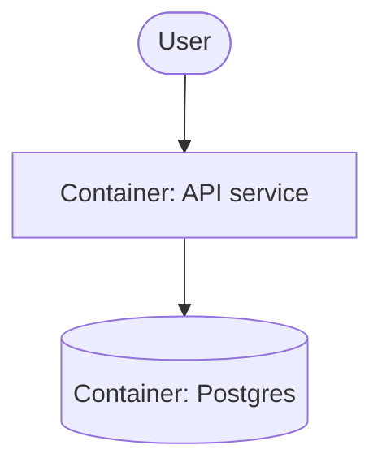

# PLAN.md — Fixture Product

## Goal
Solo maker ships a paid hello-world API to prove the deploy pipeline end to end.

## Success requirements

| REQ | User outcome | Measurable acceptance | Phase | Status |
|---|---|---|---|---|
| REQ-01 | Visitor sees the deployed page | `GET /` returns 200 with body "hello" in < 2s | 1 | active |
| REQ-02 | Owner sees uptime signal | `/health` returns 200 + build sha, checked by cron every 5 min | 1 | active |

## Appetite
2 weeks part-time. This is a constraint, not an estimate — blown appetite means cut or kill.

**Tier:** M

**Kill criteria:** at 50% appetite burnt, if Phase 0 isn't done → mandatory scope-cut
conversation. At 100% → cut or kill, never extend.

## Architecture (C4 concepts, Mermaid flowchart)

## Key decisions (ADR index)

| # | Decision | Status |
|---|---|---|
| 0001 | Postgres over SQLite | accepted |

## Non-negotiables

- Tests per feature — no untested code merges
- No secrets in code — env only
- CI green before merge

## No-gos (explicitly out of scope)
No auth, no billing, no admin UI this cycle — single public endpoint only.

## Rabbit holes
Custom domain + TLS automation → use platform default domain for v1, revisit post-ship.

## Assumptions ledger

| Assumption | How we'd know it's wrong (trigger) | Phase that tests it |
|---|---|---|
| Free tier DB is enough | p95 query > 200ms or storage > 500MB | 1 |

## External dependencies

| Dep | Interface | Fake impl | Real impl | Contract test |
|---|---|---|---|---|
| Postgres | lib/db.ts | lib/db.fake.ts | lib/db.pg.ts | tests/contract/db.test.ts |

## Pre-mortem (Klein)

| # | Failure cause | Mitigation or accepted |
|---|---|---|
| 1 | Deploy pipeline breaks late | Phase 0 deploys day one — steel thread first |
| 2 | Postgres free tier throttles | Assumptions-ledger trigger covers it; ADR 0001 names the fallback |
| 3 | Scope creep past no-gos | /arc-change routing is mandatory; REQ-01/REQ-02 acceptance stays the contract |
| 4 | Appetite blown silently | Burn line + 50% tripwire in PROGRESS; phase 1 is the tripwire |
| 5 | Contract tests drift from real impl | Real-impl pass required before phase 1 closes |

## Phases (risk-ordered)

| Phase | Capability | Appetite |
|---|---|---|
| 0 | Steel thread: deployed hello on fakes | 2 days |
| 1 | Real DB + health endpoint | 3 days |
